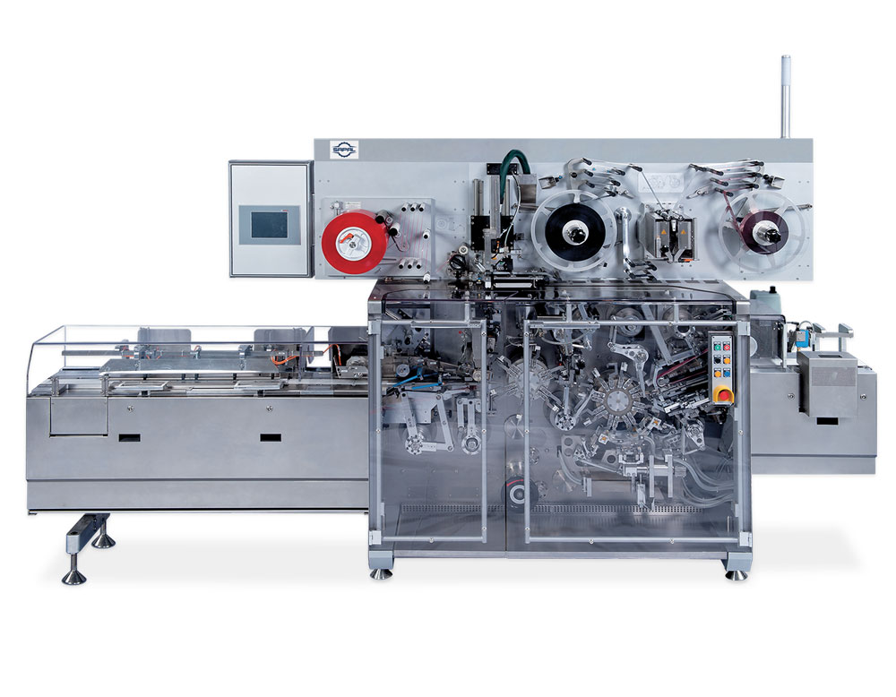
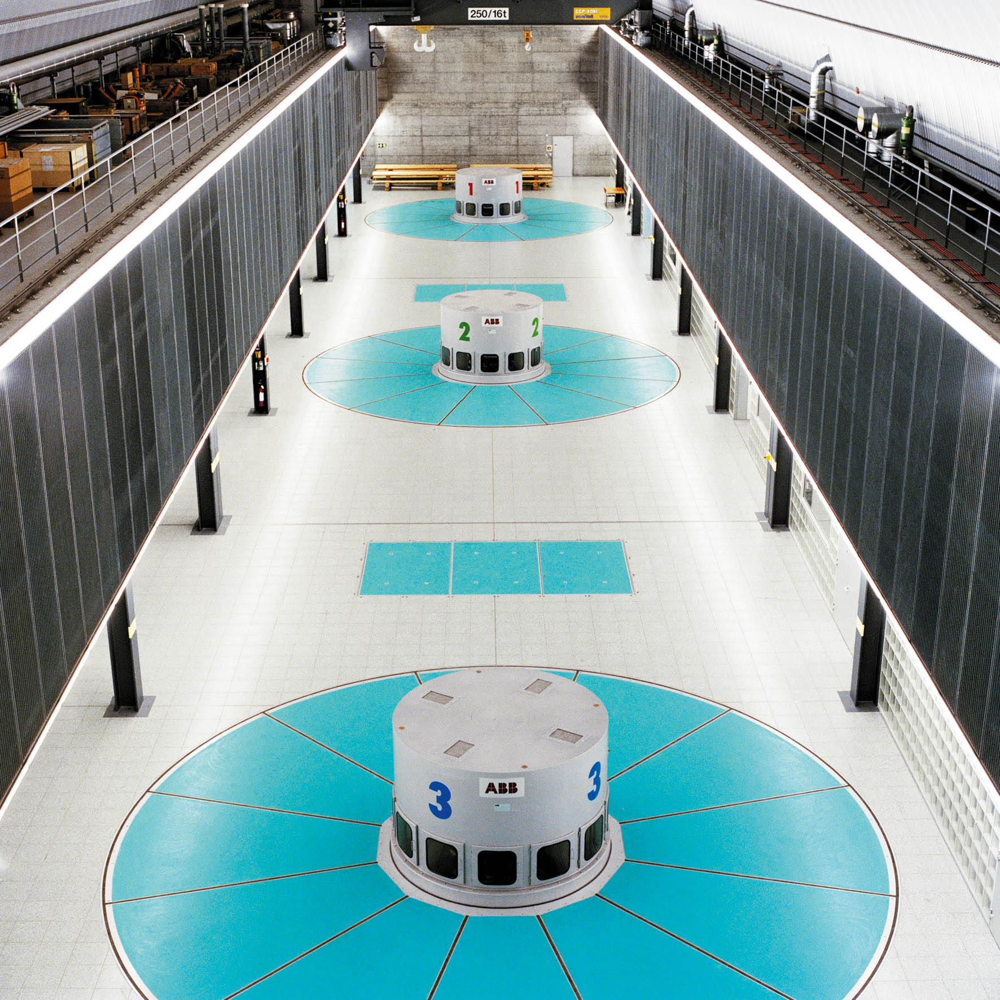
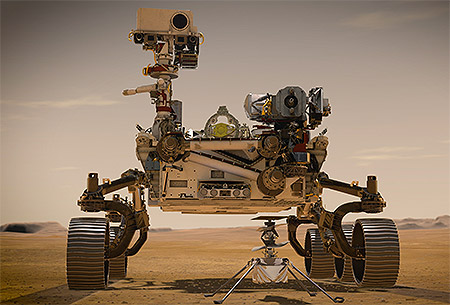

<h1 align="left">
   
  
   
  Industrial Automation Base
   
</h1>

Cours AutB

Author: [Cédric Lenoir](mailto:cedric.lenoir@hevs.ch)

# Module 07 Elements mechatronics software

*Keywords:* **PARAMETER ENCODER PARA**

# Préambule
L'ambition de ce module est de tenter de présenter une technologie qui englobe une grande quantité d'applications très différentes tout en tentant de leur trouver un dénominateur commun.

## Robot cartésien

> Une application qui s'approche très fortement de ce que nous avons dans notre laboratoire.

<figure align="center">
    
    <figcaption>Cartesian robot with 4 axes</figcaption>
</figure>

## Axes électriques dans le monde de la machine outil

<figure align="center">
    
    <figcaption>Source Starrag-Bumotec, 191 néo</figcaption>
</figure>

Ci-dessous, le système d'axe est un peu différent de l'image réele. La pièce est usinée sur l'axe C, puis est reprise par les axes A/W pour terminer la partie de la pièce qui ne pouvait être usinée dans l'axe C.

<figure align="center">
    
    <figcaption>Multi axes system with direct drive, source Bumotec</figcaption>
</figure>

## Une troisième forme d'axes élecrtiques synchronisés

Avant l'apparition des systèmes d'axes synchronisés avec Ethernet Realtime, ce type de machine était synchronisée par un système mécanique. La sychronisation via Ethernet Realtime simplifie le câblage et augmente la flexibilité de la machine pour différentes variantes de produits.

<figure align="center">
    
    <figcaption>Image d'origine Sapal SA à Ecublens</figcaption>
</figure>

## L'hydraulique telle que nous la voyons en Valais

<figure align="center">
    
    <figcaption>Source: www.grande-dixence.ch</figcaption>
</figure>

> D'une certaine manière, une turbine est un moteur qui fonctionne en sens inverse. Ce qui est vrai dans la commande d'axe électrique, dans la mesure où pendant sa phase de décélération, un axe électrique générera de l'énergie qui devra être dissipée, le plus souvent par une résistance thermique.

Certaines commandes d'axe électriques sont conçues pour réinjecter cette énergie dans le réseau.

## Une autre manière de voir l'énergie hydraulique

> Si ce module se concentre sur des commandes d'axes électriques, une grande partie pourrait aussi s'appliquer à des axes hydrauliques.

L'image ci-dessous représente un pont sur le canal Baudouin en Belgique. Tiges de vérin de 340 [mm], puissance totale des pompes électriques qui fournissent la pression d'huile, environ 1000 [kW].

<figure align="center">
    
    <figcaption>Pont en Belgique avec commande hydraulique</figcaption>
</figure>

-    Avantages de l'hydraulique: fortes à très fortes puissance.
-    Inconvénients: complexité et coûts de maintenance.

> Dans la pratique, on parlera plutôt d'entraînements électro-hydrauliques. Les commandes électriques qui fournissent la pression d'huile sont souvent similaires aux commandes d'axe que nous utiliserons dans le cadre des travaux pratiques.

<figure align="center">
    
    <figcaption>Commande d'axe hydroélectrique</figcaption>
</figure>

## Un axe pneumatique
Après l'énergie électrique et hydraulique, l'énergie pneumatique est une troisième solution courament utilisée dans les systèmes industriels pour piloter un axe.

<figure align="center">
    
    <figcaption>Axe pneumatique d'origine Schunk</figcaption>
</figure>

> L'énergie pneumatique est en général fournie par un compresseur qui utilise un moteur électrique. Si la technologie pneumatique est relativement simple à mettre en oeuvre, elle est relativement honéreuse en termes de coût de l'énergie.

## Axe électrique avec un changement d'échelle

EPOS4 Compact 50/5 EtherCAT, digital positioning controller
<figure align="center">
    
    <figcaption>Source: Maxon Group</figcaption>
</figure>

<figure align="center">
    
    <figcaption>Source Maxon The modified EC 32 flat drive</figcaption>
</figure>

> The modified EC 32 flat drive. Nine of these drives are used in the Perseverance rover. The EC 20 flat with GP 22 UP gearhead. DCX 10 motors move the swashplate, which in turn controls the tilt of the rotor blades of the Mars helicopter.

<figure align="center">
    
    <figcaption>The Perseverance rover and the Mars helicopter Ingenuity. Image credit: NASA/JPL-Caltech</figcaption>
</figure>

> Finalement, que ce soit pour piloter un pont de plusieurs tonnes en Belgique ou piloter un moteur de quelques grammes similaire à celui qui est parti sur Mars, certains principes restent relativement similaires.

# Objectif de ce module
Comprendre, paramétrer et découvrir une commande d'axe électrique moderne.

Même si les échelles sont très différentes, une partie des concepts que nous allons aborder lors des cours suivants sont applicables à ces différents domaines d'activité.

> L'important n'est pas nécessairement de connaître tous les composants d'une commande complète. **Il est important par contre de prendre conscience de la complexité qui peuvent se cacher derrière une simple commande de position**. *A contrario*, **il est important de comprendre qu'une commande de haut de gamme permettra de résoudre de nombreux problèmes différents avec une approche accessible**.

> **La majorité des commandes d'axes destinées à être connectées à des PLC sont conçues avec le même type d'architecture**. Le niveau de détail et le nombre d'options sont très variables.

> A la fin de ce module, vous devriez être capable de comprendre les principaux paramètres de ce genre de système.

[Le drive du point de vue de sa connection vers le monde extérieur](README_DriveHw.md)
