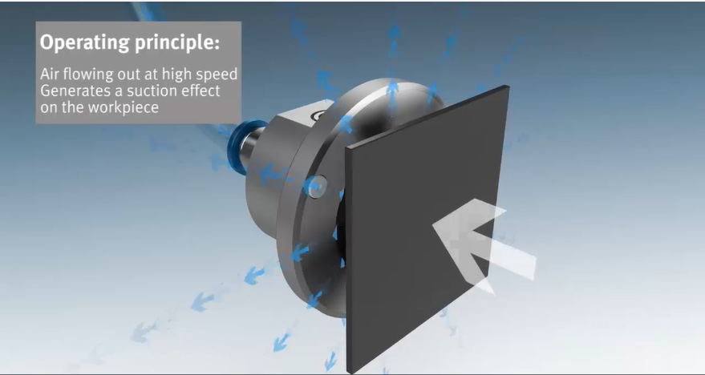
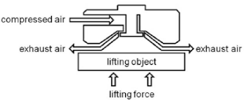
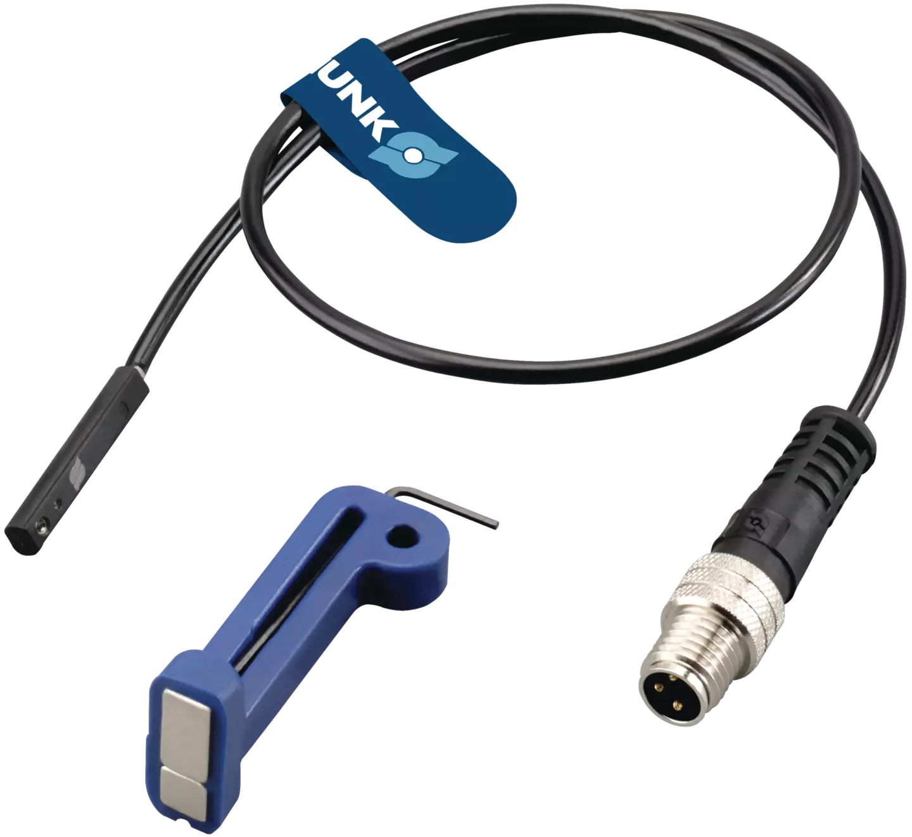
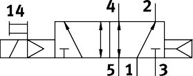
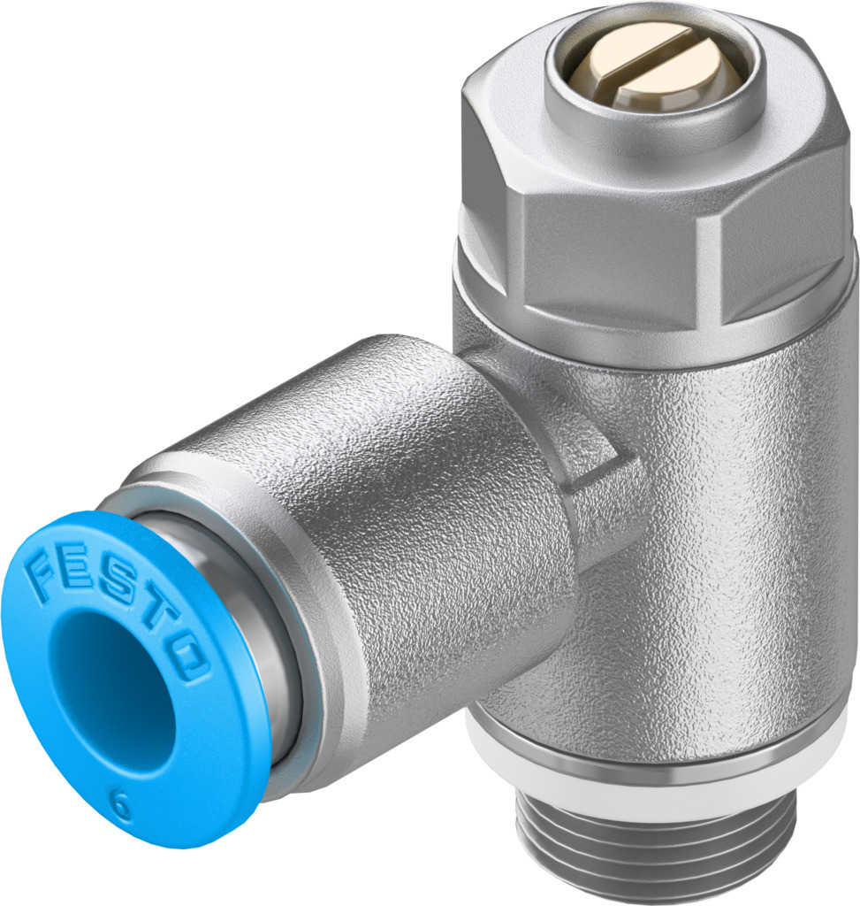
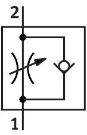
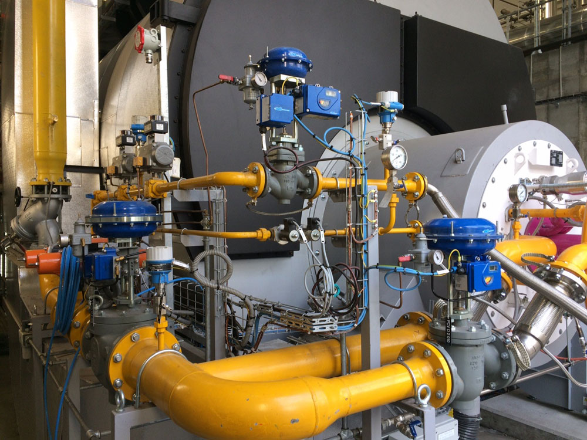
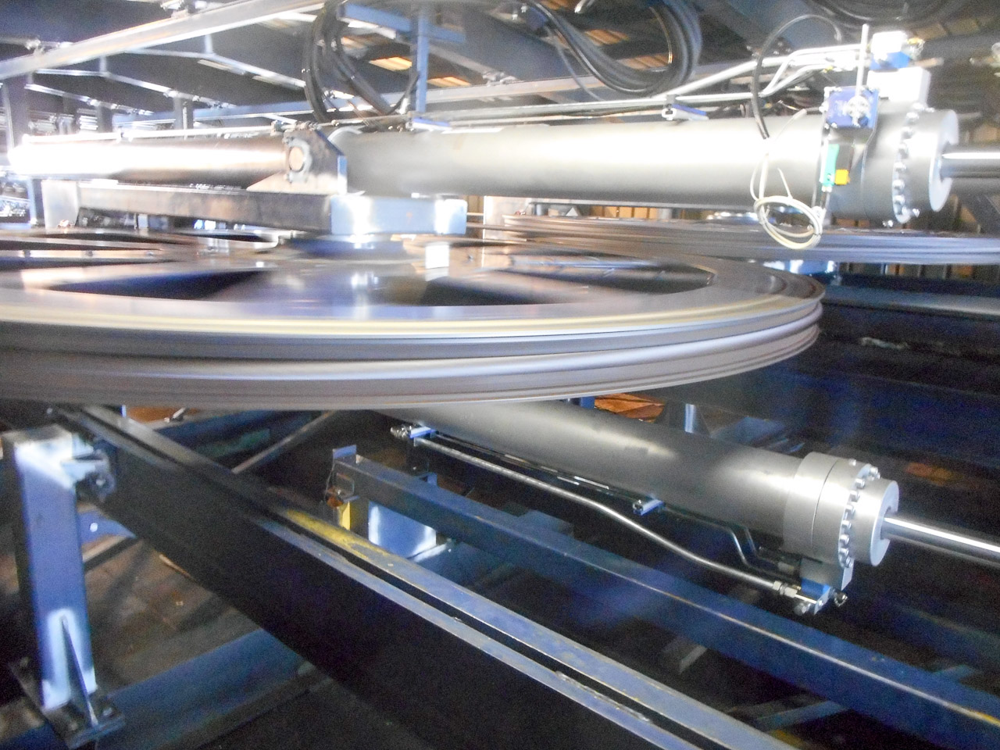
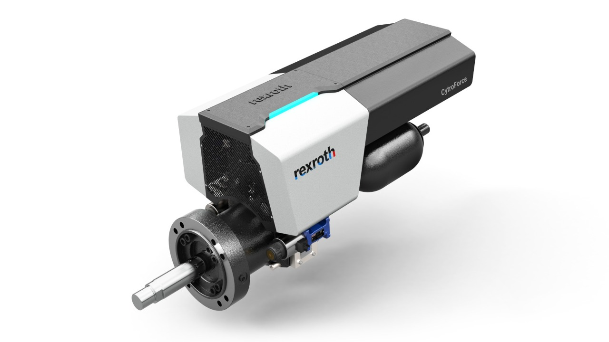

<h1 align="left">
  <br>
  
  <br>
  Industrial Automation Base
  <br>
</h1>

Cours AutB

Author: [Cédric Lenoir](mailto:cedric.lenoir@hevs.ch)

# Module 08 Elements mechatronics

Dieses Modul besteht aus drei Teilen.
- Eine Einführung in die wichtigsten Aktuatortypen nach Art des Energievektors.
- [Eine Einführung in das Motorsteuerungssystem](README_DriveHw_DE.md), mit besonderem Schwerpunkt auf denen im HEVS-Automatisierungslabor.
- [Eine Einführung in die verschiedenen Parameter von Motorsteuerungen](README_DriveSoft_DE.md) vom HEVS-Automatisierungslabor.

## Einführung
Im weiteren Verlauf des Kurses werden wir die Verwendung eines pneumatischen Aktuators und anschließend die elektrischer Aktuatoren im Detail behandeln. Der elektrische Aktuator, insbesondere elektrische Achsen, kann sich schnell als komplex in der Implementierung erweisen. Die Wahl dieses Aktuatortyps ermöglicht es insbesondere, die Kompetenz in robuster Programmierung zu stärken und einige Elemente des PackML in der Praxis anzuwenden.

## Die Hauptenergiequellen in der Automatisierung
-   Elektrizität, wir sprechen von elektrischer Energie.
-   Luft, wir sprechen von pneumatischer Energie.
-   Öl, wir sprechen von hydraulischer Energie.

### Marktanteil von elektrischen gegenüber pneumatischen Antrieben

**Laut Copilot**, Quelle unbekannt.

Elektrische und pneumatische Antriebe haben je nach Branche und Anwendung unterschiedliche Marktanteile. Hier ist eine Übersicht:

**Elektrische Antriebe**:
- Repräsentiert etwa 30–40 % des weltweiten Aktuatormarktes.
- Werden hauptsächlich in Anwendungen verwendet, die hohe Präzision, komplexe Steuerung oder hohe Energieeffizienz erfordern.
- Schnelles Wachstum dank des Aufkommens fortschrittlicher Automatisierungs- und IoT-Technologien.

**Pneumatische Antriebe**:
- Repräsentiert etwa 50–60 % des weltweiten Aktuatormarktes.
- Geschätzt für ihre Einfachheit, niedrigen Anschaffungskosten und Robustheit in anspruchsvollen Industrieumgebungen.
- Dominieren weiterhin bei Anwendungen, die schnelle und sich wiederholende Bewegungen erfordern.

**Diese Zahlen können je nach Region und Branche variieren**, aber der allgemeine Trend zeigt eine zunehmende Nutzung elektrischer Antriebe aufgrund ihrer Flexibilität und Effizienz.

---

## Pneumatische Antriebe
Der pneumatische Antrieb ist wohl der Hauptgrund für dieses Modul. Es ist nicht ausgeschlossen, dass diese Technologie einigen Lesern völlig unbekannt ist, obwohl sie zum Zeitpunkt der Erstellung dieses Dokuments, also im Jahr 2025, noch immer den Großteil der in der Industrie verwendeten Aktuatoren ausmacht.

### Die wichtigsten Arten pneumatischer Antriebe

Es gibt verschiedene Typen pneumatischer Antriebe, die jeweils für bestimmte Anwendungen geeignet sind. Hier sind die wichtigsten:

- **Lineare Pneumatikzylinder**:
  - Erzeugen Sie eine lineare Bewegung.
  - Wird für Aufgaben wie Heben, Bewegen oder Positionieren verwendet.

<div align="center">
    <a href="https://www.schunk.com">
        
    </a>
    <p><em>Pince pneumatique Schunk MPG-plus 40</em></p>
</div>

- **Drehpneumatikzylinder**:
  - Eine Drehbewegung erzeugen.
  - Ideal für Anwendungen, die eine begrenzte Drehung erfordern, wie z. B. Klemmen oder Schwenken.

- **Kolbenlose Zylinder**:
  - Ermöglicht lineare Bewegung ohne externe Stange.
  - Beliebt für Anwendungen mit begrenztem Platz.

- **Pneumatische Klemmen**:
  - Entwickelt zum Greifen und Loslassen von Objekten.
  - Wird in Handhabungs- oder Montagesystemen verwendet.

- **Pneumatische Stoßdämpfer**:
  - Absorbieren Stöße und Vibrationen.
  - Wird häufig zum Schutz empfindlicher Geräte verwendet.

- **Vakuumgreifer**:
  - Verwenden Sie Saugkraft, um Objekte zu greifen.
  - Ideal für die Handhabung flacher oder zerbrechlicher Objekte wie Glas- oder Metallplatten.
  - Wird häufig in automatisierten Handhabungssystemen verwendet.
  
- **Bernoulli-Greifer**
  - Greifer vom Bernoulli-Typ nutzen das Bernoulli-Prinzip, um mithilfe eines Luftstroms eine Hubkraft zu erzeugen. Dieser Greifertyp eignet sich besonders für die Handhabung leichter und zerbrechlicher Gegenstände.
  - Funktionieren
    - **Prinzip**: Ein Luftstrom wird durch eine speziell entwickelte Oberfläche geleitet, wodurch ein Unterdruckbereich entsteht, der das Objekt anhebt.
  - Vorteile
    - **Kein direkter Kontakt mit dem Objekt**, wodurch das Risiko einer Beschädigung verringert wird.
    - Ideal für die Handhabung flacher oder poröser Objekte, wie beispielsweise Papierbögen oder elektronischer Komponenten.
  - Grenzen :
    - Weniger effektiv bei schweren oder nicht flachen Objekten.

  - Anwendungen
    - **Elektronikindustrie**: Handhabung von Leiterplatten.
    - **Lebensmittelindustrie**: Bewegung von Leichtverpackungen.
    - **Drucken**: Handhabung von Papier- oder Kartonbögen.

<div align="center">
    <a href="https://www.festo.com/media/video/en/products/Bernoulli_en_HD_Copyright_fox.mp4">
        
    </a>
    <p><em>Bernoulli Gripper</em></p>
</div>

<div align="center">
        
    <p><em>Bernoulli Gripper Principle Source: ResearchGate</em></p>
</div>

#### Pneumatische Ventile

> Proportionalventile werden in der chemischen Industrie häufig eingesetzt, insbesondere in Umgebungen mit erheblichem Explosionsrisiko. Die Rede ist von Ex- bzw. ATEX-Zonen.

Pneumatische Ventile spielen eine entscheidende Rolle bei der Steuerung pneumatischer Antriebe. Sie ermöglichen die Regulierung von Durchfluss, Richtung und Druck der Druckluft. Hier sind die wichtigsten Arten von pneumatischen Ventilen:

- **2/2 Ventile**:
  - Haben zwei Löcher und zwei Positionen.
  - Wird zum Öffnen oder Schließen eines Luftdurchgangs verwendet.

- **3/2-Ventile**:
  - Hat drei Löcher und zwei Positionen.
  - Wird häufig zur Steuerung einfachwirkender Zylinder verwendet.

- **5/2 Ventile**:
  - Hat fünf Löcher und zwei Positionen.
  - Entwickelt für die Steuerung doppeltwirkender Zylinder.

- **5/3 Ventile**:
  - Hat fünf Löcher und drei Positionen.
  - Ermöglichen erweiterte Funktionen wie Positionshalten oder Luftabsaugung.

- **Proportionalventile**:
  - Ermöglicht eine präzise und kontinuierliche Steuerung von Durchfluss oder Druck.
  - Wird in Anwendungen verwendet, die eine Feinregulierung erfordern.

#### Anwendungsfall mit pneumatischem Greifer.
Die Zellen im HEVS-Automatisierungslabor sind mit einem Original-Schunk-Greifer ausgestattet, der von einem Festo-Distributor gesteuert wird.


<div align="center">
    <a href="https://www.schunk.com">
        
    </a>
    <p><em>Pneumatischer Greifer Schunk MPG-plus 40</em></p>
</div>

<div align="center">
    <a href="https://www.schunk.com">
        
    </a>
    <p><em>Programmierbarer Positionssensor IO-Link</em></p>
</div>

<br>

<div align="center">
    <a href="https://www.festo.com">
        
    </a>
    <p><em>Festo-Händler 5/2</em></p>
</div>

Mit der folgenden Skizze.

Um zu verstehen, wie es funktioniert, sehen Sie sich die Demos an, die über die [Festo-Dokumentation im Anhang](./documentation/Festo_Distributeurs%20a%20voies%20multiples_FR.pdf) oder direkt im Verzeichnis **pneumatic_demos** dieses Moduls verfügbar sind.

Der Schunk-Greifer entspricht einem Zylinder dieses Typs: ``./pneumatic_demos/5-2 DSBC.exe``.

<div align="center">
    <a href="https://www.festo.com">
        
    </a>
    <p><em>Festo-Händler 5/2</em></p>
</div>

On aurait pu y ajouter une restriction en sortie pour limiter la vitesse de fermeture de la pince.

<div align="center">
    <a href="https://www.festo.com">
        
    </a>
    <p><em>Beschränkung Festo 5/2</em></p>
</div>

Avec le croquis suivant:

<div align="center">
    <a href="https://www.festo.com">
        
    </a>
    <p><em>Beschränkung Festo 5/2</em></p>
</div>

> Wer die Firma [Festo](https://www.festo.com) nicht kennt, kann sich gerne an sie wenden, wenn er auf pädagogische Elemente hinweist. Dies ist wahrscheinlich die bestmögliche Informationsquelle in diesem Bereich.

> Eine [Einführung befindet sich im Anhang](./documentation/Festo_Distributeurs%20a%20voies%20multiples_FR.pdf). Leider habe ich kein Äquivalent zu diesem Dokument in deutscher Sprache gefunden, obwohl [Festo](https://www.festo.com) ein Unternehmen deutschen Ursprungs ist.

### Elemente eines pneumatischen Kreislaufs

Ein pneumatischer Kreislauf besteht aus mehreren wesentlichen Elementen, um seine ordnungsgemäße Funktion zu gewährleisten. Hier sind die Hauptkomponenten:

##### 1. Luftaufbereitung
- **Kompressor**: Erzeugt die zum Betrieb des Systems benötigte Druckluft.
- **Filter**: Entfernt Verunreinigungen und Feuchtigkeit aus der Druckluft.
- **Druckregler**: Hält den Druck im Kreislauf konstant.
- **Öler**: Fügt der Druckluft eine dünne Ölschicht hinzu, um Komponenten zu schmieren.

##### 2. Aktuatoren
- **Einfachwirkender Zylinder**: Verwendet Druckluft, um Bewegungen nur in eine Richtung auszuführen, mit einer Feder für die Rückstellung.
- **Doppeltwirkender Zylinder**: Verwendet Druckluft, um Bewegungen in beide Richtungen auszuführen.
- **Pneumatikmotor**: Wandelt die Energie der Druckluft in eine Drehbewegung um.

##### 3. Vertriebspartner
- **3/2-Regler**: Steuerung einfachwirkender Zylinder.
- **5/2-Regler**: Steuern doppeltwirkende Zylinder.
- **5/3-Regler**: Ermöglichen eine komplexere Steuerung mit drei Positionen.

##### 4. Rohre und Armaturen
- **Schläuche**: Transportieren Druckluft zwischen den verschiedenen Komponenten.
- **Armaturen**: Verbinden Sie die Rohre mit den Schaltungskomponenten.

##### 5. Zubehör
- **Schalldämpfer**: Reduziert den Lärm von Luftauslässen.
- **Sensoren**: Erkennen von Positionen oder Drücken zur automatischen Steuerung.
- **Absperrventile**: Ermöglichen die Isolierung eines Teils des Kreislaufs für Wartungsarbeiten.

Durch die entsprechende Kombination dieser Elemente ist es möglich, pneumatische Schaltkreise zu entwerfen, die für eine große Bandbreite industrieller Anwendungen geeignet sind.

> Achtung! **Anders als man auf den ersten Blick denken könnte, ist pneumatische Energie nicht unbedingt eine ökologische Energie.** Sie ist relativ teuer. Ein Kompressor muss ständig laufen und die Luft wird im Allgemeinen geschmiert, wodurch am Ende des Zyklus eine beträchtliche Menge Öl in der Umgebung verbleibt.

#### Diagramm eines pneumatischen Kreislaufs

Hier ist eine typische Darstellung eines pneumatischen Kreislaufs, vom Kompressor bis zum Zylinder:

<div align="center">


</div>

#### Regelventile
Sie müssen sich nur ein P&ID-Diagramm ansehen, um zu erkennen, dass pneumatische Steuerventile oft die am häufigsten vorkommenden Elemente eines Prozesses sind.

<div align="center">
    
    <p><em>Vannes et diagramme P&ID</em></p>
</div>

<div align="center">
    <a href="https://www.samsongroup.com">
        
    </a>
    <p><em>Original Samson-Steuerventil</em></p>
</div>

##### Prinzip eines Regelventils

###### Funktionsweise
- **Positionierung**: Das Ventil ist mit einem Antrieb (pneumatisch, elektrisch oder hydraulisch) ausgestattet, der die Position des Verschlusses anpasst, um den Durchgang der Flüssigkeit zu steuern.
- **Steuersignal**: Ein Signal (oft 4–20 mA oder pneumatisch) wird an den Antrieb gesendet, um die Position des Ventils zu bestimmen.
- **Feedback**: Eingebaute oder externe Sensoren messen Flüssigkeitsparameter und passen das Ventil in Echtzeit an, um die gewünschten Bedingungen aufrechtzuerhalten.

###### Arten von Fensterläden
- **Globus**: Ermöglicht eine präzise Regelung, wird häufig für Anwendungen verwendet, die eine Feinsteuerung erfordern.
- **Butterfly**: Geeignet für hohe Durchflussraten bei reduziertem Druckverlust.
- **Kugelhahn**: Ideal für Anwendungen, die ein schnelles Öffnen/Schließen erfordern.
- **Membran**: Wird für ätzende Flüssigkeiten oder sterile Umgebungen verwendet.

###### Anwendungen
- **Chemieindustrie**: Steuerung chemischer Reaktionen durch Anpassung des Reaktantenflusses.
- **Wasseraufbereitung**: Regulierung der Durchflussraten in Filter- oder Verteilungssystemen.
- **Energie**: Flüssigkeitsmanagement in thermischen oder hydraulischen Kraftwerken.

###### Vereinfachtes Diagramm

<div align="center">


</div>

<br>

<div align="center">
    <a href="https://www.sart-von-rohr.fr">
        
    </a>
    <p><em>Original-Quellensteuerventile: Sart von Rohr</em></p>
</div>

---

## Hydraulischer Antrieb
Hydraulische Aktuatoren stellen nur einen kleinen Teil der auf dem Markt erhältlichen Aktuatoren dar. Allerdings gibt es in unserer Region zumindest zwei Tätigkeitsbereiche, in denen dieser Typ hydraulischer Wagenheber zu finden ist.

In einem Turbinenkraftwerk, hier dem Kraftwerk Veytaux:

<div align="center">
        
    <p><em>Hydraulikzylinder Source: Sika</em></p>
</div>

Dans une installation de remontée mécanique, pour tendre le câble.

<div align="center">
        
    <p><em>Hydraulikzylinder Source: www.aixhydro.fr</em></p>
</div>

### Elemente eines hydraulischen Steuerkreises

Ein hydraulischer Steuerkreis verwendet eine Flüssigkeit, normalerweise Öl, um Kraft zu übertragen und Komponenten wie Hydraulikzylinder oder Motoren zu betreiben. Hier sind die Hauptelemente einer solchen Schaltung:

#### 1. Energiequelle
- **Hydraulikpumpe**: Erzeugt den für den Betrieb des Systems erforderlichen Ölfluss.
- **Reservoir**: Enthält das Hydrauliköl und ermöglicht dessen Abkühlung und Beruhigung.

#### 2. Flüssigkeitsbehandlung
- **Hydraulikfilter**: Entfernt Verunreinigungen, um Komponenten zu schützen.
- **Kühler**: Hält die Öltemperatur in einem akzeptablen Bereich.
- **Füllstands- und Temperaturanzeige**: Ermöglicht Ihnen, den Zustand des Öls zu überwachen.

#### 3. Aktuatoren
- **Hydraulikzylinder**: Wandelt hydraulische Energie in lineare Bewegung um.
- **Hydraulikmotor**: Wandelt hydraulische Energie in Drehbewegung um.

#### 4. Vertriebspartner
- **4/3-Verteiler**: Ermöglicht die Steuerung doppeltwirkender Zylinder mit drei Positionen (Vorwärts, Stopp, Rückwärts).
- **Proportionalverteiler**: Ermöglichen eine präzise Steuerung von Durchfluss und Druck.

#### 5. Rohre und Armaturen
- **Hydraulikschläuche**: Transportieren Öl zwischen Komponenten.
- **Armaturen**: Sorgen Sie für die Abdichtung und Verbindung der Rohre.

#### 6. Regulierung und Sicherheit
- **Überdruckventil**: Schützt den Kreislauf vor Überdruck.
- **Durchflussregler**: Steuert die Geschwindigkeit der Aktuatoren.
- **Hydraulikspeicher**: Speichert Energie für gelegentlichen Bedarf oder bei einem Stromausfall.

#### 7. Zubehör
- **Druckmessgeräte**: Messen den Druck im Kreislauf.
- **Absperrventile**: Ermöglichen das Absperren eines Teils des Kreislaufs zu Wartungsarbeiten.
- **Sensoren**: Erkennen von Positionen oder Drücken zur automatischen Steuerung.

Mit diesen richtig dimensionierten und montierten Elementen können Hydraulikkreisläufe entworfen werden, die an verschiedene Anwendungen angepasst sind, insbesondere in der Mobilhydraulik, beispielsweise in Baumaschinen oder landwirtschaftlichen Geräten.

### Pilotierung
Es gibt Antriebe, die den Druck über eine Hydraulikpumpe und die Bewegung steuern können und die auf der Schnittstellenebene eine Steuerung eines Hydraulikzylinders mehr oder weniger auf die gleiche Weise ermöglichen wie Antriebe für elektrische Achsen, die wir weiter unten etwas genauer betrachten werden. Für diese Art von Anwendung gibt es auch eine Reihe standardisierter Funktionsblöcke: [Funktionsblöcke für Motion Control Teil 6 – Fluid Power Extensions](./documentation/plcopen_motion_control_part_6_version_2.0.pdf)

<div align="center">
    <a href="https://www.boschrexroth.com/en/ch/connected-hydraulics/products/cytroforce/">
        
    </a>
    <p><em>Rexroth Cytroforce, Hydraulikzylinder</em></p>
</div>

## Diagramm eines Hydraulikkreislaufs

Hier ist eine typische Darstellung eines Hydraulikkreislaufs, von der Hydraulikpumpe bis zum Zylinder:


Dieses Diagramm zeigt die Hauptkomponenten eines Hydraulikkreislaufs und ihre Verbindung zueinander. Die Hydraulikpumpe erzeugt den Ölstrom, der gefiltert wird, bevor er zum Verteiler geleitet wird. Der Verteiler steuert die Bewegung des Hydraulikzylinders, während das Öl zum Behälter zurückkehrt, um gekühlt und wiederverwendet zu werden.

---

## Aktuatoren, elektrische Achsen
In den Übungen 5, 6 und 7 werden wir elektrische Achsen verwenden. Neben der Steuerung einer mechatronischen Einheit werden hierdurch mehrere Ziele verfolgt.

- Intuitiver Einstieg in ein komplexes Regelungssystem.
- Verwaltung eines komplexen Systems durch robuste Programmierung.
- Einfacher Einstieg in Mehrachssysteme.

### Präambel
Hier stellen wir den Fall von Achsen vor, die aus Synchronmotoren bestehen, auch Permanentmagnete oder PMSM genannt: Permanentmagnet-Synchronmotor, in der Position gesteuert.

Aus Sicht der Steuerung durch eine SPS bereitet die Steuerung eines Motors hinsichtlich Drehzahl, Frequenz oder einfach über ein Schütz im Allgemeinen deutlich weniger Probleme.

### Steuerung eines Permanentmagnetmotors mit PLCopen und EtherCAT

#### Einführung
Die Steuerung eines Permanentmagnetmotors basiert auf einer Steuerkette, die fortschrittliche Technologien wie PLCopen für die Programmierung und EtherCAT für die Echtzeitkommunikation integriert. Diese Kombination ermöglicht eine präzise und effiziente Steuerung von Motoren in industriellen Anwendungen.

---

#### Principe de Fonctionnement

#### Funktionsprinzip

1. **Permanentmagnetmotor**:
   - PMSM verwendet Permanentmagnete, um ein Magnetfeld im Rotor zu erzeugen, wodurch eine externe Erregung überflüssig wird.
   - Der Antrieb erfolgt über einen Wechselrichter, der dreiphasige Spannungssignale zur Steuerung von Drehmoment und Geschwindigkeit erzeugt.

2. **PLCopen**:
   - PLCopen ist ein Standard für die Programmierung industrieller SPS, basierend auf der Norm IEC 61131-3.
   - Es bietet standardisierte Funktionsblöcke für die Bewegungssteuerung, wie Positionierung, Geschwindigkeit und Drehmoment.
   - Diese Funktionsblöcke vereinfachen die Integration und Steuerung von Permanentmagnetmotoren.

Mit PLCopen können Sie eine große Bandbreite an Motoren nach dem gleichen Prinzip steuern, von wenigen Watt bis zu mehreren zehn Kilowatt, das Prinzip bleibt dasselbe. Einschließlich, wie oben gezeigt, für bestimmte Bereiche hydraulischer Achsen.

<div align="center">
    <a href="https://www.maxongroup.com">
        
    </a>
    <p><em>Drive EPOS4 Compact EtherCAT Original Maxon</em></p>
</div>

<div align="center">
    <a href="https://www.maxongroup.com">
        
    </a>
    <p><em>Original Maxon Motor und Getriebe</em></p>
</div>

3. **EtherCAT**:
   - EtherCAT ist ein Echtzeit-Kommunikationsprotokoll, ideal für Anwendungen, die eine präzise Synchronisierung erfordern.
   - Es ermöglicht eine schnelle und zuverlässige Kommunikation zwischen der Steuerung (SPS) und den Motorantrieben.
   - Steuerdaten (Drehzahl, Drehmoment, Position) und Rückmeldedaten (Strom, Ist-Position) werden in Echtzeit ausgetauscht.

EtherCAT ist in der Westschweiz der wohl am weitesten verbreitete Feldbus zur Steuerung von Motoren. Dieser Bus ist ursprünglich für diese Art von Anwendung konzipiert. Bei HEVS-Automatisierungszellen erfolgt die Kommunikation zwischen zwei Antrieben über EtherCAT, das alle 2 [ms] eine Position von der Hauptsteuerung der X-Achse an die Y- und Z-Achse sendet.

<div align="center">
    
    <p><em>EtherCAT dans le laboratoire d'automation de la HEVS</em></p>
</div>

#### Pilotierungsschritte

1. **Systemkonfiguration**:
   - Definieren Sie die Motorparameter (Leistung, Nenndrehmoment, Höchstgeschwindigkeit).
   - Konfigurieren Sie den Wechselrichter und den Antrieb für den Permanentmagnetmotor.
   - Konfigurieren Sie das EtherCAT-Netzwerk so, dass alle Knoten (SPS, Antrieb, Sensoren) einbezogen werden.

2. **Achseneinstellungen anpassen**
   - Implementieren Sie PID-Regelkreise, um Geschwindigkeit oder Drehmoment nach Bedarf anzupassen.

3. **Programmierung mit PLCopen**:
   - Verwenden Sie Funktionsblöcke wie „MC_Power“, „MC_MoveVelocity“ oder „MC_MoveAbsolute“, um den Motor zu steuern.

4. **Kommunikation über EtherCAT**:
   - Synchronisieren Sie die Steuer- und Rückmeldesignale zwischen der SPS und dem Antrieb.
   - Sorgen Sie für eine geringe Latenz für eine präzise Motorsteuerung.

5. **Ausführung und Überwachung**:
   - Starten Sie das PLCopen-Programm zur Steuerung des Motors.
   - Überwachen Sie die Leistung in Echtzeit über EtherCAT (Drehzahl, Drehmoment, Temperatur).

> **Bitte beachten**: Die Inbetriebnahme von Motoren, Encodern und Antrieben verschiedener Hersteller kann eine komplexe Aufgabe sein.
---

#### Vorteile dieses Ansatzes
- **Präzision**: Präzise Drehzahl- und Drehmomentregelung dank PLCopen und EtherCAT.
- **Reaktionsfähigkeit**: Echtzeitkommunikation für schnelle Anpassungen.
- **Interoperabilität**: Verwendung offener Standards für eine einfache Integration mit unterschiedlichen Geräten.

---

#### PLCopen-Codebeispiel

Hier ist ein Beispielcode zum Ansteuern eines Permanentmagnetmotors mit PLCopen:

```iecst
// Get access to the axis
VAR_GLOBAL
	X_Axis: MB_AXISIF_REF := (AxisName := 'Axis_x', AxisNo := 1);
END_VAR
```

```iecst
PROGRAM Main
VAR
	mcReadActualPos  : MC_ReadActualPosition;
	mcReadStatus     : MC_ReadStatus;
	mcPower          : MC_Power;
	mcMoveAbs        : MC_MoveAbsolute;
END_VAR

//
//	Axis code abstract, call to FB only
//
mcReadStatus(Axis := X_Axis,
             Enable := TRUE);

mcReadActualPos(Axis := X_Axis,
                Enable := TRUE,
                Position => absIsPosition);

mcPower(Axis := X_Axis,
		Enable := NOT (actualState = E_PackState.eAborted));

mcMoveAbs(Axis := X_Axis,
          Velocity := stSetParam.rVelocity_m_s,
          Acceleration := stSetParam.rAcceleration_m_s2,
          Deceleration := stSetParam.rDeceleration_m_s2,
          Jerk := stSetParam.rJerk_m_s3); 

mcMoveAbs.Execute := (axisExecute = E_AxisExecute.eSetAbsolutePosition) OR
                     (axisResetting = E_AxisResetting.eMotionInit)      OR
                     (axisStarting = E_AxisStarting.eMotionStarting);
```

---
[Der Antrieb unter dem Gesichtspunkt seiner Verbindung zur Außenwelt](README_DE.md)
