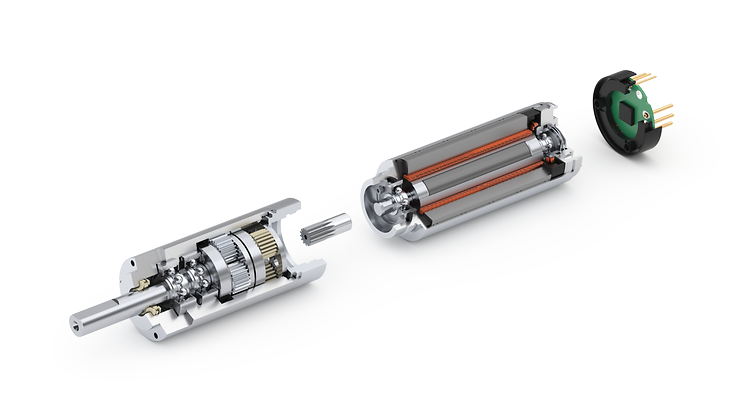
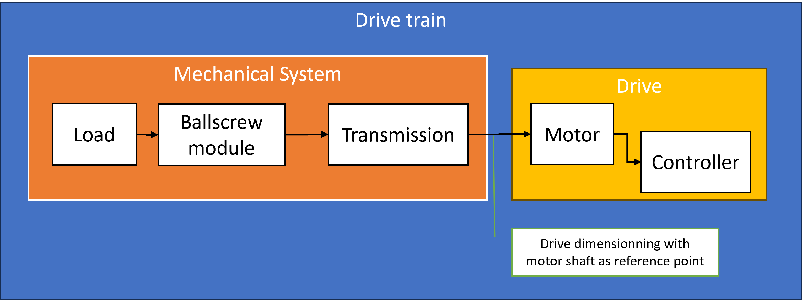

<h1 align="left">
   
  
   
  Industrial Automation Base
   
</h1>

Cours AutB

Author: [Cédric Lenoir](mailto:cedric.lenoir@hevs.ch)

# Modul 09 das Antrieb, Hardware.
Nachfolgend finden Sie die verschiedenen Ansichten eines bestimmten Achssteuerungssystems. Die meisten industriellen elektrischen Achssteuerungen weisen die gleichen Eigenschaften auf. Das System bleibt grundsätzlich dasselbe:

- Steuern Sie einen Motor über eine dreiphasige Stromversorgung.
- Verwenden Sie einen Encoder, um die Position der Achse zu steuern.
- Bieten Sie ein Sicherheitssystem (STO, Safe Torque Off) an, das bei den meisten Achsensteuerungen auf dem Markt standardmäßig vorhanden ist.
- Erlauben Sie eine Verbindung mit einem Echtzeit-Ethernet.

## Ein mit Ethercat ausgestatteter Antrieb zur Steuerung von Motoren mit wenigen Watt

<figure align="center">
    
    <figcaption>EPOS4 Bildquelle Maxon</figcaption>
</figure>

- Im weiteren Verlauf dieses Kurses werden wir allgemein von Motoren sprechen, die über 3 AC 400[V]-Phasen betrieben werden, während es sich beim Maxon-Antrieb um einen kleinen Gleichstrommotor handelt.
- In diesem Kurs geht es nicht um den analogen Teil der Motoren, sondern um die Steuerung der elektrischen Achse mit einigen Konfigurationskonzepten. Ebenso liegen die mechanischen Einschränkungen des unten aufgeführten Getriebes außerhalb des Zuständigkeitsbereichs.

<figure align="center">
    
    <figcaption>Maxon drive systems brushless dc motors stage</figcaption>
</figure>

# AC/DC-Stromversorgung

|Netzeingang mit einfachem Gleichrichter|Netzeingang mit geregelter Stromversorgung|
|-----------|--------------|
|||

In der Praxis besteht der Unterschied zwischen beiden vor allem darin, dass die geregelte Stromversorgung den Betrieb des Motors mit höheren Drehzahlen ermöglicht. Der große Unterschied besteht darin, dass geregelte Netzteile eine höhere Gleichspannung liefern, in der Größenordnung von 750 VDC im Vergleich zu etwa 600 VDC bei einem ungeregelten Netzteil. Manchmal muss man vorsichtig sein, da nicht alle Motoren für diesen Spannungsunterschied ausgelegt sind.

> In seltenen Fällen, zum Beispiel bei Spindeln von schnelllaufenden Motoren mit Asynchronmotor, ermöglichen geregelte und stabilere Spannungsversorgungen auch einen besseren Betrieb des Motors an den Grenzen dieser Kapazitäten.

Nehmen wir das Beispiel des Motors MS2N04-D0BQN der X-Achse aus dem Automatisierungslabor.

|Ungeregelte Stromversorgung|Geregelte Stromversorgung|
|-----------|--------------|
|||

Aber auch geregelte Stromversorgungen ermöglichen mitunter die Rückeinspeisung von Bremsenergie ins Netz.

> Einige Systeme arbeiten mit unterschiedlichen Spannungen.
<figure align="center">
    
    <figcaption>Bildquelle Jenny Science, Pick and Place mit 48 Motoren [Vdc]</figcaption>
</figure>

> Einige seltene Systeme arbeiten ein- oder zweiphasig.
<figure align="center">
    
    <figcaption>Bildquelle Linmot, Elektrozylinder auf zwei Phasen</figcaption>
</figure>

Die gängigsten Systeme funktionieren nach folgendem Prinzip:

<figure align="center">
    
    <figcaption>Übersicht über die Stromversorgung des X-Achsen-Motors</figcaption>
</figure>

# Antriebe aus dem HES-SO Valais-Wallis-Automatisierungslabor.
|Single Axis X|Double Axis Y-Z|
|-----------|--------------|
|||

Der XCS-Wandler versorgt den XMD-Wandler mit einer Gleichspannung von etwa 600 [Vdc].

## Front View

<figure align="center">
    
    <figcaption>Electrical Drive Front View</figcaption>
</figure>

### DC-Bus-Anschluss (hier XD02).
Der hier gezeigte Antrieb, derjenige, in dem sich der SPS-Prozessor befindet, X-Achse, wird mit 3x400 [Vac] betrieben. Sein AC/DC-Wandler ist leistungsstark genug, um andere Antriebe mit Gleichspannung zu versorgen. Der zweite Antrieb im Labor, für die Y- und Z-Achse, enthält keinen AC/DC-Wandler, er wird über den DC-Bus der X-Achse mit Strom versorgt.

## Sicherheit (hier XG41)
### Sicherheit, STO, Safe Torque Off
Die meisten auf dem Markt erhältlichen Antriebe dieser Kategorie verfügen über eine grundlegende Sicherheitsfunktion, die über einen speziellen Anschluss, im Falle des Labors über einen Not-Aus-Taster, die Stromfreiheit im Motor gewährleistet.

> Bitte beachten Sie, dass es sich bei Sicherheitsfunktionen in vielen Fällen um Optionen handelt, die nur bei Bestellung verfügbar sind. **Wenn wir die Laborachsen beispielsweise um eine SLS-Funktion (Safe Limited Speed) erweitern würden, müssten neue Systeme bestellt werden!**. Es ist wichtig, die Sicherheitsbeschränkungen zu kennen, bevor Sie die Ausrüstung bestellen.
 
> Drehmoment = Strom x Nm/A.

Die Charakteristik von Permanentmagnet-Synchronmotoren umfasst meist einen als Konstante angenäherten Parameter: Konstantes Drehmoment: [Nm/A].

<figure align="center">
    
    <figcaption>Motor Technical Data Example</figcaption>
</figure>

<figure align="center">
    
    <figcaption>Plage de travail d'un moteur synchrone</figcaption>
</figure>

Es gibt andere Arten von Sicherheitsfunktionen, SLS Safe Limited Speed ​​und SOS Safe Operating Stop, bei denen es sich häufig um Optionen handelt, die bei der Bestellung angegeben werden müssen und später nicht hinzugefügt werden können.
Die Sicherheit kann fest verdrahtet sein oder über den Echtzeit-Ethernet-Bus ausgeführt werden.

 <figure align="center">
    
    <figcaption>Logique câblée vs FSoE = FailSafe over EtherCAT</figcaption>
</figure>

## Analoge Hilfsein-/ausgänge, hier XG31
In bestimmten Fällen ist es weiterhin möglich, eine elektrische Achssteuerung über eine Reihe von analogen/digitalen Ein-/Ausgängen zu nutzen. Mit der weit verbreiteten Verwendung von Echtzeit-Ethernet-Bussen in SPS gehört diese Art der Steuerung langsam der Vergangenheit an.

In bestimmten Fällen ist es immer noch notwendig, schnellere Signale zu haben, als es ein Echtzeit-Ethernet zulässt, zum Beispiel ein schnelles Ende des Hubs für einen Messtaster, unten ein Beispiel von Renishaw.

 <figure align="center">
    
    <figcaption>Accuracy Machine Tool Touch Probes, Source Renishaw</figcaption>
</figure>

## Feldbus, hier XF50, XF51, XF24 und XF24
Für die Verbindung mit Realtime Ethernet werden die Anschlüsse XF50, XF51, XF24 und XF24 verwendet. Typischerweise bieten Hersteller nur einen Feldbustyp an.
Manchmal besteht die Möglichkeit, bei der Bestellung eine Option auszuwählen, die jedoch nicht geändert werden kann, beispielsweise Linmot. Manchmal kann dieser Bus konfiguriert werden, aber das kommt selten vor, Rexroth ist der einzige Fall, den ich kenne.

Im Labor wird der X-Antrieb mit einem Ethercat-Master und einem Profinet-Slave ausgestattet.
Der Profinet-Slave befindet sich in der Vorproduktion, Vorabversion und ist noch nicht im Einsatz.

## Motor, hier XD03
Motoranschluss, meist dreiphasig, es gibt jedoch einige seltene Motoren, die zweiphasig arbeiten, Linmot. Die Antriebe für zwei Phasen sind herstellerspezifisch.

## Bremse XG03
In bestimmten Fällen ist es erforderlich, eine integrierte oder zusätzliche Bremse vorzusehen.
Es ist wichtig zu beachten, dass die Bremse, insbesondere die in einen Motor integrierte Bremse, nicht dazu gedacht ist, den Motor abzubremsen, sondern ihn in Position zu halten, wenn die elektrische Servosteuerung nicht aktiv ist.

## XG03 Temperaturfühler
> Was den Einsatzbereich eines Motors letztlich generell einschränkt, ist seine Temperatur.

Ohne die Gefahr der Zerstörung elektrischer Leiter durch Schmelzen, des vorübergehenden Verlusts magnetischer Eigenschaften oder des Verlusts von Magneten und anderer temperaturbedingter Risiken könnte der Einsatzbereich eines Motors erheblich erweitert werden.

Einige Motoren sind in der Version **Zwangsbelüftung** oder **Wasserkühlung** erhältlich, um bei gegebener Größe eine bessere Leistung zu erzielen.

> Temperaturfühler werden im Allgemeinen nicht direkt zur Temperaturanzeige verwendet. Im dynamischen Betrieb können sich die verschiedenen Teile des Motors in sehr unterschiedlichen Temperaturbereichen befinden, insbesondere wenn der Motor Bewegungen mit sehr kleinen Amplituden ausführt. Der Temperatursensor wird im Allgemeinen als Referenzbasis für ein Motortemperaturmodell verwendet. Dieses Modell überwacht die Motortemperatur.

## Encoder, hier XG20
Die Encoder-Spezifikation ist oft die am komplexesten zu verwaltende Schnittstelle.

Es gibt mehrere Encoder-Signalübertragungstechnologien, von denen einige proprietär sind.

Einige Antriebe sind mit sogenannten Multi-Encoder-Schnittstellen ausgestattet. Die Laborantriebe sind lediglich mit einem Eingang für einen ACURO-Link-Digital-Encoder ausgestattet.

### Einige Beispiele
1. En-Dat 2.2, digital, proprietär Heidenhain.
2. Sin-Cos, generisch
3. TTL, generisch
4. Resolver, generisch
5. IO-Link, generisch
6. DRIVE-CLiQ, Eigentum von Siemens
7. Profinet
8. Hyperface,
9. Hyperface DSL
10.SSI
11. …

## Hilfsencoder
Für einige Anwendungen kann es erforderlich sein, einen zweiten Encoder hinzuzufügen. Um ein Beispiel zu nennen: Beim Antrieb mit einer Kugelumlaufspindel, wie im Fall des Labors 23N.411, wird der Drehgeber am Motor für den Geschwindigkeitsregler verwendet, aber um mechanische Verformungen auszugleichen, könnte dies der Fall sein Es kann erforderlich sein, einen Linearencoder an der Kugelumlaufspindel anzubringen, um die endgültige Positionsgenauigkeit zu gewährleisten.

Zweites Anwendungsbeispiel eines zweiten Encoders, für Hochgeschwindigkeits-Bearbeitungsspindeln an einer Bearbeitungsmaschine. Ein genauer Encoder für die Winkelpositionierung der Spindel bei niedriger Geschwindigkeit liefert bei hoher Geschwindigkeit ein Signal mit einer zu hohen Frequenz. Die Spindel wird mit einer niedrigeren Auflösung zur Drehzahlregelung ausgestattet, wenn die Drehzahl einen bestimmten Schwellenwert überschreitet.

# Top View
 <figure align="center">
    
    <figcaption>Draufsicht, am häufigsten für die Stromversorgung</figcaption>
</figure>

## DC-Netzteil, XD10
Die meisten Antriebe sind mit einer separaten Stromversorgung für den DC-Bus, Gleichstrom, DC und die interne Elektronik ausgestattet. Im industriellen Umfeld 24 [Vdc].

## Hilfskontakt für Stromversorgung, XG02
Dieser Kontakt bleibt geöffnet, solange die interne Elektronik nicht bereit ist, die Stromversorgung zu übernehmen. Es wird im Allgemeinen zur Steuerung eines Hilfsschützes verwendet, der die Wechselstromversorgung unterbricht.

# Bottom View

 <figure align="center">
    
    <figcaption>Ansicht von unten, normalerweise Motoranschluss</figcaption>
</figure>

## Temperaturfühler, XG03
Die Motortemperatur hängt hauptsächlich von drei Faktoren ab:
• Der Auslastungsgrad, also die durchschnittliche Leistung während eines bestimmten Zeitraums.
• Die mechanische Kopplung des Motors und der thermische Widerstand dieser Kopplung.
• Die Umgebungstemperatur rund um den Motor.
Es ist wichtig zu beachten, dass der Temperaturfühler als Referenz für ein internes Temperaturmodell dient. Die Temperatursonde liefert nur eine lokale Messung an einer bestimmten Stelle des Motors; es ist wichtig, den gesamten Motor zu schützen, da sich die Temperatur bestimmter Teile schneller ändern könnte als die Stelle der Sonde.
Manche Motoren sind mit mehreren Temperatursensoren ausgestattet, beispielsweise einem pro Spule.

## Externer Bremswiderstand XD04
Mit Ausnahme von Ausnahmen bei High-End-Netzteilen, die die Wiedereinspeisung von Strom in das Netzwerk ermöglichen, wird die vom bremsenden Motor erzeugte Energie teilweise in Form von Wärme durch einen internen elektrischen Widerstand im Antrieb abgeführt.
In bestimmten Fällen, wenn die vom Motor erzeugte Energie größer ist als die, die der Innenwiderstand abführen kann, muss ein zusätzlicher Außenwiderstand hinzugefügt werden.

# Einige Beispiele für Motoren
Antriebe, wie sie im Labor verfügbar sind, ermöglichen die Steuerung der meisten auf dem Markt befindlichen sogenannten Synchron-Wechselstrommotoren, auch Permanentmagnetmotoren genannt, sowie Asynchron- oder Induktionsmotoren.

> Für Asynchronmotoren, für einfache Anwendungen ohne Positionsbeschränkungen, beispielsweise ein Förderband oder eine Pumpe, sind einfache Frequenzumrichter oft eine günstigere Lösung. Manchmal ist ein Frequenzumrichter nicht gerechtfertigt und ein einfacher dreiphasiger Schütz reicht aus.

<figure align="center">
    
    <figcaption>Frequency Converter Altivar ATV71H075N4Z</figcaption>
</figure>

<figure align="center">
    
    <figcaption>Montech_Conveyor</figcaption>
</figure>

Für einen Hochgeschwindigkeitsspindel-Asynchronmotor in der Größenordnung von 50.000 [U/min] benötigen Sie zweifellos eine High-End-Achsensteuerung.
<figure align="center">
    
    <figcaption>Broche d'origine TDM</figcaption>
</figure>

Linearmotor ohne Eisen, ermöglicht sehr hohe Geschwindigkeiten und Beschleunigungen bei geringen Massen an Bord.
<figure align="center">
    
    <figcaption>Etel ILF+ mit forcierter Luftkühlung</figcaption>
</figure>

# Einige Beispiele für Drehgebern
Obwohl Rotationsmotoren meist mit integrierten Drehgebern ausgestattet sind...

<figure align="center">
    
    <figcaption>Heindenhain Internal Rotary Encoder</figcaption>
</figure>

...linearmotoren werden oft ohne mechanische Kapselung ausgeliefert und müssen einer kompletten mechanischen Auslegung unterzogen werden.

> Damit ein Permanentmagnetmotor ordnungsgemäß funktioniert, muss die Position der Magnete relativ zum Encoder bekannt sein. Bei bestimmten Achsensteuerungen gibt es ein Verfahren, mit dem diese Ausrichtung gemessen werden kann. Dies wird als Schaltmethode bezeichnet. Bei Rotationsmotoren mit integriertem Encoder ist dieser Vorgang nicht erforderlich, da Encoder und Magnete im montierten Zustand eine kalibrierte Position haben. Dies ist bei einem Linearmotor mit mechanisch von den Magneten unabhängigem Encoder oft nicht der Fall.

<figure align="center">
    
    <figcaption>Renishaw Absolute Linear Encoder</figcaption>
</figure>

Auch wenn damit die Problematik der Schnittstellenvielfalt in der Automatisierung hervorgehoben werden soll, finden Sie hier die Liste der verfügbaren Varianten des Encoders nach den verschiedenen Herstellern von Achssteuerungen.

|Serial interface | Description |
|-----------------|-------------|
|BiSS C|Renishaw supports BiSS C (unidirectional) open protocol for absolute encoders|
|FANUC|EVOLUTE with FANUC (α and αi) serial interface is available for linear applications.|
|Mitsubishi|EVOLUTE with Mitsubishi serial interface is available in linear form.|
|Panasonic|EVOLUTE with Panasonic serial interface is available in linear form.|
|Siemens DRIVE-CLiQ|EVOLUTE with Siemens DRIVE-CLiQ serial interface is available (using external interface|
|Yaskawa|EVOLUTE with Yaskawa serial interface is available in linear form and is compatible with Sigma-5 and Sigma-7|

> Bitte beachten Sie aus der obigen Liste, dass die Integration dieses Encoders in eine Original-Bosch-Rexroth-Steuerung nicht möglich wäre. die Programmierer mit folgenden Ursprüngen akzeptiert:

|Encoder type     |Comment|
|-----------------|-------------|
|Encoder with sine signals and HIPERFACE | Analog and Digital|
|Resolver encoder                        | Analog|
|Encoder with ACURO®link interface       | Digital, labo HEVS|
|Encoder with EnDat 2.2 interface (Heidenhain) | Digital|
|Encoder with SSI interface |Digtal, generic with configuration|
|Encoders with ctrlX SENSEmotor|Digital|

Historisch gesehen waren Absolutwertgeber, die nach dem Einschalten der Maschine eine bekannte Position beibehalten, deutlich teurer als Relativwertgeber, bei denen bei jedem Einschalten der Maschine eine Referenzierung erforderlich war. Diese Aussage trifft immer weniger zu und der Vorteil, sich von einer Referenzierungsprozedur zu befreien, die sich als kompliziert erweisen kann, insbesondere wenn viele Achsen referenziert werden müssen, kippt derzeit das Gleichgewicht zugunsten absoluter Codierer.

# Einige Hinweise auf mechanische Einschränkungen einer elektrischen Achse

# Grundprinzipien
Zur Dimensionierung des Antriebs, **Antriebsstrang**, kann der Antriebsstrang in das mechanische System, **Mechanisches System**, und das Antriebssystem, **Antrieb**, unterteilt werden.

Im Beispiel des Automatisierungslabors umfasst das mechanische System die physischen Komponenten
- Linearbewegungssystem, *die Kugelumlaufspindel*, **Kugelumlaufspindelmodul**, und Übertragungselemente, **Getriebe** (Riemenseitenantrieb, Kupplung)
- und die Ladung, **Last** zum Transport.

Der elektrische Antrieb ist eine Motor-Controller-Kombination, **Motor-Controller** mit entsprechenden Leistungsdaten.

Die Dimensionierung des **elektrischen Antriebs** erfolgt anhand der Motorwelle als Bezugspunkt.

Bei der Auslegung des Antriebs müssen Grenzwerte und Grundwerte berücksichtigt werden. Grenzwerte dürfen nicht überschritten werden, um Schäden an mechanischen Komponenten zu vermeiden.

<figure align="center">
    
    <figcaption>Entrainement avec vis à bille, schéma de principe</figcaption>
</figure>

## Technische Daten und Formelsymbole für mechanisches System
Für jede Komponente (Linearsystem, Kupplung, Seitenriemenantrieb, Getriebe) die entsprechenden maximal zulässigen Grenzwerte für **Antriebsmoment** und **Geschwindigkeit** sowie Grundwerte für * *Reibmoment** und **Trägheitsmoment** der **Masse** müssen verwendet werden.

Die folgenden technischen Daten mit zugehörigen Formelsymbolen werden zur Berücksichtigung grundlegender mechanischer Systemanforderungen bei Auslegungsberechnungen zur Antriebsdimensionierung verwendet. Die in der folgenden Tabelle aufgeführten Daten finden Sie im Abschnitt „Technische Daten“ oder werden anhand von Formeln anhand der Beschreibungen auf den folgenden Seiten ermittelt.

### Mechanische Einschränkungen
- Maximal zulässige Geschwindigkeit
- Zulässiges Motordrehmoment
- Grenzen, Geschwindigkeit und Verzögerung berechnen
- Berücksichtigen Sie reale Grenzen
- Berücksichtigen Sie das Drehmoment bei Beschleunigung und Verzögerung
- Steigung der Kugelumlaufspindel und des Antriebs (Getriebeverhältnis).
- Bewegungsrichtung
- Was ist die Referenzposition?

> Die Dokumentation der Laborachse liefert folgende Informationen:

|Axe |Smax [mm]|u[mm/U]    |Vmax[m/s]   |amax [m/s2]   |Mmax[Nm] | d  |i   |
|----|---------|-----------|------------|--------------|---------|----|----|
|x   |565      |5.0        |0.3         |15            |8.22     |ccw |1   |
|y   |350      |5.0        |0.38        |15            |6.76     |ccw |1   |
|z   |320      |5.0        |0.57        |15            |2.39     |cw  |1   |

> i = 1, In unserem Fall steht der Motor in direkter Verbindung mit dem Motor oder über ein 1/1 Getriebe.

## Gap on gear, Basklash, lineares Lineal
Einer der Mängel von Kugelumlaufspindeln ist das sogenannte Spiel.

Der Unterschied kann von der Kugelumlaufspindel herrühren.

<figure align="center">
    
    <figcaption>Backlash Animation, ball gaps exaggerated for visibility, Source: https://www.thomsonlinear.com/en/training/ball_screws/backlash</figcaption>
</figure>

Oder andere Zwischenübersetzungen.

<figure align="center">
    
    <figcaption>Backlash in mating gear transmissions, Source: Research Gate</figcaption>
</figure>

Einige elektrische Antriebe ermöglichen den Anschluss eines zweiten Gebers.

1- Der erste wird zur Motorregulierung verwendet.

2- Mit der zweiten Funktion können Sie die Positionsdifferenz an einem Positionsregler ausgleichen.

# Massenverhältnis *vor* und *nach* Motorachse
Eine genaue theoretische Berechnung gibt es nicht, da es beispielsweise schwierig ist, die Steifigkeit des gesamten Antriebs zu berechnen oder zu messen.

Anpassung der bewegten Masse
Idealerweise muss die bewegte Masse des Rotors in einem bestimmten Verhältnis zur angetriebenen Masse angepasst werden, ggf. wird ein Untersetzungsgetriebe eingesetzt
 

<figure align="center">
    
    <figcaption>Mitsubishi Inertia Ratio</figcaption>
</figure>

<figure align="center">
    
    <figcaption>Mitsubishi Inertia Ratio Frequency</figcaption>
</figure>
 

> Es gibt eine ganze Reihe von Reglertechniken, die den Einsatz möglichst kleiner Motoren ermöglichen. Es kann sogar sehr effektiv sein. Sie müssen jedoch bedenken, dass die Anpassung umso präziser erfolgt, je höher das technische Niveau steigt. Ein System kann sich auch im Laufe der Zeit weiterentwickeln, hauptsächlich im Hinblick auf Reibung.

Auch in der Welt der Werkzeugmaschinen kann sich die Belastung eines Motors je nach Bearbeitungsart kontinuierlich ändern.

Es gibt eine ganze Menge Literatur zu diesem Thema, aber wir können es uns merken.
- Je näher das Verhältnis bei 1 liegt, desto einfacher lässt sich das System anpassen. In der Welt der Werkzeugmaschinen streben wir danach, näher an 1 zu kommen.
- Für weniger kritische Anwendungen können wir mit einem Verhältnis von etwa zehn zufrieden sein.
- Wenn wir hundert oder mehr erreichen, wird das System in Bezug auf die Regulierung sehr schwierig, wenn nicht sogar unmöglich, zu verwalten sein.

### Die Lösung: ein Reduzierer.
<figure align="center">
    
    <figcaption>Rexroth Gear reduction</figcaption>
</figure>

**Bosch Rexroth** gibt folgende Auskunft, *Projektplanung/Kalkulation R999000499*:
## Berücksichtigung des Verhältnisses der Massenträgheitsmomente des mechanischen Systems und des Motors.

Das Verhältnis der Massenträgheitsmomente dient als Indikator für die Regelgüte einer Motor-Regler-Kombination.
Das Trägheitsmoment des Motors steht in direktem Zusammenhang mit der Größe des Motors.

## Verhältnis der Massenträgheitsmomente
Bei der Vorauswahl hat sich erfahrungsgemäß gezeigt, dass mit den folgenden Übersetzungsverhältnissen hohe Regelleistungen erzielt werden.
Hierbei handelt es sich nicht um feste Grenzwerte, aber Werte, die diese überschreiten, erfordern eine weitere Betrachtung der spezifischen Anwendung.

Verhältnis = Trägheitsmoment gesteuerte Masse / Masse auf der Motorseite

|Anwendungsbereich | Verhältnis |
|-----------------------|-------|
|Handling               | <= 6.0|
|Processing             | <= 1.5|

Mit **Handhabung** meinen wir ein System der Manipulation, der Bewegung eines Objekts.
Mit **Bearbeitung** meinen wir eine präzise Bahnverfolgung, wie bei einer CNC-Werkzeugmaschine.

## Um eine andere Referenzquelle zu zitieren
**ABB** erwähnt in einem Dokument zur Motorauslegung die folgende Bemerkung: *Das ideale Verhältnis zwischen reflektierter Trägheit und Motorträgheit beträgt **1:1**, ein Verhältnis, das die beste Positionierung und Präzision ermöglicht. Die reflektierte Trägheit sollte die Motorträgheit nicht mehr als **zehnmal** überschreiten, wenn es wichtig ist, die Regelleistung aufrechtzuerhalten*.

Persönliche Erfahrungen zeigen, dass zu hohe Trägheitsverhältnisse in der Größenordnung von 100 ein System, selbst relativ starr, völlig instabil und unkontrollierbar oder sogar gefährlich machen können. Die meisten Tools zur Antriebssystemkonfiguration und Motorauswahl verschiedener Hersteller enthalten je nach Art der Anwendung im Allgemeinen einen Standardbericht. **Wenn das Verhältnis zu hoch ist, wird ein Reduzierer angeboten**.

# Betriebstemperatur
Es gibt Motoren mit freier, forcierter oder Flüssigkeitskühlung.
- Selbstkühlung
- Zwangsbelüftung
      Wasserkühlen
Die Kühlung hängt vom thermischen Widerstand des Motors in seiner Umgebung ab. Durch Leitung und Konvektion.

Der Aspekt des thermischen Widerstands ist besonders wichtig für eine Baugruppe mit einem Linearmotor und komplex für einen Linearmotor ohne Eisen.

# Bewegungsprofil
Bewegungsprofil
Es ist notwendig, möglichst nicht nur die Mechanik, sondern auch das Nutzungsprofil zu kennen.
Das Profil ermöglicht vor allem die Dimensionierung des Nenndrehmoments des Motors, das insbesondere von der Temperatur abhängt
 
<figure align="center">
    
    <figcaption>Motion Profile</figcaption>
</figure>

> Vereinfacht ausgedrückt: Die Integration der elektrischen Leistung des Motors für eine bestimmte Zeit muss einer thermischen Verlustleistung unter Berücksichtigung des Wirkungsgrads des Motors in diesem Zeitraum entsprechen.
 
 # Kabel
  Bei vielen mobilen Geräten bewegen sich einige Kabel mit den beweglichen Elementen. Es gibt Kabel speziell für mobile Geräte.
<figure align="center">
    
    <figcaption>Kabel und Energieketten</figcaption>
</figure>

> **Kabel sind die Hauptfehlerquelle in mobilen Geräten**. Auch wenn die Kabel richtig ausgewählt und konstruiert sind, empfiehlt es sich, Anschlüsse bereitzustellen, damit lose Kabel leicht ausgetauscht werden können.

# Mechanische Wartung
Mechanische Elemente erfordern Wartungseingriffe wie Schmierung, die ihre Lebensdauer verlängern.

## Künstliche Intelligenz
Eine der ersten Anwendungen künstlicher Intelligenz im Bereich der Automatisierung besteht derzeit darin, den Verschleiß von Kugellagern an Motoren durch die Analyse von Vibrationen zu erkennen, die mit einem Beschleunigungsmesser gemessen werden.

[Modul 07 das Laufwerk, Software](README_DriveSoft_DE.md)