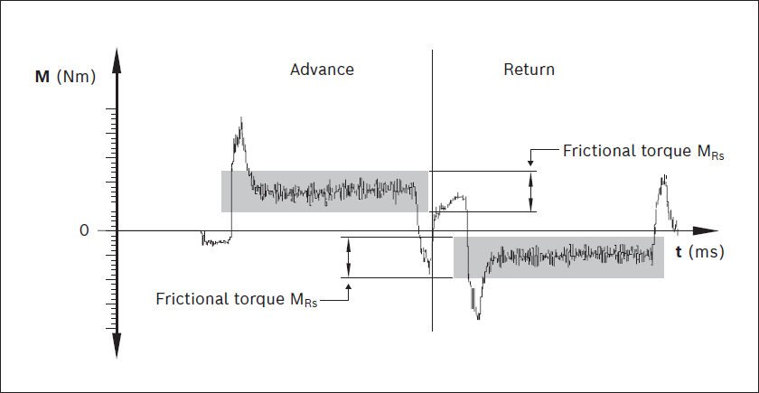

<h1 align="left">
  <br>
  
  <br>
  Industrial Automation Base
  <br>
</h1>

Cours AutB

Author: [Cédric Lenoir](mailto:cedric.lenoir@hevs.ch)

# Modul 08 das Antrieb, Software.

#### Dieser Teil wird derzeit direkt im Labor bearbeitet: Siehe: [LAB 05 Inbetriebnahme einer elektrischen Achse mit Kugelumlaufspindel](https://github.com/hei-synd-autb/autb-lab -05)

# PI-Regler
Die Theorie der PI-Regler basiert auf bestimmten Prinzipien der Signallinearität. Wie wir in der Laborumgebung sehen können, sind viele Komponenten in Wirklichkeit absolut nicht linear.

Nachfolgend finden Sie eine Übersicht über die Kugelumlaufspindellager einer CKK-Achse aus dem Automatisierungslabor.

<figure align="center">
    
    <figcaption>CKK Internal View</figcaption>
</figure>


Laut einer Abbildung des Kugellagerlieferanten SFK können wir ein Beispiel für die Variation der Reibung von Kugellagern in Abhängigkeit von der Geschwindigkeit beobachten.

<figure align="center">
    
    <figcaption>Source SFK, friction as a function of speed</figcaption>
</figure>

Die Außenansicht eines SFK-Moduls zeigt, dass wir auch Gummilamellen haben, um die innere Mechanik vor Staub zu schützen.

<figure align="center">
    
    <figcaption>CKK External View</figcaption>
</figure>

Wir erhalten laut Dokumentation von Bosch Rexroth ein Beispiel für den zeitlichen Verlauf der Reibung bei einer Hin- und Herbewegung über den gesamten Hub eines Systems.

<figure align="center">
    
    <figcaption>Measurement of frictional torque of complete system</figcaption>
</figure>

Schließlich muss die gesamte bewegliche Struktur berücksichtigt werden, zu der auch Kabel gehören, deren Verhalten schwer abzuschätzen ist, sowie die Steifigkeit des Ganzen, die zusätzlich zu den Einschränkungen durch Massen, Trägheitsmomente und Reibung eine Elastizität mit sich bringt Komponente.

<figure align="center">
    
    <figcaption>HEVS Lab, system overview</figcaption>
</figure>

# Einen Schritt weiter
Die Positionsregelung von Synchronmotoren verwendet häufig dasselbe Diagramm mit der folgenden Reihenfolge:
- Positionskontrolle,
- ein Positionsregler,
- ein Geschwindigkeitsregler,
- ein Stromregler, der über eine Kraft- oder Drehmomentkonstante den Strom in eine mechanische Größe umwandelt.

## Stromregler
Der Stromregler hängt von den elektrischen Eigenschaften des Motors ab, die grundsätzlich bekannt sind und als Parameter in den Antrieb eingegeben werden. Mit einigen Ausnahmen ist es nicht erforderlich, die vom Antrieb berechneten Parameter des Stromreglers zu ändern.

## Geschwindigkeitsregler
Sie hängt von den mechanischen Parametern des Systems ab und ist daher besonders kompliziert zu entwickeln, wenn die mechanischen Parameter nichtlinear sind. Aus diesem Grund verwenden wir oft eine empirische Arbeitsbasis oder einen antriebsinternen **Autotuning**-Algorithmus.

## Positionsregler
Das hängt von der Art des Prozesses ab. Standardmäßig reicht oft ein Proportionalregler mit Faktor „1“ aus.

Im folgenden Beispiel fügen wir einen Feedforward hinzu.
Das Prinzip besteht darin, eine Positionsänderung direkt in Strom umzuwandeln, sofern die Masse oder das Trägheitsmoment des zu steuernden Systems bekannt ist. Feedforward eignet sich gut für die Positionsverfolgung und ermöglicht die Begrenzung des Trackingfehlers, nämlich der Differenz zwischen der Sollposition und der gemessenen Position.

Wir können bedenken, dass ein Regler in erster Linie dazu dient, auf nicht messbare Störungen zu reagieren, dass aber alles, was es uns ermöglicht, vorherzusehen, mit **forward** verknüpft zu sein, das System verbessert.

<figure align="center">
    
    <figcaption>Feedforward or application of a model</figcaption>
</figure>

Das Prinzip besteht darin, ein System verstehen zu lernen, indem man die verschiedenen Komponenten der Bewegung visualisiert. Der Vorteil des Verständnisses des Systems und der Beherrschung der Programmierung besteht darin, dass es dann möglich ist, das allgemeine Systemsteuerungsmodell selbst zu vervollständigen.

### Beispiel **ohne** Feedforward
<figure align="center">
    
    <figcaption>Motion without feedforward</figcaption>
</figure>

Durch die Analyse dieser Bewegung bei niedriger Geschwindigkeit, +/- 2 [mm] und 10 mm/s, im Diagramm 600 mm/min, können wir beispielsweise die dynamische Reibungskraft visualisieren.

### Beispiel **mit** Feedforward
<figure align="center">
    
    <figcaption>Motion with feedforward</figcaption>
</figure>

Hier können wir den Feedforward in Schwarz visualisieren und sehen, dass er die nachfolgende Abweichung während der Beschleunigungsphase effektiv reduziert und die Geschwindigkeit in Blau erhöht.

Wir können auch in Blau sehen, dass Feedforward die Geschwindigkeit schneller stabilisiert und ein Überschreiten der Geschwindigkeit vermeidet, die kleine Erhöhung der Geschwindigkeit im ersten Diagramm.

# Beispiel: Schreiben Sie einen PI-Regler.

<figure align="center">
    
    <figcaption>Simple PI regler</figcaption>
</figure>


## Pseudo code:
```iecst
Proportional Gain : Kp
Integration Time  := Tn
Integration Gain  := Ki

// Pseudo code PI Regler

Read(Setpoint)
Read(MeasureProcess)

error := Setpoint - MeasureProcess

// Integrator
// If Tn = 0, no integration
IF Tn > 0 THEN
	Ki := 1/Tn;
ELSE
	Ki := 0;
END_IF;
sumError := sumError + error;

// Before Limit
sumPI := Kp * error + Ki * sumError;

// Set Limit called sometimes 
IF sumPI > LimitHigh then
	Output := LimitHigh;
ELSIF sumPI < LimitLow then
	Output := LimitLow;	
ELSE
	Output := sumPI;
END_IF


Write(Output)
```
[Ein Codierungsbeispiel finden Sie im Anhang](Function%20Block%20PI%20Regler.md)

## Deine Arbeit
- Verwenden Sie das Modell eines FB **Enable In Operation Base**, um einen PI-Regler in einem FB_PI zu erstellen.
- Verwenden Sie den Init-Status, um die Integratorsummierung zurückzusetzen: „sumError“.

# Abschluss
Wenn Sie wissen, wie man einen PI-Regler schreibt, könnten Sie theoretisch auch Ihr eigenes Optimierungssystem schreiben, um ein bestimmtes Problem zu kompensieren.