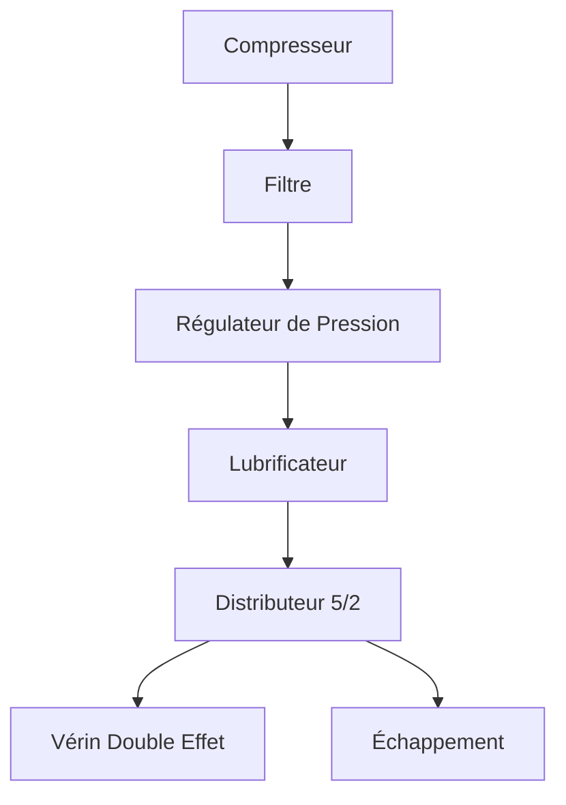
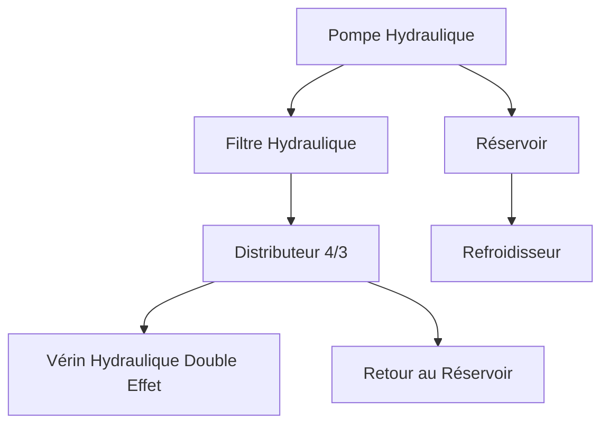

# Base de travail pour compléter le module 09 AutB

**pneumatic-cylinder-market**

https://www.transparencymarketresearch.com/pneumatic-cylinder-market.html

# Régulateurs Pneumatiques 5/2 et 3/2

## Introduction
Les régulateurs pneumatiques sont des composants essentiels dans les systèmes automatisés. Ils permettent de contrôler le flux d'air comprimé pour activer ou désactiver des actionneurs tels que des vérins ou des moteurs pneumatiques. Dans ce cours, nous nous concentrerons sur les régulateurs de type 5/2 et 3/2, couramment utilisés dans l'industrie, notamment ceux proposés par Festo.

---

## Régulateur 3/2

### Définition
Un régulateur 3/2 est une vanne pneumatique avec :
- **3 orifices** : Entrée (P), Sortie (A), Échappement (R).
- **2 positions** : Ouvert ou fermé.

### Fonctionnement
- **Position 1** : L'air comprimé (P) est dirigé vers la sortie (A).
- **Position 2** : La sortie (A) est connectée à l'échappement (R), libérant la pression.

### Applications
- Commande de petits vérins.
- Utilisé comme interrupteur pneumatique.

---

## Régulateur 5/2

### Définition
Un régulateur 5/2 est une vanne pneumatique avec :
- **5 orifices** : 1 entrée (P), 2 sorties (A et B), 2 échappements (R1 et R2).
- **2 positions** : Permet de basculer entre deux circuits.

### Fonctionnement
- **Position 1** : L'air comprimé (P) est dirigé vers A, tandis que B est connecté à R2.
- **Position 2** : L'air comprimé (P) est dirigé vers B, tandis que A est connecté à R1.

### Applications
- Commande de vérins double effet.
- Utilisé dans les systèmes nécessitant un contrôle bidirectionnel.

---

## Comparaison entre 3/2 et 5/2

| Caractéristique      | Régulateur 3/2       | Régulateur 5/2       |
|----------------------|----------------------|----------------------|
| Nombre d'orifices    | 3                    | 5                    |
| Nombre de positions  | 2                    | 2                    |
| Applications typiques| Vérins simple effet  | Vérins double effet  |

---

## Exemple de Composants Festo
- **Régulateur 3/2** : Festo VUVG-LK10-T32U-M5-1H2L.
- **Régulateur 5/2** : Festo VUVG-LK10-T52U-M5-1H2L.

---

## Conclusion
Les régulateurs pneumatiques 3/2 et 5/2 sont des éléments clés pour le contrôle des systèmes pneumatiques. Leur choix dépend des besoins spécifiques de l'application, tels que le type de vérin utilisé ou la complexité du système.

## Éléments d'un Circuit Pneumatique

Un circuit pneumatique est composé de plusieurs éléments essentiels pour assurer son bon fonctionnement. Voici les principaux composants :

### 1. Traitement de l'Air
- **Compresseur** : Génère l'air comprimé nécessaire au fonctionnement du système.
- **Filtre** : Élimine les impuretés et l'humidité de l'air comprimé.
- **Régulateur de pression** : Maintient une pression constante dans le circuit.
- **Lubrificateur** : Ajoute une fine couche d'huile à l'air comprimé pour lubrifier les composants.

### 2. Actionneurs
- **Vérin simple effet** : Utilise l'air comprimé pour effectuer un mouvement dans une seule direction, avec un ressort pour le retour.
- **Vérin double effet** : Utilise l'air comprimé pour effectuer des mouvements dans les deux directions.
- **Moteur pneumatique** : Convertit l'énergie de l'air comprimé en mouvement rotatif.

### 3. Distributeurs
- **Régulateurs 3/2** : Contrôlent les vérins simple effet.
- **Régulateurs 5/2** : Contrôlent les vérins double effet.
- **Régulateurs 5/3** : Permettent un contrôle plus complexe avec trois positions.

### 4. Conduites et Raccords
- **Tuyaux** : Acheminent l'air comprimé entre les différents composants.
- **Raccords** : Connectent les tuyaux aux composants du circuit.

### 5. Accessoires
- **Silencieux** : Réduisent le bruit des échappements d'air.
- **Capteurs** : Détectent les positions ou pressions pour le contrôle automatisé.
- **Vannes de coupure** : Permettent d'isoler une partie du circuit pour maintenance.

Ces éléments, combinés de manière appropriée, permettent de concevoir des circuits pneumatiques adaptés à une grande variété d'applications industrielles.

## Schéma d'un Circuit Pneumatique

Voici une illustration typique d'un circuit pneumatique, depuis le compresseur jusqu'au vérin :

## Exemple d'Éléments d'un Circuit Pneumatique avec Festo

Voici un exemple d'un circuit pneumatique typique utilisant des composants Festo, depuis le compresseur jusqu'au vérin :

### 1. Traitement de l'Air
- **Compresseur** : Festo DOL-63-10 - Compresseur compact pour générer l'air comprimé.
- **Filtre** : Festo MS4-LFM-1/4-D6-AS - Filtre pour éliminer les impuretés et l'humidité.
- **Régulateur de pression** : Festo MS4-LR-1/4-D6-AS - Régulateur pour maintenir une pression constante.
- **Lubrificateur** : Festo MS4-LOE-1/4-D6-AS - Lubrificateur pour ajouter une fine couche d'huile à l'air comprimé.

### 2. Distributeurs
- **Régulateur 3/2** : Festo VUVG-LK10-T32U-M5-1H2L - Distributeur pour contrôler un vérin simple effet.
- **Régulateur 5/2** : Festo VUVG-LK10-T52U-M5-1H2L - Distributeur pour contrôler un vérin double effet.

### 3. Conduites et Raccords
- **Tuyaux** : Festo PUN-H-6X1-BL - Tuyaux flexibles pour acheminer l'air comprimé.
- **Raccords** : Festo QS-6 - Raccords rapides pour connecter les tuyaux aux composants.

### 4. Actionneur
- **Vérin double effet** : Festo DSNU-25-100-P-A - Vérin pneumatique pour convertir l'énergie de l'air comprimé en mouvement linéaire.

Ce circuit illustre une configuration typique utilisant des composants Festo, adaptés à des applications industrielles nécessitant un contrôle précis et fiable.

Ce schéma montre les principaux composants d'un circuit pneumatique et leur interconnexion. Le compresseur génère l'air comprimé, qui est ensuite traité par le filtre, le régulateur de pression et le lubrificateur avant d'être dirigé vers le distributeur. Le distributeur contrôle le mouvement du vérin double effet, tandis que l'air usé est évacué par l'échappement.

## Éléments d'un Circuit de Commande Hydraulique

Un circuit de commande hydraulique utilise un fluide, généralement de l'huile, pour transmettre de l'énergie et actionner des composants tels que des vérins ou des moteurs hydrauliques. Voici les principaux éléments d'un tel circuit :

### 1. Source d'Énergie
- **Pompe hydraulique** : Génère le débit d'huile nécessaire au fonctionnement du système.
- **Réservoir** : Contient l'huile hydraulique et permet son refroidissement et sa décantation.

### 2. Traitement du Fluide
- **Filtre hydraulique** : Élimine les impuretés pour protéger les composants.
- **Refroidisseur** : Maintient la température de l'huile dans une plage acceptable.
- **Indicateur de niveau et de température** : Permet de surveiller l'état de l'huile.

### 3. Actionneurs
- **Vérin hydraulique** : Convertit l'énergie hydraulique en mouvement linéaire.
- **Moteur hydraulique** : Convertit l'énergie hydraulique en mouvement rotatif.

### 4. Distributeurs
- **Distributeurs 4/3** : Permettent de contrôler les vérins double effet avec trois positions (avance, arrêt, retour).
- **Distributeurs proportionnels** : Offrent un contrôle précis du débit et de la pression.

### 5. Conduites et Raccords
- **Tuyaux hydrauliques** : Acheminent l'huile entre les composants.
- **Raccords** : Assurent l'étanchéité et la connexion des conduites.

### 6. Régulation et Sécurité
- **Soupape de décharge** : Protège le circuit contre les surpressions.
- **Régulateur de débit** : Contrôle la vitesse des actionneurs.
- **Accumulateur hydraulique** : Stocke de l'énergie pour des besoins ponctuels ou en cas de coupure.

### 7. Accessoires
- **Manomètres** : Mesurent la pression dans le circuit.
- **Vannes d'isolement** : Permettent de couper une partie du circuit pour maintenance.
- **Capteurs** : Détectent les positions ou pressions pour le contrôle automatisé.

Ces éléments, correctement dimensionnés et assemblés, permettent de concevoir des circuits hydrauliques adaptés à des applications variées, notamment dans l'hydraulique mobile comme les engins de chantier ou les équipements agricoles.

## Schéma d'un Circuit Hydraulique

Voici une illustration typique d'un circuit hydraulique, depuis la pompe hydraulique jusqu'au vérin :

Ce schéma montre les principaux composants d'un circuit hydraulique et leur interconnexion. La pompe hydraulique génère le débit d'huile, qui est filtré avant d'être dirigé vers le distributeur. Le distributeur contrôle le mouvement du vérin hydraulique, tandis que l'huile retourne au réservoir pour être refroidie et réutilisée.

## Exemple d'Éléments d'un Circuit Hydraulique avec Bosch Rexroth

Voici un exemple d'un circuit hydraulique typique utilisant des composants Bosch Rexroth, depuis la source d'énergie jusqu'à l'actionneur :

### 1. Source d'Énergie
- **Pompe hydraulique** : Bosch Rexroth A10VSO - Pompe à pistons axiaux pour circuits ouverts.
- **Réservoir** : Réservoir hydraulique standard avec indicateur de niveau Bosch Rexroth.

### 2. Traitement du Fluide
- **Filtre hydraulique** : Bosch Rexroth 1.0400H10XL-A00-0-M - Filtre haute performance pour éliminer les impuretés.
- **Refroidisseur** : Bosch Rexroth OCN Series - Refroidisseur d'huile pour maintenir une température optimale.
- **Indicateur de niveau et de température** : Bosch Rexroth ABZMM - Indicateur combiné pour surveiller l'état de l'huile.

### 3. Distributeurs
- **Distributeur 4/3** : Bosch Rexroth 4WE6J62/EG24N9K4 - Distributeur directionnel électrohydraulique pour contrôler les vérins double effet.

### 4. Régulation et Sécurité
- **Soupape de décharge** : Bosch Rexroth DBDS6K1X/315 - Soupape de sécurité pour protéger contre les surpressions.
- **Régulateur de débit** : Bosch Rexroth 2FRM6B36-3X/16L - Régulateur pour ajuster la vitesse des actionneurs.

### 5. Conduites et Raccords
- **Tuyaux hydrauliques** : Bosch Rexroth R15 Spiral Hose - Tuyaux haute pression pour acheminer l'huile.
- **Raccords** : Bosch Rexroth R900000232 - Raccords étanches pour connecter les conduites.

### 6. Actionneur
- **Vérin hydraulique** : Bosch Rexroth CDH2 - Vérin double effet pour convertir l'énergie hydraulique en mouvement linéaire.

Ce circuit illustre une configuration typique utilisant des composants Bosch Rexroth, adaptés à des applications industrielles nécessitant fiabilité et performance.