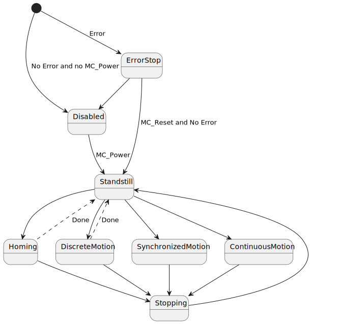

<h1 align="center">
   
  
   
  HEI-Vs Engineering School - Industrial Automation Base
   
</h1>

Cours AutB

# PLCopen Motion Control

Author: [Cédric Lenoir](mailto:cedric.lenoir@hevs.ch)

*Keywords:* **PLCopen MC_Power MC_MoveAbsolute MC_Stop**

# PLCopen Généralité
Le marché du **motion control**, commande de mouvement, au niveau de l'industrie du PLC est réparti entre différentes entrerprises qui utilisent toutes des systèmes qui ne sont pas compatibles entre eux.

L'idée de **PLCopen Motion Control** est de fournir un ensemble de **blocs fonctionnels** qui forment, du point de vue **IEC-61131-3**, des interfaces stantdards.

Une librairie **Motion Control** sous forme de blocs fonctionnels existe chez la majorité des fournisseurs de PLC dont la gamme de produit comprend des commandes moteur.

> Une fois le principe d'utilsation aquis pour une plateforme, il sera valable pour les autres plateforme avec de modifications mineures.

> Le document de référence est disponible en libre accès, moyennant un enregistrement, sur le site [PLCopen](https://plcopen.org/).

## Technical Specification PLCopen Function blocks for motion control
La norme fournit autant des blocs pour des systèmes à un axe, **Single-Axis Function Blocks**, que mutli axes, **Multi-Axis Function Blocks**. Dans le cadre du cours d'automatisation de base, nous nous limiterons à quelques exemples de blocs pour un seul axe.

> La norme n'est pas seulement utile en tant que spécification, mais fournit aussi de nombreux cas d'utilisation, [Part 3 - User Guidelines](https://plcopen.org/technical-activities/motion-control), qui peuvent être **très **utile à un programeur peu expérimenté.

## State Diagram
*Ce paragraphe est directement issu de la spécification PLCopen*.

1. Le diagramme suivant définit de manière normative le comportement de l'axe à un niveau élevé lorsque plusieurs blocs fonctionnels Motion Control sont activés « simultanément ».

2. Cette combinaison de profils de mouvement est utile pour créer un profil plus compliqué ou pour gérer des exceptions au sein d'un programme. *Dans les implémentations réelles, il peut y avoir des états supplémentaires définis à un niveau inférieur*.

3. La règle de base est que les commandes de mouvement sont toujours exécutées de manière séquentielle, même si l'automate a la capacité d'effectuer un véritable traitement parallèle.

4. Ces commandes agissent sur le diagramme d’états de l’axe.

5. **L'axe est toujours dans l'un des états définis** *voir schéma ci-dessous*. Toute commande de mouvement provoquant une transition change l'état de l'axe et, par conséquent, modifie la façon dont le mouvement actuel est calculé.

6. **Le diagramme d'état est une couche d'abstraction de l'état réel de l'axe**, comparable à l'image des points d'E/S dans un programme cyclique (PLC).

7. Un changement d'état est immédiatement reflété lors de l'émission de la commande de mouvement correspondante. **Remarque:** *le temps de réponse «immédiatement» dépend du système, couplé à l'état de l'axe ou à une couche d'abstraction dans le logiciel*.

8. Le diagramme est centré sur un seul axe.

<figure>
    
    <figcaption>State Machine PLCopen Motion Control partiel</figcaption>
</figure>

### Historique
Les commandes d'axe sont des systèmes complexes dont les bases sont réutiliées pendant plusieurs générations de systèmes chez un même fabricant. Les fabricants adaptent en général les principes de PLCopen Motion Control à des systèmes qui n'ont pas été conçus dès le départ pour l'utilisation avec la machine d'état ci-dessus.

**Version 2**, *à l'historique, il faut ajouter que la spécification évolue*. Les principes de base restent les mêmes.

### Description simplifiée des états.

#### Disabled
- L'état ``Disabled`` décrit l'état initial de l'axe.
- Dans cet état, le mouvement de l'axe n'est pas influencé par les FB. L'alimentation est coupée et **il n'y a aucune erreur dans l'axe**.
Si le FB ``MC_Power`` est appelé avec ``Enable := TRUE`` alors qu'il est à l'état ``Disabled`` l'état passe à ``Standstill``.

- Le codeur de l'axe est opérationnel avant d’entrer dans l’état ``Standstill``.

L'appel de ``MC_Power`` avec ``Enable := FALSE`` dans n'importe quel état sauf ``ErrorStop`` amène l'axe à l'état ``Disabled``, soit directement, **soit via tout autre état**. Toutes les commandes de mouvement en cours sur l'axe sont avortées ``CommandAborted``. On note **tout autre état**, car **idéalement, un axe devra être amené à vitesse nulle** avant de passer en ``Disabled``.

#### ErrorStop
- ``ErrorStop`` est valable comme priorité la plus élevée et applicable en cas d'erreur. L'axe peut avoir une alimentation activée ou désactivée et peut être modifié via ``MC_Power``. Cependant, tant que l'erreur est en attente, l'état reste ``ErrorStop``.

- L’objectif de l’état ``ErrorStop`` est que l’axe s’arrête, si possible. Aucune autre commande de mouvement n’est acceptée jusqu’à ce qu’une réinitialisation ait été effectuée à partir de l’état ``ErrorStop``.

- La transition vers ``ErrorStop`` fait référence aux erreurs provenant de l'axe et de la commande d'axe, et non des instances du bloc fonction.

Un exemple qui peut amener à un ``ErrorStop`` est la perte du signal du codeur. L'axe se mettra en ``ErrorStop`` **indépendament du code du PLC**.

Quelques soient les implémentations, un function block ``MC_ReadStatus``, permet de lire les différentes états d'un axe.

