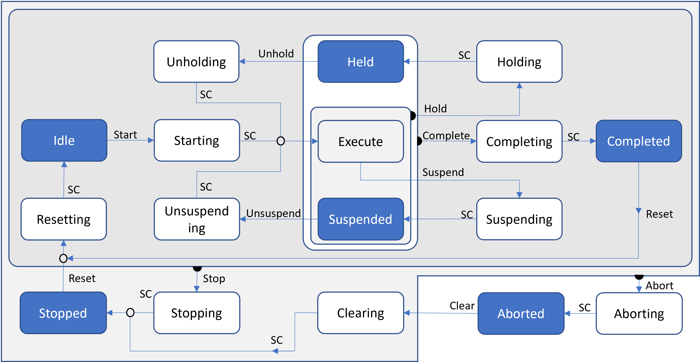

<h1 align="left">
   
  
   
  HEI-Vs Engineering School - Advanced Automation Safety Pack
   
</h1>

-   Author: [Cédric Lenoir](mailto:cedric.lenoir@hevs.ch)

# AAut_MOD_10_SafetyPack

## Aperçu
L'utilisation de PackML permet de simplifier la conformité de la sécurité de la machine avec sa conception logicielle.

Les différents états de fonctionnement permettent de bien définir ce qui est possible ou non dans différents états, par exemple:
- On peut définir que l'état **Aborted** correspond à une absence d'énergie à risque sur différents éléments, appliqué aux moteurs, cela se traduit le plus souvent par un état **STO**, **Safe Torque Off**, ce qui correspond à une absence garantie de courant dans le moteur.
- On peut définir un état **Stopped**, comme la garantie d'une absence de mouvement sur les éléments mobile. Ici aussi, pour les éléments moteur, il est possible d'installer ce que l'on nomme souvent **SOS**, **Safe Operating Stop**.
- Il est aussi possible de différentier clairement les modes de fonctionnement. Certaines machine peuvent être équipées d'un système de sécurité qui permet de faire fonctionner une machine avec des portes ouvertes sous certaines conditions.
  - La prermière de ces conditions sera de garantir que la machine se trouve en mode manuel.
  - La deuxième condition sera que l'opérateur utilise une commande de type poignée homme mort.
  - La troisième condition sera que les éléments mobiles, typiquement les axes électriques soient équipés d'un système de sécurité de type **SLS**, **Safe Low Speed**, qui garanti que les éléments mobiles ne pourront pas excéder une certaines limite, typiquement de l'ordre de 2 mètres par minute.

L'absence de gestion claire et stricte des états et des modes de fonctionnement peut pasablement compliquer la mise en oeuvre de la sécurité, voir rendre la machine dangereuse.

## Sommaire

- [AAut\_MOD\_10\_SafetyPack](#aaut_mod_10_safetypack)
  - [Aperçu](#aperçu)
  - [Sommaire](#sommaire)
  - [Ce qu'il faut retenir](#ce-quil-faut-retenir)
  - [Ce qu'il faut savoir](#ce-quil-faut-savoir)
    - [Mais encore](#mais-encore)
- [Sécurité et bases légales](#sécurité-et-bases-légales)
  - [Sécurité machine](#sécurité-machine)
    - [Contexte](#contexte)
    - [Introduction à la sécurité des systèmes automatisés](#introduction-à-la-sécurité-des-systèmes-automatisés)
    - [Droits et obligations](#droits-et-obligations)
    - [Sécurité des machines et commandes de machines](#sécurité-des-machines-et-commandes-de-machines)
    - [Lexique législatif](#lexique-législatif)
    - [Base Légale](#base-légale)
    - [Selon source SUVA](#selon-source-suva)
      - [Sécurité des machines et commandes de machines](#sécurité-des-machines-et-commandes-de-machines-1)
      - [Loi fédérale sur la sécurité des produits, LSPro.](#loi-fédérale-sur-la-sécurité-des-produits-lspro)
      - [Ordonnance sur les machines, OMach et directive 2006/42/CE relative aux machines](#ordonnance-sur-les-machines-omach-et-directive-200642ce-relative-aux-machines)
      - [Directive CFST 6512 «Equipements de travail»](#directive-cfst-6512-equipements-de-travail)
      - [Comment garantir la sécurité des machines](#comment-garantir-la-sécurité-des-machines)
        - [Preuve de la sécurité des produits](#preuve-de-la-sécurité-des-produits)
        - [Concept de sécurité](#concept-de-sécurité)
        - [Déclaration de conformité](#déclaration-de-conformité)
    - [Selon source Union Européenne](#selon-source-union-européenne)
      - [Extraits de la directive machine](#extraits-de-la-directive-machine)
        - [Article 2 « Machine »](#article-2--machine-)
        - [Article 5](#article-5)
        - [Article 6 Libre circulation, §1](#article-6-libre-circulation-1)
  - [Sécurité et normes](#sécurité-et-normes)
    - [Préambule](#préambule)
    - [Principe](#principe)
  - [ISO 12100](#iso-12100)
    - [Principes généraux ISO 12100](#principes-généraux-iso-12100)
    - [Selon SUVA](#selon-suva)
        - [Mesures de prévention intrinsèque :](#mesures-de-prévention-intrinsèque-)
        - [Protection et/ou mesures de prévention complémentaires :](#protection-etou-mesures-de-prévention-complémentaires-)
        - [Informations pour l’utilisation :](#informations-pour-lutilisation-)
      - [Mesures de prévention intrinsèque :](#mesures-de-prévention-intrinsèque--1)
      - [Protection et/ou mesures de prévention complémentaires :](#protection-etou-mesures-de-prévention-complémentaires--1)
      - [Informations pour l'utilisation](#informations-pour-lutilisation)
    - [Informations pour l'évaluation des risques](#informations-pour-lévaluation-des-risques)
    - [Détermination des limites de la machine](#détermination-des-limites-de-la-machine)
      - [Limites d'utilisation dans toutes les phases de vie et modes de fonctionnement](#limites-dutilisation-dans-toutes-les-phases-de-vie-et-modes-de-fonctionnement)
      - [Limites spatiales](#limites-spatiales)
      - [Limites de temps](#limites-de-temps)
      - [Autres limites](#autres-limites)
    - [Identification des dangers](#identification-des-dangers)
    - [Estimation du risque](#estimation-du-risque)
      - [A considérer:](#a-considérer)
    - [Évaluation du risque](#évaluation-du-risque)
      - [Les normes type C](#les-normes-type-c)
      - [Comparaison des risques :](#comparaison-des-risques-)
  - [Type de norme à utiliser](#type-de-norme-à-utiliser)
    - [IEC ou ISO ? Ce que dit ISO 13849](#iec-ou-iso--ce-que-dit-iso-13849)
      - [CEI 62061 « style »](#cei-62061--style-)
      - [ISO 13489-1 « style »](#iso-13489-1--style-)
    - [Sistema 2](#sistema-2)
      - [SISTEMA Cookbooks](#sistema-cookbooks)
  - [Principes de ISO 13489](#principes-de-iso-13489)
    - [Niveau de performance requis PLr](#niveau-de-performance-requis-plr)
      - [Ordres de grandeur](#ordres-de-grandeur)
    - [Structure du système matériel et logiciel (catégories)](#structure-du-système-matériel-et-logiciel-catégories)
    - [Mécanisme de pannes, couverture de diagnostic, DC](#mécanisme-de-pannes-couverture-de-diagnostic-dc)
      - [Diagnostic coverage](#diagnostic-coverage)
    - [Que signifie MTTFd ?](#que-signifie-mttfd-)
      - [Reliability levels of components](#reliability-levels-of-components)
    - [Qu’est ce qu’une défaillance de cause commune CCF ?](#quest-ce-quune-défaillance-de-cause-commune-ccf-)
      - [Common Cause Failure CCF](#common-cause-failure-ccf)
      - [Safety over Ethercat / Sercos / Profinet](#safety-over-ethercat--sercos--profinet)
  - [Pour résumer](#pour-résumer)
- [Prévention des explosions](#prévention-des-explosions)
    - [Quelles sont les zones Ex ou ATEX ?](#quelles-sont-les-zones-ex-ou-atex-)
      - [La directive ATEX définit six différentes zones Ex.](#la-directive-atex-définit-six-différentes-zones-ex)
        - [Zone 0 :](#zone-0-)
        - [Zone 1 :](#zone-1-)
        - [Zone 2 :](#zone-2-)
        - [Zone 20 :](#zone-20-)
        - [Zone 21 :](#zone-21-)
        - [Zone 22 :](#zone-22-)
    - [Ethernet-APL en Zone Ex](#ethernet-apl-en-zone-ex)
      - [Caractéristiques principales d'Ethernet-APL :](#caractéristiques-principales-dethernet-apl-)
      - [Avantages pour les zones Ex :](#avantages-pour-les-zones-ex-)
      - [Ressources supplémentaires :](#ressources-supplémentaires-)
    - [Qu'est-ce que la sécurité intrinsèque ?](#quest-ce-que-la-sécurité-intrinsèque-)
      - [Principes de la sécurité intrinsèque :](#principes-de-la-sécurité-intrinsèque-)
      - [Avantages de la sécurité intrinsèque :](#avantages-de-la-sécurité-intrinsèque-)
      - [Applications typiques :](#applications-typiques-)
      - [Ressources supplémentaires :](#ressources-supplémentaires--1)
- [Quelques questions...](#quelques-questions)
  - [... à propos des cellules du laboratoire d'automation.](#-à-propos-des-cellules-du-laboratoire-dautomation)
  - [Evaluer ce robot dans un contexte ISO 12100](#evaluer-ce-robot-dans-un-contexte-iso-12100)
  - [Dans le contexte de l'exercice précédent.](#dans-le-contexte-de-lexercice-précédent)
  - [Timer sur relais safety](#timer-sur-relais-safety)
  - [PackML with safety](#packml-with-safety)

## Ce qu'il faut retenir
- Il existe selon les types d'industrie des loi précises liées à la sécurité.
- Les normes servent de guide dans l'application des lois.
- Le respect de ces lois **garantissent le droit de vendre les machine en Europe**.
- Il appartient au fabricant de concevoir et fabriquer sa machine dans les règles de l'art, **nul n'est sensé ignorer la loi**.
- Il est nécessaire de tenir compte des contraintes de sécurité **avant** de construire la machine!

> Je considère que la sécurité est avant tout le boulot d'une personne expérimentée, par contre, il faut être conscient des impératifs liés à la sécurité pour, le cas échéant se tourner vers une personne avec les compétences et l'expérience nécessaires.

## Ce qu'il faut savoir
- Comprendre le schéma ISO 12100
- Comprendre les notion de PL de ISO 13489.
- Faire la différence entre loi et norme.
- Savoir ce qu'est une zone Ex et une sécurité intrinsèque.
- Savoir à quoi sert la SUVA.

### Mais encore
- L’employeur est responsable de la sécurité au travail au sein de son entreprise.
- Les travailleurs sont tenus de satisfaire aux directives de l’employeur.
- Les fabricants, les importateurs et les commerçants sont soumis à la loi sur la sécurité des produits.
- Les machines ne doivent pas mettre en danger la sécurité et la santé de leurs utilisateurs.
- Les fabricants sont tenus de procéder à une évaluation et à une réduction des risques.
- Ne manipulez jamais les dispositifs de protection de machines.

# Sécurité et bases légales
##	Sécurité machine
###	Contexte
On prend ici le contexte de la sécurité machine, tout en acceptant que les contraintes de sécurité peuvent être très différentes selon le type d’industrie dans lequel on travaille. C’est pour cette raison que ce chapitre reste très général.
Au niveau des travaux pratiques, on traitera un cas particulier d’arrêt d’urgence appliqué à une machine.
###	Introduction à la sécurité des systèmes automatisés
- contexte
- bases légales et normes
- principes généraux
- cas particulier
###	Droits et obligations
- L’employeur est responsable de la sécurité au travail au sein de son entreprise
- Les travailleurs sont tenus de satisfaire aux directives de l’employeur
- Les fabricants, les importateurs et les commerçants sont soumis à la loi sur la sécurité des produits.

    
    
Safety the law, Source: <a href="https://www.suva.ch">SUVA Website</a>

###	Sécurité des machines et commandes de machines

- Les machines ne doivent pas mettre en danger la sécurité et la santé de leurs utilisateurs.
- Les fabricants sont tenus de procéder à une évaluation et à une réduction des risques.
- Ne manipulez jamais les dispositifs de protection de machines.

    
    
E-Stop: <a href="https://www.festo.com/">Festo Website</a>

###	Lexique législatif
- Loi fédérale 
- Les ordonnances
- Directives (CH)
- Directives (Types d'actes législatifs de l’UE)
- Normes
###	Base Légale
La base légale est constituée par l'ordonnance du 2 avril 2008 sur la sécurité des machines (OMach; RS 819.14), qui transpose dans le droit suisse les prescriptions de la Directive 2006/42/CE relative aux machines.
###	Selon source SUVA
[Comment les fabricants peuvent-ils garantir la sécurité des machines?](https://www.suva.ch/fr-ch/prevention/themes-specialises/securite-des-machines-et-commandes-de-machines)
####	Sécurité des machines et commandes de machines

- Lorsqu’elles sont utilisées correctement et conformément à leur destination, les machines ne doivent pas mettre en danger la sécurité et la santé de leurs utilisateurs ou des tiers. 
- Toutes les machines doivent satisfaire aux exigences essentielles de santé et de sécurité. 
- Les fabricants sont tenus de procéder à une évaluation et à une réduction des risques. 
- Avant d’acheter une machine, assurez-vous que celle-ci convient à l’usage prévu, qu’elle est conforme aux prescriptions de sécurité et qu’elle est facile à utiliser. 
- Ne manipulez jamais les dispositifs de protection de machines. 
La sécurité avant tout
Seules peuvent être mises sur le marché et utilisées les machines qui présentent un risque nul ou minime pour la santé ou la sécurité des utilisateurs ou des tiers lorsqu’elles sont utilisées dans des conditions normales ou raisonnablement prévisibles.
####	Loi fédérale sur la sécurité des produits, LSPro.
Les responsables de la mise sur le marché des produits (fabricants, importateurs et commerçants) sont tenus de veiller à ce que les produits en question soient conformes aux prescriptions de la **loi fédérale sur la sécurité des produits** [LSPro](https://www.admin.ch/opc/fr/classified-compilation/20081129/index.html) et de l'**ordonnance sur la sécurité des produits**, [OSPro](http://www.admin.ch/ch/f/sr/c930_111.html).

#### Ordonnance sur les machines, OMach et directive 2006/42/CE relative aux machines
L'[ordonnance sur les machines](http://www.admin.ch/ch/f/sr/c819_14.html)  réglemente la mise en circulation des machines et la surveillance du marché conformément à la directive [2006/42/CE](http://eur-lex.europa.eu/LexUriServ/LexUriServ.do?uri=OJ:L:2006:157:0024:0086:FR:PDF) . Un [guide](http://ec.europa.eu/DocsRoom/documents/9483/attachments/1/translations/fr/renditions/native)  a été publié afin de faciliter l’application de cette directive européenne.

####	Directive CFST 6512 «Equipements de travail»
La [Directive CFST, Equipements de travail](https://www.suva.ch/fr-ch/prevention/themes-specialises/securite-des-machines-et-commandes-de-machines#uxlibrary-material=dd14bcc187d79ec7b2d9d3d85279d94c),  indique comment respecter les prescriptions relatives à la sécurité et à la protection de la santé des travailleurs dans le cadre de l’emploi, de l’utilisation et de l’entretien des équipements de travail.

####	Comment garantir la sécurité des machines
Les fabricants et les utilisateurs de machines doivent prendre en compte différents aspects afin de garantir la sécurité des machines.
- [Fabricants](https://www.suva.ch/fr-ch/shared-data/components/shared-safety-rule/maschinensicherheit/content-filter-item-hersteller?&showContainer=2&sc_mode=normal)
- [Utilisateurs](https://www.suva.ch/fr-ch/shared-data/components/shared-safety-rule/maschinensicherheit/content-filter-item-anwender?&showContainer=2&sc_mode=normal) 

##### Preuve de la sécurité des produits
En tant que fabricant, vous êtes responsable de la sécurité de vos machines. Vous devez vous conformer aux dispositions légales en vigueur et procéder à une appréciation des risques, puis vous baser sur celle-ci pour élaborer une solution conforme aux normes européennes.

Dans le cadre de la mise en circulation d'un produit, vous devez être en mesure de prouver que celui-ci ne met pas en danger la santé et la sécurité des personnes. Cette preuve doit être apportée au moyen d’une appréciation des risques, d’un test ou d’autres méthodes appropriées et être consignée dans une documentation technique. 

En sa qualité d’organe de contrôle, la Suva surveille l’application des dispositions de la loi sur la sécurité des produits. Vous trouverez plus d'informations à ce sujet à la rubrique «Sécurité des produits: [la Suva assure la surveillance du marché](https://www.suva.ch/fr-CH/materiel/fiche-thematique/securite-des-produits/). 

##### Concept de sécurité 
Les dispositifs de protection du produit ou de la machine ne doivent pas pouvoir être contournés, manipulés, par des moyens simples. Les dispositifs de protection installés dans les zones dangereuses des presses sont soumis à des exigences de sécurité plus strictes que ceux des simples transporteurs à bande. Un concept de sécurité est cependant nécessaire dans les deux cas. Il doit notamment préciser les dispositifs de protection et installations de commande nécessaires, leur étendue ainsi que la qualité exigée. 

##### Déclaration de conformité
Vous devez établir une déclaration de conformité pour les produits soumis à des directives européennes. En tant que responsable de la mise sur le marché, vous attestez par ce biais que le produit satisfait aux exigences essentielles de santé et de sécurité et précisez quelles sont les exigences concernées. Vous certifiez en outre que l’évaluation de la conformité a été réalisée correctement. Le cas échéant, vous devez également mentionner les autres directives auxquelles votre machine est conforme.

Les exigences essentielles de santé et de sécurité applicables aux machines sont définies dans la directive relative aux machines . Concernant les commandes des machines, la [directive relative aux machines](http://eur-lex.europa.eu/LexUriServ/LexUriServ.do?uri=OJ:L:2006:157:0024:0086:FR:PDF) exige en particulier qu'une éventuelle défaillance matérielle ou logicielle ne puisse pas engendrer de phénomènes dangereux. 
Vous trouverez un aperçu des différentes exigences dans les publications suivantes : 
- [Conformité CE des machines, pas à pas](https://www.suva.ch/fr-CH/materiel/fiche-thematique/conformite-ce-des-machines-pas-a-pas--informations-sur-la-mise-en-oeuvre-de-la-ce12-1-f-39425-38401/) 
- [Sécurité des machines – l'essentiel de l’appréciation du risque](https://www.suva.ch/fr-CH/materiel/documentation/securite-des-machines--lessentiel-de-lappreciation-du-risque-condense-de-la-no-ce15-1-f-43326-42485/)   
- [Sécurité des machines – l'essentiel de la réduction de risque](https://www.suva.ch/fr-ch/prevention/themes-specialises/securite-des-machines-et-commandes-de-machines#uxlibrary-material=2a6c2d1a0ab535a97900ca5d23ac7e80)
- [Fonctions de sécurité des machines: l'essentiel en bref](https://www.suva.ch/fr-CH/materiel/fiche-thematique/fonctions-de-securite-des-machines-lessentiel-en-bref-ce13-1-f-40151-39041/)

Les normes européennes définissent des exigences détaillées correspondant à l’état actuel de la technique. Elles se fondent sur la directive relative aux machines et sont répertoriées dans le Journal officiel de l'Union européenne.

###	Selon source Union Européenne
Directive machines 2006/42/CE https://eur-lex.europa.eu/
####	Extraits de la directive machine
##### Article 2 « Machine »
Ensemble équipé ou destiné à être équipé d'un système d'entraînement autre que la force humaine ou animale appliquée directement, composé de pièces ou d'organes liés entre eux dont au moins un est mobile et qui sont réunis de façon solidaire en vue d'une application définie.
##### Article 5
Avant de mettre sur le marché et/ou de mettre en service une machine, le fabricant ou son mandataire…
-  **A**.  veille à ce que celle-ci satisfasse aux exigences essentielles de santé et de sécurité.…
- **B**.	veille à ce que le dossier technique…, soit disponible
- **C**.	met à disposition, …la notice d’instructions;
- **D**.	applique les procédures d’évaluation…
- **E**.	établit la déclaration CE
- **F**.	appose le marquage «CE»
##### Article 6 Libre circulation, §1
> « Les États membres **ne peuvent pas interdire**, restreindre ou entraver la mise sur le marché et/ou la mise en service sur leur territoire des machines qui satisfont à la présente directive. »

---

##	Sécurité et normes
###	Préambule
> Cette partie de cours est à considérer comme une introduction aux systèmes de sécurité afin de permettre à l’étudiant de comprendre les mécanismes de base d’un système de sécurité et l’orienter vers des une littérature plus complète, par exemple celle de logiciel Sistema ou à le guider vers une formation ad-hoc. En aucun cas il ne peut être considéré comme un validation en systèmes de sécurité.
###	Principe
En se basant sur la norme **ISO 12100** dont un aperçu principalement extrait de documents de la SUVA et donné ci-dessous, on analysera les risques inhérents à la machine et son utilisation. Les mesures de base peuvent souvent s’apparenter à du bon sens, telles qu’utilisation correcte de la machine, protection mécaniques des zones dangereuses.
Dans un second temps, si il s’avère que des mesures plus techniques pour la protection des personnes, comme par exemple un barrière lumineuse, alors on devra aborder le problème en se basant sur la norme **ISO 13489**, Ou éventuellement **IEC 62061**.

---

##	ISO 12100
###	Principes généraux ISO 12100
- déterminer les limites de la machine
- recenser les dangers
- estimer…, compte tenu de la gravité
- évaluer… si une réduction… est nécessaire
- éliminer les dangers ou réduir les risques
###	Selon SUVA
La directive **2006/42/CE**, directive machines. exige du fabricant d'une machine qu'il procède à une évaluation des risques et prenne des mesures permettant de réduire ces derniers.
La norme EN **ISO 12100** spécifie la terminologie de base, les principes et une méthodologie en vue d'assurer la sécurité dans la conception des machines. Elle définit des principes d'évaluation et
de réduction des risques et décrit des méthodes d'identification des phénomènes dangereux et d'appréciation ainsi que d'évaluation des risques durant les phases déterminantes de la durée de vie
d'une machine et permettant également d'éliminer les phénomènes dangereux ou d'obtenir une réduction suffisante des risques.

> En résumé:
> > La Suisse applique la directive européenne. De ce fait, cette directive a force de loi et la norme ISO 12100 définit comment il est possible de respecter cette loi. Mais à aucun moment une loi ne définit qu'il faudra respecter cette directive. Plus bas, on trouvera des normes, telles ISO-13489 qui aident à la conception de machines permettant de respecter la norme ISO 12100.

> En tirant un peu par les cheveux le diagramme en V, on pourrait résumer ainsi:

L'appréciation du risque consiste en une série d'étapes logiques qui permet d'analyser et d'évaluer, de façon systématique, les risques associés à la machine. Selon les cas, elle pourra être complétée par des mesures de réduction des risques et le plus souvent par une répétition du processus.

Pour réaliser l'objectif de réduction des risques, c'est-à-dire éliminer les phénomènes dangereux en appliquant des mesures de protection appropriées ou réduire les risques, on appliquera la
méthode en trois étapes dans l'ordre indiqué ci-dessous.
##### Mesures de prévention intrinsèque :
Elimine les phénomènes dangereux ou réduit les risques associés par un choix judicieux des caractéristiques de conception.
##### Protection et/ou mesures de prévention complémentaires :
Mettre en œuvre de façon appropriée des mesures de protection techniques et complémentaires permettant de réduire les risques lorsqu'un phénomène dangereux ne peut être éliminé ou que le risque inhérent ne peut être suffisamment réduit par une construction intrinsèquement sûre.
##### Informations pour l’utilisation :
Si des risques subsistent malgré une construction intrinsèquement sûre et l'application de mesures de sécurité techniques et complémentaires, les informations destinées aux utilisateurs devront mentionner la totalité des risques résiduels.
####	Mesures de prévention intrinsèque :
La prévention intrinsèque constitue la première et la plus importante étape du processus de réduction du risque, car les mesures de prévention inhérentes aux caractéristiques de la machine ont de bonnes chances de rester efficaces en permanence.
- Prise en compte des facteurs géométriques et des aspects physiques
- Prise en compte des connaissances techniques générales sur la conception des machines
- Choix d'une technologie adéquate
- Application du principe de l'action mécanique positive
- Dispositions relatives à la stabilité
- Dispositions relatives à la maintenabilité
- Respect des principes ergonomiques
- Eviter les Phénomènes dangereux électriques
- Eviter les Phénomènes dangereux hydrauliques et pneumatiques
- Application de mesures de prévention intrinsèque aux systèmes de commande
- Minimiser la probabilité de défaillance des fonctions de sécurité
- Limitation de l'exposition aux phénomènes dangereux par la fiabilité du matériel
- Limitation de l'exposition aux phénomènes dangereux par la mécanisation ou l'automatisation des opérations de chargement (alimentation)/déchargement (évacuation)
- Limitation de l'exposition aux phénomènes dangereux par le positionnement des points de réglage et de maintenance à l'extérieur des zones dangereuses
####	Protection et/ou mesures de prévention complémentaires :
Des protecteurs et des dispositifs de protection doivent être utilisés pour protéger les personnes chaque fois que l'application de mesures de prévention intrinsèque ne permet raisonnablement d'éliminer certains phénomènes dangereux, ni de réduire suffisamment le risque qui leur est lié.
- Choix et mise en œuvre des protecteurs et des dispositifs de protection
- Exigences relatives à la conception et à la construction des protecteurs et des dispositifs de protection
  - Exigences relatives aux protecteurs
  - Caractéristiques techniques des dispositifs de protection
- Mesures de protection destinées à réduire les émissions
Si les mesures destinées à réduire les émissions à la source ne sont pas adéquates, il convient de mettre en œuvre sur la machine des mesures de prévention supplémentaires
  - Bruit
  - Vibrations
  - Substances dangereuses
  - Rayonnements
- Mesures de prévention complémentaires
Des mesures de prévention autres que les mesures de prévention intrinsèque, la protection ou les informations pour l'utilisation pourraient devoir être mises en œuvre en fonction de l'utilisation normale de la machine et des mauvais usages raisonnablement prévisibles.
  - Composants et éléments permettant d'assurer la fonction d'arrêt d'urgence
  - Mesures destinées à permettre à des personnes emprisonnées de s'échapper ou d'être secourues
  - Dispositions relatives à la consignation
  - Dispositions destinées à faciliter et à rendre sûre la manutention des machines et de leurs éléments lourds
  - Dispositions relatives à la sécurité de l'accès aux machines
####	Informations pour l'utilisation
Des informations doivent être fournies à l'utilisateur sur l'utilisation normale de la machine, qui tient compte notamment de tous ses modes de fonctionnement.
Les informations doivent comprendre toutes les instructions nécessaires pour que la machine soit utilisée correctement et en sécurité. À cette fin, elles doivent informer et avertir les utilisateurs quant au risque résiduel.
Les points suivants doivent être pris en compte :
- Emplacement et nature des informations pour l'utilisation
- Signaux et dispositifs d'avertissement
- Inscriptions, signes (pictogrammes) et avertissements écrits
- Documents d'accompagnement (en particulier notice d'instructions)
- Réalisation de la notice d'instructions
- Élaboration et rédaction des informations pour l'utilisation
###	Informations pour l'évaluation des risques
- spécifications utilisateur, **URS**.
- spécifications prévisionnelles des machines, description des différents phases de l'ensemble du cycle de vie, dessins de conception, sources d'énergie.
- documentation sur les conceptions précédentes de machines similaires
- **informations pour l'utilisation de la machine**
- réglementations, normes, spécifications techniques, fiches de données de sécurité

    
    
General principle of ISO 12100, Source: <a href="https://www.iso.org/standard/51528.html"> ISO 12100:2010 Safety of machinery — General principles for design — Risk assessment and risk reduction</a>

###	Détermination des limites de la machine
Les limites de la machine dans toutes les phases du cycle de vie doivent être déterminée en tenant compte des éléments suivants :
- caractéristiques et performances de la machine
- au niveau de la machine. les personnes liées au processus
- environnement de la machine
- associés aux produits liés à la machine

    
    
Les limites d'une machine selon ISO 12100, Source: <a href="https://chatgpt.com/"> ChatGPT</a>

####	Limites d'utilisation dans toutes les phases de vie et modes de fonctionnement
- l'utilisation prévue
- mauvaise utilisation prévisible
####	Limites spatiales
- l'amplitude de mouvement
- interaction humaine telle que l'interface opérateur-machine
- l'interface avec l’alimentation en énergie
####	Limites de temps
- limite de vie de la machine et de certains de ses composants
- intervalles d'entretien recommandés
####	Autres limites
- propriétés du ou des matériaux à traiter
- entretien, le niveau de propreté requis
- Conditions environnementales
###	Identification des dangers
Identification des situations machines en déterminant quelles opérations doivent être exécutés par les machines et lesquels par des personnes.
Ce faisant, il est nécessaire de prendre en compte les éléments suivants :
- Machine, matériau à traiter, environnement
- Interaction humaine tout au long du cycle de vie de la machine
- États possibles de la machine
- Comportement involontaire de l'opérateur ou raisonnablement prévisible mauvaise utilisation de la machine
Dans les situations machine constatées, tous les dangers, situations dangereuses et/ou les événements dangereux doivent être systématiquement identifiés.

###	Estimation du risque
Estimation du risque de chaque situation dangereuse en déterminant les éléments de risque :
- la gravité du préjudice (blessure ou atteinte à la santé)
- la probabilité de préjudice causé par :
  - l'exposition de la ou des personnes au danger,
  - la survenance d'un événement dangereux, et
  - les possibilités techniques et humaines pour éviter ou limiter les dommages

#### A considérer:
- Personnes exposées
- Type, fréquence et durée d'exposition au danger
- Relation entre l'exposition au danger et les effets
- Les facteurs humains
- Adéquation des mesures de protection
- Possibilité de contourner ou de contourner les mesures de protection
- Capacité à maintenir les mesures de protection
- Informations d'utilisation
 

    
    
Estimation du risque

###	Évaluation du risque
Avec l'évaluation des risques, une décision est prise quant à savoir si des mesures de réduction des risques sont nécessaires ou si le risque peut être considéré comme ayant été suffisamment réduit.
Une réduction adéquate des risques est obtenue si :
- toutes les conditions opératoires et toutes les modalités d'intervention ont été prises en compte,
- les dangers ont été éliminés ou les risques réduits au niveau le plus bas possible,
- tous les nouveaux dangers introduits par les mesures de protection ont été correctement pris en compte,
- les utilisateurs sont suffisamment informés et avertis des risques résiduels,
- les mesures de protection sont compatibles entre elles,
- une attention suffisante a été accordée aux conséquences pouvant découler de l'utilisation dans un contexte non professionnel/non industriel d'une machine conçue pour un usage professionnel/industriel, et
- les mesures de protection ne nuisent pas aux conditions de travail de l'opérateur ni à l'utilisation de la machine.

 

Pour une réduction adéquate des risques en tenant compte de l'état actuel de la technique, c'est-à-dire au moins conformément aux exigences légales. Des informations sur l'état de l'art peuvent être trouvées dans les normes dont les titres sont publiés au Journal officiel de l'Union européenne. Si les spécifications d'une norme de sécurité des machines répertoriée, **norme de type C**, sont appliquées sur la base d'une évaluation des risques, on peut supposer que les exigences essentielles de santé et de sécurité de la directive Machines 2006/42/CE, qui sont couvertes par le standard, sont remplies.

#### Les normes type C 
Elles traitent les exigences de sécurité détaillées qui s’appliquent à une machine ou un groupe de machines particulier. Ces normes décrivent les dangers et les risques de manière plus spécifique et proposent les moyens de protection les mieux adaptés.

S'il n'existe pas de norme de type C pour la machine, l'état de l'art peut être pris en compte dans la comparaison des risques.

####	Comparaison des risques :
Les risques associés à une machine peuvent être comparés, sous réserve de certains critères, à ceux de machines similaires correspondant à une ou plusieurs normes de type C pertinentes.

##	Type de norme à utiliser
En Allemagne, et par extension en Suisse, la tendance est à privilégier la norme **ISO 13489-1**. C’est cette norme qui est utilisée par le logiciel Sistema édité par l’IFA **Institut für Arbeitsschutz** der Deutschen Gesetzlichen Unfallversicherung, l’équivalent allemand de la **SUVA** en Suisse.

###	IEC ou ISO ? Ce que dit ISO 13849
- L’IEC 62061 et la présente partie de l'ISO 13849 spécifient les exigences pour la conception et la mise en œuvre des systèmes de commande relatifs à la sécurité des machines. L'utilisation de l'une de ces deux Normes internationales, en accord avec leurs domaines d'application, peut présumer de satisfaire aux exigences essentielles de sécurité appropriées
- La norme EN ISO 13849-1 énonce également des exigences spéciales pour les SRP/SC, Safety‐related parts of controls systems,  avec systèmes électroniques programmables. 
- IEC 62061 ne définit **pas d’exigences pour la performance d’éléments de commande relatifs à la sécurité non électroniques**, par ex. hydrauliques, pneumatiques ou électromécaniques, de machine. SCR/CS / Safety‐Related Parts of Controls Systems

#### CEI 62061 « style »

    
    
CEI_62021 SIL Safety integrity level, Source: <a href="www.zvei.org/automation">ZVEI Website</a>

#### ISO 13489-1 « style »
 

    
    
ISO_13489 PL Performance Levec, Source: <a href="www.zvei.org/automation">ZVEI Website</a>

Dans la suite de ce cours, nous définirons quelques définitions de **ISO 13489**, ou plus simplement celle qui permet de déterminer le niveau de performance requis PLr et atteint PL.

###	Sistema 2
Pour une mise en œuvre de **ISO 13489**, on se référera au logiciel Sistema 2 disponible sur le site de l’[IFA du gouvernement fédéral allemand](https://www.dguv.de/ifa/praxishilfen/practical-solutions-machine-safety/software-sistema/index.jsp).

Software-Assistent SISTEMA: Safety Integrity Software Tool for the Evaluation of Machine Applications
**A Tool for the Easy Application of the Control Standard EN ISO 13849-1**
Des exemples complets de mise en œuvre de ce logiciel existent sur le même site, tels que  
####	SISTEMA Cookbooks
[SISTEMA Cookbooks](https://www.dguv.de/ifa/praxishilfen/practical-solutions-machine-safety/software-sistema/sistema-kochbuecher/index.jsp)

    
    
Sistema 1, Source: <a href="https://www.dguv.de">DGUV Website</a>

##	Principes de ISO 13489
Après avoir évalué le niveau de performance requis PLr on évaluera le niveau de performance PL atteint à l’aide de différentes facteurs tels que
- Structure du système matériel et logiciel, catégories.
- Mécanisme de pannes, couverture de diagnostic (DC)
- Fiabilité des composants, Temps moyen avant défaillance dangereuse, MTTFd, 
- Défaillance de cause commune (CCF)

 

Dans la mesure ou logiciel Sistem permet de calculer l’ensemble de ces facteurs, dans la pratique aucun calcul « à la main » ne sera effectué. On utilisera **Sistema 2**.

###	Niveau de performance requis PLr
Probability of dangerous failure per hour / PFHd

 

Le niveau de performance, Performance Level **PL** est une valeur utilisée pour définir la capacité des parties de systèmes de commande relatives à la sécurité à exécuter une fonction de sécurité dans des conditions prévisibles. 
D'autre part, le niveau de performance **requis**, **PLr** est utilisé afin d'atteindre la réduction de risque requise pour chaque fonction de sécurité. Par conséquent, le niveau de performance, **PL** des parties relatives à la sécurité d'un système de commande doit être égal ou supérieur au niveau de performance requis, **PLr**.

 

Voir aussi figure sous [ISO 13489-1 « style »](#iso-13489-1--style-)

|Performance Level PL	|Probability of dangerous Failure per Hour **PFHd** 1/h|
|---------------------|------------------------------------------------------|
|**a**	|≥ \(10^{-5}\) and <\(10^{-4}\)|
|**b**	|≥ \(3 \times 10^{-5}\) and < \(10^{-5}\)|
|**c**	|≥ \(10^{-6}\) and < \(3 \times 10^{-6}\)|
|**d**	|≥ \(10^{-7}\) and < \(10^{-6}\)|
|**e**	|≥ \(10^{-8}\) and < \(10^{-7}\)|

####	Ordres de grandeur
De plusieurs situations dangereuses par année pour le PLa à moins d’une par siècle pour le PLe.

###	Structure du système matériel et logiciel (catégories)
Les catégories sont principalement établies en fonction de leur structure, simple ou double (redondance), mais aussi en fonction de leur capacité à détecter des défauts sur les branches de la structure, voir leur robustesse vis-à-vis de deux défauts non détectés.
|Structure	|Catégorie	|Représentation|
|-----------|-----------|--------------|
|Single-channel	|Catégorie B (Basique)	|
|Single-channel	|Catégorie 1 utilisation de composants sûrs.|	
|Single-channel, tested	|Catégorie 2, les défauts de composants dans le canal fonctionnel sont détectés par détection de défaut via le canal de test ; l'état de sécurité est généré, *Remarque : la chaîne fonctionnelle et de test peut comporter un ou plusieurs composant(s)*.|	
|Two-channel, with fault detection 	|Catégorie 3, tolérance à un seul défaut par redondance, tests. *Remarque : Chaque canal peut comprendre un ou plusieurs composant(s)*.	
|Two-channel, with fault detection 	|Catégorie 4, comme pour la catégorie 3, mais aussi robuste contre l'accumulation de deux défauts non détectés. *Remarque : Chaque canal peut comprendre un ou plusieurs composant(s).*

> Exemple de canal testé : une impulsion est générée de long de canal testé de manière à garantir que si un signal sécurisé est court-circuité sur un simple signal 24 Vdc le système signale un défaut.

> Exemple de passage de catégorie 3 à la catégorie 4, un système de détection d’ouverture de porte ne passera à l’état actif que lorsque l’on aura ouvert et fermé la porte afin de valider la détection de l’ouverture de la porte.

 

    
    
Catégories design architecture for ISO 13489-1, Source: <a href="https://www.se.com/ww/en/work/solutions/safety/">Schneider Electric Website</a>

###	Mécanisme de pannes, couverture de diagnostic, DC
Mechanism of failures, **diagnostic coverage**, DC
Mesure de l'efficacité des diagnostics, qui peut être déterminée comme le rapport entre le taux de défaillance des défaillances dangereuses détectées et le taux de défaillance des défaillances dangereuses totales

> Par exemple, en cas de soudure d'un contact N/C dans un relais, l'état du contact N/O pourrait indiquer à tort l'ouverture du circuit, sauf si le relais a des contacts N/O et N/C liés mécaniquement, lorsque le défaut peut être détecté.

La norme reconnaît quatre niveaux :

#### Diagnostic coverage
|Denotation	|Range|
|-----------|-----|
|None	|DC < 60%|
|Low	|60% ≤ DC < 90%|
|Medium	|90% ≤ DC < 99%|
|High	|99% ≤ DC|

- Élevé : plus de 99 % des pannes dangereuses sont détectées
- Moyen : de 90 à 99 % des pannes dangereuses sont détectées
- Faible : de 60 à 90 % des pannes dangereuses sont détectées
- Aucune : moins de 60 % des pannes dangereuses sont détectées

###	Que signifie MTTFd ?
Mean Time To Dangerous Failure

#### Reliability levels of components
|Index	|Range|
|-------|-----|
|Low	|3 years ≤ MTTFd < 10 years
|Medium	|10 years ≤ MTTFd < 30 years
|High	|30 years ≤ MTTFd < 100 years

Un MTTFd inférieur à 3 ans ne devrait jamais être trouvé, car cela signifierait que après une année, un composant en opération ce sera trouvé dans un état dangereux dans 30% des cas.

###	Qu’est ce qu’une défaillance de cause commune CCF ?
#### Common Cause Failure CCF

Une défaillance de cause commune, **CCF**, est une défaillance où :
Deux ou plusieurs éléments échouent dans un délai spécifié de sorte que le succès de la mission du système serait incertain.
Les défaillances d'éléments résultent d'une cause commune et d'un facteur (ou mécanisme) de couplage
Concrètement, dans le logiciel Sistema, un certain nombre de points sont attribués selon le type de technologie permettant d’éviter une CCF.
**Par exemple :**
- Mesure en utilisant d’un côté une mesure avec un circuit analogique, et de l’autre une mesure avec un microcontrôleur.
- Séparation physique des canaux de mesure pour éviter que les deux puissent être endommagés simultanément.
- Protection contre les court-circuit.
- Comparaison des délais de commutations de deux contacts parallèle.

 

####	Safety over Ethercat / Sercos / Profinet
Il existe actuellement des technologies commerciales bien développées qui permettent de faire transiter les signaux de sécurité, puis de les traiter en « Logique logicielle » avec un niveau « suffisant », PLd voir PLr.

    
    
Sercos or PROFIsafe network, Source: <a href="https://apps.boschrexroth.com/microsites/ctrlx-automation/en/portfolio/ctrlx-safety/">Bosch Rexroth Website</a>

---

##	Pour résumer
« On analyse le risque »
« On évalue le risque »
« On réduit le risque »

--

#	Prévention des explosions
Un aspect important selon les types d’industrie, typiquement l'**industrie chimique**, mais pas abordé pour une question de volume. On pourra se référer à une analyse de risque de type FMEA. 

[Web Suva : Prévention des explosions](https://www.suva.ch/fr-ch/prevention/par-danger/materiaux-rayonnements-et-situations-a-risque/explosions-dues-a-des-substances-inflammables-et-facilement-inflammables/principes-de-base-de-la-protection-contre-les-explosions).

Brochure SUVA en français [en annexe](./documentation/SUVA_Prévention%20des%20explosions_f.pdf).
Brochure SUVA en allemand [en annexe](./documentation/SUVA_Explosionsschutz_d.pdf).

    
    
Logo Zone Ex

### Quelles sont les zones Ex ou ATEX ?

#### La directive ATEX définit six différentes zones Ex.

##### Zone 0 : 
Emplacement où une atmosphère explosive consistant en un mélange avec l’air de substances inflammables sous forme de gaz, de vapeur ou de brouillard est présente en permanence, pendant de longues périodes ou fréquemment.

##### Zone 1 : 
Emplacement où une atmosphère explosive consistant en un mélange avec l’air de substances inflammables sous forme de gaz, de vapeur ou de brouillard est susceptible de se présenter occasionnellement en mode de fonctionnement normal.

##### Zone 2 : 
Emplacement où une atmosphère explosive consistant en un mélange avec l’air de substances inflammables sous forme de gaz, de vapeur ou de brouillard n’est pas susceptible de se présenter en mode de fonctionnement normal ou, si elle se présente néanmoins, elle n’est que de courte durée.

##### Zone 20 : 
Emplacement où une atmosphère explosive sous forme de nuage de poussières combustibles est présente dans l’air en permanence, pendant de longues périodes ou fréquemment.

##### Zone 21 : 
Emplacement où une atmosphère explosive sous forme de nuage de poussières combustibles est susceptible de se présenter occasionnellement en mode de fonctionnement normal.

##### Zone 22 : 
Emplacement où une atmosphère explosive sous forme de nuage de poussières combustibles n’est pas susceptible de se présenter en mode de fonctionnement normal, ou, si elle se présente néanmoins, elle n’est que de courte durée.

### Ethernet-APL en Zone Ex

La digitalisation a longtemps été freinée dans l'industrie du Process, justement par l'absence d'une technologie cabable de transmettre Ethernet directement jusqu'au appareils sur site. La donnée est sur le point de changer avec l'apparition de Ethernet-APL.

> Extrait du site www.ethernet-apl.org
> > While both technologies could be used either for the one or the other or for both applications, Ethernet-APL is optimized to meet the needs of process plants and specifically for hazardous areas with various options for explosion protection, including intrinsic safety. It is not impossible to use it in standard industrial applications as well – but therefore at a higher cost and with some restrictions on connectors and cables. SPE could be used in explosive atmospheres as well but not with intrinsically safe field devices. Other types of protection like flameproof “d” or pressurized “p” enclosures work with SPE but offer less flexibility for installation and maintenance. The choice of technology should be based on practical and economical requirements.

Ethernet-APL (Advanced Physical Layer) est une technologie réseau conçue pour répondre aux exigences des environnements industriels, y compris les zones à risque d'explosion (zones Ex). Elle permet une communication Ethernet rapide et fiable dans des environnements difficiles, tout en respectant les normes de sécurité pour les zones dangereuses.

#### Caractéristiques principales d'Ethernet-APL :
- **Compatibilité avec les zones Ex** : Ethernet-APL est conçu pour fonctionner en toute sécurité dans les zones classées ATEX, notamment les zones 0, 1, 2, 20, 21 et 22.
- **Alimentation et données sur un seul câble** : Ethernet-APL utilise une technologie de câblage à deux fils qui combine alimentation et communication, simplifiant l'installation et réduisant les coûts.
- **Longues distances** : Permet des connexions jusqu'à 1 000 mètres, ce qui est idéal pour les grandes installations industrielles.
- **Débit élevé** : Fournit des vitesses de communication Ethernet standard, permettant une intégration transparente avec les systèmes de contrôle modernes.
- **Interopérabilité** : Compatible avec les protocoles industriels tels que PROFINET, EtherNet/IP et HART-IP.

#### Avantages pour les zones Ex :
- **Sécurité intrinsèque** : Ethernet-APL est conçu pour respecter les exigences de sécurité intrinsèque, réduisant les risques d'étincelles ou de surchauffe dans les environnements explosifs.
- **Réduction des coûts** : Grâce à son architecture simplifiée, Ethernet-APL réduit les coûts d'installation et de maintenance.
- **Diagnostics avancés** : Permet une surveillance en temps réel des équipements, améliorant la fiabilité et la disponibilité des systèmes.

#### Ressources supplémentaires :
- [Ethernet-APL Overview](https://www.ethernet-apl.org/)
- [Documentation sur Ethernet-APL et zones Ex](https://www.profibus.com/technology/ethernet-apl)

  
  
Exemple d'application d'Ethernet-APL en Zone Ex, Source: <a href="https://www.ethernet-apl.org/">Ethernet-APL Website</a>

From Hazardous Areas to the Enterprise with Ethernet

  
  
From Hazardous Areas to the Enterprise with Ethernet, Source: <a href="https://www.ethernet-apl.org/">Ethernet-APL Website</a>

### Qu'est-ce que la sécurité intrinsèque ?

La sécurité intrinsèque est une méthode de conception et de protection des équipements électriques et électroniques utilisés dans des environnements dangereux, tels que les zones à risque d'explosion, **zones Ex**. Elle vise à prévenir les risques d'explosion en limitant l'énergie électrique et thermique disponible dans un circuit, de manière à ce qu'elle soit insuffisante pour enflammer une atmosphère explosive.

#### Principes de la sécurité intrinsèque :
1. **Limitation de l'énergie** : Les circuits sont conçus pour fonctionner avec des niveaux d'énergie très faibles, empêchant la génération d'étincelles ou de chaleur excessive.
2. **Prévention des défaillances** : Les composants sont sélectionnés et testés pour garantir qu'ils ne produisent pas de conditions dangereuses, même en cas de panne.
3. **Certification** : Les équipements intrinsèquement sûrs doivent être certifiés conformes aux normes internationales, telles que la norme IEC 60079-11.

#### Avantages de la sécurité intrinsèque :
- **Sécurité accrue** : Réduit considérablement les risques d'explosion dans les environnements dangereux.
- **Maintenance simplifiée** : Les équipements intrinsèquement sûrs peuvent souvent être entretenus sans nécessiter de déconnexion ou de mise hors tension.
- **Compatibilité avec les zones Ex** : Convient aux zones 0, 1, 2, 20, 21 et 22.

#### Applications typiques :
- Capteurs et instruments de mesure dans les industries pétrolières, gazières et chimiques.
- Systèmes de communication et de contrôle dans les environnements explosifs.
- Équipements portables tels que les détecteurs de gaz.

  
  
Exemple de circuit intrinsèquement sûr, Source: <a href="https://www.process.vogel.de">Process Vogel Website</a>

#### Ressources supplémentaires :
- [IEC 60079-11: Explosive atmospheres - Equipment protection by intrinsic safety "i"](https://webstore.iec.ch/)
- [SUVA : Sécurité intrinsèque et zones Ex](https://www.suva.ch)
En annexe:
- [Endress-Hauser en français](./documentation/Hendress%20Hauser%20CP00021Z11FR_1313_ATEX-BD.pdf).
- [Endress-Hauser en allemand](./documentation/Endress-Hauser-CP00021Z11DE_1517_ATEX_screen.pdf)

# Quelques questions...
## ... à propos des cellules du laboratoire d'automation.

  
  
Cellule d'automatin labo HEVS

- Mesures de prévention intrinsèques ?
- Mesures de prévention complémentaire ?
- Information pour l’utilisation ?
 
- Evaluer le niveau PLr ?
- Quels sont les éléments complémentaires ?

## Evaluer ce robot dans un contexte ISO 12100
- Une machine est équipée d’un robot cartésien à haute vitesse
\(vmax \space 2.3 \space [m/s]\) , \(amax \space 85 \space [m/s2]\)
- Plusieurs fois par heure l’opérateur doit pouvoir ouvrir la porte pour dégager une pièce bloquée.
- La pièce bloquée est petite et l’accès peut s’avérer compliqué.
- Comment installer ce robot ?
- Evaluer le niveau PLr du système de sécurité du robot dans le contexte de son installation.

  
  
Robot XYZ, Source: <a href="https://www.jennyscience.com/en/products/modular-construction/x-y-z-pick-and-place">Jenny Science Website</a>

## Dans le contexte de l'[exercice précédent](#evaluer-ce-robot-dans-un-contexte-iso-12100).
- Déterminer s’il sera possible de travailler avec la porte ouverte en STO,
- Déterminer s'il serait possible de travailler avec le robot en mouvement avec la porte ouverte ? Selon quelles conditions ?

  
  
Drive for Robot, Source: <a href="https://www.jennyscience.com/en/products/xenax-servo-controller/xvi-75v8s">Jenny Science Website</a>

## Timer sur relais safety
- Le système le plus basique pour implémenter un système d’arrêt d’urgence consiste en l’utilisation d’un relais de sécurité, ici PNOZ XV2 de marque Pilz.
- Dans le cas de figure d’un moteur, un relais temporisé s’impose en général pour un système équipé d’un moteur.
- Pourquoi ?
- Dans le cas ce relais, quel serait le réglage du *timer* pour le [robot mentionné plus haut](#evaluer-ce-robot-dans-un-contexte-iso-12100) ?

  
  
Relais de sécurité temporisé, Source: <a href="https://www.pilz.com/en-PE/eshop/Relay-modules/Safety-relays-protection-relays/PNOZ-X-safety-relays/Time-monitoring/PNOZ-XV2-3-24VDC-2n-o-2n-o-t/p/774502#productDetails">Pilz Website</a>

## PackML with safety
- Le concept de machine d’état et de mode de fonctionnement est particulièrement adapté pour la gestion d’un système équipé d’un moteur.
- Expliquer quels sont les états et les modes utiles dans le cas d’un système **Motion** de sécurité équipés des modes SLS, SOS et STO.

  
  
PackML State Machine

<!-- End of file -->

