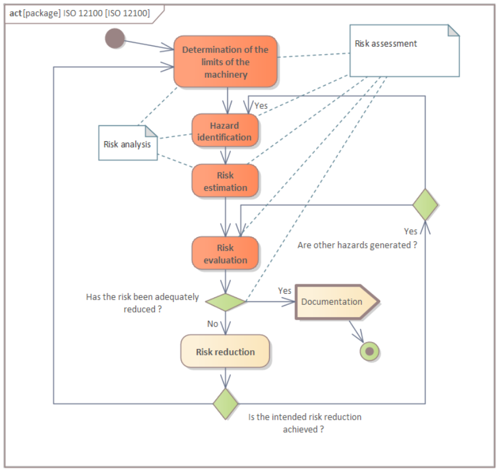
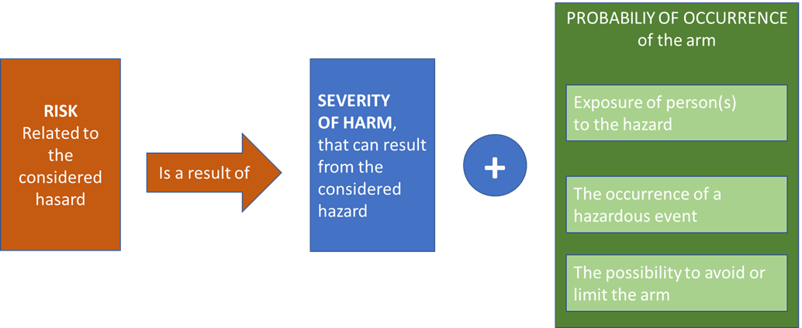
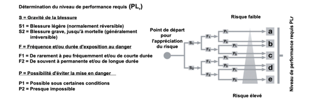
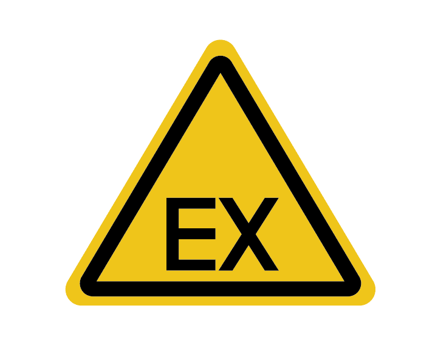
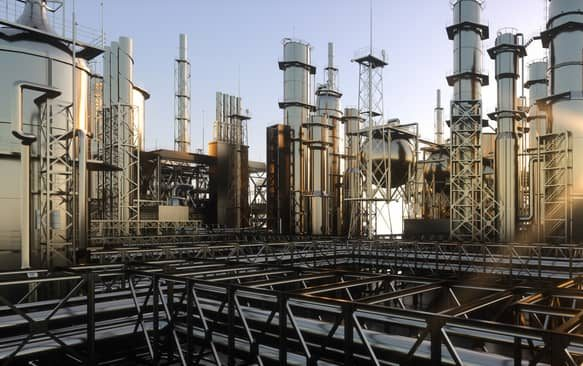
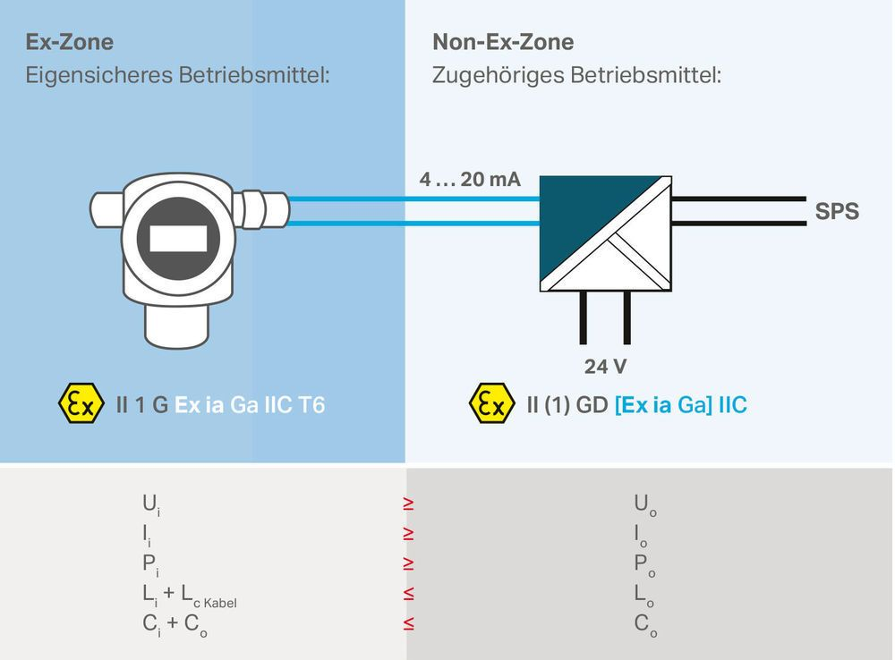
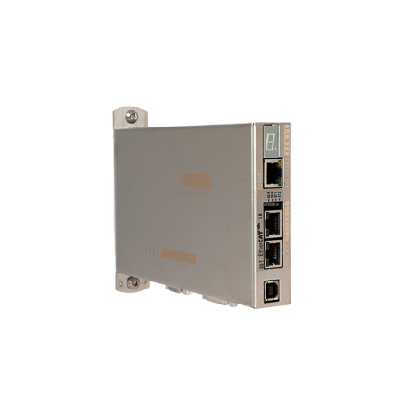
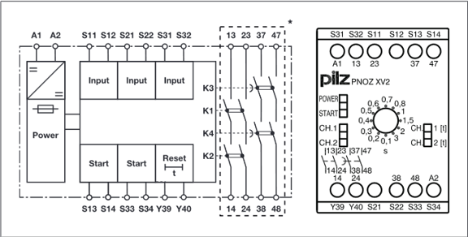

<h1 align="left">
   
  
   
  Industrial Automation Base
   
</h1>

Cours AutB

Author: [Cédric Lenoir](mailto:cedric.lenoir@hevs.ch)

# Module 09 2 Mechatronische Sicherheitselemente

## Vorschau
Die Verwendung von PackML trägt dazu bei, die Einhaltung der Maschinensicherheit durch sein Softwaredesign zu vereinfachen.

Durch die unterschiedlichen Betriebszustände lässt sich klar definieren, was in welchen Zuständen möglich ist bzw. nicht möglich ist, beispielsweise:
- Wir können definieren, dass der Zustand **Abgebrochen** einem Energiemangel entspricht, der bei verschiedenen Elementen gefährdet ist. Bei Motoren führt dies meistens zu einem Zustand **STO**, **Safe Torque Off**, der einem garantierten Strommangel im Motor entspricht.
- Wir können einen **Gestoppt**-Zustand definieren, um zu garantieren, dass sich auf den mobilen Elementen nichts bewegt. Auch hier besteht für die Motorelemente die Möglichkeit, das sogenannte **SOS**, **Safe Operating Stop**, zu installieren.
- Auch eine klare Unterscheidung der Betriebsarten ist möglich. Einige Maschinen können mit einem Sicherheitssystem ausgestattet sein, das unter bestimmten Bedingungen den Betrieb einer Maschine mit offenen Türen ermöglicht. 
- Die erste dieser Bedingungen besteht darin, sicherzustellen, dass sich die Maschine im manuellen Modus befindet. 
- Die zweite Bedingung ist, dass der Bediener eine Steuerung vom Typ Totmanngriff verwendet. 
- Die dritte Bedingung besteht darin, dass die beweglichen Elemente, typischerweise die elektrischen Achsen, mit einem Sicherheitssystem vom Typ **SLS** (Safe Low Speed**) ausgestattet sind, das garantiert, dass die beweglichen Elemente eine bestimmte Grenze, typischerweise in der Größenordnung von 2 Metern pro Minute, nicht überschreiten können.

Das Fehlen einer klaren und strikten Verwaltung von Zuständen und Betriebsarten kann die Umsetzung der Sicherheit erheblich erschweren oder die Maschine sogar gefährlich machen.

## Inhaltsverzeichnis

1. [Module 09 2 Mechatronische Sicherheitselemente](#module-09-2-mechatronische-sicherheitselemente)
  - [Vorschau](#vorschau)
  - [Zusammenfassung To Be Completed](#zusammenfassung-to-be-completed)
  - [Was Sie sich merken sollten](#was-sie-sich-merken-sollten)
  - [Was Sie wissen müssen](#was-sie-wissen-müssen)
  - [Aber trotzdem](#aber-trotzdem)

2. [Sicherheit und Rechtsgrundlagen](#sicherheit-und-rechtsgrundlagen)
  - [Maschinensicherheit](#maschinensicherheit)
    - [Kontext](#kontext)
    - [Einführung in die Sicherheit automatisierter Systeme](#einführung-in-die-sicherheit-automatisierter-systeme)
    - [Rechte und Pflichten](#rechte-und-pflichten)
    - [Maschinensicherheit und Maschinensteuerung](#maschinensicherheit-und-maschinensteuerung)
    - [Gesetzliches Glossar](#gesetzliches-glossar)
    - [Rechtsgrundlage](#rechtsgrundlage)
    - [Gemäss SUVA-Quelle](#gemäss-suva-quelle)
    - [So gewährleisten Sie die Maschinensicherheit](#so-gewährleisten-sie-die-maschinensicherheit)

3. [Sicherheit und Standards](#sicherheit-und-standards)
  - [Präambel](#präambel)
  - [Prinzip](#prinzip)

4. [ISO 12100](#iso-12100)
  - [ISO 12100 Allgemeine Grundsätze](#iso-12100-allgemeine-grundsätze)
  - [Bestimmung der Maschinengrenzen](#bestimmung-der-maschinengrenzen)
  - [Gefahrenidentifizierung](#gefahrenidentifizierung)
  - [Risikoabschätzung](#risikoabschätzung)
  - [Risikobewertung](#risikobewertung)

5. [ISO 13489](#iso-13489)
  - [Grundsätze der ISO 13489](#grundsätze-der-iso-13489)
  - [Erforderliches Leistungsniveau PLr](#erforderliches-leistungsniveau-plr)
  - [Hardware- und Software-Systemstruktur (Kategorien)](#hardware--und-software-systemstruktur-kategorien)
  - [Fehlermechanismus, Diagnoseabdeckung, DC](#fehlermechanismus-diagnoseabdeckung-dc)
  - [Was bedeutet es MTTFd?](#was-bedeutet-es-mttfd)
  - [Was ist ein CCF-Fehler gemeinsamer Ursache?](#was-ist-ein-ccf-fehler-gemeinsamer-ursache)

6. [Explosionsschutz](#explosionsschutz)
  - [Was sind Ex- bzw. ATEX-Zonen?](#was-sind-ex--bzw-atex-zonen)
  - [Ethernet-APL im Ex-Bereich](#ethernet-apl-im-ex-bereich)
  - [Was ist Eigensicherheit?](#was-ist-eigensicherheit)

7. [Ein paar Fragen...](#ein-paar-fragen)
  - [...über die Automatisierungslaborzellen.](#über-die-automatisierungslaborzellen)
  - [Bewerten Sie diesen Roboter im ISO 12100-Kontext](#bewerten-sie-diesen-roboter-im-iso-12100-kontext)
  - [Timer am Sicherheitsrelais](#timer-am-sicherheitsrelais)
  - [PackML mit Sicherheit](#packml-mit-sicherheit)

## Was Sie sich merken sollten
- Je nach Branche gibt es spezifische Gesetze zur Sicherheit.
- Normen dienen als Leitfaden bei der Anwendung von Gesetzen.
- Die Einhaltung dieser Gesetze **garantiert das Recht, die Maschinen in Europa zu verkaufen**.
- Es ist die Aufgabe des Herstellers, seine Maschine nach den Regeln der Technik zu konstruieren und herzustellen, **Unkenntnis der Gesetze schützt nicht vor Strafe**.
- Es ist notwendig, Sicherheitsbeschränkungen **vor** dem Bau der Maschine zu berücksichtigen!

> Ich glaube, dass Sicherheit in erster Linie die Aufgabe einer erfahrenen Person ist; Sie müssen sich jedoch der mit der Sicherheit verbundenen Erfordernisse bewusst sein, um sich gegebenenfalls an eine Person mit den erforderlichen Fähigkeiten und Erfahrungen wenden zu können.

## Was Sie wissen müssen
- Verständnis des **ISO 12100**-Schemas
- Verstehen Sie die Konzepte von PL in **ISO 13489**.
- Unterscheiden Sie zwischen Gesetz und Norm.
- Wissen, was eine Ex-Zone und Eigensicherheit sind.
- Wissen, wofür die **SUVA** da ist.

### Aber trotzdem
- Der Arbeitgeber ist für die Arbeitssicherheit in seinem Unternehmen verantwortlich.
- Arbeitnehmer sind verpflichtet, den Anweisungen des Arbeitgebers Folge zu leisten.
- Hersteller, Importeure und Händler unterliegen dem Produktsicherheitsgesetz.
- Maschinen dürfen die Sicherheit und Gesundheit ihrer Benutzer nicht gefährden.
- Hersteller sind verpflichtet, eine Risikobewertung und -minderung durchzuführen.
- Nehmen Sie niemals Manipulationen an Maschinenschutzvorrichtungen vor.

# Sicherheit und Rechtsgrundlagen
## Maschinensicherheit
### Kontext
Hier betrachten wir den Kontext der Maschinensicherheit, akzeptieren jedoch, dass die Sicherheitsbeschränkungen je nach Branche, in der wir arbeiten, sehr unterschiedlich sein können. Aus diesem Grund bleibt dieses Kapitel sehr allgemein.
In der praktischen Arbeit werden wir uns mit einem konkreten Fall eines Not-Halts an einer Maschine befassen.
### Einführung in die Sicherheit automatisierter Systeme
- Kontext
- Rechtsgrundlagen und Normen
- allgemeine Grundsätze
- Sonderfall
### Rechte und Pflichten
- Der Arbeitgeber ist für die Arbeitssicherheit in seinem Unternehmen verantwortlich
- Arbeitnehmer sind verpflichtet, den Anweisungen des Arbeitgebers Folge zu leisten
- Hersteller, Importeure und Händler unterliegen dem Produktsicherheitsgesetz.

    
    
Safety the law, Source: <a href="https://www.suva.ch">SUVA Website</a>

### Maschinensicherheit und Maschinensteuerung

- Maschinen dürfen die Sicherheit und Gesundheit ihrer Benutzer nicht gefährden.
- Hersteller sind verpflichtet, eine Risikobewertung und -minderung durchzuführen.
- Nehmen Sie niemals Manipulationen an Maschinenschutzvorrichtungen vor.

    
    
E-Stop: <a href="https://www.festo.com/">Festo Website</a>

### Gesetzliches Glossar
- Bundesgesetz
- Die Verordnungen
- Richtlinien (CH)
- Richtlinien (Arten von EU-Gesetzgebungsakten)
- Normen
### Rechtsgrundlage
Rechtsgrundlage ist die Verordnung vom 2. April 2008 über die Sicherheit von Maschinen (MaschinenV; SR 819.14), welche die Anforderungen der Richtlinie 2006/42/EG über Maschinen in Schweizer Recht umsetzt.
### Gemäss SUVA-Quelle
[Wie können Hersteller die Maschinensicherheit gewährleisten?](https://www.suva.ch/fr-ch/prevention/themes-specialises/securite-des-machines-et-commandes-de-machines)
#### Maschinensicherheit und Maschinensteuerung

- Bei bestimmungsgemäßer und bestimmungsgemäßer Verwendung dürfen Maschinen weder die Sicherheit noch die Gesundheit ihrer Benutzer oder Dritter gefährden.
- Alle Maschinen müssen grundlegende Gesundheits- und Sicherheitsanforderungen erfüllen.
- Hersteller sind verpflichtet, eine Risikobewertung und -minderung durchzuführen.
- Vergewissern Sie sich vor dem Kauf einer Maschine, dass diese für den vorgesehenen Einsatzzweck geeignet ist, den Sicherheitsvorschriften entspricht und einfach zu bedienen ist.
- Nehmen Sie niemals Manipulationen an Maschinenschutzvorrichtungen vor.
Sicherheit geht vor
Es dürfen nur Maschinen in Verkehr gebracht und verwendet werden, die bei normaler oder vernünftigerweise vorhersehbarer Verwendung keine oder nur eine minimale Gefahr für die Gesundheit oder Sicherheit der Benutzer oder Dritter darstellen.
#### Bundesproduktsicherheitsgesetz, LSPro.
Die für das Inverkehrbringen von Produkten Verantwortlichen (Hersteller, Importeure und Händler) müssen sicherstellen, dass die betreffenden Produkte den Anforderungen des **Bundesgesetzes über die Produktesicherheit** [LSPro](https://www.admin.ch/opc/fr/classified-compilation/20081129/index.html) und der **Verordnung über die Produktesicherheit** [OSPro](http://www.admin.ch/ch/f/sr/c930_111.html) entsprechen.

#### Maschinenverordnung, OMach und Maschinenrichtlinie 2006/42/EG
Die [Maschinenverordnung](http://www.admin.ch/ch/f/sr/c819_14.html) regelt das Inverkehrbringen von Maschinen und die Marktüberwachung gemäss Richtlinie [2006/42/EG](http://eur-lex.europa.eu/LexUriServ/LexUriServ.do?uri=OJ:L:2006:157:0024:0086:FR:PDF) . Um die Anwendung dieser europäischen Richtlinie zu erleichtern, wurde ein [Leitfaden](http://ec.europa.eu/DocsRoom/documents/9483/attachments/1/translations/fr/renditions/native) veröffentlicht.

#### CFST-Richtlinie 6512 „Arbeitsmittel“
Die [CFST-Richtlinie, Arbeitsmittel](https://www.suva.ch/fr-ch/prevention/themes-specialises/securite-des-machines-et-commandes-de-machines#uxlibrary-material=dd14bcc187d79ec7b2d9d3d85279d94c) gibt vor, wie die Anforderungen an die Sicherheit und den Gesundheitsschutz der Arbeitnehmer im Zusammenhang mit der Beschäftigung, Verwendung und Wartung von Arbeitsmitteln eingehalten werden können.

#### So gewährleisten Sie die Maschinensicherheit
Um die Maschinensicherheit zu gewährleisten, müssen Maschinenhersteller und -betreiber verschiedene Aspekte beachten.
- [Hersteller](https://www.suva.ch/fr-ch/shared-data/components/shared-safety-rule/maschinensicherheit/content-filter-item-hersteller?&showContainer=2&sc_mode=normal)
- [Benutzer](https://www.suva.ch/fr-ch/shared-data/components/shared-safety-rule/maschinensicherheit/content-filter-item-anwender?&showContainer=2&sc_mode=normal)

##### Nachweis der Produktsicherheit
Als Hersteller tragen Sie die Verantwortung für die Sicherheit Ihrer Maschinen. Sie müssen die geltenden gesetzlichen Bestimmungen einhalten, eine Risikobewertung durchführen und auf dieser Grundlage eine Lösung entwickeln, die den europäischen Normen entspricht.

Wenn Sie ein Produkt in Verkehr bringen, müssen Sie nachweisen können, dass es keine Gefahr für die Gesundheit und Sicherheit von Menschen darstellt. Dieser Nachweis muss mittels Risikobeurteilung, Prüfung oder anderen geeigneten Methoden erbracht und in einer technischen Dokumentation festgehalten werden.

Die Suva überwacht als Aufsichtsorgan die Umsetzung der Bestimmungen des Produktesicherheitsgesetzes. Weitere Informationen zu diesem Thema finden Sie unter der Überschrift „Produktesicherheit: [Die Suva gewährleistet die Marktüberwachung](https://www.suva.ch/fr-CH/materiel/fiche-thematique/securite-des-produits/).

##### Sicherheitskonzept
Die Produkt- oder Maschinenschutzeinrichtungen dürfen nicht mit einfachen Mitteln umgangen oder manipuliert werden können. Für Schutzeinrichtungen im Gefahrenbereich von Pressen gelten höhere Sicherheitsanforderungen als für einfache Bandförderer. Allerdings ist in beiden Fällen ein Sicherheitskonzept notwendig. Darin sind insbesondere die erforderlichen Schutz- und Kontrolleinrichtungen, deren Umfang und erforderliche Qualität anzugeben.

##### Konformitätserklärung
Für Produkte, die europäischen Richtlinien unterliegen, müssen Sie eine Konformitätserklärung erstellen. Damit bescheinigen Sie als Verantwortlicher für das Inverkehrbringen, dass das Produkt die grundlegenden Gesundheits- und Sicherheitsanforderungen erfüllt und geben an, um welche Anforderungen es sich handelt. Sie bestätigen weiterhin, dass die Konformitätsbewertung ordnungsgemäß durchgeführt wurde. Geben Sie gegebenenfalls auch die weiteren Richtlinien an, denen Ihre Maschine entspricht.

Die grundlegenden Gesundheits- und Sicherheitsanforderungen für Maschinen sind in der Maschinenrichtlinie festgelegt. In Bezug auf Maschinensteuerungen verlangt die [Maschinenrichtlinie](http://eur-lex.europa.eu/LexUriServ/LexUriServ.do?uri=OJ:L:2006:157:0024:0086:EN:PDF) insbesondere, dass Hardware- oder Softwarefehler keine gefährlichen Phänomene verursachen können.
Einen Überblick über die unterschiedlichen Anforderungen finden Sie in folgenden Veröffentlichungen:
- [CE-Konformität von Maschinen, Schritt für Schritt](https://www.suva.ch/fr-CH/materiel/fiche-thematique/conformite-ce-des-machines-pas-a-pas--informations-sur-la-mise-en-oeuvre-de-la-ce12-1-f-39425-38401/)
- [Maschinensicherheit – die Grundlagen der Risikobeurteilung](https://www.suva.ch/fr-CH/materiel/documentation/securite-des-machines--lessentiel-de-lappreciation-du-risque-condense-de-la-no-ce15-1-f-43326-42485/)
- [Maschinensicherheit – die Grundlagen der Risikominderung](https://www.suva.ch/fr-ch/prevention/themes-specialises/securite-des-machines-et-commandes-de-machines#uxlibrary-material=2a6c2d1a0ab535a97900ca5d23ac7e80)
- [Maschinensicherheitsfunktionen: das Wesentliche in Kürze](https://www.suva.ch/fr-CH/materiel/fiche-thematique/fonctions-de-securite-des-machines-lessentiel-en-bref-ce13-1-f-40151-39041/)

Europäische Normen definieren detaillierte Anforderungen, die dem aktuellen Stand der Technik entsprechen. Sie basieren auf der Maschinenrichtlinie und sind im Amtsblatt der Europäischen Union aufgeführt.

### Laut einer Quelle der Europäischen Union
Maschinenrichtlinie 2006/42/EG https://eur-lex.europa.eu/
#### Auszüge aus der Maschinenrichtlinie
##### Artikel 2 „Maschine“
Gesamtheit, die mit einem anderen Antriebssystem als der unmittelbar angewandten menschlichen oder tierischen Kraft ausgestattet ist oder ausgestattet werden soll und aus miteinander verbundenen Teilen oder Organen besteht, von denen mindestens eines beweglich ist und die für eine bestimmte Anwendung zusammengefügt sind.
##### Artikel 5
Bevor eine Maschine auf den Markt gebracht und/oder in Betrieb genommen wird, muss der Hersteller oder sein Vertreter...
-  **HAT**. stellt sicher, dass die wesentlichen Gesundheits- und Sicherheitsanforderungen erfüllt werden. …
- **B**. stellt sicher, dass die technischen Unterlagen… verfügbar sind
- **C**. stellt …die Bedienungsanleitung zur Verfügung;
- **D**. wendet die Bewertungsverfahren an…
- **E**. legt die EG-Erklärung fest
- **F**. bringt die „CE“-Kennzeichnung an
##### Artikel 6 Freizügigkeit, §1
> „Die Mitgliedstaaten dürfen das Inverkehrbringen und/oder die Inbetriebnahme von Maschinen, die dieser Richtlinie entsprechen, in ihrem Hoheitsgebiet **nicht verbieten**, einschränken oder behindern.“

---

## Sicherheit und Standards
### Präambel
> Dieser Teil des Kurses sollte als Einführung in Sicherheitssysteme betrachtet werden, um dem Studenten zu ermöglichen, die grundlegenden Mechanismen eines Sicherheitssystems zu verstehen und ihn auf umfassendere Literatur, beispielsweise die der Sistema-Software, hinzuweisen oder ihn zu Ad-hoc-Schulungen anzuleiten. Es kann in keinem Fall als Validierung in Sicherheitssystemen betrachtet werden.
### Prinzip
Basierend auf der Norm **ISO 12100**, deren Übersicht hauptsächlich aus SUVA-Dokumenten stammt und im Folgenden wiedergegeben wird, werden wir die mit der Maschine und ihrer Verwendung verbundenen Risiken analysieren. Grundlegende Maßnahmen sind oft selbstverständlich, wie etwa der richtige Umgang mit der Maschine und die mechanische Absicherung von Gefahrenbereichen.
Zweitens: Wenn sich herausstellt, dass weitere technische Maßnahmen zum Schutz von Personen, wie beispielsweise eine Lichtschranke, erforderlich sind, muss das Problem auf Grundlage der Norm **ISO 13489** oder möglicherweise **IEC 62061** angegangen werden.

---

## ISO 12100
### ISO 12100 Allgemeine Grundsätze
- die Grenzen der Maschine bestimmen
- die Gefahren erkennen
- schätzen… unter Berücksichtigung der Schwere
- beurteilen, ob eine Reduzierung erforderlich ist
- Gefahren beseitigen oder Risiken verringern
### Gemäss SUVA
Richtlinie **2006/42/EG**, Maschinenrichtlinie. verpflichtet den Hersteller einer Maschine, eine Risikobeurteilung durchzuführen und Maßnahmen zur Risikominderung zu ergreifen.
Die Norm EN **ISO 12100** legt die grundlegende Terminologie, Grundsätze und eine Methodik zur Gewährleistung der Sicherheit bei der Konstruktion von Maschinen fest. Es definiert Grundsätze der Bewertung und
Risikominderung und beschreibt Methoden zur Identifizierung gefährlicher Phänomene und zur Beurteilung und Bewertung von Risiken in den wichtigsten Phasen des Lebens
einer Maschine und ermöglicht außerdem die Beseitigung gefährlicher Phänomene oder die Erzielung einer ausreichenden Risikominderung.

> Zusammenfassend:
> > Die Schweiz wendet die europäische Richtlinie an. Daher hat diese Richtlinie Gesetzeskraft und die Norm ISO 12100 definiert, wie dieses Gesetz eingehalten werden kann. Doch an keiner Stelle ist gesetzlich festgelegt, dass diese Richtlinie eingehalten werden muss. Weiter unten gibt es Normen wie ISO-13489, die bei der Konstruktion von Maschinen helfen, die der Norm ISO 12100 entsprechen.

> Indem wir das V-Diagramm etwas strecken, können wir es wie folgt zusammenfassen:

Die Risikobeurteilung besteht aus einer Reihe logischer Schritte, die eine systematische Analyse und Bewertung der mit der Maschine verbundenen Risiken ermöglichen. Je nach Fall kann es durch Maßnahmen zur Risikominderung und meistens durch eine Wiederholung des Prozesses ergänzt werden.

Um das Ziel der Risikominderung zu erreichen, d. h. gefährliche Phänomene durch die Anwendung geeigneter Schutzmaßnahmen zu beseitigen oder Risiken zu verringern, wird Folgendes angewendet:
Drei-Schritte-Methode in der unten aufgeführten Reihenfolge.
##### Intrinsische Präventionsmaßnahmen:
Beseitigt gefährliche Phänomene oder verringert die damit verbundenen Risiken durch eine sorgfältige Auswahl der Konstruktionsmerkmale.
##### Zusätzliche Schutz- und/oder Präventionsmaßnahmen:
Setzen Sie zur Risikominderung geeignete technische und ergänzende Schutzmaßnahmen ein, wenn ein gefährliches Phänomen nicht ausgeschlossen werden kann oder das damit verbundene Risiko durch eine eigensichere Konstruktion nicht ausreichend verringert werden kann.
##### Gebrauchsanweisung:
Bleiben trotz eigensicherer Konstruktion und Anwendung technischer und zusätzlicher Sicherheitsmaßnahmen Risiken bestehen, müssen in den Benutzerinformationen alle Restrisiken angegeben werden.

#### Intrinsische Präventionsmaßnahmen:
Die intrinsische Prävention ist der erste und wichtigste Schritt im Prozess der Risikominderung, da in den Eigenschaften der Maschine begründete Präventionsmaßnahmen gute Chancen haben, jederzeit wirksam zu bleiben.
- Berücksichtigung geometrischer Faktoren und physikalischer Aspekte
- Berücksichtigung allgemeiner technischer Kenntnisse zur Maschinenkonstruktion
- Die Wahl der richtigen Technologie
- Anwendung des Prinzips der positiven mechanischen Wirkung
- Stabilitätsbestimmungen
- Bestimmungen zur Wartungsfähigkeit
- Einhaltung ergonomischer Grundsätze
- Vermeiden Sie gefährliche elektrische Phänomene
- Vermeiden Sie gefährliche hydraulische und pneumatische Phänomene
- Anwendung intrinsischer Präventionsmaßnahmen auf Kontrollsysteme
- Minimieren Sie die Ausfallwahrscheinlichkeit von Sicherheitsfunktionen
- Begrenzung der Exposition gegenüber gefährlichen Phänomenen durch die Zuverlässigkeit der Ausrüstung
- Begrenzung der Gefährdung durch Mechanisierung oder Automatisierung der Lade- (Zuführung)/Entlade- (Evakuierung) Vorgänge
- Begrenzung der Exposition gegenüber gefährlichen Phänomenen durch Positionierung von Einstell- und Wartungspunkten außerhalb der Gefahrenbereiche

#### Zusätzliche Schutz- und/oder Präventionsmaßnahmen:
Zum Schutz von Personen müssen Schutzvorrichtungen und Schutzeinrichtungen eingesetzt werden, wenn die Anwendung interner Präventionsmaßnahmen bestimmte gefährliche Phänomene nicht ausreichend beseitigen oder das damit verbundene Risiko nicht ausreichend verringern kann.
- Auswahl und Einsatz von Protektoren und Schutzeinrichtungen
- Anforderungen an die Gestaltung und den Bau von Schutzeinrichtungen
- Anforderungen an Protektoren
- Technische Eigenschaften der Schutzeinrichtungen
- Schutzmaßnahmen zur Emissionsminderung
Wenn Maßnahmen zur Emissionsminderung an der Quelle nicht ausreichen, sollten zusätzliche Präventivmaßnahmen an der Maschine umgesetzt werden.
- Lärm
- Vibes
- Gefährliche Stoffe
- Strahlungen
- Zusätzliche vorbeugende Maßnahmen
Abhängig von der normalen Verwendung der Maschine und einem vernünftigerweise vorhersehbaren Missbrauch müssen möglicherweise andere Präventivmaßnahmen als die intrinsischen Präventivmaßnahmen, Schutzmaßnahmen oder Benutzerinformationen ergriffen werden. 
- Komponenten und Elemente, die die Not-Aus-Funktion gewährleisten
- Maßnahmen, die den Gefangenen die Flucht oder Rettung ermöglichen
- Bestimmungen über die Kaution
- Vorkehrungen, die die Handhabung von Maschinen und ihren schweren Teilen erleichtern und sicher machen sollen
- Bestimmungen zur Sicherheit des Zugangs zu Maschinen

#### Hinweise zur Verwendung
Dem Benutzer müssen Informationen über die normale Verwendung der Maschine zur Verfügung gestellt werden, die insbesondere alle Betriebsarten berücksichtigen.
Die Informationen müssen alle Anweisungen enthalten, die für die ordnungsgemäße und sichere Verwendung der Maschine erforderlich sind. Hierzu müssen sie die Benutzer über das Restrisiko informieren und warnen.
Folgende Punkte sollten beachtet werden:
- Ort und Art der Nutzungsinformationen
- Signale und Warneinrichtungen
- Aufschriften, Schilder (Piktogramme) und schriftliche Warnhinweise
- Begleitdokumente (insbesondere Bedienungsanleitung)
- Erstellung der Bedienungsanleitung
- Entwicklung und Erstellung von Nutzungsinformationen
### Informationen zur Risikobewertung
- Benutzerspezifikationen, **URS**.
- voraussichtliche Spezifikationen der Maschinen, Beschreibung der verschiedenen Phasen des gesamten Lebenszyklus, Konstruktionszeichnungen, Energiequellen.
- Dokumentation über frühere Konstruktionen ähnlicher Maschinen
- **Informationen zur Benutzung der Maschine**
- Vorschriften, Normen, technische Spezifikationen, Sicherheitsdatenblätter

    
    
General principle of ISO 12100, Source: <a href="https://www.iso.org/standard/51528.html"> ISO 12100:2010 Safety of machinery — General principles for design — Risk assessment and risk reduction</a>

### Bestimmung der Maschinengrenzen
Die Maschinengrenzen in allen Phasen des Lebenszyklus müssen unter Berücksichtigung folgender Punkte ermittelt werden:
- Maschineneigenschaften und Leistung
- auf Maschinenebene. am Prozess beteiligte Personen
- Maschinenumgebung
- im Zusammenhang mit maschinenbezogenen Produkten

    
    
Les limites d'une machine selon ISO 12100, Source: <a href="https://chatgpt.com/"> ChatGPT</a>

#### Einsatzgrenzen in allen Lebensphasen und Betriebsarten
- der Verwendungszweck
- vorhersehbarer Fehlgebrauch
#### Räumliche Grenzen
- Bewegungsbereich
- menschliche Interaktion wie z. B. Bediener-Maschine-Schnittstelle
- die Schnittstelle zur Stromversorgung
#### Zeitlimits
- Lebensdauergrenze der Maschine und einiger ihrer Komponenten
- empfohlene Wartungsintervalle
#### Andere Grenzen
- Eigenschaften des/der zu behandelnden Materials/Materialien
- Wartung, das erforderliche Maß an Sauberkeit
- Umweltbedingungen
### Gefahrenidentifizierung
Identifizierung von Maschinensituationen durch Ermittlung, welche Vorgänge von Maschinen und welche von Menschen ausgeführt werden müssen.
Dabei müssen folgende Elemente berücksichtigt werden:
- Maschine, zu verarbeitendes Material, Umgebung
- Menschliche Interaktion während des gesamten Maschinenlebenszyklus
- Mögliche Zustände der Maschine
- Unbeabsichtigtes Bedienerverhalten oder vernünftigerweise vorhersehbarer Missbrauch der Maschine
In den beobachteten Maschinensituationen müssen sämtliche Gefährdungen, gefährlichen Situationen und/oder gefährlichen Ereignisse systematisch erkannt werden.

### Risikoabschätzung
Abschätzung des Risikos jeder Gefahrensituation durch Bestimmung der Risikoelemente:
- die Schwere des Schadens (Verletzung oder Gesundheitsschädigung)
- die Wahrscheinlichkeit eines Schadens durch:
- die Gefährdung der Person(en),
- das Eintreten eines gefährlichen Ereignisses und
- die technischen und personellen Möglichkeiten zur Schadensvermeidung bzw. -begrenzung

#### Zu beachten:
- Exponierte Personen
- Art, Häufigkeit und Dauer der Gefährdung
- Zusammenhang zwischen Gefährdungsexposition und Auswirkungen
- Menschliche Faktoren
- Angemessenheit der Schutzmaßnahmen
- Möglichkeit, Schutzmaßnahmen zu umgehen oder zu umgehen
- Fähigkeit zur Aufrechterhaltung von Schutzmaßnahmen
- Nutzungsinformationen
 

    
    
Estimation du risque

### Risikobewertung
Mit der Risikobewertung wird entschieden, ob Maßnahmen zur Risikominderung erforderlich sind bzw. ob das Risiko als ausreichend gemindert angesehen werden kann.
Eine angemessene Risikominderung wird erreicht, wenn:
- alle Betriebsbedingungen und alle Eingriffsmethoden berücksichtigt wurden,
- Gefahren beseitigt oder Risiken auf das geringstmögliche Maß reduziert wurden,
- alle durch die Schutzmaßnahmen geschaffenen neuen Gefahren angemessen berücksichtigt wurden;
- die Benutzer ausreichend informiert und vor den Restrisiken gewarnt sind;
- die Schutzmaßnahmen miteinander vereinbar sind,
- den Folgen, die sich aus der Verwendung einer für den professionellen/industriellen Einsatz konzipierten Maschine in einem nicht-professionellen/nicht-industriellen Kontext ergeben können, ausreichend Rechnung getragen wurde, und
- die Schutzmaßnahmen die Arbeitsbedingungen des Bedieners und die Nutzung der Maschine nicht beeinträchtigen.

 

Zur angemessenen Risikominderung unter Berücksichtigung des aktuellen Stands der Technik, also mindestens entsprechend den gesetzlichen Anforderungen. Informationen zum Stand der Technik finden Sie in den Normen, deren Titel im Amtsblatt der Europäischen Union veröffentlicht sind. Werden die Vorgaben einer gelisteten Maschinensicherheitsnorm, **Typ C-Norm**, auf Basis einer Risikobeurteilung angewendet, kann davon ausgegangen werden, dass die grundlegenden Gesundheits- und Sicherheitsanforderungen der Maschinenrichtlinie 2006/42/EG, die von der Norm abgedeckt werden, eingehalten werden.

#### Typ-C-Standards
Sie befassen sich mit den detaillierten Sicherheitsanforderungen, die für eine bestimmte Maschine oder Maschinengruppe gelten. Diese Normen beschreiben Gefahren und Risiken genauer und schlagen die am besten geeigneten Schutzmaßnahmen vor.

Liegt für die Maschine keine Typ-C-Norm vor, kann der Stand der Technik im Risikovergleich berücksichtigt werden.

#### Risikovergleich:
Die mit einer Maschine verbundenen Risiken können unter bestimmten Kriterien mit denen ähnlicher Maschinen verglichen werden, die einer oder mehreren einschlägigen Normen des Typs C entsprechen.

## Zu verwendender Standardtyp
In Deutschland und damit auch in der Schweiz geht der Trend in Richtung der Norm **ISO 13489-1**. Dies ist der Standard, der von der Sistema-Software verwendet wird, die vom IFA **Institut für Arbeitsschutz** der Deutschen Gesetzlichen Unfallversicherung, dem deutschen Äquivalent der **SUVA** in der Schweiz, veröffentlicht wurde.

### IEC oder ISO? Was ISO 13849 besagt
- IEC 62061 und dieser Teil von ISO 13849 legen Anforderungen für den Entwurf und die Implementierung sicherheitsbezogener Steuerungssysteme für Maschinen fest. Bei der Anwendung einer dieser beiden Internationalen Normen kann entsprechend ihrem Anwendungsbereich davon ausgegangen werden, dass sie die entsprechenden grundlegenden Sicherheitsanforderungen erfüllt.
- EN ISO 13849-1 legt auch spezielle Anforderungen für SRP/SC (sicherheitsbezogene Teile von Steuerungssystemen) mit programmierbaren elektronischen Systemen fest.
- IEC 62061 definiert keine **Anforderungen an die Leistung nichtelektronischer sicherheitsrelevanter Steuerelemente**, z. B. hydraulische, pneumatische oder elektromechanische Maschine. SCR/CS / Sicherheitsrelevante Teile von Steuerungssystemen

#### CEI 62061 « style »

    
    
CEI_62021 SIL Safety integrity level, Source: <a href="www.zvei.org/automation">ZVEI Website</a>

#### ISO 13489-1 « style »
 

    
    
ISO_13489 PL Performance Levec, Source: <a href="www.zvei.org/automation">ZVEI Website</a>

Im weiteren Verlauf dieses Kurses werden wir einige Definitionen der **ISO 13489** definieren, oder einfacher gesagt diejenige, die es uns ermöglicht, das erforderliche Leistungsniveau PLr und das erreichte PL zu bestimmen.

### System 2
Zur Umsetzung der **ISO 13489** nutzen Sie bitte die Software Sistema 2, die auf der Website des [IFA der Bundesregierung](https://www.dguv.de/ifa/praxishilfen/practical-solutions-machine-safety/software-sistema/index.jsp) verfügbar ist.

Software-Assistent SISTEMA: Safety Integrity Software Tool zur Bewertung von Maschinenanwendungen
**Ein Tool zur einfachen Anwendung der Steuerungsnorm EN ISO 13849-1**
Vollständige Beispiele für die Implementierung dieser Software finden Sie auf der gleichen Website, wie zum Beispiel
#### SISTEMA Kochbücher
[SISTEMA-Kochbücher](https://www.dguv.de/ifa/praxishilfen/practical-solutions-machine-safety/software-sistema/sistema-kochbuecher/index.jsp)

    
    
Sistema 1, Source: <a href="https://www.dguv.de">DGUV Website</a>

## Grundsätze der ISO 13489
Nach der Bewertung des erforderlichen Leistungsniveaus PLr wird das erreichte Leistungsniveau PL anhand verschiedener Faktoren bewertet, wie z. B.
- Struktur des Hard- und Softwaresystems, Kategorien.
- Fehlermechanismus, Diagnosedeckungsgrad (DC)
- Komponentenzuverlässigkeit, Mittlere Zeit bis zum gefährlichen Ausfall, MTTFd,
- Gemeinsame Ursache für Fehler (CCF)

 

Da die Sistem-Software die Berechnung all dieser Faktoren ermöglicht, werden in der Praxis keine „manuellen“ Berechnungen durchgeführt. Wir werden **Sistema 2** verwenden.

### Erforderliches Leistungsniveau PLr
Wahrscheinlichkeit eines gefährlichen Ausfalls pro Stunde / PFHd

 

Der Performance Level **PL** ist ein Wert, der die Fähigkeit sicherheitsrelevanter Teile von Steuerungssystemen definiert, unter vorhersehbaren Bedingungen eine Sicherheitsfunktion auszuführen.
Andererseits wird der **erforderliche** Leistungslevel **PLr** verwendet, um die erforderliche Risikominderung für jede Sicherheitsfunktion zu erreichen. Daher muss der Performance Level **PL** der sicherheitsbezogenen Teile eines Steuerungssystems gleich oder größer als der erforderliche Performance Level **PLr** sein.

 

Siehe auch Abbildung unten [ISO 13489-1 « style »](#iso-13489-1--style-)

|Performance Level PL	|Probability of dangerous Failure per Hour **PFHd** 1/h|
|---------------------|------------------------------------------------------|
|**a**	|≥ \(10^{-5}\) and <\(10^{-4}\)|
|**b**	|≥ \(3 \times 10^{-5}\) and < \(10^{-5}\)|
|**c**	|≥ \(10^{-6}\) and < \(3 \times 10^{-6}\)|
|**d**	|≥ \(10^{-7}\) and < \(10^{-6}\)|
|**e**	|≥ \(10^{-8}\) and < \(10^{-7}\)|

#### Größenordnungen
Von mehreren gefährlichen Situationen pro Jahr für die PLa bis zu weniger als einer pro Jahrhundert für die PLe.

### Hardware- und Software-Systemstruktur (Kategorien)
Die Kategorien werden hauptsächlich nach ihrer Struktur (einfach oder doppelt (Redundanz)) festgelegt, aber auch nach ihrer Fähigkeit, Fehler in den Zweigen der Struktur zu erkennen, oder ihrer Robustheit gegenüber zwei nicht erkannten Fehlern.
|Struktur |Kategorie |Darstellung|
|---------------|-----------|--------------|
|Einkanalig |Kategorie B (Basic) |
|Einkanalig |Kategorie 1 Verwendung sicherer Komponenten.|
|Einkanalig, geprüft |Kategorie 2, Bauteildefekte im Funktionskanal werden durch Fehlererkennung über den Prüfkanal erkannt; der Sicherheitszustand wird erzeugt. *Hinweis: Die Funktions- und Testkette kann aus einer oder mehreren Komponente(n) bestehen*.|
|Zweikanalig, mit Fehlererkennung |Kategorie 3, Einfehlersicherheit durch Redundanz, Prüfung. *Hinweis: Jeder Kanal kann eine oder mehrere Komponenten enthalten*.
|Zweikanalig, mit Fehlererkennung |Kategorie 4, wie Kategorie 3, jedoch zusätzlich robust gegen die Ansammlung zweier unerkannter Fehler. *Hinweis: Jeder Kanal kann eine oder mehrere Komponenten enthalten.*

> Beispiel für einen getesteten Kanal: Entlang des getesteten Kanals wird ein Impuls erzeugt, um sicherzustellen, dass das System einen Fehler meldet, wenn ein sicheres Signal zu einem einfachen 24-V-Gleichstromsignal kurzgeschlossen wird.

> Beispiel für den Übergang von Kategorie 3 zu Kategorie 4: Ein Türöffnungserkennungssystem wechselt erst in den aktiven Zustand, wenn die Tür geöffnet und geschlossen wurde, um die Erkennung der Türöffnung zu validieren.

 

    
    
Catégories design architecture for ISO 13489-1, Source: <a href="https://www.se.com/ww/en/work/solutions/safety/">Schneider Electric Website</a>

### Fehlermechanismus, Diagnoseabdeckung, DC
Fehlermechanismus, **Diagnoseabdeckung**, DC
Ein Maß für die diagnostische Wirksamkeit, das als Verhältnis der Ausfallrate erkannter gefährlicher Ausfälle zur Ausfallrate aller gefährlichen Ausfälle bestimmt werden kann

> Wenn beispielsweise ein Öffnerkontakt in einem Relais verschweißt ist, könnte der Zustand des Schließerkontakts fälschlicherweise einen offenen Stromkreis anzeigen, es sei denn, das Relais verfügt über mechanisch verbundene Schließer- und Öffnerkontakte, bei denen der Fehler erkannt werden kann.

Der Standard erkennt vier Ebenen:

#### Diagnostic coverage
|Denotation	|Range|
|-----------|-----|
|None	|DC < 60%|
|Low	|60% ≤ DC < 90%|
|Medium	|90% ≤ DC < 99%|
|High	|99% ≤ DC|

- Hoch: Mehr als 99 % der gefährlichen Fehler werden erkannt
- Mittel: 90 bis 99 % der gefährlichen Fehler werden erkannt
- Niedrig: 60 bis 90 % der gefährlichen Fehler werden erkannt
- Keine: weniger als 60 % der gefährlichen Fehler werden erkannt

###	Was bedeutet es MTTFd ?
Mean Time To Dangerous Failure

#### Reliability levels of components
|Index	|Range|
|-------|-----|
|Low	|3 years ≤ MTTFd < 10 years
|Medium	|10 years ≤ MTTFd < 30 years
|High	|30 years ≤ MTTFd < 100 years

Eine MTTFd von weniger als 3 Jahren sollte nie erreicht werden, da dies bedeuten würde, dass sich eine Betriebskomponente nach einem Jahr in 30 % der Fälle in einem gefährlichen Zustand befindet.

### Was ist ein CCF-Fehler gemeinsamer Ursache?
#### Common Cause Failure CCF

Ein Fehler aufgrund gemeinsamer Ursache / Common Cause Failure, CCF, ist ein Fehler, bei dem:
Zwei oder mehr Elemente versagen innerhalb einer bestimmten Zeit, sodass der Erfolg der Systemmission ungewiss wäre.
Elementfehler resultieren aus einer gemeinsamen Ursache und einem Kopplungsfaktor (oder Mechanismus).
Konkret wird in der Sistema-Software je nach Art der Technologie, die die Vermeidung eines CCF ermöglicht, eine bestimmte Anzahl Punkte vergeben.

**Zum Beispiel :**
- Messung, bei der einerseits eine Messung mit einer analogen Schaltung und andererseits eine Messung mit einem Mikrocontroller erfolgt.
- Physikalische Trennung der Messkanäle, um eine gleichzeitige Beschädigung beider zu verhindern.
- Kurzschlussschutz.
- Vergleich der Schaltzeiten zweier paralleler Kontakte.

 

####	Safety over Ethercat / Sercos / Profinet
Derzeit gibt es gut entwickelte kommerzielle Technologien, die es ermöglichen, Sicherheitssignale zu übertragen und dann in „Software Logic“ mit einem „ausreichenden“ Niveau, PLd oder sogar PLr, zu verarbeiten.

    
    
Sercos or PROFIsafe network, Source: <a href="https://apps.boschrexroth.com/microsites/ctrlx-automation/en/portfolio/ctrlx-safety/">Bosch Rexroth Website</a>

---

## Zusammenfassend
- Wir analysieren das Risiko.
- Wir schätzen das Risiko ab.
- Wir reduzieren das Risiko.

--

# Explosionsschutz
Ein wichtiger Aspekt, der je nach Branche, typischerweise der **Chemieindustrie**, jedoch aufgrund von Volumenproblemen nicht berücksichtigt wird. Wir können uns auf eine Risikoanalyse vom Typ FMEA beziehen. 

[Web Suva : Explosionsschutz](https://www.suva.ch/fr-ch/prevention/par-danger/materiaux-rayonnements-et-situations-a-risque/explosions-dues-a-des-substances-inflammables-et-facilement-inflammables/principes-de-base-de-la-protection-contre-les-explosions).

Brochure SUVA en français [en annexe](./documentation/SUVA_Prévention%20des%20explosions_f.pdf).
Brochure SUVA en allemand [en annexe](./documentation/SUVA_Explosionsschutz_d.pdf).

    
    
Logo Zone Ex

### Was sind Ex- bzw. ATEX-Zonen?

#### Die ATEX-Richtlinie definiert sechs verschiedene Ex-Zonen.

##### Zone 0:
Ein Ort, an dem eine explosive Atmosphäre, bestehend aus einem Gemisch mit Luft aus brennbaren Substanzen in Form von Gas, Dampf oder Nebel, ständig, über lange Zeiträume oder häufig vorhanden ist.

##### Zone 1:
Orte, an denen bei normalem Betrieb gelegentlich eine explosionsfähige Atmosphäre aus einem Gemisch mit Luft aus brennbaren Stoffen in Form von Gas, Dampf oder Nebel auftreten kann.

##### Zone 2:
Bereich, in dem bei normalem Betrieb nicht damit zu rechnen ist, dass eine explosionsfähige Atmosphäre aus einem Gemisch mit Luft brennbarer Stoffe in Form von Gas, Dampf oder Nebel auftritt, oder, wenn sie dennoch auftritt, nur von kurzer Dauer ist.

##### Zone 20:
Ein Ort, an dem eine explosionsfähige Atmosphäre in Form einer Wolke aus brennbarem Staub ständig, über lange Zeiträume oder häufig in der Luft vorhanden ist.

##### Zone 21:
Ort, an dem bei normalem Betrieb gelegentlich eine explosionsfähige Atmosphäre in Form einer Wolke aus brennbarem Staub auftreten kann.

##### Zone 22:
Bereich, in dem bei normalem Betrieb nicht damit zu rechnen ist, dass eine explosionsfähige Atmosphäre in Form einer Wolke aus brennbarem Staub auftritt, oder, wenn sie dennoch auftritt, dies nur von kurzer Dauer ist.

### Ethernet-APL im Ex-Bereich

Die Digitalisierung wurde in der Prozessindustrie lange Zeit dadurch behindert, dass es keine Verkabelungstechnologie gab, um Ethernet direkt an die Geräte vor Ort zu übertragen. Dies wird sich mit der Einführung von Ethernet-APL ändern.

> Auszug aus der Webseite www.ethernet-apl.org
> > Während beide Technologien entweder für die eine oder die andere oder für beide Anwendungen verwendet werden könnten, ist Ethernet-APL optimiert, um die Anforderungen von Prozessanlagen und insbesondere für explosionsgefährdete Bereiche mit verschiedenen Optionen für Explosionsschutz, einschließlich Eigensicherheit, zu erfüllen. Ein Einsatz auch in Standard-Industrieanwendungen ist nicht ausgeschlossen – allerdings mit höheren Kosten und einigen Einschränkungen bei Steckverbindern und Kabeln. SPE könnte auch in explosionsgefährdeten Bereichen eingesetzt werden, jedoch nicht mit eigensicheren Feldgeräten. Andere Schutzarten wie druckfeste „d“- oder überdruckgekapselte „p“-Gehäuse funktionieren mit SPE, bieten jedoch weniger Flexibilität bei Installation und Wartung. Die Wahl der Technologie sollte sich an praktischen und wirtschaftlichen Anforderungen orientieren.

Ethernet-APL (Advanced Physical Layer) ist eine Netzwerktechnologie, die auf die Anforderungen industrieller Umgebungen, einschließlich explosionsgefährdeter Bereiche (Ex-Zonen), zugeschnitten ist. Es ermöglicht eine schnelle und zuverlässige Ethernet-Kommunikation in rauen Umgebungen und erfüllt gleichzeitig die Sicherheitsstandards für Gefahrenbereiche.

#### Hauptfunktionen von Ethernet-APL:
- **Kompatibilität mit Ex-Zonen**: Ethernet-APL ist für den sicheren Betrieb in ATEX-klassifizierten Bereichen ausgelegt, einschließlich der Zonen 0, 1, 2, 20, 21 und 22.
- **Strom und Daten über ein einziges Kabel**: Ethernet-APL verwendet eine Zweidraht-Verkabelungstechnologie, die Strom und Kommunikation kombiniert, die Installation vereinfacht und die Kosten senkt.
- **Große Entfernungen**: Ermöglicht Verbindungen bis zu 1.000 Metern, was ideal für große Industrieanlagen ist.
- **Hoher Durchsatz**: Bietet standardmäßige Ethernet-Kommunikationsgeschwindigkeiten und ermöglicht so eine nahtlose Integration in moderne Steuerungssysteme.
- **Interoperabilität**: Kompatibel mit Industrieprotokollen wie PROFINET, EtherNet/IP und HART-IP.

#### Vorteile für Ex-Zonen:
- **Eigensicherheit**: Ethernet-APL erfüllt die Anforderungen an die Eigensicherheit und reduziert das Risiko von Funken oder Überhitzung in explosiven Umgebungen.
- **Kostensenkung**: Dank seiner vereinfachten Architektur senkt Ethernet-APL die Installations- und Wartungskosten.
- **Erweiterte Diagnose**: Ermöglicht die Echtzeitüberwachung von Geräten und verbessert so die Systemzuverlässigkeit und -verfügbarkeit.

#### Zusätzliche Ressourcen:
- [Ethernet-APL Overview](https://www.ethernet-apl.org/)
- [Dokumentation zu Ethernet-APL und Ex-Zonen](https://www.profibus.com/technology/ethernet-apl)

  
  
Beispiel einer Ethernet-APL-Anwendung im Ex-Bereich, Quelle: <a href="https://www.ethernet-apl.org/">Ethernet-APL Website</a>

From Hazardous Areas to the Enterprise with Ethernet

  
  
From Hazardous Areas to the Enterprise with Ethernet, Source: <a href="https://www.ethernet-apl.org/">Ethernet-APL Website</a>

### Was ist Eigensicherheit?

Eigensicherheit ist eine Methode zum Entwurf und Schutz elektrischer und elektronischer Geräte, die in Gefahrenumgebungen wie explosionsgefährdeten Bereichen oder **Ex-Zonen** eingesetzt werden. Ziel ist es, das Explosionsrisiko zu verhindern, indem die in einem Stromkreis verfügbare elektrische und thermische Energie so begrenzt wird, dass sie nicht ausreicht, um eine explosionsfähige Atmosphäre zu zünden.

#### Grundsätze der Eigensicherheit:
1. **Energiebegrenzung**: Die Schaltkreise sind für den Betrieb mit sehr niedrigem Energieniveau ausgelegt, um die Entstehung von Funken oder übermäßiger Hitze zu verhindern.
2. **Fehlerverhütung**: Komponenten werden ausgewählt und getestet, um sicherzustellen, dass sie auch bei einem Ausfall keine gefährlichen Bedingungen verursachen.
3. **Zertifizierung**: Eigensichere Geräte müssen nach internationalen Standards wie IEC 60079-11 zertifiziert sein.

#### Vorteile der Eigensicherheit:
- **Erhöhte Sicherheit**: Reduziert das Explosionsrisiko in gefährlichen Umgebungen erheblich.
- **Vereinfachte Wartung**: Eigensichere Geräte können oft gewartet werden, ohne dass eine Trennung oder Abschaltung erforderlich ist.
- **Kompatibilität mit Ex-Zonen**: Geeignet für die Zonen 0, 1, 2, 20, 21 und 22.

#### Typische Anwendungen:
- Sensoren und Messgeräte in der Öl-, Gas- und Chemieindustrie.
- Kommunikations- und Steuerungssysteme in explosionsgefährdeten Umgebungen.
- Tragbare Geräte wie Gasdetektoren.

  
  
Exemple de circuit intrinsèquement sûr, Source: <a href="https://www.process.vogel.de">Process Vogel Website</a>

#### Zusätzliche Ressourcen:
- [IEC 60079-11: Explosive atmospheres - Equipment protection by intrinsic safety "i"](https://webstore.iec.ch/)
- [SUVA : Sécurité intrinsèque et zones Ex](https://www.suva.ch)
En annexe:
- [Endress-Hauser en français](./documentation/Hendress%20Hauser%20CP00021Z11FR_1313_ATEX-BD.pdf).
- [Endress-Hauser en allemand](./documentation/Endress-Hauser-CP00021Z11DE_1517_ATEX_screen.pdf)

# Ein paar Fragen...
## ...über die Automatisierungslaborzellen.

  
  
Cellule d'automatin labo HEVS

- Intrinsische Präventionsmaßnahmen?
- Zusätzliche Präventionsmaßnahmen?
- Hinweise zur Nutzung?
 
- Den PLr-Level bewerten?
- Was sind die ergänzenden Elemente?

## Bewerten Sie diesen Roboter im ISO 12100-Kontext
- Eine Maschine ist mit einem kartesischen Hochgeschwindigkeitsroboter ausgestattet
\(vmax \space 2,3 \space [m/s]\) , \(amax \space 85 \space [m/s2]\)
- Der Bediener muss mehrmals pro Stunde die Möglichkeit haben, die Tür zu öffnen, um ein blockiertes Teil freizugeben.
- Der blockierte Raum ist klein und der Zugang kann schwierig sein.
- Wie installiere ich diesen Roboter?
- Bewerten Sie den PLr-Level des Sicherheitssystems des Roboters im Kontext seiner Installation.

  
  
Robot XYZ, Source: <a href="https://www.jennyscience.com/en/products/modular-construction/x-y-z-pick-and-place">Jenny Science Website</a>

### Im Kontext der [vorherigen Übung](#bewerten-sie-diesen-roboter-im-iso-12100-kontext).
- Feststellen, ob im STO-Zustand mit geöffneter Tür gearbeitet werden kann,
- Bestimmen Sie, ob es möglich wäre, mit dem Roboter bei geöffneter Tür zu arbeiten. Unter welchen Bedingungen?

  
  
Drive for Robot, Source: <a href="https://www.jennyscience.com/en/products/xenax-servo-controller/xvi-75v8s">Jenny Science Website</a>

## Timer am Sicherheitsrelais
- Das einfachste System zur Realisierung eines Not-Aus-Systems besteht aus dem Einsatz eines Sicherheitsrelais, hier PNOZ XV2 von Pilz.
- Im Falle eines Motors ist für eine mit einem Motor ausgestattete Anlage grundsätzlich ein Zeitrelais erforderlich.
- Wofür ?
- Wie würde im Fall dieses Relais die *Timer*-Einstellung für den [oben erwähnten Roboter](#bewerten-sie-diesen-roboter-im-iso-12100-kontext) lauten?

  
  
Relais de sécurité temporisé, Source: <a href="https://www.pilz.com/en-PE/eshop/Relay-modules/Safety-relays-protection-relays/PNOZ-X-safety-relays/Time-monitoring/PNOZ-XV2-3-24VDC-2n-o-2n-o-t/p/774502#productDetails">Pilz Website</a>

## PackML mit Sicherheit
- Das Konzept der Zustandsmaschine und des Betriebsmodus eignet sich besonders für die Verwaltung eines mit einem Motor ausgestatteten Systems.
- Erklären Sie, welche Zustände und Modi bei einem Sicherheits-**Bewegungssystem** mit den Modi SLS, SOS und STO sinnvoll sind.

  
  
PackML State Machine

<!-- End of file -->

