<h1 align="left">
  <br>
  
  <br>
  Industrial Automation Base
  <br>
</h1>

Cours AutB

Author: [Cédric Lenoir](mailto:cedric.lenoir@hevs.ch)

# Module 10 PLCopen Motion Control

*Keywords:* **PLCopen MC_Power MC_MoveAbsolute MC_Stop**


## Aperçu et objectifs.
- Programmation Robuste
- Application de PackML
- Introduction aux systèmes robotisés, principalement dans le module suivant.
- Combinaison de systèmes mécatroniques et pilotage en temps réel.

## Sommaire

- [Module 10 PLCopen Motion Control](#module-10-plcopen-motion-control)
- [Aperçu et objectifs](#aperçu-et-objectifs)
- [Objectifs du module](#objectifs-du-module)
  - [Renforcer les notions de programmation robuste en IEC 61131-3](#renforcer-les-notions-de-programmation-robuste-en-iec-61131-3)
  - [Présenter les éléments du Motion Control en PLCopen](#présenter-les-éléments-du-motion-control-en-plcopen)
- [PLCopen Motion Control](#plcopen-motion-control)
  - [Qu'est-ce que PLCopen ?](#quest-ce-que-plcopen)
  - [La chaine de commande](#la-chaine-de-commande)
  - [Le type de moteur](#le-type-de-moteur)
- [PLCopen Généralité](#plcopen-généralité)
  - [Technical Specification PLCopen Function blocks for motion control](#technical-specification-plcopen-function-blocks-for-motion-control)
  - [State Diagram](#state-diagram)
- [Motion Control State Machine](#motion-control-state-machine)
  - [Les différents états](#les-différents-états)
- [Cas typique MC_MoveAbsolute](#cas-typique-mc_moveabsolute)
- [Accès aux axes](#accès-aux-axes)
  - [AXIS_REF Data type](#axis_ref-data-type)
- [Administrative and Motion Function Blocks](#administrative-and-motion-function-blocks)
- [Introduction au codage Motion Control](#introduction-au-codage-motion-control)
  - [Pourquoi l'entrée de commande est sensible aux fronts](#pourquoi-lentrée-de-commande-est-sensible-aux-fronts)
  - [Exemple de codage MC_MoveAbsolute](#exemple-de-codage-mc_moveabsolute)
  - [Bonne pratique](#bonne-pratique)
  - [Machine d'état complète](#machine-détat-complète)
- [Motion Control avec PackML](#motion-control-avec-packml)
  - [Principe de PackML](#principe-de-packml)
  - [Complexité ?](#complexité-)
- [Conclusion](#conclusion)

## Objectifs du module

### Renforcer les notions de programmation robuste en IEC 61131-3
- Comprendre les bonnes pratiques pour écrire un code structuré, lisible et maintenable.
- Utiliser les différents types de variables et blocs fonctionnels pour garantir la robustesse du programme.
- Identifier et gérer les erreurs potentielles dans un programme PLC.

### Présenter les éléments du Motion Control en PLCopen
- Découvrir les blocs fonctionnels standards de la norme PLCopen pour le Motion Control.
- Comprendre les interactions entre les différents états de l'axe et les commandes associées.
- Étudier des cas pratiques d'utilisation des blocs fonctionnels tels que `MC_MoveAbsolute`, `MC_Power`, et `MC_Stop`.

## PLCopen Motion Control

### Qu'est-ce que PLCopen ?

**[PLCopen](https://plcopen.org)** est une organisation internationale qui vise à standardiser les logiciels pour les automates programmables, PLC. Elle fournit des spécifications et des bibliothèques pour améliorer l'interopérabilité, la réutilisabilité et la portabilité des applications industrielles.

#### Objectifs principaux :
1. **Standardisation** : Fournir des normes ouvertes pour les logiciels PLC, notamment en suivant la norme **IEC 61131-3**.
2. **Interopérabilité** : Permettre aux applications de fonctionner sur différentes plateformes matérielles sans modifications majeures.
3. **Réduction des coûts** : Simplifier le développement, la maintenance et la formation grâce à des bibliothèques standardisées.
4. **Amélioration de la qualité** : Encourager les bonnes pratiques de programmation et la réutilisation des composants logiciels.

> Dans la pratique, **la notion d'interopérabilité est toute relative**. Par contre, **la notion de simplification de la formation est réelle**, les principes présentés dans le cadre de ce cours resteront valables pour tous les fournisseurs de solution PLC IEC 61131-3 et Motion Control, soit l'immense majorité des fournisseurs présents sur le marché.

> Les librairies de Function Block pour le Motion Control sont simples à implémenter tant que l'on rester dans un ensemble PLC et commande d'axe d'un même fournisseur. **L'utilisation de la librairie pour une commande d'axe tiers restera souvent un point critique qui pourra s'avérer chronophage**.

> L'utilisation simple de librairies de Motion Control suppose en général une communication Ethernet Real-Time entre le PLC et les commandes d'axe. Ethernet Real-Time sera traité dans le module suivant. **L'utilisation d'un Ethernet Real-Time avec une technologie différentes est la principale cause du manque d'interopérabilité entre les différents systèmes**. 

#### Domaines d'application :
- **Motion Control** : Contrôle de mouvement pour les systèmes mécatroniques.
- **PackML** : Standardisation des machines d'emballage.
- **Sécurité fonctionnelle** : Intégration des aspects de sécurité dans les logiciels PLC.

> Même si souvent présenté comme tel, PackML, voir le module Introduction to Pack, n'est pas limité aux machines d'emballage.

En résumé, PLCopen joue un rôle clé dans l'harmonisation des logiciels industriels, facilitant leur adoption et leur évolution dans un environnement technologique en constante mutation.

La norme **PLCopen Motion Control** vise à standardiser les bibliothèques d'applications pour le contrôle de mouvement, permettant leur réutilisation sur plusieurs plateformes matérielles. Cela réduit les coûts de développement, de maintenance et de support, tout en simplifiant l'ingénierie et en diminuant les besoins en formation. 

En encapsulant les données et en cachant les détails spécifiques au matériel, la norme facilite l'utilisation sur des solutions de contrôle variées, tout en servant de fondation pour des définitions dans d'autres domaines industriels.

<div align="center">
    <a href="https://plcopen.org/technical-activities/motion-control">
        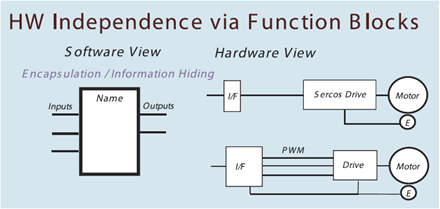
    </a>
    <p><em>HW Independence via Function Blocks</em></p>
</div>

L'image ci-dessus mentionne un ``Sercos Drive``. La notion Sercos, à l'origine un bus sur fibre optique, dans les années 90, a modifié l'approche du pilotage des commandes d'axe, dans la mesure ou ce bus permettait de piloter directement les axes en position numérique à cadence fixe. En pratique, de l'ordre de quelques centaines de $[\mu s]$.

Ethernet Real-Time, plus simple et moins onéreux a remplacé les solutions en Sercos I et II. EtherCAT a gagné la bataille de l'Ethernet Real-Time sur le plan commercial et remplacé Sercos III.

### La chaine de commande

<div align="center">

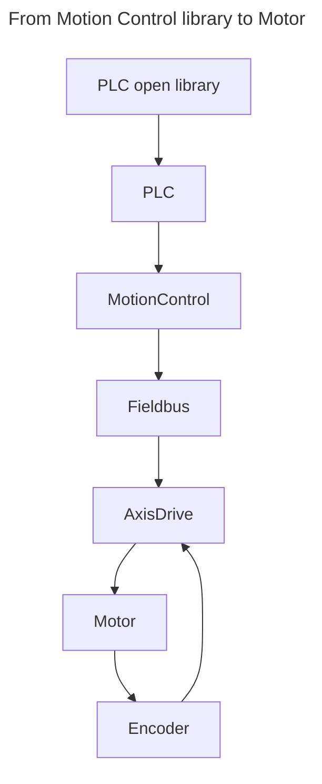

</div>

La notion de Motion Control ci dessus est en général une partie logicielle propriétaire du fournisseur de PLC. Dans certains cas, elle peut être sous forme de matériel.

### Le type de moteur
Nous supposons des moteurs pilotés en position et équpés d'un codeur.
La majorité des moteurs utilisés pour être pilotés en position dans l'industrie sont des moteurs synchrones à aimants permanents.

Il reste toutefois possible de piloter des moteurs asychrones en position.

<div align="center">
    <a href="http://www.tdmspindles.com/milling.html">
        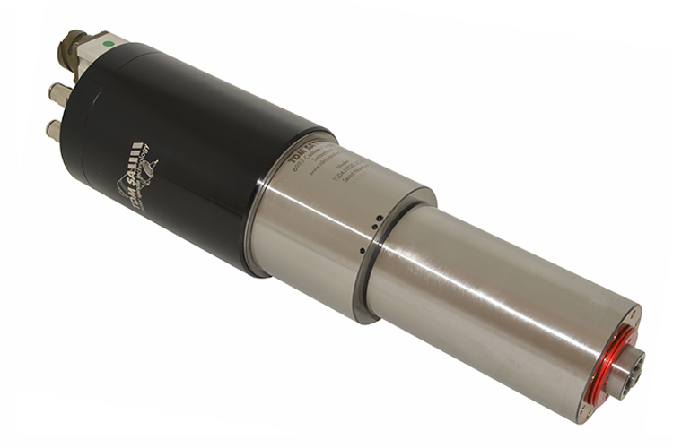
    </a>
    <p><em>Broche d'usinage asynchrone à haute vitesse. Doit pouvoir être pilotée en position pour changer d'outil, Source: Source TDM</em></p>
</div>

Par défaut, les moteurs sont supposés rotatif, c'est pourquoi on retoure par exemple un MC_TorqueControl. Les librairies peuvent toutefois parfaitement être utilisées autant pour des moteurs rotatifs que linéaires.


<div align="center">
    <a href="https://www.etel.ch/linear-motors/ilf-plus/">
        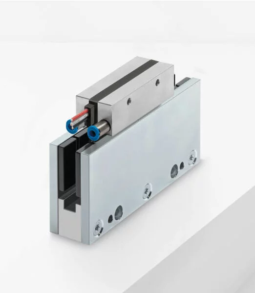
    </a>
    <p><em>Moteur linéaire sans fer, Source: Source Etel</em></p>
</div>

> Il est parfois très compliqué de mettre en service un moteur linéaire sans fer équipé d'un codeur relatif, car dans ce cas, il est compliqué d'identifier précisément la position des bobines par rapport aux aimants.


## PLCopen Généralité
Le marché du **motion control**, commande de mouvement, au niveau de l'industrie du PLC est réparti entre différentes entrerprises qui utilisent toutes des systèmes qui ne sont pas compatibles entre eux.

L'idée de **PLCopen Motion Control** est de fournir un ensemble de **blocs fonctionnels** qui forment, du point de vue **IEC-61131-3**, des interfaces stantdards.

Une librairie **Motion Control** sous forme de blocs fonctionnels existe chez la majorité des fournisseurs de PLC dont la gamme de produit comprend des commandes moteur.

> Une fois le principe d'utilsation aquis pour une plateforme, il sera valable pour les autres plateforme avec de modifications mineures.

> Le document de référence est disponible en libre accès, moyennant un enregistrement, sur le site [PLCopen](https://plcopen.org/).

### Technical Specification PLCopen Function blocks for motion control
La norme fournit autant des blocs pour des systèmes à un axe, **Single-Axis Function Blocks**, que mutli axes, **Multi-Axis Function Blocks**. Dans le cadre du cours d'automatisation de base, nous nous limiterons à quelques exemples de blocs pour un seul axe.

> La norme n'est pas seulement utile en tant que spécification, mais fournit aussi de nombreux cas d'utilisation, [Part 3 - User Guidelines](https://plcopen.org/technical-activities/motion-control), qui peuvent être **très **utile à un programeur peu expérimenté.

### State Diagram
*Ce paragraphe est directement issu de la spécification PLCopen*.

1. Le diagramme suivant définit de manière normative le comportement de l'axe à un niveau élevé lorsque plusieurs blocs fonctionnels Motion Control sont activés « simultanément ».

2. Cette combinaison de profils de mouvement est utile pour créer un profil plus compliqué ou pour gérer des exceptions au sein d'un programme. *Dans les implémentations réelles, il peut y avoir des états supplémentaires définis à un niveau* <em><strong>inférieur</strong></em>..

3. La règle de base est que les commandes de mouvement sont toujours exécutées de manière séquentielle, même si l'automate a la capacité d'effectuer un véritable traitement parallèle.

4. Ces commandes agissent sur le diagramme d’états de l’axe.

5. **L'axe est toujours dans l'un des états définis** *voir schéma ci-dessous*. Toute commande de mouvement provoquant une transition change l'état de l'axe et, par conséquent, modifie la façon dont le mouvement actuel est calculé.

6. **Le diagramme d'état est une couche d'abstraction de l'état réel de l'axe**.

7. Un changement d'état est immédiatement reflété lors de l'émission de la commande de mouvement correspondante. **Remarque:** *le temps de réponse dépend du système, couplé à l'état de l'axe ou à une couche d'abstraction dans le logiciel*.

8. Le diagramme est centré sur un seul axe.

<div align="center">

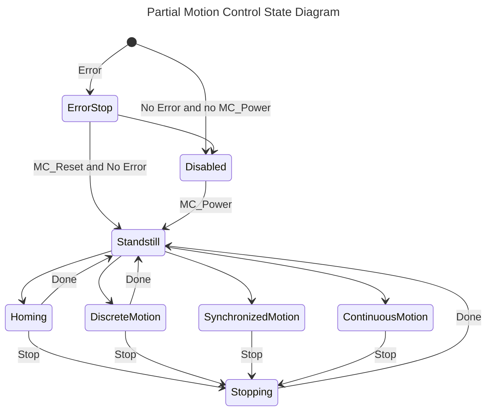
</div>

> Dans certains cas, comme le sytème Bosch Rexroth du laboratoire de la HEVS, il existe un état complémentaire nommé **Coordinated Motion** proche, ou qui remplace, l'état Synchronized Motion que nous décrivons ci-dessous.

---

# Motion Control State Machine

Dans cette partie du cours, nous n'utiliserons les axes de manière individuelle. Chaque Function Block ne sert à utiliser qu'un seul axe.

L'utilisation des Function Block pour Motion Control suppose la connaissance du diagramme d'état standard. Cette machine d'état ne dépend pas de l'utilisateur, elle correspond à l'état interne réel de la commande d'axe.

> Tous les fournisseurs ne fournissent pas l'ensemble des Function Block de la norme, comme certains fournisseurs proposent des extensions. Chez Bosch Rexroth, ils sont identifiés par le préfixe: **MB_**.

<div align="center">
    <a href="https://product-help.schneider-electric.com/Machine%20Expert/V1.1/en/MotCoLib/MotCoLib/General_Description_of_Motion_Control_Libraries/General_Description_of_Motion_Control_Libraries-4.htm">
        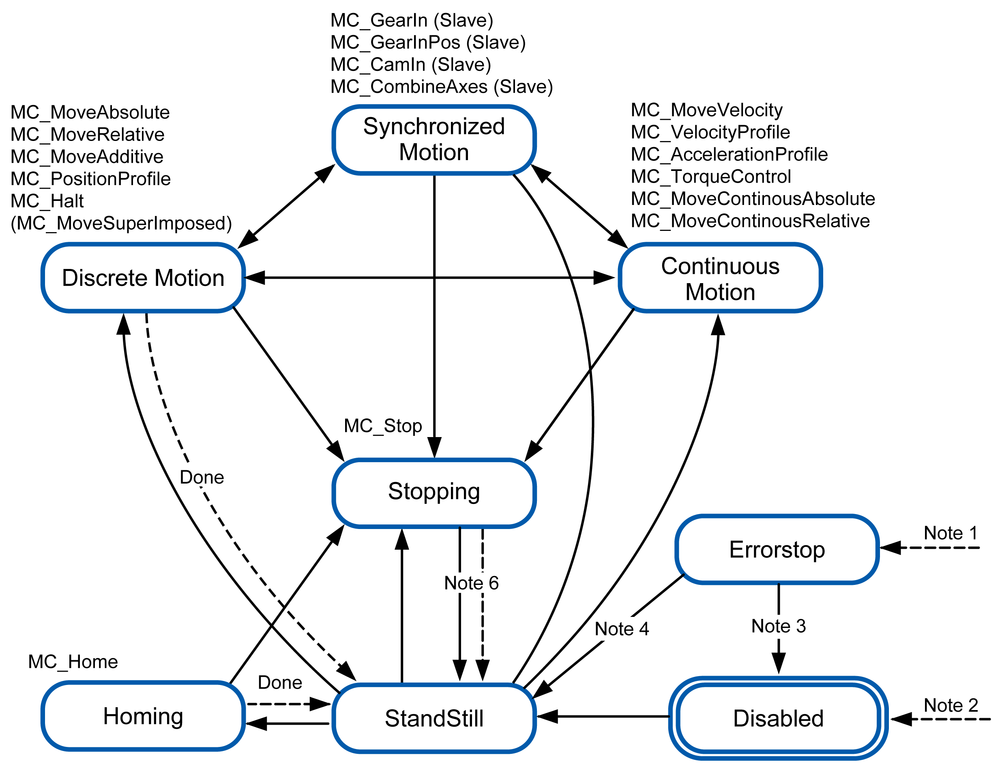
    </a>
    <p><em>PLCopen Motion Control State Machine, Source: Source Schneider Electric</em></p>
</div>

- **Note 1**   An error has been detected, transition from any state.

- **Note 2**    The input ``Enable`` of the function block ``MC_Power`` is set to ``FALSE`` and no error has been detected, transition from any state.

- **Note 3**   ``MC_Reset`` and ``MC_Power.Status = FALSE``.

- **Note 4**   ``MC_Reset`` and ``MC_Power.Status = TRUE`` and ``MC_Power.Enable = TRUE``.

- **Note 5**   ``MC_Power.Enable = TRUE`` and ``MC_Power.Status = TRUE``.

- **Note 6**   ``MC_Stop.Done = TRUE`` and ``MC_Stop.Execute = FALSE``.

### Les différents états.
#### Disabled
L'axe est hors couple. Il n'y a pas de courant dans les bobines du moteur.

#### Errorstop
L'axe est en défaut. Selon la criticité du défaut, le moteur peut être sous couple ou hors couple.

> La définition de **ErrorStop** selon PLCopen est la suivante:

> > L'état **ErrorStop** est prioritaire et applicable en cas d'erreur. L'axe peut être sous tension ou hors tension, et sa modification peut être effectuée via ``MC_Power``. Cependant, tant que l'erreur persiste, l'état reste **ErrorStop**.

> > L'objectif de l'état **ErrorStop** est d'arrêter l'axe, **si possible**. Aucune autre commande de mouvement n'est acceptée tant qu'une réinitialisation n'a pas été effectuée depuis l'état **ErrorStop**.

> > Le passage à **ErrorStop** fait référence aux erreurs provenant de l'axe et de son contrôle, et non des instances de blocs fonctionnels. Ces erreurs d'axe peuvent également se refléter dans la sortie des erreurs d'instances FB des blocs fonctionnels.

##### MC_Reset
Il ne sera pas possible de quitter un état **Errorstop** sans exécuter le Function Block ``MC_Reset``. Il faut savoir qu'un moteur peut être extrêmement rapide ou puissant et les commandes d'axes sont bien protégées, que ce soit pour la protection du matériel ou des personnes.

#####  Quelque causes de défaut
- **LagError** ou limite de position trop grande entre la position de consigne et le codeur.

- **Torque/Force** limit.
- **Velocity** limit
- **Position** limit
- **Temperature** limit
- **...**

> Si l'on prend le cas d'un moteur synchrone, **la perte de la position du codeur peut provoquer des mouvements totalement incontrolés du moteur**. Dans le cas d'une commande d'axe bien conçue, le couple du moteur sera interrompu immédiatement.

#### Standstill
La vitesse de l'axe est considérée comme zero.

#### Homing
Cet état est nécessaire pour tout axe piloté en position et équipé d'un codeur relatif. Cela signifie que avant la séquence de homing, la position exacte de l'axe n'est pas connue.

> La séquence de homing n'est pas nécessaire dans le cadre des laboratoire d'automation de la HEVS, car chaque moteur est équipé d'un codeur absolu. **Il faut retenir que la séquence de homing peut s'avévérer complexe dans certaines configurations mécaniques**.

> Pour un moteur, qui tournerait toujours dans le même sens, la position ne sera pas toujours garantie même avec un codeur absolu, si il est équipé d'un engrenage dont le ratio n'est pas un nombre entier.

#### Stopping
L'axe reçoit une commande Stop, c'est à dire, passage contrôlé en vitesse considérée comme nulle. Aucune autre commande ne sera accetpée tant que l'axe ne sera pas en état **StandStill**.

#### Discrete Motion
Correspond à un mouvement point à point.

#### Synchronized Motion
- Un axe est synchronisé avec un autre axe qui est souvent virtuel.
- Un axe virtuel est un axe qui n'existe que dans sa forme logicielle sans liaison avec un axe physique. Il est utilisé pour synchroniser un ou plusieurs axes virtuels.

> **Exemple d'axe virtuel**: si plusieurs axes sont synchronisés sur un axe virtuel, il suffira de modifier uniquement la vitesse de l'axe virtuel pour adapter automatiqument l'ensemble des autres axes qui y sont synchronisés.

> **Exemple simple de Function Block de sychronisation**, ``MC_GearIn``. Si l'axe **Slave** utilise un ``MC_GearIn`` avec un ration de 2, il évoluera avec une vitesse correspondant au double de la vitesse de l'axe **Master**.

<div align="center">
    <a href="https://www.sapal.ch/new-dcs-0500/">
        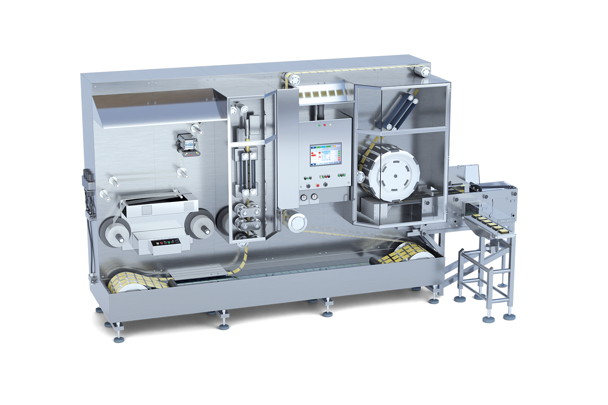
    </a>
    <p><em>Machine Sapal SA, Ecublens utilisant des axes synchronisés, Source: Sapal SA</em></p>
</div>

#### Continuous Motion
Cette catégorie de mouvement définit l'ensemble des mouvements pour lesquels la position finale de la commande n'est pas définie.

On trouve notament les notion de vitesse et de couple.
- **MC_MoveVelocity** : This Function Block commands a never ending controlled motion at a specified velocity.
- **MC_TorqueControl** : This Function Block continuously exerts a torque or force of the specified magnitude.

## Cas typique MC_MoveAbsolute

Ce Function Block sert à effectuer un mouvement discret jusqu'à une position définie par l'utilisateur.

<div align="center">
    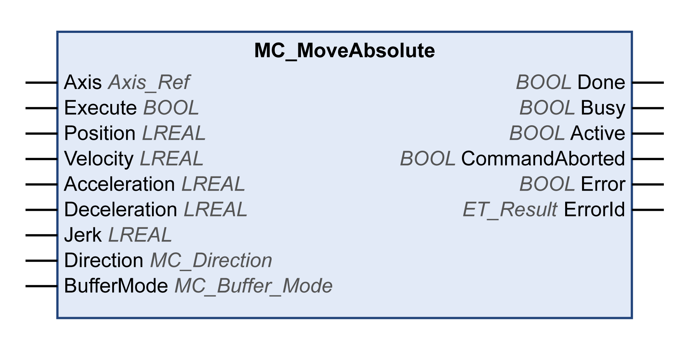
    <figcaption>MC_MoveAbsolute</figcaption>
</div>


| Name           | Type         | Description                                      |
|----------------|--------------|--------------------------------------------------|
| **VAR_IN_OUT**  |              |                                                  |
| Axis           | AXIS_REF     | Axis to be controlled                          |
| **VAR_INPUT**  |              |                                                  |
| Execute        | BOOL         | Rising edge starts the processing               |
| Position       | LREAL        | Target position                                 |
| Velocity       | LREAL        | Maximum velocity                                |
| Acceleration   | LREAL        | Acceleration                                    |
| Deceleration   | LREAL        | Deceleration                                    |
| Jerk           | LREAL        | Maximum jerk                                   |
| BufferMode     | MC_BUFFER_MO | Buffered or direct command execution           |
| **VAR_OUTPUT** |              |                                                  |
| Done           | BOOL         | The axis was reset                             |
| InBuffer       | BOOL         | The command is in the buffer, but it is not executed |
| Active         | BOOL         | The function block is active                   |
| CommandAborted | BOOL         | The command was aborted during the execution   |
| Error          | BOOL         | An error occurred                              |
| ErrorID        | ERROR_CODE   | Error classification                           |
| ErrorIdent     | ERROR_STRUCT | Error Diagnostics                              |

- **AXIS_REF** est souvent donné du type VAR_INPUT, mais le principe est d'être une variable de type **VAR_IN_OUT**.
- Le détail d'implémentation peux varier d'un fabricant à l'autre. PLCopen décrit les variables obligatoire.

<div align="center">
    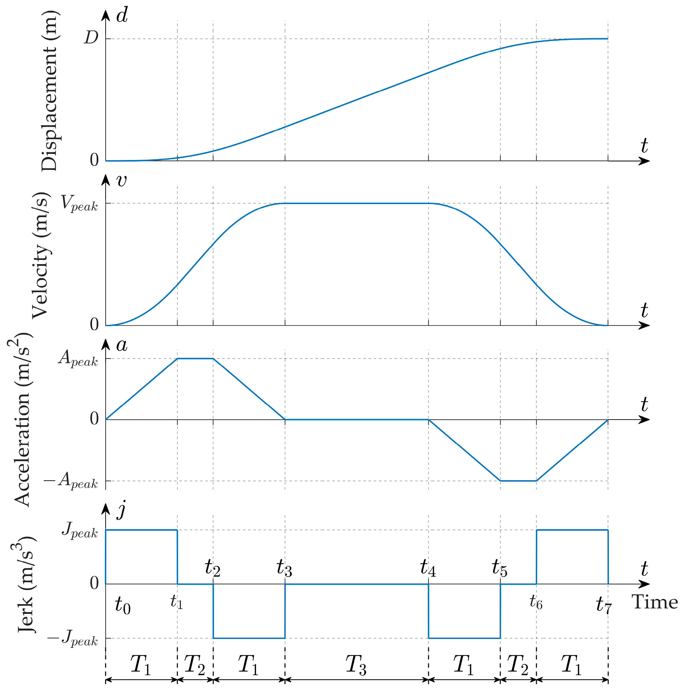
    <figcaption>MC_MoveAbsolute</figcaption>
</div>

### Trajectoire MC_MoveAbsolute
L'exemple de trajectoire est donné à titre d'information.
- L'**accélération** n'est pas toujours atteinte, car elle peut être limitée par le Jerk.
- La **vitesse** n'est pas toujours atteinte car elle est limitée par l'accélération.
- Les paramètres de **Jerk**, **accélération**, **vitesse**, voir **position** peuvent être limités par le Drive ou par le module de Motion Control qui traduit les commandes de FB_MoveAbsolute en séquence de points à destination du drive via le bus, en général Ethernet Real-Time.
- Il faut garder en tête qu'entre le moteur, par exemple un moteur rotatif, et le déplacement réel, il y a souvent une transformation mécanique, par exemple une vis à bille et un réducteur. La transformation d'unités, rotatif vers linéaire dans le cas d'une vis à bille, se fait souvent directement dans le drive.
- Finalement, il s'agit de la consigne de l'axe, la position réele en fin de cinématique peut encore être influencée par la **qualité du régulateur** et la **qualité de la mécanique.**

---

# Accès aux axes

## AXIS_REF Data type
- The **AXIS_REF** is a structure that contains information on the corresponding axis. It is used as a **VAR_IN_OUT** in all  Motion Control Function Blocks defined in this document.

<div align="center">

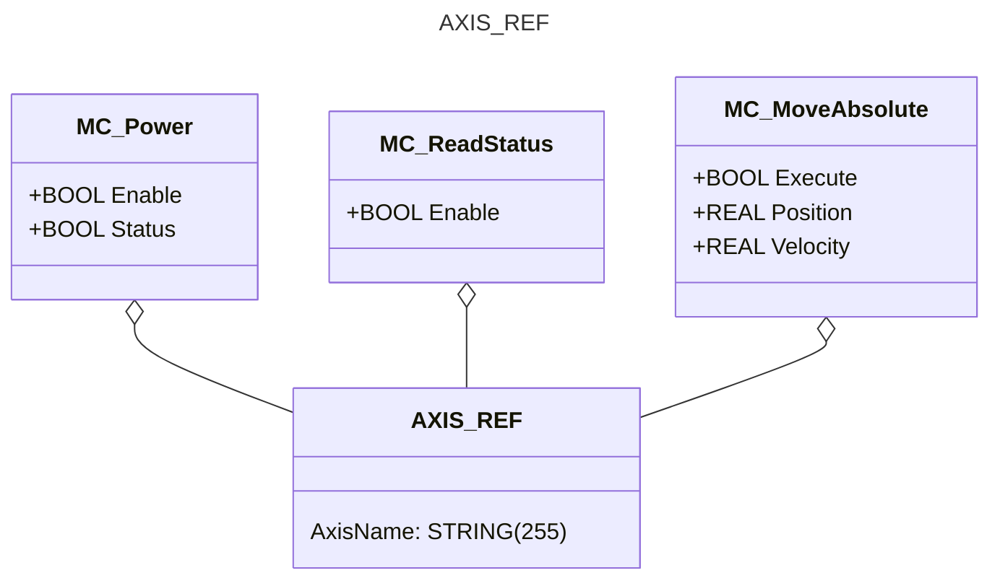

</div>


- The content of this structure is implementation dependent.
- According to IEC 61131-3 it is allowed to switch the AXIS_REF for an active FB, for instance from Axis1 to Axis2. **However, the behavior of this can vary across different platforms, and is not encouraged to do**.

### Dans le contexte du laboratoire d'automation HEVS

<div align="center">

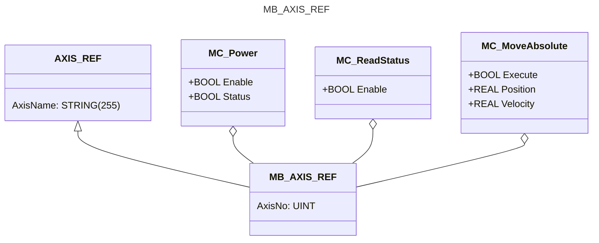
</div>

Concrètement, chaque Function Block pour le Motion Control reçoit obligatoirement une référence sur l'axe qu'il pilote ou duquel il reçoit des informations.

Avant de pouvoir utiliser un axe il faut déclarer une variable globale qui servira au programme IEC 61131-3 à savoir à quel axe du système il se réfère.

```iecst
VAR_GLOBAL
   // Notes: AxisName has to match the name defined in motion configuration. 
   // AxisNo has to be unique. 
   X_Axis: MB_AXISIF_REF := (AxisName := 'Axis_x', AxisNo := 1);
   Y_Axis: MB_AXISIF_REF := (AxisName := 'Axis_y', AxisNo := 2);
   Z_Axis: MB_AXISIF_REF := (AxisName := 'Axis_z', AxisNo := 3);
END_VAR
```

On pourra ensuite instancier un Function Block
```iecst
VAR
   mcReadActualPos_X   : MC_ReadActualPosition;
END_VAR
```

Pour ensuite utiliser ce Function Block dans le code.
```iecst
   mcReadActualPos_X(Axis := GVL_AxusDefine.X_Axis,
                     Enable := TRUE,
                     Position => absIsPosition);
```

---

# Admininstrative and Motion Function Blocks
Il existe deux catégories de Function Block pour le Motion Control. Tous ne sont pas implémentés par chaque fournisseur. En voici quelques uns, pour une lise compllète, on se référera à la [documentation de PLCopen](https://plcopen.org/technical-activities/motion-control) disponible librement. On se limite dans la liste ci-dessous aux Function Blocks pour un seul axe.


|Admministrative |Motion|
|----------------|------|
|MC_Power        |MC_Home |
|MC_ReadStatus   |MC_Stop|
|MC_ReadActualVelocity |MC_Halt|
|MC_ReadParameter      |MC_MoveAbsolute|
|MC_SetOverride        |MC_MoveRelative|
|MC_ReadActualTorque   |MC_MoveVelocity|
|MC_Reset              |MC_TorqueControl|
|MC_ReadActualPosition ||

On trouve aussi chez certain fournisseurs des Function Blocks spécifiques. Par exemple, dans la boite à outils de Bosch Rexroth, ils sont identifés par le préfixe **MB_**.

- **MB_CyclicSetPoint** : The function block MB_CyclicSetPoint cyclically sends the external command
value of an axis without direct change at the drive.

# Introduction au codage Motion Control

## Pourquoi l'entrée de commande est sensible aux fronts
L'entrée **Execute** des différents Function Blocks décrits dans ce document déclenche toujours la fonction sur son front montant.

En effet, avec l'entrée **Execute** déclenchée par front, de nouvelles valeurs d'entrée peuvent être commandées pendant l'exécution d'une commande précédente. L'avantage de cette méthode réside dans une gestion précise de l'instant d'exécution d'une commande de mouvement. La combinaison de différents blocs fonctionnels est ainsi simplifiée. La sortie **Done** peut servir à déclencher la partie suivante du mouvement.

L'exemple ci-dessous illustre le comportement de l'exécution du Function Block. La figure illustre la séquence de deux Function Blocks First et Seconde contrôlant le même axe.

Dans la pratique, on préférera l'usage d'une machine d'état pour piloter les fronts montants.

<div align="center">
    <a href="https://content.helpme-codesys.com/en/libs/SM3_Basic/Current/SM3_Basic/POUs/Movement/MC_MoveAbsolute.html">
        
    </a>
    <p><em>Use of Execute with two instances of MC_MoveAbsolute, Source Codesys</em></p>
</div>

## Exemple de codage MC_MoveAbsolute.
Dans cet exemple, nous utilisons **une seule instance** pour déplacer un axe entre deux positions, **PosOne** et **PosTwo**.

- Nous devons vérifier que l'axe se trouve dans l'[état StandStill](#motion-control-state-machine) avant de pouvoir commencer.
- Si nous appuyons sur le bouton Hold, nous interrompons la séquence.

<div align="center">

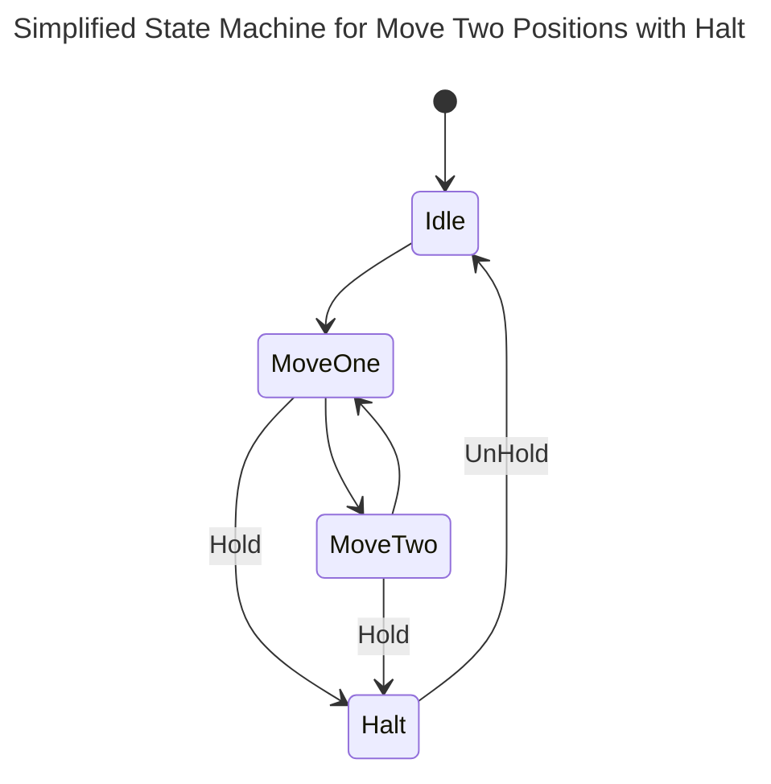
</div>

### Problème avec machine simplifiée
Dans le cas où nous aurions un seul état pour MoveOne et MoveTwo et que nous appelons l'instance du Bloc Fonctionnel ``mcMoveAbs``, c'est que comme le bloque n'est actif que sur le front montant de ``Execute``. Dans le code ci-dessous, **seul le premier mouvement sera exécuté**.

  ```iecst
  // Enum
  TYPE E_AxisMove :
  (
    eIdle    := 99,
    eMoveOne := 10,
    eMoveTwo := 20,
    eHalt    := 30
  );
  END_TYPE

  // Instance of mcMoveAbs
  VAR
    eAxisMove : E_AxisMove := E_AxisMove.eIdle;
    bHold     : BOOL := FALSE;
    bUnHold   : BOOL := FALSE;
    mcMoveAbs : MC_MoveAbsolute;
  END_VAR

  CASE eAxisMove OF
    E_AxisMove.eIdle:
      IF NOT bHold THEN
        mcMoveAbs.Position := 10;
        eAxisMove := E_AxisMove.eMoveOne;
      END_IF;

    E_AxisMove.eMoveOne:
      IF bHold THEN
        eAxisMove := E_AxisMove.eHalt;
      ELSE
        mcMoveAbs.Position := 50;
        eAxisMove := E_AxisMove.eMoveTwo;
      END_IF;

    E_AxisMove.eMoveTwo:
      IF bHold THEN
        eAxisMove := E_AxisMove.eHalt;
      ELSE
        mcMoveAbs.Position := 10;
        eAxisMove := E_AxisMove.eMoveOne;
      END_IF;

    E_AxisMove.eHalt:
      IF bUnHold THEN
        eAxisMove := E_AxisMove.eIdle;
      END_IF;

  END_CASE

// The code below does not work with the simplified state machine!
mcMoveAbs(Axis := axisRef,
          Execute := (eAxisExecute = E_AxisExecute.eMoveOne) OR
                     (eAxisExecute = E_AxisExecute.eMoveTwo),
          Acceleration := stSetParam.rAcceleration_m_s2,
          Deceleration := stSetParam.rDeceleration_m_s2,
          Jerk := stSetParam.rJerk_m_s3);

```

### Autre mauvaise pratique
Il est fréquent de voir du code avec les commandes ``Execute`` utilisées directement dans la machine d'état.

Dans l'extrait de code ci-dessous, la commande pour le bloc Halt est inséré dans la machine d'état. On a oublié de réinitialiser la commande ``mcHalt.Execute`` à ``FALSE``.

La commande Halt risque de ne plus être exécutée quand elle sera nécessaire, **cela peut conduire à un problème de sécurité grave**.

En principe: **piloter les Function Blocks de type Execute uniquement en fonction des états**. Cela simplifie aussi la maintenance du code car **on trouve à un seul endroit l'ensemble des conditions qui activent le Function Block**.

```iecst
VAR
  mcHalt  : MC_Halt;
END_VAR  

  CASE eAxisMove OF
    E_AxisMove.eIdle:
      IF NOT bHold THEN
        mcMoveAbs.Position := 10;
        eAxisMove := E_AxisMove.eMoveOne;
      END_IF;

    E_AxisMove.eMoveOne:
      IF bHold THEN
        // Avoid Execute here !
        mcHalt.Execute := TRUE;
        eAxisMove := E_AxisMove.eHalt;
      ELSE
        mcMoveAbs.Position := 50;
        eAxisMove := E_AxisMove.eMoveTwo;
      END_IF;

    E_AxisMove.eMoveTwo:
      IF bHold THEN
        // Avoid Execute here !
        mcHalt.Execute := TRUE;
        eAxisMove := E_AxisMove.eHalt;
      ELSE
        mcMoveAbs.Position := 10;
        eAxisMove := E_AxisMove.eMoveOne;
      END_IF;

    E_AxisMove.eHalt:
      IF bUnHold THEN
        eAxisMove := E_AxisMove.eIdle;
      END_IF;

  END_CASE

mcHalt(Axis := axisRef,
       Deceleration := stSetParam.rDeceleration_m_s2,
       Jerk := stSetParam.rJerk_m_s3);

```

### Bonne pratique
On active la commande ``Execute`` **uniquement avec l'état E_AxisMove.eHalt**. On a ainsi la garantie que si on quitte l'état Halt, la commande ``Execute`` sera à nouveau à ``FALSE`` et sera disponible pour le prochaine passage par cet état.

```iecst
mcHalt(Axis := axisRef,
       // Execute depends only of the state.
       Execute := eAxisMove := E_AxisMove.eHalt,
       Deceleration := stSetParam.rDeceleration_m_s2,
       Jerk := stSetParam.rJerk_m_s3);

```

### Machine d'état complète
Ci-dessous, nous décrivons un exemple de codage complet avec les bonnes pratiques.

Ces bonnes pratiques ne se limitent pas à l'usage du Motion Control, elles sont valables pour tout code développé en IEC 61131-3. **Un code qui ne tiendrait pas compte de ces bonnes pratiques est considéré comme partiellement faux car même si il peut fonctionner une fois, il risque de conduire à des probèmes de maintenance et de robustesse.**

Dans la machine d'état, chaque état de la machine prédédente est doublé, cela présente deux avantages.
- On propose une phase d'activation et une phase de contrôle.
- On garanti que chaque état d'activation d'une commande ``Execute``, **MoveOneStart**, **MoveTwoStart** et **Halt** est complété d'une phase qui permet à Execute de revenir à ``FALSE``. 

<div align="center">

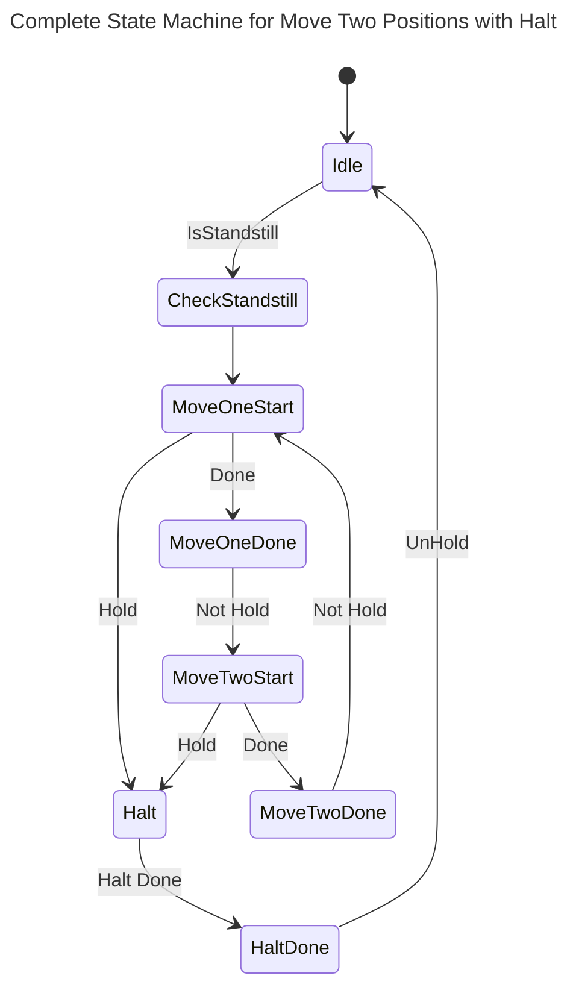

</div>

#### Codage de la machine complete

> Lors de l'écriture de ce script, Copilot est utilisé pour accélérer l'écriture du code. Dans sa version initiale, **Copilot utilise des Execute à l'intérieur de la machine d'état, ce qui est faux !** L'usage de Copilot est encouragé car il permet d'accélérer le développement, mais il est nécessaire de relier attentivement le code et de le corriger.

La version ci-dessous n'est pas la version de Copilot.

La version ci-dessous n'est pas complète car elle devrait idéalement encore être complétée, entre autre, avec la gestion des exceptions et des alarmes. Elle sert à illustrer le concept de gestion des Function Blocks avec une machine d'état.

```iecst
// Enum for state machine
TYPE E_AxisMove :
(
  eIdle            := 99,
  eCheckStandstill := 10,
  eMoveOneStart    := 20,
  eMoveOneDone     := 30,
  eMoveTwoStart    := 40,
  eMoveTwoDone     := 50,
  eHalt            := 60,
  eHaltDone        := 70
) := eIdle;
END_TYPE

// Variables
VAR
  eAxisMove     : E_AxisMove := E_AxisMove.eIdle;
  bIsStandstill : BOOL := FALSE;
  bHold         : BOOL := FALSE;
  bUnHold       : BOOL := FALSE;
  mcMoveAbs     : MC_MoveAbsolute;
  mcHalt        : MC_Halt;
  mcReadStatus  : MC_ReadStatus;
END_VAR

// State machine
CASE eAxisMove OF
  E_AxisMove.eIdle:
     eAxisMove := E_AxisMove.eCheckStandstill;

  E_AxisMove.eCheckStandstill:
     IF mcReadStatus.Standstill THEN
        mcMoveAbs.Position := 10;
        eAxisMove := E_AxisMove.eMoveOneStart;
     END_IF

  E_AxisMove.eMoveOneStart:
     IF mcMoveAbs.Done THEN
        eAxisMove := E_AxisMove.eMoveOneDone;
     ELSIF bHold THEN
        eAxisMove := E_AxisMove.eHalt;
     END_IF;

  E_AxisMove.eMoveOneDone:
     IF NOT bHold THEN
        mcMoveAbs.Position := 50;
        eAxisMove := E_AxisMove.eMoveTwoStart;
     END_IF;

  E_AxisMove.eMoveTwoStart:
     IF mcMoveAbs.Done THEN
        eAxisMove := E_AxisMove.eMoveTwoDone;
     ELSIF bHold THEN
        eAxisMove := E_AxisMove.eHalt;
     END_IF;

  E_AxisMove.eMoveTwoDone:
    IF NOT bHold THEN
       mcMoveAbs.Position := 10;
       eAxisMove := E_AxisMove.eMoveOneStart;
    END_IF;

  E_AxisMove.eHalt:
    IF mcHalt.Done THEN
       eAxisMove := E_AxisMove.eHaltDone;
    END_IF;

  E_AxisMove.eHaltDone:
    IF bUnHold THEN
       eAxisMove := E_AxisMove.eIdle;
    END_IF;

END_CASE

// Call of Function Blocks
mcReadStatus(Axis := axisRef,
             Enable := TRUE);

mcHalt(Axis := axisRef,
       // Execute depends only of the state.
       Execute := eAxisMove := E_AxisMove.eHalt,
       Deceleration := stSetParam.rDeceleration_m_s2,
       Jerk := stSetParam.rJerk_m_s3);

mcMoveAbs(Axis := axisRef,
       // Execute depends only of the state.
          Execute := (eAxisMove = E_AxisMove.eMoveOneStart) OR
                     (eAxisMove = E_AxisMove.eMoveTwoStart),
          Acceleration := stSetParam.rAcceleration_m_s2,
          Deceleration := stSetParam.rDeceleration_m_s2,
          Jerk := stSetParam.rJerk_m_s3);
```

---

# Motion Control avec PackML
Nous l'avons vu ci-dessus avec le codage d'un simple aller et retour entre deux positions. La gestion d'un axe électrique demande rapidement une machine d'état relativement complexe. Si de plus nous devions intégrer les notions de mise sous tension, **MC_Power**, de réinitialisation après une défaut, **MC_Reset**, un arrêt rapide sans condition, **MC_Stop**, la prise de référence, **MC_Home** si le moteur est équipé d'un codeur relatif, la compexité de la machine d'état deviendrait rapidement hors de contrôle.

C'est la raison pour laquelle nous avons intégré dans ce cours les bases élémentaires du PackML.

Voici un exemple incomplet de machine d'état incomplète pour mettre activer un axe et faire un simple mouvement:

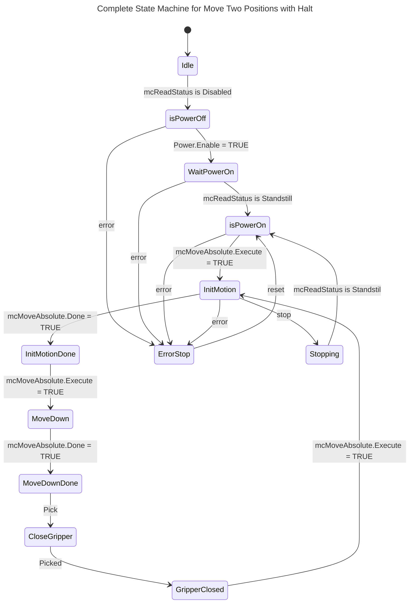

On se rend rapidement compte que c'est ingérable et programmer ce genre de séquence serait contre productif.

## Principe de PackML
On encapsule le comportement des différents modules de la machine dans différents états du PackML.

<div align="center">
    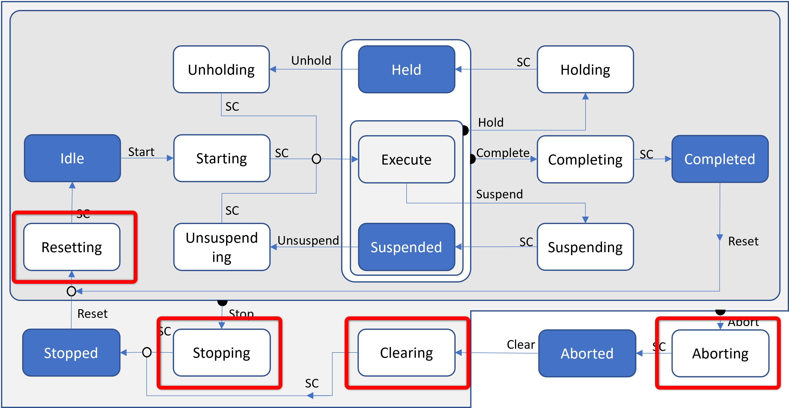
    <figcaption>PackML State Machine</figcaption>
</div>

### Clearing
Ici on encapsulte toutes les actions nécessaires à enclencher les différents modules. Quand ``stActing.Clearing_SC := TRUE;`` cela signifie que le module est prêt.

```iecst
(*
	Manage Clearing in ACT_Clearing
*)
IF actualState = E_PackState.eClearing THEN
	// Set to TRUE if no action requested
	stActing.Clearing_SC := TRUE;
ELSE
	stActing.Clearing_SC := FALSE;
END_IF

```

Une portion de code regroupe le SC des différents modules. Ici dans **PRG_Process**. Concrêtement, cela signifie que quand chaque axe est sous couple et le template est prêt, on passe en **Stopped**.

```iecst
xProcess_SC := fbModuleAxis_X.SC AND
               fbModuleAxis_Y.SC AND
               fbModuleAxis_Z.SC AND
               PRG_PackModule_Template.SC;
```

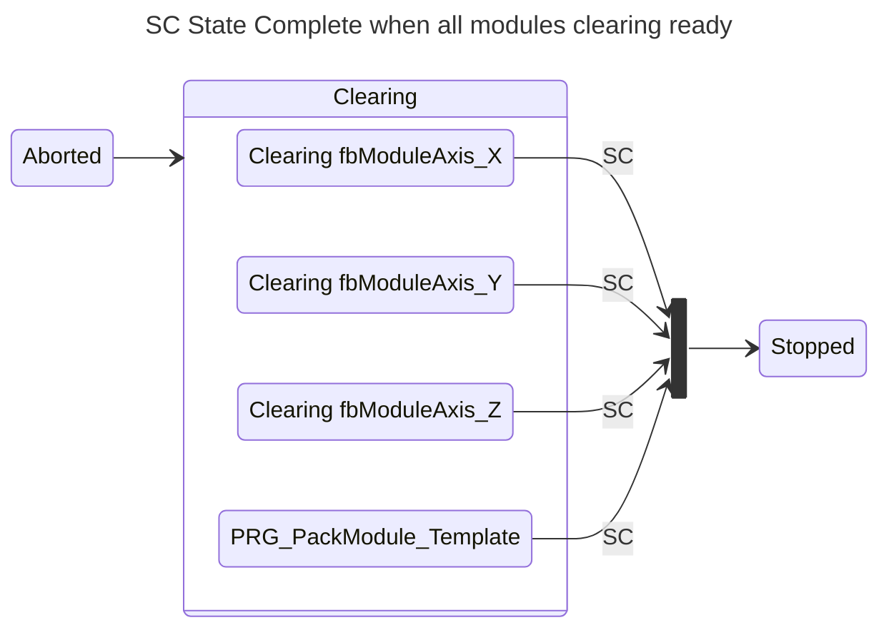

Le clearing de l'axe X ressemble au code suivant:

```iecst
// From PLCopen Motion, the axis at start could be
// Standstill	--> Enabled
// Disabled		--> Need an enable for SC
// ErrorStop	--> Need a reset befoire to be enabled
IF actualState = E_PackState.eClearing THEN
   CASE axisClearing OF
      E_AxisClearing.eIdle :
         IF mcReadStatus.Standstill THEN
            axisClearing := E_AxisClearing.eEnabled;
         ELSIF mcReadStatus.ErrorStop THEN
            axisClearing := E_AxisClearing.eErrorStop;
         ELSE
            axisClearing := E_AxisClearing.eDisabled;
         END_IF
		
      E_AxisClearing.eErrorStop :
         IF mcReadStatus.Standstill THEN
            axisClearing := E_AxisClearing.eEnabled;
         ELSE
            axisClearing := E_AxisClearing.eDisabled;
         END_IF
		
      E_AxisClearing.eDisabled  :
         IF mcReadStatus.Standstill THEN
            axisClearing := E_AxisClearing.eEnabled;
         ELSIF mcReadStatus.ErrorStop THEN
            axisClearing := E_AxisClearing.eErrorStop;
         END_IF
		
      E_AxisClearing.eEnabled   :
         IF mcReadStatus.ErrorStop THEN
            axisClearing := E_AxisClearing.eErrorStop;
         END_IF
    END_CASE
    stActing.Clearing_SC := (axisClearing = E_AxisClearing.eEnabled);
ELSE
   stActing.Clearing_SC := FALSE;
   axisClearing := E_AxisClearing.eIdle; 
END_IF

mcReadStatus(Axis := axisRef,
             Enable := TRUE);

mcReset(Axis := axisRef,
        Execute := (axisClearing = E_AxisClearing.eErrorStop) OR
                    axisAborting = E_AxisAborting.eErrorStop);

mcPower(Axis := axisRef,
        Enable := NOT (actualState = E_PackState.eAborted)  AND
        // In aborting, do not disable while stopping
        NOT ((actualState = E_PackState.eAborting) AND
             NOT (axisAborting = E_AxisAborting.eStopping)) AND
        // E_AxisClearing.eErrorStop should be possible
        // if actualState = E_PackState.eClearing
        NOT (axisClearing = E_AxisClearing.eErrorStop));                    
```

Pour chaque etat du PackML et pour chaque module, mais seulement quand c'est nécessaire, le code est complété.

### Complexité ?
Oui, mais... le code de chaque module est encapsulé individuellement, donc
 -  le système est relativement simple à analyser en cas de problème, puisque l'on sait rapidement où se situe le problème.
- le code du système est robuste, en un semestre complet, quatre laboratoires par semaine et 10 cellules, un seul cas connu pour lequel il a fallu redémarrer le programme alors que la cellule est accessible par 3 types d'interfaces différent, câblé, Simatic et Node-RED.
- Pour toute nouvelle fonctionnalité, on sait exactement oû ajouter le code nécessaire et si nécessaire avec un nouveau mode de fonctionnement de la machine.

##### Exemple
Soit une nouvelle action pour l'axe Z en Execute, dans une nouveau mode **User_05**.

Dans FB_ModuleAxis_Z / ACT_Execute

```iecst
(*
	Manage Execute for mode User 05
*)
IF (actualState = E_PackState.eExecute) AND
   (actualMode = E_PackModes.User_05) THEN
   CASE axisExecute_U_05 OF
      E_AxisExecute_U_05.eIdle :
         // New function
         ;
   
      E_AxisExecute_U_05.eSetAbsolutePosition :
         // New function
         ;
 
      E_AxisExecute_U_05.eSetAbsolutePositionDone :
         // New function
         ;

   END_CASE
ELSE
   axisExecute_U_05 := E_AxisExecute_U_05.eIdle;
END_IF
```

Il ne sera pas nécesaire de revoir la phase d'initialisation de la machine et il n'y aura peu de risque de conflit avec les autres modes de fonctionnement de la machine.

On notera l'importance de la ligne de commande ``axisExecute_U_05 := E_AxisExecute_U_05.eIdle;``. Elle garantit que si on quitte l'état **Execute**, la machine d'état soit initialisée pour la prochaine exécution. On peut aussi modifier cette ligne de code si l'on veut, par exemple suite à une commande **Suspend**, mémoriser le nouveau point d'entrée dans la machine d'état ``axisExecute_U_05`` après une commande **Unsuspend**.

# Conclusion

Le domaine du Motion Control, tel que standardisé par PLCopen, illustre une maturité remarquable et une diversité d'applications qui en font un pilier essentiel de l'automatisation industrielle. Grâce à des spécifications claires et des bibliothèques fonctionnelles robustes, PLCopen offre une base commune permettant de simplifier le développement, d'améliorer l'interopérabilité et de réduire les coûts de formation. 

La variété des blocs fonctionnels disponibles, combinée à leur capacité à s'adapter à des plateformes matérielles variées, témoigne de la flexibilité et de la puissance de cette norme. Que ce soit pour des applications simples ou des systèmes mécatroniques complexes, PLCopen fournit les outils nécessaires pour répondre aux exigences croissantes de l'industrie moderne.

En adoptant ces standards, les ingénieurs peuvent non seulement garantir une programmation robuste et maintenable, mais aussi s'assurer que leurs solutions restent pertinentes dans un environnement technologique en constante évolution. PLCopen continue ainsi de jouer un rôle clé dans l'harmonisation et l'innovation des systèmes de contrôle de mouvement. 

<div align="center">
    <a href="https://eci.intel.com/docs/3.3/components/plcopen-motion.html">
        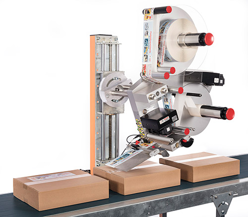
    </a>
    <p><em>Labeling machine, Source Intel Edge Control for Industrial</em></p>
</div>

<div align="center">
    <a href="https://eci.intel.com/docs/3.3/components/plcopen-motion.html">
        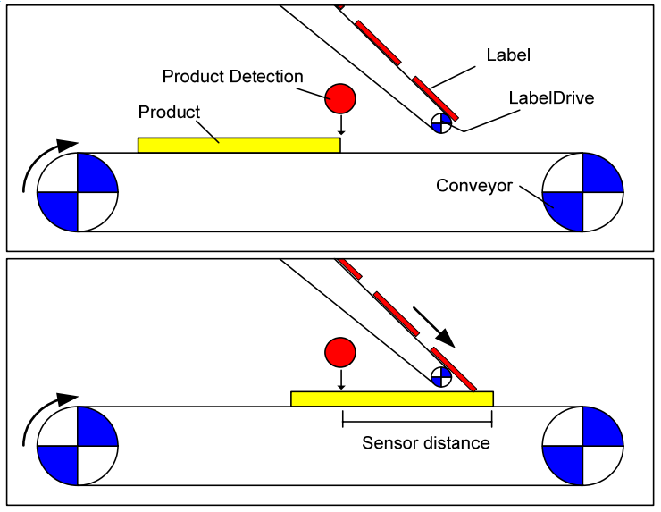
    </a>
    <p><em>Labeling machine, Source Intel Edge Control for Industrial</em></p>
</div>

On peut voir les standards comme des brides à l'innovation, mais on peut aussi les considérer comme un moteur qui évite de devoir constamment réinventer la roue.


<!-- End of README.md -->