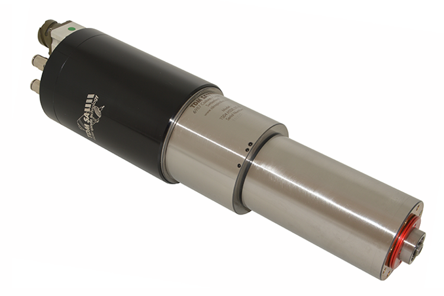
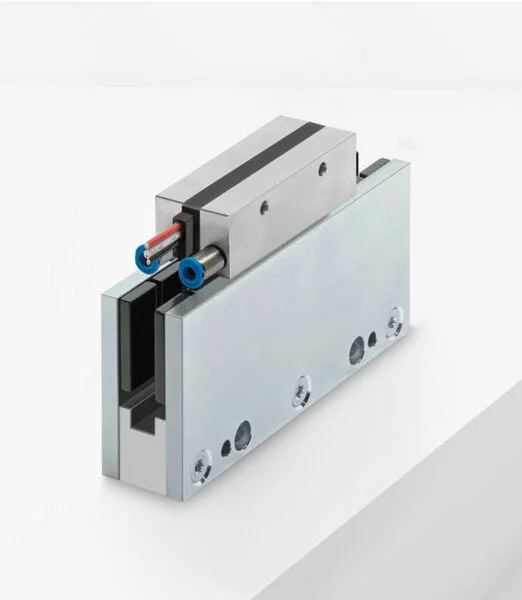
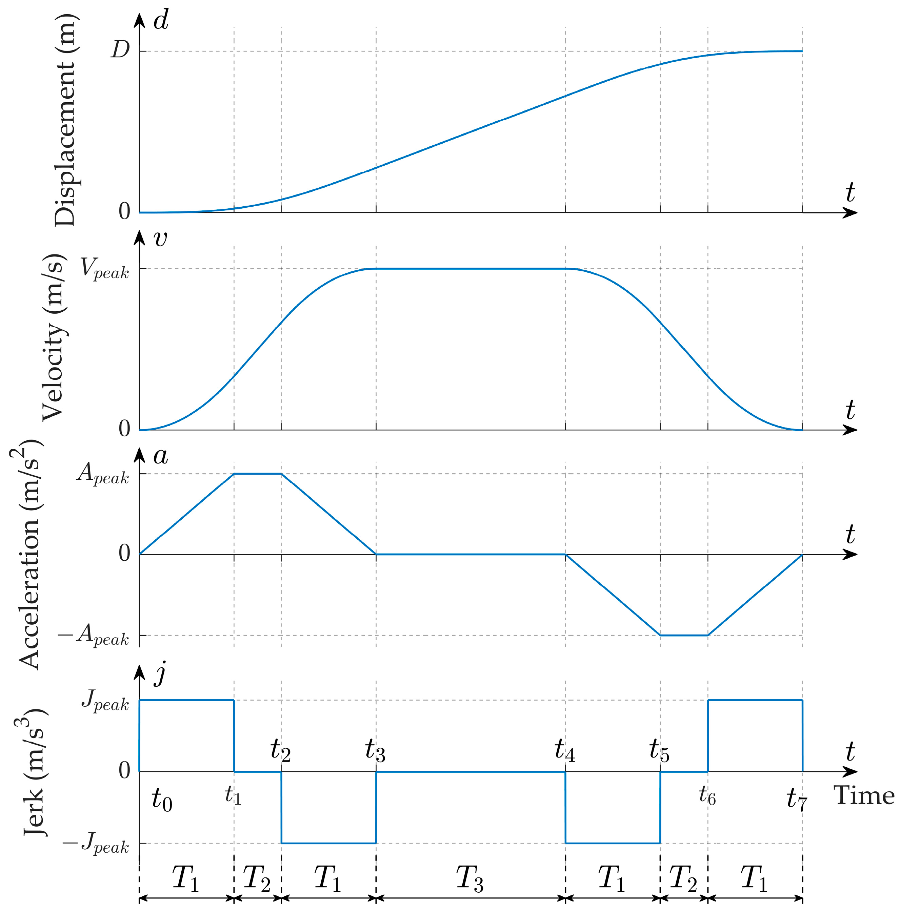
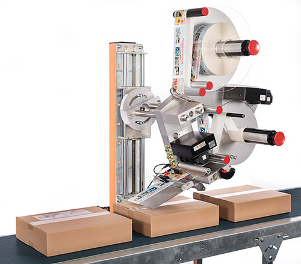

<h1 align="left">
  <br>
  
  <br>
  Industrial Automation Base
  <br>
</h1>

Cours AutB

Author: [Cédric Lenoir](mailto:cedric.lenoir@hevs.ch)

# Module 10 PLCopen Motion Control

*Keywords:* **PLCopen MC_Power MC_MoveAbsolute MC_Stop**


## Übersicht und Ziele.
– Robuste Programmierung
– Anwendung von PackML
– Einführung in Robotersysteme, hauptsächlich im nächsten Modul.
– Kombination von mechatronischen Systemen und Echtzeitsteuerung.

## Modulziele

## Inhaltsverzeichnis

1. [Übersicht und Ziele](#übersicht-und-ziele)
2. [Modulziele](#modulziele)
  - [Vertiefung der Konzepte der robusten Programmierung nach IEC 61131-3](#vertiefung-der-konzepte-der-robuten-programmierung-nach-iec-61131-3)
  - [Einführung in die Elemente der Bewegungssteuerung in PLCopen](#einführung-in-die-elemente-der-bewegungssteuerung-in-plcopen)
3. [PLCopen Motion Control](#plcopen-motion-control)
  - [Was ist PLCopen?](#was-ist-plcopen)
  - [La chaine de commande](#la-chaine-de-commande)
  - [Motortyp](#motortyp)
4. [PLCopen – Allgemeines](#plcopen--allgemeines)
  - [Technische Spezifikation PLCopen-Funktionsbausteine für die Bewegungssteuerung](#technische-spezifikation-plcopen-funktionsbausteine-für-die-bewegungssteuerung)
  - [State Diagram](#state-diagram)
  - [Die verschiedenen Zustände](#die-verschiedenen-zustände)
5. [Typischer Fall: MC_MoveAbsolute](#typischer-fall-mc_moveabsolute)
6. [Zugriff auf die Achsen](#zugriff-auf-die-achsen)
  - [AXIS_REF Data type](#axis_ref-data-type)
  - [Dans le contexte du laboratoire d'automation HEVS](#dans-le-contexte-du-laboratoire-dautomation-hevs)
7. [Verwaltungs- und Bewegungsfunktionsblöcke](#verwaltungs--und-bewegungsfunktionsblöcke)
8. [Einführung in die Motion-Control-Codierung](#einführung-in-die-motion-control-codierung)
  - [Warum der Befehlseingang flankensensitiv ist](#warum-der-befehlseingang-flankensensitiv-ist)
  - [MC_MoveAbsolute-Codierungsbeispiel](#mc_moveabsolute-codierungsbeispiel)
  - [Best Practice](#best-practice)
  - [Vollständiger Zustandsautomat](#vollständiger-zustandsautomat)
9. [Bewegungssteuerung mit PackML](#bewegungssteuerung-mit-packml)
  - [PackML-Prinzip](#packml-prinzip)
  - [Clearing](#clearing)
  - [Komplexität?](#komplexität)
10. [Fazit](#fazit)

### Vertiefung der Konzepte der robusten Programmierung nach IEC 61131-3
– Verstehen von Best Practices für strukturierten, lesbaren und wartbaren Code.
– Verwendung verschiedener Variablentypen und Funktionsbausteine ​​zur Gewährleistung der Programmrobustheit.
– Erkennen und Beheben potenzieller Fehler in einem SPS-Programm.

### Einführung in die Elemente der Bewegungssteuerung in PLCopen
– Kennenlernen der Standardfunktionsbausteine ​​des PLCopen-Standards für Bewegungssteuerung.
– Verstehen der Wechselwirkungen zwischen verschiedenen Achsenzuständen und zugehörigen Befehlen.
– Praktische Anwendungsfälle für Funktionsbausteine ​​wie ``MC_MoveAbsolute``, ``MC_Power`` und ``MC_Stop`` studieren.

## PLCopen Motion Control

### Was ist PLCopen?

PLCopen ist eine internationale Organisation zur Standardisierung von Software für speicherprogrammierbare Steuerungen (SPS). Sie bietet Spezifikationen und Bibliotheken zur Verbesserung der Interoperabilität, Wiederverwendbarkeit und Portabilität industrieller Anwendungen.

#### Hauptziele:
1. Standardisierung: Bereitstellung offener Standards für SPS-Software, insbesondere gemäß IEC 61131-3.
2. Interoperabilität: Ausführung von Anwendungen auf verschiedenen Hardwareplattformen ohne größere Anpassungen.
3. Kostensenkung: Vereinfachung von Entwicklung, Wartung und Schulung durch standardisierte Bibliotheken.
4. Qualitätsverbesserung: Förderung guter Programmierpraktiken und der Wiederverwendung von Softwarekomponenten.

> In der Praxis ist Interoperabilität relativ. Die Vereinfachung der Schulung hingegen ist real. Die in diesem Kurs vorgestellten Prinzipien gelten für alle Anbieter von IEC 61131-3-SPS- und Motion-Control-Lösungen, d. h. für die überwiegende Mehrheit der Anbieter auf dem Markt.

> Funktionsbausteinbibliotheken für Motion Control sind einfach zu implementieren, sofern SPS und Achsensteuerung vom selben Anbieter stammen. **Die Verwendung der Bibliothek für eine Achsensteuerung eines Drittanbieters bleibt oft ein kritischer Punkt und kann zeitaufwändig sein.**

> Die einfache Nutzung von Motion-Control-Bibliotheken erfordert in der Regel eine Echtzeit-Ethernet-Kommunikation zwischen der SPS und den Achsensteuerungen. Echtzeit-Ethernet wird im nächsten Modul behandelt. **Die Verwendung von Echtzeit-Ethernet mit unterschiedlichen Technologien ist die Hauptursache für die mangelnde Interoperabilität zwischen verschiedenen Systemen.**

#### Anwendungsbereiche:
- **Motion Control**: Bewegungssteuerung für mechatronische Systeme.
- **PackML**: Standardisierung von Verpackungsmaschinen.
- **Funktionale Sicherheit**: Integration von Sicherheitsaspekten in SPS-Software.

> Obwohl oft so dargestellt, ist PackML (siehe Modul ``Einführung in Pack``) nicht auf Verpackungsmaschinen beschränkt.

Zusammenfassend spielt PLCopen eine Schlüsselrolle bei der Harmonisierung industrieller Software und erleichtert deren Einführung und Weiterentwicklung in einem sich ständig verändernden technologischen Umfeld.

Der **PLCopen Motion Control**-Standard zielt darauf ab, Anwendungsbibliotheken für die Bewegungssteuerung zu standardisieren und deren Wiederverwendung auf verschiedenen Hardwareplattformen zu ermöglichen. Dies reduziert Entwicklungs-, Wartungs- und Supportkosten, vereinfacht das Engineering und reduziert den Schulungsaufwand.

Durch die Kapselung von Daten und das Ausblenden hardwarespezifischer Details erleichtert der Standard die Nutzung in einer Vielzahl von Steuerungslösungen und dient gleichzeitig als Grundlage für Definitionen in anderen Branchen.

<div align="center">
    <a href="https://plcopen.org/technical-activities/motion-control">
        
    </a>
    <p><em>HW Independence via Function Blocks</em></p>
</div>

Das obige Bild zeigt einen Sercos-Antrieb. Das Sercos-Konzept, ursprünglich ein Glasfaserbus, veränderte in den 1990er Jahren den Ansatz der Achsensteuerung, da dieser Bus die direkte digitale Positionssteuerung von Achsen mit einer festen Geschwindigkeit ermöglichte. In der Praxis kostete dies etwa einige hundert $[\mu s]$.

Echtzeit-Ethernet, einfacher und kostengünstiger, ersetzte Sercos I- und II-Lösungen. EtherCAT gewann den kommerziellen Kampf gegen Echtzeit-Ethernet und ersetzte Sercos III.

### La chaine de commande

<div align="center">


</div>

Das oben beschriebene Konzept der Bewegungssteuerung ist in der Regel eine proprietäre Softwarekomponente des SPS-Herstellers. In einigen Fällen kann es auch in Hardware implementiert sein.

### Motortyp
Wir gehen von positionsgeregelten Motoren mit Encoder aus.
Die meisten Motoren zur Positionsregelung in der Industrie sind Permanentmagnet-Synchronmotoren.

Asynchronmotoren können jedoch auch positionsgeregelt werden.

<div align="center">
    <a href="http://www.tdmspindles.com/milling.html">
        
    </a>
    <p><em>Broche d'usinage asynchrone à haute vitesse. Doit pouvoir être pilotée en position pour changer d'outil, Source: Source TDM</em></p>
</div>

Standardmäßig wird von rotierenden Motoren ausgegangen, weshalb wir beispielsweise einen MC_TorqueControl zurückgeben. Die Bibliotheken können jedoch sowohl für rotierende als auch für lineare Motoren verwendet werden.

<div align="center">
    <a href="https://www.etel.ch/linear-motors/ilf-plus/">
        
    </a>
    <p><em>Moteur linéaire sans fer, Source: Source Etel</em></p>
</div>

Die Inbetriebnahme eines kernlosen Linearmotors mit Relativencoder ist manchmal sehr kompliziert, da die Position der Spulen relativ zu den Magneten nur schwer exakt bestimmt werden kann.

## PLCopen – Allgemeines
Der Markt für Motion Control in der SPS-Branche ist auf verschiedene Unternehmen verteilt, die alle nicht miteinander kompatible Systeme verwenden.

Die Idee hinter PLCopen Motion Control ist die Bereitstellung einer Reihe von Funktionsbausteinen, die aus Sicht der IEC-61131-3 Standardschnittstellen bilden.

Die meisten SPS-Anbieter, deren Produktpalette Motorsteuerungen umfasst, verfügen über eine Motion-Control-Bibliothek in Form von Funktionsbausteinen.

> Sobald das Funktionsprinzip für eine Plattform etabliert ist, ist es mit geringfügigen Anpassungen auch für andere Plattformen gültig.

> Das Referenzdokument ist nach Registrierung kostenlos auf der [PLCopen](https://plcopen.org/)-Website verfügbar.

### Technische Spezifikation PLCopen-Funktionsbausteine ​​für die Bewegungssteuerung
Der Standard bietet Bausteine ​​sowohl für Einachssysteme (Einachs-Funktionsbausteine) als auch für Mehrachssysteme (Mehrachs-Funktionsbausteine). Für den Grundkurs Automatisierung beschränken wir uns auf einige Beispiele für Einachsbausteine.

> Der Standard dient nicht nur als Spezifikation, sondern bietet auch zahlreiche Anwendungsfälle (Teil 3 – Benutzerleitfaden), die für unerfahrene Programmierer sehr hilfreich sein können.

### State Diagram
*Dieser Absatz stammt direkt aus der PLCopen*-Spezifikation.

1. Das folgende Diagramm definiert normativ das Achsenverhalten auf hoher Ebene, wenn mehrere Motion-Control-Funktionsblöcke gleichzeitig aktiviert werden.

2. Diese Kombination von Bewegungsprofilen ist nützlich, um komplexere Profile zu erstellen oder Ausnahmen innerhalb eines Programms zu behandeln. *In realen Implementierungen können zusätzliche Zustände auf niedrigerer Ebene definiert sein.

3. Grundsätzlich werden Bewegungsbefehle immer sequenziell ausgeführt, auch wenn die Steuerung echte Parallelverarbeitung ermöglicht.

4. Diese Befehle wirken sich auf das Achsenzustandsdiagramm aus.

5. **Die Achse befindet sich immer in einem der definierten Zustände** *siehe Diagramm unten*. Jeder Bewegungsbefehl, der einen Übergang bewirkt, ändert den Achsenzustand und beeinflusst somit die Berechnung der aktuellen Bewegung.

6. **Das Zustandsdiagramm ist eine Abstraktionsebene des tatsächlichen Achsenzustands.**

7. Eine Zustandsänderung wird sofort nach Ausgabe des entsprechenden Bewegungsbefehls berücksichtigt. **Hinweis:** *Die Reaktionszeit hängt vom System ab und ist mit dem Achsenzustand oder einer Abstraktionsebene in der Software verknüpft.*

8. Das Diagramm ist auf einer einzelnen Achse zentriert.

<div align="center">


</div>

In einigen Fällen, wie beispielsweise beim Bosch Rexroth-System im HEVS-Labor, gibt es einen zusätzlichen Zustand namens **Koordinierte Bewegung**, der dem unten beschriebenen Zustand Synchronisierte Bewegung ähnelt oder diesen ersetzt.

---

# Bewegungssteuerungs-Zustandsmaschine

In diesem Teil des Kurses werden die Achsen nur einzeln verwendet. Jeder Funktionsblock dient zur Steuerung jeweils nur einer Achse.

Die Verwendung von Funktionsblöcken zur Bewegungssteuerung erfordert Kenntnisse des Standard-Zustandsdiagramms. Diese Zustandsmaschine ist benutzerunabhängig und entspricht dem tatsächlichen internen Zustand des Achsenreglers.

> Nicht alle Anbieter bieten alle Standard-Funktionsblöcke an, da einige Anbieter Erweiterungen anbieten. Bei Bosch Rexroth sind diese durch das Präfix **MB_** gekennzeichnet.

<div align="center">
    <a href="https://product-help.schneider-electric.com/Machine%20Expert/V1.1/en/MotCoLib/MotCoLib/General_Description_of_Motion_Control_Libraries/General_Description_of_Motion_Control_Libraries-4.htm">
        
    </a>
    <p><em>PLCopen Motion Control State Machine, Source: Source Schneider Electric</em></p>
</div>

- **Note 1**   An error has been detected, transition from any state.

- **Note 2**    The input ``Enable`` of the function block ``MC_Power`` is set to ``FALSE`` and no error has been detected, transition from any state.

- **Note 3**   ``MC_Reset`` and ``MC_Power.Status = FALSE``.

- **Note 4**   ``MC_Reset`` and ``MC_Power.Status = TRUE`` and ``MC_Power.Enable = TRUE``.

- **Note 5**   ``MC_Power.Enable = TRUE`` and ``MC_Power.Status = TRUE``.

- **Note 6**   ``MC_Stop.Done = TRUE`` and ``MC_Stop.Execute = FALSE``.

### Die verschiedenen Zustände.
#### Disabled
Die Achse hat kein Drehmoment. Die Motorspulen sind stromlos.

#### Errorstop
Die Achse ist fehlerhaft. Je nach Schweregrad des Fehlers kann der Motor unter Drehmoment oder ohne Drehmoment stehen.

> Die Definition von **ErrorStop** gemäß PLCopen lautet wie folgt:

> > Der Zustand **ErrorStop** hat Priorität und ist im Fehlerfall anwendbar. Die Achse kann ein- oder ausgeschaltet und über MC_Power geändert werden. Solange der Fehler jedoch anhält, bleibt der Zustand **ErrorStop**.

> > Der Zweck des Zustands **ErrorStop** besteht darin, die Achse **falls möglich** zu stoppen. Es werden keine weiteren Bewegungsbefehle akzeptiert, bis ein Reset aus dem Zustand **ErrorStop** erfolgt.

> > Der Übergang in den Zustand **ErrorStop** bezieht sich auf Fehler, die von der Achse und ihrer Steuerung ausgehen, nicht von Funktionsbausteininstanzen. Diese Achsenfehler können sich auch in der Fehlerausgabe von Funktionsbaustein-FB-Instanzen widerspiegeln.

##### MC_Reset
Ein **ErrorStop**-Zustand kann nicht ohne Ausführung des Funktionsbausteins ``MC_Reset`` beendet werden. Wichtig ist, dass ein Motor extrem schnell oder leistungsstark sein kann und die Achsensteuerungen gut geschützt sind, sei es zum Schutz von Geräten oder Personal.

##### Einige Fehlerursachen
- **LagError** oder zu großer Positionsgrenzwert zwischen Sollposition und Encoder.

- **Drehmoment-/Kraftgrenzwert**.
- **Geschwindigkeitsgrenzwert**.
- **Positionsgrenzwert**.
- **Temperaturgrenzwert**.
- **...**

> Bei einem Synchronmotor kann **der Verlust der Encoderposition zu völlig unkontrollierten Motorbewegungen führen**. Bei einer gut ausgelegten Achsensteuerung wird das Motordrehmoment sofort unterbrochen.

#### Stillstand
Die Achsengeschwindigkeit wird als Null angenommen.

#### Referenzfahrt
Dieser Zustand ist für jede positionsgeregelte Achse mit einem Relativencoder erforderlich. Das bedeutet, dass die genaue Position der Achse vor der Referenzfahrt nicht bekannt ist.

> Die Referenzfahrt ist in den HEVS-Automatisierungslaboren nicht erforderlich, da jeder Motor mit einem Absolutencoder ausgestattet ist. **Es ist zu beachten, dass die Referenzfahrt in bestimmten mechanischen Konfigurationen komplex sein kann.**

> Bei einem Motor, der sich immer in die gleiche Richtung dreht, ist die Position selbst mit einem Absolutencoder nicht immer garantiert, wenn er mit einem Getriebe ausgestattet ist, dessen Übersetzung nicht ganzzahlig ist.

#### Stopping
Die Achse empfängt einen Stoppbefehl, d. h. einen kontrollierten Übergang auf eine Geschwindigkeit, die als Null angenommen wird. Weitere Befehle werden erst akzeptiert, wenn sich die Achse im Zustand **Stillstand** befindet.

#### Diskrete Motion
Entspricht einer Punkt-zu-Punkt-Bewegung.

#### Synchronisierte Motion
– Eine Achse wird mit einer anderen, oft virtuellen Achse synchronisiert.
– Eine virtuelle Achse ist eine Achse, die nur in ihrer Softwareform existiert und keine Verbindung zu einer physischen Achse hat. Sie dient der Synchronisierung einer oder mehrerer virtueller Achsen.

> **Beispiel für eine virtuelle Achse**: Wenn mehrere Achsen mit einer virtuellen Achse synchronisiert sind, passt eine einfache Änderung der Geschwindigkeit der virtuellen Achse automatisch alle anderen synchronisierten Achsen an.

> **Einfaches Beispiel für einen Synchronisationsfunktionsbaustein**: ``MC_GearIn``. Wenn die **Slave**-Achse ein ``MC_GearIn`` mit einem Verhältnis von 2 verwendet, entwickelt sie sich mit einer Geschwindigkeit, die der doppelten Geschwindigkeit der **Master**-Achse entspricht.

<div align="center">
    <a href="https://www.sapal.ch/new-dcs-0500/">
        
    </a>
    <p><em>Machine Sapal SA, Ecublens utilisant des axes synchronisés, Source: Sapal SA</em></p>
</div>

#### Continuous Motion
Diese Bewegungskategorie definiert alle Bewegungen, deren Endposition nicht definiert ist.

Dazu gehören die Konzepte Geschwindigkeit und Drehmoment.
- **MC_MoveVelocity**: Dieser Funktionsbaustein steuert eine endlose, kontrollierte Bewegung mit einer vorgegebenen Geschwindigkeit.
- **MC_TorqueControl**: Dieser Funktionsbaustein übt kontinuierlich ein Drehmoment oder eine Kraft der vorgegebenen Größe aus.

## Typischer Fall: MC_MoveAbsolute

Dieser Funktionsbaustein dient zur Ausführung einer diskreten Bewegung zu einer benutzerdefinierten Position.

<div align="center">
    
    <figcaption>MC_MoveAbsolute</figcaption>
</div>


| Name           | Type         | Description                                      |
|----------------|--------------|--------------------------------------------------|
| **VAR_IN_OUT**  |              |                                                  |
| Axis           | AXIS_REF     | Axis to be controlled                          |
| **VAR_INPUT**  |              |                                                  |
| Execute        | BOOL         | Rising edge starts the processing               |
| Position       | LREAL        | Target position                                 |
| Velocity       | LREAL        | Maximum velocity                                |
| Acceleration   | LREAL        | Acceleration                                    |
| Deceleration   | LREAL        | Deceleration                                    |
| Jerk           | LREAL        | Maximum jerk                                   |
| BufferMode     | MC_BUFFER_MO | Buffered or direct command execution           |
| **VAR_OUTPUT** |              |                                                  |
| Done           | BOOL         | The axis was reset                             |
| InBuffer       | BOOL         | The command is in the buffer, but it is not executed |
| Active         | BOOL         | The function block is active                   |
| CommandAborted | BOOL         | The command was aborted during the execution   |
| Error          | BOOL         | An error occurred                              |
| ErrorID        | ERROR_CODE   | Error classification                           |
| ErrorIdent     | ERROR_STRUCT | Error Diagnostics                              |

**AXIS_REF** wird oft als VAR_INPUT angegeben, muss aber grundsätzlich eine Variable vom Typ **VAR_IN_OUT** sein.

Die Implementierungsdetails können je nach Hersteller variieren. PLCopen beschreibt die obligatorischen Variablen.

<div align="center">
    
    <figcaption>MC_MoveAbsolute</figcaption>
</div>

### MC_MoveAbsolute Trajektorie
Die Beispieltrajektorie dient nur zu Informationszwecken.
– Die Beschleunigung wird nicht immer erreicht, da sie durch Ruck begrenzt sein kann.
– Die Geschwindigkeit wird nicht immer erreicht, da sie durch die Beschleunigung begrenzt ist.
– Die Parameter Ruck, Beschleunigung, Geschwindigkeit und sogar Position können durch den Antrieb oder das Motion-Control-Modul begrenzt werden. Dieses übersetzt FB_MoveAbsolute-Befehle in eine Punktfolge, die über den Bus (meist Ethernet Real-Time) an den Antrieb gesendet wird.
– Es ist zu beachten, dass zwischen dem Motor, z. B. einem Rotationsmotor, und der eigentlichen Bewegung oft eine mechanische Transformation stattfindet, z. B. eine Kugelumlaufspindel und ein Getriebe. Die Einheitentransformation, von rotativ zu linear bei einer Kugelumlaufspindel, erfolgt oft direkt im Antrieb. – Schließlich handelt es sich um den Achsensollwert. Die tatsächliche Position am Ende der Kinematik kann noch durch die **Qualität des Reglers** und die **Qualität der Mechanik** beeinflusst werden.

---

# Zugriff auf die Achsen

## AXIS_REF Data type
- The **AXIS_REF** is a structure that contains information on the corresponding axis. It is used as a **VAR_IN_OUT** in all  Motion Control Function Blocks defined in this document.

<div align="center">


</div>


- The content of this structure is implementation dependent.
- According to IEC 61131-3 it is allowed to switch the AXIS_REF for an active FB, for instance from Axis1 to Axis2. **However, the behavior of this can vary across different platforms, and is not encouraged to do**.

### Dans le contexte du laboratoire d'automation HEVS

<div align="center">


</div>

Konkret muss jeder Motion-Control-Funktionsblock eine Referenz auf die Achse erhalten, die er steuert oder von der er Informationen empfängt.

Vor der Verwendung einer Achse muss eine globale Variable deklariert werden. Diese Variable wird vom IEC 61131-3-Programm verwendet, um zu bestimmen, auf welche Achse des Systems sie verweist.

```iecst
VAR_GLOBAL
   // Notes: AxisName has to match the name defined in motion configuration. 
   // AxisNo has to be unique. 
   X_Axis: MB_AXISIF_REF := (AxisName := 'Axis_x', AxisNo := 1);
   Y_Axis: MB_AXISIF_REF := (AxisName := 'Axis_y', AxisNo := 2);
   Z_Axis: MB_AXISIF_REF := (AxisName := 'Axis_z', AxisNo := 3);
END_VAR
```

Wir können dann einen Funktionsblock instanziieren

```iecst
VAR
   mcReadActualPos_X   : MC_ReadActualPosition;
END_VAR
```

Pour ensuite utiliser ce Function Block dans le code.
```iecst
   mcReadActualPos_X(Axis := GVL_AxusDefine.X_Axis,
                     Enable := TRUE,
                     Position => absIsPosition);
```

---

Verwaltungs- und Bewegungsfunktionsblöcke
Es gibt zwei Kategorien von Funktionsblöcken für die Bewegungssteuerung. Nicht alle werden von jedem Anbieter implementiert. Hier sind einige; eine vollständige Liste finden Sie in der frei verfügbaren [PLCopen-Dokumentation](https://plcopen.org/technical-activities/motion-control). Die folgende Liste beschränkt sich auf Funktionsblöcke für eine einzelne Achse.


|Admministrative |Motion|
|----------------|------|
|MC_Power        |MC_Home |
|MC_ReadStatus   |MC_Stop|
|MC_ReadActualVelocity |MC_Halt|
|MC_ReadParameter      |MC_MoveAbsolute|
|MC_SetOverride        |MC_MoveRelative|
|MC_ReadActualTorque   |MC_MoveVelocity|
|MC_Reset              |MC_TorqueControl|
|MC_ReadActualPosition ||

Einige Anbieter bieten auch spezifische Funktionsbausteine ​​an. In der Bosch Rexroth Toolbox sind diese beispielsweise am Präfix **MB_** gekennzeichnet.

- **MB_CyclicSetPoint**: Der Funktionsbaustein MB_CyclicSetPoint sendet zyklisch den externen Sollwert einer Achse, ohne den Antrieb direkt zu verändern.

# Einführung in die Motion-Control-Codierung

## Warum der Befehlseingang flankensensitiv ist
Der **Execute**-Eingang der verschiedenen in diesem Dokument beschriebenen Funktionsbausteine ​​löst die Funktion immer mit seiner steigenden Flanke aus.

Mit dem flankengesteuerten **Execute**-Eingang können neue Eingangswerte während der Ausführung eines vorherigen Befehls kommandiert werden. Der Vorteil dieser Methode liegt in der präzisen Steuerung der Ausführungszeit eines Bewegungsbefehls. Dies vereinfacht die Kombination verschiedener Funktionsbausteine. Der **Done**-Ausgang kann verwendet werden, um den nächsten Teil der Bewegung auszulösen.

Das folgende Beispiel veranschaulicht das Verhalten der Funktionsbausteinausführung. Die Abbildung veranschaulicht die Abfolge zweier Funktionsblöcke (Erster und Zweiter), die dieselbe Achse steuern.

In der Praxis bevorzugen wir die Verwendung einer Zustandsmaschine zur Steuerung steigender Flanken.

<div align="center">
    <a href="https://content.helpme-codesys.com/en/libs/SM3_Basic/Current/SM3_Basic/POUs/Movement/MC_MoveAbsolute.html">
        
    </a>
    <p><em>Use of Execute with two instances of MC_MoveAbsolute, Source Codesys</em></p>
</div>

## MC_MoveAbsolute-Codierungsbeispiel.
In diesem Beispiel verwenden wir eine einzelne Instanz, um eine Achse zwischen zwei Positionen, Position Eins und Zwei, zu bewegen.

- Wir müssen sicherstellen, dass sich die Achse im [Stillstand](#bewegungssteuerungs-zustandsmaschine) befindet, bevor wir beginnen können.
- Durch Drücken der Haltetaste wird die Sequenz unterbrochen.

<div align="center">


</div>

### Problem mit vereinfachter Maschine
Wenn wir einen einzigen Zustand für MoveOne und MoveTwo haben und die Instanz des Funktionsblocks ``mcMoveAbs`` aufrufen, liegt das daran, dass der Block nur bei der steigenden Flanke von ``Execute`` aktiv ist. Im folgenden Code wird **nur die erste Bewegung ausgeführt**.

  ```iecst
  // Enum
  TYPE E_AxisMove :
  (
    eIdle    := 99,
    eMoveOne := 10,
    eMoveTwo := 20,
    eHalt    := 30
  );
  END_TYPE

  // Instance of mcMoveAbs
  VAR
    eAxisMove : E_AxisMove := E_AxisMove.eIdle;
    bHold     : BOOL := FALSE;
    bUnHold   : BOOL := FALSE;
    mcMoveAbs : MC_MoveAbsolute;
  END_VAR

  CASE eAxisMove OF
    E_AxisMove.eIdle:
      IF NOT bHold THEN
        mcMoveAbs.Position := 10;
        eAxisMove := E_AxisMove.eMoveOne;
      END_IF;

    E_AxisMove.eMoveOne:
      IF bHold THEN
        eAxisMove := E_AxisMove.eHalt;
      ELSE
        mcMoveAbs.Position := 50;
        eAxisMove := E_AxisMove.eMoveTwo;
      END_IF;

    E_AxisMove.eMoveTwo:
      IF bHold THEN
        eAxisMove := E_AxisMove.eHalt;
      ELSE
        mcMoveAbs.Position := 10;
        eAxisMove := E_AxisMove.eMoveOne;
      END_IF;

    E_AxisMove.eHalt:
      IF bUnHold THEN
        eAxisMove := E_AxisMove.eIdle;
      END_IF;

  END_CASE

// The code below does not work with the simplified state machine!
mcMoveAbs(Axis := axisRef,
          Execute := (eAxisExecute = E_AxisExecute.eMoveOne) OR
                     (eAxisExecute = E_AxisExecute.eMoveTwo),
          Acceleration := stSetParam.rAcceleration_m_s2,
          Deceleration := stSetParam.rDeceleration_m_s2,
          Jerk := stSetParam.rJerk_m_s3);

```

### Eine weitere schlechte Praxis
Es kommt häufig vor, dass Code mit ``Execute``-Befehlen direkt in der Zustandsmaschine verwendet wird.

Im folgenden Codeausschnitt wird der Befehl für den Halt-Block in die Zustandsmaschine eingefügt. Wir haben vergessen, den Befehl ``mcHalt.Execute`` auf ``FALSE`` zurückzusetzen.

Der Halt-Befehl wird möglicherweise nicht mehr ausgeführt, wenn er benötigt wird, was zu einem schwerwiegenden Sicherheitsproblem führen kann.

Als allgemeine Regel gilt: Execute-Funktionsblöcke ausschließlich auf Basis von Zuständen steuern. Dies vereinfacht auch die Codewartung, da alle Bedingungen, die den Funktionsblock aktivieren, an einer einzigen Stelle gespeichert sind.

```iecst
VAR
  mcHalt  : MC_Halt;
END_VAR  

  CASE eAxisMove OF
    E_AxisMove.eIdle:
      IF NOT bHold THEN
        mcMoveAbs.Position := 10;
        eAxisMove := E_AxisMove.eMoveOne;
      END_IF;

    E_AxisMove.eMoveOne:
      IF bHold THEN
        // Avoid Execute here !
        mcHalt.Execute := TRUE;
        eAxisMove := E_AxisMove.eHalt;
      ELSE
        mcMoveAbs.Position := 50;
        eAxisMove := E_AxisMove.eMoveTwo;
      END_IF;

    E_AxisMove.eMoveTwo:
      IF bHold THEN
        // Avoid Execute here !
        mcHalt.Execute := TRUE;
        eAxisMove := E_AxisMove.eHalt;
      ELSE
        mcMoveAbs.Position := 10;
        eAxisMove := E_AxisMove.eMoveOne;
      END_IF;

    E_AxisMove.eHalt:
      IF bUnHold THEN
        eAxisMove := E_AxisMove.eIdle;
      END_IF;

  END_CASE

mcHalt(Axis := axisRef,
       Deceleration := stSetParam.rDeceleration_m_s2,
       Jerk := stSetParam.rJerk_m_s3);

```

### Best Practice
Der Befehl **Execute** ist **nur im Zustand E_AxisMove.eHalt** aktiviert. Dadurch wird sichergestellt, dass der Befehl ``Ausführen`` beim Verlassen des Halt-Zustands auf ``FALSE`` zurückgesetzt wird und beim nächsten Durchlaufen dieses Zustands verfügbar ist.

```iecst
mcHalt(Axis := axisRef,
       // Execute depends only of the state.
       Execute := eAxisMove := E_AxisMove.eHalt,
       Deceleration := stSetParam.rDeceleration_m_s2,
       Jerk := stSetParam.rJerk_m_s3);

```

### Vollständiger Zustandsautomat
Im Folgenden beschreiben wir ein vollständiges Codebeispiel mit Best Practices.

Diese Best Practices sind nicht auf die Anwendung von Motion Control beschränkt; sie gelten für jeden Code, der gemäß IEC 61131-3 entwickelt wurde. **Code, der diese Best Practices nicht befolgt, gilt als teilweise fehlerhaft, da er, selbst wenn er einmal funktioniert, zu Wartungs- und Robustheitsproblemen führen kann.**

Im Zustandsautomaten wird jeder Zustand des vorherigen Zustands dupliziert; dies hat zwei Vorteile:
– Wir schlagen eine Aktivierungs- und eine Kontrollphase vor.
– Wir garantieren, dass jeder Aktivierungszustand eines Befehls ``Execute``, **MoveOneStart**, **MoveTwoStart** und **Halt** mit einer Phase abgeschlossen wird, die es dem Befehl ``Execute`` ermöglicht, auf ``FALSE`` zurückzukehren.

<div align="center">


</div>

#### Codierung der vollständigen Zustandsmaschine

> Beim Schreiben dieses Skripts wird Copilot verwendet, um den Codierungsprozess zu beschleunigen. In der ursprünglichen Version **verwendet Copilot Execute-Anweisungen innerhalb der Zustandsmaschine, was fehlerhaft ist!** Die Verwendung von Copilot wird empfohlen, da es die Entwicklung beschleunigt. Allerdings ist es notwendig, den Code sorgfältig zu verknüpfen und zu korrigieren.

Die folgende Version entspricht nicht der Copilot-Version.

Die folgende Version ist nicht vollständig, da sie idealerweise noch erweitert werden sollte, unter anderem um Ausnahme- und Alarmbehandlung. Sie dient der Veranschaulichung des Konzepts der Verwaltung von Funktionsblöcken mit einer Zustandsmaschine.

```iecst
// Enum for state machine
TYPE E_AxisMove :
(
  eIdle            := 99,
  eCheckStandstill := 10,
  eMoveOneStart    := 20,
  eMoveOneDone     := 30,
  eMoveTwoStart    := 40,
  eMoveTwoDone     := 50,
  eHalt            := 60,
  eHaltDone        := 70
) := eIdle;
END_TYPE

// Variables
VAR
  eAxisMove     : E_AxisMove := E_AxisMove.eIdle;
  bIsStandstill : BOOL := FALSE;
  bHold         : BOOL := FALSE;
  bUnHold       : BOOL := FALSE;
  mcMoveAbs     : MC_MoveAbsolute;
  mcHalt        : MC_Halt;
  mcReadStatus  : MC_ReadStatus;
END_VAR

// State machine
CASE eAxisMove OF
  E_AxisMove.eIdle:
     eAxisMove := E_AxisMove.eCheckStandstill;

  E_AxisMove.eCheckStandstill:
     IF mcReadStatus.Standstill THEN
        mcMoveAbs.Position := 10;
        eAxisMove := E_AxisMove.eMoveOneStart;
     END_IF

  E_AxisMove.eMoveOneStart:
     IF mcMoveAbs.Done THEN
        eAxisMove := E_AxisMove.eMoveOneDone;
     ELSIF bHold THEN
        eAxisMove := E_AxisMove.eHalt;
     END_IF;

  E_AxisMove.eMoveOneDone:
     IF NOT bHold THEN
        mcMoveAbs.Position := 50;
        eAxisMove := E_AxisMove.eMoveTwoStart;
     END_IF;

  E_AxisMove.eMoveTwoStart:
     IF mcMoveAbs.Done THEN
        eAxisMove := E_AxisMove.eMoveTwoDone;
     ELSIF bHold THEN
        eAxisMove := E_AxisMove.eHalt;
     END_IF;

  E_AxisMove.eMoveTwoDone:
    IF NOT bHold THEN
       mcMoveAbs.Position := 10;
       eAxisMove := E_AxisMove.eMoveOneStart;
    END_IF;

  E_AxisMove.eHalt:
    IF mcHalt.Done THEN
       eAxisMove := E_AxisMove.eHaltDone;
    END_IF;

  E_AxisMove.eHaltDone:
    IF bUnHold THEN
       eAxisMove := E_AxisMove.eIdle;
    END_IF;

END_CASE

// Call of Function Blocks
mcReadStatus(Axis := axisRef,
             Enable := TRUE);

mcHalt(Axis := axisRef,
       // Execute depends only of the state.
       Execute := eAxisMove := E_AxisMove.eHalt,
       Deceleration := stSetParam.rDeceleration_m_s2,
       Jerk := stSetParam.rJerk_m_s3);

mcMoveAbs(Axis := axisRef,
       // Execute depends only of the state.
          Execute := (eAxisMove = E_AxisMove.eMoveOneStart) OR
                     (eAxisMove = E_AxisMove.eMoveTwoStart),
          Acceleration := stSetParam.rAcceleration_m_s2,
          Deceleration := stSetParam.rDeceleration_m_s2,
          Jerk := stSetParam.rJerk_m_s3);
```

---

# Bewegungssteuerung mit PackML
Wir haben dies oben anhand der Programmierung einer einfachen Hin- und Herbewegung zwischen zwei Positionen gesehen. Die schnelle Steuerung einer elektrischen Achse erfordert einen relativ komplexen Zustandsautomaten. Würden wir zusätzlich die Konzepte Einschalten **MC_Power**, Zurücksetzen nach einem Fehler **MC_Reset**, unbedingten Schnellstopp **MC_Stop**, Referenzpunktfahrt und **MC_Home**, sofern der Motor mit einem Relativencoder ausgestattet ist, integrieren, würde die Komplexität des Zustandsautomaten schnell außer Kontrolle geraten.

Deshalb haben wir die Grundlagen von PackML in diesen Kurs integriert.

Hier ist ein Beispiel für einen unvollständigen Zustandsautomaten zum Aktivieren einer Achse und Ausführen einer einfachen Bewegung:


Wir erkennen schnell, dass dies nicht zu bewältigen ist und die Programmierung einer solchen Sequenz kontraproduktiv wäre.

## PackML-Prinzip
Wir kapseln das Verhalten der verschiedenen Module der Maschine in verschiedenen PackML-Zuständen.

<div align="center">
    
    <figcaption>PackML State Machine</figcaption>
</div>

### Clearing
Hier kapseln wir alle Aktionen, die zum Auslösen der verschiedenen Module erforderlich sind. Wenn ``stActing.Clearing_SC := TRUE;`` ist, bedeutet dies, dass das Modul bereit ist.

```iecst
(*
	Manage Clearing in ACT_Clearing
*)
IF actualState = E_PackState.eClearing THEN
	// Set to TRUE if no action requested
	stActing.Clearing_SC := TRUE;
ELSE
	stActing.Clearing_SC := FALSE;
END_IF

```

Ein Teil des Codes gruppiert die SC der verschiedenen Module. Hier in **PRG_Process**. Konkret bedeutet dies, dass wir auf **Stopped** wechseln, wenn jede Achse unter Drehmoment steht und die Vorlage bereit ist.

```iecst
xProcess_SC := fbModuleAxis_X.SC AND
               fbModuleAxis_Y.SC AND
               fbModuleAxis_Z.SC AND
               PRG_PackModule_Template.SC;
```

<div align="center">


</div>

Das **Clearing** der X-Achse sieht wie der folgende Code aus:

```iecst
// From PLCopen Motion, the axis at start could be
// Standstill	--> Enabled
// Disabled		--> Need an enable for SC
// ErrorStop	--> Need a reset befoire to be enabled
IF actualState = E_PackState.eClearing THEN
   CASE axisClearing OF
      E_AxisClearing.eIdle :
         IF mcReadStatus.Standstill THEN
            axisClearing := E_AxisClearing.eEnabled;
         ELSIF mcReadStatus.ErrorStop THEN
            axisClearing := E_AxisClearing.eErrorStop;
         ELSE
            axisClearing := E_AxisClearing.eDisabled;
         END_IF
		
      E_AxisClearing.eErrorStop :
         IF mcReadStatus.Standstill THEN
            axisClearing := E_AxisClearing.eEnabled;
         ELSE
            axisClearing := E_AxisClearing.eDisabled;
         END_IF
		
      E_AxisClearing.eDisabled  :
         IF mcReadStatus.Standstill THEN
            axisClearing := E_AxisClearing.eEnabled;
         ELSIF mcReadStatus.ErrorStop THEN
            axisClearing := E_AxisClearing.eErrorStop;
         END_IF
		
      E_AxisClearing.eEnabled   :
         IF mcReadStatus.ErrorStop THEN
            axisClearing := E_AxisClearing.eErrorStop;
         END_IF
    END_CASE
    stActing.Clearing_SC := (axisClearing = E_AxisClearing.eEnabled);
ELSE
   stActing.Clearing_SC := FALSE;
   axisClearing := E_AxisClearing.eIdle; 
END_IF

mcReadStatus(Axis := axisRef,
             Enable := TRUE);

mcReset(Axis := axisRef,
        Execute := (axisClearing = E_AxisClearing.eErrorStop) OR
                    axisAborting = E_AxisAborting.eErrorStop);

mcPower(Axis := axisRef,
        Enable := NOT (actualState = E_PackState.eAborted)  AND
        // In aborting, do not disable while stopping
        NOT ((actualState = E_PackState.eAborting) AND
             NOT (axisAborting = E_AxisAborting.eStopping)) AND
        // E_AxisClearing.eErrorStop should be possible
        // if actualState = E_PackState.eClearing
        NOT (axisClearing = E_AxisClearing.eErrorStop));                    
```

Für jeden PackML-Zustand und jedes Modul wird der Code vervollständigt, jedoch nur bei Bedarf.

### Komplexität?
Ja, aber... der Code für jedes Modul ist einzeln gekapselt. Daher
– ist das System im Problemfall relativ einfach zu analysieren, da wir schnell wissen, wo das Problem liegt.
– Der Systemcode ist robust; über ein ganzes Semester, vier Labore pro Woche und zehn Zellen hinweg erforderte nur ein bekannter Fall einen Programmneustart, obwohl die Zelle über drei verschiedene Schnittstellentypen zugänglich ist: kabelgebunden, Simatic und Node-RED.
– Für jede neue Funktionalität wissen wir genau, wo der erforderliche Code hinzugefügt werden muss, und gegebenenfalls mit einem neuen Maschinenbetriebsmodus.

##### Beispiel
Betrachten Sie eine neue Aktion für die Z-Achse in Execute im neuen Modus **User_05**.

In FB_ModuleAxis_Z / ACT_Execute

```iecst
(*
	Manage Execute for mode User 05
*)
IF (actualState = E_PackState.eExecute) AND
   (actualMode = E_PackModes.User_05) THEN
   CASE axisExecute_U_05 OF
      E_AxisExecute_U_05.eIdle :
         // New function
         ;
   
      E_AxisExecute_U_05.eSetAbsolutePosition :
         // New function
         ;
 
      E_AxisExecute_U_05.eSetAbsolutePositionDone :
         // New function
         ;

   END_CASE
ELSE
   axisExecute_U_05 := E_AxisExecute_U_05.eIdle;
END_IF
```

Die Initialisierungsphase der Maschine muss nicht erneut durchlaufen werden, und es besteht nur ein geringes Risiko von Konflikten mit den anderen Betriebsmodi der Maschine.

Beachten Sie die Bedeutung der Befehlszeile ``axisExecute_U_05 := E_AxisExecute_U_05.eIdle;``. Sie stellt sicher, dass die Zustandsmaschine nach Verlassen des Zustands **Execute** für die nächste Ausführung initialisiert wird. Diese Codezeile kann auch angepasst werden, wenn der Benutzer beispielsweise den neuen Einstiegspunkt in der Zustandsmaschine ``axisExecute_U_05`` nach einem **Unsuspend**-Befehl speichern möchte.

---

# Fazit

Der durch PLCopen standardisierte Bereich der Bewegungssteuerung weist eine bemerkenswerte Reife und Anwendungsvielfalt auf und ist damit eine wesentliche Säule der industriellen Automatisierung. Dank klarer Spezifikationen und robuster Funktionsbibliotheken bietet PLCopen eine gemeinsame Grundlage für vereinfachte Entwicklung, verbesserte Interoperabilität und reduzierte Schulungskosten.

Die Vielfalt der verfügbaren Funktionsblöcke und ihre Anpassungsfähigkeit an verschiedene Hardwareplattformen unterstreichen die Flexibilität und Leistungsfähigkeit dieses Standards. Ob für einfache Anwendungen oder komplexe mechatronische Systeme – PLCopen bietet die notwendigen Werkzeuge, um den wachsenden Anforderungen der modernen Industrie gerecht zu werden.

Durch die Einführung dieser Standards können Ingenieure nicht nur eine robuste und wartungsfreundliche Programmierung gewährleisten, sondern auch sicherstellen, dass ihre Lösungen in einem sich ständig weiterentwickelnden technologischen Umfeld relevant bleiben. PLCopen spielt somit weiterhin eine Schlüsselrolle bei der Harmonisierung und Innovation von Bewegungssteuerungssystemen.

<div align="center">
    <a href="https://eci.intel.com/docs/3.3/components/plcopen-motion.html">
        
    </a>
    <p><em>Labeling machine, Source Intel Edge Control for Industrial</em></p>
</div>

<div align="center">
    <a href="https://eci.intel.com/docs/3.3/components/plcopen-motion.html">
        
    </a>
    <p><em>Labeling machine, Source Intel Edge Control for Industrial</em></p>
</div>

Standards können als Hindernis für Innovationen betrachtet werden, sie können aber auch als treibende Kraft betrachtet werden, die verhindert, dass wir das Rad ständig neu erfinden müssen.


<!-- End of README_DE.md -->
