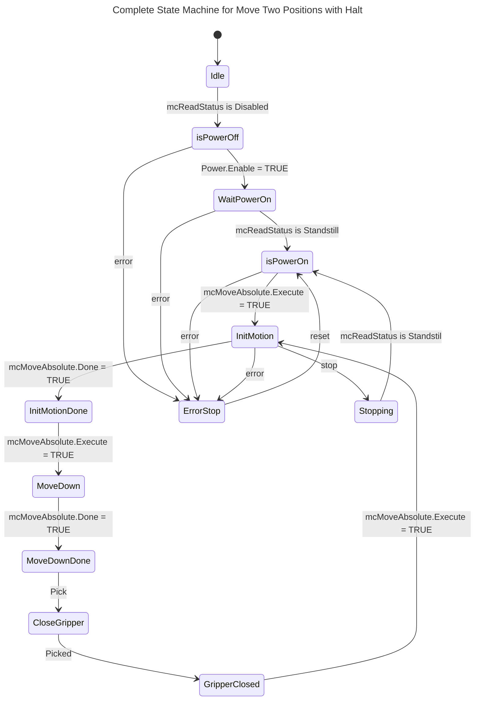

| Name           | Type         | Description                                      |
|----------------|--------------|--------------------------------------------------|
| **VAR_INPUT**  |              |                                                  |
| Execute        | BOOL         | Rising edge starts the processing               |
| Position       | LREAL        | Target position                                 |
| Velocity       | LREAL        | Maximum velocity                                |
| Acceleration   | LREAL        | Acceleration                                    |
| Deceleration   | LREAL        | Deceleration                                    |
| Jerk           | LREAL        | Maximum jerk                                   |
| BufferMode     | MC_BUFFER_MO | Buffered or direct command execution           |
| Axis           | AXIS_REF     | Axis to be controlled                          |
| **VAR_OUTPUT** |              |                                                  |
| Done           | BOOL         | The axis was reset                             |
| InBuffer       | BOOL         | The command is in the buffer, but it is not executed |
| Active         | BOOL         | The function block is active                   |
| CommandAborted | BOOL         | The command was aborted during the execution   |
| Error          | BOOL         | An error occurred                              |
| ErrorID        | ERROR_CODE   | Error classification                           |
| ErrorIdent     | ERROR_STRUCT | Error Diagnostics                              |
