<h1 align="left">
   
  
   
  Industrial Automation Base
   
</h1>

Cours AutB

Author: [Cédric Lenoir](mailto:cedric.lenoir@hevs.ch)

# Module 10 Industrial Fieldbus (*a quick overview*)

#	Les bus de terrain
Ce chapitre n’a pas pour objet de rentrer dans le détail technique des bus de terrain. Cependant il aborde le bus de terrain comme outil pour l’automatisation.
Une architecture pour un projet d’automation aujourd’hui, vu sous l’angle de l’ingénieur automaticien, c’est avant tout un PLC et un bus de terrain. La généralisation du bus de terrain, pour faire référence à l’industrie 4.0 pourrait être prendre l’appellation industrie 3.5. C’est une interprétation toute personnelle.
Le véritable pilier des bus de terrain apparu à la fin des années 80 est, du moins du point de vue européen et industriel, est le Profibus.

##	Real-Time Ethernet
Au début des années 2000, on assiste à l’arrivée sur le marché de toute une série de produit concurrents, à tel point que dans **The Industrial Communication Technology Handbook** publié en 2005, on parle de **The Insustrial Fielbus War**. La réalité, et ce pour le plus grand malheur du monde de l’automation, fait que les principaux acteurs du marché, malgré plusieurs tentatives, ont été incapables de de mettre d’accord sur un standard.

###	CEI 61784
Il existe bel et bien une série de normes chapeautées par le numéro 61784, mais malheureusement il existe à peu près autant de variations de la norme que de type de bus de terrain Ethernet Real-Time.
Ceci montre que norme et standardisation ne sont pas des synonymes….

###	Choisir son bus
Au niveau de la conception, et c’est la raison pour laquelle je place le bus de terrain avant le PLC, c’est que l’ingénieur automaticien choisira parfois sa plateforme de développement non pas en fonction des performances du PLC, mais en fonctions des équipements disponibles pour un bus de terrain donnés.
Dans l’aperçu ci-dessous, et de manière parfaitement arbitraire, c’est l’Ethernet-Powerlink qui est choisi. [Les images proviennent de] (https://www.ethernet-powerlink.org).

###	Architecture
 
<figure>
    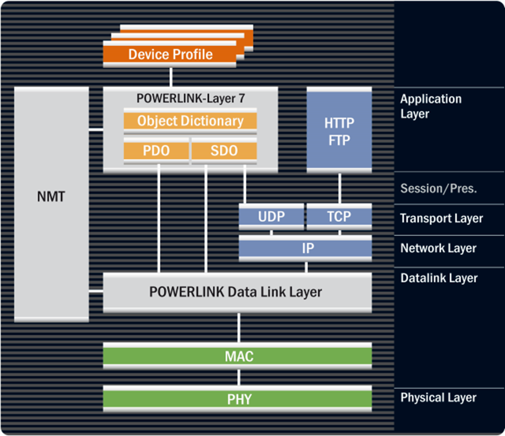
    <figcaption>Powerlink, Architecture</figcaption>
</figure> 

Un Ethernet temps réel, c’est avant tout un protocole et une couche logicielle qui vient se greffer sur du hardware Ethernet standard, port RJ45. Ce n’est que partiellement vrai, mais il existe des implémentations qui permettent de travailler en Ethernet Real-Time sur des PC standards.

###	Mécanisme
 
<figure>
    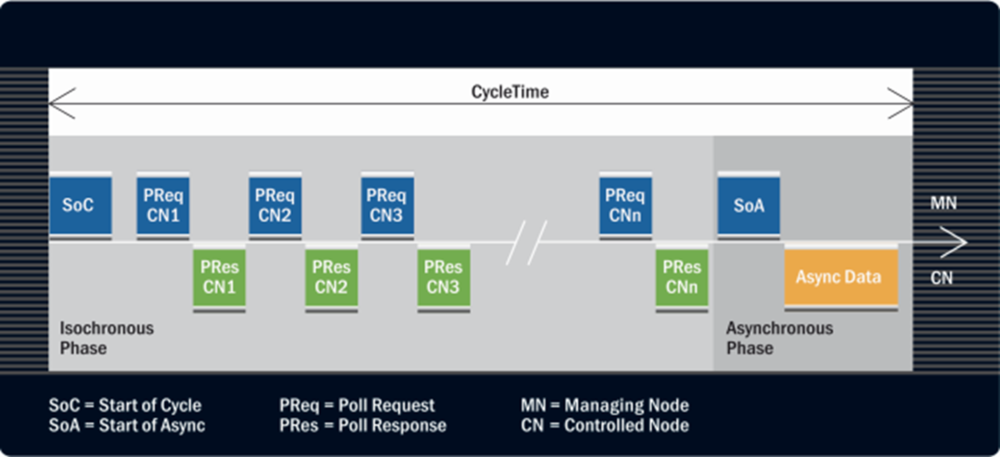
    <figcaption>Powerlink, Cycle time</figcaption>
</figure> 

Le principe est le suivant, une partie du temps de cycle du bus est réservé pour la phase Isochrone, c’est celle-ci qui est importante pour l’automation. Cela permet d’envoyer les données avec un temps de cycle fixe et des variations extrêmement précises. Cette précision est particulièrement importante pour la synchronisation des moteur, il faut penser par exemple ici à une machine d’usinage sur 5 axes qui doit garantir sur la pointe de l’outil une précision de l’ordre du micron.
On parle de temps de cycles typiques de l’ordre de 250 [µs] à 1 [ms].

La partie asynchrone est laissée à disposition de la communication Ethernet standard. Sur la plupart des implémentations, Profinet, Sercos III, Powerlink, Ethernet/IP, il est possible de communique directement via un port Ethernet standard.

###	Frame Format
 
<figure>
    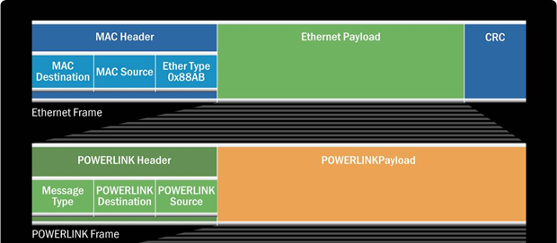
    <figcaption>Powerlink, Data Frame</figcaption>
</figure> 

Alors que dans un réseau Ethernet standard on utilise une adresse Ethernet, du type 192.168.0.4, dans la partie Real-Time, on trouvera un **master** puis une série de **Slave** avec un numéro d’identification unique. Le nombre de **Slave** sera en général limité, par exemple 250, avec pour chacun d’eux un numéro d’identification unique compris entre 1 et 250.

###	Performance
Quitte à rester un peu simpliste, la performance du bus de terrain en **Ethernet Real-Time** peut en général être considérée comme **suffisante** pour autant que la quantité de données transmit en temps réel restent raisonnables. On parle de quelques dizaines de bytes par cycle et par **Slave**.

Les équipements **gourmands** en bande passante sont en général les commandes moteurs. Le nombre d’entrées analogiques peut revêtir une certaine importance.
De manière générale, on peut estimer que pour un temps de cycle de l’ordre de la millisecondes et quelques dizaines de moteurs ou autre nœuds sur le réseau, il est peu probable de se retrouver face à une limitation. Le PLC arrivera probablement à ses limites avant le bus.

###	Camera
Il y a un élément de plus en plus présent dans les systèmes d’automation actuel, ce sont les caméras. Le grand volumes de données qu’elles génèrent seraient susceptibles de charger un bus au-delà de ses limites. C’est dans ce genre de cas de figure qu’il faudra commencer à se pencher attentivement sur la charge du bus.

###	Sécurité
 
<figure>
    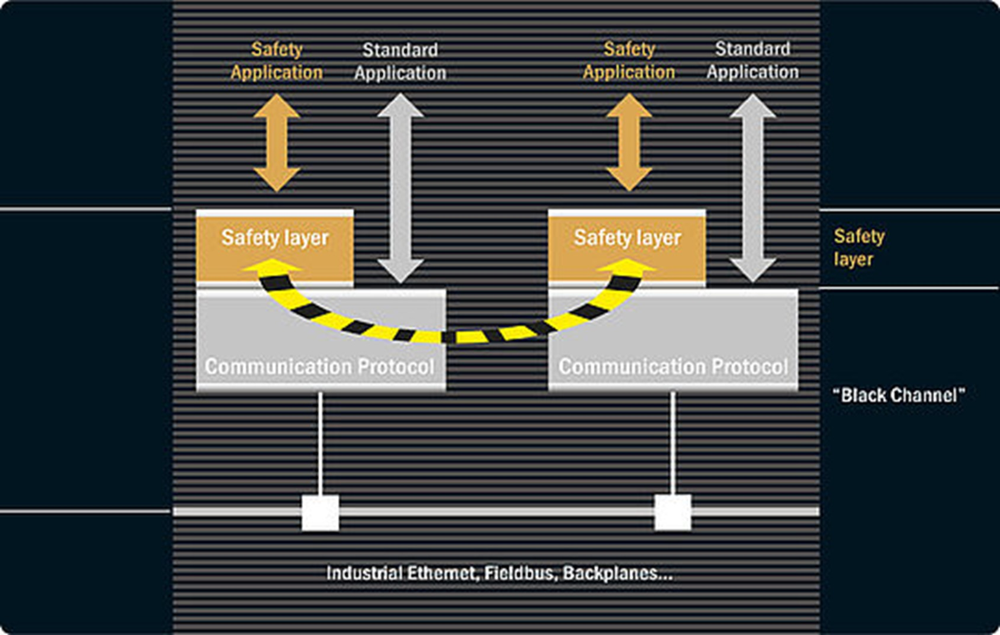
    <figcaption>Powerlink, Safety</figcaption>
</figure> 

La majorité des bus temps réel actuels sont maintenant capables d’être utilisés pour la câblage des éléments de sécurité. C’est le protocole qui est sécurisé entre deux points.

## Réseaux secondaires, Field Bus
 
<figure>
    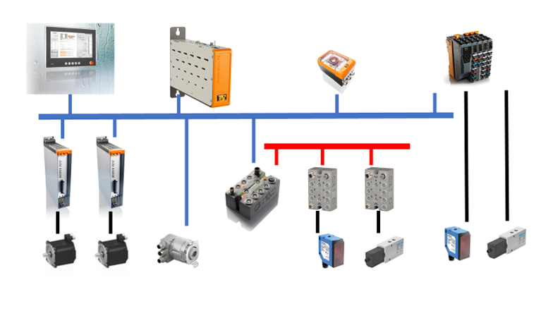
    <figcaption>Powerlink, Secondary Network</figcaption>
</figure> 

Si l’internet Real-Time est la colonne vertébrale du système, il est rare que celui-ci soit utilisé directement jusqu’au capteur.
Dans la pratique, le bus Ethernet real-time est réservé aux composants nécessitant un haut débit de données.
-   Les moteurs peuvent être pilotés en position avec un signal de position échantillonné à 400 [µs].
-   On peut synchroniser les moteurs en position avec un codeur branché lui aussi sur le bus Ethernet real-time.
-   On trouve des caméras qui peuvent se connecter directement sur le bus Ethernet.
-   Pour accéder aux composants nécessitant moins de données, ou une fréquence d’échantillonnage inférieure on utilisera souvent un bus dit **bus de terrain**. Les données seront en général multiplexées et connectées au bus Ethernet real-time via une passerelle. Comme pour les bus Ethernet real-time, on trouve peut de normalisation à ce niveau-là.

###	AS-Interface
 
<figure>
    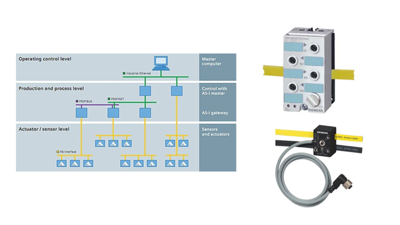
    <figcaption>AS-Interface, Source: Siemens</figcaption>
</figure> 

Le bus **AS-Inferface**, ou **ASi**, est l’exemple typique d’un bus de terrain. Sa vitesse dépend principalement du nombre de composants.
-   Le câble jaune fournit la puissance et transfert les données modulées sur la puissance.
-   Le câble noir fournit uniquement de la puissance pour les modules de sortie nécessitant plus de courant.

<figure>
    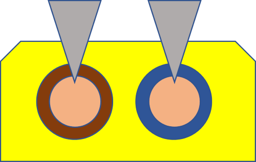
    <figcaption>AS-Interface, Section view</figcaption>
</figure> 
 
-   La système de câblage est extrêmement bon marché car les esclaves s'insèrent directement sur le câble à l’aide de deux pointes métalliques qui entrent en contact avec les connecteurs internes. Il est ainsi possible de rajouter un nœud ASi sur le bus sans interrompre le câble !

-   Il existe une version **Safe** du bus ASi.

|Key data per AS-i network|
|-----------------------------------------------|
|Number of slaves: up to 62|
|Number of I/Os: up to 496 inputs and 496 outputs|
|Topology: any, combinable, no termination resistors|
|Medium: unshielded two-wire line for data and energy|
|Line length: 100 m as a standard, extendable to 600 m with repeater and extension plug|
|Cycle time: 5 ms (typical)|
|Data transfer: digital and analog (16 Bit)|

 Voir aussi
[Complément d’information](https://www.as-interface-academy.net)

###	IO-Link
 
<figure>
    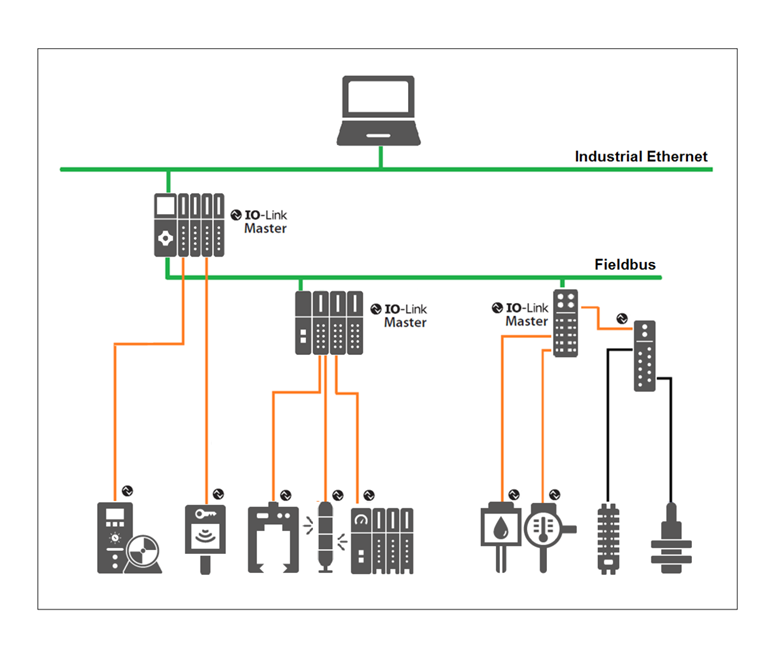
    <figcaption>IO-Link Architecture</figcaption>
</figure> 

#### Principe
**IO-Link est un protocole**.
IO-Link est une technologie entrées/sorties normalisée **IEC 61131-9** pour la communication avec des capteurs et des actionneurs. La communication point à point est basée sur la connexion de capteur et d'actionneur à 3 fils de **IEC 61131-2**. IO-Link n'est donc pas un bus de terrain mais le développement de la technique de connexion existante pour les capteurs et les actionneurs.
Pour le mettre en relation avec la technologie AS-interface, il existe maintenant des passerelles permettant de faire transiter le protocole IO-link à travers un réseau AS-interface.

Référence **IEC 61131 part 9**
Interface de communication numérique point à point pour petits capteurs et actionneurs.
 
<figure>
    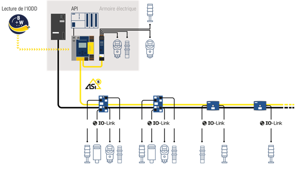
    <figcaption>IO-Link on AS-Interaface, Source: www.bihl-wiedemann.de </figcaption>
</figure> 

#### Caractéristique principale

Utilisation de l’infrastructure existante. Un capteur IO-Link pourra en général être installé sur un réseau existant, car il est capable de fournir les signaux standards du IEC 61131-2, bien sûr sans l’avantage des données du protocole. De même, un capteur d’ancienne génération qui ne fournit pas le protocole pourra être installé sur un réseau mis à niveau pour IO-Link.
-   Transmission du signal analogique sous forme numérique. Cela améliore la résistance aux perturbation électro-magnétiques.
-   Paramétrage des capteurs, cela permet de modifier les réglages du capteur à distance. Cela simplifie aussi beaucoup la maintenance, car les paramètres du capteur peuvent être stockée de manière centralisée et rechargée dans le capteur en cas de changement de capteur.
-   Accès aux paramètres de diagnostic du capteur.
-   Mise à disposition de signaux variés, par exemple, avant l’apparition de la technologie IO-Link, un capteur de type RFID, Radio Frequency Identification devait être relié directement au bus principal du type Ethernet Real-time. Il existe maintenant la possibilité de faire transiter les informations d’un capteur RFID à travers un bus secondaire de type ASi.

Ces différentes caractéristiques font de la technologie IO-Link une composante essentielle de l’Industrie 4.0 et des technologie IoT car elles permettent l’accès décentralisé aux capteurs.
La norme IEC 61131-9 date de 2013, ce n’est cependant que près de 10 ans après ses premiers développements que la technologie arrive à maturité avec une très importante variété de produit. 

Chez certains fournisseurs de capteurs, la majorité des nouveaux produits sont maintenant disponible avec ce protocole. La notion de capteur IO-Link inclut le monde du Process, par exemple l'industrie chimique.
 
Mode de fonctionnement d’un capteur Baumer, SIO-Mode and IO-Link Mode

<figure>
    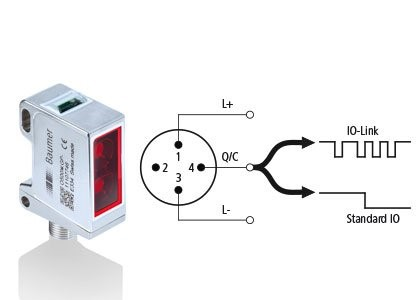
    <figcaption>IO-Link signal, Source: www.baumer.com </figcaption>
</figure>

Chaque port du maître IO-Link peut être utilisé soit en mode SIO (mode d'entrée/sortie standard) soit en mode IO-Link et ainsi traiter les informations de tous les détecteurs. En mode SIO, le détecteur fonctionne comme son homologue conventionnel. Les valeurs de mesure et les états de commutation sont transmis au régulateur par des sorties numériques ou analogiques. En mode IO-Link, la sortie numérique du détecteur est utilisée comme interface série bidirectionnelle pour l'échange d'informations de mesure et de diagnostic. Dans ce mode, le détecteur peut également être reconfiguré avec des paramètres.

En standard, 2 octets de données process sont disponibles par cycle. L'utilisateur peut également sélectionner des paquets de données plus grands (types de trames). Il est ainsi possible de transmettre des données process de plus grande taille, jusqu'à 32 octets, avec un temps de cycle plus lent.

#### Exemple d’une passerelle de type Baumer
Cette passerelle est non seulement conçue pour être connectée à un Ethernet Real-time, par exemple Profinet, mais permet aussi l’accès direct à des données formatées en OPC-UA via le protocole TCP-IP.

<figure>
    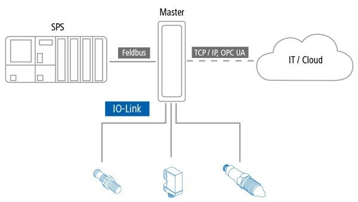
    <figcaption>IO-Link Gateway, Source: www.baumer.com </figcaption>
</figure>

#### IODDs
Chaque appareil IO-Link possède un fichier de description de l'appareil, appelé IODD (IO Device Description). Il contient des données sur le fabricant, le numéro d'article, la fonctionnalité, etc. qui peuvent être facilement lues et traitées par l'utilisateur. Chaque appareil, c'est-à-dire chaque détecteur, peut être identifié de manière unique à la fois par l'IODD et par un ID d'appareil interne. Il se compose de plusieurs fichiers : un fichier principal et des fichiers de langue externe optionnels (tous deux au format XML), ainsi que des fichiers image (au format PNG).
Ces fichiers sont nécessaires pour le paramétrages de la communication des PLC
Les fichier IODDs de tous les fabricants sont disponibles sur le site www.io-link.com.

Données cycliques / Process Data
Transmises en temps réel. Elles sont utilisées pour le contrôle de processus dans le système et peuvent également être transférées vers d'autres systèmes informatiques via IO-Link.
-   Ce sont les données transmises traditionnellement sous forme binaire, 0 ou 24 Vdc ou analogique sous forme 0..10 Vdc ou 4..20 mA.
A noter :
PDI : Process Data Input
PDO : Process Data Output
Données acycliques / Service Data
Permettent de paramétrer les détecteurs (dispositifs d'E/S) et, si nécessaire, de lire les données d'analyse et d'identification.
-   Diagnostique du capteur, tel que qualité du signal, température du capteur.
-   Repérage du capteur, tel que type du capteur, numéro de série.
-   Paramétrage, tel que distance de mesure, niveau de contraste.
Alarmes / Event Data
Notification ou indicateur créé lorsqu'un événement critique se produit. Exemples de données d'événement :
-   mauvais capteur connecté,
-   erreur de communication,
-   circuits ouverts,
-   surcharge,
-   lentille sale.
Validation

Dans les industries nécessitant un processus de validation, les capteurs IO-Link offrent la caractéristique intéressante de pouvoir être validés. Contrairement au capteurs traditionnels, on peut choisir de vérifier si le capteur a été changé en lisant son numéro de série, mais on peut aussi simplement choisir de vérifier si il a été remplacé par un capteur équivalent.

Ouvrage de référence
IO-Link The DNA of Industry 4.0,  Joachim R. Uffelmann, Peter Wienzek, Myriam Jahn

###	Quelques remarques complémentaires ici :
https://e2e.ti.com/blogs_/b/industrial_strength/archive/2015/08/20/three-protocols-for-industrial-communication

Le processus connait plutôt le protocol HART, cependant un des acteurs majeurs de la mesure process se dirige clairement vers le IO-Link
 
<figure>
    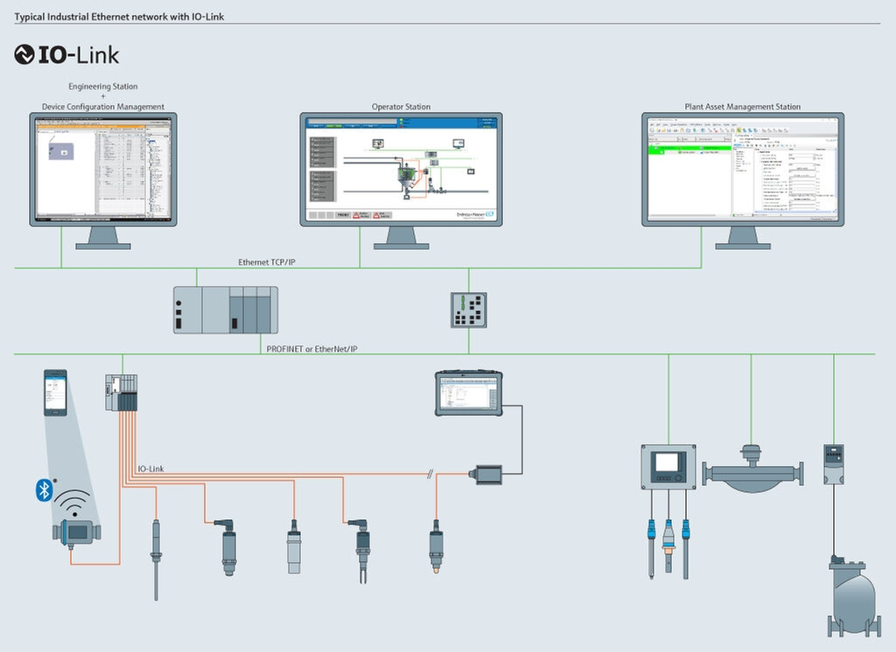
    <figcaption>IO-Link_Network_Layout_E+H, Source: www.ch.endress.com </figcaption>
</figure> 
IO-Link trouve aussi de nombreuses applications dans le domaine de l’énergies, par exemple pour les installation éolienne ou le fait de pouvoir procéder au diagnostic du capteur est un atout.

# Ethernet-apl

Two-Wire Ethernet for process automation.

<figure>
    
    <figcaption>Ethernet Advanced Physical Layer, Source: www.ethernet-apl.org </figcaption>
</figure> 

## Industry Partners
| | | | |
|-----------|--------------|--------------|--------------|
|||||
|||||
|||||

Cette technologie est nouvelle. Aucun savoir faire connu actuellement dans le cadre de la HEVS.
Pour plus d'informations, se référer au [White Paper fournit en annexe](Ethernet-APL_Ethernet-To-The-Field_EN_FINAL_June-2021.pdf).
