<h1 align="left">
   
  
   
  Industrial Automation Base
   
</h1>

Cours AutB

Author: [Cédric Lenoir](mailto:cedric.lenoir@hevs.ch)

# Module 10 OPC Unified Architecture (UA)

*Keywords:* [OPC UA](https://opcfoundation.org/)

# OpcUa_AutB

[Vous pourriez d'abord lire la présentation du réseau industriel](IndustrialNetwork.md)

Ce module est une introduction à OPC UA.
OPC UA sera utilisé sous forme paramétrable afin de comprendre son utilisation dans le cadre de l'automation, et plus généralement pour tout système qui requiert l'échange d'un grand nombre de données complexes dans un contexte sécurisé.
Pour plus de détails sur les fonctions avancées de OPC UA, on se reportera au cours du 6ème semestre P&C.

# OPC UA 
## Livre de référence
OPC Unified Architecture de Mahnke, Leitner et Damm, 2009.
Ce livre reste **LA** base pour toute personne qui veut ou doit se plonger dans le détail de l’implémentation OPC-UA.

Vu son importance croissante dans le domaine de l’automation, la composante **Sécurité** de l’OPC UA est intégrée comme exemple dans un chapitre spécifique lié à la Cyber Sécurité.

## Préambule

<figure>
    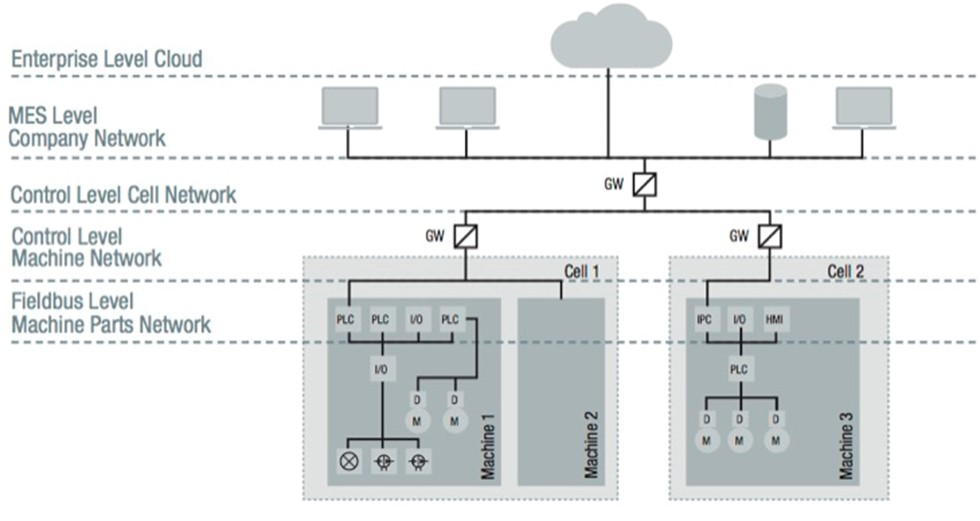
    <figcaption>The connected factory is creating a need to provide much higher levels of security than in the past. Source opcfoundation.org</figcaption>
</figure> 

## Historique
Il n’est pas possible de parler de l’OPC UA sans aborder en deux mots son ancêtre, renommé dans la littérature récente: OPC Classic.

### Qu'est-ce que OPC Classic?

La spécification OPC Classic d'origine est OPC DA (Data Access), qui définit une interface entre les applications client et serveur pour échanger des données de processus et de fabrication. Les autres spécifications importantes d'OPC Classic incluent OPC Alarms & Events (OPC AE) et OPC Historical Data Access (OPC HDA).
Dans la pratique, c’est une technologie permettant le partage de variables sur un réseau TCP/IP entre un PLC: le serveur, et un client: le PC avec Windows.

Pour l’automaticien cela consiste à faire des click pour lier les données à l’OPC du côté de l’IDE du PLC, puis des clicks dans l’environnement de développement du client HMI implémenté sur une plateforme Windows. Y ajouter ensuite des pleurs et des grincements de dents à chaque fois que les données doivent transiter à travers un Firewall….

### Qu’est-ce que OPC UA?
**Open Platform Communications** / **Unified Architecture**
Le modèle client/serveur est le modèle de communication traditionnel dans OPC UA. Il est basé sur l'idée qu'il existe un composant serveur passif qui expose des données pour d'autres applications qui agissent en tant que clients. Les applications **Client** peuvent accéder aux données et informations du **Serveur** via des services standardisés.

**OPC UA est conçu pour utiliser l'architecture TCP/IP**, il occupe les couches 5, 6 et 7 du modèle OSI.

<figure>
    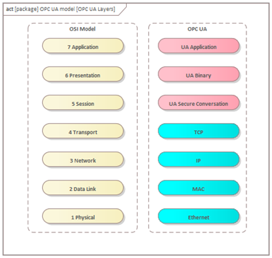
    <figcaption>OPC UA Layers</figcaption>
</figure> 

OPC UA dans le cadre de ce cours **(en construction)**
Ce cours se concentre sur la partie application de l’OPC UA avec une très succincte description des couches inférieures. Dans la mesure ou la norme OPC UA comporte un volet sécurité, IEC TR 62541-2, nous en profiterons pour aborder l’aspect cyber sécurité d’un projet d’automation.
OPC UA offre les fonctionnalités suivantes

- Protocole ouvert et **indépendant de la plate-forme** pour la communication interprocessus et réseau.
- Accès à Internet et communication via des pare-feu (Firewalls).
- Mécanismes intégrés de contrôle d'accès et de sécurité au niveau du protocole et de l'application.
- Options de mappage étendues pour les modèles orientés objet. Les objets peuvent avoir des balises (tags) et des méthodes et déclencher des événements.
- Système de type extensible pour les objets et les types de données complexes.
- Les mécanismes de transport et les règles de modélisation constituent la base d'autres normes.
- Évolutivité des petits systèmes embarqués aux applications d'entreprise et modèles complexes orientés objet.

# Architecture
Le terme Unified Architecture signifie que OPC UA est conçu pour couvrir l’ensemble de l’architecture d’un système d’automation, depuis un ERP, en passant par un **MES**, les systèmes **SCADA** et jusqu’au capteur.
En d’autres termes, il est possible depuis une application sur le Cloud d’accéder de manière sécurisée aux informations d’un capteur.
ERP Enterprise resource planning.
Un type de logiciel que les entreprises utilisent pour gérer leurs activités quotidiennes telles que la comptabilité, les achats, la gestion de projets, la gestion des risques et la conformité, ainsi que les opérations de supply chain, une chaîne qui relie le fournisseur du fournisseur au client.
MES Manufacturing Execution System
Un système informatique qui connecte, surveille et contrôle des systèmes de fabrication et flux de données complexes au niveau des ateliers
SCADA Supervisory Control and Data Acquisition
Système de supervision industrielle qui traite en temps réel un grand nombre de mesures et contrôle à distance les installations)

## Figure

<figure>
    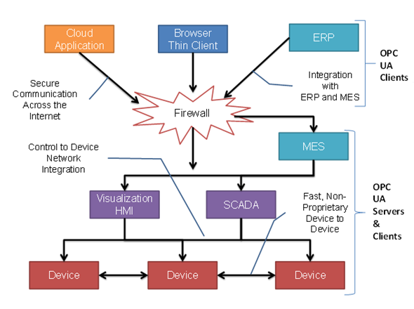
    <figcaption>The Scope of OPC UA within an enterprise, Source reference.opcfoundation.org
Fonctionnement de base Client Serveur</figcaption>
</figure> 

<figure>
    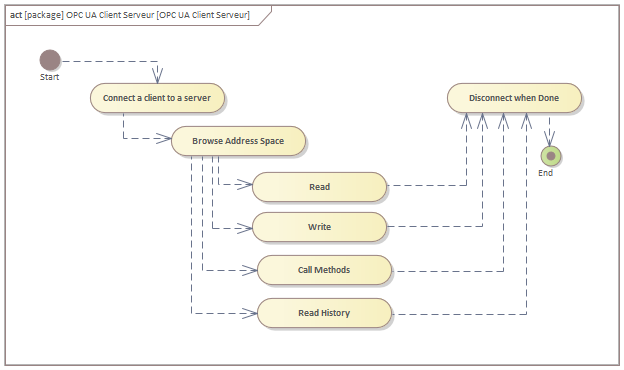
    <figcaption>OPC UA Client Serveur</figcaption>
</figure> 

### La première chose que le client doit faire est d'ouvrir une connexion au serveur.
- Il a besoin d'une adresse de connexion, en général IP.
- Il créera alors une session sur le serveur.
- La session contient un contexte de sécurité, qui comprend des paramètres de chiffrement et d'authentification facultatifs pour identifier - l'application client et l'utilisateur dans le serveur.
- Le Client peut également identifier le Serveur et décider s'il autorise la communication avec lui.

### L’application client peut requérir quelques services standard du serveur. Ils sont :

- Se connecter et créer une session.
- Parcourir l’espace d’adresse - pour découvrir ce qui est disponible sur le serveur
- Lire - des variables ou métadonnées
- Ecrire - des variables ou des métadonnées

- Appeler des méthodes
- Lire l'historique - pour des variables et des événements
- Fermer la session et se déconnecter

## Metadata 
- Les métadonnées sont des données qui décrivent d'autres données, des **types**, fournissant une référence structurée qui aide à trier et à identifier les attributs de l'information qu'elle décrit.

- C’est l’un des points forts de la norme OPC-UA, la capacité à obtenir une information complète et déterminée.

- Certains protocoles rudimentaires tels Modbus se contentent de livrer un certains nombre de bytes à une adresse donnée, dans le meilleur des cas, si l’on connait à l’avance l’adresse hexadécimale d’une information, on pourra lire un certain nombre de bytes sans aucune garantie que le nombre de bytes et leur format n’aient pas varié du côté du client au moment de la lecture.

- Grâce à l’intégration de la gestion des metadata dans la norme OPC UA, on pourra lire le format des données au moment de l’établissement de la session, (voir même recevoir une notification en cas de modification).

- Obtenir le type de données (INT, REAL, WORD, etc.) ainsi que des données structurées (STRUCT)

- Obtenir si elle est disponible l’**unité de l’information**, sa **tolérance**, sa **date**, son **historique** ainsi que pratiquement tout ce que le gestionnaire aura décidé de fournir.

## OPC UA Subscription Concept
Contrairement à la lecture permanente d'informations (Read), OPC UA offre une fonctionnalité plus élégante, appelée abonnement, Subscription. Un client UA peut s'abonner à une sélection de nœuds d'intérêt et laisser le serveur surveiller ces éléments. Uniquement en cas de modifications, par ex. à leurs valeurs, le serveur informe le client de ces changements. Ce mécanisme réduit considérablement la quantité de données transférées. Outre la réduction de la bande passante, ce mécanisme présente d'autres avantages et est le mécanisme recommandé pour "lire" les informations d'un serveur UA.

Un client peut s'abonner à différents types d'informations fournies par un serveur OPC UA. L'objet d'un Abonnement est de regrouper ces sources d'informations, appelées MonitoredItem, pour former une information appelée Notification. Il est par exemple possible de regrouper les éléments en fonction de l'intervalle de temps que le serveur utilisera pour surveiller les valeurs des différents abonnements, Subscriptions. 

Une fois l'abonnement créé, le client envoie l’information Publish sur le serveur et le serveur répondra périodiquement si il y a lieu avec NotificationMessages. Le NotificationMessage peut contenir des DataChanges et des Events, respectivement au type des MonitoredItems.

<figure>
    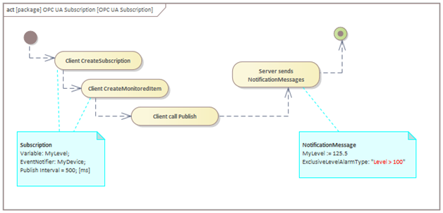
    <figcaption>OPC UA Subscription</figcaption>
</figure> 

### Les composantes de OPC UA
- OPC UA est un monstre, cependant, la plupart des implémentations n'intègrent qu'une partie de l'ensemble de l'OPC UA.
- La plupart des outils pour OPC UA servent à encapsuler la complexité pour présenter à l'utilisateur final des données de manière simple. [Exemple: OPC UA Monitor de Prosys](https://prosysopc.com/products/opc-ua-monitor/).

Les composants fondamentaux de l'architecture unifiée OPC sont les mécanismes de transport et la modélisation des données selon OPC Unified Architecture de Mahnke, Leitner et Damm.

<figure>
    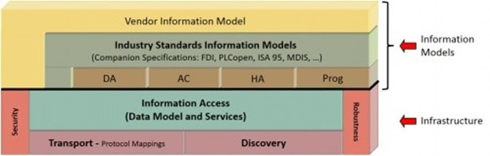
    <figcaption>Infrastructure OPC UA, Source: https://opcfoundation.org</figcaption>
</figure> 

### Transport
Le transport définit différents mécanismes optimisés pour différents cas d'utilisation. La première version d'OPC UA définit un protocole TCP binaire optimisé pour la communication intranet haute performance ainsi qu'un mappage aux normes Internet acceptées telles que les services Web, XML et HTTP pour une communication Internet compatible avec le pare-feu. Les deux transports utilisent le même modèle de sécurité basé sur les messages connu des services Web et le modèle de communication abstrait ne dépend pas des mécanismes de transport.

> OPC UA définit différents protocoles, mais surtout il intègre des mécanismes de sécurité ainsi que des mécanismes compatibles avec les pare-feu, Firewall.

### Modélisation, orienté objet
La modélisation des données définit les règles et les blocs de construction de base nécessaires pour exposer un modèle d'information avec OPC UA. Il définit également les points d'entrée dans l'espace d'adressage et les types de base utilisés pour construire une hiérarchie de types. Cette base peut être étendue par des modèles d'information s'appuyant sur les concepts de modélisation abstraite. En outre, il définit certains concepts améliorés tels que la description des machines à états utilisées dans différents modèles d'information.
Les services UA sont l'interface entre les serveurs en tant que fournisseur d'un modèle d'information et les clients en tant que consommateurs de ce modèle d'information. Les Services sont définis de manière abstraite. Ils utilisent les mécanismes de transport pour échanger les données entre le client et le serveur.
Ce concept de base d'OPC UA permet à un client OPC UA d'accéder aux plus petits éléments de données sans avoir besoin de comprendre l'ensemble du modèle exposé par des systèmes complexes. Les clients OPC UA comprenant également des modèles spécifiques peuvent utiliser des fonctionnalités plus avancées définies pour des domaines et des cas d'utilisation spéciaux. La figure 2 montre les différentes couches de modèles d'information définis par OPC, par d'autres organisations ou par des fournisseurs.

### Discovery mechanism
L’un des aspects particulier et fondateur de l’OPU UA est sa fonction découverte. Cela signifie que l’architecture intègre non seulement l’aspect d’accès aux données, mais aussi l’accès à la modélisation des données, Metadata. Sans connaître à l’avance la structure d’un capteur il sera possible de découvrir l’organisation des données à l’intérieur de ce capteur, de lire ou écrire certains paramètres, mais encore d’invoquer des méthodes. On pourrait dire qu’il est non seulement possible d’accéder à un objet, mais aussi de découvrir sa classe.

<figure>
    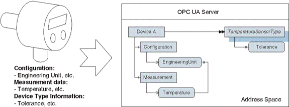
    <figcaption>OPC UA, Object Oriented, Source OPC Unified Architecture de Mahnke, Leitner et Damm</figcaption>
</figure> 

### Orienté Objet
Cela signifie que pour un client, il sera possible, par exemple, de se connecter à différents appareils héritant du même « parents » pour connaitre par exemple leur nom, sans se soucier de leur model complet.

<figure>
    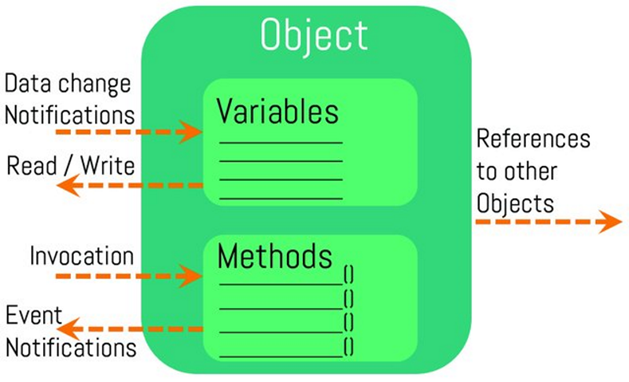
    <figcaption>Object Model OPC UA, Source https://opcfoundation.org</figcaption>
</figure> 

Malheureusement pour la compréhension de la spécification, la définition OPC UA n’utilise pas l’UML, mais sa propre notation.

<figure>
    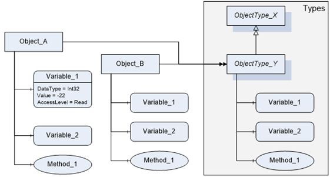
    <figcaption>Objet and Instance in OPC UA style, Source reference.opcfoundation.org</figcaption>
</figure> 

<figure>
    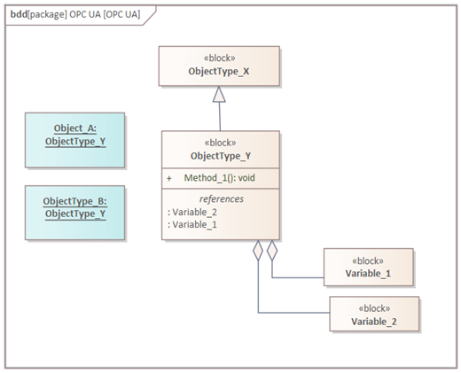
    <figcaption>Object and Instance in OPC UA style converted to SysML / UML</figcaption>
</figure> 

## OPC UA, Functional Specification
OPC UA est normalisé selon **IEC 62541**. La spécification de l’OPC UA est un monstre qui en 2020 compte déjà plus de 15 parties dont certaines comportent plusieurs centaines de pages. Ceci sans compter les normes qui y sont relatives.

> Toutefois, cet aspect **monstrueux** si l’on aborde l’OPC UA sous l’angle technique de celui qui doit l’implémenter, ne doit pas effrayer l’utilisateur final qu’est l’automaticien. Ce cours n’est pas destiné à implémenter OPC UA, mais à en comprendre l’intérêt.

|OPC UA / IEC 62541|Year |Part|Name|
|-------------------|--|----|--------------------|
|IEC TR 62541-1:|2020|OPC unified architecture - Part 1: |Overview and concepts|
|IEC TR 62541-2:|2020|OPC unified architecture - Part 2: |Security Model|
|IEC 62541-3: |2020  |OPC Unified Architecture - Part 3: |Address Space Model|
|IEC 62541-4: |2020  |OPC Unified Architecture - Part 4: |Services|
|IEC 62541-5: |2020  |OPC Unified Architecture - Part 5: |Information Model|
|IEC 62541-6: |2020  |OPC Unified Architecture - Part 6: |Mappings|
|IEC 62541-7: |2020  |OPC unified architecture - Part 7: |Profiles|
|IEC 62541-8: |2020  |OPC Unified Architecture - Part 8: |Data Access|
|IEC 62541-9: |2020  |OPC Unified Architecture - Part 9: |Alarms and Conditions|
|IEC 62541-10:|2020  |OPC Unified Architecture - Part 10: |Programs|
|IEC 62541-11:|2020  |OPC Unified Architecture - Part 11: |Historical Access|
|IEC 62541-12:|2020  |OPC Unified Architecture - Part 12: |Discovery and global services|
|IEC 62541-13:|2020  |OPC Unified Architecture - Part 13: |Aggregates|
|IEC 62541-14:|2020  |OPC Unified Architecture - Part 14: |PubSub|
|IEC 62541-100:|2015 |OPC Unified Architecture - Part 100: |Device Interface|

A noter IEC 62451-13:2020 Norm number-Part:Year. Au moment de l’écriture de ce cours, la plupart des parties sont en **Pre-Release** c’est-à-dire en cours d’approbation finale.

# Dans le laboratoire HEVS
- Nous utilisons une communication machine to machine entre Siemens S7 et CtrlX Core.
- Nous pouvons accéder aux données des cateurs IO-Link via un Gateway Baumer.
- Nous utiisons un outil Prosys en guise de HMI **No Code** pour communiquer avec le CtrlX Core.

## Examples from the lab

<figure>
    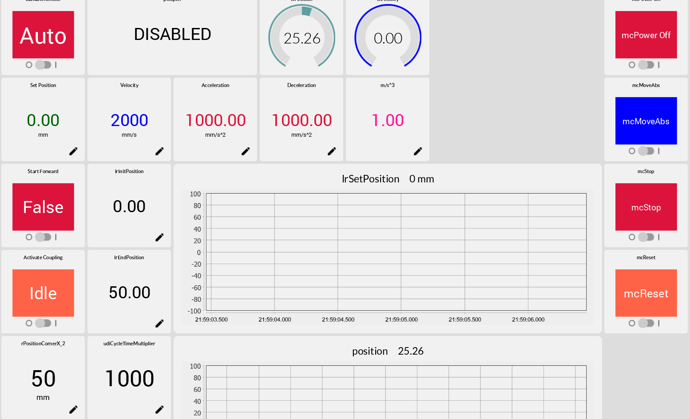
    <figcaption>Display values and set parameters for a trajectory</figcaption>
</figure> 

<figure>
    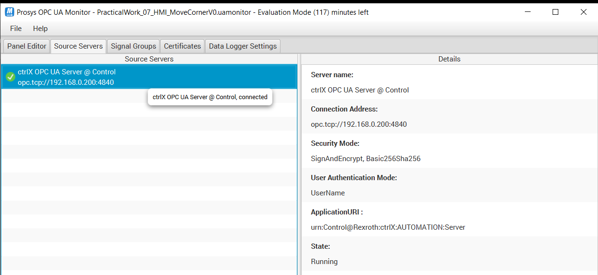
    <figcaption>Connection between Prosys Client and CtrlX Server</figcaption>
</figure> 

<figure>
    
    <figcaption>Connection between Prosys Client and CtrlX Server</figcaption>
</figure> 

<figure>
    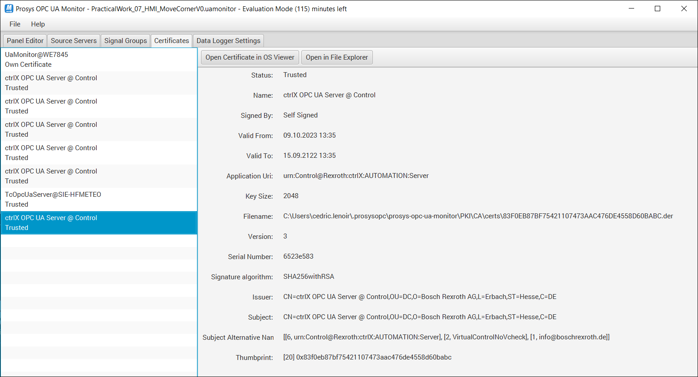
    <figcaption>Certificate on client side</figcaption>
</figure> 

<figure>
    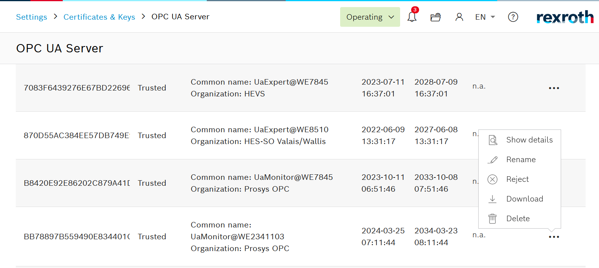
    <figcaption>Certificate on server side</figcaption>
</figure> 

<figure>
    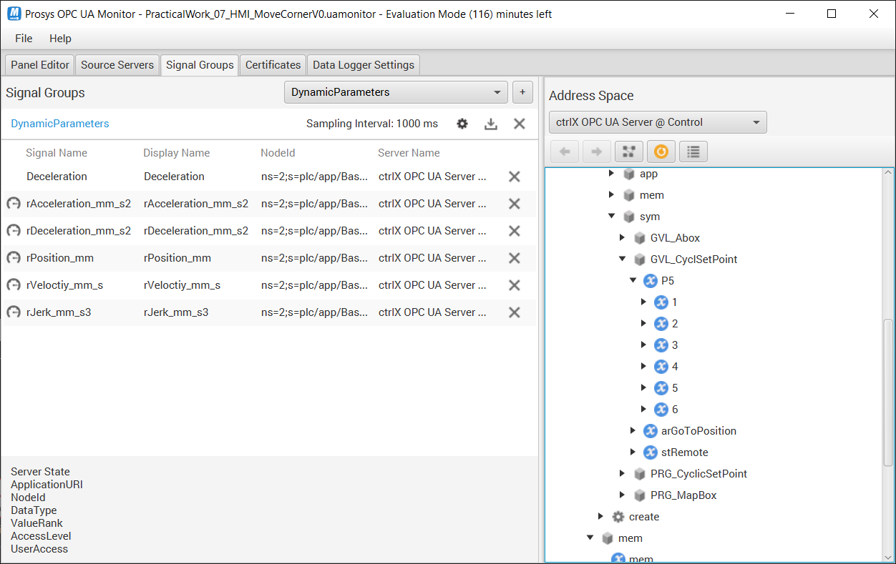
    <figcaption>Signal selecction on client side</figcaption>
</figure> 

<figure>
    
    <figcaption>Signal selecction on server side</figcaption>
</figure> 

<figure>
    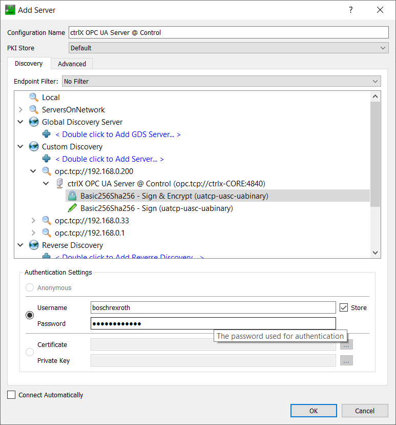
    <figcaption>Connect to CtrlX with UA Expert</figcaption>
</figure> 

<figure>
    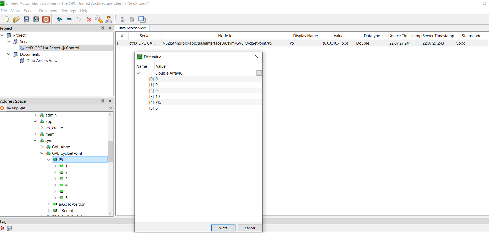
    <figcaption>Connect to CtrlX with UA Expert to set Polynomial</figcaption>
</figure> 