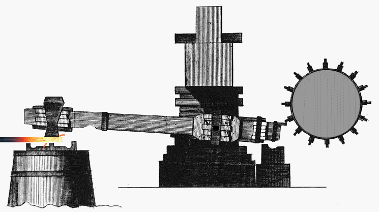
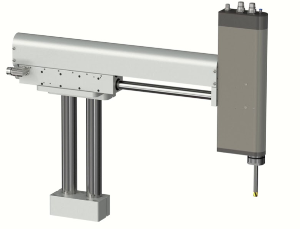
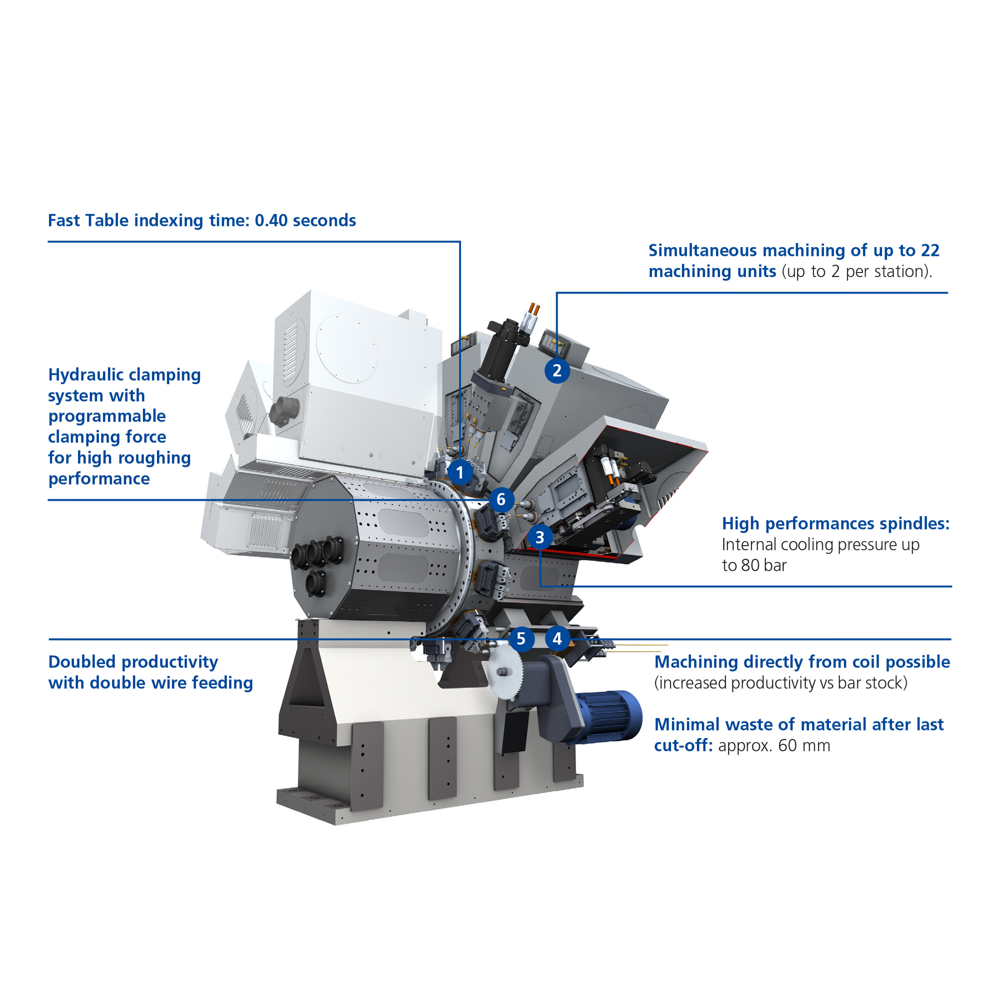
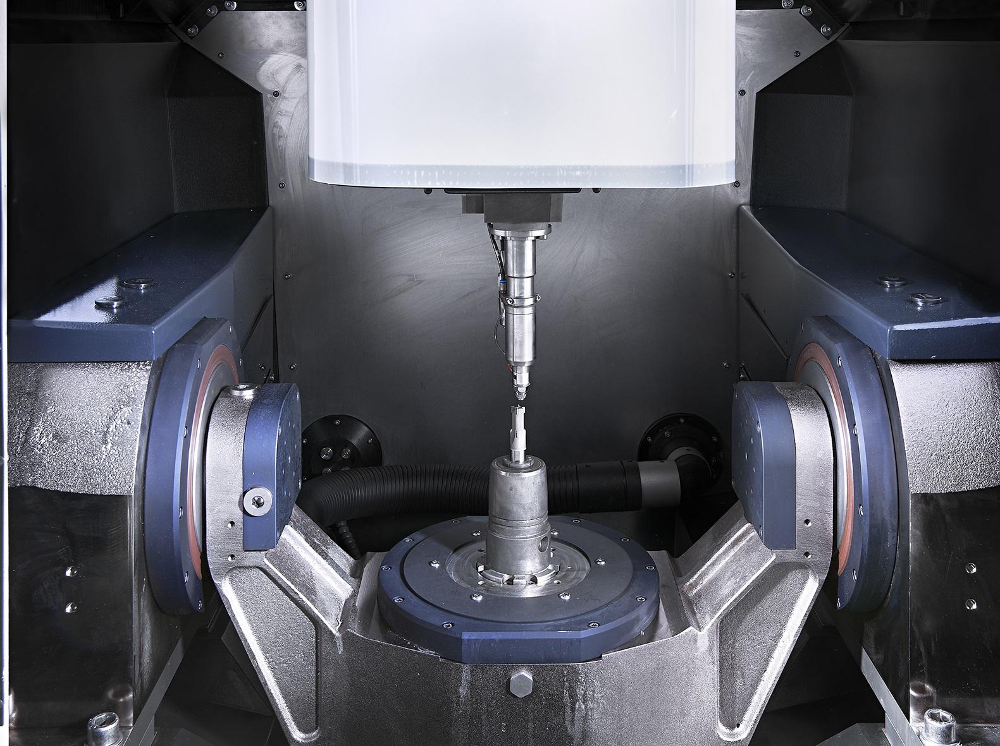
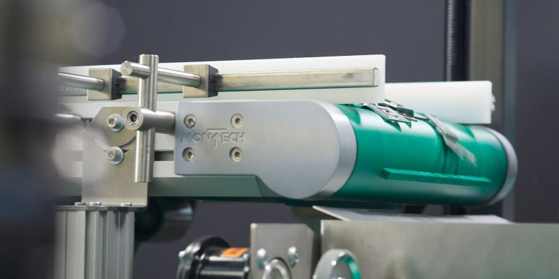
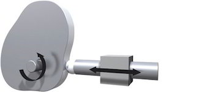
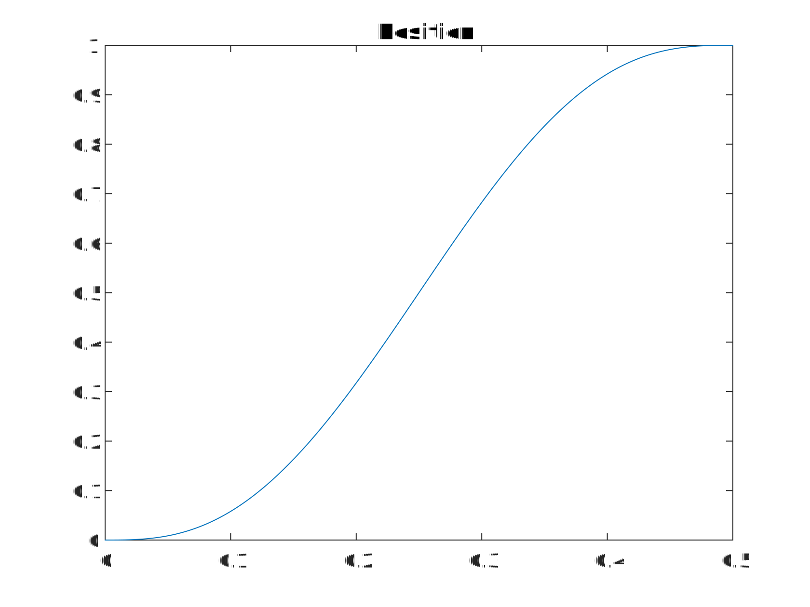
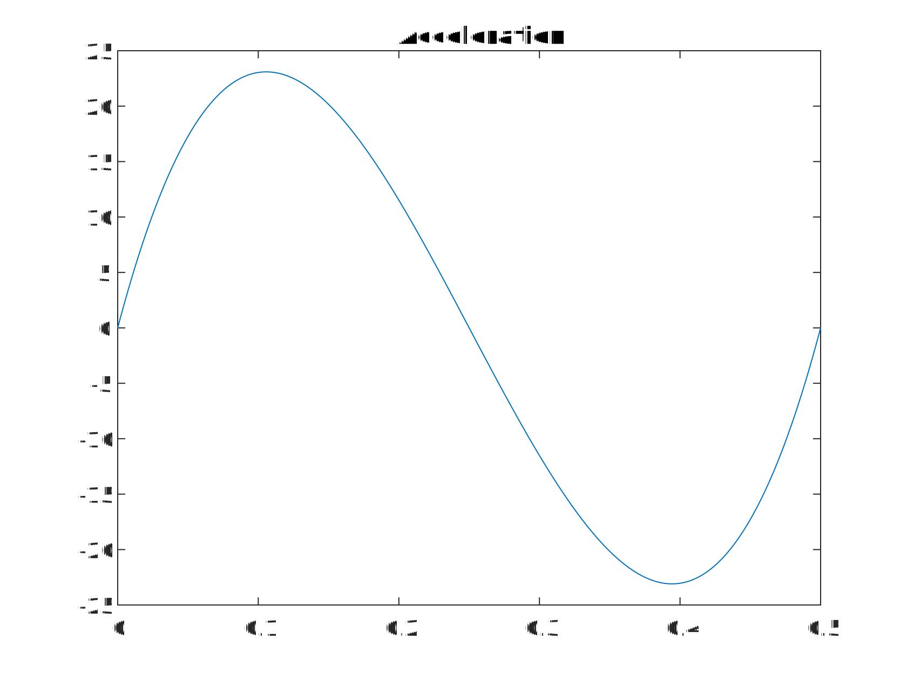
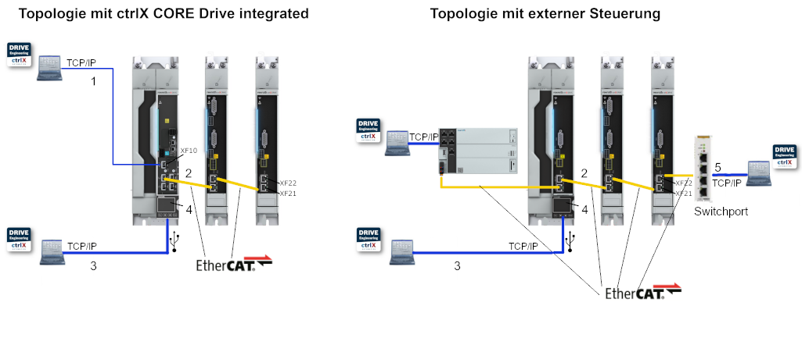
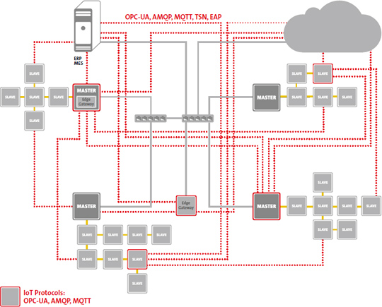

<h1 align="left">
  <br>
  
  <br>
  Industrial Automation Base
  <br>
</h1>

Cours AutB

Author: [Cédric Lenoir](mailto:cedric.lenoir@hevs.ch)

# S4 AutB Module 11
## Mouvements synchronisés et Ethernet temps réel

## Sommaire

- [S4 AutB Module 11](#s4-autb-module-11)
  - [Mouvements synchronisés et Ethernet temps réel](#mouvements-synchronisés-et-ethernet-temps-réel)
  - [Sommaire](#sommaire)
    - [Pourquoi lier Motion Control et Ethernet temps réel ?](#pourquoi-lier-motion-control-et-ethernet-temps-réel-)
    - [Histoire de la synchronisation](#histoire-de-la-synchronisation)
    - [Mouvement synchronisé et Ethernet temps réel](#mouvement-synchronisé-et-ethernet-temps-réel)
    - [Communication déterministe](#communication-déterministe)
      - [Pourquoi est-ce important ?](#pourquoi-est-ce-important-)
      - [Comment est-ce réalisé ?](#comment-est-ce-réalisé-)
      - [Exemple concret](#exemple-concret)
    - [Latence](#latence)
      - [Pourquoi est-ce important ?](#pourquoi-est-ce-important--1)
      - [Comment cela est-il réalisé ?](#comment-cela-est-il-réalisé-)
      - [Exemple concret](#exemple-concret-1)
- [Notions de trajectoire](#notions-de-trajectoire)
  - [Expression élémentaire d'une trajectoire](#expression-élémentaire-dune-trajectoire)
  - [Résolution de la trajectoire](#résolution-de-la-trajectoire)
  - [Contraintes](#contraintes)
    - [Erreur de poursuite](#erreur-de-poursuite)
    - [Limite de vitesse](#limite-de-vitesse)
    - [Limite de couple/force](#limite-de-coupleforce)
  - [Type de trajectoire](#type-de-trajectoire)
  - [Trajectoire selon polynôme d'ordre 5](#trajectoire-selon-polynôme-dordre-5)
  - [Opérations sur les trajectoires](#opérations-sur-les-trajectoires)
    - [Transformation géométrique de mise à l'échelle sur l'axe y.](#transformation-géométrique-de-mise-à-léchelle-sur-laxe-y)
    - [Mise à l'échelle du temps.](#mise-à-léchelle-du-temps)
  - [Pour approfondir le sujet](#pour-approfondir-le-sujet)
    - [Bibliographie sur les trajectoires](#bibliographie-sur-les-trajectoires)
- [Real-Time Ethernet](#real-time-ethernet)
  - [Qu'est-ce que l'Ethernet en temps réel ?](#quest-ce-que-lethernet-en-temps-réel-)
    - [Real-Time Ethernet](#real-time-ethernet-1)
      - [CEI 61784](#cei-61784)
      - [Choisir son bus](#choisir-son-bus)
      - [Performance](#performance)
      - [Camera](#camera)
      - [Sécurité](#sécurité)
      - [Réseaux secondaires, Field Bus](#réseaux-secondaires-field-bus)
    - [Concrètement ?](#concrètement-)
    - [Limitations](#limitations)
    - [Cas d'utilisation de l'Ethernet temps réel](#cas-dutilisation-de-lethernet-temps-réel)
    - [Avantages d'Ethernet en temps réel (basé sur EtherCAT)](#avantages-dethernet-en-temps-réel-basé-sur-ethercat)
  - [Deux mots à propos de Ethernet-APL](#deux-mots-à-propos-de-ethernet-apl)
  - [Deux mots à propos de la technologie TSN](#deux-mots-à-propos-de-la-technologie-tsn)
- [EtherCAT](#ethercat)
  - [Pour sortir du Motion Control](#pour-sortir-du-motion-control)
    - [Qu'est-ce qu'une interface IEPE ?](#quest-ce-quune-interface-iepe-)
  - [EtherCAT en détails](#ethercat-en-détails)
    - [Principe de fonctionnement](#principe-de-fonctionnement)
    - [Le protocole EtherCAT](#le-protocole-ethercat)
    - [Topologie flexible](#topologie-flexible)
    - [EtherCAT P : communication et alimentation dans un seul câble](#ethercat-p-communication-et-alimentation-dans-un-seul-câble)
    - [Horloges distribuées pour une synchronisation de haute précision](#horloges-distribuées-pour-une-synchronisation-de-haute-précision)
    - [Diagnostic et localisation des erreurs](#diagnostic-et-localisation-des-erreurs)
    - [Exigences de haute disponibilité](#exigences-de-haute-disponibilité)
    - [Safety over EtherCAT](#safety-over-ethercat)
    - [Profils de communication](#profils-de-communication)
      - [Sercos over Ethercat](#sercos-over-ethercat)
      - [ADS over EtherCAT](#ads-over-ethercat)
        - [Fonctionnalité principale](#fonctionnalité-principale)
        - [Exemple d'application :](#exemple-dapplication-)
      - [Ethernet sur EtherCAT, EoE](#ethernet-sur-ethercat-eoe)
      - [Accès aux fichiers via EtherCAT, FoE](#accès-aux-fichiers-via-ethercat-foe)
      - [ADS sur EtherCAT AoE](#ads-sur-ethercat-aoe)
    - [Communication à l'échelle de l'usine avec le protocole d'automatisation EtherCAT, EAP](#communication-à-léchelle-de-lusine-avec-le-protocole-dautomatisation-ethercat-eap)
    - [Intégration d'autres systèmes de bus](#intégration-dautres-systèmes-de-bus)
    - [Dynamiser la transformation numérique avec EtherCAT, TSN, Industrie 4.0 et l'IoT](#dynamiser-la-transformation-numérique-avec-ethercat-tsn-industrie-40-et-liot)
  - [Implémentation des interfaces EtherCAT](#implémentation-des-interfaces-ethercat)
    - [Slave, Slaves](#slave-slaves)
- [Annexe](#annexe)
    - [Fournisseurs de systèmes CNC professionnels](#fournisseurs-de-systèmes-cnc-professionnels)

### Pourquoi lier Motion Control et Ethernet temps réel ?
Parce que, comme nous le verrons ci-dessous, les contraintes de temps pour le Motion Control sont plus critiques que pour d'autres types de processus.

Dans le domaine de la chimie, les temps de cycle du système de contrôle sont dans un ordre de grandeur de mille fois plus lents que dans le Motion Control. On parle de secondes.

<div align="center">
    <a href="https://iebmedia.com/technology/industrial-ethernet/ethernet-apl-digitization-impacting-process-industries/">
        
    </a>
    <p><em>Ethernet-APL digitization impacting process industries, Source: iebmedia.com</em></p>
</div>

Cette image de source Analog Devie illustre bien le sujet:

<div align="center">
        
    <p><em>Real-time communications in automation, Source: www.analog.com</em></p>
</div>

> Une règle empirique dit que pour travailler en régulation, par exemple de type PID, un facteur de 10 entre la vitesse de traitement et la vitesse du processus est suffisant. Soit la valeur limite de 100 [ms] pour la partie centrale, **Factory Automation**.

### Histoire de la synchronisation

<div align="center">
    
    <p><em>Une ancienne machine synchronisée, Source: Wiki</em></p>
</div>

Pour rappel, selon la directive machine CE 2006/42, du point de vue sécurité:

> Ensemble équipé ou destiné à être équipé d'un système d'entraînement autre que la force humaine ou animale appliquée directement, composé de pièces ou d'organes liés entre eux dont au moins un est mobile et qui sont réunis de façon solidaire en vue d'une application définie.

Nous avons bien à faire à une machine.

Actuellement, les systèmes à came mécanique sont encore utilisés sur de nombreuses machines. Ils sont probablement plus efficaces que leurs équivalents électriques, mais à condition de ne pas devoir modifier la trajectoire.

<div align="center">
    <a href="https://www.assemblymag.com/">
        
    </a>
    <p><em>Pick and Place sur base mécanique, Source: Assembly mag</em></p>
</div>

Si l'on doit modifier la trajectoire du Pick and Place, on devra passer, par exemple, à un modèle électrique.

<div align="center">
    <a href="https://www.linmot.com/">
        
    </a>
    <p><em>Pick and Place 3 axes Y-ZC sur base électrique, Source: Linmot</em></p>
</div>

Il est possible d'utiliser un système d'axe électrique sans synchronisation, mais à condition de n'utiliser que des mouvements discrets de type **MC_MoveAbsolute** indépendament pour chaque axe.

Si l'on veut, par exemple pouvoir décrire un arc de cercle en YZ pour l'image ci-dessus, il sera nécessaire de synchroniser les axes.

Il existe deux manières de synchroniser les axes.
-   En asservissant un axe, par exemple Z, à la position de Y.
-   En asservissant chaque axe sur une échelle de temps commune.

Avant l'existence d'un Ethernet Real-Time, pour synchroniser des axes, on devait charger un profil de came comme ci-dessous dans le drive. Les différents drives étaient reliés ensemble à une horloge commune qui correspondait à l'axe t, temps, ou Master. Puis le PLC devait envoyer un signal ou trigger pour déclencher le départ du suivi du profil de came. Cela rendait les systèmes rapidement très compliqués à gérer.

<div align="center">
    <a href="https://docs.automation.boschrexroth.com/doc/515053568/electronic-cam-disk-fleprofile/latest/en/">
        
    </a>
    <p><em>Configuring and creating the FlexProfile, Source: Bosch Rexroth</em></p>
</div>

De même, pour les machines d'usinage, avant l'apparition des Ethernet Real-Time, les commandes étaient souvent des systèmes fermés où l'ensemble contrôleurs de moteur étaient tous intégrés dans un même boitier.

<div align="center">
    <a href="https://www.mikron.com/de/machining/systeme/hochproduktiv/vx">
        
    </a>
    <p><em>Mikron VX-12 rotary transfer systems, Source: Mikron</em></p>
</div>

Dans la machine ci-dessus d'origine Mikron, Agno, Tessin. 12 stations de 4 axes travaillent en parallèle. Sur une machine de transfert, les axes doivent souvent être reconfigurés pendant le fonctionnement de la machine, ce qui signifie concrètement que ce ne sont pas toujours les mêmes axes qui travaillent ensemble et que la cinématique des stations de travail est variable.

> On note sur l'image ci-dessus l'existence d'actuateurs, serrages hydrauliques, *hydraulic clamping* destinés à maintenir les outils dans les broches rotatives.

### Mouvement synchronisé et Ethernet temps réel

Le mouvement synchronisé désigne la coordination précise de plusieurs axes de mouvement dans les systèmes d'automatisation industrielle. Ceci est essentiel pour des applications telles que la robotique, les machines CNC et les systèmes d'emballage, où la synchronisation et la précision sont essentielles.

L'Ethernet temps réel permet une [communication déterministe](#communication-déterministe) entre les appareils, garantissant une [faible latence ](#latence) et une fiabilité élevée. Des protocoles comme EtherCAT et PROFINET sont couramment utilisés pour atteindre des performances temps réel, permettant une intégration transparente des capteurs, actionneurs et contrôleurs dans les réseaux d'automatisation.

En combinant le mouvement synchronisé et l'Ethernet temps réel, les systèmes modernes atteignent une efficacité, une précision et une évolutivité accrues dans les processus industriels.

### Communication déterministe
Notion de **jitter**.
La **communication déterministe** désigne une méthode de transmission de données où les délais de communication sont **prévisibles et garantis**. Cela signifie que les messages échangés entre les appareils d'un réseau arrivent toujours dans un laps de temps défini, sans variations imprévisibles, appelées **jitter** en anglais. *On omet volontairement la traduction, car elle peut porter à confusion.* Cette propriété est essentielle dans des systèmes où la synchronisation et la précision sont critiques, comme dans l'automatisation industrielle.

> On parle d'un temps d'un jitter $ ≤ 1 µs$ pour EtherCAT.

> A contrario, un système Modbus TCP qui est aussi classé parmi les Ethernet Real-Time ne permet pas de donner une valeur précise pour le jitter. Cela dépend de la charge du réseau.

#### Pourquoi est-ce important ?
Dans des applications comme le contrôle de robots ou de machines CNC, les commandes doivent être exécutées à des moments précis pour garantir la coordination des mouvements. Si les données arrivent en retard ou de manière imprévisible, cela peut entraîner des erreurs, des dysfonctionnements ou des pertes de performance.

#### Comment est-ce réalisé ?
La communication déterministe est souvent mise en œuvre grâce à des protocoles spécifiques, comme EtherCAT, PROFINET IRT ou TSN, Time-Sensitive Networking. Ces protocoles utilisent des mécanismes tels que :

-   Planification des messages : Les messages sont envoyés selon un calendrier strict.
-   Priorisation : Les données critiques sont transmises en priorité.
-   Horloges synchronisées : Tous les appareils du réseau partagent une horloge commune pour coordonner leurs actions.

#### Exemple concret
Quand vous voulez usiner un cylindre, la machine doit réaliser un cercle autant parfait que possible. Les positions des axes sur le plan XY sont transmises à deux moteurs différents avec une cadence fixe. Tout décalage de temps entre les deux axes, autant faible soit-il, se retrouvera automatiquement sur la pièce finale.

<div align="center">
    <a href="https://www.synova.ch/products/all-synova-systems/item/98-s-305.html">
        
    </a>
    <p><em>Machine d'usinage laser 5 axes, précision de l'ordre du micron, Source: Synova</em></p>
</div>

On notera aussi que les codeurs des moteurs mesurent l'information au niveau de l'axe. Il est souvent ensuite nécessaire de corriger cette information au niveau de la pièce finale. C'est ce que permet par exemple de faire un système de mesure incrémental à deux coordonnées. Ci-dessous, un système de mesure d'origine Heindenhain.

<div align="center">
    <a href="https://www.heidenhain.ch/fr/produits/appareils-de-test-et-de-controle/kgm-200">
        
    </a>
    <p><em>Systèmes de mesure pour le contrôle statique et dynamique du comportement de trajectoire des machines-outils à CNC, Source: Heidenhain</em></p>
</div>

Les pics d'inversion aux transitions de quadrant sont visibles, tout comme la différence entre le sens horaire et le sens antihoraire.

<div align="center">
    <a href="https://www.heidenhain.ch/fr/produits/appareils-de-test-et-de-controle/kgm-200">
        
    </a>
    <p><em>Standardized representation of a circular interpolation test with a KGM:</em></p>
</div>

### Latence
Notion de **Latency**.
L'expression, **garantissant une faible latence**, signifie que le système est conçu pour minimiser le délai entre l'envoi d'une donnée ou d'une commande et sa réception ou son exécution. En d'autres termes, les informations circulent rapidement dans le réseau, ce qui est crucial dans des environnements où chaque milliseconde compte, comme l'automatisation industrielle.

> On parle d'un temps de cycle $ ≤ 100 µs$ pour EtherCAT.

#### Pourquoi est-ce important ?
Dans des systèmes comme les robots industriels ou les machines CNC, les décisions et les actions doivent être prises en temps réel. Si la latence est élevée, cela peut entraîner des retards dans l'exécution des commandes, ce qui peut causer :

-   Une perte de précision, par exemple, des mouvements désynchronisés.
-   Des erreurs dans les processus critiques.
-   Une baisse de la performance globale du système. Chaque milliseconde perdue lors de la transmission de l'information va ralentir le processus.
-   Pour un temps de cycle équivalent, toute perte de temps dans la transmission de l'information devra être compensée par une vitesse plus importante des éléments mobile, ce qui implique, particulièrement pour les systèmes très dynamiques, un gaspillage d'énergie.

#### Comment cela est-il réalisé ?
Pour garantir une faible latence, des technologies et protocoles spécifiques sont utilisés, comme :

-   Ethernet temps réel : Optimise la transmission des données en réduisant les délais.
-   Priorisation des messages : Les données critiques sont transmises avant les données moins importantes.

#### Exemple concret
Lors de la détection de pièces sur un convoyeur, le délai de transmission du signal va limiter la vitesse du convoyeur.

<div align="center">
    <a href="https://montech.com">
        
    </a>
    <p><em>Montech conveyor, Source: Montech</em></p>
</div>

En régulation, la qualité du système est dépendant de la vitesse de transmission, de manière générale, **tout système de régulation est allergique au retard**.

---

# Notions de trajectoire
## Expression élémentaire d'une trajectoire
Pour bien comprendre la notion de trajectoire, il faut se rappeler que avant l'émergence de l'Ethernet Real-Time, la synchronisation de différents éléments mécaniques était une tâche ardue.

Soit la synchronisation se faisait mécaniquement à l'aide, par exemple d'un arbre à cames.

<div align="center">
    
    <figcaption>Mechanical Cam System, Image from www.motioncontroltips.com </figcaption>
</div>

Soit les profils de mouvements étaient chargés à l'avance sur des commandes d'axes qui étaient ensuite sychronisés avec une sorte de codeur virtuel qui représentait l'échelle de temps.

<div align="center">
    
    <figcaption>Eletronic Cam System, Image from www.researchgate.net </figcaption>
</div>

Soit finalement, l'ensemble des commandes d'axe étaient regroupées sur un seul module, ce qui le rendait peu modulaire.

Une trajectoire, pour une commande d'axe, doit finalement être vue comme une simple liste de points.


- $\ P_1 , P_2, P_3 ... P_N$

```iecst
  reMyTrajectory  : ARRAY[1..N] OF REAL;
```

> Dans la pratique, nous pourrions soit choisir de définir les points à l'avance, soit décider de calculer chaque point lors de chaque cycle d'automate.

Si l'on prend l'exemple du polynôme, ce type de fonction se limite à des additions et des multiplications. C'est une fonction simple et rapide à calculer pour un processeur, même pour un temps de cycle réduit de l'ordre de la milliseconde.

## Résolution de la trajectoire
La résolution en temps de la trajectoire est limitée par les performances du bus Ethernet Real-Time. Sauf exception rare, comme Profinet IO ou Modbus/TCP qui ne sont pas conçus pour le Motion Control, les bus temps réels sont développés dans ce but et la précision de chaque **cycle**, et **jitter** et inférieure à:

$$\ jitter < 1[\mu s]$$

$$\ cycle \: time \: \delta t  \approx 1 [ms]$$

> Si la plupart des commandes d'axe peuvent descendre en dessous de la milliseconde, cette valeur est souvent suffisante. Les axes des cellules d'automation du laboratoire de la HEVS sont limités à $\ 2[ms] $. *Cette limitation n'est pas toujours technique, elle peut être une volonté du fournisseur de réserver les cadences les plus rapides pour les systèmes haut de gamme.*

> Cette cadence est à mettre en rapport avec la réponse en fréquence de la mécanique qui limite physiquement le système. Le temps de cycle des bus Real-Time des systèmes actuels est suffisamment court et n'a pas de raison d'évoluer significativement dans les années à venir.

## Contraintes
La liste de points liée à la résolution impose plusieurs contraintes-

### Erreur de poursuite
Quand l'axe est utilisé, par exemple pour une machine^.outil, la commande d'axe fournit souvent un paramètre d'erreur de poursuite sous forme de limite critique. On trouve en anglais la notion de **lag error** ou **Following distance**.
L'erreur de poursuite est la différence entre la **position commandée** et la **position mesurée**. Si cette différence est trop importante, la commande d'axe génère une erreur et stop l'axe dans les meilleurs délais.

> Problème pour l'ingénieur: **la différence de position entre deux points de la trajectoire est limitée**.

### Limite de vitesse
$\ v = dp/dt$ La vitesse de l'axe est limitée. Il existe plusieurs types de limites, ici, il faut ajouter la restriction due à la précision souhaitée. Si l'on veut améliorer la résolution, on utilisera la formule précédente sous sa forme $\ dp = v * dt$ et on limitera la vitesse.

### Limite de couple/force
$\ F = dv/dt$ ou $dp / {dt}^2 $ le profil sera contraint par le couple ou la force maximal admissible par la machine, l'axe ou le moteur.

## Type de trajectoire
Il existe plusieurs types de trajectoires. Dans le cadre de ce module, nous présentons une trajectoire de type polynomiale car sa forme s'adapte bien à ce que nous pouvons calculer facilement et rapidement dans un PLC.

$\ q = q(t)$, $t \in [t_0, t_1]$

$\ q(t) = a_0 + a_1t + a_2t^2+...+a_nt^n$

Il existe ensuite passablement de littérature qui concerne les trajectoires et en particulier les trajectoires polynômiales. Cela dépasse le cadre de ce module dont l'objet est l'utilisation de ces trajectoires. Mais il nous semble important de montrer une fois, comment il est possible de déterminer une trajectoire utilisable à partir d'une feuille blanche.

## Trajectoire selon polynôme d'ordre 5

$$\ P = a_5 t^5 + a_4 t^4 + a_3 t^3 + a_2 t^2 + a_1 t + a_0$$

<div align="center">
    
    <figcaption>5th order polynomial cam for position </figcaption>
</div>

La raison principale pour l'utilisation d'une trajectoire d'ordre 5 est la suivante:

> Même en dérivant 2 fois une trajectoire en position d'ordre 5, il nous reste la possibilité de passer par zéro au départ et à la fin du mouvement avec la trajectoire de l'accélération.

$$\ P’ = 5 a_5 t^4 + 4 a_4 t^3 + 3 a_3 t^2 + 2 a_2 t + a_1$$

<div align="center">
    
    <figcaption>5th order polynomial cam for velocity </figcaption>
</div>

$$\ P’’(t) = 20 a_5 t^3 + 12 a_4 t^2 + 6 a_3 t + 2 a_2$$

<div align="center">
    
    <figcaption>5th order polynomial cam for acceleration </figcaption>
</div>

Finalement, si on dérive encore une fois, on constatera qu'il n'est plus possible de passer par zéro. Il restera donc un peu de jerk au démarrage, mais celui-ci est maîtrisé. Par contre, si la courbe d'accélération ne passe pas par zéro, le jerk ne sera pas maîtrisé. Cela présente, entre autres deux inconvénients:

-   Des problèmes de vibrations qui en finalité vont dégrader la précision du système.
-   Des contraintes mécaniques susceptibles de dégrader la durabilité du système.


<div align="center">
    
    <figcaption>5th order polynomial cam for jerk </figcaption>
</div>

> On pourra montrer que si l'on cherche le mouvement qui demande le minimum d'énergie, le polynôme n'est pas la meilleure solution, mais l'expérience montre que le polynôme d'ordre 5 est un bon compromis entre faible excitation mécanique et efficience énergétique.

## Opérations sur les trajectoires
Il est possible d'effectuer plusieurs types d'opérations sur les trajectoires. Celles qui nous intéressent sont de deux ordre.

### Transformation géométrique de mise à l'échelle sur l'axe y.
Concrètement, si l'on reprend l'exemple du polynôme d'ordre 5, cela signifie que pour modifier la longueur du déplacement d'un facteur, coefficient **c** , il suffit de modifier chaque paramètre a_n par le même coefficient **c**.

$$\ P\times c = (c\times a_5) t^5 + (c\times a_4) t^4 + (c\times a_3) t^3 + (c\times a_2) t^2 + (c\times a_1) t + (c\times a_0)$$

> Cette particularité simplifie encore le calcul d'une trajectoire polynômiale. Un type de trajectoire comme celui d'ordre 5 ne doit être calculé qu'une seule fois, il suffit ensuite de le mettre à l'échelle.

### Mise à l'échelle du temps.
en d'autres termes, si on considère:

$\ q = q(t)$ on peut être amené à considérer $t = \sigma(t')$

> Exemple: si $\sigma(t') = 2t'$ alors cela  correspondra à effectuer le mouvement deux fois plus vite. A l'inverse, si $\sigma(t') = 0.5t'$ alors le mouvement sera effectué deux fois plus lentement.

La mise à l'échelle du temps n'est pas qu'un paramètre statique qui détermine la durée du mouvement. Cela peut aussi être un paramètre qui permet d'adapter la vitesse, et/ou l'accélération de l'axe.

## Pour approfondir le sujet
Dans le cas du polynôme d'ordre 5, on a vu que l'on peu utiliser une trajectoire pour maîtriser les dérivées de la position. Il est aussi possible d'utiliser des trajectoires pour:
-   **Maîtriser les vibrations**, soit avec des filtres soit avec des splines.
-   Gérer une trajectoire avec le minimum d'énergie ou de temps.

Ensuite, il sera possible d'utiliser les trajectoires pour maitriser la synchronisation de plusieurs axes, c'est ce qui se fait en **robotique** ou **CNC Computer Numerical Control**. Fondamentalement, du point de vue de la commande d'axes, il n'y a pas de différences majeures entre ces deux domaines.

La gestion de trajectoires multi-axes sortent du cadre du cours d'automation et sont partiellement hors de portée du niveau bachelor sur le plan mathématique. Il existe cependant des librairies, souvent sous licence, qui permettent de gérer plusieurs axes sans nécessiter de compétences mathématiques avancées.

Dans le cadre du laboratoire de la HEVS, nous présentons une cinématique sur 3 axes cartésiens.

### Bibliographie sur les trajectoires
Si il est nécessaire d'aborder sérieusement les trajectoires tout en restant à un niveau mathématique abordable pour un niveau Bachelor, la meilleure référence que je puisse proposer est sans doute la suivante:  **Trajectory Planning for Automatic Machines and Robots**. Auteurs: Luigi Biagiotti , Claudio Melchiorri, 2008

---

# Real-Time Ethernet
## Qu'est-ce que l'Ethernet en temps réel ?

Ethernet temps réel désigne les protocoles de communication Ethernet conçus pour répondre aux exigences strictes de synchronisation et de déterminisme des systèmes d'automatisation industrielle. Contrairement à l'Ethernet standard, qui fonctionne selon la méthode du meilleur effort, l'Ethernet temps réel garantit une communication prévisible et à faible latence, ce qui le rend idéal pour les applications où le temps est critique.

###	Real-Time Ethernet
Au début des années 2000, on assiste à l’arrivée sur le marché de toute une série de produit concurrents, à tel point que dans **The Industrial Communication Technology Handbook** publié en 2005, on parle de **The Industrial Fielbus War**. La réalité, et ce pour le plus grand malheur du monde de l’automation, fait que les principaux acteurs du marché, malgré plusieurs tentatives, ont été incapable de de mettre d’accord sur un standard.

####	CEI 61784
Il existe bel et bien une série de normes chapeautées par le numéro 61784, mais malheureusement il existe à peu près autant de variations de la norme que de type de bus de terrain Ethernet Real-Time.
Ceci montre que norme et standardisation ne sont pas des synonymes….

####	Choisir son bus
Au niveau de la conception, et c’est la raison pour laquelle je place le bus de terrain avant le PLC, c’est que l’ingénieur automaticien choisira parfois sa plateforme de développement non pas en fonction des performances du PLC, mais en fonctions des équipements disponibles pour un bus de terrain donnés.

Un Ethernet temps réel, c’est avant tout un protocole et une couche logicielle qui vient se greffer sur du hardware Ethernet standard, port RJ45. Ce n’est que partiellement vrai, mais il existe des implémentations qui permettent de travailler en Ethernet Real-Time sur des PC standards.

####	Performance
Quitte à rester un peu simpliste, la performance du bus de terrain en « Ethernet Real-Time » peut en général être considérée comme « suffisante » pour autant que la quantité de données transmit en temps réel restent raisonnables. On parle de quelques dizaines de bytes par cycle et par « Slave ».

Les équipements « gourmands » en bande passante sont en général les commandes moteurs. Le nombre d’entrées analogiques peut revêtir une certaine importance.

De manière générale, on peut estimer que pour un temps de cycle de l’ordre de la milliseconde et quelques dizaines de moteurs ou autres nœuds sur le réseau, il est peu probable de se retrouver face à une limitation. Le PLC arrivera probablement à ses limites avant le bus.

####	Camera
Il y a un élément de plus en plus présent dans les systèmes d’automation actuel, ce sont les caméras. Le grand volume de données qu’elles génèrent seraient susceptibles de charger un bus au-delà de ses limites. C’est dans ce genre de cas de figure qu’il faudra commencer à se pencher attentivement sur la charge du bus.

####	Sécurité
 
La majorité des bus temps réel actuels sont maintenant capables d’être utilisés pour le câblage des éléments de sécurité. C’est le protocole qui est sécurisé entre deux points.

####	Réseaux secondaires, Field Bus
 
 <div align="center">
    
    <figcaption>Main and secondary Field Network </figcaption>
</div>

Si l’internet Real-Time est la colonne vertébrale du système, ci-dessus Powerlink en bleu, il est rare que celui-ci soit utilisé directement jusqu’au capteur.

Dans la pratique, le bus Ethernet real-time est réservé aux composants nécessitant un haut débit de données.
-   Les moteurs peuvent être pilotés en position avec un signal de position échantillonné à $400 [µs]$.
-   On peut synchroniser les moteurs en position avec un codeur branché lui aussi sur le bus Ethernet real-time.
-   On trouve des caméras qui peuvent se connecter directement sur le bus Ethernet Real-Time. **Attention, on ne pourrais pas transmettre des images au temps de cycle du bus!**
-   Pour accéder aux composants nécessitant moins de données, ou une fréquence d’échantillonnage inférieure on utilisera souvent un bus dit bus de terrain, ou field bus, même si selon la littérature on considérera Ethernet Real-Time comme un bus de terrain.
-   Les données seront en général multiplexées et connectées au bus Ethernet real-time via une passerelle. Comme pour les bus Ethernet real-time, on trouve peut de normalisation à ce niveau-là.

### Concrètement ?
Contrairement à un Ethernet standard pour lequel le temps entre deux trames peut varier, les trames d'un Ethernet Real-Time comme on le décrit ci-dessous sont découpées en trames envoyées et reçues selon un temps de cycle fixe. Jitter autant petit que possible, latency time très court, ici $\ 2[ms]$

Selon une documentation d'origine Siemens pour Profinet IRT.

<div align="center">
    <a href="https://support.industry.siemens.com">
        
    </a>
    <p><em>Profinet IRT, Isochronous Real.time</em></p>
</div>

Si l'on compare Ethernet Real-Time à un bus de terrain classique, son avantage est de laisser de la place pour transférer des informations de type Ethernet classique.

### Limitations
-   Le temps de cycle est configuré au démarrage du réseau et ne peux être modifié online sans interrompre temporairement le réseau.
-   **Un seul temps de cycle est possible**. Cela signifie que l'on ne peut pas avoir sur le même réseau une communication à $\ 2 [ms]$ et une autre à $\ 200 [ms]$
-   Il doit y avoir au minimum un Master qui synchronise des Slaves.
-   En *vrai* Real-Time, la topologie du réseau est *souvent* limitée à une connexion en série de tous les Slaves, sauf installation de hardware supplémentaire.
-   La mise en service d'un réseau Ethernet Real-Time peut être relativement compliqué, **il n'est pas Plug and Play**.

<div align="center">
    <a href="https://docs.automation.boschrexroth.com">
        
    </a>
    <p><em>Topologie similaire au labo HEVS, à gauche, Source: Rexroth</em></p>
</div>

-   Noter: un seul master à droite. Tout à gauche, pour EtherCAT seulement, **si l'on veut se connecter sur un port EtheCAT depuis un Ethernet classique, il faut passer par un Gateway.**

### Cas d'utilisation de l'Ethernet temps réel
**Automatisation industrielle**
- Coordination du contrôle de mouvement dans la robotique et les machines CNC.
- Synchronisation des systèmes de convoyage dans les lignes de fabrication.

**Contrôle de processus**
- Surveillance et contrôle des capteurs et des actionneurs en temps réel.
- Garantie d'une synchronisation précise dans les procédés chimiques ou pharmaceutiques.

**Systèmes énergétiques**
- Gestion des réseaux intelligents et des systèmes d'énergie renouvelable.
- Surveillance en temps réel des réseaux de distribution d'électricité.

**Automobile et transport**
- Mise en place de systèmes avancés d'aide à la conduite, ADAS.
- Communication en temps réel dans les véhicules autonomes. 

> Parmi les différents type de Ethernet Real-Time cités ci-dessus, je ne pense pas être loin de la réalité pour dire que au niveau Suisse, voir Suisse Romande, le marché est partagé entre Profinet, EtherCAT et Modbus-TCP.
>  > Seuls la version IRT, **Isochronous Real-Time**, de Profinet et EtherCAT sont aptes à synchroniser des moteurs. EtherCAT est sans doute le leader en Suisse pour le pilotage de moteurs. Comme **EtherCAT** est aussi utilisé dans les laboratoires de la HEVS et de nombreux projets, nous avons pris le parti de présenter uniquement plus en détail ce protocole, **sans que cela n'implique une notion de choix qualitatif ou technologique**.
> > Dans le cadre du laboratoire de la HEVS, nous utilisons aussi la version standard de Profinet pour lier un PLC basé sur Codesys et un PLC basé sur Siemens. Cette version de Profinet ne permet pas de synchroniser des axes.
> > Dans le cadre du laboratoire, un protocole Modbus TCP permet des lire et configurer les capteurs IO-Link via un Gateway. Concrètement, **Modbus utilise ici les trames non real-time de Profinet**. 

<div align="center">
    <a href="https://www.baumer.com/ch/en/product-overview/cable-connectivity/io-link-master/io-link-master-profinet/io-link-master-profinet-8-port-ip67/p/42518">
        
    </a>
    <p><em>Baumer IO-Link Master PROFINET, 8-Port, IP67</em></p>
</div>

### Avantages d'Ethernet en temps réel (basé sur EtherCAT)
**Hautes performances** 
- EtherCAT atteint des temps de cycle de l'ordre de la microseconde, permettant un contrôle précis de systèmes complexes. 
- En pratique de l'ordre de quelques centaines de nous, la plupart des machines équipées de commandes de moteur fonctionnent parfaitement avec un temps de cycle de l'ordre de 1 à 4 ms.


**Évolutivité** 
- Prend en charge un grand nombre d'appareils sans compromettre les performances.

**Communication déterministe** 
- Garantit la livraison des données dans un délai défini, essentiel pour un mouvement synchronisé.

**Rentabilité** 
- Utilise du matériel Ethernet standard, réduisant ainsi les coûts de mise en œuvre.

**Flexibilité** 
- Prend en charge diverses topologies (par exemple, ligne, étoile, arbre) et s'intègre parfaitement aux réseaux existants.

En exploitant EtherCAT, Ethernet en temps réel fournit la base de l'automatisation industrielle moderne, garantissant efficacité, précision et fiabilité dans des environnements exigeants.

Même si il existe une large variété de Ethernet Real-Time, définis par la norme IEC61158

Les différents protocoles définis dans la norme IEC61158 incluent :

- **PROFINET, RT, IRT** : Utilisé principalement dans l'automatisation industrielle, principalement Siemens.
- **EtherCAT** : Conçu pour des applications nécessitant un temps réel strict, principalement Bekchoff.
- **Modbus-TCP** : Une extension du protocole Modbus pour Ethernet, développé par Schneider Electric, **pas utilisable en Motion Control**.
- **POWERLINK** : Un protocole Ethernet temps réel ouvert, presque exclusivement B&R, maintenant propriété de ABB.
- **CC-Link IE** : Utilisé pour les réseaux industriels haute performance, chez Mitsubishi, marché japonais.
- **SERCOS III** : Spécialisé dans le contrôle de mouvement, base Bosch Rexroth. Délaissé par Bosch Rexroth au profit de EtherCAT.
- **EtherNet/IP** : Basé sur le protocole CIP pour l'automatisation industrielle, Allen Bradley, surtout sur le marché américain.

Ces protocoles sont adaptés à différents besoins en termes de performance, de latence et de compatibilité.

Dans le domaine spécifique du Motion Control sur le marché Suisse, on peut considérer que EtherCAT est largement le plus utilisé.

Pour prendre quelques fournisseurs helvétiques de solutions Drives pour motion control on peut trouver sur EtherCAT:

-   Etel
-   Triamec
-   Maxon
-   Linmot
-   Jenny Science

## Deux mots à propos de Ethernet-APL
[Ethernet-APL, Advanced Phyiscal Layer, Two-Wire Ethernet For Process Automation](https://www.ethernet-apl.org/) est une technologie très récente. Les premiers appareils sont apparus sur le marché en 2021. Elle permet d'amener Ethernet dans le monde du Process, par exemple la chimie avec une couche réseau sur deux fils.
Il est sans doute trop tôt pour savoir si cette technologie va réellement démarrer.

**Ethernet-APL ne fournit pas les même qualités temps réel qu'un vrai Real-Time** en termes de **latency time** et **jitter**. Il n'est pas conçu pour cela.

**Il est un peu tôt pour savoir si cette technologie va réellement démarrer**.

<div align="center">
    
    <p><em>From Hazardous Areas to the Enterprise with Ethernet.</em></p>
</div>

## Deux mots à propos de la technologie TSN
Lors de la rédaction du précédent cours d'automation en 2020, j'avais rédigé un chapitre entier sur la technologie **TSN**, pour [Time Sensitive Network](https://1.ieee802.org/tsn/). Le but de cette technologie est de **remplacer tous les Ethernet Real-Time du marché par une seule technologie standard**, avec de plus des fonctions avancées qui auraient par exemple permis de faire coexister plusieurs temps de cycle sur le même réseau.

Actuellement cette technologie, même si quelques appareils sont sortis sur le marché, **ne décolle pas et ne décollera sans doute jamais**. Selon une source orale de chez Bekchoff, les parties prenantes ne parviennent pas à se mettre d'accord sur le document final de normalisation. Sur le principe, séduisant, mais sans doute trop complexe, avec comme corrolaire, trop chère.

**C'est l'expérience TSN qui m'empêche de dire que APL va révolutionner l'automation dans le process comme l'a fait un EtherCAT ou un Sercos dans le domaine du Motion Control.**


<div align="center">
    
    <p><em>System architecture diagram for OPC UA (Unified Architecture) over Time Sensitive Networks.</em></p>
</div>


---

# EtherCAT

## Pour sortir du Motion Control

Pour citer un projet qui ne concerne pas le motion control mais qui n'aurait sans doute pas pu se faire sous cette forme sans un Ethernet Real-Time, voici un analyseur de spectre.

<div align="center">
    
    <figcaption>Sound analysis using EtherCAT </figcaption>
</div>

Dans cette application, nous utilisons des microphones avec une technologie de type IEPE 

### Qu'est-ce qu'une interface IEPE ?

IEPE, Integrated Electronics Piezo-Electric, est une technologie utilisée principalement pour les capteurs piézoélectriques, tels que les microphones, les accéléromètres ou les capteurs de force. Ces capteurs sont souvent utilisés dans des applications de mesure dynamique, comme l'analyse vibratoire, l'acoustique ou les tests de matériaux.

Les principales caractéristiques d'une interface IEPE sont :

- **Alimentation intégrée** : Les capteurs IEPE nécessitent une alimentation électrique, généralement fournie via le même câble coaxial qui transmet le signal.
- **Simplicité de câblage** : Grâce à l'alimentation intégrée, un seul câble est nécessaire pour connecter le capteur, ce qui simplifie l'installation.
- **Compatibilité** : Les capteurs IEPE sont largement compatibles avec les équipements d'acquisition de données modernes.
- **Applications** : Utilisés dans des environnements industriels, de recherche ou de laboratoire pour des mesures précises et fiables.

Cette technologie est particulièrement adaptée aux environnements nécessitant des mesures dynamiques de haute précision, comme dans l'exemple de l'analyseur de spectre mentionné ci-dessus.

<div align="center">
    <a href="https://www.kistler.com">
        
    </a>
    <p><em>Kistler accelerometer Z22198, Source: Kistler</em></p>
</div>

Principales caractéristiques / avantages

-   Faible masse de 0,9 gramme et taille miniature d'un cube de 6 mm.
-   Plage de mesure de 100 g, 250 g, 500 g, 1000 g
-   Bande passante extrêmement large de 0,3 à 10900 Hz (±5%)
-   Déplacement minimal de la sensibilité thermique grâce à la technologie du cristal PiezoStar de Kistler
-   Faible bruit, même en cas de fortes interférences électromagnétiques, grâce à l'isolation de la terre.
-   Large gamme de températures : -55 à +125°C (-67 à +257°F)
-   Swiss Made - qualité et performance maximales 

> Ce genre de produits est relativement à la mode pour des analyses de vibrations et, couplé à des logiciels de **Machine Learning** est utilisé pour des applications de maintenance préventive dans des systèmes industriels.

## EtherCAT en détails

Une grande partie de ce qui suit provient directement du [site de présentation de EtherCAT](https://www.ethercat.org.cn/en/technology.html)

**<span style="color:red;">La suite du paragraphe EtherCAT est à titre d'information générale. A lire, mais pas à connaitre par coeur.</span>**

### Principe de fonctionnement

Le périphérique principal EtherCAT envoie un télégramme qui transite par chaque nœud. Chaque sous-périphérique EtherCAT lit les données qui lui sont adressées « à la volée » et insère ses données dans la trame au fur et à mesure de son acheminement. La trame n'est retardée que par les délais de propagation matériels. Le dernier nœud d'un segment (ou ligne de dérivation) détecte un port ouvert et renvoie le message au périphérique principal grâce à la fonctionnalité full duplex de la technologie Ethernet.

Le débit effectif maximal du télégramme dépasse 90 % et, grâce à la fonctionnalité full duplex, le débit effectif théorique dépasse même 100 Mbit/s (> 90 % de deux fois 100 Mbit/s).

Le périphérique principal EtherCAT est le seul nœud d'un segment autorisé à envoyer activement une trame EtherCAT ; tous les autres nœuds se contentent de transmettre les trames en aval. Ce concept évite les retards imprévisibles et garantit des fonctionnalités temps réel.

Le Master utilise un contrôleur d'accès au support Ethernet (MAC) standard sans processeur de communication supplémentaire. Cela permet d'implémenter un Master sur toute plateforme matérielle disposant d'un port Ethernet disponible, quel que soit le système d'exploitation ou le logiciel d'application temps réel utilisé. Les sous-périphériques EtherCAT utilisent un contrôleur de sous-périphérique EtherCAT (ESC) pour traiter les trames à la volée et de manière entièrement matérielle, rendant les performances réseau prévisibles et indépendantes de l'implémentation de chaque sous-périphérique.

### Le protocole EtherCAT

EtherCAT intègre sa charge utile dans une trame Ethernet standard. La trame est identifiée par l'identifiant (0x88A4) dans le champ EtherType. Le protocole EtherCAT étant optimisé pour les données de processus cycliques courtes, l'utilisation de piles de protocoles telles que TCP/IP ou UDP/IP peut être éliminée.

<div align="center">
    <a href="https://www.ethercat.org">
        
    </a>
    <p><em>EtherCAT in a standard Ethernet frame according to IEEE 802-3, Source : EtherCAT</em></p>
</div>

Pour assurer la communication Ethernet entre les nœuds, les connexions TCP/IP peuvent éventuellement être tunnelisées via un canal de boîte aux lettres sans impacter le transfert de données en temps réel.

Au démarrage, le Master configure et mappe les données de processus sur les Slaves. Différents volumes de données peuvent être échangés avec chaque Slave, d'un bit à quelques octets, voire jusqu'à plusieurs kilo-octets.

La trame EtherCAT contient un ou plusieurs datagrammes. L'en-tête du datagramme indique le type d'accès que le Master souhaite exécuter :

Lecture, écriture, lecture-écriture
Accès à un Slave spécifique par adressage direct, ou accès à plusieurs Slaves par adressage logique (adressage implicite).

L'adressage logique est utilisé pour l'échange cyclique de données de processus. Chaque datagramme adresse une partie spécifique de l'image de processus dans le segment EtherCAT, pour laquelle 4 Go d'espace d'adressage sont disponibles. Au démarrage du réseau, une ou plusieurs adresses sont attribuées à chaque Slave dans cet espace d'adressage global. Si plusieurs sous-périphériques se voient attribuer des adresses dans la même zone, ils peuvent tous être adressés par un seul datagramme. Comme les datagrammes contiennent l'intégralité des informations d'accès aux données, le Master peut décider quand et à quelles données accéder. Par exemple, le Master peut utiliser des temps de cycle courts pour actualiser les données sur les variateurs, tout en utilisant un temps de cycle plus long pour échantillonner les E/S ; une structure de données de processus fixe n'est pas nécessaire. Cela allège également le Master par rapport aux systèmes de bus de terrain classiques, où les données de chaque nœud devaient être lues individuellement, triées par le contrôleur de processus et copiées en mémoire.

Avec EtherCAT, le Master n'a besoin que de remplir une seule trame EtherCAT avec de nouvelles données de sortie et de l'envoyer automatiquement au contrôleur MAC via un accès direct à la mémoire, **DMA**, Direct Memory Access. Lorsqu'une trame contenant de nouvelles données d'entrée est reçue via le contrôleur MAC, le Master peut la recopier via DMA dans la mémoire de l'ordinateur, sans que le processeur n'ait à copier activement les données. En plus des données cycliques, d'autres datagrammes peuvent être utilisés pour une communication asynchrone ou pilotée par événement.

<div align="center">
    <a href="https://www.ethercat.org">
        
    </a>
    <p><em>Inserting process data on the fly, Source : EtherCAT</em></p>
</div>

Outre l'adressage logique, le Master peut également adresser un Slave via sa position dans le réseau. Cette méthode est utilisée lors du démarrage du réseau pour déterminer la topologie du réseau et la comparer à la topologie planifiée.

Après vérification de la configuration réseau, le Master peut attribuer à chaque nœud une adresse configurée et communiquer avec lui via cette adresse fixe. Cela permet un accès ciblé aux périphériques, même lorsque la topologie du réseau est modifiée en cours de fonctionnement, par exemple avec des groupes de connexion à chaud. Il existe deux approches pour la communication Slave-to-Slave. Un Slave peut envoyer des données directement à un autre Slave connecté plus en aval sur le réseau. Comme les trames EtherCAT ne peuvent être traitées que par la suite, ce type de communication directe dépend de la topologie du réseau et est particulièrement adapté à la communication Slave-to-Slave dans une configuration de machine constante, *par exemple, dans les machines d'impression ou d'emballage*. En revanche, la communication Slave-to-Slave, librement configurable, passe par le Master et nécessite deux cycles de bus, *pas nécessairement deux cycles de contrôle*.

### Topologie flexible

Ligne, arborescence, étoile ou chaînage : EtherCAT prend en charge la quasi-totalité des topologies. Il permet une topologie pure en bus ou en ligne avec des centaines de nœuds, sans les limitations généralement liées aux commutateurs ou concentrateurs en cascade.

Lors du câblage du système, la combinaison de lignes et de lignes de dérivation est avantageuse : les ports nécessaires à la création de lignes de dérivation sont directement intégrés à de nombreux modules d'E/S, ce qui évite de nécessiter des commutateurs ou des composants d'infrastructure actifs supplémentaires. La topologie en étoile, classique d'Ethernet, peut également être utilisée.

Les machines modulaires ou les changeurs d'outils nécessitent la connexion et la déconnexion de segments de réseau ou de nœuds individuels pendant leur fonctionnement. Les contrôleurs de sous-appareils EtherCAT intègrent déjà les bases de cette fonctionnalité de connexion à chaud. Si une station voisine est supprimée, le port est automatiquement fermé, permettant au reste du réseau de continuer à fonctionner sans interférence. Des temps de détection très courts (< 15 μs) garantissent une transition fluide.

EtherCAT offre une grande flexibilité en termes de types de câbles, permettant à chaque segment d'utiliser le type de câble le mieux adapté à ses besoins. Un câble Ethernet industriel économique peut être utilisé entre deux nœuds distants jusqu'à 100 m en mode 100BASE-TX. De plus, le protocole EtherCAT P permet la transmission de données et d'alimentation via un seul câble. Cette option permet de connecter des appareils tels que des capteurs sur une seule ligne. La fibre optique, comme 100BASE-FX peut également être utilisée, par exemple pour une distance entre nœuds supérieure à $100 [m]$. Une gamme complète de câbles Ethernet est également disponible pour EtherCAT.

<div align="center">
    <a href="https://www.ethercat.org">
        
    </a>
    <p><em>Flexible topology – line tree or star, Source : EtherCAT</em></p>
</div>

Jusqu'à 65 535 appareils peuvent être connectés à un segment EtherCAT, ce qui rend l'extension du réseau quasiment illimitée. Grâce au nombre quasi illimité de nœuds, des dispositifs modulaires, tels que des stations d'E/S « découpées », peuvent être conçus de manière à ce que chaque module constitue un nœud EtherCAT à part entière. Le bus d'extension local est ainsi supprimé ; les hautes performances d'EtherCAT atteignent chaque module directement et sans délai, puisqu'il n'y a plus de passerelle dans le coupleur de bus ni dans la station de tête.

### EtherCAT P : communication et alimentation dans un seul câble

EtherCAT P, *P = alimentation*, est un complément au protocole EtherCAT décrit précédemment. Il permet non seulement la transmission des données de communication, mais aussi la tension périphérique via un seul câble Ethernet standard à quatre fils.

EtherCAT et EtherCAT P sont identiques en termes de technologie de protocole, car cet ajout affecte exclusivement la couche physique. Aucun nouveau contrôleur de sous-périphérique EtherCAT n'est nécessaire lors de l'utilisation d'EtherCAT P. On pourrait dire qu'EtherCAT P présente les mêmes avantages de communication qu'EtherCAT, mais fournit également l'alimentation via le câble de communication, offrant des avantages et des améliorations intéressants pour de nombreuses applications.

<div align="center">
    <a href="https://www.ethercat.org">
        
    </a>
    <p><em>EtherCAT P: data and power via one cable, Source : EtherCAT</em></p>
</div>

Deux alimentations $24 [V]$, isolées galvaniquement et commutables individuellement, alimentent les nouveaux dispositifs EtherCAT P. L'US dessert le système et les capteurs, et l'UP la périphérie et les actionneurs. Les deux tensions, US et UP, sont directement couplées à la ligne de communication EtherCAT $100 Mbit/s$. Grâce à cette transmission de puissance, l'utilisateur peut connecter plusieurs dispositifs EtherCAT P en cascade et n'a donc besoin que d'un seul câble. Cela permet un câblage réduit, plus compact et économique, des coûts système réduits et un encombrement réduit pour les dispositifs, équipements et machines.

EtherCAT P est particulièrement intéressant pour les parties d'une machine autonomes et souvent légèrement isolées, car elles peuvent être alimentées en données et en énergie par un seul câble de dérivation. Tous les types de capteurs sont parfaitement adaptés à EtherCAT P : un seul connecteur M8 compact permet une intégration efficace de ces dispositifs de terrain au réseau haut débit et les connecte à la tension d'alimentation. Le codage mécanique du connecteur évite les sources d'erreur potentielles lors de la connexion des dispositifs.

EtherCAT P peut être utilisé sur le même réseau avec la technologie EtherCAT standard. Des redresseurs appropriés transforment la physique EtherCAT courante en EtherCAT P en conservant le codage des données Ethernet. De la même manière, un appareil peut être alimenté par EtherCAT P, mais peut également transmettre le protocole EtherCAT.
En savoir plus...

### Horloges distribuées pour une synchronisation de haute précision

Dans les applications impliquant des processus distribués spatialement et nécessitant des actions simultanées, une synchronisation précise est particulièrement importante. C'est notamment le cas pour les applications où plusieurs axes servo exécutent des mouvements coordonnés.

Contrairement à une communication entièrement synchrone, dont la qualité est directement affectée par les erreurs de communication, les horloges synchronisées distribuées présentent une grande tolérance au jitter dans le système de communication. C'est pourquoi la solution EtherCAT pour la synchronisation des nœuds repose sur de telles horloges distribuées, **DC**.

<div align="center">
    <a href="https://www.ethercat.org">
        
    </a>
    <p><em>Completely hardware-based synchronization with compensation for propagation delays, Source : EtherCAT</em></p>
</div>

L'étalonnage des horloges des nœuds est entièrement matériel. L'heure du premier sous-appareil DC est distribuée cycliquement à tous les autres appareils du système. Ce mécanisme permet d'ajuster précisément les horloges des sous-appareils à cette horloge de référence. Le **jitter** qui en résulte dans le système est nettement inférieure à $1 μs$.

L'heure envoyée par l'horloge de référence arrivant aux sous-appareils avec un léger retard, ce délai de propagation doit être mesuré et compensé pour chaque sous-appareil afin de garantir la synchronisation et la simultanéité. Ce délai est mesuré au démarrage du réseau ou, si nécessaire, en continu pendant le fonctionnement, garantissant ainsi la simultanéité des horloges à bien moins de $1 μs$.$

<div align="center">
    <a href="https://www.ethercat.org">
        
    </a>
    <p><em>Synchronicity and simultaneousness – scope view of two distributed devices with 300 nodes and 120 m cable length, Source : EtherCAT</em></p>
</div>

Si tous les nœuds disposent des mêmes informations temporelles, ils peuvent définir leurs signaux de sortie simultanément et horodater leurs signaux d'entrée avec une grande précision. Dans les applications de contrôle de mouvement, la précision du cycle est également importante, outre la synchronicité et la simultanéité. Dans ces applications, la vitesse est généralement dérivée de la position mesurée ; il est donc essentiel que les mesures de position soient prises avec une équidistance précise (c'est-à-dire en cycles exacts). Même de très faibles imprécisions dans la synchronisation des mesures de position peuvent se traduire par des imprécisions plus importantes dans la vitesse calculée, notamment pour des temps de cycle courts. Avec EtherCAT, les mesures de position sont déclenchées par l'horloge locale précise et non par le bus, ce qui améliore considérablement la précision.

De plus, l'utilisation d'horloges distribuées allège le Master ; comme des actions telles que la mesure de position sont déclenchées par l'horloge locale plutôt que par la réception de la trame, le Master n'a pas d'exigences aussi strictes pour l'envoi de trames. Cela permet d'implémenter la pile Master de manière logicielle sur du matériel Ethernet standard. Même un jitter de quelques microsecondes ne diminue pas la précision des horloges distribuées ! La précision de l'horloge ne dépendant pas du moment où elle est réglée, le temps de transmission absolu de la trame n'a plus d'importance. Le dispositif principal EtherCAT doit simplement s'assurer que le télégramme EtherCAT est envoyé suffisamment tôt, avant que le signal CC des sous-dispositifs ne déclenche la sortie.

### Diagnostic et localisation des erreurs

L'expérience des systèmes de bus de terrain conventionnels a montré que les caractéristiques de diagnostic jouent un rôle majeur dans la détermination de la disponibilité et du délai de mise en service d'une machine. Outre la détection des erreurs, leur localisation est importante lors du dépannage. EtherCAT permet d'analyser et de comparer la topologie réelle du réseau avec la topologie planifiée lors du démarrage. EtherCAT dispose également de nombreuses fonctionnalités de diagnostic supplémentaires inhérentes à son système.

Le contrôleur de sous-dispositif EtherCAT de chaque nœud vérifie la présence d'erreurs dans la trame en mouvement à l'aide d'une somme de contrôle. Les informations ne sont fournies à l'application du sous-dispositif que si la trame a été correctement reçue. En cas d'erreur binaire, le compteur d'erreurs est incrémenté et les nœuds suivants sont informés que la trame contient une erreur. Le Master détecte également la trame défectueuse et supprime les informations correspondantes. Il est capable de localiser l'origine du défaut dans le système en analysant les compteurs d'erreurs des nœuds. C'est un avantage considérable par rapport aux systèmes de bus de terrain conventionnels, où une erreur se propage sur toute la ligne partagée, rendant impossible la localisation de la source. EtherCAT peut détecter et localiser les perturbations occasionnelles avant qu'elles n'affectent le fonctionnement de la machine.

Grâce au principe unique d'utilisation de la bande passante d'EtherCAT, nettement supérieur à celui des technologies Ethernet industrielles utilisant des trames individuelles, le risque de perturbations induites par des erreurs binaires dans une trame EtherCAT est considérablement réduit, à temps de cycle identique. De plus, avec des temps de cycle beaucoup plus courts, le temps de récupération après erreur est considérablement réduit. Il est donc beaucoup plus simple de maîtriser ces problèmes au sein de l'application.

Au sein des trames, le compteur de travail permet de surveiller la cohérence des informations de chaque datagramme. Chaque nœud adressé par le datagramme et dont la mémoire est accessible incrémente automatiquement le compteur de travail. Le dispositif principal est alors en mesure de confirmer cycliquement si tous les nœuds fonctionnent avec des données cohérentes. Si le compteur de travail présente une valeur différente de celle attendue, le dispositif principal ne transmet pas les données de ce datagramme à l'application de contrôle. Le dispositif principal est alors capable de détecter automatiquement la cause du comportement inattendu grâce aux informations d'état et d'erreur des nœuds, ainsi qu'à l'état de la liaison.

EtherCAT utilisant des trames Ethernet standard, le trafic réseau Ethernet peut être enregistré à l'aide d'outils logiciels Ethernet gratuits. Par exemple, le célèbre logiciel Wireshark est fourni avec un interpréteur de protocole pour EtherCAT, ce qui permet d'afficher en texte clair les informations spécifiques au protocole, telles que le compteur de travail, les commandes, etc.

### Exigences de haute disponibilité

Pour les machines ou équipements exigeant une très haute disponibilité, une rupture de câble ou un dysfonctionnement d'un nœud ne signifie pas qu'un segment du réseau n'est plus accessible, ni que le réseau entier est défaillant.

EtherCAT permet la redondance des câbles grâce à des mesures simples. En connectant un câble du dernier nœud à un port Ethernet supplémentaire du Master, une topologie en ligne est transformée en topologie en anneau. Un cas de redondance, tel qu'une rupture de câble ou un dysfonctionnement d'un nœud, est détecté par un module complémentaire logiciel intégré à la pile Master. C'est tout.

<div align="center">
    <a href="https://www.ethercat.org">
        
    </a>
    <p><em>Inexpensive cable redundancy with standard EtherCAT Slaves, Source : EtherCAT</em></p>
</div>

La détection de liaison dans les esclaves détecte et résout automatiquement les cas de redondance avec un temps de récupération inférieur à $\ 15 μs$. Ainsi, au maximum, un seul cycle de communication est interrompu. Ainsi, même les applications de mouvement avec des temps de cycle très courts peuvent continuer à fonctionner sans problème en cas de rupture de câble.

Avec EtherCAT, il est également possible de réaliser une redondance maître avec redondance d'UC. Les composants réseau vulnérables, tels que ceux connectés par une chaîne d'entraînement, peuvent être câblés avec une ligne de dérivation, de sorte que même en cas de rupture de câble, le reste de la machine continue de fonctionner.

### Safety over EtherCAT 

Les systèmes de communication modernes assurent non seulement le transfert déterministe des données de contrôle, mais aussi le transfert de données critiques pour la sécurité via le même support. EtherCAT utilise à cet effet le protocole Safety over EtherCAT (FSoE = Fail Safe over EtherCAT) et permet ainsi :

- Un système de communication unique pour les données de contrôle et de sécurité ;
- La possibilité de modifier et d'étendre l'architecture du système de sécurité de manière flexible ;
- Des solutions pré-certifiées pour simplifier les applications de sécurité ;
- De puissantes capacités de diagnostic pour les fonctions de sécurité ;
- Une intégration transparente de la conception de sécurité à la conception de la machine ;
- L'utilisation des mêmes outils de développement pour les applications standard et de sécurité.

<div align="center">
    <a href="https://www.ethercat.org">
        
    </a>
    <p><em>Safety over EtherCAT enables simpler and more flexible architectures than with relay logic, Source : EtherCAT</em></p>
</div>

> Il faut savoir que les signaux de sécurité, ici FSoE, Fail Safe over EtherCAT,  peuvent transiter par la plupart des réseaux Real-Time, de même, il est possible de programmer, souvent en IEC-61131-3 Function Block les relais de sécurité. Il est ainsi possible de mettre en place des systèmes de sécurité actifs très élaborés. [PLCopen est aussi actif dans la normalisation de sécurité](https://plcopen.org/technical-activities/safety).

<div align="center">
    <a href="https://www.sick.com">
        
    </a>
    <p><em>The software-programmable safety controller, Source : Sick</em></p>
</div>

La technologie de sécurité EtherCAT a été développée conformément à la norme CEI 61508, est homologuée par TÜV Süd Rail et normalisée selon la norme CEI 61784-3. Ce protocole est adapté aux applications de sécurité avec un niveau d'intégrité de sécurité allant jusqu'à SIL 3.

Avec Safety over EtherCAT, FSoE, le système de communication fait partie d'un canal noir, considéré comme non pertinent pour la sécurité. Le système de communication standard EtherCAT utilise un canal unique pour transférer les données standard et critiques pour la sécurité. Les trames de sécurité, appelées conteneurs de sécurité, contiennent les données de processus critiques pour la sécurité et des informations complémentaires utilisées pour sécuriser ces données. Les conteneurs de sécurité sont transportés avec les données de processus de la communication. La sécurité du transfert de données ne dépend pas de la technologie de communication sous-jacente et ne se limite pas à EtherCAT ; les conteneurs de sécurité peuvent transiter par des systèmes de bus de terrain, Ethernet ou des technologies similaires, et peuvent utiliser des câbles en cuivre, de la fibre optique et même des connexions sans fil.

<div align="center">
    <a href="https://www.ethercat.org">
        
    </a>
    <p><em>The Safety Container is embedded in the cyclical communication’s process data, Source : EtherCAT</em></p>
</div>

Grâce à cette flexibilité, la connexion sécurisée des différents composants de la machine est simplifiée. Le conteneur de sécurité est acheminé via les différents contrôleurs et traité dans chaque composant de la machine. Cela permet d'effectuer facilement des fonctions d'arrêt d'urgence pour l'ensemble d'une machine ou d'immobiliser des composants ciblés, même si ces composants sont couplés à d'autres systèmes de communication, par exemple, Ethernet.

L'implémentation du protocole **FSoE** dans un appareil nécessite peu de ressources et permet d'obtenir des performances élevées et, par conséquent, des temps de réaction courts. Dans le secteur de la robotique, certaines applications utilisent le protocole SoE pour des applications de contrôle de mouvement sécurisé en boucle fermée de $8 kHz$.

<div align="center">
    <a href="https://www.ethercat.org">
        
    </a>
    <p><em>Black-Channel-Principle: the standard communication interface can be used, Source : EtherCAT</em></p>
</div>

Pour plus d'informations sur la sécurité sur EtherCAT, [consultez le site web de l'ETG](www.ethercat.org/safety)

### Profils de communication

Pour configurer et diagnostiquer les sous-équipements, il est possible d'accéder aux variables du réseau grâce à la communication acyclique. Ce protocole repose sur un protocole de boîte aux lettres fiable avec fonction de récupération automatique des messages erronés.

Afin de prendre en charge une grande variété d'équipements et de couches applicatives, les profils de communication EtherCAT suivants ont été définis :

-   Protocole d'application CAN sur EtherCAT, CoE
-   Profil de servomoteur, conforme à la norme [CEI 61800-7-204](https://www.vde-verlag.de/iec-normen/222326/iec-61800-7-204-2015.html), [SoE](#sercos-over-ethercat)
-   Ethernet sur EtherCAT, EoE
-   Accès aux fichiers sur EtherCAT, FoE
-   Protocole de dispositif d'automatisation sur EtherCAT, ADS over EtherCAT, AoE

#### Sercos over Ethercat
Sercos était le bus Ethernet Real-Time développé par Bosch Rexroth et laissé de côté pour passer sur EtherCAT. Toutefois, le protocol a été conservé. Ici, cela signifie principalement que les principaux paramètres sont normalisé. Par exemple:

|ID      |Label |
|--------|------|
|S-0-0047 |Position command value|
|S-0-0048 |Additive position command value|
|S-0-0049 |Positive position limit |
|S-0-0050 |Negative position limit |
|S-0-0080 |Torque command value|
|S-0-0081 |Additive torque command value|
|S-0-0082 |Positive torque limit |
|S-0-0083 |Negative torque limit |
|S-0-0084 |Torque feedback |
|S-0-0100 |Velocity loop proportional gain|
|S-0-0101 |Velocity loop integral action time|

#### ADS over EtherCAT

ADS, Automation Device Specification, over EtherCAT est un protocole de communication développé par Beckhoff pour permettre une interaction directe entre les équipements d'automatisation et les applications logicielles. Il est basé sur le protocole ADS, qui est une partie intégrante de la plateforme TwinCAT.

##### Fonctionnalité principale
- **Accès aux données** : Les variables des équipements EtherCAT peuvent être lues et écrites via ADS, facilitant ainsi le diagnostic, la configuration et le contrôle.

##### Exemple d'application :
Un système SCADA peut utiliser ADS over EtherCAT pour interagir avec des automates programmables, PLC et des capteurs, en accédant directement aux données de processus et en ajustant les paramètres en fonction des besoins de l'application. On peut le faire par exemple via Node-RED.

<div align="center">
    <a href="https://www.ethercat.org">
        
    </a>
    <p><em>Different communication profiles can coexist in the same system, Source : EtherCAT</em></p>
</div>

Un sous-appareil n'est pas tenu de prendre en charge tous les profils de communication ; il peut choisir celui qui lui convient le mieux. Le périphérique principal est informé des profils de communication implémentés via le fichier de description du sous-appareil.

#### Ethernet sur EtherCAT, EoE

EtherCAT utilise les couches physiques d'Ethernet et la trame Ethernet. Le terme Ethernet est également fréquemment associé au transfert de données dans les applications informatiques, qui reposent sur une connexion TCP/IP.

<div align="center">
    <a href="https://www.ethercat.org">
        
    </a>
    <p><em>Transparent transmission of standard IT protocols, Source : EtherCAT</em></p>
</div>

> Attention, même si l'on parle d'Ethernet Physique standard, **il n'y a aucune garantie de pouvoir brancher directement un autre appareil, par exemple un Laptop, directement sur un prise Ethernet RJ/45 EtherCAT**. Il faut souvent passer par une passerelle.
> > Sur la plupart des PLC d'origine Beckhoff, il est possible de configurer les différents ports avec ou sans EtherCAT.
> > Chaque Ethernet Real-Time est différent. Certains offrent une connection directe, d'autre pas, à vérifier de cas en cas.

Grâce au protocole Ethernet sur EtherCAT (EoE), tout trafic de données Ethernet peut être transporté au sein d'un segment EtherCAT. Les périphériques Ethernet sont connectés à un segment EtherCAT via des ports de commutation (Switchports). Les trames Ethernet sont acheminées via le protocole EtherCAT, à l'instar des protocoles Internet, TCP/IP, VPN, PPPoE, DSL, etc., ce qui rend le réseau EtherCAT totalement transparent pour les périphériques Ethernet. Le périphérique doté de la propriété Switchport se charge d'insérer les fragments TCP/IP dans le trafic EtherCAT et prévient ainsi toute altération des propriétés temps réel du réseau.

De plus, les périphériques EtherCAT peuvent également prendre en charge les protocoles Ethernet, tels que HTTP et se comporter ainsi comme un nœud Ethernet standard en dehors du segment EtherCAT. Le Master agit comme un commutateur de couche 2 qui envoie les trames via EoE aux nœuds correspondants en fonction de leurs adresses MAC. De cette façon, toutes les technologies Internet peuvent être implémentées dans un environnement EtherCAT, comme un serveur web intégré, une messagerie électronique, un transfert FTP, etc.

#### Accès aux fichiers via EtherCAT, FoE

Ce protocole simple, similaire au TFTP (Trivial File Transfer Protocol), permet l'accès aux fichiers d'un appareil et le téléchargement uniforme du micrologiciel sur les appareils d'un réseau. Le protocole a été volontairement spécifié de manière simplifiée afin d'être pris en charge par les programmes de démarrage ; une pile TCP/IP n'est pas requise.

#### ADS sur EtherCAT AoE

En tant que protocole client-serveur basé sur une boîte aux lettres, ADS sur EtherCAT (AoE) est défini par la spécification EtherCAT. Alors que des protocoles tels que le protocole d'application CAN sur EtherCAT, CoE fournissent un concept sémantique détaillé, AoE les complète parfaitement grâce à des services routables et parallèles, partout où ces fonctionnalités sont requises. Par exemple, cela peut inclure l'accès à des sous-réseaux via EtherCAT à l'aide de passerelles issues d'un programme API tel que CANopen®, IO-Link™ et autres.

AoE présente une charge bien inférieure à celle des services similaires fournis par le protocole Internet, **IP**. Les paramètres d'adressage de l'émetteur et du récepteur sont toujours inclus dans le télégramme AoE; une implémentation très simplifiée est donc possible aux deux extrémités, client et serveur. AoE est également le protocole de choix pour la communication acyclique via le protocole d'automatisation EtherCAT EAP et assure ainsi une communication transparente entre un système MES, l'EtherCAT Master et les équipements de bus de terrain subordonnés connectés via des passerelles. AoE constitue le moyen standard d'obtenir des informations de diagnostic du réseau EtherCAT à partir d'un outil de diagnostic à distance.

### Communication à l'échelle de l'usine avec le protocole d'automatisation EtherCAT, EAP

Le niveau de gestion des processus présente des exigences de communication spécifiques, légèrement différentes de celles traitées par le protocole d'équipement EtherCAT, décrites dans les sections précédentes. Les machines ou sections d'une machine doivent souvent échanger des informations d'état et des informations sur les étapes de fabrication suivantes. De plus, un contrôleur central surveille généralement l'ensemble du processus de fabrication, fournit à l'utilisateur des informations sur l'état de la productivité et attribue les ordres aux différents postes de la machine. Le protocole d'automatisation EtherCAT, EAP, répond à toutes ces exigences.

<div align="center">
    <a href="https://www.ethercat.org">
        
    </a>
    <p><em>Factory-wide Communication with EtherCAT, Source : EtherCAT</em></p>
</div>

Le protocole définit des interfaces et des services pour :

-   L'échange de données entre les principaux périphériques EtherCAT (communication entre périphériques principaux) ;
-   La communication avec les interfaces homme-machine (IHM) ;
-   Un contrôleur de supervision pour accéder aux périphériques appartenant aux segments EtherCAT sous-jacents (routage) ;
-   L'intégration d'outils pour la configuration des machines ou des installations, ainsi que pour la configuration des périphériques.

Pour plus d'informations, consultez la [documentation officielle Beckhoff](https://www.beckhoff.com).

<div align="center">
    <a href="https://www.ethercat.org">
        
    </a>
    <p><em>Factory-wide communication architecture with the EtherCAT Automation Protocol and Safety over EtherCAT, Source : EtherCAT</em></p>
</div>

Les protocoles de communication utilisés dans EAP sont conformes à la norme internationale CEI 61158. EAP peut être transmis via n'importe quelle connexion Ethernet, y compris une liaison sans fil, ce qui permet par exemple d'intégrer des véhicules à guidage automatique, **AGV**, courants dans les secteurs des semi-conducteurs et de l'automobile.

L'échange cyclique de données de processus avec EAP suit le principe « Push » ou « Poll ». En mode « Push », chaque nœud envoie ses données selon son propre temps de cycle ou un multiple de ce temps. Chaque récepteur peut être configuré pour recevoir des données d'émetteurs spécifiques. La configuration des données d'émetteur et de récepteur s'effectue via le dictionnaire d'objets habituel. En mode « Poll », un nœud (souvent le contrôleur central) envoie un télégramme aux autres nœuds, et chaque nœud répond avec son propre télégramme.

La communication EAP cyclique peut être directement intégrée à la trame Ethernet, sans protocole de transport ou de routage supplémentaire. L'EtherType Ox88A4 identifie l'utilisation spécifique de la trame par EtherCAT. Cela permet l'échange de données hautes performances avec EAP en une milliseconde. Si un routage de données entre machines distribuées est nécessaire, les données de processus peuvent également être transmises via UPD/IP ou TCP/IP.

De plus, grâce au protocole de sécurité sur EtherCAT, il est également possible de transmettre des données critiques pour la sécurité via EAP. Ceci est courant lorsque des composants d'une grande machine doivent échanger des données critiques pour la sécurité afin de réaliser une fonction d'arrêt d'urgence globale ou d'informer les machines voisines d'un arrêt d'urgence.

### Intégration d'autres systèmes de bus

La large bande passante d'EtherCAT permet d'intégrer des réseaux de bus de terrain conventionnels comme système sous-jacent via une passerelle EtherCAT, ce qui est particulièrement utile lors de la migration d'un bus de terrain conventionnel vers EtherCAT. La migration vers EtherCAT est progressive, ce qui permet de continuer à utiliser des composants d'automatisation qui ne prennent pas encore en charge une interface EtherCAT.

<div align="center">
    <a href="https://www.ethercat.org">
        
    </a>
    <p><em>Decentralized fieldbus interfaces, Source : EtherCAT</em></p>
</div>

La possibilité d'intégrer des passerelles décentralisées réduit également la taille physique du PC industriel, parfois même celle d'un PC industriel embarqué, puisque les emplacements d'extension ne sont plus nécessaires. Auparavant, ces emplacements étaient également nécessaires pour connecter des équipements complexes, tels que des passerelles de bus de terrain Master et Slave, des interfaces série rapides et d'autres sous-systèmes de communication. Avec EtherCAT, un seul port Ethernet suffit pour connecter ces équipements. Les données de processus du sous-système sous-jacent sont directement disponibles dans l'image de processus du système EtherCAT.

### Dynamiser la transformation numérique avec EtherCAT, TSN, Industrie 4.0 et l'IoT

Optimisation des processus, maintenance prédictive, fabrication en tant que service, systèmes adaptatifs, économies de ressources, usines intelligentes, réduction des coûts : les raisons d'utiliser les données du réseau de contrôle dans les systèmes de plus haut niveau sont innombrables. Internet des objets (IoT), Industrie 4.0, Made in China 2025, Initiative pour une chaîne de valeur industrielle : il existe un besoin commun de communication fluide, continue et standardisée à tous les niveaux. Les données des capteurs sont téléchargées dans le cloud, tout comme les recettes et paramètres téléchargés depuis les systèmes ERP vers des appareils distribués. Prenons l'exemple d'un système d'alimentation partagé par deux machines : les flux de données doivent être à la fois verticaux et horizontaux. EtherCAT répond intrinsèquement aux exigences de la transformation numérique grâce à ses hautes performances, sa flexibilité et ses interfaces ouvertes. Des performances système supérieures sont indispensables à l'intégration de fonctionnalités Big Data aux réseaux de contrôle.

EtherCAT offre la flexibilité nécessaire pour intégrer la connectivité cloud aux systèmes existants sans même toucher au contrôleur ni mettre à jour les sous-appareils : les passerelles Edge peuvent accéder à toutes les données de n'importe quel sous-appareil EtherCAT via la fonction Mailbox Gateway de l'appareil principal EtherCAT. L'appareil principal peut être un appareil distant communiquant avec l'appareil principal via TCP ou UDP/IP, ou une entité logicielle directement hébergée sur le même matériel que l'appareil principal EtherCAT.

De plus, les interfaces ouvertes permettent d'intégrer n'importe quel protocole informatique, notamment **OPC UA**, MQTT, AMQP ou autres, soit au sein du dispositif principal, soit directement dans les sous-dispositifs, offrant ainsi un lien direct pour l'IoT, sans discontinuité de protocole, du capteur au cloud.

Toutes ces fonctionnalités ont toujours été intégrées au protocole EtherCAT, ce qui témoigne du caractère avant-gardiste de cette architecture. Néanmoins, de nouvelles fonctionnalités réseau sont ajoutées au fur et à mesure de leur évolution et de leur pertinence. Bien entendu, il est également important de prendre en compte le passé pour anticiper l'avenir : l'introduction de nouvelles fonctionnalités précieuses est gérée avec une continuité totale du réseau, le protocole EtherCAT étant stable en version 1 depuis son introduction en 2003.

D'autres développements dans le domaine des fonctionnalités de réseau sensible au temps (TSN) améliorent encore les capacités de communication en temps réel entre contrôleurs. Grâce à TSN, les systèmes de contrôle, même ceux basés sur le cloud, peuvent accéder à un réseau de sous-dispositifs EtherCAT, même sur les réseaux de l'usine. Comme EtherCAT ne nécessite généralement qu'une seule trame pour l'ensemble d'un réseau, cet accès est beaucoup plus simple et donc plus rapide que toute autre technologie de bus de terrain ou Ethernet industriel. En effet, les experts du groupe technologique EtherCAT ont contribué au groupe de travail TSN de la norme IEEE 802.1 dès le début, à une époque où TSN était encore connu sous le nom d'AVB.

Le groupe technologique EtherCAT (ETG) a également été parmi les premières organisations de bus de terrain à s'associer à la Fondation OPC. Le protocole OPC UA complète le portefeuille EtherCAT grâce à sa technologie de communication client/serveur TCP/IP évolutive, avec sécurité intégrée, permettant le transfert de données chiffrées jusqu'aux systèmes MES/ERP. Avec **OPC UA Pub/Sub**, la convivialité d'OPC UA a été améliorée pour les applications machine-to-machine, **M2M** et pour la communication verticale vers les services cloud. L'ETG contribue activement à tous ces développements afin de garantir leur intégration transparente à l'environnement EtherCAT.

Par conséquent, EtherCAT n’est pas seulement prêt pour l’IoT, EtherCAT est l’IoT !

<div align="center">
    <a href="https://www.ethercat.org">
        
    </a>
    <p><em>EtherCAT Technology for Digital Transformation, Source : EtherCAT</em></p>
</div>

## Implémentation des interfaces EtherCAT

La technologie EtherCAT a été spécialement optimisée pour une conception économique. L'ajout d'une interface EtherCAT à un capteur, un périphérique d'E/S ou un contrôleur embarqué ne devrait donc pas augmenter significativement le coût du dispositif. De plus, l'interface EtherCAT ne nécessite pas de processeur plus puissant : les exigences du processeur sont basées uniquement sur les besoins de l'application cible.

Outre les exigences matérielles et logicielles, le support au développement et la disponibilité des piles de communication sont importants lors du développement d'une interface. Le groupe technologique EtherCAT offre une assistance mondiale aux développeurs pour répondre rapidement à leurs questions ou résoudre les problèmes techniques. Enfin, des kits d'évaluation disponibles auprès de plusieurs fabricants, des ateliers de développement et des exemples de code gratuits facilitent la prise en main.

Pour l'utilisateur final, le facteur le plus important est l'interopérabilité des dispositifs EtherCAT de différents fabricants. Pour garantir cette interopérabilité, les fabricants sont tenus de réaliser un test de conformité avant la mise sur le marché de leurs produits. Ce test vérifie la conformité de l'implémentation à la spécification EtherCAT et peut être réalisé avec l'outil de test de conformité EtherCAT. Il peut également être utilisé lors du développement du dispositif pour détecter et corriger les problèmes d'implémentation en amont.
2.1 Appareil principal

L'interface d'un appareil principal EtherCAT requiert une seule exigence matérielle extrêmement simple : un port Ethernet. L'implémentation utilise soit le contrôleur Ethernet embarqué, soit une carte réseau standard peu coûteuse ; aucune carte d'interface spécifique n'est donc requise. Ainsi, avec un simple port Ethernet standard, un appareil principal peut mettre en œuvre une solution réseau temps réel stricte.

Dans la plupart des cas, le contrôleur Ethernet est intégré via un accès direct à la mémoire **DMA**, de sorte qu'aucune capacité CPU n'est requise pour le transfert de données entre l'appareil principal et le réseau. Dans un réseau EtherCAT, le mappage s'effectue au niveau des sous-appareils. Chaque sous-appareil écrit ses données au bon emplacement dans l'image du processus et lit les données qui lui sont adressées pendant le transit de la trame. Ainsi, l'image du processus qui parvient à l'appareil principal est déjà triée correctement.

Le processeur du Master n'étant plus responsable du tri, ses exigences de performances dépendent uniquement de l'application souhaitée et non de l'interface EtherCAT. 

L'implémentation d'un **Master EtherCAT** est un jeu d'enfant, notamment pour les applications de petite, moyenne et grande taille, clairement définies. Les Masters EtherCAT ont été implémentés pour une grande variété de systèmes d'exploitation : Windows et Linux sous différentes versions, QNX, RTX, VxWorks, Intime et eCos n'en sont que quelques exemples.

> En théorie, cela signifie que EtherCAT permet de transformer n'importe quel PC sous Windows en IACS avec PLC IEC 61131-3 et EtherCAT si un port RJ-45 est intégré. **Cela reste une théorie à vérifier, en particulier pour les exigences pointues en termes de jitter et latence d'un système de Motion Control**.

<div align="center">
    <a href="https://www.ethercat.org">
        
    </a>
    <p><em>Typical EtherCAT Master Architecture, Source : EtherCAT</em></p>
</div>

Les membres de l'ETG proposent diverses options pour la mise en œuvre d'un Master EtherCAT, allant du téléchargement gratuit des bibliothèques Master EtherCAT, aux exemples de code Master, en passant par des packages complets (services inclus) pour différents systèmes d'exploitation et processeurs temps réel.

Pour exploiter un réseau, le Master EtherCAT nécessite la structure de données de processus cyclique ainsi que les commandes de démarrage de chaque sous-périphérique. Ces commandes peuvent être exportées vers un fichier d'informations réseau EtherCAT, ENI, à l'aide d'un outil de configuration EtherCAT, qui exploite les fichiers d'informations de sous-périphériques EtherCAT (ESI) des périphériques connectés.

L'étendue des implémentations Master disponibles et des fonctions prises en charge varie. Selon l'application cible, des fonctions optionnelles sont prises en charge ou volontairement omises afin d'optimiser l'utilisation des ressources matérielles et logicielles. C'est pourquoi les Masters EtherCAT sont classés en deux classes : un Master de classe A est un Master EtherCAT standard, tandis qu'un Master de classe B est un Master doté de moins de fonctionnalités. En principe, toutes les implémentations de Master doivent viser la classe A. La classe B n'est recommandée que dans les cas où les ressources disponibles sont insuffisantes pour prendre en charge toutes les fonctionnalités, comme dans les systèmes embarqués.

### Slave, Slaves

**<span style="color:red;">For information only:</span>** 

> Cette section intéressera peut-être les spécialistes en systèmes embarqués.

<div align="center">
    <a href="https://www.ti.com/product/TMS320F28388D">
        
    </a>
    <p><em>TMS320F28388D C2000™ 32-bit MCU w/ connectivity manager, Source : Texas Instrument</em></p>
</div>

> On notera qu'il existe aussi la possibilité d'[intégrer directement EtherCAT dans une FPGA](https://www.beckhoff.com/en-us/products/i-o/ethercat-development-products/elxxxx-etxxxx-fbxxxx-hardware/et1815-et1816.html).


Les sous-périphériques EtherCAT utilisent des contrôleurs de sous-périphériques EtherCAT, ESC, économiques, sous forme d'ASIC, de FPGA ou intégrés à un microcontrôleur standard. Les sous-périphériques simples ne nécessitent même pas de microcontrôleur supplémentaire, car les entrées et sorties peuvent être directement connectées à l'ESC. Pour les sous-périphériques plus complexes, les performances de communication dépendent peu des performances du microcontrôleur et, dans la plupart des cas, un microcontrôleur 8 bits suffit.

Les contrôleurs de sous-périphériques EtherCAT sont disponibles auprès de plusieurs fabricants, la taille de la DPRAM interne et le nombre d'unités de gestion de mémoire de bus de terrain (FMMU) dépendant de la variante. Différentes interfaces de données de processus (PDI) pour l'accès externe du contrôleur d'application à la mémoire d'application sont également disponibles :

-   L'interface d'E/S parallèles 32 bits permet de connecter jusqu'à 32 entrées et sorties numériques, mais également des capteurs ou actionneurs simples pour lesquels 32 bits de données suffisent et aucun contrôleur d'application n'est requis.
-   L'interface périphérique série (SPI) est destinée aux applications nécessitant de faibles volumes de données de processus, telles que les périphériques d'E/S analogiques, les codeurs ou les variateurs simples.
-   L'interface parallèle 8/16 bits pour microcontrôleur correspond aux interfaces courantes des contrôleurs de bus de terrain avec DPRAM intégrée. Elle est particulièrement adaptée aux nœuds complexes avec de grandes quantités de données.
-   Des bus synchrones adaptés à divers microcontrôleurs ont été implémentés pour les versions FPGA et sur puce.

<div align="center">
    <a href="https://www.ethercat.org">
        
    </a>
    <p><em>Slave Hardware EtherCAT Slave Controller with direct I/O, Source : EtherCAT</em></p>
</div>

La configuration matérielle est stockée dans une mémoire non volatile, par exemple, une EEPROM, l'interface d'information des sous-périphériques, SII. Cette interface contient des informations sur les fonctionnalités de base de l'appareil. Le périphérique principal peut ainsi les lire au démarrage et l'utiliser même si le fichier de description n'est pas disponible. **Le fichier ESI, EtherCAT Slave Information fourni avec l'appareil est basé sur XML et contient la description complète de ses propriétés accessibles au réseau**, telles que les données de processus et leurs options de mappage, les protocoles de messagerie pris en charge, y compris les fonctionnalités optionnelles, ainsi que les modes de synchronisation pris en charge. L'outil de configuration réseau utilise ces informations pour la configuration en ligne et hors ligne du réseau.

<div align="center">
    <a href="https://www.ethercat.org">
        
    </a>
    <p><em>Slave Hardware EtherCAT Slave Controller with Host CPU, Source : EtherCAT</em></p>
</div>

Différents fabricants proposent des kits d'évaluation pour l'implémentation de sous-périphériques. Ces kits incluent le logiciel d'application sous-périphérique en code source, et parfois aussi un Master de test. Grâce à un kit d'évaluation, un réseau EtherCAT Master-Slave entièrement fonctionnel peut être mis en service en quelques étapes seulement. Le site web d'ETG propose un guide d'implémentation de sous-périphériques avec des conseils et astuces utiles pour la documentation complémentaire relative à l'implémentation de sous-périphériques : [ETG.2200 EtherCAT et EtherCAT P Slave Implementation Guide](https://www.ethercat.org.cn/en/downloads/downloads_7BA2567EB9F443219AD0014448F674F2.htm)


# Annexe

### Fournisseurs de systèmes CNC professionnels

Voici une liste de quelques fournisseurs renommés de systèmes CNC professionnels :

1. **Fanuc**  
    - Spécialisé dans les commandes numériques, les robots industriels et les machines CNC.  
    - Site officiel : [fanuc.com](https://www.fanuc.com)

2. **Siemens**  
    - Propose des solutions CNC avancées avec la gamme SINUMERIK.  
    - Site officiel : [siemens.com](https://www.siemens.com)

3. **Heidenhain**  
    - Connu pour ses commandes numériques de haute précision et ses systèmes de mesure.  
    - Site officiel : [heidenhain.com](https://www.heidenhain.com)

4. **Mitsubishi Electric**  
    - Fournit des systèmes CNC robustes pour diverses applications industrielles.  
    - Site officiel : [mitsubishielectric.com](https://www.mitsubishielectric.com)

5. **Bosch Rexroth**  
    - Offre des solutions CNC intégrées pour l'automatisation industrielle.  
    - Site officiel : [boschrexroth.com](https://www.boschrexroth.com)

6. **Okuma**  
    - Fabricant de machines-outils et de systèmes CNC avec des solutions innovantes.  
    - Site officiel : [okuma.com](https://www.okuma.com)

7. **Haas Automation**  
    - Fournit des machines CNC abordables et fiables pour les ateliers de fabrication.  
    - Site officiel : [haascnc.com](https://www.haascnc.com)

8. **Mazak**  
    - Leader dans les machines-outils CNC et les technologies d'automatisation.  
    - Site officiel : [mazak.com](https://www.mazak.com)

9. **DMG Mori**  
    - Propose des solutions CNC haut de gamme pour l'usinage de précision.  
    - Site officiel : [dmgmori.com](https://www.dmgmori.com)

10. **Fagor Automation**  
     - Spécialisé dans les commandes CNC et les systèmes de mesure pour machines-outils.  
     - Site officiel : [fagorautomation.com](https://www.fagorautomation.com)
