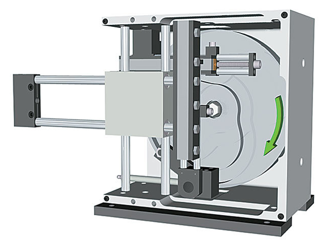

<h1 align="left">
  <br>
  
  <br>
  Industrial Automation Base
  <br>
</h1>

Cours AutB

Author: [Cédric Lenoir](mailto:cedric.lenoir@hevs.ch)

# S4 AutB Module 11
## Synchronisierte Bewegungen und Echtzeit-Ethernet

### Warum Motion Control und Echtzeit-Ethernet verknüpfen?
Denn wie wir weiter unten sehen werden, sind die Zeitbeschränkungen bei der Bewegungssteuerung kritischer als bei anderen Prozessarten.

Im Chemiebereich sind die Zykluszeiten von Steuerungssystemen um ein Vielfaches langsamer als in der Bewegungssteuerung. Wir reden hier von Sekunden.

<div align="center">
    <a href="https://iebmedia.com/technology/industrial-ethernet/ethernet-apl-digitization-impacting-process-industries/">
        
    </a>
    <p><em>Ethernet-APL digitization impacting process industries, Source: iebmedia.com</em></p>
</div>

Dieses Bild aus der Quelle Analog Devie veranschaulicht das Thema gut:

<div align="center">
    <a href="https://www.analog.com/en/resources/analog-dialogue/articles/looking-inside-real-time-ethernet.html">
        
    </a>
    <p><em>Real-time communications in automation, Source: www.analog.com</em></p>
</div>

> Als Faustregel gilt, dass zum Arbeiten mit Regelungen, beispielsweise vom Typ PID, ein Faktor von **10** zwischen der Verarbeitungsgeschwindigkeit und der Prozessgeschwindigkeit ausreicht. Der Grenzwert für den zentralen Teil **Fabrikautomatisierung** sei 100 [ms].

### Verlauf der Synchronisierung

<div align="center">
    
    <p><em>Eine alte synchronisierte Maschine, Source: Wiki</em></p>
</div>

Zur Erinnerung: Aus Sicherheitsgründen gilt gemäß der Maschinenrichtlinie EG 2006/42:

> Baugruppe, die mit einem anderen Antriebssystem als unmittelbar angewandter menschlicher oder tierischer Kraft ausgestattet ist oder ausgestattet werden soll, bestehend aus miteinander verbundenen Teilen oder Organen, von denen mindestens eines beweglich ist und die für eine bestimmte Anwendung fest miteinander verbunden sind.

Wir haben es mit einer Maschine zu tun.

Derzeit werden auf vielen Maschinen noch mechanische Kurvenscheiben eingesetzt. Sie sind wahrscheinlich effizienter als ihre elektrischen Pendants, aber nur, wenn sie die Flugbahn nicht ändern müssen.

<div align="center">
    <a href="https://www.assemblymag.com/">
        
    </a>
    <p><em>Pick and Place sur base mécanique, Source: Assembly mag</em></p>
</div>

Wenn wir die Pick-and-Place-Trajektorie ändern müssen, müssen wir beispielsweise auf ein elektrisches Modell umsteigen.

<div align="center">
    <a href="https://www.linmot.com/">
        
    </a>
    <p><em>3-Achsen-Y-ZC-Pick-and-Place auf elektrischer Basis, Source: Linmot</em></p>
</div>

Es ist möglich, ein elektrisches Achsensystem ohne Synchronisierung zu verwenden, jedoch unter der Bedingung, dass nur diskrete Bewegungen vom Typ **MC_MoveAbsolute** unabhängig für jede Achse verwendet werden.

Wenn wir beispielsweise für das obige Bild einen Kreisbogen in YZ beschreiben möchten, ist eine Achsensynchronisierung erforderlich.

Es gibt zwei Möglichkeiten, die Achsen zu synchronisieren.
- Durch die Steuerung einer Achse, beispielsweise Z, an die Position von Y.
- Indem jede Achse einer gemeinsamen Zeitskala unterworfen wird.

Bevor es Real-Time Ethernet gab, musste man zum Synchronisieren von Achsen ein Nockenprofil wie unten in den Antrieb laden. Die verschiedenen Antriebe waren mit einer gemeinsamen Uhr verbunden, die der t-, Zeit- oder Masterachse entsprach. Dann musste die SPS ein Signal oder einen Trigger senden, um mit der Verfolgung des Nockenprofils zu beginnen. Dadurch wurde die Verwaltung der Systeme schnell sehr kompliziert.

<div align="center">
    <a href="https://docs.automation.boschrexroth.com/doc/515053568/electronic-cam-disk-fleprofile/latest/en/">
        
    </a>
    <p><em>Configuring and creating the FlexProfile, Source: Bosch Rexroth</em></p>
</div>

Auch bei Bearbeitungsmaschinen handelte es sich vor der Einführung von Echtzeit-Ethernet häufig um geschlossene Systeme, bei denen alle Motorsteuerungen in einer einzigen Box integriert waren.

<div align="center">
    <a href="https://www.mikron.com/de/machining/systeme/hochproduktiv/vx">
        
    </a>
    <p><em>Mikron VX-12 rotary transfer systems, Source: Mikron</em></p>
</div>

Dans la machine ci-dessus d'origine Mikron, Agno, Tessin. 12 stations de 4 axes travaillent en parallèle. Sur une machine de transfert, les axes doivent souvent être reconfigurés pendant le fonctionnement de la machine, ce qui signifie concrètement que ce ne sont pas toujours les mêmes axes qui travaillent ensemble et que la cinématique des stations de travail est variable.

> On note sur l'image ci-dessus l'existance d'actuateurs, serrages hydrauliques, *hydraulic clamping* destinés à maintenir les outils dans les broches rotatives.

### Mouvement synchronisé et Ethernet temps réel

Unter synchronisierter Bewegung versteht man die präzise Koordination mehrerer Bewegungsachsen in industriellen Automatisierungssystemen. Dies ist für Anwendungen wie Roboter, CNC-Maschinen und Verpackungssysteme von entscheidender Bedeutung, bei denen es auf Timing und Präzision ankommt.

Echtzeit-Ethernet ermöglicht eine [deterministische Kommunikation](#deterministic-communication) zwischen Geräten und gewährleistet eine [geringe Latenz](#latency) und hohe Zuverlässigkeit. Um Echtzeitleistung zu erreichen und eine nahtlose Integration von Sensoren, Aktoren und Controllern in Automatisierungsnetzwerke zu ermöglichen, werden häufig Protokolle wie EtherCAT und PROFINET verwendet.

Durch die Kombination von synchronisierter Bewegung und Echtzeit-Ethernet erreichen moderne Systeme eine höhere Effizienz, Genauigkeit und Skalierbarkeit in industriellen Prozessen.

### Deterministische Kommunikation
Konzept des **Jitters**.
**Deterministische Kommunikation** bezieht sich auf eine Datenübertragungsmethode, bei der Kommunikationsverzögerungen **vorhersehbar und garantiert** sind. Dies bedeutet, dass zwischen Geräten in einem Netzwerk ausgetauschte Nachrichten immer innerhalb eines definierten Zeitrahmens ankommen, ohne unvorhersehbare Schwankungen, sogenanntes Jitter. *Die Übersetzung wird absichtlich weggelassen, da sie verwirrend sein kann.* Diese Eigenschaft ist in Systemen von entscheidender Bedeutung, in denen Synchronisierung und Präzision entscheidend sind, wie beispielsweise in der industriellen Automatisierung.

> Wir sprechen bei EtherCAT von einer Jitterzeit $ ≤ 1 µs$.

> Umgekehrt lässt sich bei einem Modbus TCP-System, das auch als Real-Time Ethernet klassifiziert wird, kein präziser Wert für den Jitter angeben. Dies hängt von der Netzwerklast ab.

#### Warum ist das wichtig?
Bei Anwendungen wie der Roboter- oder CNC-Maschinensteuerung müssen Befehle zum präzisen Zeitpunkt ausgeführt werden, um koordinierte Bewegungen sicherzustellen. Wenn Daten verspätet oder unvorhersehbar eintreffen, kann es zu Fehlern, Störungen oder Leistungseinbußen kommen.

#### Wie wird das gemacht?
Deterministische Kommunikation wird häufig mithilfe spezifischer Protokolle wie EtherCAT, PROFINET IRT oder TSN (Time-Sensitive Networking) implementiert. Diese Protokolle verwenden Mechanismen wie:

- Nachrichtenplanung: Nachrichten werden nach einem strengen Zeitplan gesendet.
- Priorisierung: Kritische Daten werden vorrangig übertragen.
- Synchronisierte Uhren: Alle Geräte im Netzwerk nutzen eine gemeinsame Uhr, um ihre Aktionen zu koordinieren.

#### Konkretes Beispiel
Wenn Sie einen Zylinder bearbeiten möchten, muss die Maschine einen möglichst perfekten Kreis erzeugen. Die Positionen der Achsen auf der XY-Ebene werden mit einer festen Rate an zwei verschiedene Motoren übertragen. Jeder noch so kleine Zeitunterschied zwischen den beiden Achsen wird automatisch im letzten Teil berücksichtigt.

<div align="center">
    <a href="https://www.synova.ch/products/all-synova-systems/item/98-s-305.html">
        
    </a>
    <p><em>5-Achsen-Laserbearbeitungsmaschine mit Präzision im Mikrometerbereich, Source: Synova</em></p>
</div>

Es ist auch zu beachten, dass die Motor-Encoder Informationen auf Achsenebene messen. Oftmals ist es dann notwendig, diese Angaben auf der Ebene des Schlussteils zu korrigieren. Dies ermöglicht beispielsweise ein Zwei-Koordinaten-Inkrementalmesssystem. Nachfolgend sehen Sie ein originales Heindenhain-Messsystem.

<div align="center">
    <a href="https://www.heidenhain.ch/fr/produits/appareils-de-test-et-de-controle/kgm-200">
        
    </a>
    <p><em>Messsysteme zur statischen und dynamischen Überwachung des Bahnverhaltens von CNC-Werkzeugmaschinen, Source: Heidenhain</em></p>
</div>

Die Inversionsspitzen bei Quadrantenübergängen sind sichtbar, ebenso wie der Unterschied zwischen im Uhrzeigersinn und gegen den Uhrzeigersinn.

<div align="center">
    <a href="https://www.heidenhain.ch/fr/produits/appareils-de-test-et-de-controle/kgm-200">
        
    </a>
    <p><em>Standardized representation of a circular interpolation test with a KGM:</em></p>
</div>

### Latenz
Konzept der **Latenz**.
Der Ausdruck „Garantiert geringe Latenz“ bedeutet, dass das System so konzipiert ist, dass die Verzögerung zwischen dem Senden von Daten oder Befehlen und dem Empfangen bzw. Ausführen dieser Daten bzw. Befehle minimiert wird. Mit anderen Worten: Informationen bewegen sich schnell über das Netzwerk, was in Umgebungen, in denen jede Millisekunde zählt, wie beispielsweise in der industriellen Automatisierung, von entscheidender Bedeutung ist.

> Wir sprechen bei EtherCAT von einer Zykluszeit $ ≤ 100 µs$.

#### Warum ist das wichtig?
In Systemen wie Industrierobotern oder CNC-Maschinen müssen Entscheidungen und Aktionen in Echtzeit getroffen werden. Eine hohe Latenz kann zu Verzögerungen bei der Befehlsausführung führen, was zu Folgendem führen kann:

- Ein Verlust an Präzision, zum Beispiel desynchronisierte Bewegungen.
- Fehler in kritischen Prozessen.
- Eine Verringerung der Gesamtsystemleistung. Jede Millisekunde, die bei der Informationsübertragung verloren geht, verlangsamt den Prozess.
- Bei gleicher Zykluszeit muss jeder Zeitverlust bei der Informationsübertragung durch eine höhere Geschwindigkeit der bewegten Elemente ausgeglichen werden, was insbesondere bei sehr dynamischen Systemen eine Energieverschwendung bedeutet.

#### Wie wird das erreicht?
Um eine geringe Latenz zu gewährleisten, werden spezielle Technologien und Protokolle verwendet, wie zum Beispiel:

- Echtzeit-Ethernet: Optimiert die Datenübertragung durch Reduzierung von Verzögerungen.
- Nachrichtenpriorisierung: Kritische Daten werden vor weniger wichtigen Daten übertragen.

#### Konkretes Beispiel
Beim Erkennen von Teilen auf einem Förderband wird die Geschwindigkeit des Förderbands durch die Verzögerung der Signalübertragung begrenzt.

<div align="center">
    <a href="https://montech.com">
        
    </a>
    <p><em>Montech conveyor, Source: Montech</em></p>
</div>

Bei der Regulierung ist die Qualität des Systems von der Übertragungsgeschwindigkeit abhängig; Im Allgemeinen **reagiert jedes Regulierungssystem allergisch auf Verzögerungen**.

---

# Begriffe der Flugbahn
## Elementarer Ausdruck einer Trajektorie
Um das Konzept der Flugbahn vollständig zu verstehen, muss man sich vor Augen halten, dass die Synchronisierung verschiedener mechanischer Elemente vor der Einführung von Echtzeit-Ethernet eine schwierige Aufgabe war.

Entweder erfolgte die Synchronisierung mechanisch, beispielsweise über eine Nockenwelle.

<div align="center">
    
    <figcaption>Mechanical Cam System, Image from www.motioncontroltips.com </figcaption>
</div>

Entweder wurden die Bewegungsprofile vorab auf Achsensteuerungen geladen, die dann mit einer Art virtuellem Encoder synchronisiert wurden, der die Zeitskala darstellte.

<div align="center">
    
    <figcaption>Eletronic Cam System, Image from www.researchgate.net </figcaption>
</div>

Letztendlich wurden alle Achsensteuerungen auf einem einzigen Modul zusammengefasst, was die Modularität beeinträchtigte.

Eine Trajektorie für einen Achsenbefehl muss letztendlich als einfache Liste von Punkten betrachtet werden.


- $\ P_1 , P_2, P_3 ... P_N$

```iecst
  reMyTrajectory  : ARRAY[1..N] OF REAL;
```

> In der Praxis könnten wir die Punkte entweder im Voraus definieren oder jeden Punkt während jedes Automatenzyklus berechnen.

Wenn wir das Beispiel des Polynoms nehmen, ist dieser Funktionstyp auf Additionen und Multiplikationen beschränkt. Es handelt sich um eine einfache und schnell zu berechnende Funktion für einen Prozessor, selbst bei einer reduzierten Zykluszeit in der Größenordnung einer Millisekunde.

## Flugbahnauflösung
Die zeitliche Auflösung der Trajektorie wird durch die Leistung des Echtzeit-Ethernet-Busses begrenzt. Mit Ausnahme seltener Fälle, wie Profinet IO oder Modbus/TCP, die nicht für die Bewegungssteuerung konzipiert sind, werden Echtzeitbusse für diesen Zweck entwickelt und die Genauigkeit jedes **Zyklus** und **Jitter** ist geringer als:

$$\ jitter < 1[\mu s]$$

$$\ cycle \: time \: \delta t  \approx 1 [ms]$$

> Während die meisten Achsenbefehle unter einer Millisekunde liegen können, ist dieser Wert oft ausreichend. Die Achsen der Automatisierungszellen im HEVS-Labor sind auf $\ 2[ms] $ begrenzt. *Diese Einschränkung ist nicht immer technischer Natur, sondern kann auch dem Wunsch des Anbieters geschuldet sein, die schnellsten Raten für High-End-Systeme zu reservieren.*

> Diese Trittfrequenz ist in Relation zum Frequenzgang der Mechanik zu setzen, die das System physikalisch begrenzt. Die Zykluszeit der Echtzeitbusse aktueller Systeme ist ausreichend kurz und es gibt keinen Grund, in den nächsten Jahren wesentliche Änderungen vorzunehmen.

## Einschränkungen
Die Liste der mit der Entschließung verknüpften Punkte bringt mehrere Einschränkungen mit sich-

### Fortsetzungsfehler
Beim Einsatz der Achse beispielsweise in einer Werkzeugmaschine stellt die Achssteuerung oft einen Schleppfehlerparameter als kritische Grenze bereit. Im Englischen gibt es dafür die Begriffe **Lag Error** oder **Following Distance**.
Der Schleppfehler ist die Differenz zwischen der **befohlenen Position** und der **gemessenen Position**. Ist diese Differenz zu groß, generiert die Achsensteuerung einen Fehler und stoppt die Achse schnellstmöglich.

> Problem für den Ingenieur: **Der Positionsunterschied zwischen zwei Punkten auf der Flugbahn ist begrenzt**.

### Geschwindigkeitsbegrenzung
$\ v = dp/dt$ Die Geschwindigkeit der Achse ist begrenzt. Es gibt verschiedene Arten von Grenzwerten, hier müssen wir die Einschränkung aufgrund der gewünschten Genauigkeit hinzufügen. Wenn wir die Auflösung verbessern möchten, verwenden wir die vorherige Formel in der Form $\ dp = v * dt$ und begrenzen die Geschwindigkeit.

### Drehmoment-/Kraftgrenze
$\ F = dv/dt$ oder $dp / {dt}^2 $ Das Profil wird durch das maximal zulässige Drehmoment oder die maximal zulässige Kraft der Maschine, Achse oder des Motors eingeschränkt.

## Flugbahntyp
Es gibt verschiedene Arten von Flugbahnen. In diesem Modul stellen wir eine Trajektorie vom Polynomtyp vor, da ihre Form gut zu dem passt, was wir in einer SPS einfach und schnell berechnen können.

$\ q = q(t)$, $t \in [t_0, t_1]$

$\ q(t) = a_0 + a_1t + a_2t^2+...+a_nt^n$

Es gibt eine ganze Menge Literatur zu Trajektorien und insbesondere zu polynomischen Trajektorien. Dies geht über den Rahmen dieses Moduls hinaus, dessen Zweck die Verwendung dieser Flugbahnen ist. Uns erscheint es aber wichtig, einmal zu zeigen, wie es möglich ist, aus einem leeren Blatt eine brauchbare Trajektorie zu ermitteln.

## Trajektorie nach einem Polynom 5. Ordnung

$$\ P = a_5 t^5 + a_4 t^4 + a_3 t^3 + a_2 t^2 + a_1 t + a_0$$

<div align="center">
    
    <figcaption>5th order polynomial cam for position </figcaption>
</div>

Der Hauptgrund für die Verwendung einer Trajektorie 5. Ordnung ist:

> Auch wenn wir eine Trajektorie in der Position der Ordnung 5 zweimal ableiten, haben wir immer noch die Möglichkeit, mit der Trajektorie der Beschleunigung am Anfang und am Ende der Bewegung durch den Nullpunkt zu gehen.

$$\ P’ = 5 a_5 t^4 + 4 a_4 t^3 + 3 a_3 t^2 + 2 a_2 t + a_1$$

<div align="center">
    
    <figcaption>5th order polynomial cam for velocity </figcaption>
</div>

$$\ P’’(t) = 20 a_5 t^3 + 12 a_4 t^2 + 6 a_3 t + 2 a_2$$

<div align="center">
    
    <figcaption>5th order polynomial cam for acceleration </figcaption>
</div>

Wenn wir schließlich erneut driften, werden wir feststellen, dass es nicht mehr möglich ist, durch Null zu gehen. Es kommt also beim Start immer noch zu einem leichten Ruckeln, aber es ist kontrolliert. Wenn die Beschleunigungskurve hingegen nicht durch Null geht, wird der Ruck nicht kontrolliert. Dies hat unter anderem zwei Nachteile:

- Vibrationsprobleme, die letztendlich die Genauigkeit des Systems beeinträchtigen.
- Mechanische Einschränkungen, die die Haltbarkeit des Systems beeinträchtigen können.


<div align="center">
    
    <figcaption>5th order polynomial cam for jerk </figcaption>
</div>

> Es lässt sich zeigen, dass das Polynom nicht die beste Lösung ist, wenn wir nach der Bewegung suchen, die den geringsten Energiebedarf erfordert. Die Erfahrung zeigt jedoch, dass das Polynom 5. Ordnung einen guten Kompromiss zwischen geringer mechanischer Anregung und Energieeffizienz darstellt.

## Operationen auf Trajektorien
Es ist möglich, verschiedene Arten von Operationen an Flugbahnen durchzuführen. Es gibt zwei Arten von Dingen, die uns interessieren.

### Geometrische Transformation zur Skalierung auf der Y-Achse.
Konkret bedeutet dies, wenn wir das Beispiel des Polynoms der Ordnung 5 nehmen, dass es zum Ändern der Länge der Verschiebung eines Faktors, Koeffizient **c**, ausreicht, jeden Parameter a_n um denselben Koeffizienten **c** zu ändern.

$$\ P\times c = (c\times a_5) t^5 + (c\times a_4) t^4 + (c\times a_3) t^3 + (c\times a_2) t^2 + (c\times a_1) t + (c\times a_0) $$

> Diese Funktion vereinfacht die Berechnung einer polynomischen Trajektorie weiter. Ein Trajektorientyp wie der fünfter Ordnung muss nur einmal berechnet und dann nur noch skaliert werden.

### Zeitskalierung.
mit anderen Worten, wenn wir bedenken:

$\ q = q(t)$ wir könnten zu der Überlegung veranlasst werden, $t = \sigma(t')$

> Beispiel: Wenn $\sigma(t') = 2t'$, dann entspricht dies einer doppelt so schnellen Ausführung der Bewegung. Umgekehrt wird die Bewegung doppelt so langsam ausgeführt, wenn $\sigma(t') = 0,5t'$.

Die Zeitskalierung ist nicht nur ein statischer Parameter, der die Dauer der Bewegung bestimmt. Dies kann auch ein Parameter sein, mit dem Sie die Geschwindigkeit und/oder Beschleunigung der Achse anpassen können.

## Um tiefer in das Thema einzutauchen
Im Fall des Polynoms 5. Ordnung haben wir gesehen, dass wir eine Trajektorie verwenden können, um die Ableitungen der Position zu steuern. Es ist auch möglich, Trajektorien zu verwenden, um:
- **Vibrationen kontrollieren**, entweder mit Filtern oder mit Splines.
- Bewältigen Sie eine Flugbahn mit minimalem Energie- oder Zeitaufwand.

Dann wird es möglich sein, die Trajektorien zu verwenden, um die Synchronisierung mehrerer Achsen zu steuern, was in der **Robotik** oder **CNC-Computer-Numerical-Control** geschieht. Grundsätzlich gibt es aus Sicht der Achsensteuerung keine großen Unterschiede zwischen diesen beiden Bereichen.

Die mehrachsige Trajektorienführung geht über den Rahmen des Automatisierungsstudiums hinaus und ist aus mathematischer Sicht teilweise außerhalb der Reichweite des Bachelor-Studiums. Es gibt jedoch Bibliotheken (oft lizenziert), mit denen Sie mehrere Achsen verwalten können, ohne dass fortgeschrittene mathematische Kenntnisse erforderlich sind.

Im Rahmen des HEVS-Labors präsentieren wir eine Kinematik auf 3 kartesischen Achsen.

### Bibliographie zu Trajektorienplanung
Wenn es notwendig ist, sich ernsthaft mit Trajektorien zu befassen und dabei auf einem für einen Bachelor zugänglichen mathematischen Niveau zu bleiben, ist die beste Referenz, die ich anbieten kann, zweifellos die folgende: **Trajektorienplanung für automatische Maschinen und Roboter**. Autoren: Luigi Biagiotti, Claudio Melchiorri, 2008

---

# Real-Time Ethernet oder Real-Time Ethernet
## Was ist Echtzeit-Ethernet?

Echtzeit-Ethernet bezieht sich auf Ethernet-Kommunikationsprotokolle, die die strengen Synchronisierungs- und Determinismusanforderungen industrieller Automatisierungssysteme erfüllen. Im Gegensatz zu Standard-Ethernet, das auf Best-Effort-Basis arbeitet, gewährleistet Echtzeit-Ethernet eine vorhersehbare Kommunikation mit geringer Latenz und ist daher ideal für zeitkritische Anwendungen.

### Echtzeit-Ethernet
Anfang der 2000er Jahre kamen eine ganze Reihe konkurrierender Produkte auf den Markt, und das 2005 veröffentlichte **Handbuch zur industriellen Kommunikationstechnologie** sprach sogar vom **Krieg der industriellen Feldbusse**. Die Realität ist, und das ist das große Unglück der Welt der Automatisierung, dass sich die wichtigsten Akteure auf dem Markt trotz mehrerer Versuche nicht auf einen Standard einigen konnten.

#### IEC 61784
Es gibt zwar eine Reihe von Standards mit der Nummer 61784, aber leider gibt es ungefähr so ​​viele Variationen dieses Standards, wie es Arten von Real-Time-Ethernet-Feldbussen gibt.
Dies zeigt, dass Standard und Standardisierung keine Synonyme sind….

#### Auswahl Ihres Busses
Auf der Entwurfsebene liegt der Grund dafür, dass ich den Feldbus vor die SPS stelle, darin, dass der Automatisierungsingenieur seine Entwicklungsplattform manchmal nicht auf Grundlage der Leistungsfähigkeit der SPS auswählt, sondern auf Grundlage der für einen bestimmten Feldbus verfügbaren Ausrüstung. Dies ist der Grund, warum ich den Feldbus vor die SPS stelle.

Echtzeit-Ethernet ist vor allem ein Protokoll und eine Softwareschicht, die auf Standard-Ethernet-Hardware, RJ45-Port, aufgepfropft wird. Dies ist zwar nur teilweise richtig, es gibt jedoch Implementierungen, die das Arbeiten im Echtzeit-Ethernet auf Standard-PCs ermöglichen.

####	Leistung
Vereinfacht ausgedrückt kann die Leistungsfähigkeit des Feldbusses in „Ethernet Real-Time“ grundsätzlich als „ausreichend“ bezeichnet werden, solange die Menge der in Echtzeit übertragenen Daten im Rahmen bleibt. Wir sprechen hier von einigen Dutzend Bytes pro Zyklus und pro „Slave“.

Die bandbreitenhungrigsten Geräte sind im Allgemeinen die Motorsteuerungen. Die Anzahl der analogen Eingänge kann von Bedeutung sein.

Generell können wir davon ausgehen, dass bei einer Zykluszeit im Millisekundenbereich und einigen Dutzend Motoren oder anderen Knoten im Netzwerk das Auftreten einer Einschränkung unwahrscheinlich ist. Die SPS stößt wahrscheinlich schon vor dem Bus an ihre Grenzen.

#### Kamera
Es gibt ein Element, das in modernen Automatisierungssystemen immer häufiger vorkommt: Kameras. Die großen Datenmengen, die sie erzeugen, könnten einen Bus potenziell über seine Grenzen hinaus belasten. In solchen Szenarien müssen wir beginnen, die Buslast genauer unter die Lupe zu nehmen.

#### Sicherheit

Die meisten aktuellen Echtzeitbusse sind mittlerweile für die Verdrahtung von Sicherheitselementen geeignet. Es ist das Protokoll, das zwischen zwei Punkten gesichert ist.

#### Sekundäre Netzwerke, Feldbus
 
 <div align="center">
    
    <figcaption>Main and secondary Field Network </figcaption>
</div>

Während Real-Time Internet (über Powerlink in Blau) das Rückgrat des Systems bildet, wird es selten direkt bis zum Sensor verwendet.

In der Praxis ist der Echtzeit-Ethernet-Bus Komponenten vorbehalten, die einen hohen Datendurchsatz erfordern.
- Die Motoren können mit einem Positionssignal, das mit 400 [µs] abgetastet wird, in Position gebracht werden.
- Die Motoren können in ihrer Position mit einem Encoder synchronisiert werden, der ebenfalls an den Echtzeit-Ethernet-Bus angeschlossen ist.
- Es gibt Kameras, die direkt an den Real-Time-Ethernet-Bus angeschlossen werden können. **Achtung, wir können während der Buszykluszeit keine Bilder übertragen!**
- Um auf Komponenten zuzugreifen, die weniger Daten oder eine niedrigere Abtastfrequenz benötigen, wird häufig ein sogenannter Feldbus verwendet, auch wenn Ethernet Real-Time laut Literatur als Feldbus betrachtet wird.
- Die Daten werden in der Regel gemultiplext und über ein Gateway an den Echtzeit-Ethernet-Bus angeschlossen. Wie bei Echtzeit-Ethernet-Bussen gibt es auf dieser Ebene kaum Standardisierung.

### Konkret?
Anders als beim Standard-Ethernet, wo die Zeit zwischen den Frames variieren kann, werden Frames beim Echtzeit-Ethernet, wie unten beschrieben, in Frames aufgeteilt, die mit einer festen Zykluszeit gesendet und empfangen werden. Jitter so gering wie möglich, sehr kurze Latenzzeit, hier $\ 2[ms]$

Gemäß Original-Siemens-Dokumentation für Profinet IRT.

<div align="center">
    <a href="https://support.industry.siemens.com">
        
    </a>
    <p><em>Profinet IRT, Isochronous Real.time</em></p>
</div>

Vergleicht man Real-Time Ethernet mit einem herkömmlichen Feldbus, liegt sein Vorteil darin, dass es Raum für die Übertragung herkömmlicher Ethernet-Informationen lässt.

### Einschränkungen
- Die Zykluszeit wird beim Netzwerkstart konfiguriert und kann nicht online geändert werden, ohne das Netzwerk vorübergehend zu unterbrechen.
- **Nur eine Zykluszeit ist möglich**. Dies bedeutet, dass im selben Netzwerk keine Kommunikation mit $\ 2 [ms]$ und keine Kommunikation mit $\ 200 [ms]$ stattfinden kann.
- Es muss mindestens einen Master geben, der die Slaves synchronisiert.
- In *echter* Echtzeit ist die Netzwerktopologie *oft* auf eine serielle Verbindung aller Slaves beschränkt, sofern keine zusätzliche Hardware installiert ist.
- Das Einrichten eines Echtzeit-Ethernet-Netzwerks kann relativ kompliziert sein, **es ist kein Plug-and-Play**.

<div align="center">
    <a href="https://docs.automation.boschrexroth.com">
        
    </a>
    <p><em>Topologie ähnlich dem HEVS-Labor, links, Source: Rexroth</em></p>
</div>

- Hinweis: nur ein Master auf der rechten Seite. Ganz links, nur für EtherCAT: **Wenn Sie von einem klassischen Ethernet aus eine Verbindung zu einem EtherCAT-Port herstellen möchten, müssen Sie über ein Gateway gehen.**

### Anwendungsfälle für Echtzeit-Ethernet
**Industrielle Automatisierung**
- Koordination der Bewegungssteuerung in Robotern und CNC-Maschinen.
- Synchronisierung von Fördersystemen in Fertigungslinien.

**Prozesskontrolle**
- Echtzeitüberwachung und -steuerung von Sensoren und Aktoren.
- Gewährleistung einer präzisen Synchronisierung bei chemischen oder pharmazeutischen Prozessen.

**Energiesysteme**
- Management von intelligenten Netzen und erneuerbaren Energiesystemen.
- Echtzeitüberwachung von Stromverteilungsnetzen.

**Automobil und Transport**
- Implementierung fortschrittlicher Fahrerassistenzsysteme, ADAS.
- Echtzeitkommunikation in autonomen Fahrzeugen.

> Ich glaube, dass ich nicht weit von der Wahrheit entfernt bin, wenn ich sage, dass sich auf Schweizer Ebene oder sogar in der französischsprachigen Schweiz Profinet, EtherCAT und Modbus-TCP den Markt unter den oben genannten Arten von Echtzeit-Ethernet teilen.
> > Nur die IRT-Version (**Isochronous Real-Time**) von Profinet und EtherCAT kann Motoren synchronisieren. EtherCAT ist in der Schweiz zweifellos führend im Bereich der Motorsteuerung. Da **EtherCAT** auch in HEVS-Laboren und vielen Projekten verwendet wird, haben wir uns entschieden, nur dieses Protokoll ausführlicher vorzustellen, **ohne dass dies eine qualitative oder technologische Wahl impliziert**.
> > Im HEVS-Labor verwenden wir außerdem die Standardversion von Profinet, um eine Codesys-basierte SPS und eine Siemens-basierte SPS zu verbinden. Diese Version von Profinet erlaubt keine Synchronisierung der Achsen.
> > Im Labor ermöglicht ein Modbus TCP-Protokoll das Auslesen und Konfigurieren von IO-Link-Sensoren über ein Gateway. Konkret **nutzt Modbus hier die Nicht-Echtzeit-Frames von Profinet**.

<div align="center">
    <a href="https://www.baumer.com/ch/en/product-overview/cable-connectivity/io-link-master/io-link-master-profinet/io-link-master-profinet-8-port-ip67/p/42518">
        
    </a>
    <p><em>Baumer IO-Link Master PROFINET, 8-Port, IP67</em></p>
</div>

### Vorteile von Real-Time Ethernet (EtherCAT-basiert)
**Hohe Leistung**
- EtherCAT erreicht Zykluszeiten im Mikrosekundenbereich und ermöglicht so die präzise Steuerung komplexer Systeme.
- In der Praxis arbeiten die meisten mit Motorsteuerungen ausgestatteten Maschinen mit einer Zykluszeit von einigen hundert µs einwandfrei, wobei die Zykluszeit zwischen 1 und 4 ms liegt.


**Skalierbarkeit**
- Unterstützt eine große Anzahl von Geräten ohne Leistungseinbußen.

**Deterministische Kommunikation**
- Garantiert die Datenübertragung innerhalb eines definierten Zeitrahmens, was für eine synchronisierte Bewegung unerlässlich ist.

**Rentabilität**
- Verwendet Standard-Ethernet-Hardware und reduziert so die Implementierungskosten.

**Flexibilität**
- Unterstützt verschiedene Topologien (z. B. Linie, Stern, Baum) und lässt sich nahtlos in bestehende Netzwerke integrieren.

Durch die Nutzung von EtherCAT bietet Echtzeit-Ethernet die Grundlage für die moderne industrielle Automatisierung und gewährleistet Effizienz, Genauigkeit und Zuverlässigkeit in anspruchsvollen Umgebungen.

Obwohl es eine große Vielfalt an Real-Time Ethernet gibt, definiert durch den IEC61158-Standard

Zu den verschiedenen im IEC61158-Standard definierten Protokollen gehören:

- **PROFINET, RT, IRT**: Wird hauptsächlich in der industriellen Automatisierung verwendet, hauptsächlich von Siemens.
- **EtherCAT**: Entwickelt für Anwendungen, die strikte Echtzeit erfordern, hauptsächlich Bekchoff.
- **Modbus-TCP**: Eine von Schneider Electric entwickelte Erweiterung des Modbus-Protokolls für Ethernet, **nicht verwendbar in Motion Control**.
- **POWERLINK**: Ein offenes Echtzeit-Ethernet-Protokoll, fast ausschließlich von B&R, jetzt im Besitz von ABB.
- **CC-Link IE**: Wird für Hochleistungs-Industrienetzwerke bei Mitsubishi auf dem japanischen Markt verwendet.
- **SERCOS III**: Spezialisiert auf Bewegungssteuerung, Basis: Bosch Rexroth. Von Bosch Rexroth zugunsten von EtherCAT aufgegeben.
- **EtherNet/IP**: Basierend auf dem CIP-Protokoll für die industrielle Automatisierung, Allen Bradley, insbesondere auf dem amerikanischen Markt.

Diese Protokolle sind auf unterschiedliche Leistungs-, Latenz- und Kompatibilitätsanforderungen zugeschnitten.

Im spezifischen Bereich der Bewegungssteuerung kann EtherCAT auf dem Schweizer Markt als am weitesten verbreitet angesehen werden.

Um einen Blick auf einige Schweizer Anbieter von Antriebslösungen für die Bewegungssteuerung zu werfen, finden Sie sie auf EtherCAT:

-   Etel
-   Triamec
-   Maxon
-   Linmot
-   Jenny Science

---

# EtherCAT

## So beenden Sie die Bewegungssteuerung

Um ein Projekt zu nennen, bei dem es zwar nicht um Motion Control geht, das aber ohne Real-Time Ethernet in dieser Form wohl nicht möglich gewesen wäre, hier ein Spektrumanalysator.

<div align="center">
    
    <figcaption>Sound analysis using EtherCAT </figcaption>
</div>

In dieser Anwendung verwenden wir Mikrofone mit IEPE-Technologie

### Was ist eine IEPE-Schnittstelle?

IEPE (Integrierte Piezoelektrische Elektronik) ist eine Technologie, die hauptsächlich für piezoelektrische Sensoren wie Mikrofone, Beschleunigungsmesser oder Kraftsensoren verwendet wird. Diese Sensoren werden häufig in dynamischen Messanwendungen wie Schwingungsanalyse, Akustik oder Materialprüfung eingesetzt.

Die Hauptmerkmale einer IEPE-Schnittstelle sind:

- **Integrierte Stromversorgung**: IEPE-Sensoren benötigen eine Stromversorgung, die normalerweise über dasselbe Koaxialkabel erfolgt, das auch das Signal überträgt.
- **Einfache Verkabelung**: Dank der integrierten Stromversorgung wird zum Anschluss des Sensors nur ein Kabel benötigt, was die Installation vereinfacht.
- **Kompatibilität**: IEPE-Sensoren sind weitgehend mit modernen Datenerfassungsgeräten kompatibel.
- **Anwendungen**: Wird in Industrie-, Forschungs- oder Laborumgebungen für genaue und zuverlässige Messungen verwendet.

Diese Technologie eignet sich besonders für Umgebungen, in denen hochpräzise dynamische Messungen erforderlich sind, wie beispielsweise im oben erwähnten Beispiel des Spektrumanalysators.

<div align="center">
    <a href="https://www.kistler.com">
        
    </a>
    <p><em>Kistler accelerometer Z22198, Source: Kistler</em></p>
</div>

Hauptmerkmale / Vorteile

- Geringe Masse von 0,9 Gramm und Miniaturgröße eines 6 mm großen Würfels.
- Messbereich von 100g, 250g, 500g, 1000g
- Extrem große Bandbreite von 0,3 bis 10900 Hz (±5%)
- Minimale Verschiebung der thermischen Empfindlichkeit dank der PiezoStar-Kristalltechnologie von Kistler
- Geräuscharm, auch bei starken elektromagnetischen Störungen, dank Masseisolierung.
- Großer Temperaturbereich: -55 bis +125 °C (-67 bis +257 °F)
- Swiss Made – maximale Qualität und Leistung

> Dieser Produkttyp ist für die Schwingungsanalyse relativ beliebt und wird in Verbindung mit **Machine Learning**-Software für vorbeugende Wartungsanwendungen in Industriesystemen verwendet.

## EtherCAT im Detail

Vieles von dem Folgenden stammt direkt von der [EtherCAT-Präsentationsseite](https://www.ethercat.org.cn/en/technology.html).

**<span style="color:red;">Der restliche EtherCAT-Absatz dient allgemeinen Informationszwecken. Zum Lesen, aber nicht zum Auswendiglernen.</span>**

### Funktionsprinzip

Das EtherCAT-Mastergerät sendet ein Telegramm, das jeden Knoten durchläuft. Jedes EtherCAT-Subgerät liest die an es adressierten Daten „on the fly“ und fügt seine Daten während der Übertragung in den Frame ein. Der Frame wird nur durch Hardware-Ausbreitungsverzögerungen verzögert. Der letzte Knoten in einem Segment (oder einer Drop-Line) erkennt einen offenen Port und sendet die Nachricht mithilfe der Vollduplex-Funktion der Ethernet-Technologie an das Hauptgerät zurück.

Der maximale effektive Telegrammdurchsatz liegt bei über 90 % und dank der Vollduplex-Funktionalität beträgt der theoretische effektive Durchsatz sogar mehr als 100 Mbit/s (> 90 % von zweimal 100 Mbit/s).

Das EtherCAT-Primärgerät ist der einzige Knoten in einem Segment, der aktiv einen EtherCAT-Frame senden darf. alle anderen Knoten leiten Frames einfach weiter. Dieses Konzept vermeidet unvorhersehbare Verzögerungen und garantiert Echtzeitfunktionalität.

Der Master verwendet einen Standard-Ethernet-Media-Access-Controller (MAC) ohne zusätzlichen Kommunikationsprozessor. Dadurch kann ein Master auf jeder Hardwareplattform mit einem verfügbaren Ethernet-Anschluss implementiert werden, unabhängig vom verwendeten Betriebssystem oder der Echtzeit-Anwendungssoftware. EtherCAT-Subgeräte verwenden einen EtherCAT-Subgeräte-Controller (ESC), um Frames im laufenden Betrieb und vollständig hardwarebasiert zu verarbeiten, wodurch die Netzwerkleistung vorhersehbar und unabhängig von der Implementierung jedes Subgeräts wird.

### Das EtherCAT-Protokoll

EtherCAT bettet seine Nutzlast in einen Standard-Ethernet-Frame ein. Der Frame wird durch die Kennung (0x88A4) im EtherType-Feld identifiziert. Da das EtherCAT-Protokoll für kurze zyklische Prozessdaten optimiert ist, kann auf die Verwendung von Protokollstapeln wie TCP/IP oder UDP/IP verzichtet werden.

<div align="center">
    <a href="https://www.ethercat.org">
        
    </a>
    <p><em>EtherCAT in a standard Ethernet frame according to IEEE 802-3, Source : EtherCAT</em></p>
</div>

Um die Ethernet-Kommunikation zwischen Knoten sicherzustellen, können TCP/IP-Verbindungen optional durch einen Mailbox-Kanal getunnelt werden, ohne die Echtzeit-Datenübertragung zu beeinträchtigen.

Beim Start konfiguriert und ordnet der Master den SubDevices Prozessdaten zu. Mit jedem SubDevice können unterschiedliche Datenmengen ausgetauscht werden, von einem Bit über wenige Bytes bis hin zu mehreren Kilobytes.

Der EtherCAT-Frame enthält ein oder mehrere Datagramme. Der Datagramm-Header gibt die Art des Zugriffs an, den der Master durchführen möchte:

Lesen, Schreiben, Lesen-Schreiben
Zugriff auf ein bestimmtes SubDevice durch direkte Adressierung oder Zugriff auf mehrere SubDevices durch logische Adressierung (implizite Adressierung).

Für den zyklischen Austausch von Prozessdaten wird die logische Adressierung verwendet. Jedes Datagramm adressiert einen bestimmten Teil des Prozessabbilds im EtherCAT-Segment, wofür 4 GB Adressraum zur Verfügung stehen. Beim Start des Netzwerks werden jedem SubDevice in diesem globalen Adressraum eine oder mehrere Adressen zugewiesen. Wenn mehreren Untergeräten Adressen im selben Bereich zugewiesen werden, können sie alle mit einem einzigen Datagramm angesprochen werden. Da Datagramme alle Datenzugriffsinformationen enthalten, kann der Master entscheiden, wann und auf welche Daten zugegriffen wird. Beispielsweise kann der Master kurze Zykluszeiten zum Aktualisieren der Daten auf den Laufwerken verwenden, während er eine längere Zykluszeit zum Abtasten der E/A nutzt. eine feste Prozessdatenstruktur ist nicht erforderlich. Dies entlastet den Master auch im Vergleich zu herkömmlichen Feldbussystemen, bei denen die Daten von jedem Knoten einzeln gelesen, vom Prozesscontroller sortiert und in den Speicher kopiert werden mussten.

Bei EtherCAT muss der Master lediglich einen einzigen EtherCAT-Frame mit neuen Ausgabedaten füllen und diesen automatisch per Direct Memory Access, **DMA**, an den MAC-Controller senden. Wenn über den MAC-Controller ein Frame mit neuen Eingabedaten empfangen wird, kann der Master diesen per DMA in den Speicher des Computers zurückkopieren, ohne dass der Prozessor die Daten aktiv kopieren muss. Neben zyklischen Daten können auch andere Datagramme für die asynchrone oder ereignisgesteuerte Kommunikation verwendet werden.

<div align="center">
    <a href="https://www.ethercat.org">
        
    </a>
    <p><em>Inserting process data on the fly, Source : EtherCAT</em></p>
</div>

Neben der logischen Adressierung kann der Master ein SubDevice auch über seine Position im Netzwerk ansprechen. Diese Methode wird beim Netzwerkstart verwendet, um die Netzwerktopologie zu bestimmen und mit der geplanten Topologie zu vergleichen.

Nach der Überprüfung der Netzwerkkonfiguration kann der Master jedem Knoten eine konfigurierte Adresse zuweisen und über diese feste Adresse mit ihm kommunizieren. Dies ermöglicht den gezielten Zugriff auf Geräte auch bei Änderungen der Netzwerktopologie im laufenden Betrieb, beispielsweise bei Hot-Plug-Verbünden. Es gibt zwei Ansätze für die SubDevice-zu-SubDevice-Kommunikation. Ein SubDevice kann Daten direkt an ein anderes SubDevice senden, das weiter unten im Netzwerk angeschlossen ist. Da EtherCAT-Frames erst nachträglich verarbeitet werden können, ist diese Art der direkten Kommunikation abhängig von der Netzwerktopologie und eignet sich besonders für die SubDevice-zu-SubDevice-Kommunikation in einer konstanten Maschinenkonfiguration, *beispielsweise in Druck- oder Verpackungsmaschinen*. Im Gegensatz dazu läuft die frei konfigurierbare SubDevice-zu-SubDevice-Kommunikation über den Master und erfordert zwei Buszyklen, *nicht unbedingt zwei Steuerzyklen*.

### Flexible Topologie

Linie, Baum, Stern oder Daisy Chain: EtherCAT unterstützt nahezu alle Topologien. Es ermöglicht eine reine Bus- oder Linientopologie mit Hunderten von Knoten, ohne die Einschränkungen, die normalerweise mit kaskadierenden Switches oder Hubs verbunden sind.

Bei der Verkabelung des Systems ist die Kombination aus Linien und Stichleitungen vorteilhaft: Die zum Aufbau von Stichleitungen benötigten Ports sind in vielen I/O-Modulen direkt integriert, wodurch zusätzliche Switches oder aktive Infrastrukturkomponenten überflüssig werden. Auch die klassische Ethernet-Sterntopologie kann genutzt werden.

Modulare Maschinen oder Werkzeugwechsler erfordern im laufenden Betrieb das Zu- und Abschalten von Netzwerksegmenten oder einzelnen Knoten. EtherCAT-Sub-Device-Controller verfügen bereits über die Grundlagen dieser Hot-Plug-Funktionalität. Wird eine Nachbarstation entfernt, wird der Port automatisch geschlossen, so dass der Rest des Netzwerks ohne Störungen weiterarbeiten kann. Sehr kurze Erkennungszeiten (< 15 μs) gewährleisten einen reibungslosen Übergang.

EtherCAT bietet hinsichtlich der Kabeltypen große Flexibilität, sodass jedes Segment den für seine Anforderungen am besten geeigneten Kabeltyp verwenden kann. Ein kostengünstiges industrielles Ethernet-Kabel kann zwischen zwei Knoten verwendet werden, die bis zu 100 m voneinander entfernt sind und im 100BASE-TX-Modus betrieben werden. Darüber hinaus ermöglicht das EtherCAT P-Protokoll die Daten- und Stromübertragung über ein einziges Kabel. Mit dieser Option können Sie Geräte wie Sensoren an eine einzige Leitung anschließen. Auch Glasfasern wie 100BASE-FX können verwendet werden, beispielsweise bei einer Entfernung zwischen Knoten von mehr als 100 m. Für EtherCAT ist auch eine vollständige Palette an Ethernet-Kabeln verfügbar.

<div align="center">
    <a href="https://www.ethercat.org">
        
    </a>
    <p><em>Flexible topology – line tree or star, Source : EtherCAT</em></p>
</div>

Bis zu 65.535 Geräte können an ein EtherCAT-Segment angeschlossen werden, wodurch die Netzwerkerweiterung praktisch unbegrenzt ist. Dank der nahezu unbegrenzten Anzahl an Knoten können modulare Geräte, wie beispielsweise „aufgeteilte“ I/O-Stationen, so aufgebaut werden, dass jedes Modul einen separaten EtherCAT-Knoten darstellt. Der lokale Erweiterungsbus entfällt somit; Die hohe Performance von EtherCAT erreicht jedes Modul direkt und ohne Verzögerung, da es weder im Buskoppler noch in der Kopfstation ein Gateway mehr gibt.

### EtherCAT P: Kommunikation und Power in einem einzigen Kabel

EtherCAT P, *P = Power Supply*, ist eine Ergänzung zum zuvor beschriebenen EtherCAT-Protokoll. Es ermöglicht nicht nur die Übertragung von Kommunikationsdaten, sondern auch der Peripheriespannung über ein einziges standardmäßiges vieradriges Ethernet-Kabel.

EtherCAT und EtherCAT P sind protokolltechnisch identisch, da diese Ergänzung ausschließlich die physikalische Schicht betrifft. Bei Verwendung von EtherCAT P ist kein neuer EtherCAT-Sub-Device-Controller erforderlich. Man könnte sagen, dass EtherCAT P dieselben Kommunikationsvorteile wie EtherCAT bietet, aber zusätzlich Strom über das Kommunikationskabel bereitstellt, was für viele Anwendungen interessante Vorteile und Verbesserungen mit sich bringt.

<div align="center">
    <a href="https://www.ethercat.org">
        
    </a>
    <p><em>EtherCAT P: data and power via one cable, Source : EtherCAT</em></p>
</div>

Zwei galvanisch getrennte und einzeln schaltbare 24-V-Stromversorgungen versorgen die neuen EtherCAT-P-Geräte. Die US bedient das System und die Sensoren und die UP die Peripheriegeräte und Aktoren. Beide Spannungen, US und UP, sind direkt an die 100 Mbit/s EtherCAT-Kommunikationsleitung gekoppelt. Dank dieser Stromübertragung kann der Anwender mehrere EtherCAT-P-Geräte kaskadiert anschließen und benötigt somit nur ein einziges Kabel. Dies ermöglicht eine reduzierte, kompaktere und kostengünstigere Verkabelung, geringere Systemkosten und einen geringeren Platzbedarf für Geräte, Anlagen und Maschinen.

EtherCAT P ist besonders für eigenständige und oft leicht isolierte Teile einer Maschine interessant, da diese über ein einziges Drop-Kabel mit Daten und Strom versorgt werden können. Alle Sensortypen sind optimal für EtherCAT P geeignet: Ein einziger, kompakter M8-Steckverbinder ermöglicht die effiziente Integration dieser Feldgeräte in das Hochgeschwindigkeitsnetzwerk und verbindet sie mit der Versorgungsspannung. Durch die mechanische Kodierung des Steckverbinders werden mögliche Fehlerquellen beim Verbinden der Geräte vermieden.

EtherCAT P kann im selben Netzwerk wie die Standard-EtherCAT-Technologie verwendet werden. Geeignete Gleichrichter wandeln die gängige EtherCAT-Physik unter Beibehaltung der Ethernet-Datenkodierung in EtherCAT P um. Ebenso kann ein Gerät über EtherCAT P mit Strom versorgt werden, aber auch das EtherCAT-Protokoll übertragen.
Mehr erfahren...

### Verteilte Uhren für hochpräzise Synchronisierung

Bei Anwendungen mit räumlich verteilten Prozessen und gleichzeitigen Aktionen ist eine präzise Synchronisierung besonders wichtig. Dies gilt insbesondere für Anwendungen, bei denen mehrere Servoachsen koordinierte Bewegungen ausführen.

Im Gegensatz zur vollständig synchronen Kommunikation, deren Qualität direkt durch Kommunikationsfehler beeinträchtigt wird, weisen verteilte synchronisierte Uhren eine hohe Toleranz gegenüber Jitter im Kommunikationssystem auf. Aus diesem Grund basiert die EtherCAT-Lösung zur Knotensynchronisierung auf solchen verteilten Uhren, **DC**.

<div align="center">
    <a href="https://www.ethercat.org">
        
    </a>
    <p><em>Completely hardware-based synchronization with compensation for propagation delays, Source : EtherCAT</em></p>
</div>

Die Kalibrierung der Knotenuhren erfolgt vollständig hardwarebasiert. Die Uhrzeit des ersten DC-Subgerätes wird zyklisch an alle anderen Geräte im System verteilt. Dieser Mechanismus ermöglicht eine präzise Anpassung der Uhren der Untergeräte an diese Referenzuhr. Der resultierende **Jitter** im System ist deutlich geringer als 1 μs.

Da die von der Referenzuhr gesendete Zeit mit einer leichten Verzögerung bei den Untergeräten ankommt, muss diese Ausbreitungsverzögerung für jedes Untergerät gemessen und kompensiert werden, um die Synchronisierung und Gleichzeitigkeit sicherzustellen. Diese Verzögerung wird beim Netzwerkstart oder bei Bedarf kontinuierlich während des Betriebs gemessen und gewährleistet so eine Taktparallelität von deutlich unter 1 μs.

<div align="center">
    <a href="https://www.ethercat.org">
        
    </a>
    <p><em>Synchronicity and simultaneousness – scope view of two distributed devices with 300 nodes and 120 m cable length, Source : EtherCAT</em></p>
</div>

Wenn alle Knoten über dieselben Zeitinformationen verfügen, können sie ihre Ausgangssignale gleichzeitig festlegen und ihre Eingangssignale mit hoher Präzision mit einem Zeitstempel versehen. Bei Motion-Control-Anwendungen ist neben Synchronizität und Gleichzeitigkeit auch die Zyklusgenauigkeit wichtig. Bei diesen Anwendungen wird die Geschwindigkeit normalerweise aus der gemessenen Position abgeleitet. Daher ist es wichtig, dass die Positionsmessungen mit präziser Äquidistanz (also in exakten Zyklen) durchgeführt werden. Selbst sehr kleine Ungenauigkeiten im Zeitpunkt der Positionsmessung können zu größeren Ungenauigkeiten bei der berechneten Geschwindigkeit führen, insbesondere bei kurzen Zykluszeiten. Bei EtherCAT werden Positionsmessungen durch die präzise lokale Uhr und nicht durch den Bus ausgelöst, was die Genauigkeit erheblich verbessert.

Darüber hinaus entlastet die Verwendung verteilter Uhren den Master. Da Aktionen wie die Positionsmessung nicht durch den Frame-Empfang, sondern durch die lokale Uhr ausgelöst werden, hat der Master keine so strengen Anforderungen an das Senden von Frames. Dadurch kann der Master-Stack in Software auf Standard-Ethernet-Hardware implementiert werden. **Selbst ein Jitter von wenigen Mikrosekunden verringert die Genauigkeit verteilter Uhren nicht!** Da die Genauigkeit der Uhr nicht davon abhängt, wann sie eingestellt wird, spielt die absolute Übertragungszeit des Frames keine Rolle mehr. Das EtherCAT-Hauptgerät muss lediglich sicherstellen, dass das EtherCAT-Telegramm früh genug gesendet wird, bevor das CC-Signal der Untergeräte die Ausgabe auslöst.

### Diagnose und Lokalisierung von Fehlern

Erfahrungen mit herkömmlichen Feldbussystemen haben gezeigt, dass Diagnosefunktionen einen großen Einfluss auf die Verfügbarkeit und Inbetriebnahmezeit einer Maschine haben. Neben der Erkennung von Fehlern ist bei der Fehlersuche auch deren Lokalisierung wichtig. EtherCAT ermöglicht Ihnen, während der Inbetriebnahme die tatsächliche Netzwerktopologie zu analysieren und mit der geplanten Topologie zu vergleichen. EtherCAT verfügt außerdem über zahlreiche zusätzliche systemeigene Diagnosefunktionen.

Der EtherCAT-Subdevice-Controller auf jedem Knoten überprüft den bewegten Frame mithilfe einer Prüfsumme auf Fehler. Nur wenn der Frame korrekt empfangen wurde, werden der Anwendung des Untergeräts Informationen bereitgestellt. Im Falle eines binären Fehlers wird der Fehlerzähler erhöht und nachfolgende Knoten werden darüber informiert, dass der Frame einen Fehler enthält. Auch der Master erkennt den fehlerhaften Frame und löscht die entsprechenden Informationen. Durch die Analyse der Fehlerzähler der Knoten ist es möglich, den Ursprung des Fehlers im System zu lokalisieren. Dies ist ein erheblicher Vorteil gegenüber herkömmlichen Feldbussystemen, bei denen sich ein Fehler entlang der gesamten gemeinsamen Leitung ausbreitet und es unmöglich ist, die Quelle zu lokalisieren. EtherCAT kann gelegentliche Störungen erkennen und lokalisieren, bevor sie den Maschinenbetrieb beeinträchtigen.

Dank des einzigartigen Bandbreitennutzungsprinzips von EtherCAT, das deutlich höher ist als bei industriellen Ethernet-Technologien mit einzelnen Frames, wird das Risiko von Störungen durch Bitfehler in einem EtherCAT-Frame bei gleicher Zykluszeit erheblich reduziert. Darüber hinaus wird durch die wesentlich kürzeren Zykluszeiten die Fehlerbehebungszeit erheblich reduziert. Daher ist es viel einfacher, diese Probleme innerhalb der Anwendung zu kontrollieren.

Innerhalb von Frames ermöglicht der Arbeitszähler die Überwachung der Konsistenz der Informationen in jedem Datagramm. Jeder Knoten, der vom Datagramm angesprochen wird und auf dessen Speicher zugegriffen werden kann, erhöht automatisch den Arbeitszähler. Das Hauptgerät kann dann zyklisch bestätigen, ob alle Knoten mit konsistenten Daten arbeiten. Wenn der Arbeitszähler einen anderen Wert als den erwarteten aufweist, überträgt das primäre Gerät die Daten in diesem Datagramm nicht an die steuernde Anwendung. Das Hauptgerät kann dann anhand von Knotenstatus- und Fehlerinformationen sowie dem Verbindungsstatus automatisch die Ursache des unerwarteten Verhaltens erkennen.

Da EtherCAT Standard-Ethernet-Frames verwendet, kann der Ethernet-Netzwerkverkehr mit kostenlosen Ethernet-Softwaretools aufgezeichnet werden. Beispielsweise verfügt die beliebte Software Wireshark über einen Protokollinterpreter für EtherCAT, der es ermöglicht, protokollspezifische Informationen wie Arbeitszähler, Befehle usw. im Klartext anzuzeigen.

### Anforderungen an die Hochverfügbarkeit

Bei Maschinen oder Geräten mit sehr hohen Verfügbarkeitsanforderungen bedeutet ein Kabelbruch oder die Störung eines Knotens nicht, dass ein Netzwerksegment nicht mehr erreichbar ist oder dass das gesamte Netzwerk ausfällt.

EtherCAT ermöglicht Kabelredundanz durch einfache Maßnahmen. Durch den Anschluss eines Kabels vom letzten Knoten an einen zusätzlichen Ethernet-Port am Master wird eine Linientopologie in eine Ringtopologie umgewandelt. Ein Redundanzfall, wie beispielsweise ein Kabelbruch oder eine Knotenstörung, wird durch ein im Master-Stack integriertes Software-Add-On erkannt. Das ist alles.

<div align="center">
    <a href="https://www.ethercat.org">
        
    </a>
    <p><em>Inexpensive cable redundancy with standard EtherCAT SubDevices, Source : EtherCAT</em></p>
</div>

Die Link-Erkennung in den SubDevices erkennt und behebt Redundanzfälle automatisch mit einer Wiederherstellungszeit von weniger als 15 μs, sodass maximal ein einzelner Kommunikationszyklus unterbrochen wird. Dadurch können auch Motion-Anwendungen mit sehr kurzen Zykluszeiten bei einem Kabelbruch reibungslos weiterarbeiten.

Mit EtherCAT ist es zudem möglich, Master-Redundanz mit Hot Standby zu realisieren. Empfindliche Netzwerkkomponenten, beispielsweise solche, die mit einer Schleppkette verbunden sind, können mit einer Stichleitung verdrahtet werden, sodass selbst bei einem Kabelbruch der Rest der Maschine weiterläuft.

### Sicherheit über EtherCAT

Moderne Kommunikationssysteme realisieren nicht nur die deterministische Übertragung von Steuerdaten, sie ermöglichen auch die Übertragung sicherheitskritischer Steuerdaten über dasselbe Medium. EtherCAT nutzt hierfür das Protokoll Safety over EtherCAT (FSoE = Fail Safe over EtherCAT) und ermöglicht so:

- Ein einziges Kommunikationssystem für Steuerungs- und Sicherheitsdaten
- Die Möglichkeit, die Architektur des Sicherheitssystems flexibel zu ändern und zu erweitern
- Vorzertifizierte Lösungen zur Vereinfachung von Sicherheitsanwendungen
- Leistungsstarke Diagnosefunktionen für Sicherheitsfunktionen
- Nahtlose Integration des Sicherheitsdesigns in das Maschinendesign
- Die Möglichkeit, dieselben Entwicklungstools sowohl für Standard- als auch für Sicherheitsanwendungen zu verwenden

<div align="center">
    <a href="https://www.ethercat.org">
        
    </a>
    <p><em>Safety over EtherCAT enables simpler and more flexible architectures than with relay logic, Source : EtherCAT</em></p>
</div>

> Es ist wichtig zu wissen, dass die Sicherheitssignale, hier FSoE, Fail Safe over EtherCAT, die meisten Echtzeitnetzwerke passieren können und dass es auch möglich ist, die Sicherheitsrelais zu programmieren, oft im IEC-61131-3-Funktionsblock. Dadurch ist die Implementierung hochentwickelter aktiver Sicherheitssysteme möglich. [PLCopen ist auch in der Sicherheitsstandardisierung aktiv](https://plcopen.org/technical-activities/safety).

<div align="center">
    <a href="https://www.sick.com">
        
    </a>
    <p><em>The software-programmable safety controller, Source : Sick</em></p>
</div>

Die EtherCAT-Sicherheitstechnologie wurde gemäß IEC 61508 entwickelt, ist vom TÜV Süd Rail zugelassen und nach IEC 61784-3 standardisiert. Dieses Protokoll ist für Sicherheitsanwendungen mit einem Sicherheitsintegritätslevel bis zu SIL 3 geeignet.

Bei Safety over EtherCAT (FSoE) ist das Kommunikationssystem Teil eines Dark Channels, der für die Sicherheit als irrelevant angesehen wird. Das Standard-Kommunikationssystem EtherCAT verwendet einen einzigen Kanal zur Übertragung von Standard- und sicherheitskritischen Daten. Sicherheitsrahmen, sogenannte Sicherheitscontainer, enthalten sicherheitskritische Prozessdaten und zusätzliche Informationen zur Sicherung dieser Daten. Es werden Sicherheitscontainer mit den Daten des Kommunikationsprozesses transportiert. Die Sicherheit der Datenübertragung hängt nicht von der zugrundeliegenden Kommunikationstechnologie ab und ist nicht auf EtherCAT beschränkt; Sicherheitscontainer können über Feldbussysteme, Ethernet oder ähnliche Technologien laufen und Kupferkabel, Glasfaser und sogar drahtlose Verbindungen verwenden.

<div align="center">
    <a href="https://www.ethercat.org">
        
    </a>
    <p><em>The Safety Container is embedded in the cyclical communication’s process data, Source : EtherCAT</em></p>
</div>

Dank dieser Flexibilität wird die sichere Verbindung der verschiedenen Komponenten der Maschine vereinfacht. Der Sicherheitsbehälter wird durch die verschiedenen Steuerungen geleitet und in jeder Komponente der Maschine verarbeitet. Damit ist es einfach möglich, Not-Aus-Funktionen für eine ganze Maschine durchzuführen oder gezielt Komponenten stillzulegen, auch wenn diese Komponenten an andere Kommunikationssysteme, beispielsweise Ethernet, gekoppelt sind.

Die Implementierung des **FSoE**-Protokolls in einem Gerät erfordert nur wenige Ressourcen und ermöglicht eine hohe Leistung und damit kurze Reaktionszeiten. In der Robotikindustrie verwenden einige Anwendungen das SoE-Protokoll für sichere 8-kHz-Bewegungssteuerungsanwendungen mit geschlossenem Regelkreis.

<div align="center">
    <a href="https://www.ethercat.org">
        
    </a>
    <p><em>Black-Channel-Principle: the standard communication interface can be used, Source : EtherCAT</em></p>
</div>

Weitere Informationen zur EtherCAT-Sicherheit finden Sie auf der ETG-Website (www.ethercat.org/safety).

### Kommunikationsprofile

Zur Konfiguration und Diagnose von Untergeräten ist der Zugriff auf Netzwerkvariablen über azyklische Kommunikation möglich. Dieses Protokoll basiert auf einem zuverlässigen Mailbox-Protokoll mit automatischer Wiederherstellung fehlerhafter Nachrichten.

Um eine große Vielfalt an Geräten und Anwendungsschichten zu unterstützen, wurden die folgenden EtherCAT-Kommunikationsprofile definiert:

- CAN-Anwendungsprotokoll über EtherCAT, CoE
- Servomotorprofil, konform mit [IEC 61800-7-204](https://www.vde-verlag.de/iec-normen/222326/iec-61800-7-204-2015.html), [SoE](#sercos-over-ethercat)
Ethernet über EtherCAT, EoE
- Zugriff auf Dateien auf EtherCAT, FoE
- Automation Device Protocol über EtherCAT, ADS über EtherCAT, AoE

#### Sercos über Ethercat
Sercos war der von Bosch Rexroth entwickelte Echtzeit-Ethernet-Bus, der zugunsten der Umstellung auf EtherCAT aufgegeben wurde. Das Protokoll wurde jedoch beibehalten. Dies bedeutet hier vor allem, dass die Hauptparameter normalisiert werden. Zum Beispiel:

|ID      |Label |
|--------|------|
|S-0-0047 |Position command value|
|S-0-0048 |Additive position command value|
|S-0-0049 |Positive position limit |
|S-0-0050 |Negative position limit |
|S-0-0080 |Torque command value|
|S-0-0081 |Additive torque command value|
|S-0-0082 |Positive torque limit |
|S-0-0083 |Negative torque limit |
|S-0-0084 |Torque feedback |
|S-0-0100 |Velocity loop proportional gain|
|S-0-0101 |Velocity loop integral action time|

#### ADS über EtherCAT

ADS (Automation Device Specification) über EtherCAT ist ein von Beckhoff entwickeltes Kommunikationsprotokoll, das eine direkte Interaktion zwischen Automatisierungsgeräten und Softwareanwendungen ermöglicht. Es basiert auf dem ADS-Protokoll, das ein integraler Bestandteil der TwinCAT-Plattform ist.

##### Hauptfunktionalität
- **Datenzugriff**: EtherCAT-Gerätevariablen können über ADS gelesen und geschrieben werden, was Diagnose, Konfiguration und Steuerung erleichtert.

##### Beispielanwendung:
Ein SCADA-System kann ADS über EtherCAT verwenden, um mit speicherprogrammierbaren Steuerungen, SPS und Sensoren zu interagieren, direkt auf Prozessdaten zuzugreifen und Parameter entsprechend den Anwendungsanforderungen anzupassen. Dies kann beispielsweise über Node-RED erfolgen.

<div align="center">
    <a href="https://www.ethercat.org">
        
    </a>
    <p><em>Different communication profiles can coexist in the same system, Source : EtherCAT</em></p>
</div>

Ein Untergerät muss nicht alle Kommunikationsprofile unterstützen. er kann das für ihn am besten geeignete auswählen. Über die Untergerätebeschreibungsdatei wird das Primärgerät über die implementierten Kommunikationsprofile informiert.

#### Ethernet über EtherCAT, EoE

EtherCAT verwendet die physikalischen Schichten von Ethernet und den Ethernet-Frame. Der Begriff Ethernet wird auch häufig mit der Datenübertragung in Computeranwendungen in Verbindung gebracht, die auf eine TCP/IP-Verbindung angewiesen sind.

<div align="center">
    <a href="https://www.ethercat.org">
        
    </a>
    <p><em>Transparent transmission of standard IT protocols, Source : EtherCAT</em></p>
</div>

> Bitte beachten Sie, dass, auch wenn es sich um standardmäßiges Physical Ethernet handelt, **keine Garantie dafür besteht, dass Sie ein anderes Gerät, beispielsweise einen Laptop, direkt an eine RJ/45-EtherCAT-Ethernet-Buchse anschließen können**. Oft muss man über eine Fußgängerbrücke gehen.
> > Bei den meisten originalen Beckhoff-SPS ist es möglich, die verschiedenen Ports mit oder ohne EtherCAT zu konfigurieren.
> > Jedes Echtzeit-Ethernet ist anders. Manche bieten eine Direktverbindung an, andere nicht, dies muss im Einzelfall geprüft werden.

Mithilfe des Ethernet over EtherCAT (EoE)-Protokolls kann jeglicher Ethernet-Datenverkehr innerhalb eines EtherCAT-Segments übertragen werden. Ethernet-Geräte werden über Switch-Ports an ein EtherCAT-Segment angeschlossen. Ethernet-Frames werden über das EtherCAT-Protokoll geroutet, ähnlich wie Internetprotokolle, TCP/IP, VPN, PPPoE, DSL usw., wodurch das EtherCAT-Netzwerk für Ethernet-Geräte vollständig transparent wird. Das Gerät mit der Switchport-Eigenschaft ist dafür verantwortlich, TCP/IP-Fragmente in den EtherCAT-Verkehr einzufügen und so eine Veränderung der Echtzeiteigenschaften des Netzwerks zu verhindern.

Darüber hinaus können EtherCAT-Geräte auch Ethernet-Protokolle wie HTTP unterstützen und sich somit außerhalb des EtherCAT-Segments wie ein Standard-Ethernet-Knoten verhalten. Der Master fungiert als Layer-2-Switch, der Frames über EoE basierend auf den MAC-Adressen der entsprechenden Knoten sendet. Auf diese Weise können sämtliche Internettechnologien in einer EtherCAT-Umgebung implementiert werden, wie beispielsweise ein integrierter Webserver, E-Mail, FTP-Übertragung usw.

#### Dateizugriff über EtherCAT, FoE

Dieses einfache Protokoll, ähnlich wie TFTP (Trivial File Transfer Protocol), ermöglicht den Zugriff auf Dateien auf einem Gerät und das einheitliche Herunterladen von Firmware auf Geräte in einem Netzwerk. Das Protokoll wurde bewusst vereinfacht spezifiziert, um von Startprogrammen unterstützt zu werden. ein TCP/IP-Stack ist nicht erforderlich.

#### ADS auf EtherCAT AoE

Als Mailbox-basiertes Client-Server-Protokoll wird ADS over EtherCAT (AoE) durch die EtherCAT-Spezifikation definiert. Während Protokolle wie das CAN over EtherCAT-Anwendungsprotokoll CoE ein detailliertes semantisches Konzept bereitstellen, ergänzt AoE diese perfekt durch routingfähige und parallele Dienste, wo immer diese Funktionalitäten benötigt werden. Dazu kann beispielsweise der Zugriff auf Subnetze über EtherCAT mithilfe von Gateways aus einem SPS-Programm wie CANopen®, IO-Link™ und anderen gehören.

AoE hat einen viel geringeren Overhead als ähnliche Dienste, die vom Internetprotokoll **IP** bereitgestellt werden. Die Adressierungsparameter des Senders und des Empfängers sind immer im AoE-Telegramm enthalten; Daher ist eine sehr vereinfachte Implementierung auf beiden Seiten, Client und Server, möglich. Auch für die azyklische Kommunikation über das EtherCAT-Automatisierungsprotokoll EAP ist AoE das Protokoll der Wahl und gewährleistet so eine nahtlose Kommunikation zwischen einem MES-System, dem EtherCAT-Master und über Gateways angebundenen untergeordneten Feldbusgeräten. AoE ist die Standardmethode zum Abrufen von EtherCAT-Netzwerkdiagnoseinformationen von einem Remote-Diagnosetool.

### Anlagenweite Kommunikation mit EtherCAT, EAP-Automatisierungsprotokoll

Die Prozessmanagementebene weist spezifische Kommunikationsanforderungen auf, die sich leicht von denen unterscheiden, die vom EtherCAT-Geräteprotokoll abgedeckt werden und in den vorherigen Abschnitten beschrieben wurden. Maschinen oder Maschinenteile müssen häufig Statusinformationen und Informationen über nachfolgende Fertigungsschritte austauschen. Darüber hinaus überwacht meist eine zentrale Steuerung den gesamten Fertigungsprozess, informiert den Anwender über den Produktivitätsstatus und weist den verschiedenen Maschinenstationen Aufträge zu. Das EtherCAT-Automatisierungsprotokoll EAP erfüllt alle diese Anforderungen.

<div align="center">
    <a href="https://www.ethercat.org">
        
    </a>
    <p><em>Factory-wide Communication with EtherCAT, Source : EtherCAT</em></p>
</div>

Das Protokoll definiert Schnittstellen und Dienste für:

- Datenaustausch zwischen den wichtigsten EtherCAT-Geräten (Kommunikation zwischen den Hauptgeräten);
- Kommunikation mit Mensch-Maschine-Schnittstellen (HMI);
- Ein Überwachungscontroller für den Zugriff auf Geräte, die zu den zugrunde liegenden EtherCAT-Segmenten gehören (Routing);
- Integration von Tools zur Konfiguration von Maschinen oder Anlagen sowie zur Konfiguration von Peripheriegeräten.

Weitere Informationen finden Sie in der [offiziellen Beckhoff-Dokumentation](https://www.beckhoff.com).

<div align="center">
    <a href="https://www.ethercat.org">
        
    </a>
    <p><em>Factory-wide communication architecture with the EtherCAT Automation Protocol and Safety over EtherCAT, Source : EtherCAT</em></p>
</div>

Die in EAP verwendeten Kommunikationsprotokolle entsprechen dem internationalen Standard IEC 61158. EAP kann über jede Ethernet-Verbindung, auch drahtlos, übertragen werden und ermöglicht so beispielsweise die Integration von fahrerlosen Transportfahrzeugen (FTF), wie sie in der Halbleiter- und Automobilindustrie üblich sind.

Der zyklische Austausch von Prozessdaten mit EAP erfolgt nach dem „Push“- bzw. „Poll“-Prinzip. Im „Push“-Modus sendet jeder Knoten seine Daten entsprechend seiner eigenen Zykluszeit oder einem Vielfachen dieser Zeit. Jeder Empfänger kann so konfiguriert werden, dass er Daten von bestimmten Sendern empfängt. Die Konfiguration der Sender- und Empfängerdaten erfolgt über das übliche Objektverzeichnis. Im „Poll“-Modus sendet ein Knoten (häufig die zentrale Steuerung) ein Telegramm an die anderen Knoten und jeder Knoten antwortet mit einem eigenen Telegramm.

Die zyklische EAP-Kommunikation kann ohne zusätzliche Transport- oder Routingprotokolle direkt in den Ethernet-Frame integriert werden. Der Ox88A4 EtherType identifiziert die spezifische Verwendung des Frames durch EtherCAT. Dies ermöglicht einen hochperformanten Datenaustausch mit EAP innerhalb einer Millisekunde. Wenn ein Datenrouting zwischen verteilten Maschinen erforderlich ist, können Prozessdaten auch über UPD/IP oder TCP/IP übertragen werden.

Darüber hinaus ist es dank des Sicherheitsprotokolls über EtherCAT auch möglich, sicherheitskritische Daten über EAP zu übertragen. Dies ist häufig der Fall, wenn Komponenten einer großen Maschine sicherheitskritische Daten austauschen müssen, um eine globale Not-Aus-Funktion auszuführen oder benachbarte Maschinen über einen Not-Aus zu informieren.

### Integration anderer Bussysteme

Die hohe Bandbreite von EtherCAT ermöglicht die Integration herkömmlicher Feldbusnetzwerke als zugrundeliegendes System über ein EtherCAT-Gateway, was insbesondere bei der Migration von einem herkömmlichen Feldbus zu EtherCAT von Nutzen ist. Die Migration auf EtherCAT erfolgt schrittweise, sodass Automatisierungskomponenten, die noch keine EtherCAT-Schnittstelle unterstützen, weiterhin verwendet werden können.

<div align="center">
    <a href="https://www.ethercat.org">
        
    </a>
    <p><em>Decentralized fieldbus interfaces, Source : EtherCAT</em></p>
</div>

Durch die Möglichkeit, dezentrale Gateways zu integrieren, verringert sich zudem die physikalische Größe des Industrie-PCs, teilweise sogar die eines Embedded Industrie-PCs, da keine Erweiterungssteckplätze mehr benötigt werden. Bisher waren diese Steckplätze auch für den Anschluss komplexer Geräte wie Master- und SubDevice-Feldbus-Gateways, schneller serieller Schnittstellen und anderer Kommunikationssubsysteme erforderlich. Mit EtherCAT reicht ein einziger Ethernet-Port aus, um diese Geräte anzuschließen. Die Prozessdaten des zugrundeliegenden Subsystems stehen direkt im Prozessabbild des EtherCAT-Systems zur Verfügung.

### Digitale Transformation mit EtherCAT, TSN, Industrie 4.0 und IoT vorantreiben

Prozessoptimierung, vorausschauende Wartung, Fertigung als Dienstleistung, adaptive Systeme, Ressourceneinsparung, intelligente Fabriken, Kostensenkung: Die Gründe für die Verwendung von Steuerungsnetzwerkdaten in übergeordneten Systemen sind zahllos. Internet der Dinge (IoT), Industrie 4.0, Made in China 2025, Industrial Value Chain Initiative: Es besteht ein allgemeiner Bedarf an reibungsloser, kontinuierlicher und standardisierter Kommunikation auf allen Ebenen. Sensordaten werden in die Cloud hochgeladen, ebenso wie Rezepte und Parameter aus ERP-Systemen auf verteilte Geräte heruntergeladen werden. Stellen Sie sich ein Stromnetz vor, das von zwei Maschinen gemeinsam genutzt wird: Der Datenfluss muss sowohl vertikal als auch horizontal erfolgen. EtherCAT erfüllt die Anforderungen der digitalen Transformation von Haus aus dank seiner hohen Leistungsfähigkeit, Flexibilität und offenen Schnittstellen. Für die Integration von Big Data-Funktionen in Steuerungsnetzwerke ist eine überlegene Systemleistung von entscheidender Bedeutung.

EtherCAT bietet die Flexibilität, Cloud-Konnektivität in bestehende Systeme zu integrieren, ohne den Controller zu berühren oder Untergeräte zu aktualisieren: Edge-Gateways können über die Mailbox-Gateway-Funktion des EtherCAT-Hauptgeräts auf alle Daten von jedem EtherCAT-Untergerät zugreifen. Das Primärgerät kann ein Remote-Gerät sein, das über TCP oder UDP/IP mit dem Primärgerät kommuniziert, oder eine Softwareeinheit, die direkt auf derselben Hardware wie das EtherCAT-Primärgerät gehostet wird.

Darüber hinaus ermöglichen offene Schnittstellen die Integration beliebiger Computerprotokolle, einschließlich OPC UA, MQTT, AMQP oder anderer, entweder in das Hauptgerät oder direkt in Untergeräte. Dadurch wird eine direkte Verbindung für das IoT ohne Protokollunterbrechung vom Sensor zur Cloud bereitgestellt.

Alle diese Funktionen waren schon immer in das EtherCAT-Protokoll integriert, was den avantgardistischen Charakter dieser Architektur zeigt. Es werden jedoch neue Netzwerkfunktionen hinzugefügt, wenn sie sich weiterentwickeln und relevant werden. Natürlich ist es auch wichtig, bei der Vorhersage der Zukunft die Vergangenheit zu berücksichtigen: Die Einführung wertvoller neuer Funktionen wird mit voller Netzwerkkontinuität verwaltet, da das EtherCAT-Protokoll seit seiner Einführung im Jahr 2003 in der Version 1 stabil ist.

Durch Weiterentwicklungen im Bereich der Time-Sensitive-Networking-Funktionalität (TSN) werden die Echtzeit-Kommunikationsmöglichkeiten zwischen Controllern weiter verbessert. Mit TSN können Steuerungssysteme, auch Cloud-basierte, auf ein Netzwerk von EtherCAT-Subgeräten zugreifen, sogar in Fabriknetzwerken. Da EtherCAT typischerweise nur einen einzigen Frame für ein gesamtes Netzwerk benötigt, ist dieser Zugriff viel einfacher und daher schneller als bei jeder anderen Feldbus- oder Industrial-Ethernet-Technologie. Tatsächlich haben Experten der EtherCAT Technology Group von Anfang an zur IEEE 802.1 TSN Working Group beigetragen, zu einer Zeit, als TSN noch als AVB bekannt war.

Die EtherCAT Technology Group (ETG) war außerdem eine der ersten Feldbusorganisationen, die eine Partnerschaft mit der OPC Foundation einging. Das OPC UA-Protokoll ergänzt das EtherCAT-Portfolio um seine skalierbare TCP/IP-Client/Server-Kommunikationstechnologie mit integrierter Sicherheit und ermöglicht eine verschlüsselte Datenübertragung an MES/ERP-Systeme. Mit OPC UA Pub/Sub wurde die Nutzbarkeit von OPC UA für Machine-to-Machine (M2M)-Anwendungen und für die vertikale Kommunikation mit Cloud-Diensten verbessert. Die ETG trägt aktiv zu all diesen Entwicklungen bei, um ihre nahtlose Integration in die EtherCAT-Umgebung sicherzustellen.

Daher ist EtherCAT nicht nur IoT-fähig, EtherCAT ist IoT!

<div align="center">
    <a href="https://www.ethercat.org">
        
    </a>
    <p><em>EtherCAT Technology for Digital Transformation, Source : EtherCAT</em></p>
</div>

## Implementierung von EtherCAT-Schnittstellen

Die EtherCAT-Technologie wurde speziell für ein kosteneffizientes Design optimiert. Das Hinzufügen einer EtherCAT-Schnittstelle zu einem Sensor, E/A-Gerät oder eingebetteten Controller sollte die Kosten des Geräts daher nicht wesentlich erhöhen. Darüber hinaus erfordert die EtherCAT-Schnittstelle keinen leistungsstärkeren Prozessor: Die Prozessoranforderungen richten sich ausschließlich nach den Anforderungen der Zielanwendung.

Neben den Hardware- und Softwareanforderungen sind bei der Entwicklung einer Schnittstelle auch die Entwicklungsunterstützung und die Verfügbarkeit von Kommunikationsstacks wichtig. Die EtherCAT Technology Group bietet Entwicklern weltweiten Support, um ihre Fragen schnell zu beantworten oder technische Probleme zu lösen. Schließlich erleichtern Evaluierungskits verschiedener Hersteller, Entwicklungsworkshops und kostenlose Codebeispiele den Einstieg.

Für den Endanwender ist die Interoperabilität von EtherCAT-Geräten verschiedener Hersteller der wichtigste Faktor. Um diese Interoperabilität sicherzustellen, sind Hersteller verpflichtet, vor der Markteinführung ihrer Produkte einen Konformitätstest durchzuführen. Dieser Test überprüft die Konformität der Implementierung mit der EtherCAT-Spezifikation und kann mit dem EtherCAT Compliance Test Tool durchgeführt werden. Es kann auch während der Geräteentwicklung verwendet werden, um Implementierungsprobleme frühzeitig zu erkennen und zu beheben.
2.1 Hauptgerät

Eine EtherCAT-Hauptgeräteschnittstelle erfordert nur eine äußerst einfache Hardwareanforderung: einen Ethernet-Port. Die Implementierung verwendet entweder den Onboard-Ethernet-Controller oder eine kostengünstige Standard-Netzwerkkarte. Es ist daher keine spezielle Schnittstellenkarte erforderlich. Mit einem einfachen Standard-Ethernet-Anschluss kann ein Hauptgerät also eine strikte Echtzeit-Netzwerklösung implementieren.

Die Einbindung des Ethernet-Controllers erfolgt in den meisten Fällen per Direct Memory Access **DMA**, so dass für die Datenübertragung zwischen Hauptgerät und Netzwerk keine CPU-Kapazität benötigt wird. In einem EtherCAT-Netzwerk erfolgt die Zuordnung auf Untergeräteebene. Jedes Subgerät schreibt seine Daten an die richtige Stelle im Prozessabbild und liest während der Frame-Übertragung die an es adressierten Daten. Somit ist das Prozessabbild, das das Hauptgerät erreicht, bereits richtig sortiert.

Da der Prozessor des Masters nicht mehr für die Sortierung zuständig ist, richten sich seine Leistungsanforderungen ausschließlich nach der gewünschten Anwendung und nicht nach der EtherCAT-Schnittstelle.

Gerade für klar definierte kleine, mittlere und große Anwendungen ist die Implementierung eines **EtherCAT-Masters** ein Kinderspiel. EtherCAT-Master wurden für eine Vielzahl von Betriebssystemen implementiert: Windows und Linux in verschiedenen Versionen, QNX, RTX, VxWorks, Intime und eCos sind nur einige Beispiele.

> Theoretisch bedeutet dies, dass sich mit EtherCAT jeder Windows-PC in ein IACS mit IEC 61131-3-SPS und EtherCAT verwandeln lässt, sofern ein RJ-45-Anschluss integriert ist. **Dies ist noch eine zu überprüfende Theorie, insbesondere im Hinblick auf die hohen Jitter- und Latenzanforderungen eines Motion-Control-Systems**.

<div align="center">
    <a href="https://www.ethercat.org">
        
    </a>
    <p><em>Typical EtherCAT Master Architecture, Source : EtherCAT</em></p>
</div>

ETG-Mitglieder bieten verschiedene Optionen zur Implementierung eines EtherCAT-Masters an, vom kostenlosen Download von EtherCAT-Master-Bibliotheken über Master-Codebeispiele bis hin zu Komplettpaketen (inkl. Services) für verschiedene Betriebssysteme und Echtzeitprozessoren.

Zum Betrieb eines Netzwerks benötigt der EtherCAT-Master die zyklische Prozessdatenstruktur sowie die Startbefehle jedes Untergeräts. Diese Befehle können mithilfe eines EtherCAT-Konfigurationstools in eine EtherCAT Network Information (ENI)-Datei exportiert werden, das die EtherCAT Subdevice Information (ESI)-Dateien der angeschlossenen Geräte nutzt.

Der Umfang der verfügbaren Master-Implementierungen und unterstützten Funktionen variiert. Abhängig von der Zielanwendung werden optionale Funktionen unterstützt oder absichtlich weggelassen, um die Nutzung der Hardware- und Softwareressourcen zu optimieren. Aus diesem Grund werden EtherCAT-Master in zwei Klassen eingeteilt: Ein Master der Klasse A ist ein Standard-EtherCAT-Master, während ein Master der Klasse B ein Master mit weniger Funktionen ist. Grundsätzlich sollten alle Master-Implementierungen auf Klasse A abzielen. Klasse B wird nur in Fällen empfohlen, in denen die verfügbaren Ressourcen nicht ausreichen, um alle Funktionen zu unterstützen, beispielsweise in eingebetteten Systemen.

### SubDevice, Slaves

**<span style="color:red;">For information only:</span>** 

> Cette section intéressera peut-être les spécialistes en systèmes embarqués.

<div align="center">
    <a href="https://www.ti.com/product/TMS320F28388D">
        
    </a>
    <p><em>TMS320F28388D C2000™ 32-bit MCU w/ connectivity manager, Source : Texas Instrument</em></p>
</div>

> Beachten Sie, dass auch die Möglichkeit besteht, [EtherCAT direkt in ein FPGA zu integrieren](https://www.beckhoff.com/en-us/products/i-o/ethercat-development-products/elxxxx-etxxxx-fbxxxx-hardware/et1815-et1816.html).


EtherCAT-Subgeräte verwenden kostengünstige EtherCAT-Subgeräte-Controller (ESCs) als ASICs, FPGAs oder integriert in einen Standard-Mikrocontroller. Einfache Sub-Devices benötigen nicht einmal einen zusätzlichen Mikrocontroller, da die Ein- und Ausgänge direkt mit dem ESC verbunden werden können. Bei komplexeren Untergeräten hängt die Kommunikationsleistung weniger von der Leistung des Mikrocontrollers ab und in den meisten Fällen ist ein 8-Bit-Mikrocontroller ausreichend.

EtherCAT-Sub-Device-Controller sind von mehreren Herstellern erhältlich, wobei die Größe des internen DPRAM und die Anzahl der Fieldbus Memory Management Units (FMMUs) von der Variante abhängen. Darüber hinaus stehen verschiedene Prozessdatenschnittstellen (PDI) für den externen Zugriff des Applikationscontrollers auf den Applikationsspeicher zur Verfügung:

- Die 32-Bit parallele I/O-Schnittstelle ermöglicht den Anschluss von bis zu 32 digitalen Ein- und Ausgängen, aber auch einfacher Sensoren oder Aktoren, für die 32 Bit Daten ausreichen und kein Anwendungscontroller benötigt wird.
- Serial Peripheral Interface (SPI) ist für Anwendungen vorgesehen, die geringe Mengen an Prozessdaten erfordern, wie etwa analoge E/A-Geräte, Encoder oder einfache Laufwerke.
- Die 8/16-Bit Parallelschnittstelle für Mikrocontroller entspricht gängigen Schnittstellen von Feldbuscontrollern mit integriertem DPRAM. Es eignet sich besonders für komplexe Knoten mit großen Datenmengen.
- Sowohl für FPGA- als auch für On-Chip-Versionen wurden synchrone Busse implementiert, die für verschiedene Mikrocontroller geeignet sind.

<div align="center">
    <a href="https://www.ethercat.org">
        
    </a>
    <p><em>SubDevice Hardware EtherCAT Slave Controller with direct I/O, Source : EtherCAT</em></p>
</div>

Die Hardwarekonfiguration wird in einem nichtflüchtigen Speicher gespeichert, z. B. EEPROM, Sub-Device Information Interface, SII. Diese Schnittstelle enthält Informationen zur grundlegenden Funktionalität des Geräts. Auf diese Weise kann das Hauptgerät sie beim Start lesen und verwenden, auch wenn die Beschreibungsdatei nicht verfügbar ist. Die mit dem Gerät bereitgestellte ESI-Datei (EtherCAT SubDevice Information) ist XML-basiert und enthält die vollständige Beschreibung seiner über das Netzwerk zugänglichen Eigenschaften, wie z. B. Prozessdaten und deren Zuordnungsoptionen, unterstützte Nachrichtenprotokolle einschließlich optionaler Funktionen und unterstützte Synchronisierungsmodi. Das Netzwerkkonfigurationstool verwendet diese Informationen für die Online- und Offline-Netzwerkkonfiguration.

<div align="center">
    <a href="https://www.ethercat.org">
        
    </a>
    <p><em>SubDevice Hardware EtherCAT SubDevice Controller with Host CPU, Source : EtherCAT</em></p>
</div>

Zur Implementierung von Subdevices bieten verschiedene Hersteller Evaluation Kits an. Diese Kits enthalten die Anwendungssoftware des Untergeräts im Quellcode und manchmal auch einen Testmaster. Mithilfe eines Evaluation Kits kann in wenigen Schritten ein voll funktionsfähiges EtherCAT Master-SubDevice-Netzwerk in Betrieb genommen werden. Die ETG-Website bietet einen Leitfaden zur Subdevice-Implementierung mit hilfreichen Tipps und Tricks für weitere Dokumentation zur Subdevice-Implementierung: [ETG.2200 EtherCAT and EtherCAT P SubDevice Implementation Guide](https://www.ethercat.org.cn/en/downloads/downloads_7BA2567EB9F443219AD0014448F674F2.htm)


# Anhang

### Professionelle CNC-Systemlieferanten

Hier eine Liste einiger namhafter Anbieter professioneller CNC-Systeme:

1. **Fanuc**
- Spezialisiert auf numerische Steuerungen, Industrieroboter und CNC-Maschinen. 
- Offizielle Website: [fanuc.com](https://www.fanuc.com)

2. **Siemens**
- Bietet fortschrittliche CNC-Lösungen mit der SINUMERIK-Reihe. 
- Offizielle Website: [siemens.com](https://www.siemens.com)

3. **Heidenhain**
- Bekannt für seine hochpräzisen digitalen Steuerungen und Messsysteme. 
- Offizielle Website: [heidenhain.com](https://www.heidenhain.com)

4. **Mitsubishi Electric**
- Bietet robuste CNC-Systeme für verschiedene industrielle Anwendungen. 
– Offizielle Website: [mitsubishielectric.com](https://www.mitsubishielectric.com)

5. **Bosch Rexroth**
- Bietet integrierte CNC-Lösungen für die industrielle Automatisierung. 
- Offizielle Website: [boschrexroth.com](https://www.boschrexroth.com)

6. **Okuma**
- Hersteller von Werkzeugmaschinen und CNC-Systemen mit innovativen Lösungen. 
- Offizielle Website: [okuma.com](https://www.okuma.com)

7. **Haas Automation**
- Bietet Fertigungsbetrieben kostengünstige und zuverlässige CNC-Maschinen. 
- Offizielle Website: [haascnc.com](https://www.haascnc.com)

8. **Mazak**
- Führend bei CNC-Werkzeugmaschinen und Automatisierungstechnologien. 
- Offizielle Website: [mazak.com](https://www.mazak.com)

9. **DMG Mori**
- Bietet High-End-CNC-Lösungen für die Präzisionsbearbeitung. 
- Offizielle Website: [dmgmori.com](https://www.dmgmori.com)

10. **Fagor Automation**
- Spezialisiert auf CNC-Steuerungen und Messsysteme für Werkzeugmaschinen. 
- Offizielle Website: [fagorautomation.com](https://www.fagorautomation.com)


