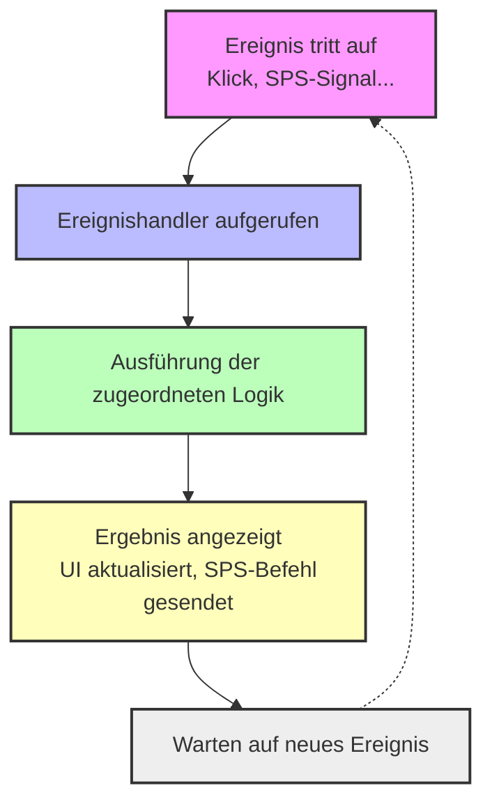

<h1 align="left">
  <br>
  
  <br>
  Grundlagen der Industrieautomation
  <br>
</h1>

Kurs AutB

# Modul 12 Node-RED
*2. Teil Flussbasierte Programmierung*

*Stichwörter:* **Fluss / Knoten / Funktion / Kontextdaten / Nachricht / Nutzlast**

<figure>
    
  <figcaption>OpenJS Foundation: <a href="https://openjsf.org/">OpenJS</a></figcaption>
</figure>

# Einführung

Node-RED ist grundsätzlich ein Open-Source-Projekt zur IoT-Kommunikation. Seine Flexibilität und Benutzerfreundlichkeit führten dazu, dass es seit mehreren Jahren als Kommunikationswerkzeug zur Unterstützung bestimmter Automatisierungssysteme eingeführt wurde. Im Rahmen der [HEVS](https://www.hevs.ch) konnten wir in einer von Jonathan Marques durchgeführten Bachelor-Arbeit zeigen, dass es sogar möglich ist, Node-RED als vollständige Benutzeroberfläche für ein echtes Industrieprojekt zu verwenden.

> In der Praxis wird Node-RED häufig als Werkzeug zur schnellen Prototypisierung von Benutzeroberflächen über seine Erweiterung [FlowFuse Dashboard](https://flows.nodered.org/node/@flowfuse/node-red-dashboard) verwendet. Es gibt wahrscheinlich kein anderes Werkzeug, das für diese Aufgabe so effizient ist.

> Dieses Modul ist eine kurze Einführung in Node-RED. Für weitere Informationen können Sie auf die umfangreiche Literatur im Internet oder auf den [Automation in Development and Automation](https://github.com/hei-dls-adp/adp-docs) Kurs der HEVS verweisen.

:no_bell: *Im Rest dieses Kurses sind einige Absätze mit diesem Symbol gekennzeichnet. Dies bedeutet nicht unbedingt, dass das Thema unwichtig ist, sondern vielmehr, dass es nicht im Detail behandelt wird.*

# Node-RED
<figure>
  
  <figcaption>Low-Code-Programmierung für ereignisgesteuerte Anwendungen <a href="https://nodered.org/">nodered.org</a></figcaption>
</figure>


## Eine kurze Einführung in Node-RED

Node-RED ist ein Werkzeug zum Erstellen von Internet-der-Dinge-Anwendungen (IoT) mit dem Schwerpunkt auf die Vereinfachung der **Verkabelung** von Codeblöcken zur Erfüllung von Aufgaben. Es verwendet einen visuellen Programmieransatz, der es Entwicklern ermöglicht, vordefinierte Codeblöcke, bekannt als **Knoten**, zu verbinden, um eine Aufgabe auszuführen. Die verbundenen Knoten, typischerweise eine Kombination aus Eingabeknoten, Verarbeitungsknoten und Ausgabeknoten, bilden zusammen einen **Fluss**.

Node-RED wurde ursprünglich Ende 2013 als Open-Source-Projekt bei IBM entwickelt, um den Bedarf zu erfüllen, Hardware und Geräte schnell mit Webdiensten und anderen Softwareanwendungen zu verbinden – als eine Art „Klebstoff" für das IoT. Es hat sich schnell zu einem universellen IoT-Programmierungswerkzeug entwickelt. Node-RED hat schnell eine große und wachsende Benutzerbasis sowie eine aktive Entwickler-Community entwickelt, die neue Knoten beiträgt, die es Programmierern ermöglichen, Node-RED-Code für eine Vielzahl von Aufgaben wiederzuverwenden.

### Node.JS
Node-RED basiert auf einer [Node.js](https://nodejs.org/) Umgebung.

Node.js ist eine serverseitige JavaScript-Laufzeitumgebung, die auf Googles [V8-Motor](#was-ist-die-javascript-v8-engine-) aufgebaut ist. Sie ermöglicht die Ausführung von JavaScript-Code außerhalb eines Browsers, hauptsächlich zur Erstellung schneller und skalierbarer Netzwerkanwendungen.

### Hauptunterschiede zwischen SPS und Python

| Aspekt                | Node.js (JavaScript)         | SPS (Ladder, ST, etc.)         | Python                        |
|-----------------------|-----------------------------|-------------------------------|-------------------------------|
| **Paradigma**         | Ereignisgesteuert, asynchron    | Zyklisch, Echtzeit           | Imperativ, objektorientiert      |
| **Ausführung**         | Interpretiert, nicht blockierend    | Echtzeit, sequenziell         | Interpretiert, synchron         |
| **Typische Verwendung** | Webserver, IoT, API      | Industrielle Steuerung, Maschinen  | Skripte, Data Science, Web    |
| **E/A-Verwaltung**   | Asynchron (Callbacks, Promises) | Direkt, über physische Ein-/Ausgänge | Synchron oder asynchron |
| **Sprache**           | JavaScript                  | IEC 61131-3 Sprachen           | Python                        |

### Wichtigste Punkte

- **Node.js** ist für die Verarbeitung vieler Ereignisse parallel konzipiert, z. B. Netzwerkverbindungen und Benutzeroberfläche, dank seiner nicht blockierenden Event-Loop.
- **SPS** funktioniert durch zyklisches Scannen des Programms, was **Echtzeitreaktivität** garantiert, aber die Verwaltung komplexer Mehrfachereignisse einschränkt.
- **Python** ist leicht zu erlernen, standardmäßig synchron, kann aber auch asynchron arbeiten.

**Zusammenfassend**: Node.js ist besonders geeignet für Anwendungen, die die gleichzeitige Verwaltung vieler Verbindungen oder Ereignisse erfordern, während SPS für die Echtzeitsteuerung optimiert sind und Python für Vielseitigkeit und schnelle Entwicklung geeignet ist.

### Konzept der ereignisgesteuerten Programmierung (Event Driven)

<div align="center">


</div>

Dieses Diagramm zeigt das Prinzip der ereignisgesteuerten Programmierung: Das System wartet auf Ereignisse, löst spezifische Handler aus, führt die Logik aus und kehrt dann in den Wartezustand zurück.

### Ereignisgesteuerte Programmierung verstehen

Ereignisgesteuerte Programmierung ist ein Paradigma, bei dem der Ablauf eines Programms durch Ereignisse wie Benutzeraktionen, Systembenachrichtigungen oder Datenverfügbarkeit bestimmt wird. In Node.js ermöglicht dieses Modell Entwicklern, asynchronen und nicht blockierenden Code zu schreiben, der auf Ereignisse reagiert, wenn sie auftreten, ohne auf den Abschluss blockierender Operationen zu warten.

### Events und Event Emitters

- **Ereignisse**: Ereignisse sind Signale, die anzeigen, dass eine bestimmte Aktion oder Zustandsänderung aufgetreten ist. In Node.js werden Ereignisse durch Zeichenketten, **Ereignisnamen** und zugeordnete Daten, **Ereignis-Payload**, dargestellt.
- **Ereignisemitter**: Ein Ereignisemitter ist ein Objekt, das Ereignisse ausstrahlen kann. Er bietet Methoden zum Registrieren von Ereignislistenern, **Event Listener**, **Callbacks** für spezifische Ereignisse und zum Auslösen dieser, wenn entsprechende Ereignisse auftreten.

Ereignisgesteuerte Programmierung ermöglicht die Synchronisierung mehrerer Ereignisse und vereinfacht das Programm maximal. Die Grundkomponenten der ereignisgesteuerten Programmierung sind:

- Eine Rückruffunktion, **Callback**, genannt Ereignishandler wird aufgerufen, wenn ein Ereignis ausgelöst wird;
- Eine Event-Loop, **Event Loop**, die auf Ereignisauslöser, **Trigger**, wartet und den entsprechenden Ereignishandler, **Event Handler**, aufruft.

<div align="center">
  
  <p><em>Event in Node.js, Quelle: https://www.geeksforgeeks.org</em></p>
</div>   

### Vorteile der ereignisgesteuerten Programmierung

- **Flexibilität**: Es ist einfacher, Codeabschnitte nach Bedarf zu ändern.
- **Anpassung an grafische Benutzeroberflächen**: Der Benutzer kann Tools (wie Radiobuttons usw.) direkt aus der Werkzeugleiste auswählen.
- **Ermöglicht interaktivere Programme**: Ereignisgesteuerte Programmierung wird in fast allen modernen UI-Anwendungen verwendet.
- **Verwendung von Hardware-Interrupts**: Sie können über Hardware-Interrupts realisiert werden und reduzieren damit den Energieverbrauch des Computers.
- **Unterstützung für Sensoren und andere Hardware**: Ereignisgesteuerte Programmierung vereinfacht die Kommunikation zwischen Sensoren und anderer Hardware sowie Software.

### Nachteile der ereignisgesteuerten Programmierung
- **Komplex**: Einfache Programme werden unnötig komplex.
- **Weniger logisch und offensichtlich**: Der Programmablauf ist in der Regel weniger logisch und offensichtlich.
- **Fehler schwer zu finden**: Das Debuggen eines ereignisgesteuerten Programms ist komplex.
- **Blockierung**: Komplexe Blockierung von Operationen.

> Zusammenfassend gilt: **Sehr gut geeignet für einfache Anwendungen, wie die Steuerung kleiner Maschinen, insbesondere der Roboter im Automatisierungslabor oder Testbänke mit wenigen Dutzend Modulen**. Wir haben keine Erfahrung oder Anwendungsfälle für großflächige Systeme.

### Was ist die JavaScript-Engine V8?

V8 ist eine JavaScript-Ausführungs-Engine, die von Google entwickelt wurde und hauptsächlich in Chrome-Browsern und Node.js verwendet wird. Ihre Aufgabe besteht darin, JavaScript-Code in vom Prozessor verständliche Maschinenanweisungen zu übersetzen, was die schnelle Ausführung von JavaScript außerhalb eines Browsers ermöglicht.

### Wichtigste Punkte für einen Studierenden, der Java, Python und IEC 61131-3 kennt:
- **Vergleichbar mit der JVM für Java**: Wie die Java Virtual Machine,
  - JVM führt Java-Bytecode aus,
  - V8 führt JavaScript-Code aus.
- **Just-In-Time Compilation, JIT**: V8 kompiliert JavaScript *im Handumdrehen* zu nativem Maschinencode, was die Leistung erheblich verbessert.
- **In Node.js verwendet**: Dank V8 ermöglicht Node.js die Ausführung von JavaScript auf der Serverseite, ähnlich wie Python mit seinem Interpreter.
- **Browser-unabhängig**: V8 kann in anderen Anwendungen integriert werden, um eine JavaScript-Execution-Engine bereitzustellen, **nicht nur in Browsern**.

> Zusammenfassend: V8 ist für JavaScript das, was die JVM für Java ist: ein Motor, der die effiziente Ausführung der Sprache auf verschiedenen Plattformen ermöglicht.

---


## Die Node-RED-Oberfläche

Node-RED ist ein Softwareprogramm zur Verwaltung von Event-Flows, Abfolgen von Verarbeitungen, die nach dem Empfang von Nachrichten oder Ereignissen ausgeführt werden. Es enthält eine Reihe von Grundfunktionen, aber die meisten nützlichen Funktionen in unserem Fall müssen später installiert werden.

In Node-RED wird eine "Funktion" als Knoten dargestellt, ein Element, das in Ihrem Fluss platziert werden kann und mit anderen Knoten als Ein- oder Ausgaben verbunden ist. Der Fluss stellt alle Knoten dar. Er ist nicht linear, und ein Knoten, der mit keinem anderen verbunden ist, kann immer noch aktiviert werden, wenn die Bedingungen erfüllt sind.

<div align="center">
<figure>
    
  <figcaption>Node-RED läuft in einem Browser</figcaption>
</figure>
</div>

Die Node-RED-Oberfläche besteht aus vier Teilen:

### 🔹 Links
Die Liste verfügbarer Knoten. Um sie im Fluss zu platzieren, wählen Sie den gewünschten aus und ziehen ihn an die gewünschte Stelle.

### 🔹 In der Mitte
Die **Flüsse**. Sie können so viele öffnen, wie Sie möchten; jeder Fluss ist unabhängig und kann andere nicht beeinflussen. Konkret ist ein **Fluss** eine Registerkarte, die als ein Unterprogramm mit seinen eigenen Variablen angesehen werden kann.

### 🔹 Auf der rechten Seite
Nützliche Registerkarten.
- Die Registerkarte i bietet detaillierte Informationen zu ausgewählten Knoten.
- Die Debug-Registerkarte, Lupe-Symbol, erscheint, sobald ein Debug-Knoten platziert wird und
ermöglicht es Ihnen, Debug-Nachrichten anzuzeigen.
- Die Dashboard-Registerkarte, Graph-Symbol, erscheint, sobald ein Dashboard-Knoten
erscheint und ermöglicht den Zugriff darauf.
- Weitere Registerkarten können je nach installierten und platzierten Knoten erscheinen.

### 🔹 Oben
Die Schaltfläche Bereitstellen ermöglicht es Ihnen, Ihren Fluss zu **bereitstellen** und ihn aktiv zu machen. Die
Menüschaltfläche, parallel Linien-Symbol, öffnet ein Menü mit folgenden Optionen:
- Ansicht: Verwalten Sie die Ansicht, blenden Sie die Seitenmenüs ein oder aus. Es ermöglicht auch
Zugriff auf das Debug- oder Dashboard, falls aktiv.
- Importieren: Einen gespeicherten Fluss laden
- Exportieren: Offene Flüsse speichern
- Palette verwalten: Installierte Knoten verwalten und neue installieren
- Flüsse / Unterflüsse: Einen neuen Fluss oder Unterfluss erstellen.

---


## Häufige Knoten

Beginnen wir mit den grundlegenden Knoten, die häufig verwendet werden.
Hier ist eine Liste von Notizen mit einem Reminder in meinen eigenen Worten, was sie tun.

### Beispiele
Es gibt viele integrierte Beispiele für jeden Knoten. Das Betrachten der Beispiele ist wahrscheinlich der beste Weg, um Node-RED zu lernen und zu verstehen.

<div style="text-align: center;">
<figure>
  
  <figcaption>Laden Sie ein Beispiel, um einen Knoten zu verstehen!</figcaption>
</figure>
</div>

### Wie man ein Beispiel lädt
Node-RED ist letztlich nur eine große JSON-Datei.

Unten ein erstes Beispiel.

:bulb: Sie müssen den folgenden JSON-Code nicht verstehen!

```json
[
    {
        "id": "c4abe2be0fc6d270",
        "type": "group",
        "z": "3f31cf57430bd5cb",
        "name": "",
        "style": {
            "label": true
        },
        "nodes": [
            "d2b330ed93df35a0",
            "81e48eeb776da060",
            "4d5a8d75274a52cb"
        ],
        "env": [
            {
                "name": "This_Group",
                "value": "4",
                "type": "num"
            }
        ],
        "x": 94,
        "y": 99,
        "w": 372,
        "h": 162
    },
    {
        "id": "d2b330ed93df35a0",
        "type": "inject",
        "z": "3f31cf57430bd5cb",
        "g": "c4abe2be0fc6d270",
        "name": "",
        "props": [
            {
                "p": "payload"
            },
            {
                "p": "topic",
                "vt": "str"
            }
        ],
        "repeat": "",
        "crontab": "",
        "once": false,
        "onceDelay": 0.1,
        "topic": "",
        "payload": "Hallo!",
        "payloadType": "str",
        "x": 190,
        "y": 140,
        "wires": [
            [
                "81e48eeb776da060"
            ]
        ]
    },
    {
        "id": "81e48eeb776da060",
        "type": "debug",
        "z": "3f31cf57430bd5cb",
        "g": "c4abe2be0fc6d270",
        "name": "debug 4",
        "active": true,
        "tosidebar": true,
        "console": false,
        "tostatus": false,
        "complete": "false",
        "statusVal": "",
        "statusType": "auto",
        "x": 360,
        "y": 140,
        "wires": []
    },
    {
        "id": "4d5a8d75274a52cb",
        "type": "comment",
        "z": "3f31cf57430bd5cb",
        "g": "c4abe2be0fc6d270",
        "name": "Node-RED sagt Hallo!",
        "info": "# Einige Dokumentation\n\nHier sollten Sie erklären, was Sie tun.\n\n|Eine Tabelle|Etikett|\n|-------|-----|\n|N°1    |Beispiel|\n\n```mermaid\nflowchart LR\n    Start --> Stop\n\n```",
        "x": 220,
        "y": 220,
        "wires": []
    }
]
```

Sie könnten diesen Text in eine JSON-Datei exportieren, aber Sie können ihn einfach so einfügen.

<div align="center">
<figure>
    
  <figcaption>Rechtsklick, Einfügen Importieren</figcaption>
</figure>
</div>

<div align="center">
<figure>
    
  <figcaption>JSON-Text kopieren und einfügen, aktueller Fluss, Importieren</figcaption>
</figure>
</div>

**Bereitstellen!**

> Beachten Sie, dass Sie, wenn Sie auf den Kommentar klicken: Node-RED sagt Hallo!, die Block-Dokumentation durch Klick auf die Schaltfläche :information_source: in der oberen rechten Ecke des Fensters lesen können.
---


### Einfügen
Hauptsächlich zum Debuggen, wird verwendet, um eine Nachricht manuell zu senden.

<div style="text-align: left;">
<figure>
  
  <figcaption>Knoten Einfügen</figcaption>
</figure>
</div>

<div style="text-align: center;">
<figure>
  
  <figcaption>Hallo Welt einfügen!</figcaption>
</figure>
</div>

:bulb: Kann auch verwendet werden, um eine Nachricht mit einer bestimmten Verzögerung oder einem wählbaren Zeitintervall einzufügen.


### Debuggen
Ermöglicht es Ihnen, eine Teilnachricht oder eine vollständige Nachricht im Debug-Fenster anzuzeigen.

<div style="text-align: center;">
<figure>
  
  <figcaption>Hallo Welt debuggen!</figcaption>
</figure>
</div>

<div style="text-align: center;">
<figure>
  
  <figcaption>Klicken Sie auf dieses Symbol zum Debuggen.</figcaption>
</figure>
</div>

<div style="text-align: center;">
<figure>
  
  <figcaption>Debug-Fenster</figcaption>
</figure>
</div>

### vollständig
:no_bell: *nur zur Information*

<div style="text-align: left;">
<figure>
  
  <figcaption>Knoten vollständig</figcaption>
</figure>
</div>

Ich habe es bisher sehr wenig verwendet.
Weitere Informationen: [Was ist der Complete-Knoten?](https://flowfuse.com/node-red/core-nodes/complete/)


### Fangen
:no_bell: *nur zur Information*

<div style="text-align: left;">
<figure>
  
  <figcaption>Knoten fangen</figcaption>
</figure>
</div>

Ich habe es bisher sehr wenig verwendet.
Weitere Informationen:: [Was ist der Catch-Knoten?](https://flowfuse.com/node-red/core-nodes/catch/)

<div style="text-align: center;">
<figure>
  
  <figcaption>Fehlermeldung abfangen</figcaption>
</figure>
</div>

Im obigen Beispiel wird eine Textnachricht, `Ungültige Eingabe gesendet`, an eine JavaScript-Funktion gesendet, die Text verarbeiten soll.

Der Catch-Knoten fängt alle Arten von Fehlern im Fluss ab. Wir schreiben dann einen Text in die Nutzlast für `debug 2`.

:memo: In der SPS-Welt gibt es das Konzept des Fehlers häufig nicht. Deshalb bemühen wir uns, Code mit absoluter Robustheit zu schreiben.

:warning: In der SPS-Welt finden wir das Konzept eines Alarms. **Dies ist grundlegend anders**. Wenn es einen Alarm gibt, ist dies ein Fehler; ganz im Gegenteil; es bedeutet, dass der Ingenieur das Problem antizipiert hat und die Reaktion der Maschine auf einen bestimmten Fall programmiert hat.

### Status
:no_bell: *nur zur Information*

<div style="text-align: left ;">
<figure>
  
  <figcaption>Knoten Status</figcaption>
</figure>
</div>

[Wofür wird der Status-Knoten in Node-RED verwendet?](https://flowfuse.com/node-red/core-nodes/status/)

<div style="text-align: center;">
<figure>
  
  <figcaption>Status-Beispiel</figcaption>
</figure>
</div>

In diesem Fall werden zwei Debug-Knoten konfiguriert, um einen Status direkt an den Status-Knoten zu senden und nicht zum Debug-Fenster

<div style="text-align: center;">
<figure>
  
  <figcaption>Nur Status-Knoten</figcaption>
</figure>
</div>

### Link-Knoten
Link-Knoten ermöglichen es Ihnen, einen Fluss zu erstellen, der zwischen den Registerkarten im Editor springen kann - sie fügen einen virtuellen Draht vom Ende eines Flusses zum Anfang eines anderen hinzu.

#### Link-Ausgang

<div style="text-align: left;">
<figure>
  
  <figcaption>Knoten Link-Ausgang</figcaption>
</figure>
</div>

Sie können beispielsweise eine Nachricht an einen anderen Fluss senden. Oder vermeiden Sie, zu viele Links im aktuellen Fluss zu haben.

<div style="text-align: center;">
<figure>
  
  <figcaption>Link-Ausgang zu einem anderen Fluss</figcaption>
</figure>
</div>

#### Link-Eingang

<div style="text-align: left;">
<figure>
  
  <figcaption>Knoten Link-Eingang</figcaption>
</figure>
</div>

In einem Link-Eingang können Sie Nachrichten von anderen Links auswählen, die Nachrichten senden.

<div style="text-align: center;">
<figure>
  
  <figcaption>Wert aus einem anderen Fluss abrufen</figcaption>
</figure>
</div>


#### Link-Aufruf

:no_bell: *pour information seulement*

Ruft einen Fluss auf, der mit einem Link-Eingabe-Knoten beginnt und gibt die Antwort weiter.

<div style="text-align: left;">
<figure>
  
  <figcaption>Knoten Link-Aufruf</figcaption>
</figure>
</div>

Dieser Knoten sollte eher als Prüfbox für Link-Überprüfung als für einen Link angesehen werden.
Unten ein Beispiel mit einigen Illustrationen.

Hier empfängt der Knoten **Link-Aufruf mit Name Test In** einen Zeitstempel, dieser Zeitstempel wird an **Link-Ausgang** an die **Test-Funktion** gesendet, dann **Link-Eingang** - **gestrichelte Linie** - **Link-Ausgang** zum **grünen Debug Test-Funktion**.

<div style="text-align: center;">
<figure>
  
  <figcaption>Test In mit dem Eingang der Test-Funktion verknüpft</figcaption>
</figure>
</div>

:warning: Dies verursacht ein Timeout, das vom roten Knoten nach **3 Sekunden** abgefangen wird. Warum?

<div style="text-align: center;">
<figure>
  
  <figcaption>Timeout nach 3 Sekunden, Link-Aufruf schlägt fehl</figcaption>
</figure>
</div>

:bulb: weil der **Link-Aufruf**-Knoten auf eine Kommunikationsrückmeldung wartet. Dazu müssen wir den **Link-Eingang** nach der **Funktion** bearbeiten, um im Modus zu sein: **Zurück zum aufrufenden Link-Knoten**.

<div style="text-align: center;">
<figure>
  
  <figcaption>Timeout nach 3 Sekunden</figcaption>
</figure>
</div>

Infolgedessen ändert sich das Link-Ausgangs-Symbol wie folgt:

<div style="text-align: center;">
<figure>
  
  <figcaption>Link-Aufruf erfolgreich</figcaption>
</figure>
</div>

Was passiert, wenn wir auf den Zeitstempel drücken?

<div style="text-align: center;">
<figure>
  
  <figcaption>Link-Aufruf erfolgreich mit Pfad</figcaption>
</figure>
</div>

1.  Wir senden einen Zeitstempel an **Test In**.
2.  Der Link-Aufruf ist konfiguriert, um die Nachricht über **Link-Ausgang** an die Test-Funktion zu senden.
3.  Der konfigurierte Link sendet die Nachricht an **Test In** zurück.
4.  Wenn die Nachricht innerhalb der konfigurierten Verzögerung empfangen wird, wird die Nachricht an Debug Call Three weitergeleitet.

<div style="text-align: center;">
<figure>
  
  <figcaption>Einige Tests zum Verständnis der Nachricht</figcaption>
</figure>
</div>

Im letzten Bild fügen wir nach der Test-Funktion eine **Verzögerung von 5 Sekunden** hinzu. Durch Hinzufügen dieser Verzögerung können wir überprüfen, ob die Verzögerung zu lang ist und der Catch-Knoten eine Nachricht an das **Timeout überprüfen** sendet.

Sie können einen Debug-Knoten mit dem Namen **Zu überprüfende ID** hinzufügen und ihn mit Ausgabe konfigurieren: vollständiges Nachrichtenobjekt, wie für **Debug Call Three**.

Im Debug-Panel:

**Zu überprüfende ID**, prüfen Sie _msgid.

```js
{"_msgid":"45c782272fbc0a1b",
 "payload":1760443662079,
 "topic":""}
```

**Debug Call Three**, prüfen Sie _msgid.

```js
{"_msgid":"45c782272fbc0a1b",
 "payload":"Nutzlast der Test-Funktion",
 "topic":"",
 "_event":"node:8d2380bd9fd72ee5"}
```

Wir können sehen, dass die Nutzlast durch die Funktion geändert wurde, aber die **_msgid ist von Anfang bis Ende gleich**.

:bulb: Wenn Sie das letzte Bild vollständig verstehen können, haben Sie einen großen Schritt zum Verständnis des Node-RED-Prinzips gemacht.

### Kommentar

<div style="text-align: left;">
<figure>
  
  <figcaption>Kommentar-Knoten</figcaption>
</figure>
</div>

Sie können detaillierte Informationen in Markdown-Format hinzufügen und sie auf der Registerkarte Information anzeigen.

<div style="text-align: center;">
<figure>
  
  <figcaption>Mein schöner Kommentar auf der Info-Registerkarte</figcaption>
</figure>
</div>

### Anlage


> Zur Nachrichtenkennung wird sie auf 8 Bytes codiert. Hier ist ein Beispiel, um den 64-Bit-Unsigned-Wert von **_msgid** abzurufen.

```js
// var myHex = "d05a3b7f70b3e37f";
var myHex = msg._msgid;

// Genaue Umwandlung in BigInt (unsigned)
var asBigInt = BigInt("0x" + myHex);
msg.payload = asBigInt
return msg;
```

---

## Nächstes
Im Lernpfad von Node-RED wäre es logisch, mit der Funktion fortzufahren. Aber wir wollen ein Verständnis der Schnittstellen für die nächsten praktischen Arbeiten, Labore, haben. Deshalb präsentieren wir einen kurzen Überblick über einige Funktionen unten.

Die Funktionen im Detail werden nach der Oberfläche, / UI Benutzeroberfläche präsentiert.

---

## Funktions-Knoten

### Funktion
Knoten, mit denen Sie auf Nachrichten wirken, deren Inhalte ändern, Verarbeitung auf sie anwenden und die Art, wie sie geliefert werden, leicht beeinflussen können.

<figure>
    
  <figcaption>Funktions-Knoten <a href="https://nodered.org">nodered.org</a></figcaption>
</figure>
Ermöglicht es Ihnen, eine Funktion in JavaScript zu erstellen. Nützlich für die Verarbeitung einer empfangenen Nachricht, um sie von einem Ausgabe-Knoten nutzbar zu machen.


> Die Funktion wird [im Detail in einem nachfolgenden Modul](../ADP_Module_05_Functions_Sub_Flows/README.md#function) entwickelt.

### Ändern

<figure>
    
  <figcaption>Änderungs-Knoten <a href="https://nodered.org">nodered.org</a></figcaption>
</figure>

Der Änderungs-Knoten kann verwendet werden, um die Eigenschaften einer Nachricht zu ändern und Kontexteigenschaften zu setzen, ohne auf einen Funktions-Knoten zurückgreifen zu müssen.

Jeder Knoten kann mit mehreren Operationen konfiguriert werden, die der Reihe nach angewendet werden. Die verfügbaren Operationen sind:

- **Setzen** - eine Eigenschaft setzen. Der Wert kann verschiedene Typen haben oder von einer bestehenden Nachrichts- oder Kontexteigenschaft übernommen werden.
- **Ändern** - Teile einer Nachrichteneigenschaft suchen und ersetzen.
- **Verschieben** - eine Eigenschaft verschieben oder umbenennen.
- **Löschen** - eine Eigenschaft löschen.

<div align="center">
<figure>
    
  <figcaption>Nachricht ändern, um Nutzlast zu formatieren</figcaption>
</figure>
</div>

<div align="center">
<figure>
    
  <figcaption>Setzen in einer Änderung verwenden.</figcaption>
</figure>
</div>

<div align="center">
<figure>
    
  <figcaption>Ändern in einer Änderung verwenden.</figcaption>
</figure>
</div>

Als Debug-Ausgabe:

```json
"Information von Node-RED."
```

### Schalter

<figure>
    
  <figcaption>Schalter-Knoten <a href="https://nodered.org">nodered.org</a></figcaption>
</figure>

Der Schalter-Knoten ermöglicht es, Nachrichten zu verschiedenen Fluss-Zweigen weiterzuleiten, indem eine Reihe von Regeln für jede Nachricht ausgewertet wird.

<div align="center">
<figure>
    
  <figcaption>Node-RED wählen Sie eine Nachricht</figcaption>
</figure>
</div>

Der Name **Schalter** kommt von der **Switch-Anweisung**, die vielen Programmiersprachen gemeinsam ist. Es ist keine Referenz zu einem physischen Schalter.

Der Knoten wird mit der zu überprüfenden Eigenschaft konfiguriert - dies kann entweder eine Nachrichteneigenschaft oder eine Kontexteigenschaft sein.


Es gibt vier Arten von Regeln:

- **Wert**-Regeln werden gegen die konfigurierte Eigenschaft ausgewertet
- **Sequenz**-Regeln können auf Nachrichtensequenzen verwendet werden, z.B. diejenigen, die vom Split-Knoten generiert werden
- Ein **Ausdruck** **JSONata** kann bereitgestellt werden, der gegen die gesamte Nachricht ausgewertet wird und übereinstimmt, wenn der Ausdruck einen True-Wert zurückgibt.
- Eine **Ansonsten**-Regel kann verwendet werden, um zu entsprechen, wenn keine der vorherigen Regeln übereinstimmten.

<div align="center">
<figure>
    
  <figcaption>Node-RED Bearbeiten Sie den Schalter-Knoten</figcaption>
</figure>
</div>

Im obigen Beispiel wird der `Schalter` abhängig vom Wert von `Nutzlast` eine `Nachricht` in einen der `Debug-Knoten` senden.

Der Knoten leitet eine Nachricht an alle Ausgaben weiter, die den Regeln entsprechen. Er kann aber auch so konfiguriert werden, dass er die Regelauswertung stoppt, wenn er eine Übereinstimmung findet.


---

## Arbeiten mit Nachrichten
Ein Node-RED-Fluss funktioniert durch Weitergabe von Nachrichten zwischen Knoten. Die Nachrichten sind einfache JavaScript-Objekte, die beliebige Eigenschaften haben können.

Nachrichten haben normalerweise eine Payload-Eigenschaft - dies ist die Standard-Eigenschaft, mit der die meisten Knoten arbeiten.

Node-RED fügt auch eine Eigenschaft namens _msgid hinzu - dies ist ein Identifikator für die Nachricht, der verwendet werden kann, um ihren Fortschritt durch einen Fluss zu verfolgen.

```json
{
    "_msgid": "12345",
    "payload": "..."
}
```

Der Wert einer Eigenschaft kann ein beliebiger gültiger JavaScript-Typ sein, wie:

- Boolescher Wert - true, false
- Zahl - z.B. 0, 123.4
- Zeichenkette - "hallo"
- Array - [1,2,3,4]
- Objekt - { "a": 1, "b": 2}
- Null

[Weitere Informationen zu JavaScript-Typen](https://developer.mozilla.org/en-US/docs/Web/JavaScript/Guide/Data_structures)

### Das Verständnis der Nachrichtenstruktur

Die einfachste Möglichkeit, die Struktur einer Nachricht zu verstehen, besteht darin, sie an einen Debug-Knoten zu übergeben und in der Debug-Seitenleiste anzuzeigen.

Standardmäßig zeigt der Debug-Knoten die msg.payload-Eigenschaft an, kann aber so konfiguriert werden, dass any Eigenschaft oder die gesamte Nachricht angezeigt wird.

Beim Anzeigen eines Arrays oder Objekts bietet die Seitenleiste eine strukturierte Ansicht, die zum Erkunden der Nachricht verwendet werden kann.

<div align="center">
<figure>
    
  <figcaption>Node-RED-Nachricht im Debug-Fenster</figcaption>
</figure>
</div>

Die Nachricht ist ein Objekt.
- **topic** ist der Pfad zur SPS-Variablen: `plc/app/Application/sym/PackTag/Command/Parameter_Lreal`
- **payload** ist die tatsächliche zu übertragende Nachricht. Dies ist ein Objekt, und der Wert dieses Objekts ist ein Array von 8 Objekten mit `ID`, `Name`, `Unit` und `Value`.
- **type** der Nutzlast ist ein `Objekt`.
- und **timestamp**, **timestampFiletime** und schließlich: **_msgid**.

<div align="center">
<figure>
    
  <figcaption>Node-RED-Tools im Debug-Fenster</figcaption>
</figure>
</div>

<figure>
    
  <figcaption>Pfad kopieren</figcaption>
</figure>

Kopiert den Pfad zum ausgewählten Element in die Zwischenablage. Dies ermöglicht es Ihnen, schnell zu bestimmen, wie Sie auf eine Eigenschaft in einem Änderungs- oder Funktions-Knoten zugreifen können

<figure>
    
  <figcaption>Wert kopieren</figcaption>
</figure>

Kopiert den Wert des Elements als JSON-Zeichenkette in die Zwischenablage. Beachten Sie, dass die Seitenleiste Arrays und Puffer über einer bestimmten Länge abschneidet. Das Kopieren des Wertes einer solchen Eigenschaft kopiert die abgeschnittene Version.

<figure>
    
  <figcaption>Stecknadeln</figcaption>
</figure>

Heftet das ausgewählte Element fest, damit es immer angezeigt wird. Wenn eine andere Nachricht vom selben Debug-Knoten empfangen wird, wird sie automatisch erweitert, um alle angehefteten Elemente anzuzeigen.

### Arbeiten mit JSON

**JSON**, JavaScript Object Notation, ist eine standardisierte Methode zur Darstellung eines JavaScript-Objekts als Zeichenkette. Es wird häufig von Web-APIs verwendet, um Daten zurückzugeben.

Wenn eine Nachrichteneigenschaft eine JSON-Zeichenkette enthält, muss diese zunächst in ihr entsprechendes JavaScript-Objekt analysiert werden, bevor die darin enthaltenen Eigenschaften aufgerufen werden können. Um zu bestimmen, ob eine Eigenschaft eine Zeichenkette oder ein Objekt enthält, kann der Debug-Knoten verwendet werden.

Node-RED stellt einen JSON-Knoten zur Verfügung, um diese Konvertierung durchzuführen.

:bulb: Falls Sie aus der Python-Welt kommen...

#### JSON und Python: Ähnlich, aber nicht identisch

| Konzept        | JSON                          | Python                   |
| -------------- | ----------------------------- | ------------------------ |
| Typ            | Textformat (Zeichenkette)     | In-Memory-Datenstruktur |
| Hauptcontainer | Objekt `{}`                   | Wörterbuch `dict`        |
| Arrays         | `[ ... ]`                     | Listen `[ ... ]`          |
| Zeichenketten  | `"text"`                      | `'text'` oder `"text"`     |
| Zahlen         | Keine Unterscheidung (nur numerisch) | `int`, `float`, etc.     |
| Booleans       | `true` / `false`              | `True` / `False`         |
| Null           | `null`                        | `None`                   |

So:

#### Ein JSON-Objekt wie

```json
{"name": "Alice", "age": 30}
```

#### ist äquivalent zu diesem Python-Wörterbuch:

```python
{"name": "Alice", "age": 30}
```

---

## Ihre Aufgabe
Installieren Sie Node-RED auf Ihrem Laptop. Verwenden Sie diesen Link für die Anleitung zum Verfahren: [Ausführen von Node-RED lokal](https://nodered.org/docs/getting-started/local)

### Über die Werkzeuge
<figure>
    
  <figcaption>node js <a href="https://nodejs.org/en/">nodejs.org</a></figcaption>
</figure>

## Welche Node.js-Version?
[Überprüfen Sie hier die zugelassene Node.js-Version für Node-RED](https://nodered.org/docs/faq/node-versions).

[Download für Node js](https://nodejs.org/en/download).

### Über die Werkzeuge
<figure>
    
  <figcaption>npm Docs <a href="https://docs.npmjs.com/">npm</a></figcaption>
</figure>


## Was ist npm?
Node Package Manager, **NPM**, ist ein Werkzeug zur Installation von Software, wie Module oder Abhängigkeiten, für JavaScript-Anwendungen. Es trägt zur Verbesserung der Effizienz der Node.js-Entwicklung bei, indem Benutzer Zugriff auf zusätzliche Komponenten von einem zentral Ort erhalten.

**Wichtig!** NPM kann sich entweder auf das Dienstprogramm beziehen, das Entwickler zum Herunterladen von Paketen verwenden, oder auf das Repository, in dem Benutzer ihre Module teilen.

Das NPM-Repository enthält derzeit Millionen von Paketen und Modulen.

Das Herunterladen und Verwalten von Paketen von NPM erfolgt über die Befehlszeile Ihres Systems. Standardmäßig wird dieses Dienstprogramm nach der Installation von Node.js automatisch konfiguriert.

---

# [Dashboard 2.0 Benutzeroberfläche](UserInferface_DE.md)

<!-- Ende von README_DE.md -->
