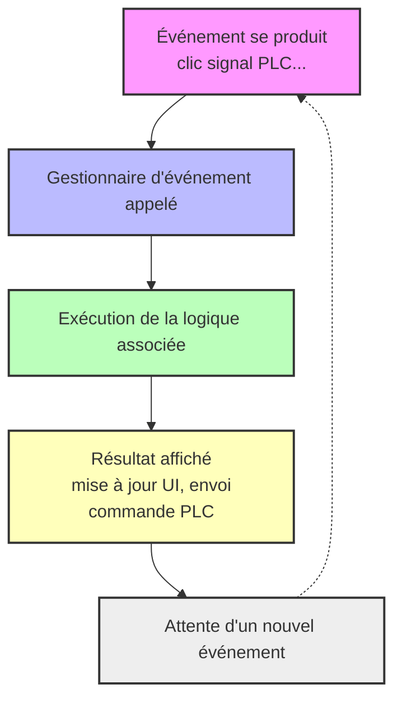

<h1 align="left">
  <br>
  
  <br>
  Base d'Automatisation Industrielle
  <br>
</h1>

Cours AutB

# Module 12 Node-RED
*Programmation basée sur les événements*

*Mots-clés:* **Flux / Nœud / Fonction / Données de contexte / Message / Charge utile**

<figure>
    
  <figcaption>OpenJS Foundation: <a href="https://openjsf.org/">OpenJS</a></figcaption>
</figure>


# Introduction

Node-RED est à la base un projet Open-Source destiné à la communication IoT. Sa souplesse et sa simplificité d'utilisation font qu'il a été adopté depuis plusieurs années comme outil de communication pour accompagner certains systèmes d'automation. Dans le cadre de la [HEVS](https://www.hevs.ch), nous avons pu montrer lors d'un travail de Bachelor réalisé par Jonathan Marques qu'il est même possible d'utiliser Node-RED comme interface utilisateur complet pour un projet industriel réel.

> Dans la pratique, Node-RED est beaucoup utilisé comme outil permettant le prototypage rapide d'interfaces utilisateur via son extension [FlowFuse Dashboard](https://flows.nodered.org/node/@flowfuse/node-red-dashboard). Il n'existe probablement pas d'autre outil autant efficace pour cette tâche.

> Ce module est une coure introduction à Node-RED, pour aller plus loin on pourra se référer à la vaste litérature existante sur le web ou au cours [Automation in Development and Automation](https://github.com/hei-dls-adp/adp-docs) de la HEVS.

:no_bell: *Dans le reste de ce cours, certains paragraphes sont marqués avec ce symbole. Cela ne signifie pas nécessairement que le sujet est sans importance, mais plutôt qu'il ne sera pas couvert en détail.*

# Node-RED
<figure>
    
  <figcaption>Programmation low-code pour les applications pilotées par les événements <a href="https://nodered.org/">nodered.org</a></figcaption>
</figure>


## Une brève introduction à Node-RED

Node-RED est un outil pour construire des applications Internet des Objets, IoT, en mettant l'accent sur la simplification du **câblage** de blocs de code pour accomplir des tâches. Il utilise une approche de programmation visuelle qui permet aux développeurs de connecter des blocs de code prédéfinis, connus sous le nom de **nœuds**, ensemble pour effectuer une tâche. Les nœuds connectés, généralement une combinaison de nœuds d'entrée, de nœuds de traitement et de nœuds de sortie, lorsqu'ils sont câblés ensemble, composent un **flux**.

Développé à l'origine en tant que projet open source chez IBM à la fin de 2013, pour répondre à leur besoin de connecter rapidement le matériel et les appareils aux services web et à d'autres logiciels - comme une sorte de colle pour l'IoT - il a rapidement évolué pour devenir un outil de programmation IoT à usage général. Notamment, Node-RED a rapidement développé une base d'utilisateurs importante et croissante et une communauté de développeurs active qui contribuent de nouveaux nœuds permettant aux programmeurs de réutiliser le code Node-RED pour une grande variété de tâches.

### Node.JS
Node-RED est basé sur un environnement [Node.js](https://nodejs.org/).

Node.js est un environnement d’exécution JavaScript côté serveur, construit sur le [moteur V8 de Google Chrome](#quest-ce-que-le-moteur-javascript-v8-). Il permet d’exécuter du code JavaScript en dehors d’un navigateur, principalement pour créer des applications réseau rapides et scalables.

### Différences principales avec PLC et Python

| Aspect                | Node.js (JavaScript)         | PLC (Ladder, ST, etc.)         | Python                        |
|-----------------------|-----------------------------|-------------------------------|-------------------------------|
| **Paradigme**         | Événementiel, asynchrone    | Cyclique, temps réel           | Impératif, orienté objet      |
| **Exécution**         | Interprété, non bloquant    | Temps réel, séquentiel         | Interprété, synchrone         |
| **Utilisation typique** | Serveurs web, IoT, API      | Contrôle industriel, machines  | Scripts, data science, web    |
| **Gestion des E/S**   | Asynchrone (callbacks, promesses) | Directe, via entrées/sorties physiques | Synchrone ou asynchrone |
| **Langage**           | JavaScript                  | Langages IEC 61131-3           | Python                        |

### Points clés

- **Node.js** est conçu pour gérer de nombreux événements en parallèle, par exemple, connexions réseau et interface utilisateur, grâce à sa boucle d’événements non bloquante.
- **PLC** fonctionne en scannant cycliquement le programme, ce qui garantit la **réactivité en temps réel** mais limite la gestion d’événements multiples complexes.
- **Python** est simple à apprendre, synchrone par défaut, mais peut aussi gérer l’asynchrone..

**En résumé** : Node.js est particulièrement adapté aux applications nécessitant la gestion simultanée de nombreuses connexions ou événements, alors que les PLC sont optimisés pour le contrôle temps réel, et Python pour la polyvalence et la rapidité de développement.

### Notion de programmation par événement, Event Driven

<div align="center">


</div>


Ce diagramme illustre le principe de la programmation événementielle : le système attend des événements, déclenche des gestionnaires spécifiques, exécute la logique, puis retourne en attente.

### Comprendre la programmation événementielle

La programmation événementielle est un paradigme dans lequel le déroulement d'un programme est déterminé par des événements tels que les actions de l'utilisateur, les notifications système ou la disponibilité des données. Dans Node.js, ce modèle permet aux développeurs d'écrire du code asynchrone et non bloquant qui réagit aux événements au fur et à mesure qu'ils se produisent, sans attendre la fin des opérations bloquantes.

### Events and Event Emitters

- **Événements** : Les événements sont des signaux indiquant qu'une action ou un changement d'état particulier s'est produit. Dans Node.js, les événements sont représentés par des chaînes, **event names** et des données associées, **event payload**.
- **Émetteurs d'événements** : Un émetteur d'événements est un objet capable d'émettre des événements. Il fournit des méthodes pour enregistrer des écouteurs d'événements, event listenr, **callbacks** pour des événements spécifiques et les déclencher lorsque les événements correspondants se produisent.

La programmation événementielle permet de synchroniser l'occurrence de plusieurs événements et de simplifier au maximum le programme. Les composants de base d'une programmation événementielle sont :

-   Une fonction de rappel, **callback**, appelée gestionnaire d'événements est appelée lorsqu'un événement est déclenché ;
-   Une boucle d'événements, **event loop**, qui écoute les déclencheurs d'événements, **triggers** et appelle le gestionnaire d'événements, **event handler** correspondant.

<div align="center">
  
  <p><em>Event in Node.js, Source; https://www.geeksforgeeks.org</em></p>
</div>   

### Avantages de la programmation événementielle

-   **Flexibilité**: Il est plus facile de modifier des sections de code selon les besoins.
-   **Adaptation aux interfaces graphiques** : L'utilisateur peut sélectionner des outils (comme des boutons radio, etc.) directement depuis la barre d'outils.
-   **Permet des programmes plus interactifs** : La programmation événementielle est utilisée dans presque toutes les applications UI récentes.
-   **Utilisation d'interruptions matérielles** : Elle peut être réalisée via des interruptions matérielles, réduisant ainsi la consommation d'énergie de l'ordinateur.
-   **Prise en charge des capteurs et autres matériels** : La programmation événementielle simplifie la communication entre les capteurs et autres matériels et les logiciels.

### Inconvénients de la programmation événementielle
-   **Complexe **: Les programmes simples deviennent inutilement complexes.
-   **Moins logique et évident** : Le déroulement du programme est généralement moins logique et plus évident.
-   **Difficile à trouver des erreurs** : Le débogage d'un programme événementiel est complexe.
-   **Blocage **: Blocage complexe des opérations.

> Pour résumer, **convient très bien pour des applications simples, telles que le pilotages de petites machines, voir les robots du laboratoire d'automation ou des bancs de test avec quelques dizaines de modules**. Nous n'avons pas d'expérience ou de cas d'utilisation pour des systèmes à grande échelle.

### Qu'est-ce que le moteur JavaScript V8 ?

V8 est un moteur d'exécution JavaScript développé par Google, principalement utilisé dans le navigateur Chrome et dans Node.js. Son rôle est de traduire le code JavaScript en instructions machine compréhensibles par le processeur, ce qui permet d'exécuter rapidement du JavaScript en dehors d'un navigateur.

### Points clés pour un étudiant connaissant Java, Python et IEC 61131-3 :
- **Comparable à la JVM pour Java** : Comme la Java Virtual Machine,
  - JVM exécute du bytecode Java, 
  - V8 exécute du code JavaScript.
- **Compilation Just-In-Time, JIT** : V8 compile le JavaScript *à la volée* en code machine natif, ce qui améliore fortement les performances.
- **Utilisé dans Node.js** : Grâce à V8, Node.js permet d'exécuter du JavaScript côté serveur, un peu comme Python avec son interpréteur.
- **Indépendant du navigateur** : V8 peut être intégré dans d'autres applications pour fournir un moteur d'exécution JavaScript, **pas seulement dans les navigateurs**.

> En résumé, V8 est au JavaScript ce que la JVM est à Java : un moteur qui rend possible l'exécution efficace du langage sur différentes plateformes.

## L'interface Node-RED

Node-RED est un logiciel pour gérer les flux d'événements, les séquences de traitement à effectuer après la réception de messages ou d'événements. Il contient un certain nombre de fonctionnalités de base, mais la plupart des fonctionnalités utiles dans notre cas devront être installées ultérieurement.

Dans Node-RED, une "fonctionnalité" est représentée comme un nœud, un élément qui peut être placé dans votre flux, connecté à d'autres nœuds comme entrées ou sorties. Le flux représente tous les nœuds. Il n'est pas linéaire, et un nœud non connecté à un autre peut toujours être activé si les conditions sont remplies.

<div align="center">
<figure>
    
  <figcaption>Node-RED fonctionne dans un navigateur</figcaption>
</figure>
</div>

L'interface Node-RED se compose de quatre parties:

### 🔹 À gauche
La liste des nœuds disponibles. Pour les placer sur le flux, sélectionnez celui que vous voulez et glissez-le à l'emplacement souhaité.

### 🔹 Au centre
Les **flux**. Vous pouvez en ouvrir autant que vous le souhaitez; chaque flux est indépendant et ne peut pas affecter les autres. Concrètement un **flux** est un onglet, on peut le voir comme un sous-programme avec ses propres variables.

### 🔹 À droite
Onglets utiles.
- L'onglet i fournit des informations détaillées sur tout nœud sélectionné.
- L'onglet débogage, icône de loupe, apparaît dès qu'un nœud de débogage est placé et
vous permet de voir les messages de débogage.
- L'onglet tableau de bord, icône de graphique, apparaît dès qu'un nœud de tableau de bord
apparaît et vous permet d'y accéder.
- D'autres onglets peuvent apparaître en fonction des nœuds installés et placés.

### 🔹 En haut
Le bouton Déployer vous permet de **déployer** votre flux et de le rendre actif. Le
bouton menu, icône de lignes parallèles, ouvre un menu, qui contient les options suivantes:
- Affichage: Gérez l'affichage, affichez ou masquez les menus latéraux. Il permet également
accès au débogage ou tableau de bord s'il est actif.
- Importer: Charger un flux enregistré
- Exporter: Enregistrer les flux ouverts
- Gérer la palette: Gérer les nœuds installés et en installer de nouveaux
- Flux / Sous-flux: Créer un nouveau flux ou un nouveau sous-flux.

---


## Nœuds courants

Commençons par les nœuds de base, courants.
Voici une liste de mémos avec un rappel, en mes propres termes, de ce qu'ils font.

### Exemples
Il y a beaucoup d'exemples intégrés pour chaque nœud. Regarder les exemples est probablement la meilleure façon d'apprendre et de comprendre Node-RED.

<div style="text-align: center;">
<figure>
  
  <figcaption>Chargez un exemple pour comprendre un nœud!</figcaption>
</figure>
</div>

### Comment charger un exemple
Node-RED est finalement un grand fichier JSON.

Ci-dessous un premier exemple.

:bulb: Vous n'avez pas besoin de comprendre le code JSON ci-dessous!

```json
[
    {
        "id": "c4abe2be0fc6d270",
        "type": "group",
        "z": "3f31cf57430bd5cb",
        "name": "",
        "style": {
            "label": true
        },
        "nodes": [
            "d2b330ed93df35a0",
            "81e48eeb776da060",
            "4d5a8d75274a52cb"
        ],
        "env": [
            {
                "name": "This_Group",
                "value": "4",
                "type": "num"
            }
        ],
        "x": 94,
        "y": 99,
        "w": 372,
        "h": 162
    },
    {
        "id": "d2b330ed93df35a0",
        "type": "inject",
        "z": "3f31cf57430bd5cb",
        "g": "c4abe2be0fc6d270",
        "name": "",
        "props": [
            {
                "p": "payload"
            },
            {
                "p": "topic",
                "vt": "str"
            }
        ],
        "repeat": "",
        "crontab": "",
        "once": false,
        "onceDelay": 0.1,
        "topic": "",
        "payload": "Bonjour!",
        "payloadType": "str",
        "x": 190,
        "y": 140,
        "wires": [
            [
                "81e48eeb776da060"
            ]
        ]
    },
    {
        "id": "81e48eeb776da060",
        "type": "debug",
        "z": "3f31cf57430bd5cb",
        "g": "c4abe2be0fc6d270",
        "name": "debug 4",
        "active": true,
        "tosidebar": true,
        "console": false,
        "tostatus": false,
        "complete": "false",
        "statusVal": "",
        "statusType": "auto",
        "x": 360,
        "y": 140,
        "wires": []
    },
    {
        "id": "4d5a8d75274a52cb",
        "type": "comment",
        "z": "3f31cf57430bd5cb",
        "g": "c4abe2be0fc6d270",
        "name": "Node-RED dit Bonjour!",
        "info": "# Quelques documentations\n\nIci vous devriez expliquer ce que vous faites.\n\n|Un tableau|Étiquette|\n|-------|-----|\n|N°1    |Exemple|\n\n```mermaid\nflowchart LR\n    Début --> Arrêt\n\n```",
        "x": 220,
        "y": 220,
        "wires": []
    }
]
```

Vous pourriez exporter ce texte dans un fichier JSON, mais vous pouvez simplement l'insérer comme cela.

<div align="center">
<figure>
    
  <figcaption>Clic droit, Insérer Importer</figcaption>
</figure>
</div>

<div align="center">
<figure>
    
  <figcaption>Copier coller le texte JSON, flux actuel, Importer</figcaption>
</figure>
</div>

**Déployer!**

> Notez que si vous cliquez sur le commentaire: Node-RED dit Bonjour!, vous pouvez lire la documentation du bloc en cliquant sur le bouton :information_source: en haut à droite de la fenêtre.
---


### Injecter
Principalement pour le débogage, utilisé pour envoyer manuellement un message.

<div style="text-align: left;">
<figure>
  
  <figcaption>Nœud Injecter</figcaption>
</figure>
</div>

<div style="text-align: center;">
<figure>
  
  <figcaption>Injecter Bonjour Monde!</figcaption>
</figure>
</div>

:bulb: Peut également être utilisé pour injecter un message avec un délai donné ou un intervalle de temps sélectionnable.


### Débogage
Vous permet d'afficher un message partiel ou complet dans la fenêtre de débogage.

<div style="text-align: center;">
<figure>
  
  <figcaption>Débogage Bonjour Monde!</figcaption>
</figure>
</div>

<div style="text-align: center;">
<figure>
  
  <figcaption>Cliquez sur cette icône pour déboguer.</figcaption>
</figure>
</div>

<div style="text-align: center;">
<figure>
  
  <figcaption>Fenêtre de débogage</figcaption>
</figure>
</div>

### complet
:no_bell: *pour information seulement*

<div style="text-align: left;">
<figure>
  
  <figcaption>Nœud complet</figcaption>
</figure>
</div>

Je l'ai très peu utilisé jusqu'à présent.
Pour plus d'informations: [Qu'est-ce que le nœud complet?](https://flowfuse.com/node-red/core-nodes/complete/)


### capture
:no_bell: *pour information seulement*

<div style="text-align: left;">
<figure>
  
  <figcaption>Nœud capture</figcaption>
</figure>
</div>

Je l'ai très peu utilisé jusqu'à présent.
Pour plus d'informations:: [Qu'est-ce que le nœud de capture?](https://flowfuse.com/node-red/core-nodes/catch/)

<div style="text-align: center;">
<figure>
  
  <figcaption>Capturer le message d'erreur</figcaption>
</figure>
</div>

Dans l'exemple ci-dessus, un message textuel, `Entrée invalide envoyée`, est envoyé à une fonction JavaScript conçue pour traiter du texte.

Le nœud de capture intercepte tout type d'erreur dans le flux. Nous écrivons alors un texte dans la charge utile pour `debug 2`.

:memo: Dans le monde des API, le concept d'erreur n'existe pas souvent. C'est pourquoi nous nous efforçons d'écrire du code avec une robustesse absolue.

:warning: Dans le monde des automates, nous trouvons le concept d'alarme. **C'est fondamentalement différent**. Lorsqu'il y a une alarme, ce n'est pas une erreur; tout le contraire; cela signifie que l'ingénieur a anticipé le problème et programmé la réaction de la machine à un cas particulier.

### statut
:no_bell: *pour information seulement*

<div style="text-align: left ;">
<figure>
  
  <figcaption>Nœud statut</figcaption>
</figure>
</div>

[À quoi sert le nœud de statut dans Node-RED?](https://flowfuse.com/node-red/core-nodes/status/)

<div style="text-align: center;">
<figure>
  
  <figcaption>Exemple de statut</figcaption>
</figure>
</div>

Dans ce cas, deux nœuds de débogage sont configurés pour envoyer un statut directement au nœud de statut et non à la fenêtre de débogage

<div style="text-align: center;">
<figure>
  
  <figcaption>Nœud statut uniquement</figcaption>
</figure>
</div>

### nœuds de lien
Les nœuds de lien vous permettent de créer un flux qui peut sauter entre les onglets dans l'éditeur - ils ajoutent un fil virtuel de la fin d'un flux au début d'un autre.

#### lien de sortie

<div style="text-align: left;">
<figure>
  
  <figcaption>Nœud lien de sortie</figcaption>
</figure>
</div>

Par exemple, vous pouvez envoyer un message à un autre flux. Ou éviter d'avoir trop de liens dans le flux actuel.

<div style="text-align: center;">
<figure>
  
  <figcaption>lien de sortie vers un autre flux</figcaption>
</figure>
</div>

#### lien d'entrée

<div style="text-align: left;">
<figure>
  
  <figcaption>Nœud lien d'entrée</figcaption>
</figure>
</div>

Dans un lien d'entrée, vous pouvez sélectionner les messages d'autres liens envoyant des messages.

<div style="text-align: center;">
<figure>
  
  <figcaption>Obtenir une valeur d'un autre flux</figcaption>
</figure>
</div>


#### appel de lien
:no_bell: *pour information seulement*

Appelle un flux qui commence par un nœud de lien d'entrée et transmet la réponse.

<div style="text-align: left;">
<figure>
  
  <figcaption>Nœud appel de lien</figcaption>
</figure>
</div>

Ce nœud doit plutôt être vu comme un boîtier pour la vérification du lien que pour un lien.
Ci-dessous un exemple avec quelques illustrations.

Ici, le nœud **appel de lien avec le nom Test In** reçoit un horodatage, cet horodatage est envoyé à **lien de sortie** à la **fonction Test**, puis **lien d'entrée** - **ligne en pointillés** - **lien de sortie** au **débogage vert Test fonction**.

<div style="text-align: center;">
<figure>
  
  <figcaption>Test In lié à l'entrée de la fonction Test</figcaption>
</figure>
</div>

:warning: Cela provoque un dépassement de délai capturé par le nœud rouge après **3 secondes**. Pourquoi?

<div style="text-align: center;">
<figure>
  
  <figcaption>Dépassement de délai après 3 secondes, l'appel de lien échoue</figcaption>
</figure>
</div>

:bulb: parce que le nœud **appel de lien** attend un retour de communication. Pour ce faire, nous devons modifier le **lien d'entrée** après la **fonction** pour être en mode: **Retour au nœud d'appel de lien*.

<div style="text-align: center;">
<figure>
  
  <figcaption>Dépassement de délai après 3 secondes</figcaption>
</figure>
</div>

En conséquence, l'icône de lien de sortie change comme ci-dessous:

<div style="text-align: center;">
<figure>
  
  <figcaption>Appel de lien réussi</figcaption>
</figure>
</div>

Que se passe-t-il cuando nous appuyons sur l'horodatage?

<div style="text-align: center;">
<figure>
  
  <figcaption>Appel de lien réussi avec chemin</figcaption>
</figure>
</div>

1.  Nous envoyons un horodatage à **Test In**.
2.  L'appel de lien est configuré pour envoyer le message à la fonction de test via **lien de sortie**.
3.  Le lien configuré renvoie le message à **Test In**.
4.  Si le message est reçu dans le délai configuré, le message passe au Débogage Appel Trois.

<div style="text-align: center;">
<figure>
  
  <figcaption>Quelques tests pour comprendre le message</figcaption>
</figure>
</div>

Dans la dernière image, nous ajoutons un **délai de 5 secondes** après la fonction Test. En ajoutant ce délai, nous pouvons vérifier que le délai est trop long et le nœud de capture enverra un message au **Vérifier Le Dépassement De Délai**.

Vous pouvez ajouter un nœud de débogage avec le nom **À Vérifier L'identifiant** et en le configurant avec sortie: objet message complet, comme pour **Débogage Appel Trois**.

Dans le panneau de débogage:

**À Vérifier L'identifiant**, vérifiez _msgid.

```js
{"_msgid":"45c782272fbc0a1b",
 "payload":1760443662079,
 "topic":""}
```

**Débogage Appel Trois**, vérifiez _msgid.

```js
{"_msgid":"45c782272fbc0a1b",
 "payload":"charge utile de la fonction de test",
 "topic":"",
 "_event":"node:8d2380bd9fd72ee5"}
```

Nous pouvons voir que la charge utile a été modifiée par la fonction, mais le **_msgid est le même du début à la fin**.

:bulb: Si vous pouvez pleinement comprendre la dernière image, vous avez fait un grand pas dans la compréhension du principe de Node-RED.

### commentaire

<div style="text-align: left;">
<figure>
  
  <figcaption>Nœud commentaire</figcaption>
</figure>
</div>

Vous pouvez ajouter des informations plus détaillées au format markdown et les afficher dans l'onglet Information.

<div style="text-align: center;">
<figure>
  
  <figcaption>Mon beau commentaire dans l'onglet info</figcaption>
</figure>
</div>

### Annexe


> À propos de l'identifiant de message, il est codé sur 8 octets. Voici un exemple pour obtenir la valeur non signée de 64 bits de **_msgid**.

```js
// var myHex = "d05a3b7f70b3e37f";
var myHex = msg._msgid;

// conversion précise en BigInt (unsigned)
var asBigInt = BigInt("0x" + myHex);
msg.payload = asBigInt
return msg;
```

---

## Suivant
Dans le parcours pédagogique de Node-RED, il serait logique de continuer avec la fonction. Mais, nous voulons avoir une compréhension de quelques interfaces pour les travaux pratiques suivants, laboratoire. C'est pourquoi nous présentons un bref aperçu de certaines fonctions ci-dessous.

Les fonctions en profondeur seront présentées après l'interface, / UI Interface utilisateur.

---

## Nœuds de fonction

### Fonction
Nœuds vous permettant d'agir sur les messages, de modifier leur contenu, de les soumettre à un traitement et d'influencer légèrement la façon dont ils sont livrés.

<figure>
    
  <figcaption>Nœud de fonction <a href="https://nodered.org">nodered.org</a></figcaption>
</figure>
Vous permet de créer une fonction en JavaScript. Utile pour traiter un message reçu pour le rendre utilisable par un nœud de sortie.


> La fonction sera développée [en détail dans un module ultérieur](../ADP_Module_05_Functions_Sub_Flows/README.md#function).

### Changement

<figure>
    
  <figcaption>Nœud de changement <a href="https://nodered.org">nodered.org</a></figcaption>
</figure>

Le nœud de changement peut être utilisé pour modifier les propriétés d'un message et définir les propriétés de contexte sans avoir recours à un nœud de fonction.

Chaque nœud peut être configuré avec plusieurs opérations qui sont appliquées dans l'ordre. Les opérations disponibles sont:

- **Définir** - définir une propriété. La valeur peut être de différents types, ou peut être tirée d'une propriété de message existante ou de contexte.
- **Changer** - rechercher et remplacer des parties d'une propriété de message.
- **Déplacer** - déplacer ou renommer une propriété.
- **Supprimer** - supprimer une propriété.

<div align="center">
<figure>
    
  <figcaption>Utiliser le changement de message pour formater la charge utile</figcaption>
</figure>
</div>

<div align="center">
<figure>
    
  <figcaption>Utiliser Définir dans un changement.</figcaption>
</figure>
</div>

<div align="center">
<figure>
    
  <figcaption>Utiliser Changer dans un changement.</figcaption>
</figure>
</div>

En guise de sortie de débogage:

```json
"Information de Node-RED."
```

### Commutateur

<figure>
    
  <figcaption>Nœud de commutateur <a href="https://nodered.org">nodered.org</a></figcaption>
</figure>

Le nœud de commutateur permet d'acheminer les messages vers différentes branches d'un flux en évaluant un ensemble de règles par rapport à chaque message.

<div align="center">
<figure>
    
  <figcaption>Node-RED sélectionner un message</figcaption>
</figure>
</div>

Le nom **commutateur** vient de la **déclaration de commutation** qui est courante dans de nombreux langages de programmation. Ce n'est pas une référence à un commutateur physique.

Le nœud est configuré avec la propriété à tester - qui peut être soit une propriété de message soit une propriété de contexte.


Il y a quatre types de règles:

- Les règles de **valeur** sont évaluées par rapport à la propriété configurée
- Les règles de **séquence** peuvent être utilisées sur des séquences de messages, telles que celles générées par le nœud de division
- Une **expression** **JSONata** peut être fournie qui sera évaluée par rapport au message entier et correspondra si l'expression retourne une valeur true.
- Une règle **sinon** peut être utilisée pour correspondre si aucune des règles précédentes n'a correspondulé.

<div align="center">
<figure>
    
  <figcaption>Node-RED Modifier le nœud de commutateur</figcaption>
</figure>
</div>

Dans l'exemple ci-dessus, en fonction de la valeur de `charge utile`, le `commutateur` enverra un `message` dans l'un des `nœuds de débogage`.

Le nœud acheminera un message vers toutes les sorties correspondant aux règles correspondantes. Mais il peut également être configuré pour arrêter d'évaluer les règles lorsqu'il en trouve une qui correspond.

---

## Travailler avec des messages
Un flux Node-RED fonctionne en transmettant des messages entre les nœuds. Les messages sont des objets JavaScript simples qui peuvent avoir n'importe quel ensemble de propriétés.

Les messages ont généralement une propriété de charge utile - c'est la propriété par défaut avec laquelle la plupart des nœuds travailleront.

Node-RED ajoute également une propriété appelée _msgid - c'est un identifiant pour le message qui peut être utilisé pour tracer sa progression dans un flux.

```json
{
    "_msgid": "12345",
    "payload": "..."
}
```

La valeur d'une propriété peut être n'importe quel type JavaScript valide, tel que:

- Booléen - true, false
- Nombre - par exemple 0, 123.4
- Chaîne - "bonjour"
- Tableau - [1,2,3,4]
- Objet - { "a": 1, "b": 2}
- Nul

[Plus d'informations sur les types JavaScript](https://developer.mozilla.org/en-US/docs/Web/JavaScript/Guide/Data_structures)

### Comprendre la structure d'un message

Le moyen le plus simple de comprendre la structure d'un message est de le transmettre à un nœud de débogage et de le visualiser dans la barre latérale de débogage.

Par défaut, le nœud de débogage affichera la propriété msg.payload, mais peut être configuré pour afficher n'importe quelle propriété ou le message entier.

Lors de l'affichage d'un tableau ou d'un objet, la barre latérale fournit une vue structurée qui peut être utilisée pour explorer le message.

<div align="center">
<figure>
    
  <figcaption>Message Node-RED dans la fenêtre de débogage</figcaption>
</figure>
</div>

Le message est un objet.
- **topic** est le chemin d'accès à la variable de l'automate: `plc/app/Application/sym/PackTag/Command/Parameter_Lreal`
- **payload** est le message effectif à transmettre. C'est un objet, et cet objet contient une valeur qui est un tableau de 8 objets avec `ID`, `Name`, `Unit` et `Value`.
- **type** de charge utile est un `objet`.
- et **timestamp**, **timestampFiletime** et enfin: **_msgid**.

<div align="center">
<figure>
    
  <figcaption>Outils Node-RED dans la fenêtre de débogage</figcaption>
</figure>
</div>

<figure>
    
  <figcaption>Copier le chemin</figcaption>
</figure>

Copie le chemin d'accès à l'élément sélectionné dans votre presse-papiers. Cela vous permet de déterminer rapidement comment accéder à une propriété dans un nœud de changement ou de fonction

<figure>
    
  <figcaption>Copier la valeur</figcaption>
</figure>

Copie la valeur de l'élément dans votre presse-papiers sous forme de chaîne JSON. Notez que la barre latérale tronque les tableaux et tampons au-delà d'une certaine longueur. Copier la valeur d'une telle propriété copiera la version tronquée.

<figure>
    
  <figcaption>Épingles</figcaption>
</figure>

Épingle l'élément sélectionné afin qu'il soit toujours affiché. Lorsqu'un autre message est reçu du même nœud de débogage, il est automatiquement développé pour afficher tous les éléments épinglés.

### Travailler avec JSON

**JSON**, JavaScript Object Notation, est un moyen standard de représenter un objet JavaScript sous forme de chaîne. Il est couramment utilisé par les API web pour retourner des données.

Si une propriété de message contient une chaîne JSON, elle doit d'abord être analysée pour son objet JavaScript équivalent avant que les propriétés qu'elle contient puissent être accessibles. Pour déterminer si une propriété contient une chaîne ou un objet, le nœud de débogage peut être utilisé.

Node-RED fournit un nœud JSON pour effectuer cette conversion.

:bulb: si vous venez du monde Python...

#### JSON et Python: similaires mais pas identiques

| Concept        | JSON                          | Python                   |
| -------------- | ----------------------------- | ------------------------ |
| Type           | Format textuel (chaîne)       | Structure de données en mémoire |
| Conteneur principal | Objet `{}`                   | Dictionnaire `dict`        |
| Tableaux       | `[ ... ]`                     | Listes `[ ... ]`          |
| Chaînes        | `"texte"`                     | `'texte'` ou `"texte"`     |
| Nombres        | Pas de distinction (juste numérique) | `int`, `float`, etc.     |
| Booléens       | `true` / `false`              | `True` / `False`         |
| Nul            | `null`                        | `None`                   |

Donc:

#### Un objet JSON comme

```json
{"name": "Alice", "age": 30}
```

#### est équivalent à ce dictionnaire Python:

```python
{"name": "Alice", "age": 30}
```

---

## Votre travail
Installez Node-RED sur votre ordinateur portable. Utilisez ce lien pour être guidé sur la procédure: [Exécution de Node-RED en local](https://nodered.org/docs/getting-started/local)

### À propos des outils
<figure>
    
  <figcaption>node js <a href="https://nodejs.org/en/">nodejs.org</a></figcaption>
</figure>

## Quelle version de Node JS?
[Vérifiez la version prise en charge de node js pour Node-RED ici](https://nodered.org/docs/faq/node-versions).

[Télécharger pour Node js](https://nodejs.org/en/download).

### À propos des outils
<figure>
    
  <figcaption>npm Docs <a href="https://docs.npmjs.com/">npm</a></figcaption>
</figure>


## Qu'est-ce que npm?
Node Package Manager, **NPM**, est un outil pour installer des logiciels, tels que des modules ou des dépendances, pour les applications JavaScript. Il contribue à améliorer l'efficacité du développement Node.js en permettant aux utilisateurs d'accéder à des composants supplémentaires à partir d'un seul endroit.

**Important!** NPM peut faire référence soit à l'utilitaire que les développeurs utilisent pour télécharger des packages, soit au référentiel où les utilisateurs partagent leurs modules.

Le référentiel NPM contient actuellement des millions de packages et de modules.

Le téléchargement et la gestion des packages à partir de NPM utilisent l'interface de ligne de commande de votre système. Par défaut, cet utilitaire est automatiquement configuré après l'installation de Node.js.

---

#  [Dashboard 2.0 Interface utilisateur](UserInferface_FR.md)


<!-- Fin du README.md -->
