<h1 align="left">
  <br>
  
  <br>
  Base d'Automatisation Industrielle
  <br>
</h1>

Cours AutB

# Module 12 Node-RED
*Programmation basée sur les événements*

*Mots-clés:* **Flux / Nœud / Fonction / Données de contexte / Message / Charge utile**

<figure>
    
  <figcaption>OpenJS Foundation: <a href="https://openjsf.org/">OpenJS</a></figcaption>
</figure>


# Introduction
:no_bell: *Dans le reste de ce cours, certains paragraphes sont marqués avec ce symbole. Cela ne signifie pas nécessairement que le sujet est sans importance, mais plutôt qu'il ne sera pas couvert en détail.*

## Java Script
JavaScript est un langage de programmation de haut niveau, interprété, principalement utilisé pour créer des effets interactifs dans les navigateurs web. Il permet le contenu dynamique, le contrôle du multimédia, les images animées et bien plus encore sur les pages web. JavaScript est une technologie fondamentale du Web mondial, aux côtés de HTML et CSS.

Initialement développé pour l'écriture de scripts côté client dans les navigateurs, JavaScript est maintenant largement utilisé côté serveur (notamment avec Node.js). Il est connu pour sa flexibilité, son modèle de programmation piloté par les événements, et son support de la programmation orientée objet, impérative et fonctionnelle.

**Caractéristiques principales:**
- S'exécute dans tous les navigateurs web modernes
- Typée dynamiquement et basée sur les prototypes
- Supporte la programmation asynchrone, les callbacks, les promesses, async/await.
- Permet la manipulation du DOM et la gestion des événements

**Exemple:**
```javascript
console.log("Bonjour, le monde!");
```

## Le moteur V8
Le **moteur V8** est un moteur JavaScript open-source développé par Google. Il est écrit en C++ et est utilisé dans Google Chrome et autres navigateurs basés sur Chromium pour exécuter du code JavaScript. V8 compile JavaScript directement en code machine natif avant de l'exécuter, ce qui le rend extrêmement rapide.

**Points clés sur V8:**
- Développé par Google pour Chrome, mais aussi utilisé dans Node.js.
- Traduit JavaScript en code machine efficace en utilisant la compilation Just-In-Time (JIT).
- Offre des performances élevées pour l'exécution JavaScript côté client, dans les navigateurs, et côté serveur, dans Node.js.
- Continuellement optimisé pour la rapidité et l'efficacité mémoire.

**Pourquoi V8 est-il important?**
La performance et l'efficacité de V8 sont une raison majeure pour laquelle JavaScript peut être utilisé pour des applications à grande échelle et haute performance, à la fois dans les navigateurs et sur les serveurs, via Node.js.

<div align="center">
<figure>
    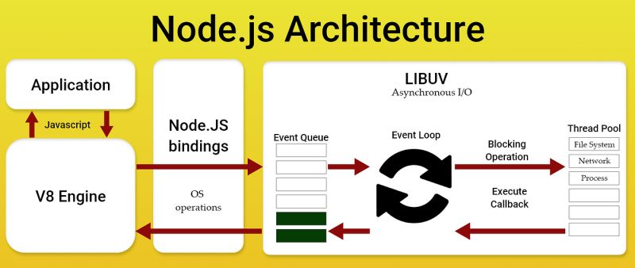
  <figcaption>Architecture Node.js, Source: <a href="https://www.techanicinfotech.com//">Technic Infotech</a></figcaption>
</figure>
</div>

## Node JS
> Nous ne nous plongerons pas dans Node.js dans ce cours, mais nous considérons qu'il est utile de comprendre le framework sous-jacent de l'environnement que nous utiliserons. Cela peut parfois vous aider à comprendre son comportement, à tirer parti de ses avantages et à éviter ses défauts.

> Nous allons un peu plus loin, car dans le module précédent nous avons couvert la **programmation cyclique**, et maintenant l'**architecture asynchrone** et la **programmation pilotée par les événements**. C'est très différent de ce que vous pourriez faire en exécutant simplement Python pour l'analyse de données.

> En Python, vous pourriez faire des tâches asynchrones avec asyncio. N'étant pas expert en Python, je ne veux pas m'aventurer dans ce débat.

Node.js est un environnement d'exécution **runtime** open-source, multiplateforme, monothread, conçu pour développer des applications serveur et réseau rapides et évolutives. Il s'exécute sur le moteur JavaScript V8 et adopte une architecture I/O non-bloquante, pilotée par les événements, ce qui le rend efficace et adapté aux applications en temps réel.

> Un **environnement d'exécution** est la plateforme ou le système sous-jacent qui fournit les ressources et les services nécessaires à un programme pour s'exécuter. Dans le contexte de Node.js, l'environnement d'exécution inclut le moteur JavaScript V8, les bibliothèques et les API qui permettent au code JavaScript de s'exécuter en dehors d'un navigateur web, d'interagir avec le système de fichiers, le réseau et d'autres ressources système.

Traditionnellement, JavaScript ne fonctionnait qu'en front-end, car le runtime n'était disponible que dans les navigateurs web comme Google Chrome. Le langage de programmation pouvait donc être utilisé pour créer une application côté client, un peu comme un site web dynamique.

Ryan Dahl a créé Node.js en 2009 comme un environnement d'exécution léger et réactif pour JavaScript. Ce logiciel permet aux développeurs d'utiliser le langage de script comme code côté serveur.

L'utilisation de JavaScript côté serveur permet aux développeurs d'écrire à la fois le front-end et le back-end dans le même langage. Cela rationalise le développement et la maintenance puisqu'ils peuvent réutiliser le même code.

De plus, le développement du back-end en JavaScript permet à l'application de bénéficier du modèle de programmation asynchrone de Node.js. Cette architecture, à sa base, permet au service web de répondre plus efficacement à plusieurs demandes d'utilisateurs.

### Qu'est-ce que monothread?
Un environnement **monothread** signifie que toute l'exécution du code se fait sur un seul thread principal du CPU, plutôt que d'utiliser plusieurs threads pour exécuter des tâches en parallèle.

Dans Node.js, cela signifie:

- Une seule opération peut exécuter du code JavaScript à la fois.
- Node.js utilise une boucle d'événements pour gérer de nombreuses tâches, comme les opérations I/O, de manière asynchrone, afin qu'il puisse gérer efficacement plusieurs connexions sans créer un nouveau thread pour chacune.
- Les tâches intensives en CPU peuvent bloquer la boucle d'événements, donc Node.js est mieux adapté aux applications liées à l'I/O.

💡 **Analogie:**  
Pensez à un système monothread comme à un chef, le thread, dans une cuisine. Le chef ne peut préparer qu'un plat à la fois, mais peut commencer un plat, le mettre au four, I/O, et pendant qu'il cuit, commencer à préparer un autre plat. Le chef ne se duplique jamais, mais gère de nombreuses tâches en passant efficacement d'une à l'autre.

⚠️ **Écueil**
Si vous exécutez du code long, intensif en CPU dans Node.js, cela bloquera la boucle d'événements et ralentira toutes les autres opérations. Pour de telles tâches, envisagez d'utiliser des worker threads ou de déplacer le travail en dehors de Node.js.

> Pour comprendre comment fonctionne Node.js, vous devez comprendre les termes importants suivants.
> - Modèle I/O non-bloquant
> - Architecture asynchrone
> - Piloté par les événements

## Modèle I/O non-bloquant

Pour traiter une demande d'utilisateur, les serveurs traditionnels comme Apache et Tomcat utilisent un seul thread qui peut servir un client à la fois. Lorsque le nombre maximum de threads est atteint, une nouvelle demande doit attendre que les threads existants terminent leurs tâches.

Les threads qui traitent encore les demandes d'utilisateurs bloqueront l'entrée de nouveaux clients et ne transmettront pas la sortie aux services externes tels que les API ou les bases de données. Cela peut entraîner des goulots d'étranglement lors des pics de trafic avec de nombreuses connexions simultanées.

Les paradigmes non-bloquants signifient qu'un seul thread Node.js peut recevoir et transmettre une nouvelle demande sans attendre que la demande actuelle soit complète. Ce système s'appelle une architecture asynchrone.

## Architecture asynchrone

Une architecture synchrone traite les demandes des clients dans l'ordre, ce qui signifie que le serveur web termine l'opération actuelle avant de commencer une nouvelle.

En revanche, **une application avec une architecture asynchrone commencera une nouvelle opération tout en attendant les résultats d'autres opérations**. Dès qu'elle reçoit une réponse, le serveur web retourne les données au client.

L'architecture asynchrone est appropriée pour les applications qui doivent récupérer des données à partir d'autres services, tels que les interfaces de programmation d'application. Les **API** ou les **bases de données**. Au lieu de rester inactif, le serveur web peut traiter de nouvelles demandes tout en attendant les réponses.

Bien qu'excellente pour les entrées/sorties, **les tâches I/O**, **cette architecture rend Node.js plus intensif en CPU** puisqu'elle utilise un seul thread pour traiter plusieurs demandes.

## Piloté par les événements

Dans Node.js, les événements sont des signaux indiquant qu'une action spécifique s'est produite. Par exemple, ils peuvent déclencher une **nouvelle opération** ou l'**achèvement** d'une tâche.

**Les événements font partie intégrante du modèle asynchrone**. Ils fonctionnent dans une boucle, indiquant à Node.js comment gérer le flux des demandes.

Lorsqu'une nouvelle demande est reçue d'un client, la boucle d'événements démarre. Node.js transmet ensuite la demande au service externe approprié, tel qu'une API. Une fois que le serveur reçoit les données, un nouvel événement déclenche une fonction de rappel.

Une fonction de rappel exécute une autre fonction lorsqu'une condition spécifique ou une opération asynchrone est complétée. Elle permet au serveur web de traiter les demandes et d'envoyer les réponses au client.

## Avantages de l'utilisation de Node.js

Maintenant que nous comprenons la mécanique de Node.js, voyons comment ce modèle peut bénéficier à votre développement d'applications web.

- **Vitesse**. L'architecture asynchrone de Node.js gère plus efficacement les opérations I/O multiples, ce qui entraîne une application plus réactive. Il permet également l'exécution en temps réel des données.
- **Mécanisme de gestion des erreurs**. Les objets d'erreur intégrés offrent aux utilisateurs une plus grande flexibilité dans la gestion de nombreux problèmes. Ils permettent aux développeurs d'obtenir des informations plus détaillées sur l'erreur pour un dépannage et un traitement plus efficaces.
- **Efficacité du développement**. Node.js permet aux développeurs d'utiliser JavaScript n'importe où pour un développement complet. Il facilite le développement car le code s'exécute sans problème entre le backend et le frontend.
- **Un écosystème riche**. Les utilisateurs peuvent installer divers modules via Node Package Manager (NPM) pour ajouter facilement de nouvelles fonctionnalités à leurs applications Node.js sans avoir à les écrire à partir de zéro.
- **Flexibilité et évolutivité**. Les développeurs peuvent utiliser Node.js avec d'autres frameworks et systèmes d'exploitation. Ils peuvent également faire évoluer le runtime en utilisant différentes approches, telles que l'installation d'un équilibreur de charge ou l'implémentation de microservices.
- **Open source**. Le code source de Node.js est accessible à tous les utilisateurs, et ses créateurs plaident pour la transparence, l'innovation et la personnalisation. Ce runtime bénéficie également d'un soutien communautaire important.

### En quoi Node.js est-il écrit?

Node.js est développé en C, C++ et JavaScript.

Selon Wikipedia, Node.js est "une compilation emballée du moteur JavaScript V8 de Google, la couche d'abstraction de plateforme libuv, et une bibliothèque principale, écrite principalement en JavaScript."

Le runtime utilise en interne Chrome V8, qui est le runtime JavaScript, lui-même écrit en C++. Cela permet à Node.js d'accéder aux fonctionnalités système internes, telles que la gestion du réseau.

### Architecture et fonctionnement de Node.js

Node.js repose sur une architecture appelée **boucle d'événements monothread** pour gérer plusieurs clients simultanément. Contrairement à d'autres environnements comme Java, qui utilisent un modèle multi-thread où chaque demande client est traitée par un thread séparé d'un pool de threads, Node.js gère toutes les demandes sur un seul thread via une boucle d'événements. Cela permet une gestion efficace de plusieurs connexions simultanées sans créer un thread séparé pour chaque client, améliorant les performances et l'utilisation des ressources.

<div align="center">
<figure>
    
  <figcaption>Comment node.js traite les demandes entrantes en utilisant la boucle d'événements, Source: <a href="https://kinsta.com/knowledgebase/what-is-node-js/">Kinsta</a></figcaption>
</figure>
</div>


# Node-RED
<figure>
    
  <figcaption>Programmation bas-code pour les applications pilotées par les événements <a href="https://nodered.org/">nodered.org</a></figcaption>
</figure>


## Une brève introduction à Node-RED

Node-RED est un outil pour construire des applications Internet des Objets, IoT, en mettant l'accent sur la simplification du **câblage** de blocs de code pour accomplir des tâches. Il utilise une approche de programmation visuelle qui permet aux développeurs de connecter des blocs de code prédéfinis, connus sous le nom de **nœuds**, ensemble pour effectuer une tâche. Les nœuds connectés, généralement une combinaison de nœuds d'entrée, de nœuds de traitement et de nœuds de sortie, lorsqu'ils sont câblés ensemble, composent un **flux**.

Développé à l'origine en tant que projet open source chez IBM à la fin de 2013, pour répondre à leur besoin de connecter rapidement le matériel et les appareils aux services web et à d'autres logiciels - comme une sorte de colle pour l'IoT - il a rapidement évolué pour devenir un outil de programmation IoT à usage général. Notamment, Node-RED a rapidement développé une base d'utilisateurs importante et croissante et une communauté de développeurs active qui contribuent de nouveaux nœuds permettant aux programmeurs de réutiliser le code Node-RED pour une grande variété de tâches.

Bien que Node-RED ait été à l'origine conçu pour fonctionner avec l'Internet des Objets, il est devenu utile pour une gamme d'applications et est maintenant considéré comme l'un des outils de développement visuel bas-code/sans-code les plus éminents.

> Ici à la HEVS, après avoir testé et validé Node-RED pour utilisation comme interface utilisateur pour un prototype de filtrage d'eau, nous l'utilisons comme interface utilisateur pour tous les laboratoires en Automatisation.

## L'interface Node-RED

Node-RED est un logiciel pour gérer les flux d'événements, les séquences de traitement à effectuer après la réception de messages ou d'événements. Il contient un certain nombre de fonctionnalités de base, mais la plupart des fonctionnalités utiles dans notre cas devront être installées ultérieurement.

Dans Node-RED, une "fonctionnalité" est représentée comme un nœud, un élément qui peut être placé dans votre flux, connecté à d'autres nœuds comme entrées ou sorties. Le flux représente tous les nœuds. Il n'est pas linéaire, et un nœud non connecté à un autre peut toujours être activé si les conditions sont remplies.

<div align="center">
<figure>
    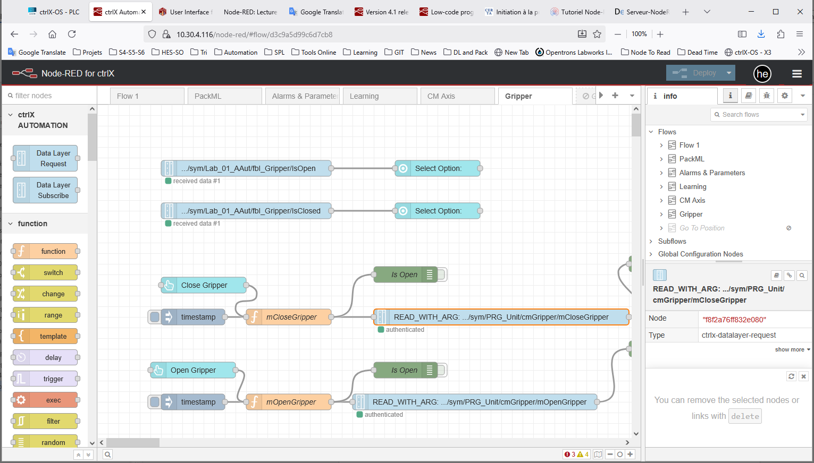
  <figcaption>Node-RED fonctionne dans un navigateur</figcaption>
</figure>
</div>

L'interface Node-RED se compose de quatre parties:

### 🔹 À gauche
La liste des nœuds disponibles. Pour les placer sur le flux, sélectionnez celui que vous voulez et glissez-le à l'emplacement souhaité.

### 🔹 Au centre
Les **flux**. Vous pouvez en ouvrir autant que vous le souhaitez; chaque flux est indépendant et ne peut pas affecter les autres. Concrètement un **flux** est un onglet, on peut le voir comme un sous-programme avec ses propres variables.

### 🔹 À droite
Onglets utiles.
- L'onglet i fournit des informations détaillées sur tout nœud sélectionné.
- L'onglet débogage, icône de loupe, apparaît dès qu'un nœud de débogage est placé et
vous permet de voir les messages de débogage.
- L'onglet tableau de bord, icône de graphique, apparaît dès qu'un nœud de tableau de bord
apparaît et vous permet d'y accéder.
- D'autres onglets peuvent apparaître en fonction des nœuds installés et placés.

### 🔹 En haut
Le bouton Déployer vous permet de **déployer** votre flux et de le rendre actif. Le
bouton menu, icône de lignes parallèles, ouvre un menu, qui contient les options suivantes:
- Affichage: Gérez l'affichage, affichez ou masquez les menus latéraux. Il permet également
accès au débogage ou tableau de bord s'il est actif.
- Importer: Charger un flux enregistré
- Exporter: Enregistrer les flux ouverts
- Gérer la palette: Gérer les nœuds installés et en installer de nouveaux
- Flux / Sous-flux: Créer un nouveau flux ou un nouveau sous-flux.

---


## Nœuds courants

Commençons par les nœuds de base, courants.
Voici une liste de mémos avec un rappel, en mes propres termes, de ce qu'ils font.

### Exemples
Il y a beaucoup d'exemples intégrés pour chaque nœud. Regarder les exemples est probablement la meilleure façon d'apprendre et de comprendre Node-RED.

<div style="text-align: center;">
<figure>
  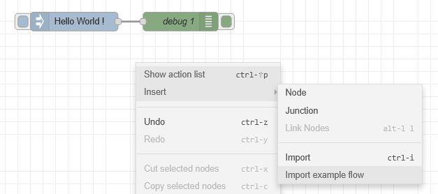
  <figcaption>Chargez un exemple pour comprendre un nœud!</figcaption>
</figure>
</div>

### Comment charger un exemple
Node-RED est finalement un grand fichier JSON.

Ci-dessous un premier exemple.

:bulb: Vous n'avez pas besoin de comprendre le code JSON ci-dessous!

```json
[
    {
        "id": "c4abe2be0fc6d270",
        "type": "group",
        "z": "3f31cf57430bd5cb",
        "name": "",
        "style": {
            "label": true
        },
        "nodes": [
            "d2b330ed93df35a0",
            "81e48eeb776da060",
            "4d5a8d75274a52cb"
        ],
        "env": [
            {
                "name": "This_Group",
                "value": "4",
                "type": "num"
            }
        ],
        "x": 94,
        "y": 99,
        "w": 372,
        "h": 162
    },
    {
        "id": "d2b330ed93df35a0",
        "type": "inject",
        "z": "3f31cf57430bd5cb",
        "g": "c4abe2be0fc6d270",
        "name": "",
        "props": [
            {
                "p": "payload"
            },
            {
                "p": "topic",
                "vt": "str"
            }
        ],
        "repeat": "",
        "crontab": "",
        "once": false,
        "onceDelay": 0.1,
        "topic": "",
        "payload": "Bonjour!",
        "payloadType": "str",
        "x": 190,
        "y": 140,
        "wires": [
            [
                "81e48eeb776da060"
            ]
        ]
    },
    {
        "id": "81e48eeb776da060",
        "type": "debug",
        "z": "3f31cf57430bd5cb",
        "g": "c4abe2be0fc6d270",
        "name": "debug 4",
        "active": true,
        "tosidebar": true,
        "console": false,
        "tostatus": false,
        "complete": "false",
        "statusVal": "",
        "statusType": "auto",
        "x": 360,
        "y": 140,
        "wires": []
    },
    {
        "id": "4d5a8d75274a52cb",
        "type": "comment",
        "z": "3f31cf57430bd5cb",
        "g": "c4abe2be0fc6d270",
        "name": "Node-RED dit Bonjour!",
        "info": "# Quelques documentations\n\nIci vous devriez expliquer ce que vous faites.\n\n|Un tableau|Étiquette|\n|-------|-----|\n|N°1    |Exemple|\n\n```mermaid\nflowchart LR\n    Début --> Arrêt\n\n```",
        "x": 220,
        "y": 220,
        "wires": []
    }
]
```

Vous pourriez exporter ce texte dans un fichier JSON, mais vous pouvez simplement l'insérer comme cela.

<div align="center">
<figure>
    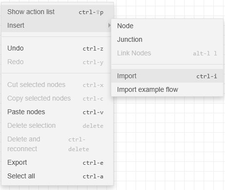
  <figcaption>Clic droit, Insérer Importer</figcaption>
</figure>
</div>

<div align="center">
<figure>
    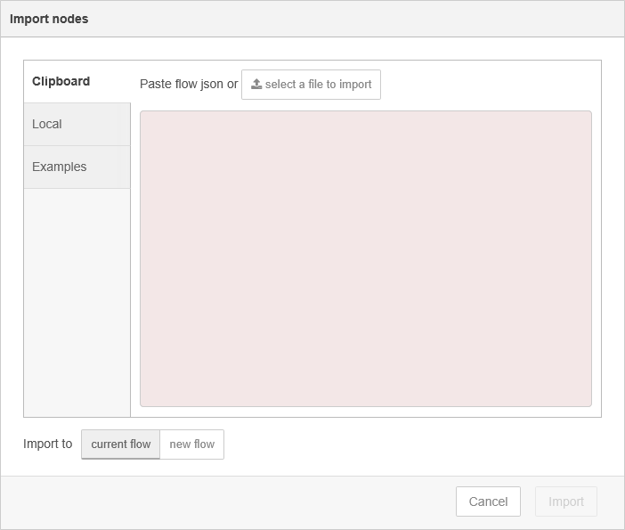
  <figcaption>Copier coller le texte JSON, flux actuel, Importer</figcaption>
</figure>
</div>

**Déployer!**

> Notez que si vous cliquez sur le commentaire: Node-RED dit Bonjour!, vous pouvez lire la documentation du bloc en cliquant sur le bouton :information_source: en haut à droite de la fenêtre.
---


### Injecter
Principalement pour le débogage, utilisé pour envoyer manuellement un message.

<div style="text-align: left;">
<figure>
  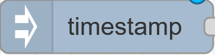
  <figcaption>Nœud Injecter</figcaption>
</figure>
</div>

<div style="text-align: center;">
<figure>
  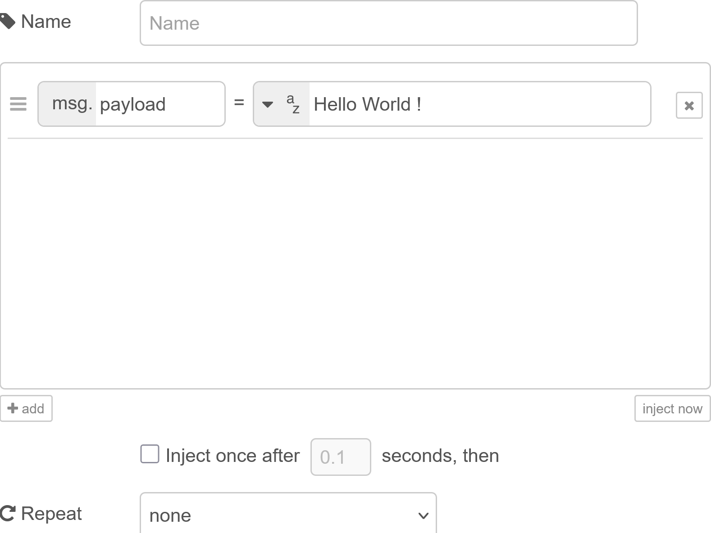
  <figcaption>Injecter Bonjour Monde!</figcaption>
</figure>
</div>

:bulb: Peut également être utilisé pour injecter un message avec un délai donné ou un intervalle de temps sélectionnable.


### Débogage
Vous permet d'afficher un message partiel ou complet dans la fenêtre de débogage.

<div style="text-align: center;">
<figure>
  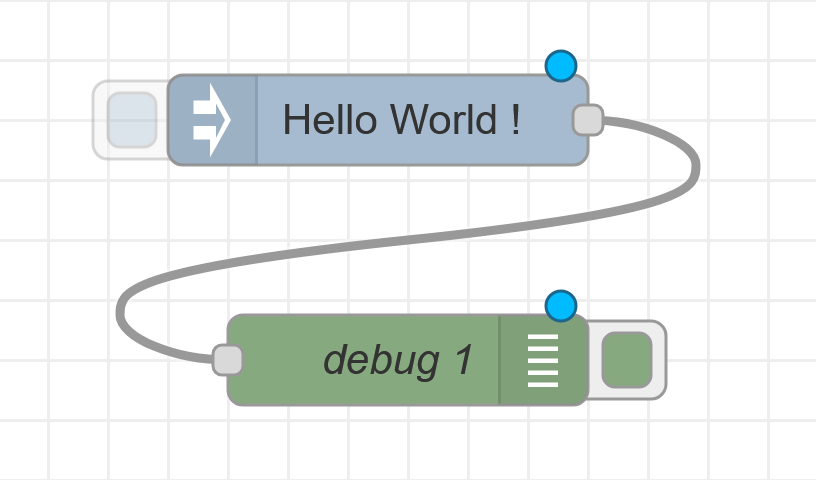
  <figcaption>Débogage Bonjour Monde!</figcaption>
</figure>
</div>

<div style="text-align: center;">
<figure>
  
  <figcaption>Cliquez sur cette icône pour déboguer.</figcaption>
</figure>
</div>

<div style="text-align: center;">
<figure>
  
  <figcaption>Fenêtre de débogage</figcaption>
</figure>
</div>

### complet
:no_bell: *pour information seulement*

<div style="text-align: left;">
<figure>
  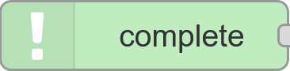
  <figcaption>Nœud complet</figcaption>
</figure>
</div>

Je l'ai très peu utilisé jusqu'à présent.
Pour plus d'informations: [Qu'est-ce que le nœud complet?](https://flowfuse.com/node-red/core-nodes/complete/)


### capture
:no_bell: *pour information seulement*

<div style="text-align: left;">
<figure>
  
  <figcaption>Nœud capture</figcaption>
</figure>
</div>

Je l'ai très peu utilisé jusqu'à présent.
Pour plus d'informations:: [Qu'est-ce que le nœud de capture?](https://flowfuse.com/node-red/core-nodes/catch/)

<div style="text-align: center;">
<figure>
  
  <figcaption>Capturer le message d'erreur</figcaption>
</figure>
</div>

Dans l'exemple ci-dessus, un message textuel, `Entrée invalide envoyée`, est envoyé à une fonction JavaScript conçue pour traiter du texte.

Le nœud de capture intercepte tout type d'erreur dans le flux. Nous écrivons alors un texte dans la charge utile pour `debug 2`.

:memo: Dans le monde des API, le concept d'erreur n'existe pas souvent. C'est pourquoi nous nous efforçons d'écrire du code avec une robustesse absolue.

:warning: Dans le monde des automates, nous trouvons le concept d'alarme. **C'est fondamentalement différent**. Lorsqu'il y a une alarme, ce n'est pas une erreur; tout le contraire; cela signifie que l'ingénieur a anticipé le problème et programmé la réaction de la machine à un cas particulier.

### statut
:no_bell: *pour information seulement*

<div style="text-align: left ;">
<figure>
  
  <figcaption>Nœud statut</figcaption>
</figure>
</div>

[À quoi sert le nœud de statut dans Node-RED?](https://flowfuse.com/node-red/core-nodes/status/)

<div style="text-align: center;">
<figure>
  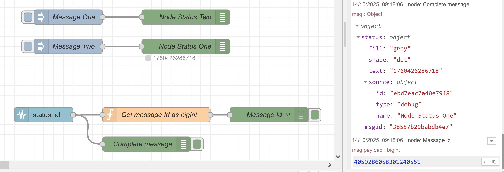
  <figcaption>Exemple de statut</figcaption>
</figure>
</div>

Dans ce cas, deux nœuds de débogage sont configurés pour envoyer un statut directement au nœud de statut et non à la fenêtre de débogage

<div style="text-align: center;">
<figure>
  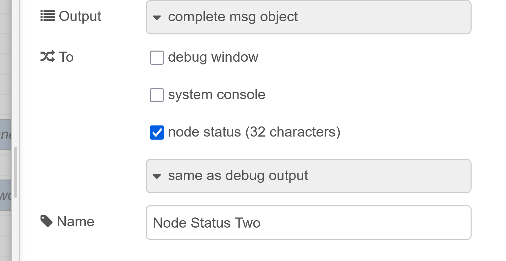
  <figcaption>Nœud statut uniquement</figcaption>
</figure>
</div>

### nœuds de lien
Les nœuds de lien vous permettent de créer un flux qui peut sauter entre les onglets dans l'éditeur - ils ajoutent un fil virtuel de la fin d'un flux au début d'un autre.

#### lien de sortie

<div style="text-align: left;">
<figure>
  
  <figcaption>Nœud lien de sortie</figcaption>
</figure>
</div>

Par exemple, vous pouvez envoyer un message à un autre flux. Ou éviter d'avoir trop de liens dans le flux actuel.

<div style="text-align: center;">
<figure>
  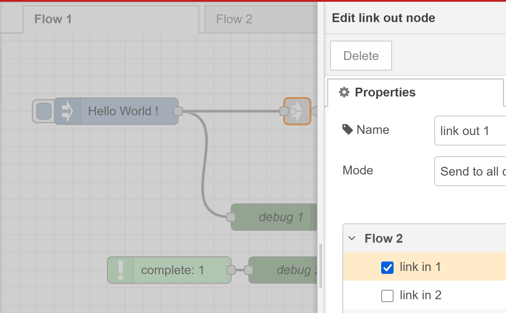
  <figcaption>lien de sortie vers un autre flux</figcaption>
</figure>
</div>

#### lien d'entrée

<div style="text-align: left;">
<figure>
  
  <figcaption>Nœud lien d'entrée</figcaption>
</figure>
</div>

Dans un lien d'entrée, vous pouvez sélectionner les messages d'autres liens envoyant des messages.

<div style="text-align: center;">
<figure>
  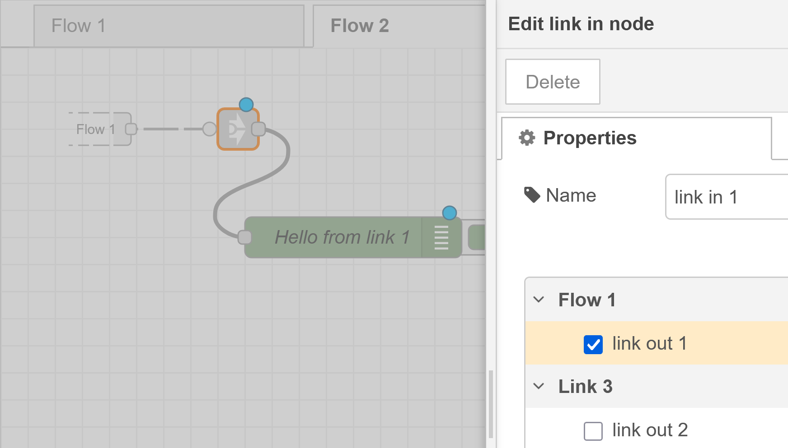
  <figcaption>Obtenir une valeur d'un autre flux</figcaption>
</figure>
</div>


#### appel de lien

Appelle un flux qui commence par un nœud de lien d'entrée et transmet la réponse.

<div style="text-align: left;">
<figure>
  
  <figcaption>Nœud appel de lien</figcaption>
</figure>
</div>

Ce nœud doit plutôt être vu comme un boîtier pour la vérification du lien que pour un lien.
Ci-dessous un exemple avec quelques illustrations.

Ici, le nœud **appel de lien avec le nom Test In** reçoit un horodatage, cet horodatage est envoyé à **lien de sortie** à la **fonction Test**, puis **lien d'entrée** - **ligne en pointillés** - **lien de sortie** au **débogage vert Test fonction**.

<div style="text-align: center;">
<figure>
  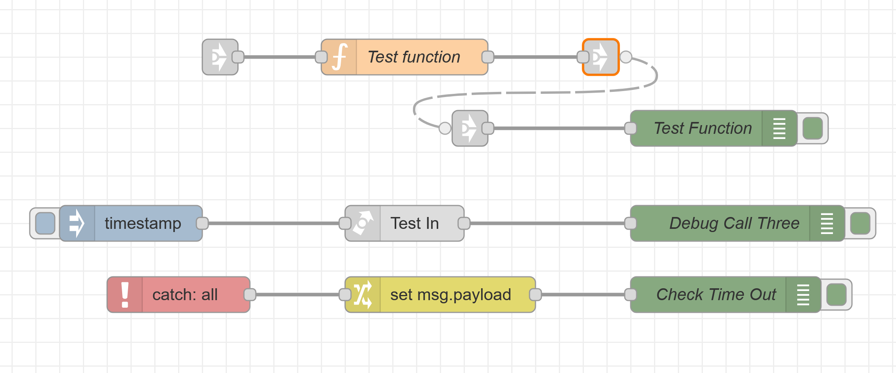
  <figcaption>Test In lié à l'entrée de la fonction Test</figcaption>
</figure>
</div>

:warning: Cela provoque un dépassement de délai capturé par le nœud rouge après **3 secondes**. Pourquoi?

<div style="text-align: center;">
<figure>
  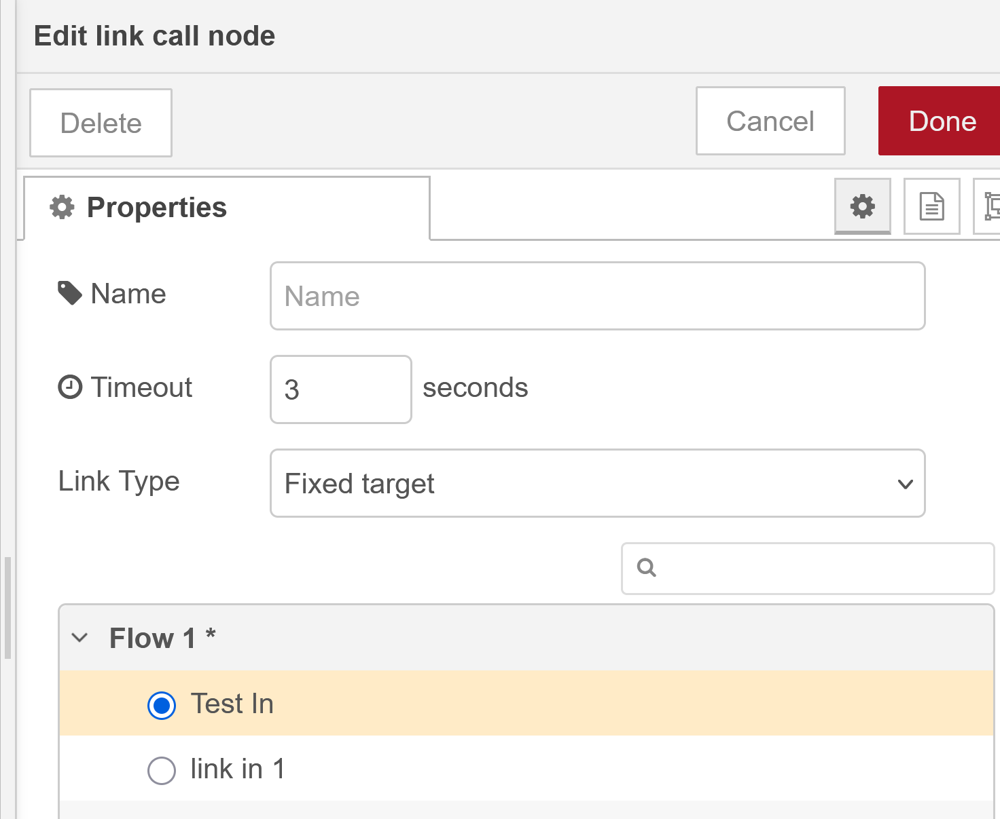
  <figcaption>Dépassement de délai après 3 secondes, l'appel de lien échoue</figcaption>
</figure>
</div>

:bulb: parce que le nœud **appel de lien** attend un retour de communication. Pour ce faire, nous devons modifier le **lien d'entrée** après la **fonction** pour être en mode: **Retour au nœud d'appel de lien*.

<div style="text-align: center;">
<figure>
  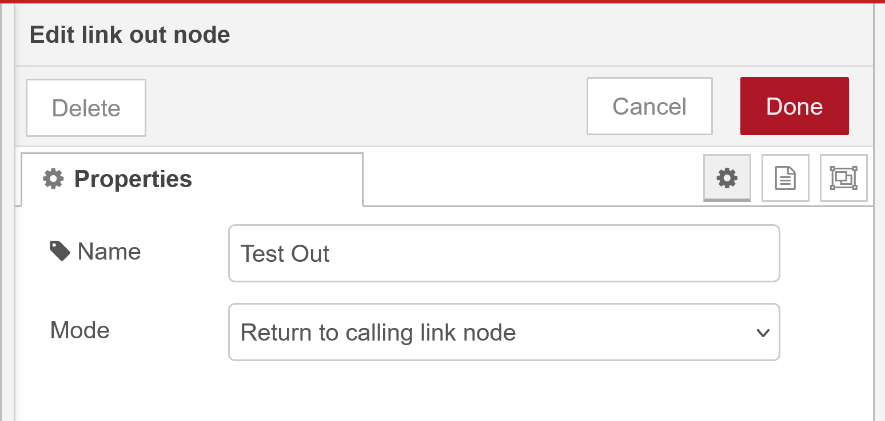
  <figcaption>Dépassement de délai après 3 secondes</figcaption>
</figure>
</div>

En conséquence, l'icône de lien de sortie change comme ci-dessous:

<div style="text-align: center;">
<figure>
  
  <figcaption>Appel de lien réussi</figcaption>
</figure>
</div>

Que se passe-t-il cuando nous appuyons sur l'horodatage?

<div style="text-align: center;">
<figure>
  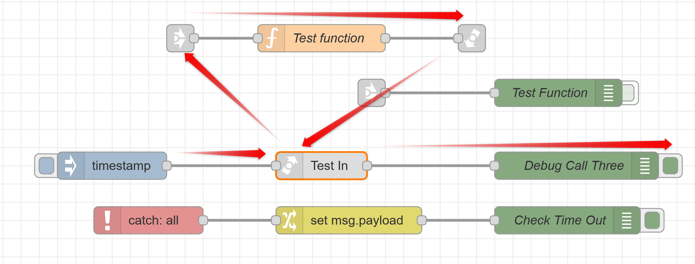
  <figcaption>Appel de lien réussi avec chemin</figcaption>
</figure>
</div>

1.  Nous envoyons un horodatage à **Test In**.
2.  L'appel de lien est configuré pour envoyer le message à la fonction de test via **lien de sortie**.
3.  Le lien configuré renvoie le message à **Test In**.
4.  Si le message est reçu dans le délai configuré, le message passe au Débogage Appel Trois.

<div style="text-align: center;">
<figure>
  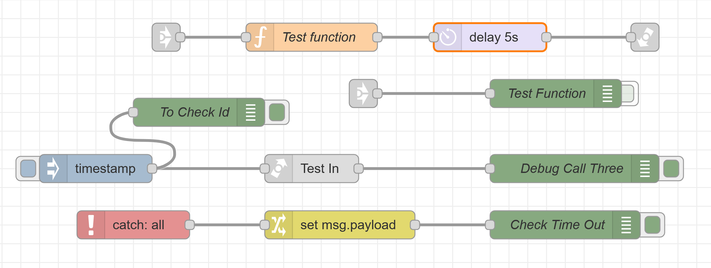
  <figcaption>Quelques tests pour comprendre le message</figcaption>
</figure>
</div>

Dans la dernière image, nous ajoutons un **délai de 5 secondes** après la fonction Test. En ajoutant ce délai, nous pouvons vérifier que le délai est trop long et le nœud de capture enverra un message au **Vérifier Le Dépassement De Délai**.

Vous pouvez ajouter un nœud de débogage avec le nom **À Vérifier L'identifiant** et en le configurant avec sortie: objet message complet, comme pour **Débogage Appel Trois**.

Dans le panneau de débogage:

**À Vérifier L'identifiant**, vérifiez _msgid.

```js
{"_msgid":"45c782272fbc0a1b",
 "payload":1760443662079,
 "topic":""}
```

**Débogage Appel Trois**, vérifiez _msgid.

```js
{"_msgid":"45c782272fbc0a1b",
 "payload":"charge utile de la fonction de test",
 "topic":"",
 "_event":"node:8d2380bd9fd72ee5"}
```

Nous pouvons voir que la charge utile a été modifiée par la fonction, mais le **_msgid est le même du début à la fin**.

:bulb: Si vous pouvez pleinement comprendre la dernière image, vous avez fait un grand pas dans la compréhension du principe de Node-RED.

### commentaire

<div style="text-align: left;">
<figure>
  
  <figcaption>Nœud commentaire</figcaption>
</figure>
</div>

Vous pouvez ajouter des informations plus détaillées au format markdown et les afficher dans l'onglet Information.

<div style="text-align: center;">
<figure>
  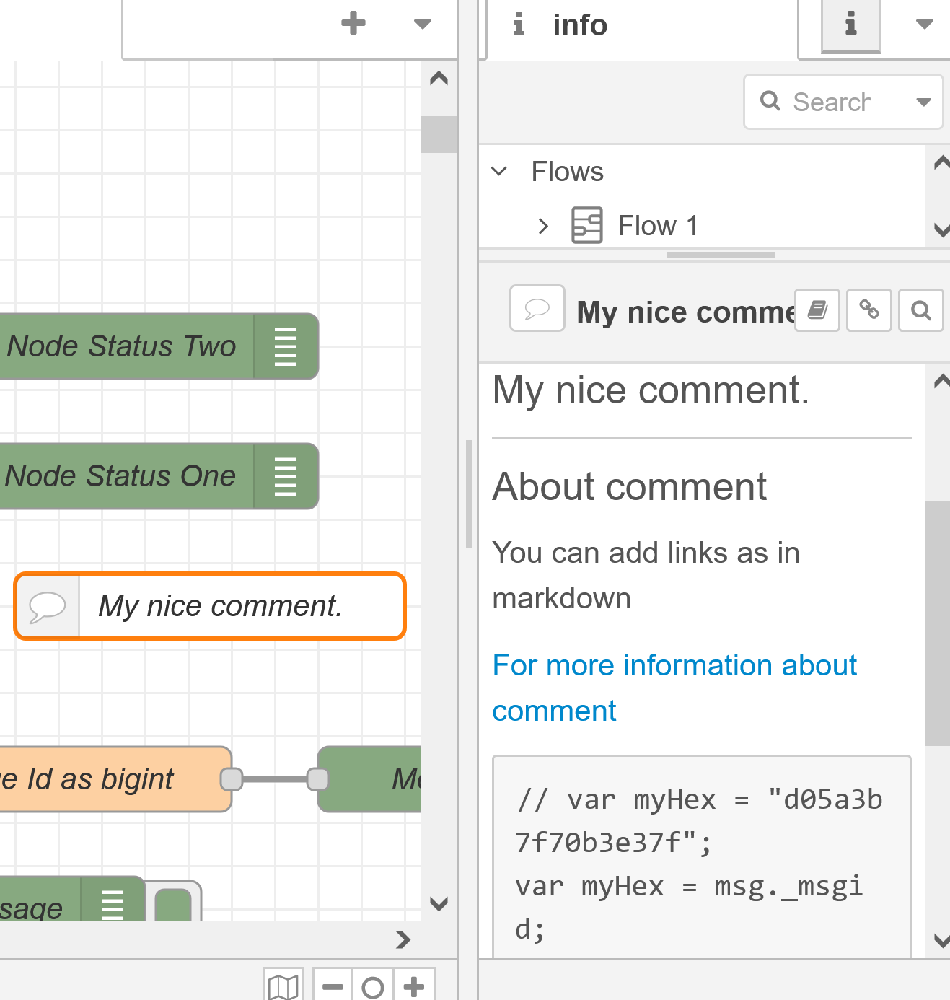
  <figcaption>Mon beau commentaire dans l'onglet info</figcaption>
</figure>
</div>

### Annexe


> À propos de l'identifiant de message, il est codé sur 8 octets. Voici un exemple pour obtenir la valeur non signée de 64 bits de **_msgid**.

```js
// var myHex = "d05a3b7f70b3e37f";
var myHex = msg._msgid;

// conversion précise en BigInt (unsigned)
var asBigInt = BigInt("0x" + myHex);
msg.payload = asBigInt
return msg;
```

---

## Suivant
Dans le parcours pédagogique de Node-RED, il serait logique de continuer avec la fonction. Mais, nous voulons avoir une compréhension de quelques interfaces pour les travaux pratiques suivants, laboratoire. C'est pourquoi nous présentons un bref aperçu de certaines fonctions ci-dessous.

Les fonctions en profondeur seront présentées après l'interface, / UI Interface utilisateur.

---

## Nœuds de fonction

### Fonction
Nœuds vous permettant d'agir sur les messages, de modifier leur contenu, de les soumettre à un traitement et d'influencer légèrement la façon dont ils sont livrés.

<figure>
    
  <figcaption>Nœud de fonction <a href="https://nodered.org">nodered.org</a></figcaption>
</figure>
Vous permet de créer une fonction en JavaScript. Utile pour traiter un message reçu pour le rendre utilisable par un nœud de sortie.


> La fonction sera développée [en détail dans un module ultérieur](../ADP_Module_05_Functions_Sub_Flows/README.md#function).

### Changement

<figure>
    
  <figcaption>Nœud de changement <a href="https://nodered.org">nodered.org</a></figcaption>
</figure>

Le nœud de changement peut être utilisé pour modifier les propriétés d'un message et définir les propriétés de contexte sans avoir recours à un nœud de fonction.

Chaque nœud peut être configuré avec plusieurs opérations qui sont appliquées dans l'ordre. Les opérations disponibles sont:

- **Définir** - définir une propriété. La valeur peut être de différents types, ou peut être tirée d'une propriété de message existante ou de contexte.
- **Changer** - rechercher et remplacer des parties d'une propriété de message.
- **Déplacer** - déplacer ou renommer une propriété.
- **Supprimer** - supprimer une propriété.

<div align="center">
<figure>
    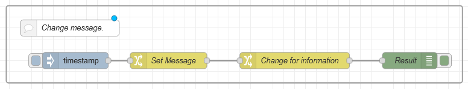
  <figcaption>Utiliser le changement de message pour formater la charge utile</figcaption>
</figure>
</div>

<div align="center">
<figure>
    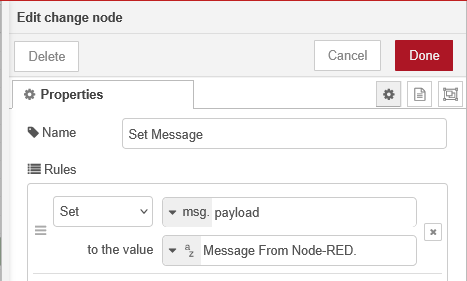
  <figcaption>Utiliser Définir dans un changement.</figcaption>
</figure>
</div>

<div align="center">
<figure>
    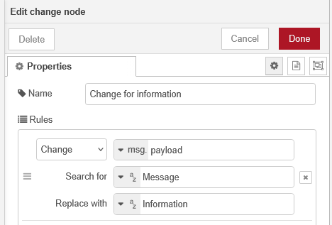
  <figcaption>Utiliser Changer dans un changement.</figcaption>
</figure>
</div>

En guise de sortie de débogage:

```json
"Information de Node-RED."
```

### Commutateur

<figure>
    
  <figcaption>Nœud de commutateur <a href="https://nodered.org">nodered.org</a></figcaption>
</figure>

Le nœud de commutateur permet d'acheminer les messages vers différentes branches d'un flux en évaluant un ensemble de règles par rapport à chaque message.

<div align="center">
<figure>
    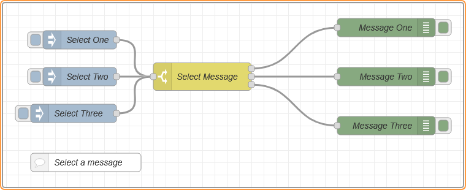
  <figcaption>Node-RED sélectionner un message</figcaption>
</figure>
</div>

Le nom **commutateur** vient de la **déclaration de commutation** qui est courante dans de nombreux langages de programmation. Ce n'est pas une référence à un commutateur physique.

Le nœud est configuré avec la propriété à tester - qui peut être soit une propriété de message soit une propriété de contexte.


Il y a quatre types de règles:

- Les règles de **valeur** sont évaluées par rapport à la propriété configurée
- Les règles de **séquence** peuvent être utilisées sur des séquences de messages, telles que celles générées par le nœud de division
- Une **expression** **JSONata** peut être fournie qui sera évaluée par rapport au message entier et correspondra si l'expression retourne une valeur true.
- Une règle **sinon** peut être utilisée pour correspondre si aucune des règles précédentes n'a correspondulé.

<div align="center">
<figure>
    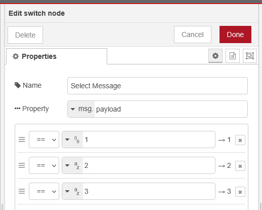
  <figcaption>Node-RED Modifier le nœud de commutateur</figcaption>
</figure>
</div>

Dans l'exemple ci-dessus, en fonction de la valeur de `charge utile`, le `commutateur` enverra un `message` dans l'un des `nœuds de débogage`.

Le nœud acheminera un message vers toutes les sorties correspondant aux règles correspondantes. Mais il peut également être configuré pour arrêter d'évaluer les règles lorsqu'il en trouve une qui correspond.

## Nœuds de séquence
:no_bell: *pour information seulement*

Nœuds vous permettant d'agir sur la séquence des messages transmis et ainsi d'influencer le flux.

### Nœud de division

<figure>
    
  <figcaption>Nœud de division</figcaption>
</figure>

### Nœud de jointure

<figure>
    
  <figcaption>Nœud de jointure</figcaption>
</figure>

### Nœud de tri

<figure>
    
  <figcaption>Nœud de tri</figcaption>
</figure>

### Nœud de lot

<figure>
    
  <figcaption>Nœud de lot</figcaption>
</figure>


 Exemples:

Permet de diviser un message entrant en plusieurs messages sortants.

Permet de regrouper plusieurs messages entrants en un seul message sortant.

## Nœuds réseau
:no_bell: *pour information seulement*

Nœuds pour gérer l'aspect réseau du flux, en configurant les requêtes HTTP, les websockets et les messages TCP ou UDP. Cette catégorie inclut également les nœuds MQTT (Mosquitto), si vous les installez.

## Analyseur
Nœuds pour traiter les données formatées et extraire les objets JavaScript utilisables par d'autres nœuds, ou pour formater un objet JavaScript dans le format souhaité. Ces nœuds peuvent gérer le formatage HTML, CSV, JSON, XML ou YAML.

> Sera développé dans un module ultérieur

## Stockage
Nœuds pour enregistrer les données de messages dans des fichiers. Ils vous permettent également de surveiller les fichiers pour détecter les modifications.
Cette catégorie inclut également les nœuds Influxdb et PostgreSQL, si vous les installez.

Le menu i fournit des explications détaillées pour chacun de ces nœuds.
> Sera développé dans un module ultérieur

---

## Travailler avec des messages
Un flux Node-RED fonctionne en transmettant des messages entre les nœuds. Les messages sont des objets JavaScript simples qui peuvent avoir n'importe quel ensemble de propriétés.

Les messages ont généralement une propriété de charge utile - c'est la propriété par défaut avec laquelle la plupart des nœuds travailleront.

Node-RED ajoute également une propriété appelée _msgid - c'est un identifiant pour le message qui peut être utilisé pour tracer sa progression dans un flux.

```json
{
    "_msgid": "12345",
    "payload": "..."
}
```

La valeur d'une propriété peut être n'importe quel type JavaScript valide, tel que:

- Booléen - true, false
- Nombre - par exemple 0, 123.4
- Chaîne - "bonjour"
- Tableau - [1,2,3,4]
- Objet - { "a": 1, "b": 2}
- Nul

[Plus d'informations sur les types JavaScript](https://developer.mozilla.org/en-US/docs/Web/JavaScript/Guide/Data_structures)

### Comprendre la structure d'un message

Le moyen le plus simple de comprendre la structure d'un message est de le transmettre à un nœud de débogage et de le visualiser dans la barre latérale de débogage.

Par défaut, le nœud de débogage affichera la propriété msg.payload, mais peut être configuré pour afficher n'importe quelle propriété ou le message entier.

Lors de l'affichage d'un tableau ou d'un objet, la barre latérale fournit une vue structurée qui peut être utilisée pour explorer le message.

<div align="center">
<figure>
    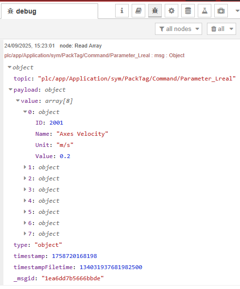
  <figcaption>Message Node-RED dans la fenêtre de débogage</figcaption>
</figure>
</div>

Le message est un objet.
- **topic** est le chemin d'accès à la variable de l'automate: `plc/app/Application/sym/PackTag/Command/Parameter_Lreal`
- **payload** est le message effectif à transmettre. C'est un objet, et cet objet contient une valeur qui est un tableau de 8 objets avec `ID`, `Name`, `Unit` et `Value`.
- **type** de charge utile est un `objet`.
- et **timestamp**, **timestampFiletime** et enfin: **_msgid**.

<div align="center">
<figure>
    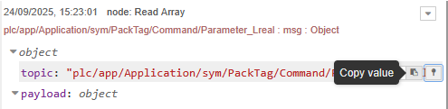
  <figcaption>Outils Node-RED dans la fenêtre de débogage</figcaption>
</figure>
</div>

<figure>
    
  <figcaption>Copier le chemin</figcaption>
</figure>

Copie le chemin d'accès à l'élément sélectionné dans votre presse-papiers. Cela vous permet de déterminer rapidement comment accéder à une propriété dans un nœud de changement ou de fonction

<figure>
    
  <figcaption>Copier la valeur</figcaption>
</figure>

Copie la valeur de l'élément dans votre presse-papiers sous forme de chaîne JSON. Notez que la barre latérale tronque les tableaux et tampons au-delà d'une certaine longueur. Copier la valeur d'une telle propriété copiera la version tronquée.

<figure>
    
  <figcaption>Épingles</figcaption>
</figure>

Épingle l'élément sélectionné afin qu'il soit toujours affiché. Lorsqu'un autre message est reçu du même nœud de débogage, il est automatiquement développé pour afficher tous les éléments épinglés.

### Travailler avec JSON

**JSON**, JavaScript Object Notation, est un moyen standard de représenter un objet JavaScript sous forme de chaîne. Il est couramment utilisé par les API web pour retourner des données.

Si une propriété de message contient une chaîne JSON, elle doit d'abord être analysée pour son objet JavaScript équivalent avant que les propriétés qu'elle contient puissent être accessibles. Pour déterminer si une propriété contient une chaîne ou un objet, le nœud de débogage peut être utilisé.

Node-RED fournit un nœud JSON pour effectuer cette conversion.

:bulb: si vous venez du monde Python...

#### JSON et Python: similaires mais pas identiques

| Concept        | JSON                          | Python                   |
| -------------- | ----------------------------- | ------------------------ |
| Type           | Format textuel (chaîne)       | Structure de données en mémoire |
| Conteneur principal | Objet `{}`                   | Dictionnaire `dict`        |
| Tableaux       | `[ ... ]`                     | Listes `[ ... ]`          |
| Chaînes        | `"texte"`                     | `'texte'` ou `"texte"`     |
| Nombres        | Pas de distinction (juste numérique) | `int`, `float`, etc.     |
| Booléens       | `true` / `false`              | `True` / `False`         |
| Nul            | `null`                        | `None`                   |

Donc:

#### Un objet JSON comme

```json
{"name": "Alice", "age": 30}
```

#### est équivalent à ce dictionnaire Python:

```python
{"name": "Alice", "age": 30}
```

### Modification des propriétés du message

Une tâche commune dans un flux est de modifier les propriétés d'un message au fur et à mesure qu'il passe entre les nœuds. Par exemple, le résultat d'une requête HTTP peut être un objet avec de nombreuses propriétés, dont seules certaines sont nécessaires.

Il y a deux nœuds principaux pour modifier un message, le nœud de fonction et le nœud de changement.

Le nœud de fonction vous permet d'exécuter n'importe quel code JavaScript par rapport au message. Cela vous donne une flexibilité complète dans ce que vous faites avec le message, mais nécessite une familiarité avec JavaScript et est inutile pour de nombreux cas simples. Plus d'informations sur la création de fonctions sont disponibles ici.

Le nœud de changement fournit beaucoup de fonctionnalités sans avoir besoin d'écrire du code JavaScript. Non seulement il peut modifier les propriétés du message, mais il peut également accéder au contexte de flux et global.

Il fournit quatre opérations de base:

    Définir une propriété à une valeur,
    Modifier une propriété de chaîne en effectuant une recherche et un remplacement,
    Supprimer une propriété,
    Déplacer une propriété.

Pour l'opération de définition, vous identifiez d'abord la propriété que vous souhaitez définir, puis la valeur que vous souhaitez qu'elle ait. Cette valeur peut soit être une valeur codée en dur, comme une chaîne ou un nombre, soit être tirée d'une autre propriété de message ou de contexte de flux/global. Il supporte également l'utilisation du langage d'expression JSONata pour calculer une nouvelle valeur.

Par exemple, en utilisant la capacité du nœud de débogage à déterminer le chemin d'accès d'un élément de message, vous pouvez coller le chemin directement dans le champ 'to', avec msg. sélectionné dans la liste. Cela définirait alors msg.payload à la valeur de msg.payload.Phone[2].type.


Un autre exemple, utilisant une expression JSONata, est de convertir une température, contenue dans msg.payload.temperature, de Fahrenheit à Celsius et de stocker le résultat dans une nouvelle propriété de message msg.payload.temperature_c.

### Séquences de messages

Une séquence de messages est une série ordonnée de messages qui sont liés d'une certaine manière. Par exemple, le nœud de division peut transformer un seul message dont la charge utile est un tableau en une séquence de messages où chaque message a une charge utile correspondant à l'un des éléments du tableau.

Comprendre msg.parts

Chaque message d'une séquence a une propriété appelée msg.parts. C'est un objet qui contient des informations sur la façon dont le message s'inscrit dans la séquence. Il possède les propriétés suivantes:

msg.parts.id
    un identifiant unique pour la séquence
msg.parts.index
    la position du message dans la séquence
msg.parts.count
    si connu, le nombre total de messages dans la séquence

Remarque: le tableau parts peut contenir des métadonnées supplémentaires sur la séquence. Par exemple, le nœud de division attache également des informations qui peuvent être utilisées par le nœud de jointure pour réassembler la séquence. Voir la documentation du nœud de division.

### Travailler avec les séquences

<figure>
    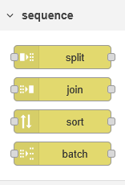
  <figcaption>Séquences</figcaption>
</figure>

Il y a un certain nombre de nœuds centraux qui peuvent fonctionner sur des séquences de messages:

#### Division

Transforme un seul message en une séquence de messages.

Le comportement exact du nœud dépend du type de msg.payload:

Chaîne/Tampon
    le message est divisé en utilisant le caractère spécifié (par défaut: `\n`), la séquence de tampon ou en longueurs fixes.
Tableau
    le message est divisé en éléments de tableau individuels ou en tableaux de longueur fixe.
Objet
    un message est envoyé pour chaque paire clé/valeur de l'objet.

#### Jointure

Transforme une séquence de messages en un seul message.

Le nœud fournit trois modes d'opération:

Automatique
    tente d'inverser l'action d'un nœud de division précédent
Manuel
    permet un meilleur contrôle sur la façon dont la séquence doit être jointe
Réduire
    Nouveau dans 0.18 - permet l'exécution d'une expression JSONata sur chaque message de la séquence et l'accumulation du résultat pour produire un seul message.

#### Tri

Nouveau dans 0.18

Trie la séquence en fonction de la valeur d'une propriété ou du résultat de l'expression JSONata.

#### Lot

Crée de nouvelles séquences de messages à partir de ceux reçus.

Le nœud fournit trois modes d'opération:

Nombre de messages
    groupe les messages en séquences d'une longueur donnée. L'option de chevauchement spécifie combien de messages à la fin d'une séquence doivent être répétés au début de la séquence suivante.
Intervalle de temps
    groupe les messages arrivant dans l'intervalle spécifié. Si aucun message n'arrive dans l'intervalle, le nœud peut éventuellement envoyer un message vide.
Concaténer les séquences
    crée une séquence de messages en concaténant les séquences entrantes. Chaque séquence doit avoir une propriété msg.topic pour l'identifier. Le nœud est configuré avec une liste de valeurs de topic pour identifier l'ordre des séquences concaténées.

## Expression JSONata?

## Votre travail
Installez Node-RED sur votre ordinateur portable. Utilisez ce lien pour être guidé sur la procédure: [Exécution de Node-RED en local](https://nodered.org/docs/getting-started/local)

### À propos des outils
<figure>
    
  <figcaption>node js <a href="https://nodejs.org/en/">nodejs.org</a></figcaption>
</figure>

## Quelle version de Node JS?
[Vérifiez la version prise en charge de node js pour Node-RED ici](https://nodered.org/docs/faq/node-versions).

[Télécharger pour Node js](https://nodejs.org/en/download).

### À propos des outils
<figure>
    
  <figcaption>npm Docs <a href="https://docs.npmjs.com/">npm</a></figcaption>
</figure>


## Qu'est-ce que npm?
Node Package Manager, **NPM**, est un outil pour installer des logiciels, tels que des modules ou des dépendances, pour les applications JavaScript. Il contribue à améliorer l'efficacité du développement Node.js en permettant aux utilisateurs d'accéder à des composants supplémentaires à partir d'un seul endroit.

**Important!** NPM peut faire référence soit à l'utilitaire que les développeurs utilisent pour télécharger des packages, soit au référentiel où les utilisateurs partagent leurs modules.

Le référentiel NPM contient actuellement des millions de packages et de modules.

Le téléchargement et la gestion des packages à partir de NPM utilisent l'interface de ligne de commande de votre système. Par défaut, cet utilitaire est automatiquement configuré après l'installation de Node.js.

---

#  [Dashboard 2.0 Interface utilisateur](UserInferface_FR.md)


<!-- Fin du README.md -->
