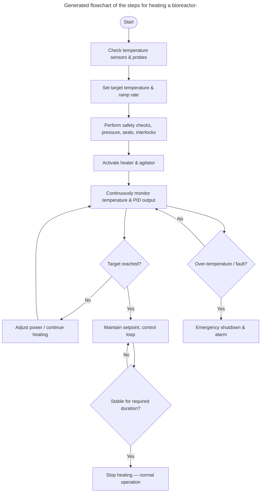

<h1>
  
  <br> ADP
    <h2>Interfaces</h2>
  <br>
</h1>

Author: [Cédric Lenoir](mailto:cedric.lenoir@hevs.ch)

# Module 04 User Interfaces

*Keywords:* **Dashboard 2**

<figure>
    
  <figcaption><a href="https://flowfuse.com/">FlowFuse</a></figcaption>
</figure>

## Introduction
The initial plan was to combine the machine and user interface into a single module. However, given the scope of the project, it was ultimately separated into two parts. We start with the User Interface

The purpose of this course is certainly based on the elements presented in this module. Node-RED is a tool that allows for the communication of messages. In our case, these messages are ultimately intended for two parties: the machine and the human user.

On the human user's side, we need information and a way to transmit it; this is provided by the Dashboard and its various nodes.

On the machine's side, we need an interface with the machine, principally the PLC.

### User Interface or HMI
UI or HMI, User Interface is a generic name for the specilization of a Human Machine Interface.

Historically it was a [node-red-dashboard](https://flows.nodered.org/node/node-red-dashboard) known as **Dashboard**, but this module is no longer maintained, **do not use it** except if it already in use in an existing projet.

We use the [@flowfuse/node-red-dashboard](https://flows.nodered.org/node/@flowfuse/node-red-dashboard) also known as **Dashboard 2**.

## Dashboard 2.0
It was a previous version, of the dashboard, but the components are no more updated and the dashboard 1.0 should no be used for new project.

If this course exist, this is mainly because of the Dashboard 2.0. The design of User Interface with knowledge of HTML, CSS and other web languages used in a lot of UI intefaces are not in the program of the system engineering program. But sometimes we need a simple and not expensive UI for some little projects.

> We have made the supposition Node-RED with Dashboard 2.0 could be used for a real.life project. The study was made during a Bachelor Thesis for an entrprise, and the conclusion is: Yes, we can use Node-RED as a professional UI solution.

If you look some professional User Interfaces for the industry, it could be difficult to identify if the application was made using Node-RED or other professional tools.

Below, an [exemple from ifm](https://www.ifm.com/ch) which is selling solutions and sensors for the industry. 

<div align="center">
<figure>
    
  <figcaption>ifm io-key</figcaption>
</figure>
</div>

<div align="center">
<figure>
    
  <figcaption>ifm iiot devices managed-architecture</figcaption>
</figure>
</div>

> When writing this paragraph, Dashboard has still a quick evolution. It is possible that when you will read this course some feature have changed. The actual version is: [@flowfuse/node-red-dashboard 1.29.0](https://github.com/FlowFuse/node-red-dashboard) 

---

### Hello Node-RED Dashboard
The first time you drop a dashboard node on the flow, you need to create two objets.

Your dasboard is build of
  - Many pages, like web pages.

Each page is build of
  - Many groups

Each groups is build of
  - a set of dashboard nodes, also known as **widgets**.

### Main settings of the dashboard

<div align="center">
<figure>
    
  <figcaption>Edit Settings, upper right corner</figcaption>
</figure>
</div>


#### Header Style option

- Default: (default) The title bar will appear as the first element, and scroll with the content, meaning that on longer pages, the title bar will not be visible when the page is scrolled.
- Hidden: The title bar is not visible at all.
- Fixed: The title bar will always be visible, even when the page is scrolled.

#### Header Content option

- Page Name: (default) This open will shift the entire content of the Dashboard when opened, and not be visible at all when closed.
- Dashboard Name: Will always remain open. At our mobile breakpoint (768px), this value is overridden, and an "Appear Over" option is used.
- Dashboard Name (Page Name): Similar to "Collapsing" when opened, but when closed, the icons for each page still show.
- None: The title bar is not visible at all.

#### Sidebar Style option

- Collapsing: (default) This open will shift the entire content of the Dashboard when opened, and not be visible at all when closed.
- Fixed: Will always remain open. At our mobile breakpoint (768px), this value is overridden, and an "Appear Over" option is used.
- Collapse to icons: Similar to "Collapsing" when opened, but when closed, the icons for each page still show.
- Appear over content: Not visible when closed, and when open, will appear over the Dashboard content, without shifting it.
- Always hide: The sidebar will not be visible under any circumstances. All pages are still accessible via their direct links or a ui-control node.

---

### Button
<div style="text-align: left ;">
<figure>
    
  <figcaption>Node button</figcaption>
</figure>
</div>

This is maybe the simplest User Interface node. But there is already a lot of options.

<div align="center">
<figure>
    
  <figcaption>Edit Button node</figcaption>
</figure>
</div>

- The name is optional, only usefull as comment in nodes.
- The group is mandatory, you have to select a **page** AND a **group**. This is where your button will be displayed.
- The size. We suggest, as soon as possible, to define a canevas of your page, that is, only auto, one, on more buttons on the same line, and so on.
- Icon, you can selet any icon from the [Material Design Icons website](https://pictogrammers.com/library/mdi/) and enter diretly the icon name.
- 
<figure>
    
</figure>

- We won't enter the details of CSS. **Cascading Style Sheets**, CSS, is a stylesheet language used to describe the presentation of a document written in HTML or XML. CSS describes how elements should be rendered on screen, on paper, in speech, or on other media. This is ouf the scope of this course.

- Select when you want to send the message, with **pointerdown**, **pointerup** or **click**.

1. ⚡ `pointerdown` ✅ Best for instant feedback, visual or tactile, This is the first event. The most responsive if you need quick action.
1. 🖱️ `onclick`  ✅ Best general-purpose choice for buttons.
1. 🖐️ `pointerup`✅ Best when action should happen on release, but you need finer control. Like a ready when you press the button, and start when you release it.

---

### Text input
<figure>
    
  <figcaption>Node text input</figcaption>
</figure>

- Mode, You could select various styles, including date picker.
  - **Text Input**: Standard text input field
  - **E-Mail Address**: Offers validation on any input to ensure it's a valid e-mail address.
  - **Password**: Hides the input from the user to offer protected input.
  - **Number**: Adds an up/down selector to choose an integer.
  - **Color Picker**: Displays a single block color selector
  - **Time Picker**: HH:mm formatted time picker
  - **Week Picker**: A Calendar widget to select a given full week, returns YYYY-W<WW>>
  - **Month Picker**: A Calendar widget to select a given month, returns YYYY-MM
  - **Datetime Picker**: A Calendar widget to select full datetime value. Returns YYY-MM-DDTHH:mm
- :information_source: Tooltip is the text displayed when the mouse is over the input cell, it helps to understand what the user should enter as information.

-  If msg arrives on input, pass through to output :heavy_check_mark:, allow to set initial value.

Some field have alredy be commented above. Do no forget that you can get help for the node by clicking the book :notebook: on the bottom left of the configuration window.

---

### Number input
Adds a single number input row to your dashboard

<figure>
    
  <figcaption>Node number input</figcaption>
</figure>

---

### Text
Displays a non-editable text field on the user interface. Each received `msg.payload` will update the value shown alongside the optional label. 

<figure>
    
  <figcaption>Node text</figcaption>
</figure>

---

### Form
<figure>
    
  <figcaption>Node form</figcaption>
</figure>

Adds a form to user interface.

Helps to collect multiple value from the user on submit button click as an object in msg.payload

Multiple input elements can be added using add elements button

Each element contains following components:

- **Label** : Value that will be the label of the element in the user interface
- **Name** : Represents the key (variable name) in the msg.payload in which the value of the corresponding element present
- **Type** : Drop down option to select the type of input element
- **Required** : On switching on the user has to supply the value before submitting
- **Rows** : number of UI rows for multiline text input
- **Delete** : To remove the current element from the form

<div align="center">
<figure>
    
  <figcaption>Node form example</figcaption>
</figure>
</div>

---

### Gauge
This node is easy to use and the design is appealing for displaying numerical values. The parameters are clear and require no special explanation.

<figure>
    
  <figcaption>Node gauge</figcaption>
</figure>

---

### Slider
After the gauge, here's another simple graphical element for selecting a numerical value.

You can define whether the value changes continuously or only when the pointer is released.

<figure>
    
  <figcaption>Node slider</figcaption>
</figure>

<div align="center">
<figure>
    
  <figcaption>An exemple with gauge and slider</figcaption>
</figure>
</div>

---

### Switch
Another easy to use node.

Adds a toggle switch to the user interface. 

<figure>
    
  <figcaption>Node switch</figcaption>
</figure>

<figure>
    
  <figcaption>You can use icon to help understanding the state of the switch</figcaption>
</figure>

<figure>
    
  </figure>

It could be usefull to [remember the link for icons](https://pictogrammers.com/library/mdi/). A picture is worth a thousand words.

---

### File input
:no_bell: This node will be detailed later in the section Data Management.

<figure>
    
  <figcaption>Node file input</figcaption>
</figure>

---

### Button group
A Node-RED node to show a switch with multiple buttons in the Node-RED Dashboard.


<figure>
    
  <figcaption>Node button group</figcaption>
</figure>

You can select icons and or text for these buttons.

<div align="center">
<figure>
    
  <figcaption>You can add as many button as you need</figcaption>
</figure>
</div>

---

### Dropdown

<figure>
    
  <figcaption>Node dropdown</figcaption>
</figure>

We will use this node to give how you can use dynamic parameters for a node UI.

I used Copilot to generate the list below. It is used as an array for `msg.ui_update.options`.

```json
[
    { "value": "1", "label": "Air temperature" },
    { "value": "2", "label": "Relative humidity" },
    { "value": "3", "label": "Atmospheric pressure" },
    { "value": "4", "label": "Wind speed" },
    { "value": "5", "label": "Wind direction" },
    { "value": "6", "label": "Precipitation" },
    { "value": "7", "label": "Solar radiation" },
    { "value": "8", "label": "UV index" },
    { "value": "9", "label": "Visibility" },
    { "value": "10", "label": "Cloud cover" },
    { "value": "11", "label": "Soil moisture" },
    { "value": "12", "label": "Soil temperature" },
    { "value": "13", "label": "Snow depth" },
    { "value": "14", "label": "Air quality (PM2.5)" },
    { "value": "15", "label": "Air quality (PM10)" },
    { "value": "16", "label": "CO2" },
    { "value": "17", "label": "Ozone (O3)" },
    { "value": "18", "label": "Battery voltage" },
    { "value": "19", "label": "Water level" },
    { "value": "20", "label": "Electrical conductivity" }
]
```

Then I use this list to generate dynamically the list in an inject node with option : Inject onces after 0.1 seconds.

<div align="center">
<figure>
    
  <figcaption>Generate drop list is generated once. It could be a message.</figcaption>
</figure>
</div>

<div align="center">
<figure>
    
  <figcaption>msg.ui_update.options given in the help of dropdown node</figcaption>
</figure>
</div>

Result:

<div align="center">
<figure>
    
  <figcaption>You could even use an external csv file to generate the list</figcaption>
</figure>
</div>

---

### Radio group
Adds a radio group to your dashboard that will emit values in Node-RED under `msg.payload` anytime a value is selected. 

<figure>
    
  <figcaption>Node radio group</figcaption>
</figure>

<div align="center">
<figure>
    
  <figcaption>Another easy to use node, you can select only one button</figcaption>
</figure>
</div>

---

### Table

<figure>
    
  <figcaption>Node table</figcaption>
</figure>

Maybe one of the more powerfull feature of the Dashboard 2.0
Using a table, you can read and display directly an array of object without any other manipulation.

We can sort the table according to any criterion.

Finally, we can select any value from the table simply by clicking on a row.

This node is waiting for an array of objects, like this one:

```
[{"ID":1001,"Name":"Axes Velocity","Unit":"m/s","Value":0.2},
 {"ID":1002,"Name":"Axes Acceleration","Unit":"m/s2","Value":1.1},
 {"ID":1003,"Name":"Axes Deceleration","Unit":"m/s2","Value":2.2},
 {"ID":1004,"Name":"Axes Jerk","Unit":"m/s3","Value":21.5}
]
```

From thie array, it will display a table like this one:

<div align="center">
<figure>
    
  <figcaption>An array with search option</figcaption>
</figure>
</div>

If you type any label of the table in the search field, it will automatically sort the values.

In the exemple, we use a node of the ctrlX Automation palette to read a an array directly from the PLC. [This is the next paragraph](#machine-interface).

<div align="center">
<figure>
    
  <figcaption>We use a node interface from the PLC</figcaption>
</figure>
</div>

We just have to insert a change note, because the PLC node does not send an array, but an objet of the form: ``{"value":[array]}``.

This is a typicall use of a change node.


<div align="center">
<figure>
    
  <figcaption>We send the value element of the object, which is itself an array.</figcaption>
</figure>
</div>

---

### Markdown
Converts **markdown** to rendered HTML into the Dashboard.

Can be use for rendering labels, headers or even full blog articles. If you're looking for a quick cheat sheet on how to write Markdown, you can check out FlowFuse's guide here.

This node use markdown, that is, the same format as this used to write this course.


<figure>
    
  <figcaption>Node markdown</figcaption>
</figure>

---
In **Node-RED**, the **Markdown node** is used to **render and display text formatted with Markdown syntax** (like headings, bold, italics, lists, links, code blocks, etc.) within the **Node-RED Dashboard** or **UI**.

It’s useful when you want to show **descriptive text**, **instructions**, **formatted messages**, or **status updates** in a clean, readable format directly on your dashboard.

**Example use cases:**

* Display a help section or system info.
* Show formatted logs or documentation.
* Add styled labels or notes between dashboard elements.

In short, it **turns Markdown text into nicely formatted HTML** for better presentation in your Node-RED user interface.

Here’s the same explanation, now formatted as a **Markdown table** with some icons and a link to the **FlowFuse documentation**:

---

|    🧩 **Node**    | 📖 **Description** | 💡 **Use Cases**| 🔗 **More Info**|
| :---------------: | :------------------------- | :--------------------- | :---------------- |
| **Markdown Node** | Some description| ✅ Display help or documentation<br>✅ Show formatted system info or logs<br>✅ Add styled labels, titles, or notes to dashboards | 🌐 [FlowFuse Documentation](https://flowfuse.com/docs/) |

---

<div align="center">
<figure>
    
  <figcaption>What you can read in Node-RED dashboard</figcaption>
</figure>
</div>

> This node is very usefull for the documentation of your work.

> The nice side is that this is the same format as used by ChatGPT, the example above is a simple copy paste of an AI.

#### Insert charts in your documentation.

**Mermaid flowcharts** are diagrams written in a simple, human-readable text syntax that Mermaid.js converts into graphical flowcharts (SVG/PNG). They let you describe nodes, decisions, and connections in plain text so diagrams can be versioned, edited, and rendered alongside Markdown.

For more information about mermaid charts, see [mermaid documentation](https://docs.mermaidchart.com/)



Below is what you can get diretly in a Node-RED dashboard.

<div align="center">
<figure>
    
  <figcaption>The same diagram from a screenshot</figcaption>
</figure>
</div>

---

### Chart
:no_bell: *for information only

This is probably one of the most interesting options in the Dashboard, but its complexity means that the time required to address it exceeds the scope of a single module. We will cover it in a separate module as the main module progresses.

<figure>
    
  <figcaption>Node chart</figcaption>
</figure>

> More details and examples can be found in the [online documentation](https://dashboard.flowfuse.com/nodes/widgets/ui-chart.html) for Dashboard.

---

### Template
:no_bell: *for information only, this is for advanced use of Node-RED, out of the scope of this course.*

<figure>
    
  <figcaption>Node template</figcaption>
</figure>

See [full documentation](https://dashboard.flowfuse.com/nodes/widgets/ui-template.html), it allows to design custom dashboard nodes.

---

### Event
:no_bell: *for information only, this is for advanced use of Node-RED, out of the scope of this course.*

<figure>
    
  <figcaption>Node event</figcaption>
</figure>

---

### Notification
To display a dynamic event to inform the user about an event. Easy to use.

In a simple form, will display the text comming thru a ``msg.payload``.

<figure>
    
  <figcaption>Node notification</figcaption>
</figure>

<div align="center">
<figure>
    
  <figcaption>A simple notification in the center of the screen</figcaption>
</figure>
</div>

---

### UI control
:no_bell: *for dynamic control of UI nodes, out of the scope ot this course*

<figure>
    
  <figcaption>Node ui control</figcaption>
</figure>

---


<!-- End of README.md -->
