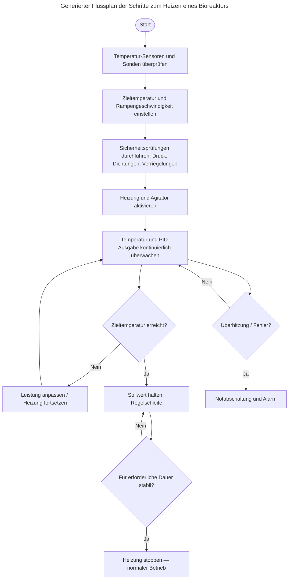

<h1>
  
  <br> ADP
    <h2>Schnittstellen</h2>
  <br>
</h1>

Autor: [Cédric Lenoir](mailto:cedric.lenoir@hevs.ch)

# Modul 04 Benutzeroberflächen

*Schlüsselwörter:* **Dashboard 2**

<figure>
    
  <figcaption><a href="https://flowfuse.com/">FlowFuse</a></figcaption>
</figure>

## Einführung
Der ursprüngliche Plan war, die Maschine und die Benutzeroberfläche in einem einzigen Modul zu kombinieren. Allerdings wurde es angesichts des Umfangs des Projekts letztendlich in zwei Teile aufgeteilt. Wir beginnen mit der Benutzeroberfläche.

Der Zweck dieses Kurses basiert sicherlich auf der in diesem Modul vorgestellte Elemente. Node-RED ist ein Werkzeug, das die Kommunikation von Nachrichten ermöglicht. In unserem Fall sind diese Nachrichten letztendlich für zwei Parteien bestimmt: die Maschine und den menschlichen Benutzer.

Auf Seite des menschlichen Benutzers benötigen wir Informationen und eine Möglichkeit, diese zu übertragen; dies wird durch das Dashboard und seine verschiedenen Knoten bereitgestellt.

Auf Seite der Maschine benötigen wir eine Schnittstelle zur Maschine, hauptsächlich zur SPS.

### Benutzeroberfläche oder HMI
UI oder HMI, Benutzeroberfläche ist ein generischer Name für die Spezialisierung einer Mensch-Maschine-Schnittstelle.

Historisch gesehen war es ein [node-red-dashboard](https://flows.nodered.org/node/node-red-dashboard), bekannt als **Dashboard**, aber dieses Modul wird nicht mehr gepflegt, **verwenden Sie es nicht**, es sei denn, es wird bereits in einem bestehenden Projekt verwendet.

Wir verwenden [@flowfuse/node-red-dashboard](https://flows.nodered.org/node/@flowfuse/node-red-dashboard), auch bekannt als **Dashboard 2**.

## Dashboard 2.0
Es war eine frühere Version des Dashboards, aber die Komponenten werden nicht mehr aktualisiert und Dashboard 1.0 sollte nicht für neue Projekte verwendet werden.

Wenn dieser Kurs existiert, liegt dies hauptsächlich an Dashboard 2.0. Die Gestaltung von Benutzeroberflächen mit Kenntnissen in HTML, CSS und anderen Websprachen, die in vielen UI-Schnittstellen verwendet werden, sind nicht Teil des Lehrplans des Systemtechnik-Studiengangs. Manchmal benötigen wir jedoch eine einfache und kostengünstige Benutzeroberfläche für einige kleine Projekte.

> Wir haben die Annahme gemacht, dass Node-RED mit Dashboard 2.0 für ein echtes Projekt verwendet werden könnte. Die Studie wurde während einer Bachelor-Thesis für ein Unternehmen durchgeführt, und das Ergebnis lautet: Ja, wir können Node-RED als professionelle UI-Lösung verwenden.

Wenn Sie sich einige professionelle Benutzeroberflächen für die Industrie ansehen, kann es schwierig sein zu erkennen, ob die Anwendung mit Node-RED oder anderen professionellen Werkzeugen entwickelt wurde.

Unten finden Sie ein [Beispiel von ifm](https://www.ifm.com/ch), das Lösungen und Sensoren für die Industrie verkauft.

<div align="center">
<figure>
    
  <figcaption>ifm io-key</figcaption>
</figure>
</div>

<div align="center">
<figure>
    
  <figcaption>ifm iiot devices managed-architecture</figcaption>
</figure>
</div>

> Bei der Verfassung dieses Absatzes entwickelte sich Dashboard noch schnell. Es ist möglich, dass bei der Lektüre dieses Kurses einige Funktionen geändert haben. Die aktuelle Version ist: [@flowfuse/node-red-dashboard 1.29.0](https://github.com/FlowFuse/node-red-dashboard)

---

### Hallo Node-RED Dashboard
Wenn Sie zum ersten Mal einen Dashboard-Knoten auf den Flow ziehen, müssen Sie zwei Objekte erstellen.

Ihr Dashboard besteht aus
  - Vielen Seiten, wie Webseiten.

Jede Seite besteht aus
  - Vielen Gruppen

Jede Gruppe besteht aus
  - Einer Reihe von Dashboard-Knoten, auch als **Widgets** bekannt.

### Haupteinstellungen des Dashboards

<div align="center">
<figure>
    
  <figcaption>Einstellungen bearbeiten, rechte obere Ecke</figcaption>
</figure>
</div>


#### Option für den Header-Stil

- Standard: (Standard) Die Titelleiste wird als erstes Element angezeigt und scrollt mit dem Inhalt, was bedeutet, dass auf längeren Seiten die Titelleiste beim Scrollen nicht sichtbar ist.
- Verborgen: Die Titelleiste ist überhaupt nicht sichtbar.
- Fest: Die Titelleiste wird immer sichtbar sein, auch wenn die Seite gescrollt wird.

#### Option für Header-Inhalt

- Seitenname: (Standard) Dies wirkt sich beim Öffnen auf den gesamten Inhalt des Dashboards aus und ist überhaupt nicht sichtbar, wenn geschlossen.
- Dashboard-Name: Bleibt immer offen. Bei unserem mobilen Breakpoint (768px) wird dieser Wert überschrieben und eine "Darüber erscheinen"-Option verwendet.
- Dashboard-Name (Seitenname): Ähnlich wie "Einklappar" wenn offen, aber wenn geschlossen, sind die Symbole für jede Seite immer noch sichtbar.
- Keine: Die Titelleiste ist überhaupt nicht sichtbar.

#### Option für den Seitenleisten-Stil

- Einklappbar: (Standard) Dies wirkt sich beim Öffnen auf den gesamten Inhalt des Dashboards aus und ist überhaupt nicht sichtbar, wenn geschlossen.
- Fest: Bleibt immer offen. Bei unserem mobilen Breakpoint (768px) wird dieser Wert überschrieben und eine "Darüber erscheinen"-Option verwendet.
- Auf Symbole einklappen: Ähnlich wie "Einklappbar" wenn offen, aber wenn geschlossen, sind die Symbole für jede Seite immer noch sichtbar.
- Über Inhalt erscheinen: Nicht sichtbar, wenn geschlossen, und wenn offen, wird es über dem Dashboard-Inhalt angezeigt, ohne ihn zu verschieben.
- Immer ausblenden: Die Seitenleiste wird unter keinen Umständen sichtbar sein. Auf alle Seiten kann immer noch über ihre direkten Links oder einen ui-control-Knoten zugegriffen werden.

---

### Schaltfläche
<div style="text-align: left ;">
<figure>
    
  <figcaption>Schaltflächen-Knoten</figcaption>
</figure>
</div>

Dies ist vielleicht der einfachste Benutzeroberflächen-Knoten. Aber es gibt bereits viele Optionen.

<div align="center">
<figure>
    
  <figcaption>Schaltflächen-Knoten bearbeiten</figcaption>
</figure>
</div>

- Der Name ist optional, nur als Kommentar in Knoten nützlich.
- Die Gruppe ist obligatorisch, Sie müssen eine **Seite** UND eine **Gruppe** auswählen. Hier wird Ihre Schaltfläche angezeigt.
- Die Größe. Wir empfehlen, so schnell wie möglich eine Leinwand Ihrer Seite zu definieren, d.h. nur Auto, eine oder mehrere Schaltflächen auf der gleichen Zeile, etc.
- Symbol, Sie können ein beliebiges Symbol aus der [Material Design Icons Website](https://pictogrammers.com/library/mdi/) auswählen und den Namen direkt eingeben.

<figure>
    
</figure>

- Wir werden nicht auf die Details von CSS eingehen. **Cascading Style Sheets**, CSS, ist eine Stilsprachensprache, die zur Beschreibung der Präsentation eines in HTML oder XML geschriebenen Dokuments verwendet wird. CSS beschreibt, wie Elemente auf dem Bildschirm, auf Papier, in Sprache oder auf anderen Medien dargestellt werden sollen. Dies liegt außerhalb des Rahmens dieses Kurses.

- Wählen Sie aus, wann Sie die Nachricht senden möchten, mit **pointerdown**, **pointerup** oder **click**.

1. ⚡ `pointerdown` ✅ Beste für sofortiges Feedback, visuell oder taktil. Dies ist das erste Ereignis. Am responsivsten, wenn Sie schnelle Aktion benötigen.
1. 🖱️ `onclick` ✅ Beste allgemeine Wahl für Schaltflächen.
1. 🖐️ `pointerup` ✅ Am besten, wenn eine Aktion beim Loslassen erfolgen sollte, aber Sie brauchen eine feinere Kontrolle. Wie bereit, wenn Sie die Schaltfläche drücken und starten, wenn Sie sie loslassen.

---

### Texteingabe
<figure>
    
  <figcaption>Text-Eingabe-Knoten</figcaption>
</figure>

- Modus, Sie können verschiedene Stile auswählen, einschließlich Datumsauswahl.
  - **Texteingabe**: Standard-Texteingabefeld
  - **E-Mail-Adresse**: Bietet Validierung für alle Eingaben, um sicherzustellen, dass es eine gültige E-Mail-Adresse ist.
  - **Passwort**: Verbirgt die Eingabe vor dem Benutzer, um einen schützenden Eingabe zu bieten.
  - **Zahl**: Fügt einen Auf-/Ab-Selector hinzu, um eine ganze Zahl zu wählen.
  - **Farbwähler**: Zeigt einen einzelnen Blockfarbselector
  - **Zeitwähler**: Zeitwähler im Format HH:mm
  - **Wochenwähler**: Ein Kalender-Widget zum Auswählen einer bestimmten vollständigen Woche, gibt YYYY-W<WW>> zurück
  - **Monatswähler**: Ein Kalender-Widget zum Auswählen eines bestimmten Monats, gibt YYYY-MM zurück
  - **Datum/Zeit-Wähler**: Ein Kalender-Widget zum Auswählen des vollständigen Datums-Zeit-Werts. Gibt YYY-MM-DDTHH:mm zurück
- :information_source: Das Tooltip ist der Text, der angezeigt wird, wenn sich die Maus über der Eingabezelle befindet. Es hilft zu verstehen, was der Benutzer als Informationen eingeben sollte.

- Wenn msg auf Input ankommt, geben Sie Output aus :heavy_check_mark:, ermöglicht das Festlegen des Startwerts.

Einige Felder wurden bereits oben kommentiert. Denken Sie daran, dass Sie Hilfe für den Knoten erhalten können, indem Sie auf das Buch :notebook: in der unteren linken Ecke des Konfigurationsfensters klicken.

---

### Zahleneingabe
Fügt eine einzelne Zahleneingabezeile zu Ihrem Dashboard hinzu

<figure>
    
  <figcaption>Zahleneingabe-Knoten</figcaption>
</figure>

---

### Text
Zeigt ein nicht editierbares Textfeld auf der Benutzeroberfläche an. Jedes empfangene `msg.payload` aktualisiert den Wert, der neben dem optionalen Label angezeigt wird.

<figure>
    
  <figcaption>Text-Knoten</figcaption>
</figure>

---

### Formular
<figure>
    
  <figcaption>Formular-Knoten</figcaption>
</figure>

Fügt ein Formular zur Benutzeroberfläche hinzu.

Hilft, mehrere Werte vom Benutzer bei Klick der Schaltfläche Absenden als Objekt in msg.payload zu sammeln

Mehrere Eingabeelemente können mit der Schaltfläche Elemente hinzufügen hinzugefügt werden

Jedes Element enthält die folgenden Komponenten:

- **Label** : Wert, der das Label des Elements in der Benutzeroberfläche darstellt
- **Name** : Stellt den Schlüssel (Variablenname) in msg.payload dar, in dem der Wert des entsprechenden Elements vorhanden ist
- **Typ** : Drop-down-Option zum Auswählen des Eingabeelementstyps
- **Erforderlich** : Bei Aktivierung muss der Benutzer den Wert vor dem Absenden angeben
- **Zeilen** : Anzahl der UI-Zeilen für mehrzeilige Texteingabe
- **Löschen** : Um das aktuelle Element aus dem Formular zu entfernen

<div align="center">
<figure>
    
  <figcaption>Beispiel eines Formular-Knotens</figcaption>
</figure>
</div>

---

### Manometer
Dieser Knoten ist einfach zu bedienen und das Design ist attraktiv zum Anzeigen von Zahlenwerten. Die Parameter sind klar und erfordern keine besondere Erklärung.

<figure>
    
  <figcaption>Manometer-Knoten</figcaption>
</figure>

---

### Schieberegler
Nach dem Manometer, hier ist ein anderes einfaches grafisches Element zum Auswählen eines Zahlenwerts.

Sie können festlegen, ob sich der Wert kontinuierlich ändert oder nur wenn der Zeiger freigegeben wird.

<figure>
    
  <figcaption>Schieberegler-Knoten</figcaption>
</figure>

<div align="center">
<figure>
    
  <figcaption>Ein Beispiel mit Manometer und Schieberegler</figcaption>
</figure>
</div>

---

### Schalter
Ein anderer einfach zu bedienender Knoten.

Fügt einen Umschalter zur Benutzeroberfläche hinzu.

<figure>
    
  <figcaption>Schalter-Knoten</figcaption>
</figure>

<figure>
    
  <figcaption>Sie können das Symbol verwenden, um den Status des Schalters zu verstehen</figcaption>
</figure>

<figure>
    
  </figure>

Es könnte hilfreich sein, sich den [Link für Symbole zu merken](https://pictogrammers.com/library/mdi/). Ein Bild ist mehr als tausend Worte.

---

### Dateieingabe
:no_bell: Dieser Knoten wird später im Abschnitt Datenverwaltung detailliert beschrieben.

<figure>
    
  <figcaption>Dateieingabe-Knoten</figcaption>
</figure>

---

### Schaltflächengruppe
Ein Node-RED-Knoten zum Anzeigen eines Schalters mit mehreren Schaltflächen im Node-RED-Dashboard.

<figure>
    
  <figcaption>Schaltflächengruppen-Knoten</figcaption>
</figure>

Sie können Symbole und/oder Text für diese Schaltflächen auswählen.

<div align="center">
<figure>
    
  <figcaption>Sie können so viele Schaltflächen hinzufügen, wie Sie benötigen</figcaption>
</figure>
</div>

---

### Dropdown-Liste

<figure>
    
  <figcaption>Dropdown-Knoten</figcaption>
</figure>

Wir werden diesen Knoten verwenden, um zu zeigen, wie Sie dynamische Parameter für einen UI-Knoten verwenden können.

Ich habe Copilot verwendet, um die folgende Liste zu generieren. Sie wird als Array für `msg.ui_update.options` verwendet.

```json
[
    { "value": "1", "label": "Lufttemperatur" },
    { "value": "2", "label": "Relative Luftfeuchtigkeit" },
    { "value": "3", "label": "Luftdruck" },
    { "value": "4", "label": "Windgeschwindigkeit" },
    { "value": "5", "label": "Windrichtung" },
    { "value": "6", "label": "Niederschlag" },
    { "value": "7", "label": "Sonneneinstrahlung" },
    { "value": "8", "label": "UV-Index" },
    { "value": "9", "label": "Sichtweite" },
    { "value": "10", "label": "Wolkenbedeckung" },
    { "value": "11", "label": "Bodenfeuchtigkeit" },
    { "value": "12", "label": "Bodentemperatur" },
    { "value": "13", "label": "Schneetiefe" },
    { "value": "14", "label": "Luftqualität (PM2.5)" },
    { "value": "15", "label": "Luftqualität (PM10)" },
    { "value": "16", "label": "CO2" },
    { "value": "17", "label": "Ozon (O3)" },
    { "value": "18", "label": "Batteriespannung" },
    { "value": "19", "label": "Wasserpegel" },
    { "value": "20", "label": "Elektrische Leitfähigkeit" }
]
```

Dann verwende ich diese Liste, um dynamisch die Liste in einem Inject-Knoten mit Option zu generieren: Einmal nach 0,1 Sekunden injizieren.

<div align="center">
<figure>
    
  <figcaption>Generate drop list wird einmal generiert. Es könnte eine Nachricht sein.</figcaption>
</figure>
</div>

<div align="center">
<figure>
    
  <figcaption>msg.ui_update.options in der Hilfe des Dropdown-Knotens gegeben</figcaption>
</figure>
</div>

Ergebnis:

<div align="center">
<figure>
    
  <figcaption>Sie könnten sogar eine externe CSV-Datei verwenden, um die Liste zu generieren</figcaption>
</figure>
</div>

---

### Radiobutton-Gruppe
Fügt Ihrem Dashboard eine Radiobutton-Gruppe hinzu, die Werte in Node-RED unter `msg.payload` jedes Mal emittiert, wenn ein Wert ausgewählt wird.

<figure>
    
  <figcaption>Radiobutton-Gruppen-Knoten</figcaption>
</figure>

<div align="center">
<figure>
    
  <figcaption>Ein weiterer einfach zu bedienender Knoten, Sie können nur eine Schaltfläche auswählen</figcaption>
</figure>
</div>

---

### Tabelle

<figure>
    
  <figcaption>Tabellen-Knoten</figcaption>
</figure>

Vielleicht eine der leistungsstärksten Funktionen von Dashboard 2.0
Mit einer Tabelle können Sie direkt ein Objekt-Array lesen und anzeigen, ohne weitere Manipulation.

Wir können die Tabelle nach jedem Kriterium sortieren.

Schließlich können wir jeden Wert aus der Tabelle einfach auswählen, indem wir auf eine Zeile klicken.

Dieser Knoten erwartet ein Array von Objekten, wie dieses:

```
[{"ID":1001,"Name":"Axes Velocity","Unit":"m/s","Value":0.2},
 {"ID":1002,"Name":"Axes Acceleration","Unit":"m/s2","Value":1.1},
 {"ID":1003,"Name":"Axes Deceleration","Unit":"m/s2","Value":2.2},
 {"ID":1004,"Name":"Axes Jerk","Unit":"m/s3","Value":21.5}
]
```

Aus diesem Array wird eine Tabelle wie diese angezeigt:

<div align="center">
<figure>
    
  <figcaption>Ein Array mit Suchoption</figcaption>
</figure>
</div>

Wenn Sie eine beliebige Bezeichnung der Tabelle in das Suchfeld eingeben, werden die Werte automatisch sortiert.

Im Beispiel verwenden wir einen Knoten der ctrlX Automation-Palette, um ein Array direkt von der SPS zu lesen. [Dies ist der nächste Absatz](#machine-interface).

<div align="center">
<figure>
    
  <figcaption>Wir verwenden einen Schnittstellen-Knoten von der SPS</figcaption>
</figure>
</div>

Wir müssen nur einen Change-Knoten einfügen, da der SPS-Knoten kein Array sendet, sondern ein Objekt der Form: ``{"value":[array]}``.

Dies ist eine typische Verwendung eines Change-Knotens.

<div align="center">
<figure>
    
  <figcaption>Wir senden das Value-Element des Objekts, das selbst ein Array ist.</figcaption>
</figure>
</div>

---

### Markdown
Konvertiert **Markdown** in gerenderes HTML ins Dashboard.

Kann zum Rendering von Labels, Überschriften oder sogar ganzen Blog-Artikeln verwendet werden. Wenn Sie einen schnellen Spickzettel zu Markdown schreiben suchen, können Sie hier nach FlowFuse's Leitfaden schauen.

Dieser Knoten verwendet Markdown, dasselbe Format wie das zum Schreiben dieses Kurses verwendete.

<figure>
    
  <figcaption>Markdown-Knoten</figcaption>
</figure>

---

In **Node-RED** wird der **Markdown-Knoten** verwendet, um **Text mit Markdown-Syntax zu rendern und anzuzeigen** (wie Überschriften, Fett, Kursiv, Listen, Links, Codeblöcke usw.) in **Node-RED Dashboard** oder **UI**.

Es ist nützlich, wenn Sie **beschreibenden Text**, **Anweisungen**, **formatierte Nachrichten** oder **Statusupdates** in einem sauberen, lesbaren Format direkt auf Ihrem Dashboard anzeigen möchten.

**Beispiel-Anwendungsfälle:**

* Zeigen Sie einen Hilfbereich oder Systeminformationen an.
* Zeigen Sie formatierte Protokolle oder Dokumentation an.
* Fügen Sie gepflegte Etiketten oder Notizen zwischen Dashboard-Elementen hinzu.

Kurz gesagt, es **wandelt Markdown-Text in schön formatiertes HTML um** für eine bessere Präsentation in Ihrer Node-RED-Benutzeroberfläche.

Hier ist die gleiche Erklärung, jetzt formatiert als **Markdown-Tabelle** mit einigen Symbolen und einem Link zur **FlowFuse-Dokumentation**:

---

|    🧩 **Knoten**    | 📖 **Beschreibung** | 💡 **Anwendungsfälle**| 🔗 **Weitere Infos**|
| :---------------: | :------------------------- | :--------------------- | :---------------- |
| **Markdown-Knoten** | Einige Beschreibung| ✅ Hilfe oder Dokumentation anzeigen<br>✅ Formatierte Systeminformationen oder Protokolle anzeigen<br>✅ Gepflegte Etiketten, Titel oder Notizen zu Dashboards hinzufügen | 🌐 [FlowFuse-Dokumentation](https://flowfuse.com/docs/) |

---

<div align="center">
<figure>
    
  <figcaption>Was Sie im Node-RED Dashboard lesen können</figcaption>
</figure>
</div>

> Dieser Knoten ist sehr nützlich für die Dokumentation Ihrer Arbeit.

> Die schöne Seite ist, dass dies das gleiche Format ist, das von ChatGPT verwendet wird, das obige Beispiel ist ein einfaches Copy-Paste einer KI.

#### Fügen Sie Diagramme in Ihrer Dokumentation ein.

**Mermaid-Flussdiagramme** sind Diagramme, die in einer einfachen, Menschen lesbaren Textsyntax geschrieben sind, die Mermaid.js in grafische Flussdiagramme (SVG/PNG) konvertiert. Sie lassen Sie Knoten, Entscheidungen und Verbindungen in Klartext beschreiben, so dass Diagramme versionsiert, bearbeitet und neben Markdown gerendert werden können.

Weitere Informationen zu Mermaid-Diagrammen finden Sie in der [Mermaid-Dokumentation](https://docs.mermaidchart.com/)



Unten sehen Sie, was Sie direkt in einem Node-RED Dashboard erhalten können.

<div align="center">
<figure>
    
  <figcaption>Dasselbe Diagramm aus einem Screenshot</figcaption>
</figure>
</div>

---

### Diagramm
:no_bell: *nur für Informationen

Dies ist wahrscheinlich eine der interessantesten Optionen im Dashboard, aber seine Komplexität bedeutet, dass die Zeit, die für sein Behandlung erforderlich ist, den Bereich eines einzelnen Moduls übersteigt. Wir werden es in einem separaten Modul behandeln, wenn der Hauptmodul fortschreitet.

<figure>
    
  <figcaption>Diagramm-Knoten</figcaption>
</figure>

> Weitere Details und Beispiele finden Sie in der [Online-Dokumentation](https://dashboard.flowfuse.com/nodes/widgets/ui-chart.html) für das Dashboard.

---

### Vorlage
:no_bell: *nur für Information, dies ist für fortgeschrittene Verwendung von Node-RED, außerhalb des Rahmens dieses Kurses.*

<figure>
    
  <figcaption>Vorlagen-Knoten</figcaption>
</figure>

Siehe [vollständige Dokumentation](https://dashboard.flowfuse.com/nodes/widgets/ui-template.html), es ermöglicht, benutzerdefinierte Dashboard-Knoten zu gestalten.

---

### Ereignis
:no_bell: *nur für Information, dies ist für fortgeschrittene Verwendung von Node-RED, außerhalb des Rahmens dieses Kurses.*

<figure>
    
  <figcaption>Ereignis-Knoten</figcaption>
</figure>

---

### Benachrichtigung
Um ein dynamisches Ereignis anzuzeigen, um den Benutzer über ein Ereignis zu informieren. Leicht zu bedienen.

In einer einfachen Form wird der Text angezeigt, der von einem ``msg.payload`` kommt.

<figure>
    
  <figcaption>Benachrichtigungs-Knoten</figcaption>
</figure>

<div align="center">
<figure>
    
  <figcaption>Eine einfache Benachrichtigung in der Mitte des Bildschirms</figcaption>
</figure>
</div>

---

### UI-Steuerung
:no_bell: *für die dynamische Kontrolle von UI-Knoten, außerhalb des Rahmens dieses Kurses*

<figure>
    
  <figcaption>UI-Steuerungs-Knoten</figcaption>
</figure>

---

<!-- Ende von UserInterface_DE.md -->
