<h1>
  
  <br> ADP
    <h2>Interfaces</h2>
  <br>
</h1>

Auteur : [Cédric Lenoir](mailto:cedric.lenoir@hevs.ch)

# Module 12 Interfaces Utilisateur

*Mots-clés :* **Dashboard 2**

<figure>
    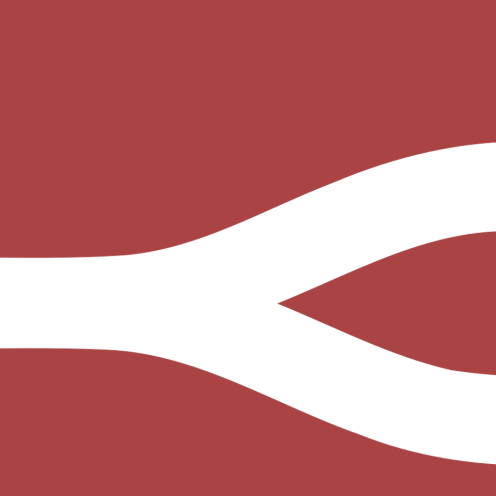
  <figcaption><a href="https://flowfuse.com/">FlowFuse</a></figcaption>
</figure>

## Introduction
Le plan initial était de combiner la machine et l'interface utilisateur dans un seul module. Cependant, compte tenu de l'ampleur du projet, il a finalement été séparé en deux parties. Nous commençons par l'Interface Utilisateur.

L'objectif de ce cours est certainement basé sur les éléments présentés dans ce module. Node-RED est un outil qui permet la communication des messages. Dans notre cas, ces messages sont finalement destinés à deux parties : la machine et l'utilisateur humain.

Du côté de l'utilisateur humain, nous avons besoin d'informations et d'un moyen de les transmettre ; ceci est fourni par le Dashboard et ses différents nœuds.

Du côté de la machine, nous avons besoin d'une interface avec la machine, principalement l'API.

### Interface Utilisateur ou IHM
UI ou IHM, Interface Utilisateur est un nom générique pour la spécialisation d'une Interface Homme-Machine.

Historiquement, c'était un [node-red-dashboard](https://flows.nodered.org/node/node-red-dashboard) connu sous le nom de **Dashboard**, mais ce module n'est plus maintenu, **ne l'utilisez pas** sauf s'il est déjà utilisé dans un projet existant.

Nous utilisons [@flowfuse/node-red-dashboard](https://flows.nodered.org/node/@flowfuse/node-red-dashboard) également connu sous le nom de **Dashboard 2**.

## Dashboard 2.0
C'était une version antérieure du dashboard, mais les composants ne sont plus mis à jour et le dashboard 1.0 ne devrait pas être utilisé pour les nouveaux projets.

Si ce cours existe, c'est principalement grâce au Dashboard 2.0. La conception d'Interface Utilisateur avec les connaissances en HTML, CSS et autres langages web utilisés dans beaucoup d'interfaces UI ne font pas partie du programme du programme de génie système. Mais parfois, nous avons besoin d'une interface utilisateur simple et peu coûteuse pour certains petits projets.

> Nous avons supposé que Node-RED avec Dashboard 2.0 pourrait être utilisé pour un projet réel. L'étude a été menée pendant un Bach Thesis pour une entreprise, et la conclusion est : Oui, nous pouvons utiliser Node-RED comme solution UI professionnelle.

Si vous regardez certaines interfaces utilisateur professionnelles pour l'industrie, il pourrait être difficile d'identifier si l'application a été faite avec Node-RED ou d'autres outils professionnels.

Ci-dessous, un [exemple de ifm](https://www.ifm.com/ch) qui vend des solutions et des capteurs pour l'industrie.

<div align="center">
<figure>
    
  <figcaption>ifm io-key</figcaption>
</figure>
</div>

<div align="center">
<figure>
    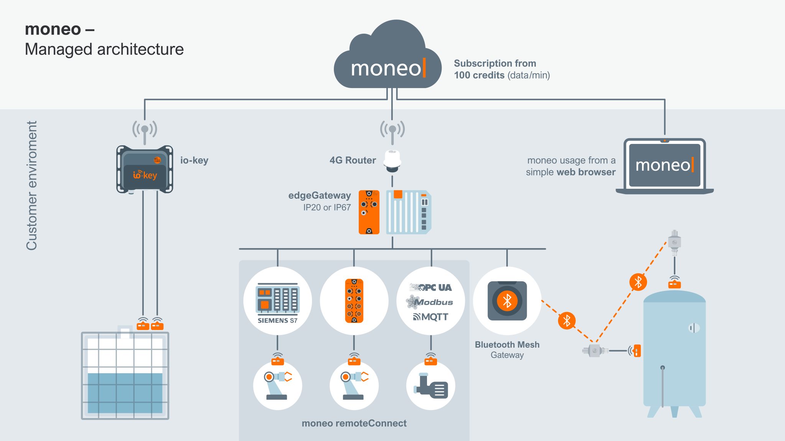
  <figcaption>ifm iiot devices managed-architecture</figcaption>
</figure>
</div>

> Au moment de l'écriture de ce paragraphe, Dashboard évoluait encore rapidement. Il est possible que lorsque vous lirez ce cours, certaines fonctionnalités aient changé. La version actuelle est : [@flowfuse/node-red-dashboard 1.29.0](https://github.com/FlowFuse/node-red-dashboard)

---

### Bonjour Node-RED Dashboard
La première fois que vous insérez un nœud dashboard dans le flux, vous devez créer deux objets.

Votre dashboard est composé de
  - De nombreuses pages, comme des pages web.

Chaque page est composée de
  - De nombreux groupes

Chaque groupe est composé de
  - Un ensemble de nœuds dashboard, également connus sous le nom de **widgets**.

### Paramètres principaux du dashboard

<div align="center">
<figure>
    
  <figcaption>Éditer les paramètres, coin supérieur droit</figcaption>
</figure>
</div>


#### Paramètre de style d'en-tête

- Par défaut : (par défaut) La barre de titre apparaîtra comme le premier élément et défilera avec le contenu, ce qui signifie que sur les pages plus longues, la barre de titre ne sera pas visible lorsque la page est défilée.
- Masqué : La barre de titre n'est pas visible du tout.
- Fixe : La barre de titre sera toujours visible, même lorsque la page est défilée.

#### Paramètre de contenu d'en-tête

- Nom de la page : (par défaut) Cette ouverture décalera tout le contenu du Dashboard, et ne sera pas visible du tout lorsqu'elle est fermée.
- Nom du Dashboard : Restera toujours ouvert. À notre point d'arrêt mobile (768px), cette valeur est remplacée et une option "Apparaître sur" est utilisée.
- Nom du Dashboard (Nom de la page) : Similaire à "Réduction" lorsqu'il est ouvert, mais lorsqu'il est fermé, les icônes de chaque page sont toujours visibles.
- Aucun : La barre de titre n'est pas visible du tout.

#### Paramètre de style de la barre latérale

- Réduction : (par défaut) Cette ouverture décalera tout le contenu du Dashboard, et ne sera pas visible du tout lorsqu'elle est fermée.
- Fixe : Restera toujours ouvert. À notre point d'arrêt mobile (768px), cette valeur est remplacée et une option "Apparaître sur" est utilisée.
- Réduire aux icônes : Similaire à "Réduction" lorsqu'il est ouvert, mais lorsqu'il est fermé, les icônes de chaque page sont toujours visibles.
- Apparaître sur le contenu : Non visible lorsqu'il est fermé et lorsqu'il est ouvert, apparaît au-dessus du contenu du Dashboard sans le décaler.
- Toujours masquer : La barre latérale ne sera pas visible en aucune circonstance. Toutes les pages sont toujours accessibles via leurs liens directs ou un nœud ui-control.

---

### Bouton
<div style="text-align: left ;">
<figure>
    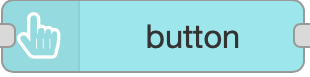
  <figcaption>Nœud bouton</figcaption>
</figure>
</div>

C'est peut-être le nœud d'Interface Utilisateur le plus simple. Mais il y a déjà beaucoup d'options.

<div align="center">
<figure>
    
  <figcaption>Éditer le nœud bouton</figcaption>
</figure>
</div>

- Le nom est facultatif, utile uniquement comme commentaire dans les nœuds.
- Le groupe est obligatoire, vous devez sélectionner une **page** ET un **groupe**. C'est là que votre bouton sera affiché.
- La taille. Nous suggérons, dès que possible, de définir un canevas de votre page, c'est-à-dire seulement auto, un ou plusieurs boutons sur la même ligne, etc.
- Icône, vous pouvez sélectionner n'importe quelle icône du [site web Material Design Icons](https://pictogrammers.com/library/mdi/) et entrer directement le nom de l'icône.
- 
<figure>
    
</figure>

- Nous n'entrerons pas dans les détails de CSS. **Cascading Style Sheets**, CSS, est un langage de feuille de style utilisé pour décrire la présentation d'un document écrit en HTML ou XML. CSS décrit comment les éléments doivent être rendus sur l'écran, sur papier, en parole ou sur d'autres médias. Cela dépasse le cadre de ce cours.

- Sélectionnez quand vous voulez envoyer le message, avec **pointerdown**, **pointerup** ou **click**.

1. ⚡ `pointerdown` ✅ Meilleur pour les commentaires instantanés, visuels ou tactiles. C'est le premier événement. Le plus réactif si vous avez besoin d'une action rapide.
1. 🖱️ `onclick` ✅ Meilleur choix à usage général pour les boutons.
1. 🖐️ `pointerup` ✅ Meilleur lorsque l'action doit se produire au moment du relâchement, mais vous avez besoin d'un contrôle plus fin. Comme prêt lorsque vous appuyez sur le bouton et commencer lorsque vous le relâchez.

---

### Entrée de texte
<figure>
    
  <figcaption>Nœud d'entrée de texte</figcaption>
</figure>

- Mode, Vous pourriez sélectionner différents styles, dont un sélecteur de date.
  - **Entrée de texte** : Champ d'entrée de texte standard
  - **Adresse de messagerie** : Offre une validation sur n'importe quelle entrée pour s'assurer qu'il s'agit d'une adresse de messagerie valide.
  - **Mot de passe** : Masque l'entrée de l'utilisateur pour offrir une entrée protégée.
  - **Nombre** : Ajoute un sélecteur haut/bas pour choisir un entier.
  - **Sélecteur de couleur** : Affiche un sélecteur de couleur unique
  - **Sélecteur d'heure** : Sélecteur d'heure au format HH:mm
  - **Sélecteur de semaine** : Un widget calendrier pour sélectionner une semaine complète donnée, renvoie YYYY-W<WW>>
  - **Sélecteur de mois** : Un widget calendrier pour sélectionner un mois donné, renvoie YYYY-MM
  - **Sélecteur de date/heure** : Un widget calendrier pour sélectionner la valeur datetime complète. Renvoie YYY-MM-DDTHH:mm
- :information_source: L'infobulle est le texte affiché lorsque la souris est sur la cellule d'entrée, elle aide à comprendre ce que l'utilisateur devrait entrer comme information.

- Si msg arrive à l'entrée, passer à la sortie :heavy_check_mark:, permet de définir la valeur initiale.

Certains champs ont déjà été commentés ci-dessus. N'oubliez pas que vous pouvez obtenir de l'aide pour le nœud en cliquant sur le livre :notebook: en bas à gauche de la fenêtre de configuration.

---

### Entrée de nombre
Ajoute une seule ligne d'entrée de nombre à votre dashboard

<figure>
    
  <figcaption>Nœud d'entrée de nombre</figcaption>
</figure>

---

### Texte
Affiche un champ de texte non éditable sur l'interface utilisateur. Chaque `msg.payload` reçu mettra à jour la valeur affichée à côté de l'étiquette optionnelle.

<figure>
    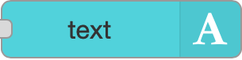
  <figcaption>Nœud texte</figcaption>
</figure>

---

### Formulaire
<figure>
    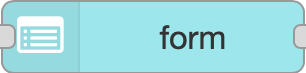
  <figcaption>Nœud formulaire</figcaption>
</figure>

Ajoute un formulaire à l'interface utilisateur.

Aide à collecter plusieurs valeurs de l'utilisateur au clic du bouton soumettre en tant qu'objet dans msg.payload

Plusieurs éléments d'entrée peuvent être ajoutés en utilisant le bouton Ajouter des éléments

Chaque élément contient les composants suivants :

- **Étiquette** : Valeur qui sera l'étiquette de l'élément dans l'interface utilisateur
- **Nom** : Représente la clé (nom de la variable) dans msg.payload dans lequel la valeur de l'élément correspondant est présente
- **Type** : Option déroulante pour sélectionner le type d'élément d'entrée
- **Requis** : En l'activant, l'utilisateur doit fournir la valeur avant de soumettre
- **Lignes** : Nombre de lignes UI pour l'entrée de texte multiligne
- **Supprimer** : Pour supprimer l'élément actuel du formulaire

<div align="center">
<figure>
    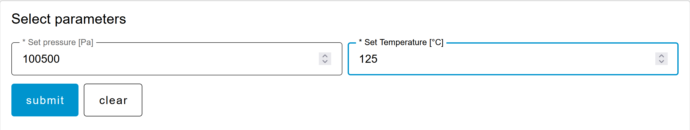
  <figcaption>Exemple de nœud formulaire</figcaption>
</figure>
</div>

---

### Jauge
Ce nœud est facile à utiliser et la conception est attrayante pour afficher des valeurs numériques. Les paramètres sont clairs et ne nécessitent pas d'explication particulière.

<figure>
    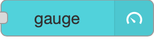
  <figcaption>Nœud jauge</figcaption>
</figure>

---

### Curseur
Après la jauge, voici un autre élément graphique simple pour sélectionner une valeur numérique.

Vous pouvez définir si la valeur change continuellement ou uniquement lorsque le pointeur est relâché.

<figure>
    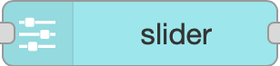
  <figcaption>Nœud curseur</figcaption>
</figure>

<div align="center">
<figure>
    
  <figcaption>Un exemple avec jauge et curseur</figcaption>
</figure>
</div>

---

### Commutateur
Un autre nœud facile à utiliser.

Ajoute un commutateur à bascule à l'interface utilisateur.

<figure>
    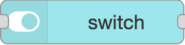
  <figcaption>Nœud commutateur</figcaption>
</figure>

<figure>
    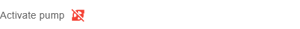
  <figcaption>Vous pouvez utiliser l'icône pour aider à comprendre l'état du commutateur</figcaption>
</figure>

<figure>
    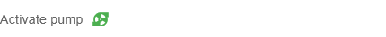
  </figure>

Il pourrait être utile de [vous souvenir du lien pour les icônes](https://pictogrammers.com/library/mdi/). Une image vaut mille mots.

---

### Entrée de fichier
:no_bell: Ce nœud sera détaillé plus tard dans la section Gestion des données.

<figure>
    
  <figcaption>Nœud d'entrée de fichier</figcaption>
</figure>

---

### Groupe de boutons
Un nœud Node-RED pour afficher un commutateur avec plusieurs boutons dans le Dashboard Node-RED.

<figure>
    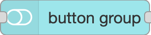
  <figcaption>Nœud groupe de boutons</figcaption>
</figure>

Vous pouvez sélectionner des icônes et/ou du texte pour ces boutons.

<div align="center">
<figure>
    
  <figcaption>Vous pouvez ajouter autant de boutons que vous le souhaitez</figcaption>
</figure>
</div>

---

### Liste déroulante

<figure>
    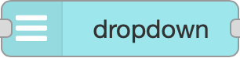
  <figcaption>Nœud liste déroulante</figcaption>
</figure>

Nous utiliserons ce nœud pour montrer comment vous pouvez utiliser des paramètres dynamiques pour un nœud UI.

J'ai utilisé Copilot pour générer la liste ci-dessous. Elle est utilisée comme tableau pour `msg.ui_update.options`.

```json
[
    { "value": "1", "label": "Température de l'air" },
    { "value": "2", "label": "Humidité relative" },
    { "value": "3", "label": "Pression atmosphérique" },
    { "value": "4", "label": "Vitesse du vent" },
    { "value": "5", "label": "Direction du vent" },
    { "value": "6", "label": "Précipitation" },
    { "value": "7", "label": "Rayonnement solaire" },
    { "value": "8", "label": "Indice UV" },
    { "value": "9", "label": "Visibilité" },
    { "value": "10", "label": "Couverture nuageuse" },
    { "value": "11", "label": "Humidité du sol" },
    { "value": "12", "label": "Température du sol" },
    { "value": "13", "label": "Profondeur de la neige" },
    { "value": "14", "label": "Qualité de l'air (PM2.5)" },
    { "value": "15", "label": "Qualité de l'air (PM10)" },
    { "value": "16", "label": "CO2" },
    { "value": "17", "label": "Ozone (O3)" },
    { "value": "18", "label": "Tension de la batterie" },
    { "value": "19", "label": "Niveau d'eau" },
    { "value": "20", "label": "Conductivité électrique" }
]
```

Puis, j'utilise cette liste pour générer dynamiquement la liste dans un nœud inject avec l'option : Injecter une fois après 0,1 secondes.

<div align="center">
<figure>
    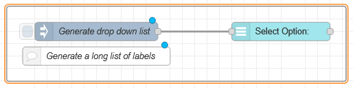
  <figcaption>La liste de génération est générée une fois. Cela pourrait être un message.</figcaption>
</figure>
</div>

<div align="center">
<figure>
    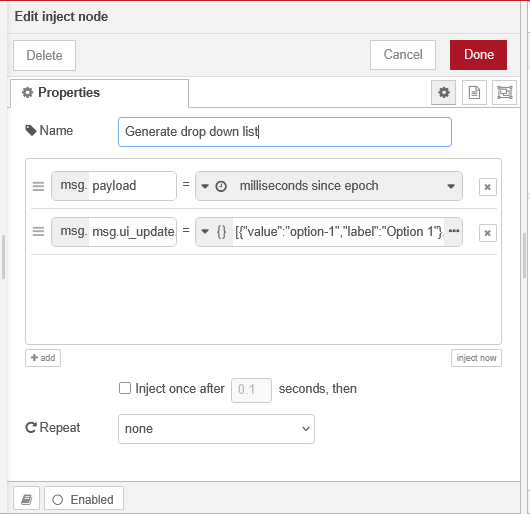
  <figcaption>msg.ui_update.options donné dans l'aide du nœud liste déroulante</figcaption>
</figure>
</div>

Résultat :

<div align="center">
<figure>
    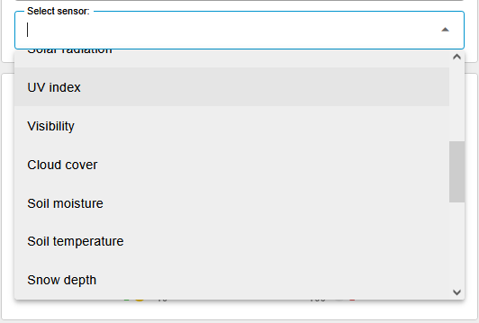
  <figcaption>Vous pourriez même utiliser un fichier csv externe pour générer la liste</figcaption>
</figure>
</div>

---

### Groupe de boutons radio
Ajoute un groupe de boutons radio à votre dashboard qui émettra des valeurs dans Node-RED sous `msg.payload` chaque fois qu'une valeur est sélectionnée.

<figure>
    
  <figcaption>Nœud groupe de boutons radio</figcaption>
</figure>

<div align="center">
<figure>
    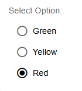
  <figcaption>Un autre nœud facile à utiliser, vous ne pouvez sélectionner qu'un bouton</figcaption>
</figure>
</div>

---

### Tableau

<figure>
    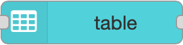
  <figcaption>Nœud tableau</figcaption>
</figure>

Peut-être l'une des fonctionnalités les plus puissantes du Dashboard 2.0
Utilisant un tableau, vous pouvez lire et afficher directement un tableau d'objets sans aucune autre manipulation.

Nous pouvons trier le tableau selon n'importe quel critère.

Enfin, nous pouvons sélectionner n'importe quelle valeur du tableau simplement en cliquant sur une ligne.

Ce nœud attend un tableau d'objets, comme celui-ci :

```
[{"ID":1001,"Name":"Axes Velocity","Unit":"m/s","Value":0.2},
 {"ID":1002,"Name":"Axes Acceleration","Unit":"m/s2","Value":1.1},
 {"ID":1003,"Name":"Axes Deceleration","Unit":"m/s2","Value":2.2},
 {"ID":1004,"Name":"Axes Jerk","Unit":"m/s3","Value":21.5}
]
```

À partir de ce tableau, il affichera un tableau comme celui-ci :

<div align="center">
<figure>
    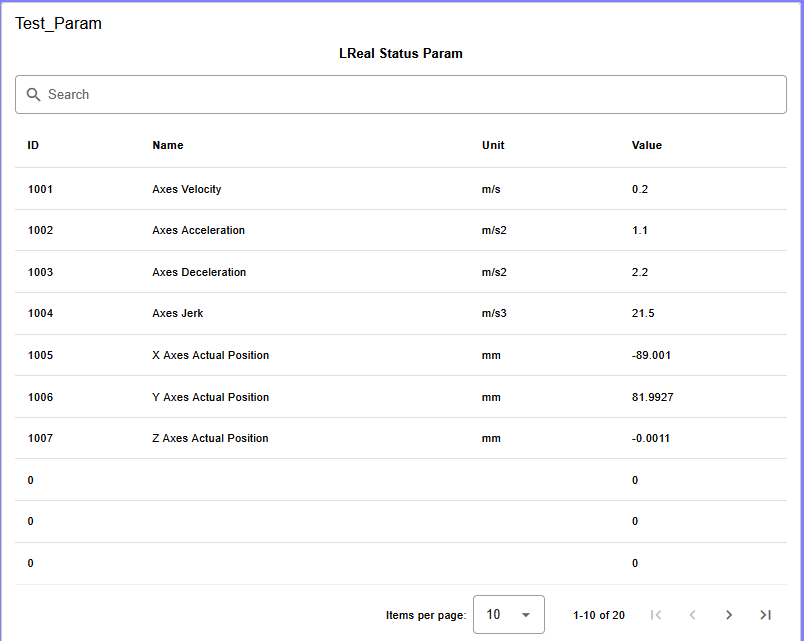
  <figcaption>Un tableau avec option de recherche</figcaption>
</figure>
</div>

Si vous tapez n'importe quelle étiquette du tableau dans le champ de recherche, elle triera automatiquement les valeurs.

Dans l'exemple, nous utilisons un nœud de la palette ctrlX Automation pour lire un tableau directement depuis l'API. [C'est le paragraphe suivant](#machine-interface).

<div align="center">
<figure>
    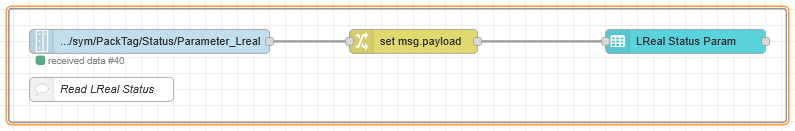
  <figcaption>Nous utilisons un nœud d'interface depuis l'API</figcaption>
</figure>
</div>

Nous avons juste à insérer un nœud change, car le nœud API n'envoie pas un tableau, mais un objet de la forme : ``{"value":[array]}``.

C'est un usage typique d'un nœud change.

<div align="center">
<figure>
    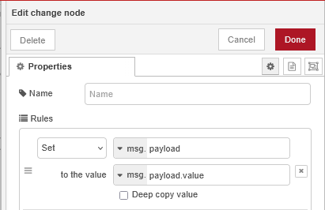
  <figcaption>Nous envoyons l'élément de valeur de l'objet, qui est lui-même un tableau.</figcaption>
</figure>
</div>

---

### Markdown
Convertit **markdown** en HTML rendu dans le Dashboard.

Peut être utilisé pour le rendu des étiquettes, des en-têtes ou même des articles de blog complets. Si vous cherchez un aide-mémoire rapide sur la façon d'écrire Markdown, vous pouvez consulter le guide de FlowFuse ici.

Ce nœud utilise markdown, c'est-à-dire le même format que celui utilisé pour écrire ce cours.

<figure>
    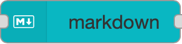
  <figcaption>Nœud markdown</figcaption>
</figure>

---

Dans **Node-RED**, le **nœud Markdown** est utilisé pour **rendre et afficher le texte formaté avec la syntaxe Markdown** (comme les en-têtes, le gras, l'italique, les listes, les liens, les blocs de code, etc.) dans le **Dashboard Node-RED** ou **UI**.

C'est utile quand vous voulez montrer **du texte descriptif**, **des instructions**, **des messages formatés**, ou **des mises à jour d'état** dans un format propre et lisible directement sur votre dashboard.

**Exemples de cas d'utilisation :**

* Afficher une section d'aide ou des informations système.
* Afficher les journaux ou la documentation formatés.
* Ajouter des étiquettes stylisées ou des notes entre les éléments du dashboard.

En court, il **convertit le texte Markdown en HTML joliment formaté** pour une meilleure présentation dans votre interface utilisateur Node-RED.

Voici la même explication, maintenant formatée comme un **tableau Markdown** avec quelques icônes et un lien vers la **documentation FlowFuse** :

---

|    🧩 **Nœud**    | 📖 **Description** | 💡 **Cas d'utilisation**| 🔗 **Plus d'info**|
| :---------------: | :------------------------- | :--------------------- | :---------------- |
| **Nœud Markdown** | Quelques descriptions| ✅ Afficher l'aide ou la documentation<br>✅ Afficher les informations système ou les journaux formatés<br>✅ Ajouter des étiquettes stylisées, des titres ou des notes aux dashboards | 🌐 [Documentation FlowFuse](https://flowfuse.com/docs/) |

---

<div align="center">
<figure>
    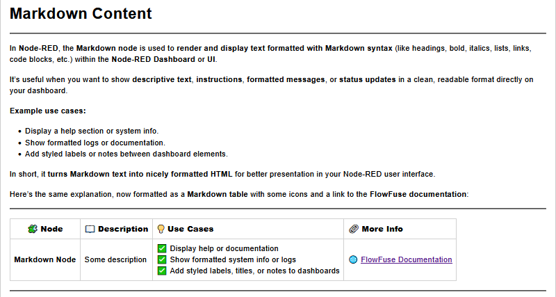
  <figcaption>Ce que vous pouvez lire dans le dashboard Node-RED</figcaption>
</figure>
</div>

> Ce nœud est très utile pour la documentation de votre travail.

> Le côté agréable est que c'est le même format utilisé par ChatGPT, l'exemple ci-dessus est une simple copie-collage d'une IA.

#### Insérer des graphiques dans votre documentation.

**Les organigrammes Mermaid** sont des diagrammes écrits dans une syntaxe texte simple et lisible par l'homme que Mermaid.js convertit en organigrammes graphiques (SVG/PNG). Ils vous permettent de décrire des nœuds, des décisions et des connexions en texte brut pour que les diagrammes puissent être versionnés, édités et rendus aux côtés de Markdown.

Pour plus d'informations sur les graphiques mermaid, voir [la documentation mermaid](https://docs.mermaidchart.com/)

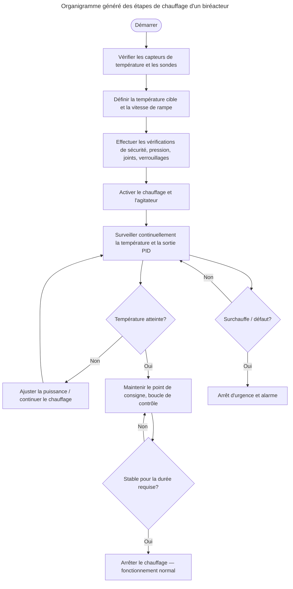

Ci-dessous, ce que vous pouvez obtenir directement dans un dashboard Node-RED.

<div align="center">
<figure>
    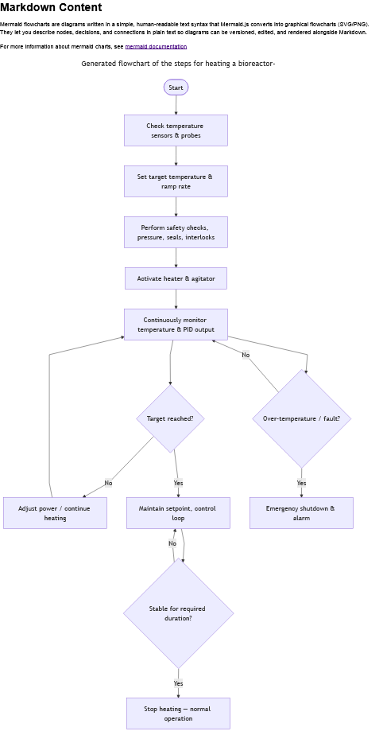
  <figcaption>Le même diagramme à partir d'une capture d'écran</figcaption>
</figure>
</div>

---

### Graphique
:no_bell: *pour information seulement

C'est probablement l'une des options les plus intéressantes du Dashboard, mais sa complexité signifie que le temps requis pour l'aborder dépasse le cadre d'un seul module. Nous l'aborderons dans un module séparé au fur et à mesure de la progression du module principal.

<figure>
    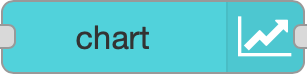
  <figcaption>Nœud graphique</figcaption>
</figure>

> Plus de détails et d'exemples peuvent être trouvés dans la [documentation en ligne](https://dashboard.flowfuse.com/nodes/widgets/ui-chart.html) pour le Dashboard.

---

### Modèle
:no_bell: *pour information seulement, ceci est pour un usage avancé de Node-RED, en dehors du cadre de ce cours.*

<figure>
    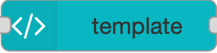
  <figcaption>Nœud modèle</figcaption>
</figure>

Voir la [documentation complète](https://dashboard.flowfuse.com/nodes/widgets/ui-template.html), elle permet de concevoir des nœuds de dashboard personnalisés.

---

### Événement
:no_bell: *pour information seulement, ceci est pour un usage avancé de Node-RED, en dehors du cadre de ce cours.*

<figure>
    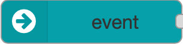
  <figcaption>Nœud événement</figcaption>
</figure>

---

### Notification
Pour afficher un événement dynamique afin d'informer l'utilisateur d'un événement. Facile à utiliser.

Dans une forme simple, affichera le texte provenant d'un ``msg.payload``.

<figure>
    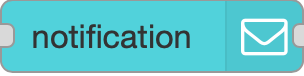
  <figcaption>Nœud notification</figcaption>
</figure>

<div align="center">
<figure>
    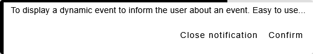
  <figcaption>Une notification simple au centre de l'écran</figcaption>
</figure>
</div>

---

### Contrôle UI
:no_bell: *pour le contrôle dynamique des nœuds UI, en dehors du cadre de ce cours*

<figure>
    
  <figcaption>Nœud contrôle UI</figcaption>
</figure>

---

<!-- Fin de README.md -->
