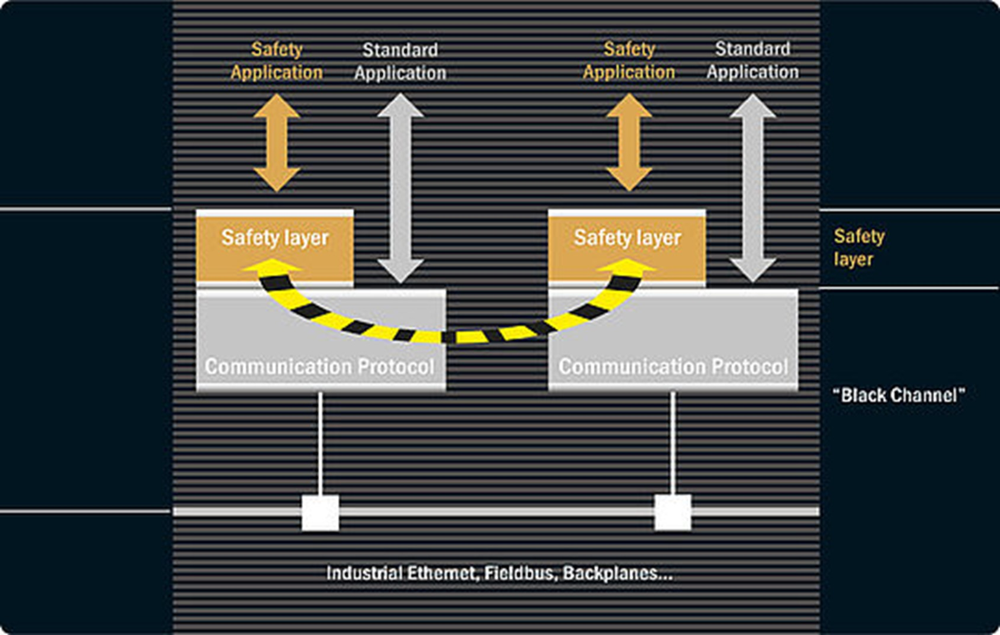

<h1 align="left">
   
  
   
  Industrial Automation Base
   
</h1>

Cours AutB

Author: [Cédric Lenoir](mailto:cedric.lenoir@hevs.ch)

# Modul 10 Industrieller Feldbus (*ein kurzer Überblick*)

# Feldbusse
In diesem Kapitel geht es nicht darum, auf technische Details zu Feldbussen einzugehen. Allerdings geht es um den Feldbus als Werkzeug zur Automatisierung.
Eine Architektur für ein Automatisierungsprojekt ist heute aus Sicht des Automatisierungsingenieurs vor allem eine SPS und ein Feldbus. Die Verallgemeinerung des Feldbusses im Sinne von Industrie 4.0 könnte als Industrie 3.5 bezeichnet werden. Das ist eine sehr persönliche Interpretation.
Die eigentliche Säule der Feldbusse, die Ende der 1980er Jahre auftauchte, ist zumindest aus europäischer und industrieller Sicht der Profibus.

## Echtzeit-Ethernet
Zu Beginn der 2000er Jahre erlebten wir die Markteinführung einer ganzen Reihe von Konkurrenzprodukten, so dass wir im 2005 veröffentlichten **The Industrial Communication Technology Handbook** vom **Industrial Fielbus War* sprechen. *. Die Realität ist zum großen Unglück der Welt der Automatisierung, dass es den wichtigsten Marktteilnehmern trotz mehrerer Versuche nicht gelungen ist, sich auf einen Standard zu einigen.

### IEC 61784
Es gibt zwar eine Reihe von Standards unter der Nummer 61784, aber leider gibt es etwa so viele Variationen des Standards wie es Arten von Real-Time-Ethernet-Feldbussen gibt.
Dies zeigt, dass Norm und Standardisierung keine Synonyme sind….

### Wählen Sie Ihren Bus
Auf der Entwurfsebene, und das ist der Grund, warum ich den Feldbus vor die SPS stelle, liegt es daran, dass der Automatisierungsingenieur seine Entwicklungsplattform manchmal nicht nach der Leistung der SPS, sondern nach den für einen bestimmten Feldbus verfügbaren Funktionsausstattungen auswählt .
In der folgenden Übersicht wird völlig willkürlich Ethernet-Powerlink ausgewählt. [Bilder stammen von](https://www.ethernet-powerlink.org).

### Netzwerkarchitektur
 
<figure>
    
    <figcaption>Powerlink, Architecture</figcaption>
</figure> 

Ein Echtzeit-Ethernet ist vor allem ein Protokoll und eine Softwareschicht, die auf Standard-Ethernet-Hardware, RJ45-Port, aufgepfropft wird. Das stimmt zwar nur bedingt, es gibt aber Implementierungen, die das Arbeiten in Real-Time-Ethernet auf Standard-PCs ermöglichen.
###	Mécanisme
 
<figure>
    
    <figcaption>Powerlink, Cycle time</figcaption>
</figure> 

Das Prinzip ist wie folgt: Ein Teil der Buszykluszeit wird für die isochrone Phase reserviert, diese ist für die Automatisierung wichtig. Dadurch können Daten mit einer festen Zykluszeit und äußerst präzisen Variationen gesendet werden. Diese Präzision ist besonders wichtig für die Motorsynchronisation; wir müssen hier beispielsweise an eine 5-Achsen-Bearbeitungsmaschine denken, die eine Präzision in der Größenordnung eines Mikrometers an der Werkzeugspitze gewährleisten muss.
Wir sprechen hier von typischen Zykluszeiten in der Größenordnung von 250 [µs] bis 1 [ms].

Der asynchrone Teil bleibt für die Standard-Ethernet-Kommunikation verfügbar. Bei den meisten Implementierungen, Profinet, Sercos III, Powerlink, Ethernet/IP, ist eine direkte Kommunikation über einen Standard-Ethernet-Port möglich.

###	Frame Format
 
<figure>
    
    <figcaption>Powerlink, Data Frame</figcaption>
</figure> 

Während wir in einem Standard-Ethernet-Netzwerk eine Ethernet-Adresse wie 192.168.0.4 verwenden, finden wir im Echtzeitteil einen **Master** und dann eine Reihe von **Slave** mit einer eindeutigen Identifikationsnummer. Die Anzahl der **Slaves** ist im Allgemeinen begrenzt, beispielsweise 250, wobei für jeden von ihnen eine eindeutige Identifikationsnummer zwischen 1 und 250 vergeben wird.

###	Leistung
Auch wenn es bedeutet, etwas vereinfacht zu bleiben, kann die Leistung des **Ethernet Real-Time**-Feldbusses im Allgemeinen als **ausreichend** angesehen werden, solange die Menge der in Echtzeit übertragenen Daten angemessen bleibt. Wir sprechen hier von ein paar Dutzend Bytes pro Zyklus und pro **Slave**.

Bandbreitenintensive Geräte sind in der Regel die Motorsteuerungen. Die Anzahl der analogen Eingänge kann von einiger Bedeutung sein.
Im Allgemeinen können wir davon ausgehen, dass es bei einer Zykluszeit in der Größenordnung von Millisekunden und einigen Dutzend Motoren oder anderen Knoten im Netzwerk unwahrscheinlich ist, dass wir auf eine Einschränkung stoßen. Wahrscheinlich wird die SPS vor dem Bus an ihre Grenzen stoßen.

### Kamera
Es gibt ein Element, das in aktuellen Automatisierungssystemen zunehmend vorhanden ist: Kameras. Die großen Datenmengen, die sie erzeugen, könnten einen Bus möglicherweise über seine Grenzen hinaus belasten. In einem solchen Szenario müssen wir sorgfältig auf die Busauslastung achten.

### Sicherheit
 
<figure>
    
    <figcaption>Powerlink, Safety</figcaption>
</figure> 

Die meisten aktuellen Echtzeitbusse sind mittlerweile für die Verkabelung von Sicherheitselementen einsetzbar. Es ist das Protokoll, das zwischen zwei Punkten sicher ist.

## Sekundäre Netzwerke, Feldbus
 
<figure>
    
    <figcaption>Powerlink, Secondary Network</figcaption>
</figure> 

Wenn das Echtzeit-Internet das Rückgrat des Systems ist, kommt es selten vor, dass es direkt bis zum Sensor genutzt wird.
In der Praxis ist der Echtzeit-Ethernet-Bus Komponenten vorbehalten, die einen hohen Datendurchsatz erfordern.
- Motoren können mit einem mit 400 [µs] abgetasteten Positionssignal in ihrer Position gesteuert werden.
- Die Position der Motoren kann mit einem Encoder synchronisiert werden, der ebenfalls an den Echtzeit-Ethernet-Bus angeschlossen ist.
- Es gibt Kameras, die direkt an den Ethernet-Bus angeschlossen werden können.
- Um auf Komponenten zuzugreifen, die weniger Daten oder eine geringere Abtastfrequenz erfordern, verwenden wir häufig einen Bus namens **Feldbus**. Die Daten werden im Allgemeinen gemultiplext und über ein Gateway mit dem Echtzeit-Ethernet-Bus verbunden. Wie bei Echtzeit-Ethernet-Bussen gibt es auf dieser Ebene kaum Standardisierung.

###	AS-Interface
 
<figure>
    
    <figcaption>AS-Interface, Source: Siemens</figcaption>
</figure> 

Der **AS-Inferface**-Bus, oder **ASi**, ist das typische Beispiel für einen Feldbus. Seine Geschwindigkeit hängt hauptsächlich von der Anzahl der Komponenten ab.
- Das gelbe Kabel liefert Strom und überträgt modulierte Daten auf Strom.
- Das schwarze Kabel versorgt nur Ausgangsmodule mit Strom, die mehr Strom benötigen.

<figure>
    
    <figcaption>AS-Interface, Section view</figcaption>
</figure> 
 
- Das Verkabelungssystem ist äußerst kostengünstig, da die Slaves mithilfe von zwei Metallspitzen, die die internen Anschlüsse kontaktieren, direkt am Kabel angebracht werden. Somit ist es möglich, einen ASi-Knoten ohne Kabelunterbrechung an den Bus anzuschließen!

- Es gibt eine **sichere** Version des ASi-Busses.

|Key data per AS-i network|
|-----------------------------------------------|
|Number of slaves: up to 62|
|Number of I/Os: up to 496 inputs and 496 outputs|
|Topology: any, combinable, no termination resistors|
|Medium: unshielded two-wire line for data and energy|
|Line length: 100 m as a standard, extendable to 600 m with repeater and extension plug|
|Cycle time: 5 ms (typical)|
|Data transfer: digital and analog (16 Bit)|

Siehe auch
[Weitere Informationen](https://www.as-interface-academy.net)

# IO-Link
 
<figure>
    
    <figcaption>IO-Link Architecture</figcaption>
</figure> 

## Prinzip
**IO-Link ist ein Protokoll**.
IO-Link ist eine standardisierte Ein-/Ausgabetechnologie **IEC 61131-9** zur Kommunikation mit Sensoren und Aktoren. Die Punkt-zu-Punkt-Kommunikation basiert auf der 3-Draht-Sensor- und Aktorverbindung nach **IEC 61131-2**. IO-Link ist also kein Feldbus, sondern die Weiterentwicklung bestehender Verbindungstechnik für Sensoren und Aktoren.
Zur Anbindung an die AS-Interface-Technologie gibt es mittlerweile Gateways, die die Durchleitung des IO-Link-Protokolls über ein AS-Interface-Netzwerk ermöglichen.

Referenz **IEC 61131 Teil 9**
Digitale Punkt-zu-Punkt-Kommunikationsschnittstelle für kleine Sensoren und Aktoren.
 
<figure>
    
    <figcaption>IO-Link on AS-Interaface, Source: www.bihl-wiedemann.de </figcaption>
</figure> 

## Hauptmerkmal

Nutzung bestehender Infrastruktur. Ein IO-Link-Sensor kann grundsätzlich in einem bestehenden Netzwerk installiert werden, da er in der Lage ist, Standard-IEC 61131-2-Signale bereitzustellen, natürlich ohne den Vorteil von Protokolldaten. Ebenso kann ein Sensor einer älteren Generation, der das Protokoll nicht bereitstellt, in einem für IO-Link aufgerüsteten Netzwerk installiert werden.
- Übertragung des analogen Signals in digitaler Form. Dadurch wird die Widerstandsfähigkeit gegen elektromagnetische Störungen verbessert.
- Sensorkonfiguration, damit können Sie die Sensoreinstellungen aus der Ferne ändern. Dies vereinfacht auch die Wartung erheblich, da die Sensorparameter zentral gespeichert und bei einem Sensorwechsel wieder in den Sensor geladen werden können.
- Zugriff auf Sensordiagnoseparameter.
- Bereitstellung verschiedener Signale, zum Beispiel musste vor dem Aufkommen der IO-Link-Technologie ein RFID-Sensor vom Typ Radio Frequency Identification direkt an den Hauptbus des Typs Echtzeit-Ethernet angeschlossen werden. Es besteht nun die Möglichkeit, Informationen von einem RFID-Sensor über einen Sekundärbus vom Typ ASi weiterzuleiten.

Diese unterschiedlichen Eigenschaften machen die IO-Link-Technologie zu einem wesentlichen Bestandteil der Industrie 4.0- und IoT-Technologie, da sie einen dezentralen Zugriff auf Sensoren ermöglichen.
Die Norm IEC 61131-9 stammt aus dem Jahr 2013, doch erst fast 10 Jahre nach ihren ersten Entwicklungen erreicht die Technologie mit einer sehr großen Produktvielfalt ihre Reife.

Von bestimmten Sensorlieferanten sind mittlerweile die meisten neuen Produkte mit diesem Protokoll erhältlich. Das Konzept des IO-Link-Sensors umfasst die Prozesswelt, beispielsweise die chemische Industrie.

Betriebsart eines Baumer-Sensors, SIO-Mode und IO-Link-Mode.

<figure>
    
    <figcaption>IO-Link signal, Source: www.baumer.com </figcaption>
</figure>

Jeder Port des IO-Link-Masters kann entweder im SIO-Modus (Standard Input/Output Mode) oder im IO-Link-Modus genutzt werden und somit Informationen aller Detektoren verarbeiten. Im SIO-Modus funktioniert der Detektor wie sein herkömmliches Gegenstück. Messwerte und Schaltzustände werden über digitale oder analoge Ausgänge an die Steuerung übermittelt. Im IO-Link-Modus wird der digitale Ausgang des Detektors als bidirektionale serielle Schnittstelle zum Austausch von Mess- und Diagnoseinformationen genutzt. In diesem Modus kann der Melder auch mit Parametern neu konfiguriert werden.

Standardmäßig stehen pro Zyklus 2 Byte Prozessdaten zur Verfügung. Der Benutzer kann auch größere Datenpakete (Frame-Typen) auswählen. Dadurch ist es möglich, größere Prozessdaten, bis zu 32 Byte, mit langsamerer Zykluszeit zu übertragen.

## Beispiel eines Gateways vom Typ Baumer
Dieses Gateway ist nicht nur für den Anschluss an ein Echtzeit-Ethernet, beispielsweise Profinet, konzipiert, sondern ermöglicht auch den direkten Zugriff auf in OPC-UA formatierte Daten über das TCP-IP-Protokoll.

<figure>
    
    <figcaption>IO-Link Gateway, Source: www.baumer.com </figcaption>
</figure>

## IODDs
Jedes IO-Link-Gerät verfügt über eine Gerätebeschreibungsdatei namens IODD (IO Device Description). Es enthält Angaben zum Hersteller, zur Artikelnummer, zur Funktionalität usw. die vom Benutzer leicht gelesen und verarbeitet werden können. Jedes Gerät, also jeder Melder, kann sowohl durch die IODD als auch durch eine interne Geräte-ID eindeutig identifiziert werden. Es besteht aus mehreren Dateien: einer Hauptdatei und optionalen externen Sprachdateien (beide im XML-Format) sowie Bilddateien (im PNG-Format).
Diese Dateien sind für SPS-Kommunikationseinstellungen erforderlich.
IODDs-Dateien aller Hersteller sind auf der Website www.io-link.com verfügbar.

## Zyklische Daten / Prozessdaten
In Echtzeit übertragen. Sie dienen der Prozesssteuerung in der Anlage und können über IO-Link auch auf andere IT-Systeme übertragen werden.
- Hierbei handelt es sich um Daten, die traditionell in binärer Form, 0 oder 24 V DC oder analog in 0..10 V DC oder 4..20 mA-Form übertragen werden.

### Notieren :
> PDI : Process Data Input

> PDO : Process Data Output

## Azyklische Daten / Servicedaten
Dient zur Konfiguration von Detektoren (I/O-Geräten) und ggf. zum Auslesen von Analyse- und Identifikationsdaten.
- Sensordiagnose, wie Signalqualität, Sensortemperatur.
- Identifikation des Sensors, wie z. B. Sensortyp, Seriennummer.
- Einstellungen wie Entfernungsmessung, Kontrastniveau.
### Alarme/Ereignisdaten
Benachrichtigung oder Indikator, die erstellt wird, wenn ein kritisches Ereignis auftritt. Beispiele für Ereignisdaten:
- schlechter Sensor angeschlossen,
- Kommunikationsfehler,
- offene Stromkreise,
- Überlastung,
- verschmutzte Linse.

## Validierung
In Branchen, die einen Validierungsprozess erfordern, bieten IO-Link-Sensoren die interessante Funktion, validiert werden zu können. Im Gegensatz zu herkömmlichen Sensoren können Sie anhand der Seriennummer prüfen, ob der Sensor ausgetauscht wurde. Sie können aber auch einfach prüfen, ob er durch einen gleichwertigen Sensor ersetzt wurde.

## Nachschlagewerk
IO-Link The DNA of Industry 4.0,  Joachim R. Uffelmann, Peter Wienzek, Myriam Jahn

## Hier noch einige zusätzliche Anmerkungen:
https://e2e.ti.com/blogs_/b/industrial_strength/archive/2015/08/20/three-protocols-for-industrial-communication

Der Prozess ist eher mit dem HART-Protokoll vertraut, jedoch bewegt sich einer der Hauptakteure in der Prozessmessung eindeutig in Richtung IO-Link
 
<figure>
    
    <figcaption>IO-Link_Network_Layout_E+H, Source: www.ch.endress.com </figcaption>
</figure> 
Auch im Energiebereich findet IO-Link zahlreiche Anwendungen, beispielsweise bei Windkraftanlagen, bei denen die Möglichkeit einer Sensordiagnose von Vorteil ist.

# Ethernet-apl

Two-Wire Ethernet for process automation.

<figure>
    
    <figcaption>Ethernet Advanced Physical Layer, Source: www.ethernet-apl.org </figcaption>
</figure> 

## Industry Partners
| | | | |
|-----------|--------------|--------------|--------------|
|||||
|||||
|||||

Diese Technologie ist neu. Derzeit ist kein Know-how im Rahmen des HEVS bekannt.
Weitere Informationen finden Sie im [Whitepaper im Anhang](Ethernet-APL_Ethernet-To-The-Field_EN_FINAL_June-2021.pdf).
