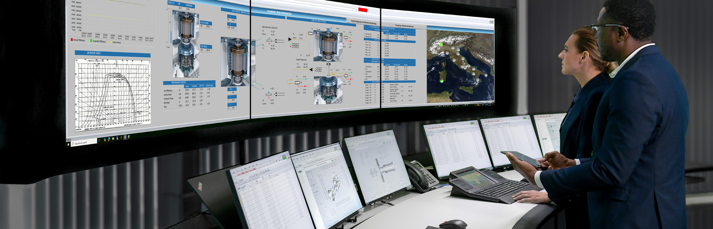
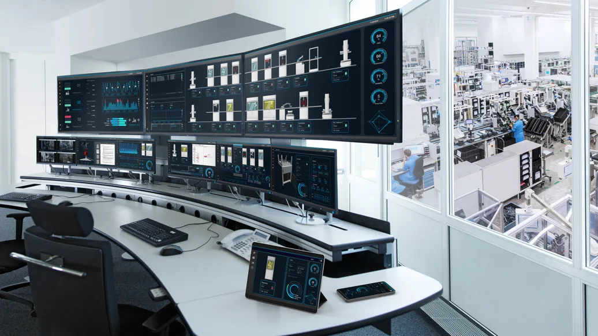
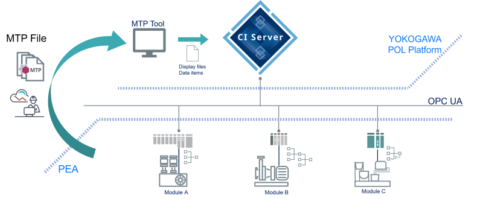
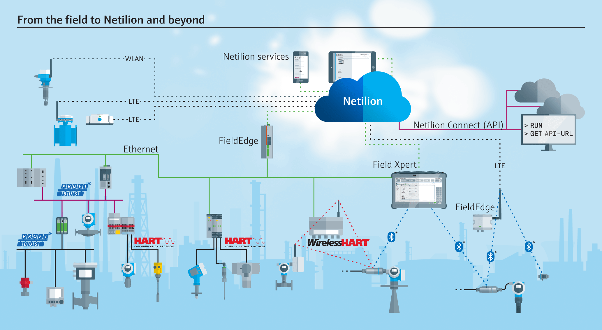
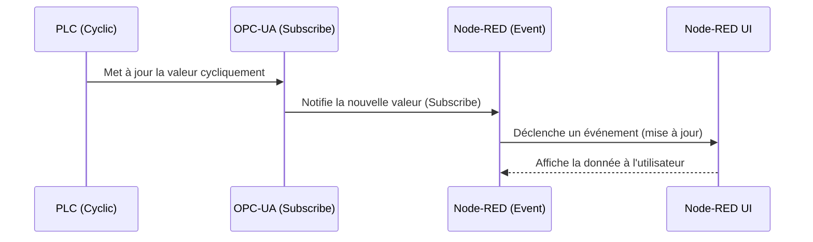
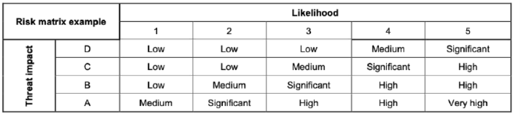
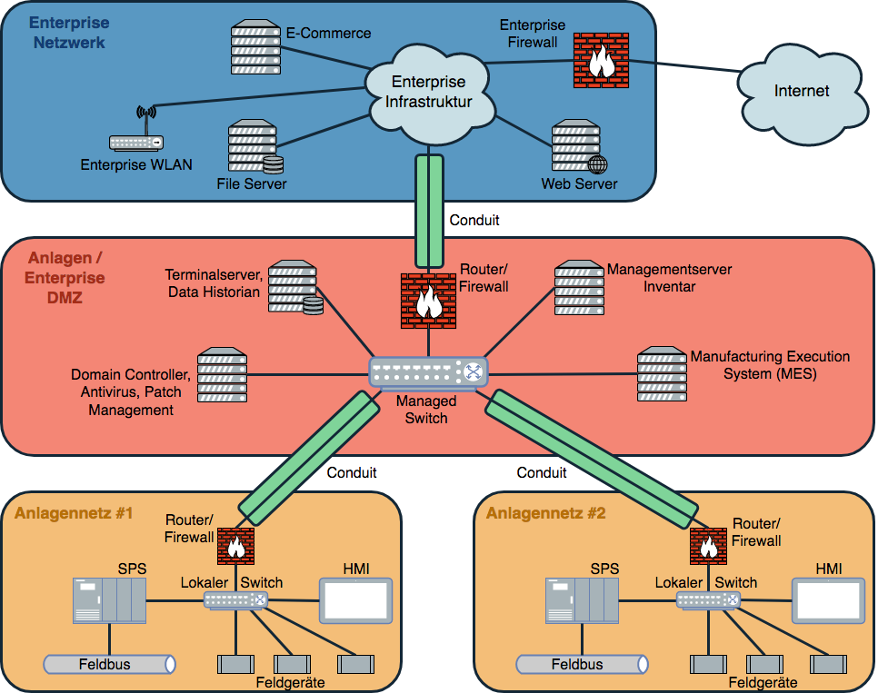

<h1 align="left">
   
  
   
  Industrial Automation Base
   
</h1>

Cours AutB

Author: [Cédric Lenoir](mailto:cedric.lenoir@hevs.ch)

# Module 13 OPC UA & Sécurité OT

Keywords: **OPC-UA, OT**.

## Contexte
Dans un cas simple, et c'est le cas pour une grande partie des systèmes IACS, industrial automation and control systems, le cœur sera composé d'un PLC, qui peut fonctionner en parfaite autonomie.

Dans des cas plus complexes, le PLC devra interagir avec un utilisateur, humain ou pas. Les cas les plus courants sont :
-   Statut de la machine.
-   Diagnostic de la machine.
-   Modification des paramètres de la machine.
-   Activation manuelle de certains éléments de la machine.

## Objectif
-   Fournir les bases d'un outil qui permette simplement de :
    -   Lire des informations depuis un PLC et les afficher sur une interface graphique.
    -   Lire, modifier, enregistrer et restaurer un set de paramètres.
    -   Enregistrer une série d'actions et d'événements, qu'ils proviennent du PLc ou de l'interface graphique.
-   Comprendre le concept de base de la programmation par événement.
-   Savoir ce qu'est OPC-UA et à quoi il est destiné.
    -   Communication entre différentes plateforme
    -   Dépendance à Ethernet et par extension comprendre l'intérêt de [Ethernet APL](https://www.ethernet-apl.org/).

## A savoir
-   Les concepts de base de l'OPC-UA
    -   Conçu pour travailler sur Ethernet.
    -   Construit sur des mécanismes de sécurité avancés.
    -   Permet des architectures très complexes, de l'usine jusqu'au capteur.
    -   Il est **le** protocole standard de communication dans l'industrie.
    -   Orienté objet, il inclut des mécanismes de découverte du réseau.
    -   Economie de bande passante grâce au mécanisme de communication par abonnement, subscribe.
    -   Inconvénient majeur: **en constante évolution, les fonctionnalités disponibles peuvent beaucoup varier d'un fournisseur de solution à l'autre**.
- Qu'est-ce que Node-RED et à quoi peut-on l'utiliser.
  - Les caractéristiques de base de la programmation pour événement.

# Interfaces Windows
Dans les années 90 et encore actuellement, un grand nombre d'applications d'interfaces utilisateur étaient développée via des interface plus ou moins basées sur Windows. Depuis l'apparition de l'iPhone, en 2007, les lignes ont passablement bougé, dans le mesure où les utilisateurs d'interface ont pris l'habitude d'utiliser leurs application via une interface de type Web, ou HTML.

### OPC Classic

L'OPC Classic a été développé à partir de 1996 par la fondation OPC pour standardiser la communication entre les équipements industriels et les applications logicielles. Bien qu'il ait été largement adopté dans l'industrie, il tend aujourd'hui à être remplacé par OPC UA, Unified Architecture, qui offre plus de sécurité, de flexibilité et de compatibilité multiplateforme. Cependant, OPC Classic reste encore utilisé dans de nombreux systèmes existants, notamment pour des raisons de compatibilité avec des équipements plus anciens.

> En 2025 on peut commencer à dire : **"A oublier"**.

## User Interface
Il est relativement compliqué de présenter la partie utilisateur d'un IACS, tant celui-ci dépend de chaque fournisseur de solution.
Il existe non seulement les fournisseurs de PLC qui complètent leur offre avec des outils intégrés de visualisation, mais il existe aussi des fournisseurs qui ne proposent que des outils de visualisation. Ces outils peuvent être extrêmement complexes car ils sont conçus non seulement pour piloter une simple machine, mais une usine entière.

### SCADA

  
  
<em>Source ABB</em>

### Éléments d'un SCADA

Un système SCADA **Supervisory Control And Data Acquisition**, est composé de plusieurs éléments principaux :

- **Stations opérateur, HMI** : Interfaces graphiques permettant aux opérateurs de surveiller et de contrôler les installations.
- **Serveurs SCADA** : Gèrent la collecte, le traitement et l’archivage des données.
- **Automates programmables industriels, PLC/RTU** : Équipements de terrain qui exécutent les commandes et collectent les données des capteurs/actionneurs.
- **Réseaux de communication** : Assurent la transmission des données entre les équipements de terrain et les serveurs/clients SCADA (Ethernet, Modbus, OPC, etc.).
- **Base de données historique Historian** : Stocke les données pour l’analyse, la traçabilité et la génération de rapports.
- **Alarmes et événements** : Systèmes de gestion des alertes pour informer les opérateurs en cas d’anomalie ou de dépassement de seuil.

Ces éléments travaillent ensemble pour permettre la supervision, le contrôle et l’optimisation des processus industriels.

  
  
<em>Source Siemens</em>

### Module Type Package
Actuellement plusieurs acteurs du monde du process voir [classes de processus industriels](../AutB_MOD_03_Interface/README.md#classes-de-processus-industriels), ABB, Siemens, Merck.... s'orientent vers la technologie **MTP**. Ci-dessous, une image tirée d'une publication de [Yokogawa](https://www.yokogawa.com).

  
  
<em>Yokogawa MTP Solution</em>

-   En quelques mots, le principe MTP s'apparente au principe des Equipments Modules que nous avons vu dans le monde ISA-88.
Ici, on va un pas plus loin dans l'intégration. Chaque **PEA**, **P**rocess **E**quipment **A**ssembly génère automatiquement les informations nécessaires à son pilotage, y compris la partie UI/HMI. -    Il n'y a donc plus de travail nécessaire pour dessiner l'interface utilisateur de grand-papa style diagramme P&ID.

-   La couche supérieure, **POL**, pour **P**rocess **O**rechstration **L**ayer coordonne les différents PEA.

-   A noter: le protocole utilisé: **OPC-UA**.

## OPC-UA

  
  
<em>Source Endress&Hauser</em>

# Interface Web.

## Comparaison entre interfaces HMI classiques et interfaces de type iPhone

Il existe plusieurs études et articles qui comparent les interfaces HMI (Human-Machine Interface) traditionnelles utilisées dans l'industrie avec des interfaces modernes inspirées des smartphones comme l'iPhone. Ces comparaisons portent généralement sur l'ergonomie, l'expérience utilisateur, la facilité d'apprentissage et la réactivité.

### Points de comparaison courants

- **Ergonomie et design** : Les interfaces de type iPhone privilégient la simplicité, l'intuitivité et l'accessibilité, alors que les HMI classiques sont souvent plus techniques et moins centrées sur l'utilisateur final.
- **Réactivité** : Les interfaces modernes offrent une meilleure réactivité et des animations fluides, ce qui améliore la perception de performance.
- **Adaptabilité** : Les interfaces inspirées des smartphones sont généralement responsives et s'adaptent à différents formats d'écran, contrairement aux HMI classiques souvent conçues pour des écrans fixes.
- **Sécurité** : Les HMI industrielles intègrent des mécanismes de sécurité spécifiques à l'industrie, parfois absents ou différents dans les interfaces mobiles grand public.

### Le rôle de OPC-UA
OPC-UA peut interagir de différentes manières avec le PLC.

-   Il peut **lire** des information cycliquement.
-   Lire des données seulement si elles sont modifiées, **Subscribe**.
-   **Ecrire** des informations sur événement.

# OPC-UA
Dans la pratique, OPC-UA est utilisé par l'automaticien au niveau PLC ou UI/HMI sous forme de variables à lier les unes aux autres.

Le gros avantage de l'OPC UA, il est conçu pour piloter une usine. C'est aussi son principal inconvénient. Un système complet OPC-UA peut être complexe à mettre en place.

Dans la pratique, dans le laboratoire d'automation, nous lions Node-RED à des variables du PLC via [Node-RED nodes for ctrlX AUTOMATION](https://flows.nodered.org/node/node-red-contrib-ctrlx-automation). Il existe aussi le même genre d'outil pour lier par exemple un système Bekchoff, [Beckhoff TwinCAT ADS client library for Node-RED](https://flows.nodered.org/node/node-red-contrib-ads-client).

> Si ce qui se trouve sous le capot est différent, **les services offerts** pour lier les variables via ctrlX Data Layer, Beckhoff ADS ou OPC-UA **sont très similaires**.

On peut:
-   **lire** une variable, ou un objet via un événement.
-   **Ecrire** une variable ou un objet via un évéenment.
-   **S'abonner**, subscribe, à la modification d'une variable ou d'un objet.
-   **Invoquer une méthode**, ce qui se traduit plus ou moins par appeler directement une fonction avec des paramètres sur le PLC..

> Par contre, si l'on doit lier un PLC Beckhoff, un PLC CtrlX, un PLC Siemens via le même protocol tout en bénéficiant des mêmes services, **il faudra passer par OPC-UA**.

> Il y a une deuxième raison justife OPC-UA, c'est qu'une des particularitéa de l'OPC-UA est d'inclure dans sa spécification de base les notions de sécurité, [IEC TR 62541-2:2020, PC Unified Architecture - Part 2: Security Model](https://webstore.iec.ch/en/publication/61110).

-   OPC UA fournit un niveau de sécurité par nom d'utilisateur et mot de passe.
-   OPC UA fournit un niveau de sécurité par échange de certificats.
-   OPC UA fournit un service de cryptage de données.

Cela ne signifie pas que OPC-UA est intrinsèquement sûr. Cela signifie qu'il sera probablement plus simple d'élaborer un concept de sécurité OT efficace en se basant uniquement sur OPC-UA, plutôt que de devoir gérer un ensemble hétéroclite de protocoles.

> Si on compare par exemple OPC UA avec un protocole de type MODBUS-TCP, aucun des trois niveaux de sécurité mentionnés ci-dessus n'est spécifié par Modbus, ce qui signifie que n'importe qui pourra accéder aux données d'un appareil équipé d'un serveur Modbus.

> Des travaux sont en cours pour sécuriser le protocol Modbus.

# Contexte
## Passerelle OT - IT
-   IT pour Internet Technology
-   OT pour Operational Technology

|IT |OT |
|-----------|-----------|
|||
|Source: www.skyguide.ch|Source: Syngenta|

## Nécessité de communiquer entre différentes machines.
> M2M Machine To Machine

Dans l'image ci-dessous, on représente une ligne de production qui utilise PackML pour:
-   La communication entre des machines de différents fabricants, qui utilisent potentiellement des automates de différents fournisseurs.
-   La communication avec la gestion de la machine,[ERP](#erp-enterprise-resource-planning), [MES](#mes-manufacturing-execution-system), [SCADA](#scada-supervisory-control-and-data-acquisition).

<figure>
    
    <figcaption>Communication between machines. Source opcfoundation.org</figcaption>
</figure>

## Nécessité de communiquer entre différents appareils
Chaque fabricant utilse un protocol interne qui lui est propre.
> Il reste nécessaire d'avoir un bus de communication compatible TCP/IP, pour que les appareils puissent établir une communication via OPC-UA. Dans le cadre du laboratoire, le transport est assuré via un Ethernet Realtime de type Profinet.

# OPC UA 
## Livre de référence
OPC Unified Architecture de Mahnke, Leitner et Damm, 2009.
Ce livre reste **LA** base pour toute personne qui veut ou doit se plonger dans le détail de l’implémentation OPC-UA.

Vu son importance croissante dans le domaine de l’automation, la composante **Sécurité** de l’OPC UA est intégrée comme exemple dans un chapitre spécifique lié à la Cyber Sécurité.

## Préambule

<figure>
    
    <figcaption>The connected factory is creating a need to provide much higher levels of security than in the past. Source opcfoundation.org</figcaption>
</figure> 

## Historique
Il n’est pas possible de parler de l’OPC UA sans aborder en deux mots son ancêtre, renommé dans la littérature récente: OPC Classic.

### Qu'est-ce que OPC Classic?

OPC Classic comprend OPC DA, **D**ata **A**ccess, OPC AE, **A**larms & **E**vents et OPC HDA, **H**istorical **D**ata **A**ccess. C'est une technologie permettant le partage de variables TCP/IP entre un serveur PLC et un client Windows. Pour l'automaticien, cela signifie configurer manuellement les liaisons de données via l'IDE du PLC et l'HMI, avec des complications supplémentaires lors du passage à travers les pare-feu, Firewall.

> En 2025 on peut commencer à dire : **"A oublier"**.

### Qu’est-ce que OPC UA?
**Open Platform Communications** / **Unified Architecture**
Le modèle **client/serveur** est le modèle de communication traditionnel dans OPC UA. Il est basé sur l'idée qu'il existe un composant serveur passif qui expose des données pour d'autres applications qui agissent en tant que clients. Les applications **Client** peuvent accéder aux données et informations du **Serveur** via des services standardisés.

**OPC UA est conçu pour utiliser l'architecture TCP/IP**, il occupe les couches 5, 6 et 7 du modèle OSI.

Sans entrer dans les détails.
-   Les **couches 1 et 2** concernent le support physique. Par exemple: câbles Ethernet avec connecteur RJ45 ou Wifi.
-   Les **couches 3 et 4** spécifient le protocol TCP/IP. Transmission Control Protocol transmet des paquets de données et garantit le succès de transmission de ces paquets, Internet Protocol fournit en particulier l'adresse, par exemple 192.168.0.200.
-   Les **couches 5, 6 et 7** sont liés à l'établissement d'une communication qui peut être sécurisée, le codage des données sous format binaire et finalement à l'application qui est codée par l'utilisateur.

> OPC-UA via TCP/IP garantit l'envoi et la réception des paquets mais ne donne aucune garantie quand à précision temporelle de transport de ces paquets.

<figure>
    
    <figcaption>OPC UA Layers</figcaption>
</figure> 

La notion de **client/serveur** signifie dans le cas de l'OPC-UA qu'un serveur est conçu pour mettre à disposition une certaine quantité de données et qu'un client peut parcourir l'ensemble des données disponibles dans le serveur et choisir quelles sont les données qu'il voudra lire ou modifier. Un appareil peut être uniquement un serveur ou uniquement un client.

> Cela signifie qu'au moment de l'établisssement de la communication par la session de la couche 5, une communication sera établie entre deux points. Le client et le serveur.

Une architecture peut regrouper une multitude d'appareils qui pourront être clients ou serveurs de différents appareils.

<figure>
    
    <figcaption>Multiple OPC-UA Client Server Configuration</figcaption>
</figure>

- Protocole ouvert et **indépendant de la plateforme** pour la communication interprocessus et réseau.
- Accès à Internet et communication via des pare-feu.
- Mécanismes intégrés de contrôle d'accès et de sécurité au niveau du protocole et de l'application.
- Options de mappage étendues pour les modèles orientés objet. Les objets peuvent avoir des balises, tags et des méthodes et déclencher des événements.
- Système de type extensible pour les objets et les types de données complexes.
- Les mécanismes de transport et les règles de modélisation constituent la base d'autres normes.
- Évolutivité des petits systèmes embarqués aux applications d'entreprise et modèles complexes orientés objet.

---

## Mini-glossaire

Le terme **Unified Architecture** signifie que **OPC UA** est conçu pour couvrir l’ensemble de l’architecture d’un système d’automation, depuis un **ERP**, en passant par un **MES**, les systèmes **SCADA** et jusqu’au capteur.
En d’autres termes, il est possible depuis une application sur le Cloud d’accéder de manière sécurisée aux informations d’un capteur.

**ERP**, **E**nterprise **R**essource **P**lanning, Un type de logiciel que les entreprises utilisent pour gérer leurs activités quotidiennes telles que la comptabilité, les achats, la gestion de projets, la gestion des risques et la conformité, ainsi que les opérations de supply chain, une chaîne qui relie le fournisseur du fournisseur au client.

**MES**, **M**anufacturing **E**xecution **S**ystem, Un système informatique qui connecte, surveille et contrôle des systèmes de fabrication et flux de données complexes au niveau des ateliers

**SCADA**, **S**upervisory **C**ontrol **A**nd **D**ata **A**cquisition, Système de supervision industrielle qui traite en temps réel un grand nombre de mesures et contrôle à distance les installations)

<figure>
    
    <figcaption>The Scope of OPC UA within an enterprise, Source reference.opcfoundation.org
Fonctionnement de base Client Serveur</figcaption>
</figure> 

---

<figure>
    
    <figcaption>OPC UA Client Serveur</figcaption>
</figure> 

### La première chose que le client doit faire est d'ouvrir une connexion au serveur.
- Il a besoin d'une adresse de connexion, en général IP.
- Il créera alors une session sur le serveur.
- La session contient un contexte de sécurité, qui comprend des paramètres de chiffrement et d'authentification facultatifs pour identifier - l'application client et l'utilisateur dans le serveur.
- Le Client peut également identifier le Serveur et décider s'il autorise la communication avec lui.

### L’application client peut requérir quelques services standard du serveur. Ils sont :

- Se connecter et créer une session.
- Parcourir l’espace d’adresse - pour découvrir ce qui est disponible sur le serveur
- Lire - des variables ou métadonnées
- Ecrire - des variables ou des métadonnées

- Appeler des méthodes
- Lire l'historique - pour des variables et des événements
- Fermer la session et se déconnecter

## Metadata 
- Les métadonnées sont des données qui décrivent d'autres données, des **types**, fournissant une référence structurée qui aide à trier et à identifier les attributs de l'information qu'elle décrit.

- C’est l’un des points forts de la norme OPC-UA, la capacité à obtenir une information complète et déterminée.

- Certains protocoles rudimentaires tels Modbus se contentent de livrer un certains nombre de bytes à une adresse donnée, dans le meilleur des cas, si l’on connait à l’avance l’adresse hexadécimale d’une information, on pourra lire un certain nombre de bytes sans aucune garantie que le nombre de bytes et leur format n’aient pas varié du côté du client au moment de la lecture.

- Grâce à l’intégration de la gestion des metadata dans la norme OPC UA, on pourra lire le format des données au moment de l’établissement de la session, (voir même recevoir une notification en cas de modification).

- Obtenir le type de données (INT, REAL, WORD, etc.) ainsi que des données structurées (STRUCT)

- Obtenir si elle est disponible l’**unité de l’information**, sa **tolérance**, sa **date**, son **historique** ainsi que pratiquement tout ce que le gestionnaire aura décidé de fournir.

## OPC UA Subscription Concept
Contrairement à la lecture permanente d'informations (Read), OPC UA offre une fonctionnalité plus élégante, appelée abonnement, Subscription. Un client UA peut s'abonner à une sélection de nœuds d'intérêt et laisser le serveur surveiller ces éléments. Uniquement en cas de modifications, par ex. à leurs valeurs, le serveur informe le client de ces changements. Ce mécanisme réduit considérablement la quantité de données transférées. Outre la réduction de la bande passante, ce mécanisme présente d'autres avantages et est le mécanisme recommandé pour "lire" les informations d'un serveur UA.

Un client peut s'abonner à différents types d'informations fournies par un serveur OPC UA. L'objet d'un Abonnement est de regrouper ces sources d'informations, appelées MonitoredItem, pour former une information appelée Notification. Il est par exemple possible de regrouper les éléments en fonction de l'intervalle de temps que le serveur utilisera pour surveiller les valeurs des différents abonnements, Subscriptions. 

Une fois l'abonnement créé, le client envoie l’information Publish sur le serveur et le serveur répondra périodiquement si il y a lieu avec NotificationMessages. Le NotificationMessage peut contenir des DataChanges et des Events, respectivement au type des MonitoredItems.

<figure>
    
    <figcaption>OPC UA Subscription</figcaption>
</figure> 

### Les composantes de OPC UA
- OPC UA est un monstre, cependant, la plupart des implémentations n'intègrent qu'une partie de l'ensemble de l'OPC UA.
- La plupart des outils pour OPC UA servent à encapsuler la complexité pour présenter à l'utilisateur final des données de manière simple. [Exemple: OPC UA Monitor de Prosys](https://prosysopc.com/products/opc-ua-monitor/).

Les composants fondamentaux de l'architecture unifiée OPC sont les mécanismes de transport et la modélisation des données selon OPC Unified Architecture de Mahnke, Leitner et Damm.

<figure>
    
    <figcaption>Infrastructure OPC UA, Source: https://opcfoundation.org</figcaption>
</figure> 

### Transport
Le transport définit différents mécanismes optimisés pour différents cas d'utilisation. La première version d'OPC UA définit un protocole TCP binaire optimisé pour la communication intranet haute performance ainsi qu'un mappage aux normes Internet acceptées telles que les services Web, XML et HTTP pour une communication Internet compatible avec le pare-feu. Les deux transports utilisent le même modèle de sécurité basé sur les messages connu des services Web et le modèle de communication abstrait ne dépend pas des mécanismes de transport.

> OPC UA définit différents protocoles, mais surtout il intègre des mécanismes de sécurité ainsi que des mécanismes compatibles avec les pare-feu.

### Modélisation, orienté objet
La modélisation des données définit les règles et les blocs de construction de base nécessaires pour exposer un modèle d'information avec OPC UA. Il définit également les points d'entrée dans l'espace d'adressage et les types de base utilisés pour construire une hiérarchie de types. Cette base peut être étendue par des modèles d'information s'appuyant sur les concepts de modélisation abstraite. En outre, il définit certains concepts améliorés tels que la description des machines à états utilisées dans différents modèles d'information.
Les services UA sont l'interface entre les serveurs en tant que fournisseur d'un modèle d'information et les clients en tant que consommateurs de ce modèle d'information. Les Services sont définis de manière abstraite. Ils utilisent les mécanismes de transport pour échanger les données entre le client et le serveur.
Ce concept de base d'OPC UA permet à un client OPC UA d'accéder aux plus petits éléments de données sans avoir besoin de comprendre l'ensemble du modèle exposé par des systèmes complexes. Les clients OPC UA comprenant également des modèles spécifiques peuvent utiliser des fonctionnalités plus avancées définies pour des domaines et des cas d'utilisation spéciaux. La figure 2 montre les différentes couches de modèles d'information définis par OPC, par d'autres organisations ou par des fournisseurs.

### Discovery mechanism
L’un des aspects particulier et fondateur de l’OPU UA est sa fonction découverte. Cela signifie que l’architecture intègre non seulement l’aspect d’accès aux données, mais aussi l’accès à la modélisation des données, Metadata. Sans connaître à l’avance la structure d’un capteur il sera possible de découvrir l’organisation des données à l’intérieur de ce capteur, de lire ou écrire certains paramètres, mais encore d’invoquer des méthodes. On pourrait dire qu’il est non seulement possible d’accéder à un objet, mais aussi de découvrir sa classe.

<figure>
    
    <figcaption>OPC UA, Object Oriented, Source OPC Unified Architecture de Mahnke, Leitner et Damm</figcaption>
</figure> 

### Orienté Objet
Cela signifie que pour un client, il sera possible, par exemple, de se connecter à différents appareils héritant du même « parents » pour connaitre par exemple leur nom, sans se soucier de leur model complet.

<figure>
    
    <figcaption>Object Model OPC UA, Source https://opcfoundation.org</figcaption>
</figure> 

> Malheureusement pour la compréhension de la spécification, **la définition OPC UA n’utilise pas l’UML, mais sa propre notation**.

<figure>
    
    <figcaption>Objet and Instance in OPC UA style, Source reference.opcfoundation.org</figcaption>
</figure> 

<figure>
    
    <figcaption>Object and Instance in OPC UA style converted to SysML / UML</figcaption>
</figure> 

## OPC UA, Functional Specification
OPC UA est normalisé selon **IEC 62541**. La spécification de l’OPC UA est un monstre qui en 2020 compte déjà plus de 15 parties dont certaines comportent plusieurs centaines de pages. Ceci sans compter les normes qui y sont relatives.

> Toutefois, cet aspect **monstrueux** si l’on aborde l’OPC UA sous l’angle technique de celui qui doit l’implémenter, ne doit pas effrayer l’utilisateur final qu’est l’automaticien. Ce cours n’est pas destiné à implémenter OPC UA, mais à en comprendre l’intérêt.

|OPC UA / IEC 62541|Year |Part|Name|
|-------------------|--|----|--------------------|
|IEC TR 62541-1:|2020|OPC unified architecture - Part 1: |Overview and concepts|
|IEC TR 62541-2:|2020|OPC unified architecture - Part 2: |Security Model|
|IEC 62541-3: |2020  |OPC Unified Architecture - Part 3: |Address Space Model|
|IEC 62541-4: |2020  |OPC Unified Architecture - Part 4: |Services|
|IEC 62541-5: |2020  |OPC Unified Architecture - Part 5: |Information Model|
|IEC 62541-6: |2020  |OPC Unified Architecture - Part 6: |Mappings|
|IEC 62541-7: |2020  |OPC unified architecture - Part 7: |Profiles|
|IEC 62541-8: |2020  |OPC Unified Architecture - Part 8: |Data Access|
|IEC 62541-9: |2020  |OPC Unified Architecture - Part 9: |Alarms and Conditions|
|IEC 62541-10:|2020  |OPC Unified Architecture - Part 10: |Programs|
|IEC 62541-11:|2020  |OPC Unified Architecture - Part 11: |Historical Access|
|IEC 62541-12:|2020  |OPC Unified Architecture - Part 12: |Discovery and global services|
|IEC 62541-13:|2020  |OPC Unified Architecture - Part 13: |Aggregates|
|IEC 62541-14:|2020  |OPC Unified Architecture - Part 14: |PubSub|
|IEC 62541-100:|2015 |OPC Unified Architecture - Part 100: |Device Interface|

A noter IEC 62451-13:2020 Norm number-Part:Year. Au moment de l’écriture de ce cours, la plupart des parties sont en **Pre-Release** c’est-à-dire en cours d’approbation finale.

# Ethernet APL, Advanced Physical Layer
Actuellement il reste difficile de déployer OPC-UA dans certains secteurs industriels, **principalement en raison de sa dépendance à un réseau Ethernet**, couches 1 et 2. C'est une des raisons d'être de la nouvelle technologie Ethernet APL. [Voir Industrial Network](IndustrialNetwork.md).

<figure>
    
    <figcaption>Ethernet-APL</figcaption>
</figure> 

---

# Quelques mots sur la sécurité OT.
*La notion de sécurité OT est principalement normée par IEC 64443*.

Le principe de base de la sécurité OT reprends quelques principes vus dans le [Module 9, Safety Mechatronics](../AutB_MOD_09_Mechatronics/README.md). 

1.  Nous identifions un système sous considération, **SuC** ou **System Under Consideration** dans le monde IEC 62443. Par exemple, l'ensemble d'un réseau connecté via OPC-UA comme dans l'image du [MTP](#module-type-package).
2.  Nous procédonts à une évaluation initiale des risques de cybersécurité. Qui tient compte d'une part d'une probabilité et d'un impact. Qui peut être au niveau humain, environnemental, financier ou autre.

<figure>
    
    <figcaption>Ethernet-APL</figcaption>
</figure> 

3.  On découpe notre système en zones et conduites. Les conduites étant les canaux de communication entre les zones. 

<figure>
    
    <figcaption>Zones and Conduits Diagram, Source: https://www.sichere-industrie.de/ </figcaption>
</figure> 

4. On effectue une évaluation détaillée des risques de cybersécurité.

En fonction d'un risque. 

<!-- Fin de README.md -->