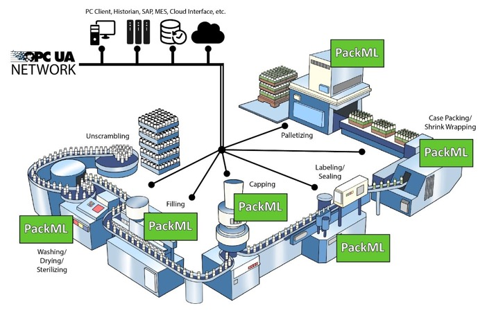
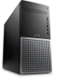
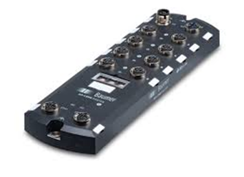
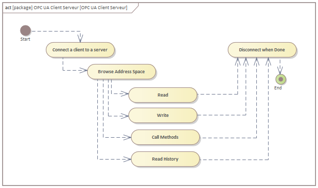
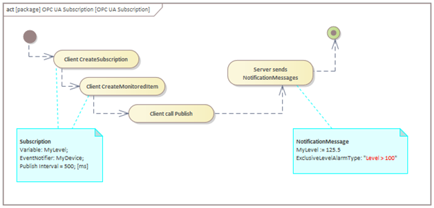
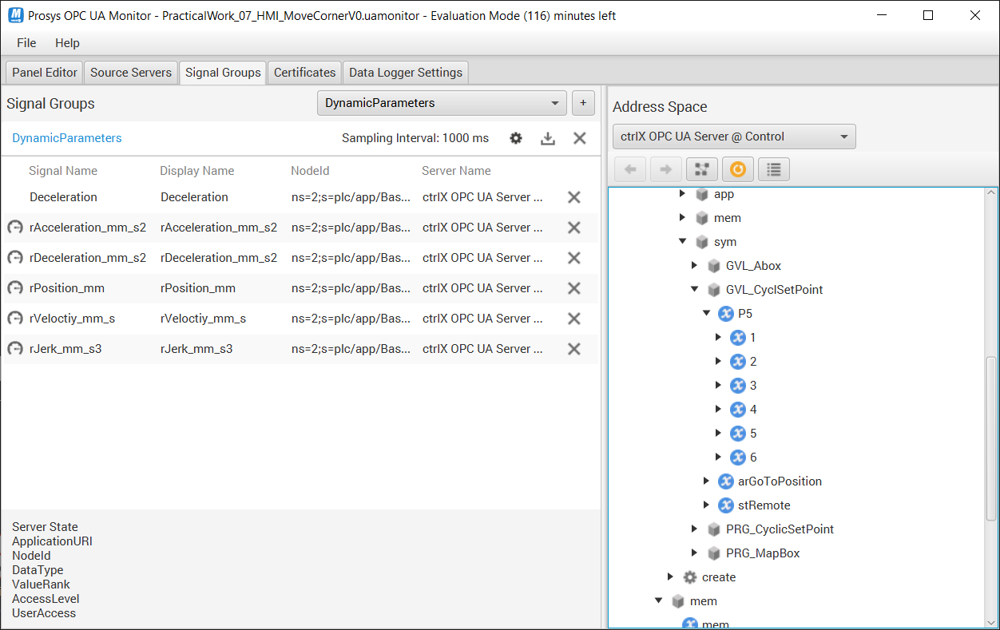
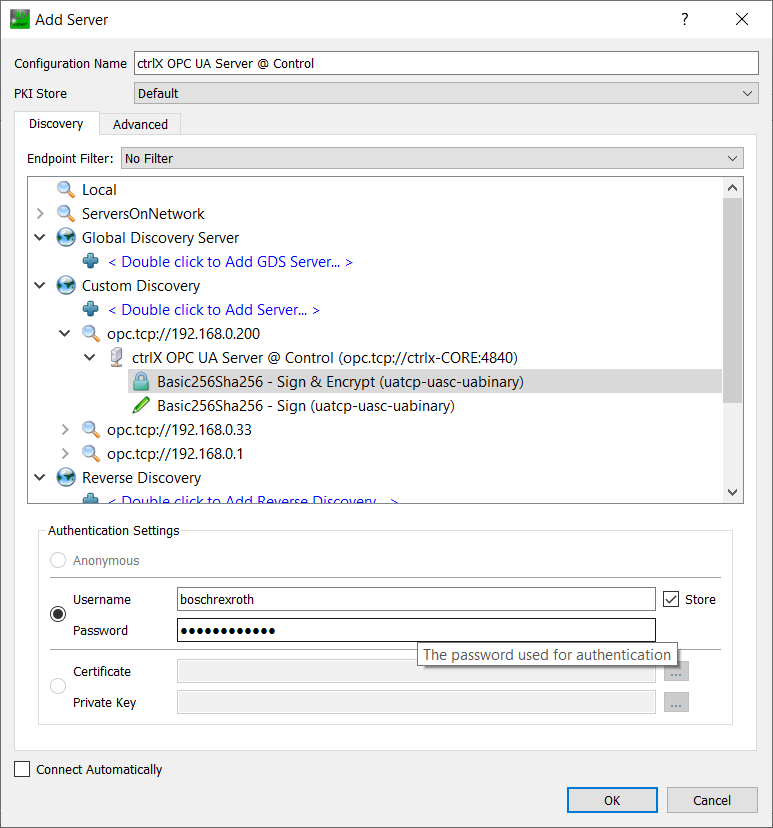

<h1 align="left">
   
  
   
  Industrial Automation Base
   
</h1>

Cours AutB

Author: [Cédric Lenoir](mailto:cedric.lenoir@hevs.ch)

# Module 10 OPC Unified Architecture (UA)

*Keywords:* [OPC UA](https://opcfoundation.org/)

[Sie können zuerst die Übersicht über das industrielle Netzwerk lesen] (IndustrialNetwork.md)

Dieses Modul ist eine Einführung in OPC UA.
OPC UA wird in konfigurierbarer Form verwendet, um seinen Einsatz im Kontext der Automatisierung und allgemeiner für jedes System zu verstehen, das den Austausch einer großen Anzahl komplexer Daten in einem sicheren Kontext erfordert.
Weitere Details zu den erweiterten Funktionen von OPC UA finden Sie in den P&C des 6. Semesters.

# Kontext
## Tor OT - IT

-   IT für Internet Technology
-   OT für Operational Technology

|IT |OT |
|-----------|-----------|
|||
|Source: www.skyguide.ch|Source: Syngenta|

## Notwendigkeit der Kommunikation zwischen verschiedenen Maschinen.
> M2M Maschine zu Maschine

Im Bild unten stellen wir eine Produktionslinie dar, die PackML verwendet für:
- Kommunikation zwischen Maschinen unterschiedlicher Hersteller, die möglicherweise SPS unterschiedlicher Anbieter verwenden.
- Kommunikation mit Maschinenmanagement, [ERP](#erp-enterprise-resource-planung), [MES](#mes-manufacturing-execution-system), [SCADA](#scada-supervisory-control-and-data-acquisition ).

<figure>
    
    <figcaption>Communication between machines. Source opcfoundation.org</figcaption>
</figure>

## Notwendigkeit der Kommunikation zwischen verschiedenen Geräten
Jeder Hersteller verwendet sein eigenes internes Protokoll.
> Es ist weiterhin ein TCP/IP-kompatibler Kommunikationsbus erforderlich, damit die Geräte eine Kommunikation über OPC-UA aufbauen können. Im Labor erfolgt der Transport über ein Profinet-Typ Realtime Ethernet.

| | | |
|-----------|--------------|--------------|
|Siemens S7|Lab PC|Laptop|
||||
|Baumer Gateway|CtrlX Core|HMI|
||||

# OPC UA
## Nachschlagewerk
OPC Unified Architecture von Mahnke, Leitner und Damm, 2009.
Dieses Buch bleibt **DIE** Basis für alle, die sich mit den Details der OPC-UA-Implementierung befassen möchten oder müssen.

Aufgrund seiner wachsenden Bedeutung im Bereich der Automatisierung ist die Komponente **Sicherheit** von OPC UA exemplarisch in einem eigenen Kapitel zum Thema Cyber-Sicherheit integriert.

## Präambel
<figure>
    
    <figcaption>The connected factory is creating a need to provide much higher levels of security than in the past. Source opcfoundation.org</figcaption>
</figure> 

## Geschichte
Es ist nicht möglich, über OPC UA zu sprechen, ohne kurz auf seinen Vorfahren einzugehen, der in der neueren Literatur bekannt ist: OPC Classic.

### Was ist OPC Classic?

Die ursprüngliche OPC Classic-Spezifikation ist OPC DA (Data Access), die eine Schnittstelle zwischen Client- und Serveranwendungen zum Austausch von Prozess- und Fertigungsdaten definiert. Weitere wichtige OPC Classic-Spezifikationen sind OPC Alarms & Events (OPC AE) und OPC Historical Data Access (OPC HDA).
In der Praxis handelt es sich um eine Technologie, die die gemeinsame Nutzung von Variablen in einem TCP/IP-Netzwerk zwischen einer SPS, dem Server, und einem Client, dem PC mit Windows, ermöglicht.

Für den Automatisierungsingenieur besteht dies aus Klicks, um die Daten mit dem OPC auf der IDE-Seite der SPS zu verknüpfen, und dann aus Klicks in der Entwicklungsumgebung des HMI-Clients, der auf einer Windows-Plattform implementiert ist. Hinzu kommen jedes Mal Tränen und Zähneknirschen, wenn die Daten eine Firewall passieren müssen….

### Was ist OPC UA?
**Offene Plattformkommunikation** / **Einheitliche Architektur**
Das Client/Server-Modell ist das traditionelle Kommunikationsmodell in OPC UA. Es basiert auf der Idee, dass es eine passive Serverkomponente gibt, die Daten für andere Anwendungen bereitstellt, die als Clients fungieren. **Client-Anwendungen** können über standardisierte Dienste auf Daten und Informationen vom **Server** zugreifen.

**OPC UA ist für die Nutzung der TCP/IP-Architektur konzipiert**, es belegt die Schichten 5, 6 und 7 des OSI-Modells.

Ohne auf Details einzugehen.
- **Schichten 1 und 2** betreffen die physische Unterstützung. Zum Beispiel: Ethernet-Kabel mit RJ45- oder WLAN-Anschluss.
- **Schichten 3 und 4** geben das TCP/IP-Protokoll an. Das Transmission Control Protocol überträgt Datenpakete und garantiert die erfolgreiche Übertragung dieser Pakete, insbesondere das Internet Protocol liefert die Adresse, zum Beispiel 192.168.0.200.
- Die **Schichten 5, 6 und 7** beziehen sich auf den Aufbau einer sicheren Kommunikation, die Kodierung von Daten im Binärformat und schließlich auf die vom Benutzer kodierte Anwendung.

> OPC-UA über TCP/IP garantiert das Senden und Empfangen von Paketen, garantiert jedoch nicht die zeitliche Präzision des Transports dieser Pakete.

<figure>
    
    <figcaption>OPC UA Layers</figcaption>
</figure> 

Der Begriff **Client/Server** bedeutet im Fall von OPC-UA, dass ein Server darauf ausgelegt ist, eine bestimmte Datenmenge zur Verfügung zu stellen, und dass ein Client alle auf dem Server verfügbaren Daten durchsuchen und auswählen kann, welche Daten er verwenden möchte wird lesen oder ändern wollen. Ein Gerät kann nur ein Server oder nur ein Client sein.

> Das bedeutet, dass zum Zeitpunkt des Kommunikationsaufbaus durch die Schicht-5-Sitzung eine Kommunikation zwischen zwei Punkten aufgebaut wird. Der Client und der Server.

Eine Architektur kann eine Vielzahl von Geräten zusammenführen, die Clients oder Server verschiedener Geräte sein können.

<figure>
    
    <figcaption>Multiple OPC-UA Client Server Configuration</figcaption>
</figure>

- Offenes und **plattformunabhängiges** Protokoll für die Interprozess- und Netzwerkkommunikation.
- Internetzugang und Kommunikation über Firewalls.
- Integrierte Zugriffskontroll- und Sicherheitsmechanismen auf Protokoll- und Anwendungsebene.
- Umfangreiche Mapping-Möglichkeiten für objektorientierte Modelle. Objekte können Tags und Methoden haben und Ereignisse auslösen.
- Erweiterbares Typsystem für komplexe Objekte und Datentypen.
- Transportmechanismen und Modellierungsregeln bilden die Grundlage anderer Standards.
- Skalierbarkeit von kleinen eingebetteten Systemen bis hin zu Unternehmensanwendungen und komplexen objektorientierten Modellen.

# Die Architektur
Der Begriff Unified Architecture bedeutet, dass OPC UA darauf ausgelegt ist, die gesamte Architektur eines Automatisierungssystems abzudecken, von einem ERP über **MES**-, **SCADA**-Systeme bis hin zum Sensor.
Mit anderen Worten: Es ist möglich, über eine Cloud-Anwendung sicher auf Sensorinformationen zuzugreifen.

## ERP Enterprise resource planning / Unternehmensressourcenplanung.
Eine Art von Software, mit der Unternehmen tägliche Aktivitäten wie Buchhaltung, Einkauf, Projektmanagement, Risikomanagement und Compliance sowie Lieferkettenabläufe verwalten, eine Kette, die Lieferant für Lieferant mit dem Kunden verbindet.

## MES Manufacturing Execution System
Ein IT-System, das komplexe Fertigungssysteme und Datenflüsse im Fertigungsbereich verbindet, überwacht und steuert

## SCADA Supervisory Control and Data Acquisition / Überwachungskontrolle und Datenerfassung
Industrielles Überwachungssystem, das eine große Anzahl von Messungen in Echtzeit verarbeitet und Anlagen fernsteuert.

<figure>
    
    <figcaption>The Scope of OPC UA within an enterprise, Source reference.opcfoundation.org
Fonctionnement de base Client Serveur</figcaption>
</figure> 

<figure>
    
    <figcaption>OPC UA Client Serveur</figcaption>
</figure> 

### Als Erstes muss der Client eine Verbindung zum Server herstellen.
- Es benötigt eine Verbindungsadresse, im Allgemeinen IP.
- Anschließend wird eine Sitzung auf dem Server erstellt.
- Die Sitzung enthält einen Sicherheitskontext, der optionale Verschlüsselungs- und Authentifizierungsparameter zur Identifizierung der Clientanwendung und des Benutzers auf dem Server enthält.
- Der Client kann auch den Server identifizieren und entscheiden, ob er die Kommunikation mit ihm autorisiert.

### Die Clientanwendung benötigt möglicherweise einige Standarddienste vom Server. Sie sind :

- Melden Sie sich an und erstellen Sie eine Sitzung.
- Durchsuchen Sie den Adressraum, um herauszufinden, was auf dem Server verfügbar ist
- Lesen - Variablen oder Metadaten
- Schreiben - Variablen oder Metadaten

- Methoden aufrufen
- Verlauf lesen – für Variablen und Ereignisse
- Abmelden und abmelden

## Metadaten
- Metadaten sind Daten, die andere Daten, **Typen**, beschreiben und eine strukturierte Referenz bereitstellen, die dabei hilft, die Attribute der von ihnen beschriebenen Informationen zu sortieren und zu identifizieren.

- Dies ist eine der Stärken des OPC-UA-Standards, die Möglichkeit, vollständige und spezifische Informationen zu erhalten.

- Bestimmte rudimentäre Protokolle wie Modbus liefern einfach eine bestimmte Anzahl von Bytes an eine bestimmte Adresse. Im besten Fall können wir, wenn wir die hexadezimale Adresse einer Information im Voraus kennen, eine bestimmte Anzahl von Bytes ohne Garantie dafür lesen Die Anzahl der Bytes und deren Format haben sich auf Client-Seite zum Zeitpunkt des Lesens nicht verändert.

- Dank der Integration des Metadatenmanagements in den OPC UA-Standard können wir das Datenformat beim Aufbau der Sitzung lesen (oder im Falle einer Änderung sogar eine Benachrichtigung erhalten).

- Datentyp (INT, REAL, WORD usw.) sowie strukturierte Daten (STRUCT) abrufen

- Erhalten Sie, falls verfügbar, die **Informationseinheit**, ihre **Toleranz**, ihr **Datum**, ihre **Historie** sowie praktisch alles, was der Manager zur Verfügung gestellt hat.

## OPC UA-Abonnementkonzept
Im Gegensatz zum permanenten Auslesen von Informationen (Read) bietet OPC UA eine elegantere Funktionalität, die sogenannte Subscription. Ein UA-Client kann eine Auswahl interessanter Knoten abonnieren und diese Elemente vom Server überwachen lassen. Nur bei Änderungen, z.B. an ihren Werten informiert der Server den Client über diese Änderungen. Dieser Mechanismus reduziert die übertragene Datenmenge erheblich. Neben der Reduzierung der Bandbreite bietet dieser Mechanismus weitere Vorteile und ist der empfohlene Mechanismus zum „Lesen“ von Informationen von einem UA-Server.

Ein Client kann verschiedene Arten von Informationen abonnieren, die von einem OPC UA-Server bereitgestellt werden. Der Zweck eines Abonnements besteht darin, diese Informationsquellen, MonitoredItem genannt, zu gruppieren, um Informationen namens Notification zu bilden. Beispielsweise ist es möglich, die Elemente nach dem Zeitintervall zu gruppieren, das der Server zur Überwachung der Werte der verschiedenen Abonnements verwendet.

Sobald das Abonnement erstellt ist, sendet der Client die Veröffentlichungsinformationen an den Server und der Server antwortet bei Bedarf regelmäßig mit NotificationMessages. Die NotificationMessage kann DataChanges bzw. Events vom Typ MonitoredItems enthalten.

<figure>
    
    <figcaption>OPC UA Subscription</figcaption>
</figure> 

### Die Komponenten von OPC UA
- OPC UA ist ein Monster, die meisten Implementierungen integrieren jedoch nur einen Teil des gesamten OPC UA.
- Die meisten Tools für OPC UA dienen dazu, Komplexität zu kapseln, um dem Endbenutzer Daten auf einfache Weise darzustellen. [Beispiel: OPC UA Monitor von Prosys](https://prosysopc.com/products/opc-ua-monitor/).

Die grundlegenden Komponenten der OPC Unified Architecture sind die Transportmechanismen und die Datenmodellierung gemäß der OPC Unified Architecture von Mahnke, Leitner und Damm.

<figure>
    
    <figcaption>Infrastructure OPC UA, Source: https://opcfoundation.org</figcaption>
</figure> 

### Transport
Der Transport definiert verschiedene Mechanismen, die für verschiedene Anwendungsfälle optimiert sind. Die erste Version von OPC UA definiert ein binäres TCP-Protokoll, das für leistungsstarke Intranet-Kommunikation sowie die Zuordnung zu akzeptierten Internet-Standards wie Web Services, XML und HTTP für Firewall-konforme Internet-Kommunikation optimiert ist. Beide Transporte verwenden dasselbe nachrichtenbasierte Sicherheitsmodell, das von Webdiensten bekannt ist, und das abstrakte Kommunikationsmodell ist nicht von den Transportmechanismen abhängig.

> OPC UA definiert verschiedene Protokolle, integriert aber vor allem Sicherheitsmechanismen sowie Firewall-kompatible Mechanismen.

### Modellierung, objektorientiert
Die Datenmodellierung definiert die Grundregeln und Bausteine, die zum Offenlegen eines Informationsmodells mit OPC UA erforderlich sind. Es definiert außerdem Einstiegspunkte in den Adressraum und die Basistypen, die zum Aufbau einer Typhierarchie verwendet werden. Diese Basis kann durch Informationsmodelle erweitert werden, die auf abstrakten Modellierungskonzepten basieren. Darüber hinaus werden einige verbesserte Konzepte definiert, beispielsweise die Beschreibung von Zustandsautomaten, die in verschiedenen Informationsmodellen verwendet werden.
UA-Dienste sind die Schnittstelle zwischen Servern als Anbieter eines Informationsmodells und Clients als Verbraucher dieses Informationsmodells. Die Dienste werden abstrakt definiert. Sie nutzen Transportmechanismen, um Daten zwischen dem Client und dem Server auszutauschen.
Dieses Grundkonzept von OPC UA ermöglicht es einem OPC UA-Client, auf die kleinsten Datenstücke zuzugreifen, ohne das gesamte Muster komplexer Systeme verstehen zu müssen. OPC UA-Clients, einschließlich spezifischer Modelle, können erweiterte Funktionen nutzen, die für spezielle Domänen und Anwendungsfälle definiert sind. Abbildung 2 zeigt die verschiedenen Schichten von Informationsmodellen, die von OPC, von anderen Organisationen oder von Lieferanten definiert wurden.

### Erkennungsmechanismus
Einer der besonderen und grundlegenden Aspekte der OPU UA ist ihre Entdeckungsfunktion. Dies bedeutet, dass die Architektur nicht nur den Aspekt des Datenzugriffs integriert, sondern auch den Zugriff auf Datenmodellierung, Metadaten. Ohne die Struktur eines Sensors im Voraus zu kennen, ist es möglich, die Organisation der Daten innerhalb dieses Sensors zu entdecken, bestimmte Parameter zu lesen oder zu schreiben, aber auch Methoden aufzurufen. Wir könnten sagen, dass es nicht nur möglich ist, auf ein Objekt zuzugreifen, sondern auch seine Klasse zu entdecken.

<figure>
    
    <figcaption>OPC UA, Object Oriented, Source OPC Unified Architecture de Mahnke, Leitner et Damm</figcaption>
</figure> 

### Objektorientierte
Dies bedeutet, dass es für einen Client beispielsweise möglich ist, eine Verbindung zu verschiedenen Geräten herzustellen, die von denselben „Eltern“ erben, um beispielsweise deren Namen zu erfahren, ohne sich um das vollständige Modell kümmern zu müssen.

<figure>
    
    <figcaption>Object Model OPC UA, Source https://opcfoundation.org</figcaption>
</figure> 

Unglücklicherweise für das Verständnis der Spezifikation verwendet die OPC UA-Definition nicht UML, sondern eine eigene Notation.

<figure>
    
    <figcaption>Objet and Instance in OPC UA style, Source reference.opcfoundation.org</figcaption>
</figure> 

<figure>
    
    <figcaption>Object and Instance in OPC UA style converted to SysML / UML</figcaption>
</figure> 

## OPC UA, Functional Specification
OPC UA ist nach **IEC 62541** standardisiert. Die OPC UA-Spezifikation ist ein Monster, das im Jahr 2020 bereits mehr als 15 Teile umfasst, die teilweise mehrere hundert Seiten umfassen. Dies gilt ohne Berücksichtigung der entsprechenden Standards.

> Allerdings sollte dieser **ungeheuerliche** Aspekt, wenn wir OPC UA aus der technischen Perspektive der Person betrachten, die es implementieren muss, den Endbenutzer, der der Automatisierungsingenieur ist, nicht erschrecken. Ziel dieses Kurses ist nicht die Implementierung von OPC UA, sondern das Verständnis seiner Vorteile.

|OPC UA / IEC 62541|Year |Part|Name|
|-------------------|--|----|--------------------|
|IEC TR 62541-1:|2020|OPC unified architecture - Part 1: |Overview and concepts|
|IEC TR 62541-2:|2020|OPC unified architecture - Part 2: |Security Model|
|IEC 62541-3: |2020  |OPC Unified Architecture - Part 3: |Address Space Model|
|IEC 62541-4: |2020  |OPC Unified Architecture - Part 4: |Services|
|IEC 62541-5: |2020  |OPC Unified Architecture - Part 5: |Information Model|
|IEC 62541-6: |2020  |OPC Unified Architecture - Part 6: |Mappings|
|IEC 62541-7: |2020  |OPC unified architecture - Part 7: |Profiles|
|IEC 62541-8: |2020  |OPC Unified Architecture - Part 8: |Data Access|
|IEC 62541-9: |2020  |OPC Unified Architecture - Part 9: |Alarms and Conditions|
|IEC 62541-10:|2020  |OPC Unified Architecture - Part 10: |Programs|
|IEC 62541-11:|2020  |OPC Unified Architecture - Part 11: |Historical Access|
|IEC 62541-12:|2020  |OPC Unified Architecture - Part 12: |Discovery and global services|
|IEC 62541-13:|2020  |OPC Unified Architecture - Part 13: |Aggregates|
|IEC 62541-14:|2020  |OPC Unified Architecture - Part 14: |PubSub|
|IEC 62541-100:|2015 |OPC Unified Architecture - Part 100: |Device Interface|

Bitte beachten Sie IEC 62451-13:2020 Normnummer-Teil:Jahr. Zum Zeitpunkt der Erstellung dieses Kurses befinden sich die meisten Teile in der **Vorveröffentlichung**, d. h. im Prozess der endgültigen Genehmigung.

# OTSecurity
Eine der Besonderheiten von OPC-UA besteht darin, Sicherheitskonzepte in seine Basisspezifikation IEC TR 62541-2:2020 aufzunehmen. OPC einheitliche Architektur – Teil 2, Sicherheitsmodell.

- OPC UA bietet ein gewisses Maß an Benutzernamen- und Passwortsicherheit.
- OPC UA bietet ein gewisses Maß an Sicherheit durch Zertifikatsaustausch.
- OPC UA bietet einen Datenverschlüsselungsdienst.

> Vergleicht man beispielsweise OPC UA mit einem Protokoll vom Typ MODBUS-TCP, so ist keine der drei oben genannten Sicherheitsstufen durch Modbus spezifiziert, was bedeutet, dass jeder auf die Daten eines Geräts zugreifen kann, das mit einem Modbus-Server ausgestattet ist.

> Es wird an der Sicherung des Modbus-Protokolls gearbeitet.

# Ethernet APL, Advanced Physical Layer
Derzeit ist es nach wie vor schwierig, OPC-UA in bestimmten Industriebereichen einzusetzen, vor allem aufgrund der Abhängigkeit von Ethernet-Netzwerken, Layer 1 und 2. Dies ist einer der Gründe für die neue Ethernet-APL-Technologie. [Siehe Industrial Network](IndustrialNetwork_DE.md).

<figure>
    
    <figcaption>Ethernet-APL</figcaption>
</figure> 

# Im HEVS-Labor
- Wir nutzen die Maschine-zu-Maschine-Kommunikation zwischen Siemens S7 und CtrlX Core.
- Über ein Baumer Gateway können wir auf die Daten der IO-Link-Katoren zugreifen.
- Wir verwenden ein Prosys-Tool als HMI **No Code**, um mit dem CtrlX Core zu kommunizieren.

## Examples from the lab

<figure>
    
    <figcaption>Display values and set parameters for a trajectory</figcaption>
</figure> 

<figure>
    
    <figcaption>Connection between Prosys Client and CtrlX Server</figcaption>
</figure> 

<figure>
    
    <figcaption>Connection between Prosys Client and CtrlX Server</figcaption>
</figure> 

<figure>
    
    <figcaption>Certificate on client side</figcaption>
</figure> 

<figure>
    
    <figcaption>Certificate on server side</figcaption>
</figure> 

<figure>
    
    <figcaption>Signal selecction on client side</figcaption>
</figure> 

<figure>
    
    <figcaption>Signal selecction on server side</figcaption>
</figure> 

<figure>
    
    <figcaption>Connect to CtrlX with UA Expert</figcaption>
</figure> 

<figure>
    
    <figcaption>Connect to CtrlX with UA Expert to set Polynomial</figcaption>
</figure> 