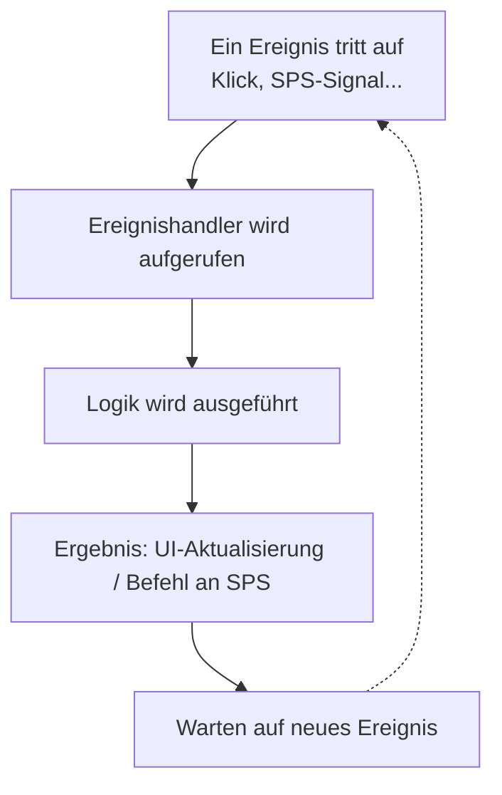
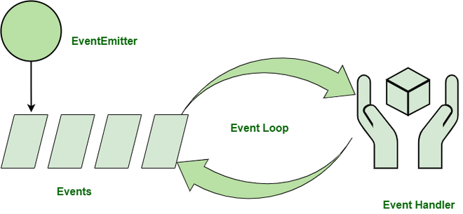
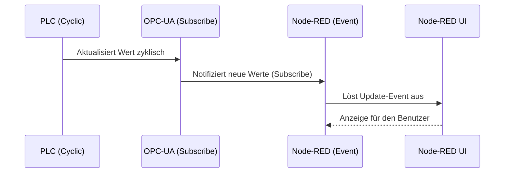

<h1 align="left">
     
    
     
    Industrial Automation Base
     
</h1>

Kurs AutB

Author: [Cédric Lenoir](mailto:cedric.lenoir@hevs.ch)

# Modul 13 OPC UA & OT-Sicherheit

Schlüsselwörter: **OPC-UA, OT**.

## Kontext
In einem einfachen Fall — wie es bei vielen IACS (Industrial Automation and Control Systems) vorkommt — besteht das Herz des Systems aus einer SPS, die vollständig autonom arbeiten kann.

In komplexeren Szenarien muss die SPS mit einem Benutzer interagieren, sei es ein Mensch oder ein anderes System. Die gebräuchlichsten Fälle sind:
- Maschinenstatus
- Maschinendiagnose
- Änderung von Maschinenparametern
- Manuelle Aktivierung bestimmter Maschinenteile

## Ziel
- Die Grundlagen eines einfachen Werkzeugs vermitteln, das ermöglicht:
    - Informationen von einer SPS zu lesen und in einer grafischen Oberfläche anzuzeigen
    - Parameter-Sets zu lesen, zu ändern, zu speichern und wiederherzustellen
    - Eine Reihe von Aktionen und Ereignissen zu protokollieren, unabhängig davon, ob sie von der SPS oder der UI stammen
- Das Grundprinzip der ereignisgesteuerten Programmierung verstehen
- Wissen, was OPC UA ist und wozu es dient
    - Kommunikation zwischen verschiedenen Plattformen
    - Verständnis der Ethernet-Abhängigkeit und damit der Relevanz von [Ethernet APL](https://www.ethernet-apl.org/)

## Zu wissen
- Grundkonzepte von OPC UA
    - Konzipiert für den Betrieb über Ethernet
    - Baut auf fortgeschrittenen Sicherheitsmechanismen auf
    - Ermöglicht sehr komplexe Architekturen von der Fabrik bis zum Sensor
    - Gilt als Standardkommunikationsprotokoll in der Industrie
    - Objektorientiert; bietet Mechanismen zur Entdeckung und Modellbeschreibung
    - Spart Bandbreite durch Abonnement-/Publish-Mechanismen (Subscribe)
    - Nachteil: ständige Weiterentwicklung; Funktionalitäten können zwischen Anbietern stark variieren
- Was ist Node-RED und wofür wird es genutzt
    - Grundlegende Merkmale ereignisbasierter Programmierung

# Windows-Oberflächen
In den 1990er Jahren — und teils noch heute — wurden viele Benutzeroberflächen auf Windows-Basis entwickelt. Seit dem Aufkommen des iPhones (2007) haben sich die Erwartungen der Anwender verändert: Web-/HTML-basierte Interfaces sind weit verbreitet.

### OPC Classic
OPC Classic wurde ab 1996 von der OPC Foundation entwickelt, um die Kommunikation zwischen Industriehardware und Software zu standardisieren. Obwohl weit verbreitet, wird OPC Classic zunehmend durch OPC UA ersetzt, das bessere Sicherheit, Flexibilität und plattformübergreifende Kompatibilität bietet. OPC Classic bleibt in vielen Alt-Systemen aus Kompatibilitätsgründen in Gebrauch.

### Lebensdauer von Windows 95 und Windows NT
- **Windows 95**: Release Aug 1995, offizieller Support endete Dez 2001
- **Windows NT 4.0**: Release Juli 1996, Mainstream-Support endete Juni 2002, erweiterter Support Juni 2004

Das Aufkommen von Smartphones und HTML5 hat die Softwarelandschaft verändert. Viele Anwendungen sind heute serverbasiert; die Automationsbranche folgt diesem Trend mit Verzögerung.

Automatisierung ist heute stark vernetzt.

## Benutzeroberfläche (UI)
Die UI eines IACS variiert stark je nach Anbieter. SPS-Hersteller bieten oft integrierte Visualisierungslösungen an; es gibt aber auch spezialisierte Anbieter für HMI/SCADA, die komplexe Fabrikanwendungen abdecken.

### SCADA

    
    
<em>Quelle: ABB</em>

### Elemente eines SCADA-Systems
Ein SCADA-System (Supervisory Control And Data Acquisition) umfasst typischerweise:
- **Bedienstationen / HMI**: Benutzeroberflächen zur Überwachung und Steuerung
- **SCADA-Server**: Erfassen, verarbeiten und archivieren Daten
- **SPS / RTU**: Feldgeräte, die Befehle ausführen und Sensordaten liefern
- **Kommunikationsnetzwerke**: Ethernet, Modbus, OPC etc.
- **Historian**: Datenbank für Archivierung, Analyse und Berichte
- **Alarm- & Ereignissysteme**: Benachrichtigung bei Abweichungen

Diese Komponenten ermöglichen Überwachung, Steuerung und Optimierung industrieller Prozesse.

    
    
<em>Quelle: Siemens</em>

## OPC UA

    
    
<em>Quelle: Endress&Hauser</em>

# Web-Interface

## Vergleich: klassische HMI vs. smartphone-inspirierte Interfaces
Studien vergleichen Ergonomie, User Experience, Lernkurve und Reaktionsverhalten zwischen klassischen HMIs und modernen, von Smartphones inspirierten UIs.

### Typische Vergleichspunkte
- **Ergonomie & Design**: Moderne Interfaces sind einfacher und intuitiver; klassische HMIs sind oft technischer
- **Reaktivität**: Smartphones bieten flüssige Animationen und unmittelbares Feedback
- **Adaptivität**: Responsive Design für verschiedene Bildschirmgrößen vs. fixe HMI-Layouts
- **Sicherheit**: Industrielle HMIs integrieren spezifische Sicherheitsmechanismen

# Node-RED — etwas Technik
Node-RED basiert auf Node.js.

## Node.js
Node.js ist eine serverseitige JavaScript-Laufzeit, gebaut auf der V8-Engine von Google Chrome. Es ermöglicht die Ausführung von JavaScript außerhalb des Browsers, ideal für Netzwerkapplikationen.

### Unterschiede zu SPS und Python
| Aspekt | Node.js (JavaScript) | SPS (Ladder, ST, etc.) | Python |
|---|---:|---:|---:|
| Paradigma | Ereignisorientiert, asynchron | Zyklisch, Echtzeit | Imperativ, OO |
| Ausführung | Nicht-blockierend, interpretiert | Zyklisch, deterministisch | Interpretiert, synchron/asynchron |
| Typische Nutzung | Webserver, IoT, APIs | Maschinensteuerung | Scripting, Data Science, Web |
| I/O | Asynchron (Callbacks/Promises) | Direkter HW-Zugriff | Synchron/Asynchron |

Node.js verwaltet viele gleichzeitige Ereignisse über seine Event-Loop; SPS sind für deterministische Echtzeitsteuerung optimiert; Python ist vielseitig einsetzbar.

## Ereignisgesteuerte Programmierung

Ereignisprogrammierung: das System reagiert auf Ereignisse, ruft Handler auf und kehrt in den Wartezustand zurück.

### Events & Event Emitters
- **Ereignisse**: Signale über Aktionen oder Zustandsänderungen
- **Event-Emitter**: Objekte, die Ereignisse auslösen und Listener verwalten

Grundbausteine: Callback-Funktionen (Event-Handler) und die Event-Loop.

    
    
<em>Quelle: https://www.geeksforgeeks.org</em>

## Vor- und Nachteile ereignisgesteuerter Programmierung
- Vorteile: Flexibilität, gute Eignung für UIs, effiziente Nutzung von Interrupts, einfache Integration von Sensorik
- Nachteile: erhöhte Komplexität, schwerer nachvollziehbarer Programmfluss, anspruchsvolleres Debugging

> Zusammenfassend: gut geeignet für kleine bis mittlere Anwendungen (Laborroboter, Prüfstände), weniger erprobt für sehr großskalige Systeme in diesem Kurskontext.

## V8 JavaScript-Engine
V8 ist die von Google entwickelte JavaScript-Engine, eingesetzt in Chrome und Node.js. Sie übersetzt JS in Maschinencode (JIT), was die Performance stark verbessert. Vergleichbar mit der JVM für Java.

### Relevante Punkte für Studierende mit Java-/Python-/IEC-Kenntnissen
- V8 ≈ JVM für Java
- JIT-Kompilierung erhöht Geschwindigkeit
- V8 ermöglicht serverseitiges JavaScript (Node.js)

### Rolle von OPC UA
OPC UA kann:
- zyklisch Daten lesen
- nur bei Änderung informieren (Subscribe)
- ereignisbasiert schreiben

# OPC-UA, *Vertiefung*
Dieses Modul ist eine Einführung in OPC UA. OPC UA wird parametrisiert eingesetzt, um seine Rolle in der Automation zu verstehen — insbesondere für den sicheren Austausch komplexer Datenmengen.
Für vertiefte, fortgeschrittene Funktionen siehe entsprechende Lehrveranstaltung im 6. Semester P&amp;C.

## OT-IT-Gateway
- IT: Information Technology
- OT: Operational Technology

|IT |OT |
|-----------|-----------|
|||
|Quelle: www.skyguide.ch|Quelle: Syngenta|

## Maschine-zu-Maschine-Kommunikation (M2M)
PackML wird oft genutzt, um:
- Kommunikation zwischen Maschinen verschiedener Hersteller sicherzustellen
- Anbindung an ERP, MES, SCADA

<figure>
        
        <figcaption>Kommunikation zwischen Maschinen. Quelle: opcfoundation.org</figcaption>
</figure>

## Kommunikation zwischen verschiedenen Geräten
Hersteller nutzen oft proprietäre Protokolle. Ein TCP/IP-kompatibler Bus ist dennoch erforderlich, damit OPC UA genutzt werden kann. Im Labor erfolgt der Transport z. B. über Profinet.

# OPC UA — Referenzen
OPC Unified Architecture, Mahnke, Leitner und Damm (2009) ist die grundlegende Referenz für OPC UA.
Die Sicherheitskomponente von OPC UA ist in IEC TR 62541-2 behandelt und relevant für OT-Security.

## Funktionsumfang / IEC-Teile
| OPC UA / IEC 62541 | Jahr | Teil | Name |
|---|---:|---:|---|
| IEC TR 62541-1 | 2020 | Part 1 | Overview and concepts |
| IEC TR 62541-2 | 2020 | Part 2 | Security Model |
| IEC 62541-3    | 2020 | Part 3 | Address Space Model |
| IEC 62541-4    | 2020 | Part 4 | Services |
| IEC 62541-5    | 2020 | Part 5 | Information Model |
| IEC 62541-6    | 2020 | Part 6 | Mappings |
| IEC 62541-7    | 2020 | Part 7 | Profiles |
| IEC 62541-8    | 2020 | Part 8 | Data Access |
| IEC 62541-9    | 2020 | Part 9 | Alarms and Conditions |
| IEC 62541-10   | 2020 | Part 10| Programs |
| IEC 62541-11   | 2020 | Part 11| Historical Access |
| IEC 62541-12   | 2020 | Part 12| Discovery and global services |
| IEC 62541-13   | 2020 | Part 13| Aggregates |
| IEC 62541-14   | 2020 | Part 14| PubSub |
| IEC 62541-100  | 2015 | Part 100| Device Interface |

Hinweis: Viele Teile waren zum Zeitpunkt der Kurserstellung als Pre-Release verfügbar.

# OT-Sicherheit
OPC UA integriert Sicherheitsaspekte (IEC TR 62541-2). Wesentliche Punkte:
- Authentifizierung per Benutzername/Passwort
- Authentifizierung/Identifikation via Zertifikate
- Datenverschlüsselung

> Im Gegensatz dazu spezifiziert z. B. Modbus-TCP keine dieser Sicherheitsstufen; daher ist Modbus potentiell offen zugänglich, sofern keine zusätzliche Sicherung implementiert ist.

Arbeiten zur Absicherung von Modbus laufen.

# Ethernet APL (Advanced Physical Layer)
OPC UA ist stark von Ethernet (Schichten 1 & 2) abhängig, was den Einsatz in manchen Industriebereichen erschwert. Ethernet-APL ist eine Technologie, die diese Lücke adressiert. Siehe auch `IndustrialNetwork.md`.

<figure>
        
        <figcaption>Ethernet-APL</figcaption>
</figure>

---

<!-- Ende von README_DE.md -->

<figure>
    
    <figcaption>OPC UA, Object Oriented, Quelle: OPC Unified Architecture von Mahnke, Leitner und Damm</figcaption>
</figure> 

### Objektorientiert
Für einen Client ist es möglich, sich mit Geräten zu verbinden, die von demselben "Parent" erben, um z. B. deren Namen zu ermitteln, ohne das komplette Modell zu kennen.

<figure>
    
    <figcaption>Object Model OPC UA, Quelle https://opcfoundation.org</figcaption>
</figure> 

<!-- truncated to keep patch within limits -->
