<h1 align="left">
   
  
   
  Industrial Automation Base
   
</h1>

Cours AutB

Author: [Cédric Lenoir](mailto:cedric.lenoir@hevs.ch)

# Module 13 Design Specification.

*Keywords:* **GMP URS FS DS HDS SDS IQ OQ PQ FMEA Safety Risk Matrix V-Diagram**

Nous avons maintenant une base technique d'automatisation, il faut toutefois être conscient que tout ce qui concerne la programmation, le choix des éléments ou la régulation ne sont qu'un aspect d'un projet d'automatisation.

## Sommaire

- [Module 13 Design Specification.](#module-13-design-specification)
  - [Sommaire](#sommaire)
  - [Objectif](#objectif)
  - [A propos des documents en annexe](#a-propos-des-documents-en-annexe)
  - [A savoir](#a-savoir)
    - [Principales Causes d'Échec d'un Projet d'Automation](#principales-causes-déchec-dun-projet-dautomation)
  - [Tenants et aboutissants](#tenants-et-aboutissants)
  - [GMP](#gmp)
  - [GAMP5](#gamp5)
  - [V-Diagram](#v-diagram)
    - [Origine du V-Diagram](#origine-du-v-diagram)
- [Spécifications](#spécifications)
  - [URS, User Request Specification](#urs-user-request-specification)
  - [Un exemple pour un banc de test](#un-exemple-pour-un-banc-de-test)
    - [Imprécisions Liées à cette URS](#imprécisions-liées-à-cette-urs)
      - [Exemple d'Analyse des Exigences](#exemple-danalyse-des-exigences)
      - [Conseil](#conseil)
  - [FS, Functional Specification](#fs-functional-specification)
    - [FS Vannes de Sécurité](#fs-vannes-de-sécurité)
    - [Bonne pratique](#bonne-pratique)
  - [DS, Design Specification](#ds-design-specification)
    - [Exemple](#exemple)
  - [FMEA, Analyse du risque](#fmea-analyse-du-risque)
  - [Tests](#tests)
    - [IQ Installation Qualifications](#iq-installation-qualifications)
      - [Quelques clés](#quelques-clés)
    - [OQ Operational Qualifications](#oq-operational-qualifications)
    - [PQ Performance Qualifications](#pq-performance-qualifications)
  - [On utilise aussi](#on-utilise-aussi)
  - [Processus de gestion de la qualité](#processus-de-gestion-de-la-qualité)
    - [Gestion documentaire](#gestion-documentaire)
      - [Gestion des changements](#gestion-des-changements)
      - [Gestion de la configuration](#gestion-de-la-configuration)
      - [Gestion des incidents](#gestion-des-incidents)
      - [La gestion des fournisseurs](#la-gestion-des-fournisseurs)
      - [La gestion des enregistrements](#la-gestion-des-enregistrements)
      - [Archivage](#archivage)
      - [Gestion de la formation](#gestion-de-la-formation)
      - [Évaluation périodique](#évaluation-périodique)
      - [Sécurité](#sécurité)
    - [Quelques exemples.](#quelques-exemples)
- [Mémo](#mémo)

## Objectif
Fournir un mémo pour un projet d'automatisation réussi.

## A propos des documents en annexe
Ce module fournit une série de documents en annexe, principalement pour la gestion du diagramme en V mentionné ci-dessous. Ce genre de documents ne sont pas simples à trouver en ligne. C'est la raison pour laquelle ceux-ci, sont mis à disposition.

## A savoir
Comprendre la signification des différents mots clés et les placer dans le contexte d'un projet d'automatisation.

---

### Principales Causes d'Échec d'un Projet d'Automation

1. Mauvaise Définition des Exigences, **URS**
Une définition incomplète ou incorrecte des besoins des utilisateurs, **URS** peut entraîner des écarts importants entre les attentes et le résultat final.  
**Référence** : Sommerville, I. (2011). *Software Engineering*.

1. Gestion de Projet Inefficace
Un manque de **planification**, de communication ou de suivi peut conduire à des retards, des dépassements de budget ou des livrables de faible qualité.  
**Référence** : Kerzner, H. (2017). *Project Management: A Systems Approach to Planning, Scheduling, and Controlling*.

1. Sous-Estimation des Ressources
Ne pas allouer suffisamment de temps, de budget ou de personnel qualifié peut compromettre la réussite du projet. *Il est impossible d'estimer les ressources sans des **URS** complètes et précises.* 
**Référence** : PMI (2021). *A Guide to the Project Management Body of Knowledge (PMBOK® Guide)*.

1. Résistance au Changement
Les utilisateurs finaux peuvent être réticents à adopter de nouveaux systèmes, surtout si la formation ou l'accompagnement est insuffisant.  
**Référence** : Kotter, J. P. (1996). *Leading Change*.

1. Problèmes Techniques
Des erreurs dans la conception logicielle **SDS** ou matérielle **HDS** peuvent entraîner des défaillances ou des incompatibilités.  
**Référence** : Pressman, R. S. (2014). *Software Engineering: A Practitioner's Approach*.

1. Tests Insuffisants
Des tests incomplets ou mal exécutés, **IQ**, **OQ**, **PQ** peuvent laisser passer des défauts critiques.  
**Référence** : Myers, G. J., Sandler, C., & Badgett, T. (2011). *The Art of Software Testing*.

1. Absence de Gestion des Risques
Ne pas anticiper les risques potentiels peut aggraver les problèmes lorsqu'ils surviennent. **FMEA** 
**Référence** : Hillson, D. (2003). *Effective Opportunity Management for Projects*.

  Noter qu'à aucun moment il n'est précisé un échec en raison de problèmes techniques liés au codage !

---

## Tenants et aboutissants
-   La partie purement technique d'un projet d'automatisation n'est qu'un facteur parmi d'autres qui contribuent au succès d'un projet.
-   L'automatisation de base, telle que vue dans le cadre de ce module, doit être vue comme une intégration de différents ensembles. La programmation de l'automate au sens IACS, souvent basée sur IEC-61131-3 doit être vue comme le cœur d'un ensemble complet qui contient entre autres:
    -   Une interface utilisateur.
    -   Un système de communication composé de différents réseaux et sous réseaux.
    -   Des capteurs et actuateurs qui peuvent être électriques, pneumatiques ou hydrauliques.
    -   Des ensembles et sous-ensembles mécaniques.
    -   Différents modules basés sur des processeurs qui peuvent être distribués sur les capteurs ou actuateurs.
    -   Une modélisation du système que ce soit au niveau de sa structure, les diagrammes de classe et d'objet, ou son comportement principalement représenté sous forme de diagrammes d'état.
    -   La sécurisation de l'ensemble.
    -   Des systèmes de contrôle composés de un, mais souvent plusieurs régulateurs.
  - La complexité revient à gérer un ensemble de domaine sans perdre de vue l'objectif qui est de répondre à une spécification donnée.

## GMP
GMP est un acronyme qui est principalement utilisé dans le monde de l'industrie pharmaceutique. Des entreprises actives en automatisation industrielles appliquent ce principe aussi pour d'autres types d'industrie car l'expérience montre que cela permet d'améliorer significativement le résultat final du projet.

GMP, Good Manufacturing Practices, sont des directives qui fournissent un cadre pour garantir que les produits sont fabriqués de manière cohérente et contrôlée selon des normes de qualité appropriées. Dans le cadre de l'automatisation des processus, GMP se concentre sur la validation et la vérification des systèmes automatisés pour s'assurer qu'ils fonctionnent correctement et de manière fiable. Cela inclut la documentation rigoureuse des spécifications, des tests et des procédures de maintenance pour garantir que les systèmes automatisés répondent aux exigences réglementaires et de qualité tout au long de leur cycle de vie.

  Une traduction libre de GMP en français serait:

  "Travailler dans les règles de l'art"

## GAMP5 
GAMP5, ou **Good Automated Manufacturing Practice 5**, est un guide de **bonnes pratiques** pour la validation des systèmes automatisés dans l'industrie pharmaceutique et les industries réglementées. Il fournit un cadre basé sur le cycle de vie pour garantir que les systèmes automatisés sont adaptés à leur usage prévu et conformes aux exigences réglementaires.

Le guide met l'accent sur une approche basée sur les risques pour la validation, en se concentrant sur les aspects critiques pour la qualité du produit et la sécurité des patients. GAMP5 encourage également une documentation proportionnée et pragmatique, en évitant les excès inutiles tout en assurant la conformité.

Pour plus d'informations, vous pouvez consulter les ressources officielles ou les publications de l'ISPE, [International Society for Pharmaceutical Engineering](https://ispe.org/about), qui est l'organisation à l'origine de GAMP.

  
  
<em>Source Lonza Visp</em>

## V-Diagram
### Origine du V-Diagram

Le V-Diagram, ou diagramme en V, est une méthodologie de gestion de projet largement utilisée dans les domaines de l'ingénierie système, du développement logiciel et de l'automatisation industrielle. Il trouve son origine dans les années 1980, dans le cadre des efforts visant à structurer et formaliser les processus de développement de systèmes complexes.

Le diagramme en V a été initialement développé par des organisations travaillant sur des projets d'ingénierie critiques, tels que l'aérospatiale, la défense et l'automobile. Il a été conçu pour répondre à la nécessité de garantir la traçabilité, la qualité et la validation des systèmes tout au long de leur cycle de vie.

Le V-Diagram met en évidence une approche séquentielle et structurée, où chaque phase de conception et de développement est associée à une phase correspondante de test et de validation. Cette méthodologie est particulièrement utile pour gérer les projets où la sécurité, la fiabilité et la conformité réglementaire sont des priorités.

Aujourd'hui, le V-Diagram est largement adopté dans divers secteurs industriels et reste un outil clé pour assurer le succès des projets complexes.

  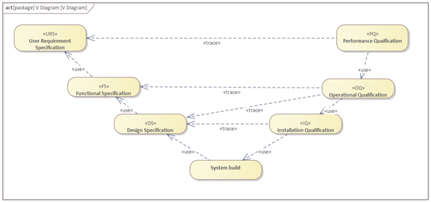
  
<em>Représentation du V-Diagram</em>

# Spécifications

## URS, User Request Specification
L’URS défini les besoins. Quelles sont les principales fonctionnalités requises ? L’URS doit refléter les critères d’acceptance futurs de l’utilisateur, qui seront validés par une procédure de Qualification des Performances Performance Qualification, PQ.

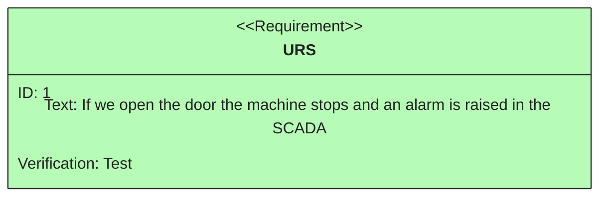

> L'URS est le travail du client. La tâche de l'ingénieur en automation consiste à dire: Je ne commence pas un travail tant que je n'ai pas pu valider l'URS fournie par le client. **L'URS défini la réponse à la question: Quoi ?**

Il faut bien comprende que plus le projet avance, plus il sera complexe et chronophage d'adapter le système à une modification des spécifications.

  Le travail d'un jeune ingénieur n'est pas de définir l'URS, mais:

  "d'exiger de l'avoir reçue et validée avant de commencer à travailler."

## Un exemple pour un banc de test
Ici, on suppose que les éléments ont déjà été sélectionnés par le client et que le client fournit un diagramme de type P&ID. **piping and instrumentation diagram** avec les différenta appareils. Le client fournit une spécification pour la réalisation du système de pilotage via un PLC.

  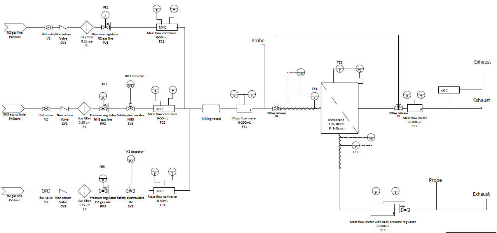
  
<em>P&ID Gas Unit</em>

1.	L'interface utilisateur doit offrir une vue d’ensemble du banc de test avec l’affichage des différentes grandeurs mesurées et du statut des instruments : SV1-2, FC1-3, FT1-3, TT.
2.	L'utilisateur doit pouvoir lire en temps réel les valeurs de pression, température et débit pour les MFC et MFM : FC1-3, FT1-3.
3.	L'utilisateur doit pouvoir modifier la composition des gaz pour les MFC et MFM : FC1-3, FT1-3 depuis l'interface utilisateur.
4.	L'utilisateur doit pouvoir régler le débit des MFC : FC1-3.
5.	L'utilisateur doit pouvoir régler la pression amont pour le MFM : FT3.
6.	L'utilisateur doit pouvoir lire la température des éléments chauffants : TE1-3.
7.	L'utilisateur doit pouvoir contrôler la température des éléments chauffants et la réguler.
8.	L'utilisateur doit pouvoir ouvrir/Fermer les vannes de sécurité : SV1-2.
9.	L'utilisateur doit pouvoir sauvegarder à intervalles réguliers les différentes valeurs mesurées dans un fichier de type ``*.txt`` ou ``*.csv``.
10.	L'utilisateur doit pouvoir sauvegarder et ouvrir un fichier de configuration pour les différents éléments du banc.
Le commenter

> Comme on l'a vu lors des précédents modules, une AI est possible, mais pas exclusivement pour analyser une URS.

### Imprécisions Liées à cette URS

#### Exemple d'Analyse des Exigences

1. **Vue d’ensemble du banc de test**  
    - **Imprécision** : Les "différentes grandeurs mesurées" ne sont pas spécifiées de manière exhaustive. Quels paramètres exacts doivent être affichés ?  
    - **Suggestion** : Détailler toutes les grandeurs mesurées et leur format d'affichage.

2. **Lecture en temps réel des valeurs**  
    - **Imprécision** : La fréquence de mise à jour des valeurs en temps réel n'est pas définie.  
    - **Suggestion** : Préciser la fréquence (par exemple, toutes les 100 ms, 1 s, etc.).

3. **Modification de la composition des gaz**  
    - **Imprécision** : Les limites de modification (plages autorisées) ne sont pas mentionnées.  
    - **Suggestion** : Définir les plages de valeurs acceptables pour chaque gaz.

4. **Réglage du débit des MFC**  
    - **Imprécision** : Les unités de mesure et les plages de réglage ne sont pas spécifiées.  
    - **Suggestion** : Indiquer les unités (par exemple, L/min) et les plages de débit.

5. **Réglage de la pression amont pour le MFM**  
    - **Imprécision** : La plage de pression et les unités ne sont pas précisées.  
    - **Suggestion** : Ajouter les plages et unités (par exemple, bar, psi).

6. **Lecture de la température des éléments chauffants**  
    - **Imprécision** : Les plages de température et les unités ne sont pas définies.  
    - **Suggestion** : Spécifier les plages et unités (par exemple, °C).

7. **Contrôle et régulation de la température**  
    - **Imprécision** : Les algorithmes de régulation (PID, etc.) et les plages de consigne ne sont pas mentionnés.  
    - **Suggestion** : Décrire le type de régulation et les plages de consigne.

8. **Ouverture/Fermeture des vannes de sécurité**  
    - **Imprécision** : Les conditions de sécurité pour l'ouverture/fermeture ne sont pas précisées.  
    - **Suggestion** : Définir les conditions et scénarios d'utilisation.

9. **Sauvegarde des valeurs mesurées**  
    - **Imprécision** : La fréquence de sauvegarde et le format des fichiers ne sont pas détaillés.  
    - **Suggestion** : Indiquer la fréquence (par exemple, toutes les 10 s) et les colonnes du fichier.

10. **Sauvegarde et ouverture d’un fichier de configuration**  
     - **Imprécision** : Le contenu exact du fichier de configuration n'est pas spécifié.  
     - **Suggestion** : Décrire les paramètres à inclure dans le fichier et leur format.

Il est intéressant de relever qu'une bonne partie des problèmes relevés à postériori dans ces exemples ce sont aussi révélés dans le projet réel.

#### Conseil
- Reprenez les URS, passez-les en revues.
- Développez votre FS pour vérifier que les conditions soient remplies.
- Faites la approuver après revue.
- Ne donnez pas d'estimation de temps tant que l'URS n'est pas terminée, c'est suicidaire.
- Même si un problème n'est pas de votre ressort parce que absent des URS, ce sera de votre faute.

|Function|Check by system engineer|Comment by system engineer|Risk| 
|--------|------------------------|--------------------------|----|
|Modification de la composition des gaz|April 3, 2025|Est-ce que l'appareil le permet ? |Elevé|
|Sauvegarde des valeurs mesurées|April 3, 2025|Durée et fréquence des données ?|Faible|
|Ouverture/Fermeture des vannes de sécurité|April 3, 2025|Quand, conditions ?|Moyen|

## FS, Functional Specification

La FS défini le comportement, quelles sont les fonctionnalités requises ? La FS défini comment le système devrait fonctionner et comment il devrait être utilisé. La FS représente les critères d’acceptation opérationnels, qui seront validés par une procédure de Qualification Opérationnelle « Operational Qualification » OQ.

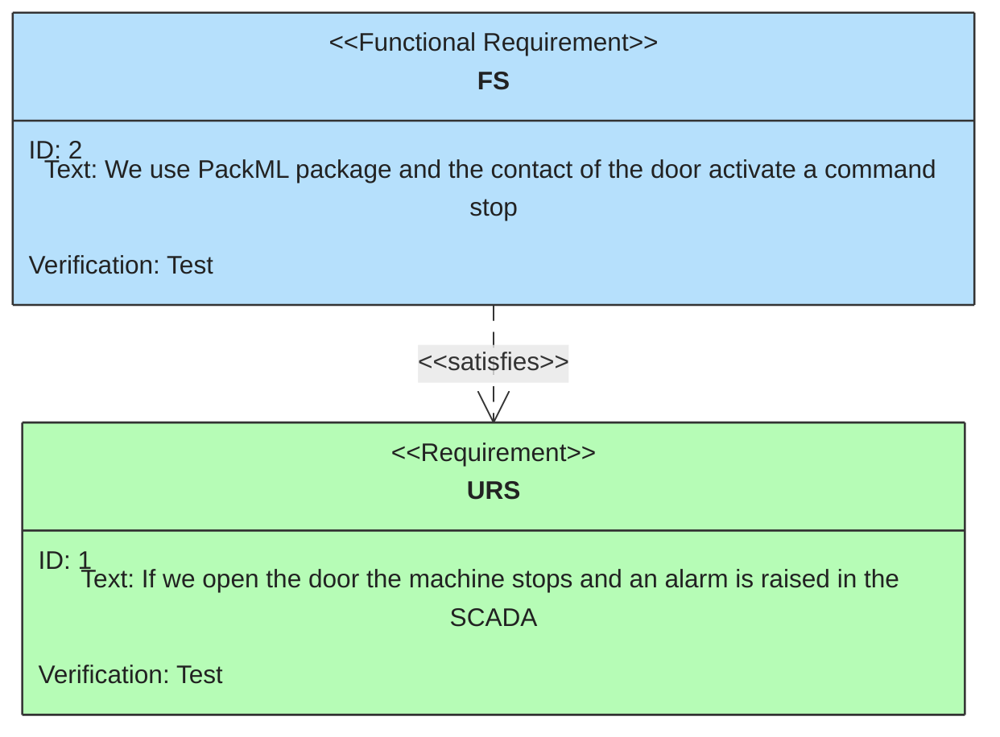

> La FS est principalement le travail de l'ingénieur. Il décrit comment il construira la machine afin de satisfaire à l'URS.

> **La FS répond principalement à la question Comment ?**

### FS Vannes de Sécurité

|ID    |Description     |
|------|----------------|
||**Mode Automatique**|
|1 |*État Normal*|  
|1.1|Les vannes restent fermées tant que le système est dans un état autre que **Starting** et qu'aucune détection de gaz H2 n'est signalée.|
|2 |*Détection de Gaz H2*|  
|2.1|Si le capteur détecte une concentration de H2 dépassant le seuil configuré|  
|2.2|Les vannes se ferment immédiatement.| 
|2.3|Une alarme de niveau **Stop** est activée.|  
|2.4|Le niveau de concentration de H2 est affiché pour information.|
|3 |*Transition vers l'état Starting*|  
|3.1|Les vannes s'ouvrent automatiquement pour permettre le fonctionnement du système.|
|4  |*Seuil de Détection de H2*|
|4.1|Le seuil est paramétrable entre 0% et 10%.|
||**Mode Manuel**|
|5|*Ouverture manuelle des vannes*|
|5.1|En mode manuel les vannes peuvent être activée depuis l'interface utilisateur si l'état Stopped du PackML est atteint.|

### Bonne pratique
- La FS permet aussi de valider les URS et de vérifier avec le client la bonne compréhension des URS et de les valider.
- Si c'est utile ou nécessaire compléter les FS avec un diagramme d'activité.

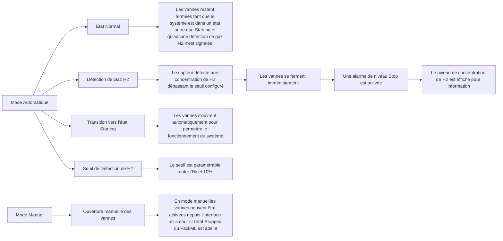

## DS, Design Specification

La DS défini les détails de l’implémentation. La DS défini comment les fonctions sont implémentées. 

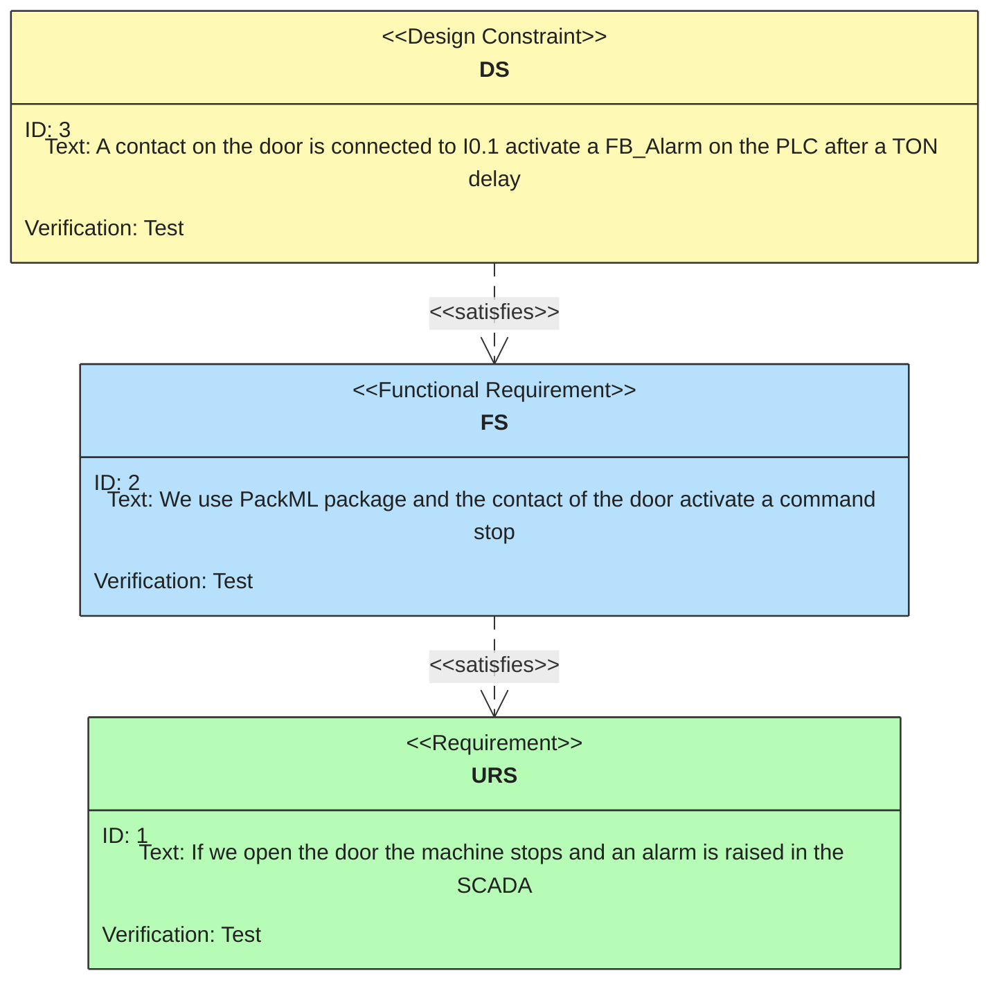

**Elles seront validées par une procédure de Qualification d’Installation Installation Qualification IQ**.

En pratique, on parle principalement de **DS** que l'on pourra séparer en **HDS** et **SDS**.

La **HDS**, ou Hardware Design Specification comporte tout ce qui va de capteur ou actuateur jusqu'à l'entrée de l'automate. Un bon exemple de ce que l'on retrouvera dans la **HDS** est le schéma électrique.

La **SDS** ou Software Design Specification comporte tout ce qui est lié à la partie logicielle, principalement les diagrammes de type UML.

### Exemple
Une SDS permet de relier chaque élément du software jusqu'aux éléments du hardware, c'est à dire le schéma électrique.

La table ci-dessous est un extrait d'une [SDS complète fournie en annexe](./documentation/TestBenchSpecification.xlsx).

|Instrument|Device object|Device Class |Fieldbus|Description|Measured Value|IO-Module|Slot|
|----------|-------------|-------------|--------|-----------|--------------|---------|----|
|BL-1	|dmBL_1	|DM_BL_DO		||Piston pump, blower 8009-35/05/DC	Pressure (P-2) / Bars / 0-2	|EL2008	|5
|BL-2	|dmBL_2	|DM_BL_DO		||Piston pump, blower 8009-35/05/DC	Pressure (MFM-5) / Bars / 0-2	|EL2008	|6
|C-1	|dmC_DO	|DM_C_DO		||Compressor 405 Series		|EL2008	|7
|CO2-1	|dmCO2_1	|DM_Hamilton_485	|Modbus	|CO2 sensor - 0-100% 	CO₂ concentration / %-vol / 0-100	|EL6022 	|10
|CO2-2	|dmCO2_2	|DM_Hamilton_485	|Modbus	|CO2 sensor - 0-100% 	CO₂ concentration / %-vol / 0-100	|EL6022 	|10
|CO2-3	|dmCO2_3	|DM_SmartGas_485	|Modbus	|CO2 sensor 0-20%	CO₂ concentration / %-vol / 0-20	|EL6022 	|10
|CO2-4	|dmCO2_4	|DM_Hamilton_485	|Modbus	|CO2 sensor - 100%	CO₂ concentration / %-vol / 0-100	|EL6022 	|10|
|CO2-5	|dmCO2_5	|DM_SmartGas_485	|Modbus	|CO2 sensor - 100%	CO₂ concentration / %-vol / 0100%|EL6022 	|10|		
|Emergency stop button		||DM_E_Stop_In			||Status / On-Off / -	|EL1008	|3|

Selon les domaines d'activité, ou les habitudes de l'entreprise, on trouve aussi les définitions suivantes:

- CS, Configuration Specification
- SMS, Software Module Specification
- NDS, Network Specification

---

## FMEA, Analyse du risque

Une FMEA est un outil de conception et d'ingénierie qui analyse les modes de défaillance potentiels au sein d'un système afin de déterminer l'impact de ces défaillances.

Il a d'abord été développé par le département américain de la Défense pour être utilisé dans la conception de systèmes. La technique FMEA a depuis été adoptée par les industries commerciales dans le but de minimiser les défaillances et de réduire la sécurité, ainsi que les impacts environnementaux et économiques qui pourraient résulter de ces défaillances.

- Une FMEA sert à évaluer les risques du projet, particulièrement les points critiques.
- Une FMEA sert à anticiper les problèmes et proposer des plans B.

  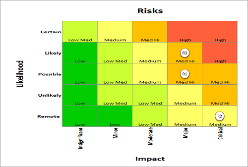
  
<em>FMEA avant réduction du risque</em>

  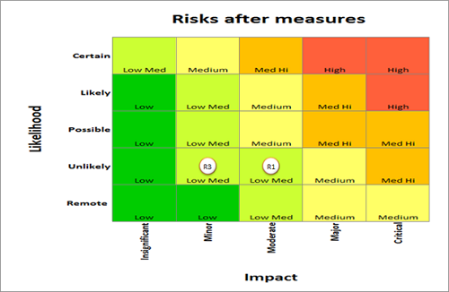
  
<em>FMEA après réduction du risque</em>

En annexe, dans la documentation, on trouve le fichier utilisé pour générer les deux exemples ci-dessus. Ce fichier est tiré de chez [Innosuisse, Agence suisse pour l’encouragement de l’innovation](https://www.innosuisse.admin.ch/fr), pour l'analyse de risque lors de la demande de fonds pour des projets d'innovations. N'hésitez pas à l'utiliser. 

  En cas de problème, il ne s'agit pas de chercher une solution, mais...

  "d'avoir anticiper et d'en proposer une."

---

## Tests

**Anticipate testing**
Les tests devraient être édités avant la réalisation de la machine. 
Pour les ingénieurs c'est un avantage car ils savent à l'avance comment leur travail sera testé
.

Dans un projet de validation, les plans de test ou les protocoles de test sont utilisés pour démontrer qu'un système répond aux exigences précédemment établies dans les documents de spécification, de conception et de configuration.

- Les plans de test documentent la stratégie générale de test.

- Les protocoles de test sont les **documents de test réels**. On demande en général de les **compléter et signer à la main**.

Le plan de test décrit les exigences et la stratégie de test. Il doit inclure le processus général de réalisation des tests, la documentation des preuves des tests et le processus de gestion des échecs de test !

### IQ Installation Qualifications

**Sert à valider la DS.**

Vérifie que les systèmes se trouvent sur des machines adaptées pour exécuter le logiciel, que le système a été correctement installé et que la configuration est correcte. Ces exigences sont décrites dans les **DS**, Design Specification.

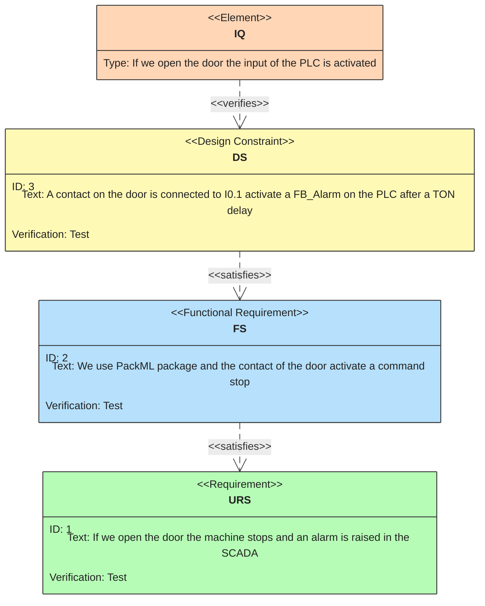

#### Quelques clés
Avant de vérifier si les sous-systèmes fonctionnent correctement, la IQ permet de vérifier que tout à été testé. C'est plus important que de savoir si les systèmes fonctionnent correctement.

**Intérêt pour l'ingénieur:** Une grande partie des réalisations de la **DS** seront l'oeuvre de mandataires. L'ingénieur qui passera à la phase de l'**OQ** ne devrait plus avoir à ce soucier de la réalisation de la **DS**.

> Exemple: si un électricien réalise le câblage d'une machine, il appartient à l'électricien de valider son travail avant de le considérer comme terminé.

### OQ Operational Qualifications

Vérifie que les systèmes fonctionnent comme prévu. **Les OQ testent les FS,** Functional Specification, ou exigences fonctionnelles.

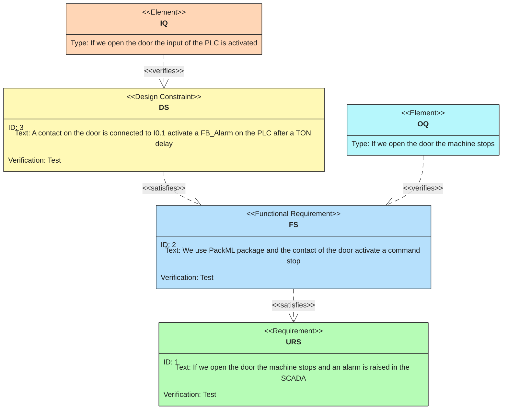

Le client devrait être impliqué dans le processus OQ. Cela lui permet de valider élément par élément chacune de ces spécifications et de les accepter.

**Intérêt pour l'ingénieur**: obtenir du client une acceptation de l'ensemble des modules et pouvoir plus facilement négocier toute modification qui s'avérerai nécessaire avant la mie en service finale. **La partie OQ se déroule en général en atelier**, voir ci-dessous **FAT**. Toute modification ultérieure s'avérera plus complexe à réaliser, principalement pour des raisons logistiques.

> Certaines entreprises facturent déjà jusqu'à 90% de la machine après validation de la qualification opérationnelle par le client.

### PQ Performance Qualifications
Vérifie que les systèmes exécutent des tâches dans des conditions réelles. **Les tests PQ vérifient les fonctionnalités décrites dans les URS**, User Requirements Specification ou exigences de l'utilisateur.

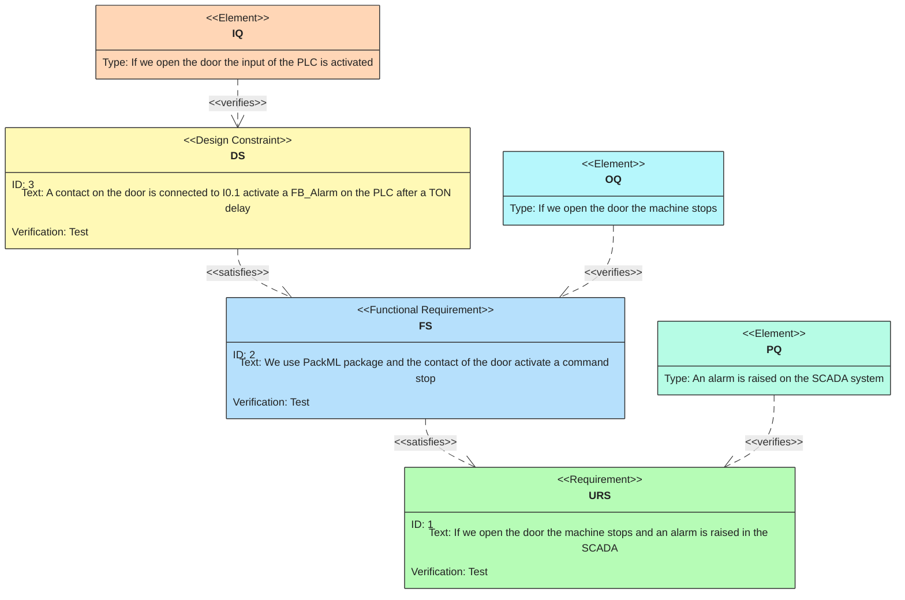

**Intérêt pour l'ingénieur**: obtenir du client une acceptation **définitive** de la machine. Toute modification ultérieure sera soumise à négociation est pourra plus facilement être considérée comme une extension du mandat.

  Faites valider et signer l'acceptation de la machine par votre client, vous serez couvert pour toute demande de modification complémentaire

  " que vous pourrez enfin facturer à un vrai tarif d'ingénieur."

## On utilise aussi
> **FAT** Factory Acceptance Test
> > Signifie le test d’acceptance du client dans la fabrique. Ici, fabrique est à comprendre dans le sens du site de fabrication de la machine dans le cas où une machine est assemblée chez le fournisseur de la machine. Le terme **FAT** est en partie relié au **PQ** et à l’**OQ**. **Il faut comprendre cette notion en se représentant une machine destinée à être intégrée comme unité dans une chaîne de production**. 
> 
> >Il paraît ensuite plus clair qu’une partie des **OQ**, voir **PQ** ne pourront être testés et acceptés qu’une fois la machine intégrée dans son environnement final. Vu du point de vue du comptable, la réussite de la FAT conditionne parfois pour le fournisseur l’étape à laquelle le client payera, une partie non négligeable de la facture finale…

> **SAT** Site Acceptance Test
> > Test acceptance **sur site**, cela correspond à valider dans l’environnement final les tests OQ et PQ qui n’auraient pas pu être réalisé sur le site de fabrication de la machine.

---

## Processus de gestion de la qualité
### Gestion documentaire

La gestion documentaire implique la création, la révision, l'approbation, la distribution et l'archivage des documents nécessaires pour garantir la qualité et la conformité des processus.

En plus des documents mentionnés ci-dessous, on peut ajouter:

#### Gestion des changements

La gestion des changements assure que toutes les modifications apportées aux processus, aux systèmes ou aux produits sont contrôlées et documentées de manière appropriée pour maintenir la qualité et la conformité.

#### Gestion de la configuration

La gestion de la configuration implique le suivi et le contrôle des versions des produits et des systèmes pour garantir que les modifications sont correctement mises en œuvre et documentées.

#### Gestion des incidents

La gestion des incidents consiste à identifier, documenter et résoudre les incidents qui pourraient affecter la qualité ou la conformité des produits ou des processus.
Gestion des fournisseurs

#### La gestion des fournisseurs

La gestion des fournisseurs implique l'évaluation et la surveillance des fournisseurs pour garantir qu'ils respectent les normes de qualité et de conformité requises.
Gestion des enregistrements

#### La gestion des enregistrements

La gestion des enregistrements assure que tous les enregistrements nécessaires sont créés, conservés et accessibles pour démontrer la conformité et la qualité des processus.

Parmi les enregistrements, il faut aussi mentionner l'archivage de **tous** les **logiciels** et **versions** qui permettent de restaurer la machine en cas de nécessité de remplacer un appareil. On ajoutera des **SOP**, standard operating procedure, qui explique comment procéder pour restaurer rapidement la machine en cas de crash.

#### Archivage

L'archivage consiste à stocker et à protéger les documents et les enregistrements importants pour garantir leur disponibilité future et leur conformité aux exigences réglementaires.

#### Gestion de la formation

La gestion de la formation assure que tous les employés reçoivent la formation nécessaire pour effectuer leurs tâches de manière conforme et efficace.

#### Évaluation périodique

L'évaluation périodique implique la révision régulière des processus et des systèmes pour identifier les opportunités d'amélioration et garantir la conformité continue.
Continuité des activités

La continuité des activités consiste à planifier et à mettre en œuvre des mesures pour garantir que les opérations peuvent continuer en cas de perturbations ou d'urgences.

#### Sécurité
Au module précédent sur la sécurité, on pourra ajouter encore la **sécurité OT**.

### Quelques exemples.

> Si une machine produit des pièces pour l'industrie automobile, chaque pièce produite se vera attribuer un numéro de série que l'on pourra relier à un lot de pièces envoyées à un client. Dans le cas où un défaut détecté ultérieurement présenterait un défaut pour l'utilisateur final, on pourrait demander à consulter si les différents tests effectués lors de la production étaient conformes. Même si la machine a été mise en service entre temps. Voir ci-dessus, les notions d'archivage et d'enregistrement. L'automaticien aura donc dû enregistrer et archiver les tests, mais aussi garantir que le format de données des enregistrements puisse être garanti sur le long terme.

> Dans un monde idéal, la machine sera parfaite. Dans la pratique, il est probable qu'à un moment donné il soit nécessaire d'analyser puis de modifier une composantes logicielles. La lisibilité d'un programme est autant importante que sa fonctionnalité. C'est pour cette raison que même un programme fonctionnel pourra être refusé si sa lisibilité ne présente pas un niveau de qualité suffisant.

> Comme il a été décrit ci-dessus, la durée de vie d'une machine ou d'une installation peut se compter en dizaines d'années. Au moment de sélectionner les éléments d'un système d'automation, il sera important de se poser la question suivante: le fournisseur sélectionné est-il apte à garantir un support, et le cas échéant un remplacement d'un élément dans dix ans? On peut ajouter la notion suivante, sachant que: Après moi le déluge n'est pas une option. La documentation est-elle suffisante pour qu'un ingénieur avec une formation adéquate puisse intervenir sur la machine?

---

# Mémo
Ici, la liste des documents à fournir.
- [ ] URS  
- [ ] FS  
- [ ] HDS  
- [ ] SDS  
- [ ] IQ  
- [ ] OQ  
- [ ] PQ  
- [ ] Schématique
- [ ] Liste des fournisseurs
- [ ] Liste des alarmes
- [ ] SOP
- [ ] Mode d'emploi et documentation
- [ ] FMEA

<!-- end of document -->

