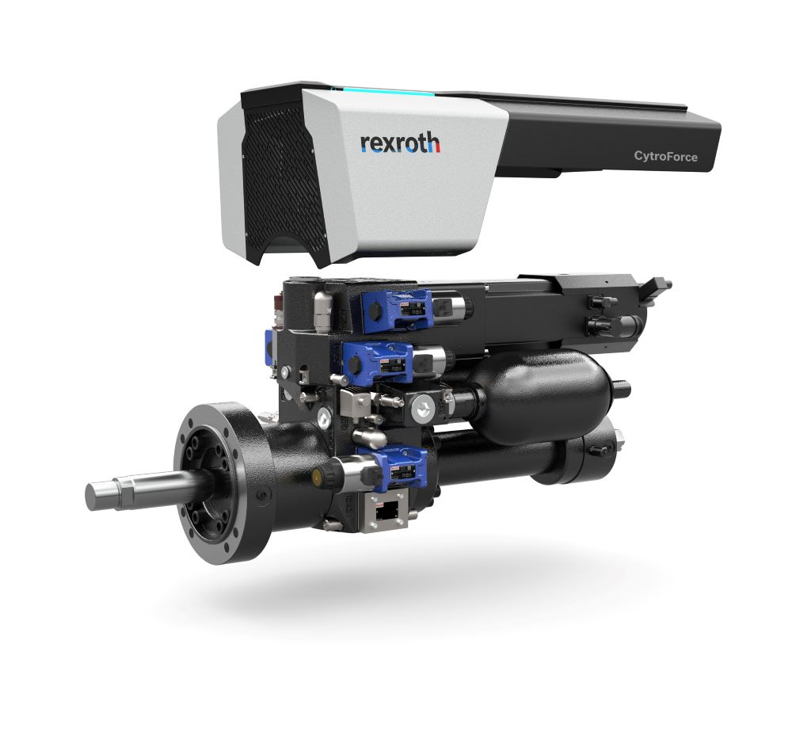

<h1 align="left">
   
  
   
  Industrial Automation Base
   
</h1>

Cours AutB

Author: [Cédric Lenoir](mailto:cedric.lenoir@hevs.ch)

### Axes hydraulique
Il sont privilégies dans les cas où les forces sont importantes, voir très importantes. L'image ci-dessous représente un pont sur le canal Baudouin en Belgique. Tiges de vérin de 340 [mm], puissance totale des pompes électriques qui fournissent la pression d'huile, environ 1000 [kW].

<figure>
    
    <figcaption>Pont en Belgique avec commande hydraulique</figcaption>
</figure>

- Avantages: fortes à très fortes puissance.
- Inconvénients: complexité et coûts de maintenance.

> Dans la pratique, on parlera plutôt d'entraînements électro-hydrauliques. Les commandes électriques qui fournissent la pression d'huile sont souvent similaires aux commandes d'axe que nous utiliserons dans le cadre des travaux pratiques.

<figure>
    
    <figcaption>Cytroforce entrainement hydraulique</figcaption>
</figure>

## Axes pneumatiques
Ils sont privilégiés quand deux positions sont suffisantes, plus rarement pour des positions régulées.

<figure>
    
    <figcaption>Schunk Module Lineaire Universel</figcaption>
</figure>

- Avantages: simplicité et robustesse.
- Inconvénient : le coût de l'air comprimé est souvent négligé. Positions intermédiaires peu précises.

> Les axes pneumatiques sont le plus généralement pilotés par des modules d'électrovannes. Les bobines électriques de faible puissance peuvent être pilotées directements par des sorties numériques, **digital output modules**.

<figure>
    
    <figcaption>Distributeur bistable Source: Festo</figcaption>
</figure>

Dans la figure ci-dessus, l'alimentation en air comprimé, le plus souvent sur un standard 6 bars, arrive en position **1**.
-    Si la bobine **82** seule est alimentée, l'air comprimé est envoyée à un cylindre pneumatique via la sortie **2** et l'autre coté du cylindre peut se vider via la sortie **4**.
-    Si la bobine **84** seule est alimentée le processus est inversé et le cylindre change de position.

-    Ici on parle de distributeur **5/2** pour **5** connexions en air comprimé et **2** positions mécaniques du distribueur.

