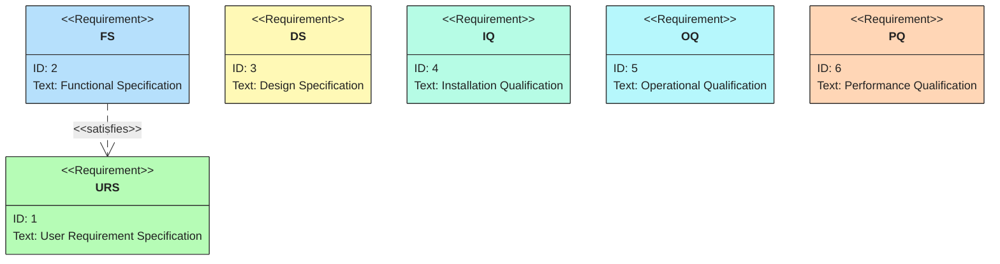
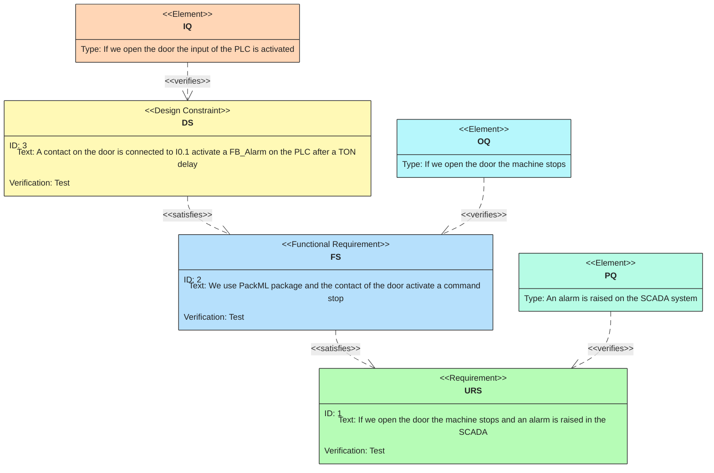
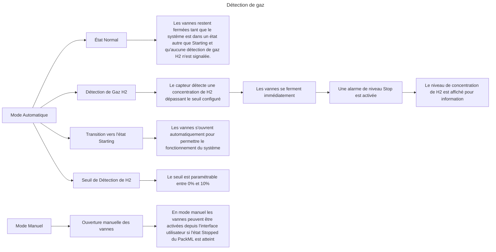

# Introduction aux Éléments Fondamentaux d'un Projet d'Automation

## 1. URS User Requirement Specification
Le document URS décrit les besoins et attentes des utilisateurs finaux. Il sert de base pour définir les objectifs du projet.

## 2. FS Functional Specification
Le FS traduit les besoins du URS en fonctionnalités techniques. Il décrit ce que le système doit faire pour répondre aux exigences.

## 3. SDS Software Design Specification
Le SDS détaille la conception logicielle, incluant les algorithmes, les structures de données et les interfaces nécessaires pour implémenter les fonctionnalités définies dans le FS.

## 4. User Interface, UI
La UI est l'interface utilisateur qui permet d'interagir avec le système. Elle doit être intuitive et répondre aux besoins définis dans le URS.

## 5. HDS Hardware Design Specification
Le HDS décrit la conception matérielle, incluant les équipements, capteurs et actionneurs nécessaires pour supporter le système.

## 6. Tests
Les tests valident que le système répond aux exigences. Ils incluent :
- **Installation Qualification (IQ)** : Vérifie que le système est correctement installé selon les spécifications.
- **Operational Qualification (OQ)** : Vérifie que le système fonctionne comme prévu dans des conditions opérationnelles.
- **Performance Qualification (PQ)** : Confirme que le système fonctionne de manière cohérente et fiable dans des conditions réelles.

## 7. Diagramme en V
Le diagramme en V est une méthodologie de gestion de projet qui illustre la relation entre les phases de conception (côté gauche) et les phases de test/validation (côté droit).

### Exemple :
- **Conception** : URS → FS → SDS → HDS
- **Validation** : Installation Qualification → Operational Qualification → Performance Qualification

## Conclusion
Ces éléments forment la base d'un projet d'automation structuré et permettent de garantir que le système final répond aux besoins des utilisateurs tout en respectant les contraintes techniques.

# Gestion d'un projet d'automation
Ici nous allons aborder quelques éléments fondamentaux de gestion d'un projet d'automation et esquisser quelques principes et une liste de documents nécessaires.
##

### Principales Causes d'Échec d'un Projet d'Automation

#### 1. Mauvaise Définition des Exigences
Une définition incomplète ou incorrecte des besoins des utilisateurs (URS) peut entraîner des écarts importants entre les attentes et le résultat final.  
**Référence** : Sommerville, I. (2011). *Software Engineering*.

#### 2. Gestion de Projet Inefficace
Un manque de planification, de communication ou de suivi peut conduire à des retards, des dépassements de budget ou des livrables de faible qualité.  
**Référence** : Kerzner, H. (2017). *Project Management: A Systems Approach to Planning, Scheduling, and Controlling*.

#### 3. Sous-Estimation des Ressources
Ne pas allouer suffisamment de temps, de budget ou de personnel qualifié peut compromettre la réussite du projet.  
**Référence** : PMI (2021). *A Guide to the Project Management Body of Knowledge (PMBOK® Guide)*.

#### 4. Résistance au Changement
Les utilisateurs finaux peuvent être réticents à adopter de nouveaux systèmes, surtout si la formation ou l'accompagnement est insuffisant.  
**Référence** : Kotter, J. P. (1996). *Leading Change*.

#### 5. Problèmes Techniques
Des erreurs dans la conception logicielle (SDS) ou matérielle (HDS) peuvent entraîner des défaillances ou des incompatibilités.  
**Référence** : Pressman, R. S. (2014). *Software Engineering: A Practitioner's Approach*.

#### 6. Tests Insuffisants
Des tests incomplets ou mal exécutés (IQ, OQ, PQ) peuvent laisser passer des défauts critiques.  
**Référence** : Myers, G. J., Sandler, C., & Badgett, T. (2011). *The Art of Software Testing*.

#### 7. Absence de Gestion des Risques
Ne pas anticiper les risques potentiels peut aggraver les problèmes lorsqu'ils surviennent.  
**Référence** : Hillson, D. (2003). *Effective Opportunity Management for Projects*.

En identifiant et en adressant ces causes potentielles, les équipes peuvent augmenter leurs chances de succès dans les projets d'automation.

## Imprécisions Liées à cette URS

### Exemple d'Analyse des Exigences

1. **Vue d’ensemble du banc de test**  
    - **Imprécision** : Les "différentes grandeurs mesurées" ne sont pas spécifiées de manière exhaustive. Quels paramètres exacts doivent être affichés ?  
    - **Suggestion** : Détailler toutes les grandeurs mesurées et leur format d'affichage.

2. **Lecture en temps réel des valeurs**  
    - **Imprécision** : La fréquence de mise à jour des valeurs en temps réel n'est pas définie.  
    - **Suggestion** : Préciser la fréquence (par exemple, toutes les 100 ms, 1 s, etc.).

3. **Modification de la composition des gaz**  
    - **Imprécision** : Les limites de modification (plages autorisées) ne sont pas mentionnées.  
    - **Suggestion** : Définir les plages de valeurs acceptables pour chaque gaz.

4. **Réglage du débit des MFC**  
    - **Imprécision** : Les unités de mesure et les plages de réglage ne sont pas spécifiées.  
    - **Suggestion** : Indiquer les unités (par exemple, L/min) et les plages de débit.

5. **Réglage de la pression amont pour le MFM**  
    - **Imprécision** : La plage de pression et les unités ne sont pas précisées.  
    - **Suggestion** : Ajouter les plages et unités (par exemple, bar, psi).

6. **Lecture de la température des éléments chauffants**  
    - **Imprécision** : Les plages de température et les unités ne sont pas définies.  
    - **Suggestion** : Spécifier les plages et unités (par exemple, °C).

7. **Contrôle et régulation de la température**  
    - **Imprécision** : Les algorithmes de régulation (PID, etc.) et les plages de consigne ne sont pas mentionnés.  
    - **Suggestion** : Décrire le type de régulation et les plages de consigne.

8. **Ouverture/Fermeture des vannes de sécurité**  
    - **Imprécision** : Les conditions de sécurité pour l'ouverture/fermeture ne sont pas précisées.  
    - **Suggestion** : Définir les conditions et scénarios d'utilisation.

9. **Sauvegarde des valeurs mesurées**  
    - **Imprécision** : La fréquence de sauvegarde et le format des fichiers ne sont pas détaillés.  
    - **Suggestion** : Indiquer la fréquence (par exemple, toutes les 10 s) et les colonnes du fichier.

10. **Sauvegarde et ouverture d’un fichier de configuration**  
     - **Imprécision** : Le contenu exact du fichier de configuration n'est pas spécifié.  
     - **Suggestion** : Décrire les paramètres à inclure dans le fichier et leur format.

### Conclusion  
Ces imprécisions peuvent entraîner des malentendus entre les parties prenantes et des écarts dans la réalisation du projet. Une clarification détaillée des exigences est essentielle pour garantir le succès du projet.

FS pour les vannes de sécurité.

La FS permet, entre autre de vérifier le comportements.

### FS Vannes de Sécurité
#### Mode Automatique
1. **État Normal**  
1.1    - Les vannes restent fermées tant que le système est dans un état autre que **Starting** et qu'aucune détection de gaz H2 n'est signalée.

2. **Détection de Gaz H2**  
2.1    - Si le capteur détecte une concentration de H2 dépassant le seuil configuré :  
2.2      - Les vannes se ferment immédiatement.  
2.3      - Une alarme de niveau **Stop** est activée.  
2.4      - Le niveau de concentration de H2 est affiché pour information.

3. **Transition vers l'État Starting**  
    - Les vannes s'ouvrent automatiquement pour permettre le fonctionnement du système.

4 **Seuil de Détection de H2**
4.1    Le seuil est aramétrable entre 0% et 10%.

#### Mode Manuel
1. **En mode manuel les vannes peuvent être activée manuellement si l'état Stopped du PackML est atteint.

