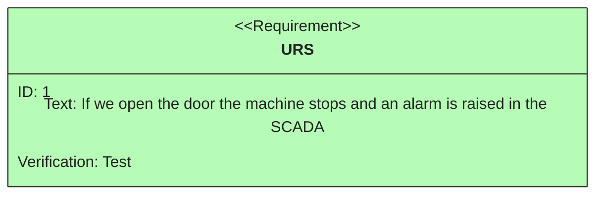
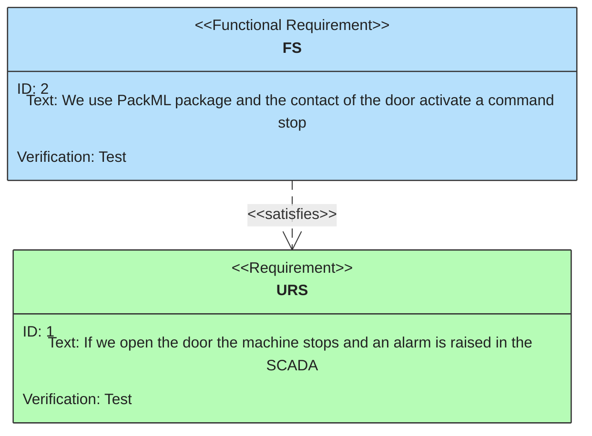
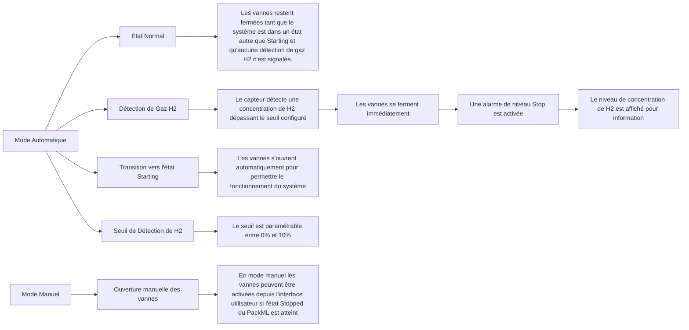
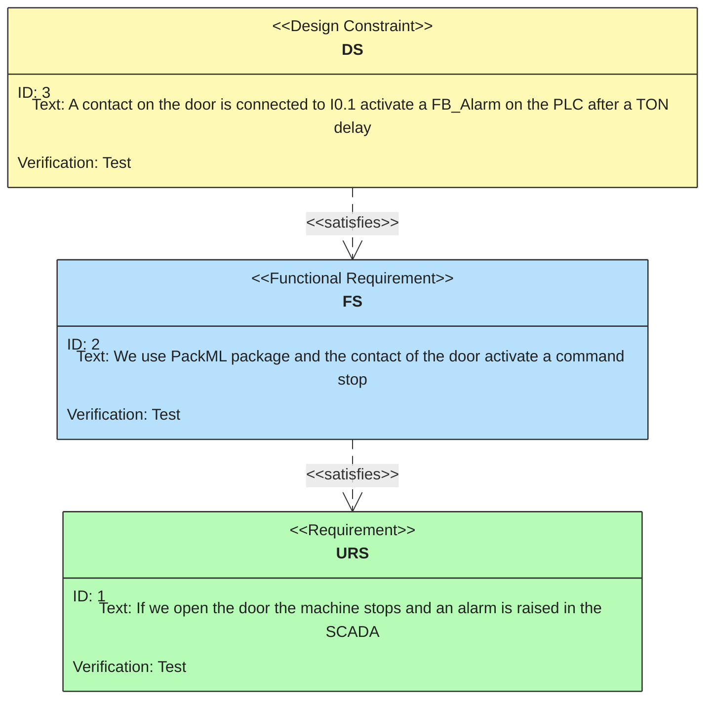
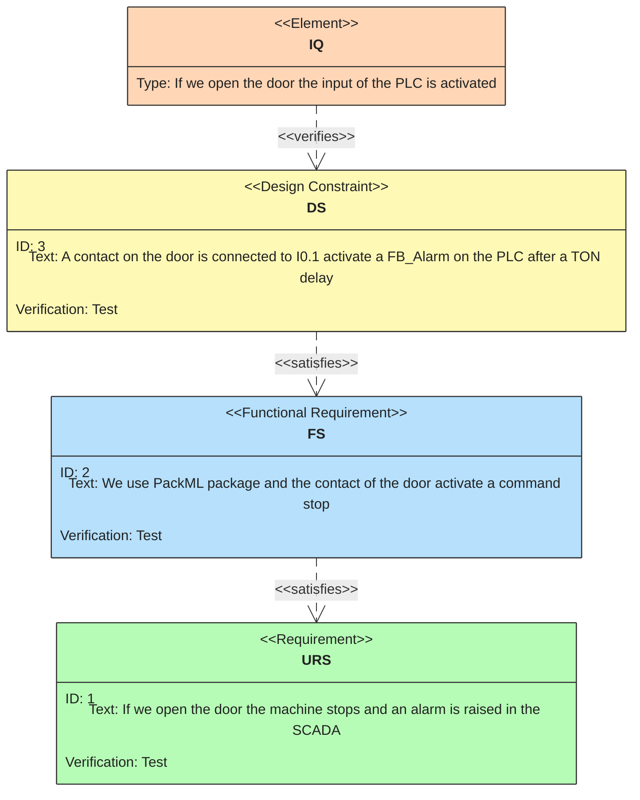
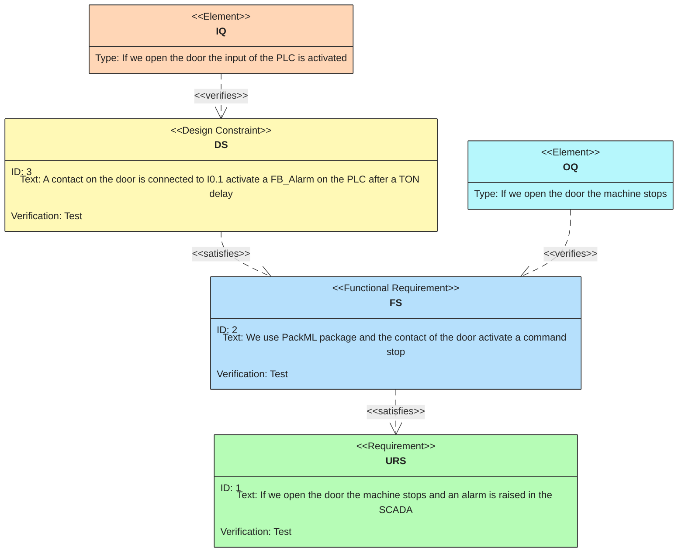
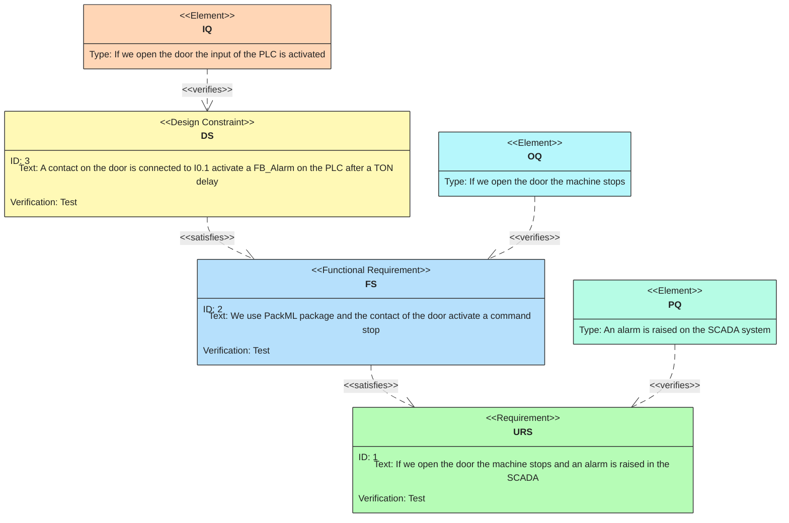

<h1 align="left">
   
  
   
  Industrial Automation Base
   
</h1>

Cours AutB

Author: [Cédric Lenoir](mailto:cedric.lenoir@hevs.ch)

# Module 14 Design Specification.

*Keywords:* **GMP URS FS DS HDS SDS IQ OQ PQ FMEA Safety Risk Matrix V-Diagram**

Wir verfügen nun über eine technische Grundlage für die Automatisierung, müssen uns jedoch darüber im Klaren sein, dass alles, was mit der Programmierung, der Auswahl der Elemente oder der Regelung zusammenhängt, nur ein Aspekt eines Automatisierungsprojekts ist.

## Inhaltsverzeichnis

- [Module 14 Design Specification.](#module-14-design-specification)
  - [Inhaltsverzeichnis](#inhaltsverzeichnis)
  - [Ziel](#ziel)
  - [Über die beigefügten Dokumente](#über-die-beigefügten-dokumente)
  - [Zu wissen](#zu-wissen)
  - [Verstehen Sie die Bedeutung verschiedener Schlüsselwörter und platzieren Sie sie im Kontext eines Automatisierungsprojekts.](#verstehen-sie-die-bedeutung-verschiedener-schlüsselwörter-und-platzieren-sie-sie-im-kontext-eines-automatisierungsprojekts)
    - [Hauptursachen für das Scheitern von Automatisierungsprojekten](#hauptursachen-für-das-scheitern-von-automatisierungsprojekten)
  - [Ein- und Ausgänge](#ein--und-ausgänge)
  - [GMP](#gmp)
  - [GAMP5](#gamp5)
  - [V-Diagram](#v-diagram)
    - [Ursprung des V-Diagramms](#ursprung-des-v-diagramms)
- [Spécifications](#spécifications)
  - [URS, User Request Specification](#urs-user-request-specification)
  - [Ein Beispiel für einen Prüfstand](#ein-beispiel-für-einen-prüfstand)
    - [Ungenauigkeiten im Zusammenhang mit dieser URS](#ungenauigkeiten-im-zusammenhang-mit-dieser-urs)
      - [Beispiel einer Anforderungsanalyse](#beispiel-einer-anforderungsanalyse)
      - [Beratung](#beratung)
  - [FS, Functional Specification](#fs-functional-specification)
    - [FS Sicherheitsventile](#fs-sicherheitsventile)
    - [Gute Praxis](#gute-praxis)
  - [DS, Design Specification](#ds-design-specification)
    - [Beispiel](#beispiel)
  - [FMEA, Risikoanalyse](#fmea-risikoanalyse)
  - [Tests](#tests)
    - [IQ Installation Qualifications](#iq-installation-qualifications)
      - [Einige Schlüssel](#einige-schlüssel)
    - [OQ Operational Qualifications](#oq-operational-qualifications)
    - [PQ-Leistungsqualifikationen](#pq-leistungsqualifikationen)
  - [Wir verwenden auch](#wir-verwenden-auch)
  - [Qualitätsmanagementprozess](#qualitätsmanagementprozess)
    - [Dokumentenverwaltung](#dokumentenverwaltung)
      - [Änderungsmanagement](#änderungsmanagement)
      - [Konfigurationsmanagement](#konfigurationsmanagement)
      - [Vorfallmanagement](#vorfallmanagement)
      - [Lieferantenmanagement](#lieferantenmanagement)
      - [Aufnahmeverwaltung](#aufnahmeverwaltung)
      - [Archivierung](#archivierung)
      - [Trainingsmanagement](#trainingsmanagement)
      - [Regelmäßige Bewertung](#regelmäßige-bewertung)
      - [Sicherheit](#sicherheit)
    - [Einige Beispiele.](#einige-beispiele)
- [Mémo](#mémo)

## Ziel
Erstellen Sie ein Memo für ein erfolgreiches Automatisierungsprojekt.

## Über die beigefügten Dokumente
Dieses Modul bietet eine Reihe von Anhangsdokumenten, hauptsächlich zur Verwaltung des unten erwähnten V-Diagramms. Diese Art von Dokumenten sind online nicht leicht zu finden. Aus diesem Grund werden diese zur Verfügung gestellt.

## Zu wissen
Verstehen Sie die Bedeutung verschiedener Schlüsselwörter und platzieren Sie sie im Kontext eines Automatisierungsprojekts.
---

### Hauptursachen für das Scheitern von Automatisierungsprojekten

1. Schlechte Definition der Anforderungen, **URS**
Eine unvollständige oder falsche Definition der Benutzeranforderungen (URS) kann zu erheblichen Lücken zwischen den Erwartungen und dem Endergebnis führen.
**Referenz**: Sommerville, I. (2011). *Software Engineering*.

1. Ineffektives Projektmanagement
Mangelnde **Planung**, Kommunikation oder Nachverfolgung können zu Verzögerungen, Budgetüberschreitungen oder minderwertigen Ergebnissen führen.
**Referenz**: Kerzner, H. (2017). *Projektmanagement: Ein systemischer Ansatz für Planung, Terminierung und Kontrolle*.

1. Unterschätzung der Ressourcen
Wenn nicht genügend Zeit, Budget oder qualifiziertes Personal bereitgestellt wird, kann dies den Erfolg des Projekts gefährden. *Ressourcen können ohne vollständige und genaue **URS** nicht geschätzt werden.*
**Referenz**: PMI (2021). *Ein Leitfaden zum Project Management Body of Knowledge (PMBOK® Guide)*.

1. Widerstand gegen Veränderungen
Endbenutzer zögern möglicherweise, neue Systeme einzuführen, insbesondere wenn Schulung oder Support nicht ausreichen.
**Referenz**: Kotter, J. P. (1996). *Veränderungen anführen*.

1. Technische Probleme
Fehler im Design der **SDS**-Software oder **HDS**-Hardware können zu Ausfällen oder Inkompatibilitäten führen.
**Referenz**: Pressman, R. S. (2014). *Software Engineering: Ein praktischer Ansatz*.

1. Unzureichende Tests
Unvollständige oder schlecht ausgeführte Tests, **IQ**, **OQ**, **PQ** können kritische Defekte übersehen.
**Referenz**: Myers, G. J., Sandler, C., & Badgett, T. (2011). *Die Kunst des Softwaretests*.

1. Mangelndes Risikomanagement
Werden potenzielle Risiken nicht vorhergesehen, können sich die Probleme bei ihrem Auftreten verschlimmern. **FMEA**
**Referenz**: Hillson, D. (2003). *Effektives Opportunity Management für Projekte*.

Beachten Sie, dass an keiner Stelle angegeben wird, dass der Fehler auf technische Probleme im Zusammenhang mit der Codierung zurückzuführen ist!

---

## Ein- und Ausgänge
- Der rein technische Teil eines Automatisierungsprojekts ist nur ein Faktor unter anderen, die zum Erfolg eines Projekts beitragen.
- Die grundlegende Automatisierung, wie sie in diesem Modul dargestellt wird, sollte als Integration verschiedener Sets betrachtet werden. Die SPS-Programmierung im IACS-Sinne, die häufig auf IEC-61131-3 basiert, sollte als Herzstück eines Komplettpakets betrachtet werden, das unter anderem Folgendes enthält:
- Eine Benutzeroberfläche. 
- Ein Kommunikationssystem, das aus verschiedenen Netzwerken und Subnetzwerken besteht. 
- Sensoren und Aktoren, die elektrisch, pneumatisch oder hydraulisch sein können. 
- Mechanische Baugruppen und Unterbaugruppen. 
- Verschiedene prozessorbasierte Module, die auf Sensoren oder Aktoren verteilt werden können. 
- Eine Modellierung des Systems, sei es auf der Ebene seiner Struktur, Klassen- und Objektdiagramme oder seines Verhaltens, das hauptsächlich in Form von Zustandsdiagrammen dargestellt wird. 
- Sicherung des Ganzen. 
- Steuerungssysteme, die aus einem, oft aber auch mehreren Reglern bestehen. 
- Komplexität besteht darin, eine Reihe von Domänen zu verwalten, ohne das Ziel aus den Augen zu verlieren, nämlich eine bestimmte Spezifikation zu erfüllen.

## GMP
GMP ist ein Akronym, das hauptsächlich in der Pharmaindustrie verwendet wird. Unternehmen, die in der industriellen Automatisierung tätig sind, wenden dieses Prinzip auch auf andere Branchen an, da die Erfahrung zeigt, dass sie dadurch das Endergebnis des Projekts deutlich verbessern können.

GMP (Good Manufacturing Practices) sind Richtlinien, die einen Rahmen bieten, um sicherzustellen, dass Produkte konsistent hergestellt und nach entsprechenden Qualitätsstandards kontrolliert werden. Als Teil der Prozessautomatisierung konzentriert sich GMP auf die Validierung und Verifizierung automatisierter Systeme, um sicherzustellen, dass sie korrekt und zuverlässig funktionieren. Hierzu gehört eine strenge Dokumentation der Spezifikationen sowie der Test- und Wartungsverfahren, um sicherzustellen, dass automatisierte Systeme während ihres gesamten Lebenszyklus die gesetzlichen Vorschriften und Qualitätsanforderungen erfüllen.

  Eine freie Übersetzung von GMP ins Deutsche wäre:

  "Arbeiten nach den Regeln der Kunst"

## GAMP5 
GAMP5 oder **Good Automated Manufacturing Practice 5** ist ein **Leitfaden** für bewährte Verfahren zur Validierung automatisierter Systeme in der pharmazeutischen und regulierten Industrie. Es bietet einen lebenszyklusbasierten Rahmen, um sicherzustellen, dass automatisierte Systeme für den vorgesehenen Einsatz geeignet sind und den gesetzlichen Anforderungen entsprechen.

Der Leitfaden betont einen risikobasierten Ansatz zur Validierung und konzentriert sich auf Aspekte, die für die Produktqualität und Patientensicherheit entscheidend sind. GAMP5 fördert außerdem eine angemessene und pragmatische Dokumentation, vermeidet unnötige Exzesse und stellt gleichzeitig die Einhaltung der Vorschriften sicher.

Weitere Informationen finden Sie in den offiziellen Ressourcen oder Veröffentlichungen der ISPE (International Society for Pharmaceutical Engineering), der Organisation hinter GAMP.

  
  
<em>Quelle Lonza Visp</em>

## V-Diagram
### Ursprung des V-Diagramms

Das V-Diagramm oder V-Diagramm ist eine Projektmanagementmethode, die in den Bereichen Systemtechnik, Softwareentwicklung und industrielle Automatisierung weit verbreitet ist. Es entstand in den 1980er Jahren im Rahmen der Bemühungen, die Entwicklungsprozesse komplexer Systeme zu strukturieren und zu formalisieren.

Das V-Diagramm wurde ursprünglich von Organisationen entwickelt, die an kritischen Ingenieurprojekten in der Luft- und Raumfahrt, Verteidigung und Automobilindustrie arbeiteten. Es wurde entwickelt, um dem Bedarf gerecht zu werden, die Rückverfolgbarkeit, Qualität und Validierung von Systemen während ihres gesamten Lebenszyklus zu gewährleisten.

Das V-Diagramm hebt einen sequentiellen und strukturierten Ansatz hervor, bei dem jeder Entwurfs- und Entwicklungsphase eine entsprechende Test- und Validierungsphase zugeordnet ist. Diese Methode ist besonders nützlich für die Verwaltung von Projekten, bei denen Sicherheit, Zuverlässigkeit und Einhaltung gesetzlicher Vorschriften Priorität haben.

Heute wird das V-Diagramm in vielen Industriezweigen weithin eingesetzt und bleibt ein wichtiges Instrument zur Sicherstellung des Erfolgs komplexer Projekte.

  
  
<em>Darstellung des V-Diagramms</em>

# Spécifications

## URS, User Request Specification
Die URS definiert den Bedarf. Welche Hauptfunktionen werden benötigt? Das URS muss die zukünftigen Benutzerakzeptanzkriterien widerspiegeln, die durch ein Performance Qualification, PQ validiert werden.

> URS ist Aufgabe des Kunden. Die Aufgabe des Automatisierungsingenieurs besteht darin, zu sagen: Ich beginne erst mit einem Auftrag, wenn ich die vom Kunden bereitgestellte URS validieren kann. **Die URS definiert die Antwort auf die Frage: Was?**

Dabei ist zu beachten, dass die Anpassung des Systems an veränderte Vorgaben umso komplexer und zeitaufwändiger wird, je weiter das Projekt fortschreitet.

  Die Aufgabe eines jungen Ingenieurs besteht nicht darin, die URS zu definieren, sondern:

  "zu verlangen, dass Sie es vor Arbeitsbeginn erhalten und validiert haben."

## Ein Beispiel für einen Prüfstand
Hierbei wird davon ausgegangen, dass die Artikel bereits vom Kunden ausgewählt wurden und dass der Kunde ein Diagramm vom Typ P&ID bereitstellt. **Rohrleitungs- und Instrumentierungsdiagramm** mit den verschiedenen Geräten. Für die Realisierung der Steuerung mittels SPS stellt der Kunde eine Spezifikation bereit.

  
  
<em>P&ID Gas Unit</em>

1. Die Benutzeroberfläche muss eine Übersicht über den Prüfstand mit Anzeige der verschiedenen Messgrößen und des Status der Instrumente bieten: SV1-2, FC1-3, FT1-3, TT.
2. Der Benutzer muss die Druck-, Temperatur- und Durchflusswerte für MFC und MFM: FC1-3, FT1-3 in Echtzeit ablesen können.
3. Der Benutzer muss die Gaszusammensetzung für MFC und MFM: FC1-3, FT1-3 über die Benutzeroberfläche ändern können.
4. Der Benutzer muss in der Lage sein, die Durchflussrate der MFCs anzupassen: FC1-3.
5. Der Benutzer muss in der Lage sein, den Vordruck für das MFM: FT3 einzustellen.
6. Der Benutzer muss die Temperatur der Heizelemente ablesen können: TE1-3.
7. Der Benutzer muss in der Lage sein, die Temperatur der Heizelemente zu kontrollieren und zu regulieren.
8. Der Benutzer muss in der Lage sein, die Sicherheitsventile SV1-2 zu öffnen/schließen.
9. Der Benutzer muss die Möglichkeit haben, die verschiedenen Messwerte in regelmäßigen Abständen in einer Datei vom Typ *.txt* oder *.csv* zu speichern.
10. Der Benutzer muss in der Lage sein, eine Konfigurationsdatei für die verschiedenen Elemente der Bank zu speichern und zu öffnen.
Kommentieren Sie es

> Wie wir in früheren Modulen gesehen haben, ist eine KI möglich, aber nicht ausschließlich für die Analyse eines URS.

### Ungenauigkeiten im Zusammenhang mit dieser URS

#### Beispiel einer Anforderungsanalyse

1. **Prüfstandübersicht**
- **Ungenauigkeit**: Die „verschiedenen Messgrößen“ sind nicht abschließend spezifiziert. Welche genauen Parameter sollen angezeigt werden? 
- **Vorschlag**: Geben Sie alle Messgrößen und deren Anzeigeformat detailliert an.

2. **Echtzeit-Lesen von Werten**
- **Ungenauigkeit**: Die Häufigkeit der Aktualisierung der Echtzeitwerte ist nicht definiert. 
- **Vorschlag**: Geben Sie die Frequenz an (z. B. alle 100 ms, 1 s usw.).

3. **Änderung der Gaszusammensetzung**
- **Unklarheit**: Die Änderungsgrenzen (autorisierte Bereiche) werden nicht erwähnt. 
- **Vorschlag**: Definieren Sie die akzeptablen Wertebereiche für jedes Gas.

4. **MFC-Durchflussrateneinstellung**
- **Ungenauigkeit**: Maßeinheiten und Einstellbereiche sind nicht angegeben. 
- **Vorschlag**: Geben Sie Einheiten (z. B. L/min) und Durchflussbereiche an.

5. **Einstellen des Vordrucks für das MFM**
- **Ungenauigkeit**: Druckbereich und Einheiten sind nicht angegeben. 
- **Vorschlag**: Fügen Sie Bereiche und Einheiten hinzu (z. B. bar, psi).

6. **Temperatur der Heizelemente ablesen**
- **Ungenauigkeit**: Temperaturbereiche und -einheiten sind nicht definiert. 
- **Vorschlag**: Geben Sie Bereiche und Einheiten an (z. B. °C).

7. **Temperaturkontrolle und -regulierung**
- **Ungenauigkeit**: Die Regelungsalgorithmen (PID usw.) und die Sollwertbereiche werden nicht erwähnt. 
- **Vorschlag**: Beschreiben Sie die Art der Regelung und die Sollwertbereiche.

8. **Öffnen/Schließen von Sicherheitsventilen**
- **Unklarheit**: Die Sicherheitsbedingungen für das Öffnen/Schließen sind nicht angegeben. 
- **Vorschlag**: Definieren Sie die Nutzungsbedingungen und -szenarien.

9. **Messwerte speichern**
- **Unklarheit**: Die Sicherungshäufigkeit und das Dateiformat werden nicht detailliert beschrieben. 
- **Vorschlag**: Geben Sie die Häufigkeit (z. B. alle 10 Sekunden) und die Spalten der Datei an.

10. **Speichern und Öffnen einer Konfigurationsdatei**
- **Unklarheit**: Der genaue Inhalt der Konfigurationsdatei ist nicht angegeben. 
- **Vorschlag**: Beschreiben Sie die in die Datei aufzunehmenden Parameter und ihr Format.

Interessant ist, dass viele der in diesen Beispielen identifizierten Probleme auch im eigentlichen Projekt auftraten.

#### Beratung
- Nehmen Sie die URS zurück und überprüfen Sie sie.
- Erweitern Sie Ihr FS, um zu überprüfen, ob die Bedingungen erfüllt sind.
- Lassen Sie es nach der Prüfung genehmigen.
- Geben Sie keine Zeitschätzung ab, bis das URS abgeschlossen ist, das ist selbstmörderisch.
- Auch wenn ein Problem nicht in Ihrer Verantwortung liegt, weil es im URS nicht aufgeführt ist, liegt die Schuld bei Ihnen.

|Funktion|Prüfung durch Systemingenieur|Kommentar durch Systemingenieur|Risiko|
|--------|------------------------|--------------------------|----|
|Zusammensetzung von Gasen verändern|3. April 2025|Erlaubt das Gerät das? |Hoch|
|Messwerte speichern|03.04.2025|Datendauer und -häufigkeit?|Niedrig|
|Öffnen/Schließen von Sicherheitsventilen|3. April 2025|Wann, Bedingungen?|Mittel|

## FS, Functional Specification

Das FS definiert das Verhalten. Welche Funktionen sind erforderlich? Der FS definiert, wie das System funktionieren und wie es verwendet werden soll. Das FS stellt die betrieblichen Abnahmekriterien dar, die durch ein Verfahren zur Operational Qualification (OQ) validiert werden.

> FS ist hauptsächlich die Arbeit des Ingenieurs. Er beschreibt, wie er die Maschine bauen wird, um die URS-Vorgaben zu erfüllen.

> **Das FS beantwortet hauptsächlich die Frage Wie?**

### FS Sicherheitsventile

|ID |Beschreibung |
|------|----------------|
||**Automatischer Modus**|
|1 |*Normalzustand*|
|1.1|Die Ventile bleiben geschlossen, solange sich das System in einem anderen Zustand als **Starten** befindet und keine H2-Gasdetektion gemeldet wird.|
|2 |*H2-Gaserkennung*|
|2.1|Wenn der Sensor eine H2-Konzentration erkennt, die den konfigurierten Schwellenwert überschreitet|
|2.2|Die Ventile schließen sofort.|
|2.3|Ein **Stopp**-Alarm wird aktiviert.|
|2.4|Zur Information wird der H2-Konzentrationswert angezeigt.|
|3 |*Übergang zum Startzustand*|
|3.1|Die Ventile öffnen automatisch, um den Betrieb des Systems zu ermöglichen.|
|4 |*H2-Erkennungsschwelle*|
|4.1|Der Schwellenwert kann zwischen 0 % und 10 % eingestellt werden.|
||**Manueller Modus**|
|5|*Manuelles Öffnen der Ventile*|
|5.1|Im manuellen Modus können Ventile über die Benutzeroberfläche aktiviert werden, wenn der PackML-Zustand „Gestoppt“ erreicht ist.|

### Gute Praxis
- Das FS ermöglicht außerdem die Validierung des URS und ermöglicht dem Kunden die Überprüfung, ob das URS richtig verstanden und validiert wurde.
- Falls sinnvoll oder notwendig, ergänzen Sie das FS mit einem Aktivitätsdiagramm.

## DS, Design Specification

Das DS definiert die Details der Implementierung. Der DS definiert, wie Funktionen implementiert werden.

**Sie werden durch ein Installation Qualification IQ-Verfahren validiert**.

In der Praxis sprechen wir hauptsächlich von **DS**, das in **HDS** und **SDS** unterteilt werden kann.

Die **HDS** oder Hardware Design Specification umfasst alles von Sensoren oder Aktoren bis hin zum Eingang des Controllers. Ein gutes Beispiel für den Inhalt des **HDS** ist der Schaltplan.

Die **SDS** oder Software Design Specification umfasst alles, was mit dem Softwareteil zusammenhängt, hauptsächlich Diagramme vom Typ UML.

### Beispiel
Ein SDS ermöglicht Ihnen, jedes Element der Software mit den Hardwareelementen, d. h. dem elektrischen Diagramm, zu verbinden.

Die folgende Tabelle ist ein Auszug aus einem [vollständigen Sicherheitsdatenblatt im Anhang](./documentation/TestBenchSpecification.xlsx).

|Instrument|Device object|Device Class |Fieldbus|Description|Measured Value|IO-Module|Slot|
|----------|-------------|-------------|--------|-----------|--------------|---------|----|
|BL-1	|dmBL_1	|DM_BL_DO		||Piston pump, blower 8009-35/05/DC	Pressure (P-2) / Bars / 0-2	|EL2008	|5
|BL-2	|dmBL_2	|DM_BL_DO		||Piston pump, blower 8009-35/05/DC	Pressure (MFM-5) / Bars / 0-2	|EL2008	|6
|C-1	|dmC_DO	|DM_C_DO		||Compressor 405 Series		|EL2008	|7
|CO2-1	|dmCO2_1	|DM_Hamilton_485	|Modbus	|CO2 sensor - 0-100% 	CO₂ concentration / %-vol / 0-100	|EL6022 	|10
|CO2-2	|dmCO2_2	|DM_Hamilton_485	|Modbus	|CO2 sensor - 0-100% 	CO₂ concentration / %-vol / 0-100	|EL6022 	|10
|CO2-3	|dmCO2_3	|DM_SmartGas_485	|Modbus	|CO2 sensor 0-20%	CO₂ concentration / %-vol / 0-20	|EL6022 	|10
|CO2-4	|dmCO2_4	|DM_Hamilton_485	|Modbus	|CO2 sensor - 100%	CO₂ concentration / %-vol / 0-100	|EL6022 	|10|
|CO2-5	|dmCO2_5	|DM_SmartGas_485	|Modbus	|CO2 sensor - 100%	CO₂ concentration / %-vol / 0100%|EL6022 	|10|		
|Emergency stop button		||DM_E_Stop_In			||Status / On-Off / -	|EL1008	|3|

Je nach Tätigkeitsbereich oder Unternehmensgewohnheit finden sich auch folgende Definitionen:

- CS, Configuration Specification
- SMS, Software Module Specification
- NDS, Network Specification

---

## FMEA, Risikoanalyse

Eine FMEA ist ein Design- und Engineering-Tool, das potenzielle Fehlermodi innerhalb eines Systems analysiert, um die Auswirkungen dieser Fehler zu bestimmen.

Es wurde ursprünglich vom US-Verteidigungsministerium für den Einsatz im Systemdesign entwickelt. Die FMEA-Technik wurde seitdem von der kommerziellen Industrie übernommen, mit dem Ziel, Fehler zu minimieren und die Sicherheit sowie die ökologischen und wirtschaftlichen Auswirkungen, die sich aus diesen Fehlern ergeben können, zu verringern.

- Eine FMEA dient der Bewertung von Projektrisiken, insbesondere kritischer Punkte.
- Eine FMEA wird verwendet, um Probleme vorherzusehen und Plan B vorzuschlagen.

  
  
<em>FMEA avant réduction du risque</em>

  
  
<em>FMEA après réduction du risque</em>

Der Dokumentation ist die Datei beigefügt, die zum Generieren der beiden obigen Beispiele verwendet wurde. Diese Datei stammt von [Innosuisse, Schweizerische Agentur für Innovationsförderung](https://www.innosuisse.admin.ch/fr) und dient der Risikoanalyse bei der Beantragung von Fördermitteln für Innovationsprojekte. Bitte verwenden Sie es gerne.

  En cas de problème, il ne s'agit pas de chercher une solution, mais...

  "eines vorweggenommen und vorgeschlagen zu haben."

---

## Tests

**Anticipate testing**
Tests sollten bearbeitet werden, bevor die Maschine gebaut wird. 
Für Ingenieure ist dies ein Vorteil, da sie im Voraus wissen, wie ihre Arbeit getestet wird.

In einem Validierungsprojekt werden Testpläne oder Testprotokolle verwendet, um nachzuweisen, dass ein System die zuvor in den Spezifikations-, Entwurfs- und Konfigurationsdokumenten festgelegten Anforderungen erfüllt.

- Testpläne dokumentieren die gesamte Teststrategie.

- Prüfprotokolle sind die **eigentlichen Prüfunterlagen**. Sie müssen grundsätzlich **handschriftlich ausgefüllt und unterschrieben** werden.

Der Testplan beschreibt die Anforderungen und die Teststrategie. Es sollte den Gesamtprozess zur Durchführung von Tests, zur Dokumentation von Testnachweisen und den Prozess zur Behandlung von Testfehlern umfassen!

### IQ Installation Qualifications

**Wird zur Validierung des DS verwendet.**

Überprüft, ob sich die Systeme auf geeigneten Maschinen befinden, um die Software auszuführen, ob das System richtig installiert wurde und ob die Konfiguration richtig ist. Diese Anforderungen sind in der **DS**-Design-Spezifikation beschrieben.

#### Einige Schlüssel
Bevor Sie prüfen, ob die Subsysteme ordnungsgemäß funktionieren, können Sie mit IQ sicherstellen, dass alles getestet wurde. Es ist wichtiger, als ob die Systeme ordnungsgemäß funktionieren.

**Interessant für den Ingenieur:** Ein großer Teil der Errungenschaften des **DS** wird die Arbeit von Agenten sein. Der Ingenieur, der mit der **OQ**-Phase fortfährt, sollte sich nicht mehr um die Erstellung des **DS** kümmern müssen.

> Beispiel: Wenn ein Elektriker eine Maschine verdrahtet, liegt es in seiner Verantwortung, seine Arbeit zu validieren, bevor er sie als abgeschlossen betrachtet.

### OQ Operational Qualifications

Vérifie que les systèmes fonctionnent comme prévu. **Les OQ testent les FS,** Functional Specification, ou exigences fonctionnelles.

Der Kunde sollte in den OQ-Prozess eingebunden werden. Dadurch ist es möglich, jede dieser Spezifikationen Element für Element zu validieren und zu akzeptieren.

**Interessant für den Ingenieur**: Erlangen Sie die Kundenabnahme aller Module und können Sie vor der endgültigen Inbetriebnahme leichter über eventuell notwendige Änderungen verhandeln. **Der OQ-Teil findet grundsätzlich in der Werkstatt statt**, siehe unten **FAT**. Die Umsetzung nachfolgender Änderungen wird sich vor allem aus logistischen Gründen als komplexer erweisen.

> Manche Unternehmen berechnen bereits bis zu 90 % der Maschine nach der Validierung der Betriebstauglichkeit durch den Kunden.

### PQ-Leistungsqualifikationen
Überprüft, ob Systeme Aufgaben unter realen Bedingungen ausführen. **PQ-Tests überprüfen die in der URS**, der Benutzeranforderungsspezifikation oder den Benutzeranforderungen beschriebene Funktionalität.

**Interesse für den Ingenieur**: Erlangung der **endgültigen** Abnahme der Maschine durch den Kunden. Jede spätere Änderung ist Verhandlungssache und kann leichter als eine Erweiterung des Mandats betrachtet werden.

  Lassen Sie Ihren Kunden die Abnahme der Maschine bestätigen und unterschreiben. Sie sind für alle weiteren Änderungswünsche abgesichert.

  " dass Sie endlich einen echten Ingenieurslohn abrechnen können."

## Wir verwenden auch
> **FAT** Werksabnahmetest
> > Bedeutet Kundenabnahmeprüfung im Werk. Unter Fabrik ist hier der Fertigungsort der Maschine zu verstehen, wenn eine Maschine beim Maschinenlieferanten montiert wird. Der Begriff **FAT** ist teilweise mit **PQ** und **OQ** verwandt. **Um dieses Konzept zu verstehen, muss man sich eine Maschine vorstellen, die als Einheit in eine Produktionslinie integriert werden soll**.
>
> >Dann scheint es klarer zu sein, dass einige der **OQ** oder sogar **PQ** erst getestet und akzeptiert werden können, wenn die Maschine in ihre endgültige Umgebung integriert wurde. Aus der Sicht des Buchhalters ist der Erfolg der FAT für den Lieferanten manchmal ausschlaggebend dafür, wann der Kunde einen erheblichen Teil der Endrechnung bezahlt …

> **SAT** Site-Abnahmetest
> > Testabnahme **vor Ort**, dies entspricht der Validierung der OQ- und PQ-Tests in der endgültigen Umgebung, die am Standort der Maschinenherstellung nicht durchgeführt werden konnten.

---

## Qualitätsmanagementprozess
### Dokumentenverwaltung

Das Dokumentenmanagement umfasst die Erstellung, Überprüfung, Genehmigung, Verteilung und Archivierung von Dokumenten, die zur Sicherstellung der Prozessqualität und -konformität erforderlich sind.

Zusätzlich zu den unten genannten Dokumenten kann man hinzufügen:

#### Änderungsmanagement

Durch Änderungsmanagement wird sichergestellt, dass alle Änderungen an Prozessen, Systemen oder Produkten angemessen kontrolliert und dokumentiert werden, um Qualität und Konformität aufrechtzuerhalten.

#### Konfigurationsmanagement

Beim Konfigurationsmanagement geht es um die Verfolgung und Kontrolle von Produkt- und Systemversionen, um sicherzustellen, dass Änderungen korrekt implementiert und dokumentiert werden.

#### Vorfallmanagement

Beim Vorfallmanagement geht es darum, Vorfälle zu identifizieren, zu dokumentieren und zu lösen, die die Qualität oder Konformität von Produkten oder Prozessen beeinträchtigen könnten.
Lieferantenmanagement

#### Lieferantenmanagement

Zum Lieferantenmanagement gehört die Bewertung und Überwachung der Lieferanten, um sicherzustellen, dass sie die erforderlichen Qualitäts- und Konformitätsstandards erfüllen.
Datensatzverwaltung

#### Aufnahmeverwaltung

Durch die Datensatzverwaltung wird sichergestellt, dass alle erforderlichen Datensätze erstellt, verwaltet und zugänglich sind, um die Einhaltung und Qualität der Prozesse nachzuweisen.

Zu den Aufzeichnungen gehört auch die Archivierung **aller** **Software** und **Versionen**, die eine Wiederherstellung der Maschine ermöglichen, falls ein Gerät ausgetauscht werden muss. Es wird eine **SOP** (Standard Operating Procedure) hinzugefügt, die erklärt, wie die Maschine im Falle eines Absturzes schnell wiederhergestellt werden kann.

#### Archivierung

Unter Archivierung versteht man die Aufbewahrung und den Schutz wichtiger Dokumente und Aufzeichnungen, um deren zukünftige Verfügbarkeit und die Einhaltung gesetzlicher Anforderungen sicherzustellen.

#### Trainingsmanagement

Das Schulungsmanagement stellt sicher, dass alle Mitarbeiter die notwendigen Schulungen erhalten, um ihre Aufgaben konform und effizient zu erfüllen.

#### Regelmäßige Bewertung

Bei der regelmäßigen Bewertung werden Prozesse und Systeme regelmäßig überprüft, um Verbesserungsmöglichkeiten zu ermitteln und die fortlaufende Einhaltung sicherzustellen.
Geschäftskontinuität

Unter Geschäftskontinuität versteht man den Prozess der Planung und Umsetzung von Maßnahmen, um sicherzustellen, dass der Betrieb im Falle von Störungen oder Notfällen fortgesetzt werden kann.

#### Sicherheit
Zum vorherigen Modul zur Sicherheit können wir auch **OT-Sicherheit** hinzufügen.

### Einige Beispiele.

> Wenn eine Maschine Teile für die Automobilindustrie produziert, wird jedem produzierten Teil eine Seriennummer zugewiesen, die einer an einen Kunden gesendeten Teilecharge zugeordnet werden kann. Für den Fall, dass ein nachträglich festgestellter Mangel einen Mangel für den Endverbraucher darstellt, könnte man nachfragen, ob die verschiedenen während der Produktion durchgeführten Tests konform waren. Auch wenn die Maschine zwischenzeitlich in Betrieb genommen wurde. Siehe oben die Konzepte Archivierung und Aufzeichnung. Der Automatisierungstechniker muss daher die Tests aufzeichnen und archivieren, aber auch gewährleisten, dass das Datenformat der Aufzeichnungen langfristig gewährleistet werden kann.

> In einer idealen Welt wäre die Maschine perfekt. In der Praxis ist es wahrscheinlich, dass es irgendwann notwendig wird, eine Softwarekomponente zu analysieren und anschließend zu ändern. Die Lesbarkeit eines Programms ist genauso wichtig wie seine Funktionalität. Aus diesem Grund kann selbst ein funktionsfähiges Programm abgelehnt werden, wenn seine Lesbarkeit nicht den erforderlichen Qualitätsanforderungen entspricht.

> Wie oben beschrieben, kann die Lebensdauer einer Maschine oder Anlage in Jahrzehnten bemessen werden. Bei der Auswahl der Komponenten eines Automatisierungssystems ist es wichtig, sich folgende Frage zu stellen: Kann der ausgewählte Lieferant den Support und gegebenenfalls den Austausch einer Komponente in zehn Jahren garantieren? Wir können den folgenden Gedanken hinzufügen, wohl wissend, dass: Nach mir ist die Flut keine Option. Reicht die Dokumentation aus, damit ein entsprechend ausgebildeter Techniker an der Maschine arbeiten kann?

---

<h3 style="text-align:center;">Die besten Projekte sind diejenigen, die mit Sorgfalt durchgeführt werden.</h3>

# Mémo
Hier ist die Liste der vorzulegenden Dokumente.
- [ ] URS  
- [ ] FS  
- [ ] HDS  
- [ ] SDS  
- [ ] IQ  
- [ ] OQ  
- [ ] PQ  
- [ ] Schema
- [ ] Liste der Lieferanten
- [ ] Liste der Alarme
- [ ] SOP
- [ ] Anleitungen und Dokumentation
- [ ] FMEA

<!-- end of document -->