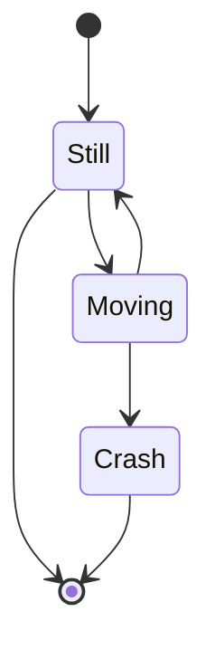

<h1 align="left">
  <br>
  
  <br>
  Industrial Automation
  <br>
</h1>

Course AutB/AAut/ADP,  *select one and delete others*


Author 1: [first name.last name](mailto:first_name.last_name@hevs.ch)
Author 2..3... if any.

# Lab title...

## Goal of the lab
Your summary in some lines
1.   ....
1.   ....

---

## Form of document
1.  Text documents in **.md** format. See [MD Basic Syntax as reference](https://www.markdownguide.org/basic-syntax/)
2.  Any text script between tags, e.g.
    1.  ```iecst``` for IEC 61131-3 structured text.
    2.  ```js``` for javascript.
3.  Any image in the **img** folder.
4.  Any other document than md file or image in **documents** folder.
5.  Any other page with link to the page.
6.  Any diagram, i.e. UML, state machine or other in mermaid form. Do not forger ```mermaid tags```

**Finally**: zip all documents with last name of all authors as ``zip_name.zip`` and upload them in cyberlearn, *by mail if problems with cyberlearn*.



---

## Length of the document
About 150 to 200 lines, check your vs-code editor.

---

## Core of the document
Select the most relevant points and summarize them if necessary with text and diagrams. 

### About code
-   Quality of IEC 61131-3 code is as important as functionnality. ``It is always possible to make bad code work if you dedicate enough time to it.``
-   For POU code, it is better to separate core and header.

**Header**
```iecst
VAR
    ijStArray   : ARRAY [1..GVL_ARRAY_SIZE.I_MAX_SIZE] OF stArrayOfDint;
END_VAR
```

**Core**
```iecst
FOR iMyLoop := 1 TO GVL_ARRAY_SIZE.I_MAX_SIZE BY 1 DO
    FOR jMyLoop := 1 TO GVL_ARRAY_SIZE.J_MAX_SIZE BY 1 DO
        ijStArray[iMyLoop].jArray[jMyLoop] := iMyLoop * jMyLoop;
    END_FOR
END_FOR
```

---

## Tests
-   Summarize what you have done, eventually not done and why, e.g. time.
-   What you have teste.
-   What is working.

**e.g.**
|Subject      |Action      |Test  |Result|
|-------------|------------|------|------|
|Open gripper |Code written|Push button|Gripper opens|
|Code for FB_O300_DL|Code written|not done because of time|failed|
|Axis regulation|Modified parameters|Quality of regulation|Oscillations|
|...|...|...|...|

--- 
## What you have learned 
In one sentence. 


### What you did not understand.
In one sentence.


<!-- end of file. This document has 102 lines, written in about 45 minutes-->