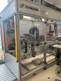

<h1 align="left">
  <br>
  
  <br>
  Industrial Automation Base
  <br>
</h1>

Course AutB

Author: [Cédric Lenoir](mailto:cedric.lenoir@hevs.ch)

# Repositories
- **This** repository contains all module for theory.
- The **LAB 0X** laboratories are all in separated repositories. [See links below on List of Labs](#industrial-automation-labs).

# List of Modules
[Module 00 Quick Start](./AutB_MOD_00_Quick_Start/README.md): Une brève introduction au monde du PLC

[Module 00 Quick Start DE](./AutB_MOD_00_Quick_Start/README_DE.md): Eine kurze Einführung in die Welt der SPS

---

[Module 01 Interface](./AutB_MOD_01_Interface/README.md): Gestion des interfaces de l'automate.

[Module 01 Interface DE](./AutB_MOD_01_Interface/README_DE.md): Verwaltung von SPS-Schnittstellen.

---

[Module 02 Data Structure](./AutB_MOD_02_Data_Structure/README.md): Les structures de données.

[Module 03 Operation and Instruction](./AutB_MOD_03_Operation_And_Instruction/README.md): Les opération et instructions de base du langage IEC-61131-3.

[Module 04 Program Organisation Unit](./AutB_MOD_04_Program_Organisation_Unit/README.md): Les modules de programmation de IEC-61131-3

[Module 05 Robust Programming with State Machine](./AutB_MOD_05_Robust_Programming_With_State_Machine/README.md): Utilisation des machines d'état pour une programmation robuste.

[Module 06 Introduction_To_Pack](./AutB_MOD_06_Introduction_To_Pack/README.md): Introduction to PackML states.

[Module 07 Mechatronics Soft](./AutB_MOD_07_Mechatronics_Soft/README.md): La structure et le fonctionnement d'un axe électrique.

[Module 08 Motion Control with PLCopen](./AutB_MOD_08_Motion_Control_With_PLCopen/README.md): Utilisation d'une bibliothèque de fonctions standard pour le pilotage d'un mouvemement.

[Module 09 Synchronized Motion with Real-Time Ethernet](./AutB_MOD_09_Synchronized_Motion_With_Real_Time_Ethernet/README.md): Utilisation des propriétés d'un Ethernat Real-time pour asservir un axe par une tâche cyclique de l'automate.

[Module 10 OPC-UA and Industrial Network](./AutB_MOD_10_OPC_UA/README.md): Un bref aperçu des réseaux indutriels et protocoles de communication.

[Module 11 Design Specification](./AutB_MOD_11_Design_Specification/README.md) L'ancien module méchatronics hard dont le concept est revu.

# Industrial Automation Labs

- [autb-lab-01](https://github.com/hei-synd-autb/autb-lab-01) Quick Start, a kind of Hello PLC World!
- [autb-lab-02](https://github.com/hei-synd-autb/autb-lab-02) A data structure to manage a conveyor
- [autb-lab-03](https://github.com/hei-synd-autb/autb-lab-03) A function block for a sensor
- [autb-lab-04](https://github.com/hei-synd-autb/autb-lab-04) A function block for an actuator
- [autb-lab-05](https://github.com/hei-synd-autb/autb-lab-05) Mise en service d'un axe électrique couplé à un entraînement mécanique
- [autb-lab-06](https://github.com/hei-synd-autb/autb-lab-06) Gestion d'un mouvement discret, MC_MoveAbsolute, basé sur PLCopen motion control.
- [autb-lab-07](https://github.com/hei-synd-autb/autb-lab-07) Gestion d'un mouvement basé sur un polynôme d'ordre 5.

# The LAB.
<figure>
    
    <figcaption>One Unit</figcaption>
</figure>

*English version only*

La plupart des logiciels utilisés dans le laboratoire d'automation sont libres ou disponibles en version limitée.
[La page suivante fournit la liste des logiciels et la manière de relier votre PC à la cellule automation](./AutB_LAB/readme.md).

Die meiste im Automatisierungslabor verwendete Software ist kostenlos oder in begrenzten Versionen verfügbar.
[Auf der folgenden Seite finden Sie eine Liste der Software und wie Sie Ihren PC mit der Automatisierungszelle verbinden](./AutB_LAB/readme.md).

## Description

All student documents for the [HEI-Vs](https://hevs.ch/synd) Engineering Course Basic Automation Autb

## How to use

Simply clone or download the repository.

### Windows

  ```bash
  mkdir -p c:/work
  cd /d c:/work
  git clone https://github.com/hei-synd-autb/autb-docs.git
  cd autb-docs
  ```

### Linux & Mac

  ```bash
  # clone repo
  mkdir -p ~/work
  cd ~/work
  git clone https://github.com/hei-synd-autb/autb-docs.git
  cd autb-docs
  ```

## Credits

* ZaS
* Cédric Lenoir

## Test Mermaid


## Find us on

[hevs.ch](https://www.hevs.ch) &nbsp;&middot;&nbsp;
LinkedIn [HES-SO Valais-Wallis](https://www.linkedin.com/groups/104343/) &nbsp;&middot;&nbsp;
Youtube [HES-SO Valais-Wallis](https://www.youtube.com/user/HESSOVS)
Twitter [@hessovalais](https://twitter.com/hessovalais) &nbsp;&middot;&nbsp;
Facebook [@hessovalais](https://www.facebook.com/hessovalais) &nbsp;&middot;&nbsp;
